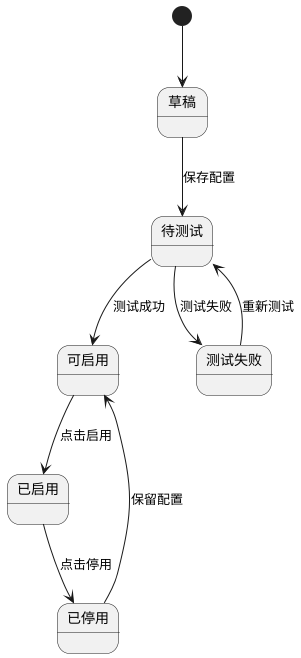
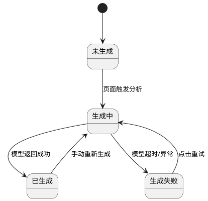
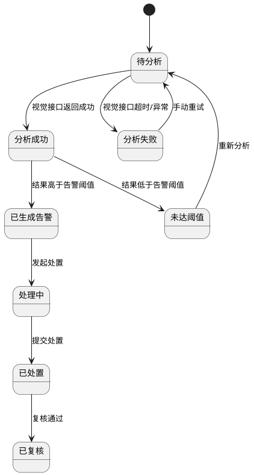

# PRD-智慧厨房管理平台-AI能力接入专项-v1.0

## 一、摘要

本 PRD 聚焦把项目内现有“AI mock/规则占位能力”升级为“真实 AI 接口能力”，首期范围限定为 3 个模块：

1. **系统管理-AI接口管理**
   目标：在系统管理中新增 `OpenAI 兼容 API` 配置管理，统一管理文本模型和视觉模型接入参数。
2. **菜谱营养管理-AI营养优化建议**
   目标：保留现有营养成分计算、达标判定、评分逻辑，在此基础上通过 `Gemma 4` 的 OpenAI 兼容接口生成真实中文营养优化建议。
3. **食品监控违规识别-AI视觉识别接入**
   目标：保留现有截图、违规事件流转、告警落库能力，替换当前测试触发/假数据路径，接入真实视觉识别接口；首期实际识别能力限定为 `未佩戴口罩`、`未佩戴厨师帽`。

默认遵循项目现有基线：

- 前端：Vue 3 + Vite + Pinia + Element Plus + Axios
- 后端：Spring Boot 3.2 + Spring Cloud + MyBatis Plus + MySQL 8.0 + JWT
- 配置：Nacos
- 微服务：新增能力优先落在 `common`、`recipe-service`、`device-service`、`sys-service`

---

## 二、文档元数据

### 2.1 项目基础信息

| 项目信息 | 内容                                                                                                          |
| ---- | ----------------------------------------------------------------------------------------------------------- |
| 项目名称 | 智慧厨房管理平台-AI能力接入专项                                                                                           |
| 项目类型 | Web应用 / 微服务系统                                                                                               |
| 核心价值 | 将现有营养分析和违规监控从假数据升级为真实 AI 接口能力，并统一纳入系统管理配置                                                                   |
| 技术栈  | Vue 3 + Vite + Pinia + Element Plus + Axios；Spring Boot 3.2 + Spring Cloud + MyBatis Plus + MySQL 8.0 + JWT |

### 2.2 功能模块索引

| 业务模块            | 主要页面                   | 优先级 | 状态  |
| --------------- | ---------------------- | --- | --- |
| 系统管理-AI接口管理     | AI服务配置页、AI服务详情页、连接测试弹窗 | P0  | 待开发 |
| 菜谱营养管理-AI营养优化建议 | 菜谱详情页、菜谱计划详情页、营养分析结果弹窗 | P0  | 待改造 |
| 食品监控-AI违规识别     | 截图分析触发页、违规事件列表页、违规详情页  | P0  | 待改造 |

### 2.3 文档职责说明

本文档聚焦业务需求，描述：

- AI 服务接入与配置管理的业务规则
- 营养分析模块如何调用真实文本模型生成建议
- 违规监控模块如何调用真实视觉识别接口生成事件
- 页面布局、字段业务含义、交互行为、状态流转、验收标准

本文档不包含：

- 数据库字段类型、索引、DDL
- API 报文 JSON 细节与错误码枚举
- Java DTO/VO/Entity 设计
- YOLO/Gemma 模型训练与推理实现细节

---

## 三、第一部分：产品需求概述

### 3.1 项目背景

当前系统中与 AI 相关的两个核心模块存在以下问题：

- 菜谱营养管理的“AI营养建议”入口已存在，但实际未接入真实模型，建议内容不具备生产可用性。
- 食品监控违规模块已有截图能力、事件流转与落库能力，但违规来源仍依赖测试触发或假数据，不具备真实识别能力。
- 系统管理中缺少统一的 AI 服务配置入口，模型地址、Key、模型名无法在系统内统一维护、测试、切换和审计。

### 3.2 项目目标

| 目标维度    | 具体目标                        | 成功衡量指标                        |
| ------- | --------------------------- | ----------------------------- |
| AI接入统一化 | 在系统管理中统一维护 OpenAI 兼容 API 配置 | 支持新增/编辑/启停/测试至少 2 类 AI 服务配置   |
| 营养建议真实化 | 营养分析结果可调用真实模型生成中文建议         | AI建议生成成功率 ≥ 95%，失败不阻断主流程      |
| 违规识别真实化 | 截图分析可触发真实视觉接口并生成正式违规事件      | 首期口罩/帽子识别链路打通，正式告警生成成功率 ≥ 95% |
| 可运维性    | AI 服务异常可感知、可降级、可追溯          | 所有 AI 请求有日志、状态、失败原因和测试入口      |

### 3.3 目标用户

| 用户类型         | 主要诉求                             |
| ------------ | -------------------------------- |
| 系统管理员        | 配置和维护 AI 服务，切换模型地址、Key、模型名，测试连通性 |
| 营养师 / 后厨主管   | 获取真实营养优化建议，辅助调整菜谱和排餐方案           |
| 食品安全员 / 值班主管 | 通过真实识别结果发现口罩/厨师帽违规并闭环处理          |
| 运维工程师        | 查看 AI 服务状态、失败原因、配置生效情况           |

---

## 四、第二部分：功能模块详细设计

## 4.1 系统管理-AI接口管理

### 4.1.1 模块概述

- 模块目标：统一管理平台内文本模型和视觉模型的 OpenAI 兼容 API 接入配置，避免在业务服务中写死地址和 Key。
- 核心功能：AI 服务配置、启停、连通性测试、用途绑定、调用日志查看。
- 用户角色：系统管理员、运维管理员。

### 4.1.2 页面设计

#### AI服务配置页

**页面路径：** `菜单 → 系统管理 → AI接口管理`  
**访问权限：** `系统管理员、运维管理员`  
**页面类型：** `列表页 + 表单页 + 测试弹窗 + 详情抽屉`

**布局要求：**

- 顶部区域：标题、服务类型筛选、启用状态筛选、关键字搜索
- 中部区域：AI 服务配置列表
- 底部区域：分页器
- 右侧抽屉：配置详情、最近测试记录、最近失败摘要

**字段定义（业务层面）：**

| 字段名称    | 业务含义             | 验证规则              | 展示要求          | UI组件建议 | 交互行为              |
| ------- | ---------------- | ----------------- | ------------- | ------ | ----------------- |
| 服务名称    | AI服务配置的人类可读名称    | 必填；1-50字符；全局唯一    | 列表首列展示        | 文本输入框  | 保存时校验唯一性          |
| 服务类型    | 区分文本模型或视觉模型      | 必填；取值：文本模型/视觉模型   | 标签展示          | 下拉选择器  | 切换类型后联动显示默认用途     |
| 接口地址    | OpenAI兼容 API 根地址 | 必填；合法 URL；最长255字符 | 列表缩略展示，详情全量展示 | 文本输入框  | 失焦时校验 URL 格式      |
| API Key | 调用服务的鉴权凭证        | 必填；保存时加密；详情脱敏展示   | 列表不展示明文       | 密码输入框  | 支持点击“显示/隐藏”且需二次确认 |
| 模型名称    | 实际调用的模型标识        | 必填；1-100字符        | 详情展示          | 文本输入框  | 支持复制              |
| 适用模块    | 该配置绑定的业务模块       | 必填；可多选：营养建议/违规识别  | 标签展示          | 多选下拉框  | 选择后影响业务调用路由       |
| 启用状态    | 当前配置是否可被业务使用     | 必填；默认停用           | 开关展示          | 开关组件   | 启用前必须通过至少一次连接测试   |
| 最近测试结果  | 最近一次测试成功或失败      | 非必填               | 列表状态图标展示      | 状态标签   | 点击查看测试详情          |

**操作按钮：**

- 新增配置 → 打开新建表单
- 编辑配置 → 修改地址、Key、模型名、适用模块
- 启用/停用 → 控制业务是否可用
- 测试连接 → 发起实时测试
- 查看日志 → 查看最近调用失败摘要

**交互规则：**

- 保存时必须校验服务名称唯一、地址合法、Key 非空、模型名非空。
- 启用前必须存在一条成功测试记录，否则阻断启用。
- 一个业务模块同一时刻仅允许有一条“主用配置”为启用状态；如需多配置并存，需区分用途或环境标签。
- API Key 在详情页默认脱敏，仅具备权限的管理员可临时查看。
- 配置修改后实时生效到后端调用层，不要求重启服务。

**业务逻辑：**

- 营养建议调用时按“文本模型 + 营养建议模块”路由到启用配置。
- 违规识别调用时按“视觉模型 + 违规识别模块”路由到启用配置。
- 测试连接需区分文本测试与视觉测试：
  - 文本测试：发送最小化文本 prompt
  - 视觉测试：发送平台内置测试图片或占位图像
- 所有测试和正式调用都要留日志，可追溯地址、模型、状态、耗时、失败原因。

**状态流转：**

---

## 4.2 菜谱营养管理-AI营养优化建议

### 4.2.1 模块概述

- 模块目标：在现有营养成分计算、达标判定和评分逻辑基础上，增加真实模型生成的中文优化建议。
- 核心功能：营养结果转 AI 建议、建议展示、失败降级、手动重试。
- 用户角色：营养师、后厨主管、食堂负责人。

### 4.2.2 页面设计

#### 菜谱计划详情页-AI营养建议区

**页面路径：** `菜单 → 菜谱营养管理 → 菜谱计划详情`  
**访问权限：** `营养师、后厨主管、食堂负责人`  
**页面类型：** `详情页内嵌分析区`

**布局要求：**

- 顶部区域：营养评分、达标率、人群画像摘要
- 中部区域：热量/蛋白质/碳水/脂肪/纤维/钠对比结果
- 下部区域：AI 优化建议卡片、重试按钮、失败提示

**字段定义（业务层面）：**

| 字段名称   | 业务含义         | 验证规则                   | 展示要求   | UI组件建议  | 交互行为      |
| ------ | ------------ | ---------------------- | ------ | ------- | --------- |
| 目标人群   | 本次排餐面向的人群画像  | 必填；取值来自现有人群枚举          | 顶部摘要展示 | 标签组件    | 修改后重新触发分析 |
| 健康状况   | 本次人群的特殊健康限制  | 可选；可多值                 | 摘要展示   | 标签组     | 修改后重新触发分析 |
| 营养达标率  | 当前计划营养达标菜谱占比 | 必填；0-100               | 指标卡展示  | 指标卡     | 点击查看不达标明细 |
| 综合评分   | 规则引擎计算出的营养评分 | 必填；0-100               | 圆形评分展示 | 仪表盘/评分卡 | 无写入操作     |
| AI优化建议 | 模型生成的中文建议文本  | 非必填；为空表示调用失败或未生成       | 独立卡片展示 | 多行文本卡片  | 支持手动重新生成  |
| 建议生成状态 | 当前建议是否成功生成   | 必填；取值：未生成/生成中/已生成/生成失败 | 状态标签展示 | 标签组件    | 失败时显示重试入口 |
| 建议生成时间 | 最近一次建议生成时间   | 非必填                    | 小字展示   | 文本      | 用于判断时效性   |

**操作按钮：**

- 重新生成建议 → 重新调用文本模型
- 查看规则分析明细 → 展开原始营养对比结果
- 复制建议 → 复制文本用于线下沟通

**交互规则：**

- 页面打开时先展示规则分析结果，再异步拉取 AI 建议。
- AI 建议生成中不阻塞页面主内容展示。
- 生成失败时展示“AI建议暂不可用”，并提供“重新生成建议”按钮。
- 如果系统管理中未启用对应文本模型配置，页面明确提示“未配置AI文本服务”。

**业务逻辑：**

- 规则分析继续由现有后端完成，AI 仅负责将结构化结果转成自然语言建议。
- Prompt 使用后端固定模板，不允许前端拼装。
- AI 返回文本需限制长度和格式，去除 Markdown、JSON 和免责声明。
- 建议不作为评分依据，仅作为辅助决策内容。

**状态流转：**

---

## 4.3 食品监控-AI违规识别接入

### 4.3.1 模块概述

- 模块目标：将当前依赖测试触发/假数据的违规事件来源替换为真实视觉识别接口。
- 核心功能：截图触发识别、置信度判定、正式告警生成、分析记录留存。
- 用户角色：食品安全员、值班主管、设备管理员。

### 4.3.2 页面设计

#### 违规事件详情页

**页面路径：** `菜单 → 食品监控 → 违规事件详情`  
**访问权限：** `食品安全员、值班主管、设备管理员`  
**页面类型：** `详情页 + 图片预览区`

**布局要求：**

- 顶部区域：违规类型、告警等级、状态、发生时间
- 中部区域：截图预览、识别结果摘要、置信度信息
- 底部区域：处理记录、复核结果、原始分析任务入口

**字段定义（业务层面）：**

| 字段名称   | 业务含义        | 验证规则                  | 展示要求   | UI组件建议 | 交互行为            |
| ------ | ----------- | --------------------- | ------ | ------ | --------------- |
| 违规类型   | 识别出的违规种类    | 必填；首期仅允许：未佩戴口罩/未佩戴厨师帽 | 标签展示   | 标签组件   | 可按类型筛选          |
| 置信度    | 模型对违规结果的可信度 | 必填；0-1 或 0-100 转换展示   | 百分比展示  | 进度条/文本 | 低于阈值时不进入正式告警    |
| 识别说明   | 模型返回的违规摘要   | 非必填                   | 文本展示   | 文本块    | 用于辅助人工判断        |
| 截图来源   | 本次分析使用的截图记录 | 必填                    | 链接展示   | 链接文本   | 点击查看原截图         |
| 模型版本   | 本次识别使用的模型版本 | 必填                    | 小字展示   | 文本     | 用于复盘            |
| 分析任务状态 | 本次视觉分析任务结果  | 必填；取值：成功/失败/未达阈值/已告警  | 状态标签展示 | 标签组件   | 点击查看原始分析记录      |
| 正式告警状态 | 是否已生成正式违规事件 | 必填                    | 标签展示   | 标签组件   | 未达阈值时显示“仅分析未告警” |

**操作按钮：**

- 重新分析截图 → 重新调用视觉模型
- 查看原始分析记录 → 打开分析任务详情
- 发起处置 → 对正式告警进入处理流
- 标记误报 → 仅对正式告警开放

**交互规则：**

- 截图分析成功且结果超过阈值时，自动生成正式违规事件。
- 截图分析成功但低于阈值时，仅保留分析记录，不进入正式违规列表。
- AI 接口失败时，不生成正式告警，但保留失败记录供运维排查。
- 首期页面只展示 `未佩戴口罩`、`未佩戴厨师帽` 两类正式能力。

**业务逻辑：**

- 触发源统一从“截图”进入，不直接把测试事件当正式业务事件。
- 视觉模型返回原始识别结果后，由后端根据阈值决定是否生成正式告警。
- 正式违规事件继续沿用现有违规处理、复核、关闭流程。
- 原始分析记录独立保存，便于误报复盘、模型阈值调整和运维排查。

**状态流转：**

---

## 五、第三部分：非功能需求

### 5.1 性能要求

- AI 文本建议接口响应时间目标：`≤ 8 秒`
- AI 视觉截图分析接口响应时间目标：`≤ 5 秒`
- AI 调用失败不得阻断营养评分和违规事件列表等主业务读操作
- 系统管理中的连接测试结果需在 `10 秒` 内返回明确结论

### 5.2 安全要求

- API Key 必须加密存储，前端默认脱敏展示
- 仅系统管理员、运维管理员可查看和修改 AI 配置
- 所有 AI 调用必须记录请求时间、目标服务、模型名、耗时、状态、失败原因
- 截图与 AI 返回结果应纳入证据链和审计日志范围

### 5.3 兼容性要求

- 文本模型和视觉模型均按 `OpenAI 兼容 API` 思路设计接入层
- 允许未来替换底层供应商，但不改变业务模块调用入口
- 系统管理-AI接口管理必须支持至少 1 条文本模型配置和 1 条视觉模型配置并存

---

## 六、多角色审查记录

### 6.1 产品经理审查（2次）

**第1次审查结论**

- 需求边界清晰：本期聚焦“真实 AI 接口接入”，不扩展到模型训练和算法治理
- 用户价值明确：管理员可配置 AI 服务，业务用户可获得真实建议和真实识别结果
- 优化建议：明确“正式告警”和“仅分析未告警”的区分方式

**第2次审查结论**

- 模块拆分合理，优先级明确，通过产品侧审查

### 6.2 架构师审查（2次）

**第1次审查结论**

- 方案与现有微服务架构兼容，建议在 `common` 中抽象统一 AI 调用层
- 系统管理中新增 AI 配置模块合理，便于集中治理
- 风险提示：视觉模型接口失败率与截图质量强相关，必须有独立分析任务留存

**第2次审查结论**

- 技术路径可行，通过架构侧审查

### 6.3 开发工程师审查（2次）

**第1次审查结论**

- 营养模块改造成本可控，主要是接入统一 AI 客户端
- 违规模块需补“原始分析任务”与“正式告警”双层记录
- 系统管理模块需要新增前后端页面、接口、权限点、审计日志

**第2次审查结论**

- 开发依赖关系清晰，通过开发侧审查

### 6.4 测试工程师审查（2次）

**第1次审查结论**

- 验收点明确：真实接口调用成功、失败降级、配置启停、阈值分流、日志追溯
- 建议增加：未配置 AI 服务、Key 失效、接口超时、模型返回空结果的测试场景

**第2次审查结论**

- 可测性良好，通过测试侧审查

### 6.5 运维工程师审查（2次）

**第1次审查结论**

- 建议将 AI 服务配置纳入系统管理而不是写死 Nacos 文本，便于热更新和审计
- 必须支持连接测试、启停、失败日志查看
- 风险提示：需要控制日志敏感信息脱敏和 API Key 加密

**第2次审查结论**

- 运维可控，通过运维侧审查

---

## 七、验收重点

1. 系统管理中可新增并启用 `OpenAI 兼容 API` 配置，且可测试连接
2. 菜谱营养分析页面能展示真实模型输出的中文优化建议
3. AI 文本接口失败时，营养分析结果主流程不受影响
4. 食品监控违规模块能从真实截图分析生成正式违规事件
5. 低置信度分析结果不进入正式告警列表，只保留分析记录
6. 全链路具备日志、状态、失败原因、权限和审计能力

## 八、默认假设

- 文本建议能力使用现有 `Gemma 4` 多模态服务的 OpenAI 兼容接口
- 违规识别首期仍按真实视觉接口接入，但正式业务能力只开放 `口罩` 与 `厨师帽`
- 系统管理中的 AI 配置是平台级配置，不按普通业务角色开放
- 现有营养计算规则和违规事件处理流程继续保留，AI 只替换“假数据入口”和“建议生成入口”
