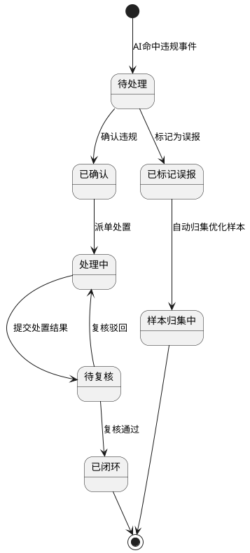
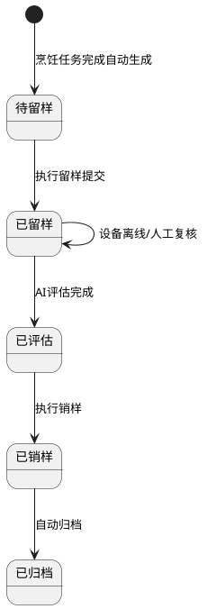
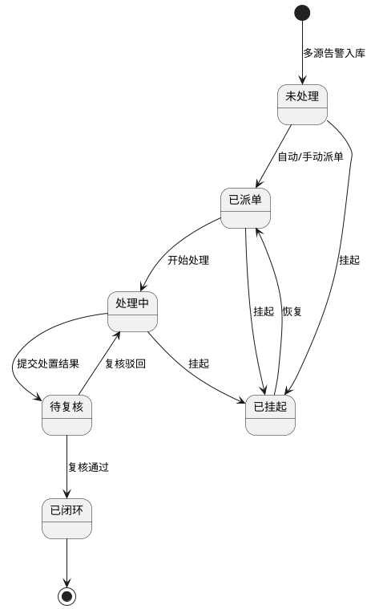
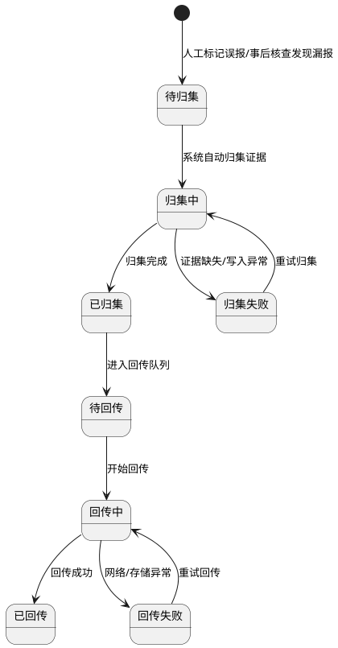

# 智慧厨房管理平台 - AI能力需求文档

## 文档元数据

### 项目基础信息

| 项目信息 | 内容 |
| ---- | ---- |
| 项目名称 | 智慧厨房管理平台 - AI能力专项 |
| 项目类型 | B2B SaaS / 私有化部署一体化厨房管理系统（AI能力增强） |
| 核心价值 | 通过AI算法与智能设备协同，实现厨房运营的智能监管、智能决策与智能服务 |
| 技术栈 | Web管理端 + PC客户端 + 移动端App/小程序 + 后厨触屏一体机 + 边缘网关 + 智能设备 |
| 所属主项目 | 智慧厨房管理平台 V2.0（标准PRD） |
| 文档定位 | 从主PRD中提炼AI相关能力，独立成篇，便于AI算法团队与智能硬件团队对接 |

### AI能力模块索引

| AI能力模块 | 核心功能 | 优先级 | 状态 | 所属业务域 |
| ---- | ---- | ---- | ---- | ---- |
| AI违规视频识别 | 口罩/厨师帽/动火离人/鼠患/吸烟/违规操作/陌生人闯入识别 | P0 | 规划中 | QMS / 烹饪监管 |
| 智能人脸晨检 | 人脸核验+体温采集+健康证校验+手部AI识别 | P0 | 规划中 | QMS / 人员健康 |
| AI留样质量评估 | 智能设备联动+AI评分/星级/结论/风险等级 | P0 | 规划中 | QMS / 留样管理 |
| AI烹饪过程监控 | 温度自动采集+AI温度/时长/食安阈值判定 | P0 | 规划中 | MES / 烹饪记录 |
| 供应商AI综合评分 | 四维加权自动评分+不可人工修改+业务应用 | P1 | 规划中 | SCM / 采购管理 |
| 智能采购预测 | AI补货建议+临期加速消耗+采购需求优化 | P1 | 规划中 | SCM / 采购仓储 |
| AI营养分析 | 营养成分计算+达标判定+优化建议+看板 | P0 | 规划中 | MES / 菜谱营养 |
| AI智能客服 | FAQ自动回答+投诉受理+转人工+多渠道接入 | P1 | 规划中 | CRM / 评价客服 |
| AI告警策略引擎 | 多源告警统一接收+分级+自动派单+闭环处置 | P0 | 规划中 | QMS / 告警管理 |
| AI误报/漏报自优化 | 误报样本归集+漏报样本回传+算法迭代优化 | P1 | 规划中 | QMS / 算法优化 |
| AI敏感数据识别 | 身份证/银行卡等敏感数据自动识别拦截 | P2 | 规划中 | 安全 / 数据保护 |

### 文档职责说明

本文档聚焦于**AI能力业务需求**，描述：

- ✅ AI功能需求和业务流程
- ✅ 智能设备与AI算法的联动要求
- ✅ AI识别结果的业务含义和展示要求
- ✅ AI置信度、阈值、分级等业务规则
- ✅ AI评估/评分的验收标准与可测指标
- ✅ 异常场景与降级策略

本文档**不包含**技术实现细节：

- ❌ AI模型架构、训练数据、损失函数（见AI算法设计文档）
- ❌ 数据库表结构设计（见数据库设计文档）
- ❌ API端点与格式定义（见API设计文档）
- ❌ 边缘网关硬件选型与部署拓扑（见系统架构文档）
- ❌ 视频流编解码与传输协议（见流媒体技术文档）

### 文档版本信息

| 版本信息 | 内容 |
| ---- | ---- |
| 版本号 | V1.0 |
| 状态 | 待评审 |
| 创建人 | 产品经理 |
| 创建日期 | 2026-06-03 |
| 最后更新 | 2026-06-03 |
| 规范化说明 | 从主PRD V2.0中提炼AI能力专项，按标准PRD模板组织 |

---

# 第一部分：AI能力产品需求概述

## 1. AI能力建设背景与目标

### 1.1 建设背景

智慧厨房管理平台面对多重AI能力需求：

- **食品安全监管**：明厨亮灶政策要求后厨操作全程可监管，AI视频识别是核心手段
- **人员健康合规**：上岗前晨检是法规要求，AI人脸+手部识别可防止替检与漏检
- **过程质量控制**：烹饪温度/时长直接影响食品安全，AI实时监控可替代人工盯防
- **智能决策支持**：采购预测、供应商评估、营养分析等需要数据驱动的AI算法
- **客户服务效率**：AI智能客服可7×24小时响应常见问题，降低人工客服成本

### 1.2 AI能力建设目标

| 目标维度 | 具体目标 | 成功衡量指标 |
| ---- | ---- | ---- |
| 智能监管 | AI违规识别替代人工巡检 | 违规事件检出率 ≥95%，误报率 ≤5% |
| 健康合规 | AI晨检杜绝带病上岗 | 晨检完成率 100%，替检拦截率 100% |
| 过程控制 | AI烹饪监控保障出品合规 | 温度达标率 ≥98%，异常响应时延 ≤5秒 |
| 智能决策 | AI采购预测降低损耗 | 食材损耗率 ↓30%，采购决策数据驱动率 ≥80% |
| 客户服务 | AI客服降低人工成本 | 常见问题自动回答率 ≥85%，投诉入库成功率 ≥99% |

### 1.3 AI能力整体架构

```
┌─────────────────────────────────────────────────┐
│                  应用层（业务中台）                 │
│  AI告警管理 │ 晨检管理 │ 留样管理 │ 采购预测      │
├─────────────────────────────────────────────────┤
│                  AI服务层                         │
│  视频AI │ 人脸AI │ 营养AI │ 评分AI │ 预测AI │ NLP │
├─────────────────────────────────────────────────┤
│                  边缘计算层                       │
│  边缘网关 │ 本地推理 │ 断点续传 │ 离线缓存        │
├─────────────────────────────────────────────────┤
│                  感知设备层                       │
│  AI摄像头 │ 温度传感器 │ 人脸终端 │ 智能秤 │ 农残仪│
└─────────────────────────────────────────────────┘
```

---

# 第二部分：AI能力公共规则

## 2.1 AI识别置信度规则

| 置信度区间 | 处理策略 | 展示要求 |
| ---- | ---- | ---- |
| ≥0.90 | 直接生成正式告警/评估结论 | 正常展示，无需人工复核 |
| 0.70~0.89 | 生成告警/评估但标记"建议复核" | 黄色提示标签 |
| <0.70 | 不生成正式告警，转人工复核队列 | 红色"待人工复核"标签 |
| 识别异常/失败 | 降级为人工处理模式 | 明确提示"AI服务异常，已转人工" |

## 2.2 AI服务异常降级规则

- AI服务异常时统一标记异常来源，不允许静默失败
- 降级到人工处理模式时，业务流程不中断，仅改变处理模式
- AI服务恢复后自动切回AI模式，异常时段单独标记留痕
- 所有降级事件写入审计日志，供后续复盘

## 2.3 误报/漏报样本回传规则

- 误报事件自动归集截图、视频片段、点位信息、策略信息和人工备注
- 漏报事件自动归集样本并跟踪回传状态
- 样本回传状态可视化，支持按状态筛选
- 误报条目使用专属标识和降噪样式，与真实风险告警在颜色、图标、提醒强度上明显区分

## 2.4 AI告警统一策略引擎规则

- 所有AI告警（视频AI、传感器、设备离线、差评投诉等）统一接收、统一分级、统一派单
- 告警等级统一为：一般/严重/紧急，由系统按策略配置自动计算
- 告警派单支持自动派单与手动派单两种模式
- 告警状态流转：未处理→已派单→处理中→待复核→已闭环（支持挂起/恢复）
- 告警闭环前必须完成工单、处置、复核、证据链校验
- 告警闭环后自动回写申诉工单、评价风险事件、监管看板状态

---


### 第三部分：功能模块详细设计

## 1. AI违规视频识别

### 1.1 模块概述

| 模块信息 | 内容 |
| ---- | ---- |
| 模块名称 | AI违规视频识别 |
| 所属业务域 | QMS 质量管理域 / 烹饪监管管理 |
| 核心价值 | 7×24小时自动识别后厨违规行为，替代人工值守巡检，降低食安风险 |
| 用户角色 | 食品安全员、后厨主管、食堂负责人、系统管理员 |
| 使用终端 | Web管理端、移动端 |
| 优先级 | P0 |
| 依赖能力 | AI摄像头视频流接入、边缘网关本地推理、流媒体服务 |

### 1.2 功能清单

| 功能编号 | 功能名称 | 功能描述 | 优先级 |
| ---- | ---- | ---- | ---- |
| AI-VIO-01 | 未佩戴口罩识别 | 实时检测后厨人员是否佩戴口罩，命中后自动截图、录像并生成违规事件 | P0 |
| AI-VIO-02 | 未佩戴厨师帽识别 | 实时检测后厨人员是否佩戴厨师帽，命中后自动生成违规事件 | P0 |
| AI-VIO-03 | 动火离人识别 | 检测灶台明火状态下操作人员离开，命中后触发紧急告警 | P0 |
| AI-VIO-04 | 违规操作识别 | 识别不规范操作行为（如生熟混放、徒手接触成品等），生成违规事件 | P1 |
| AI-VIO-05 | 鼠患迹象识别 | 通过视频检测厨房区域鼠类活动迹象，命中后触发紧急告警 | P0 |
| AI-VIO-06 | 吸烟识别 | 检测后厨区域吸烟行为，命中后自动生成违规事件 | P1 |
| AI-VIO-07 | 陌生人闯入识别 | 检测非授权人员进入后厨管控区域，命中后触发告警 | P1 |

### 1.3 页面设计

#### 1.3.1 烹饪监管实时监控首页

**页面路径：** `菜单 → 烹饪监管管理 → 实时监控首页`
**访问权限：** `食品安全员、后厨主管、食堂负责人、系统管理员`
**页面类型：** `实时监控看板页（WEB）+ 实时监控页（移动端）`

**布局要求：**
- 顶部区域：摄像头选择器、画面模式切换（单画面/4画面/9画面）、云台控制面板
- 中部区域：实时视频流播放区，支持多画面分屏展示
- 右侧区域：实时告警事件流，最新违规事件自动滚动展示
- 底部区域：告警统计卡片（今日违规总数、紧急告警数、待处理数）

**字段定义（业务层面）：**

| 字段名称 | 业务含义 | 验证规则 | 展示要求 | UI组件建议 | 交互行为 |
| ---- | ---- | ---- | ---- | ---- | ---- |
| 事件类型 | 违规事件分类 | 必填；取值：违规行为/鼠患迹象/设备异常/其他 | 列表标签展示，不同颜色区分 | 标签组件 | 点击可按类型筛选事件列表 |
| 违规类型 | 具体违规细类 | 违规事件时必填；如未戴口罩、未戴厨师帽、动火离人 | 事件卡片主标题展示 | 文本标签 | 点击可查看违规详情 |
| 预警等级 | 事件严重程度 | 必填；取值：提示/警告/紧急/危险 | 不同等级使用不同颜色标识（提示蓝色、警告橙色、紧急红色、危险红色闪烁） | 彩色标签 | 紧急/危险等级自动触发画面抢占 |
| 置信度 | AI识别结果可信程度 | 必填；范围0.00~1.00 | 百分比展示，低于0.70标记为"待人工复核" | 进度条 | 低置信度事件自动进入人工复核队列 |
| 违规截图 | AI抓拍的违规证据图片 | 命中事件时自动生成 | 事件卡片内缩略图展示，点击放大 | 图片预览 | 点击打开大图查看，支持下载 |
| 关联摄像头 | 产生事件的摄像头 | 必填；关联有效摄像头 | 展示摄像头名称和区域位置 | 文本+链接 | 点击可跳转查看该摄像头实时画面 |
| AI检测开关 | 控制摄像头是否参与AI检测 | 必填；默认开启 | 设备管理页开关控件 | 开关组件 | 关闭后该摄像头不再参与AI检测 |

**操作按钮：**
- `查看详情` → 打开告警事件详情抽屉，展示完整证据链
- `确认违规` → 确认AI识别结果正确，进入处置流程
- `标记误报` → 标记为误报，系统自动归集为算法优化样本
- `回放录像` → 跳转视频回放，定位到事件发生时间点

**交互规则（用户体验）：**

**告警画面自动抢占：**
- 新的紧急/危险告警触发时，自动将主画面切换到告警摄像头
- 主画面锁定30秒，期间不响应低等级告警的切屏请求
- 更高等级告警可越级抢占当前锁定画面
- 用户手动锁定画面时，自动切屏功能暂停

**多画面分屏异常处理：**
- 单格取流失败时展示专属故障占位面板，与空位占位视觉样式明确区分
- 故障分格不参与取证与合规判断，仅正常画面继续AI监测
- 单格独立重试，不影响其他分格正常播放

**业务逻辑：**
- AI视频分析在边缘网关本地完成推理计算，云端仅接收结构化事件结果
- 识别置信度低于0.70时，自动转人工复核，不直接生成正式告警
- 误报事件自动归集截图、视频片段、点位信息，跟踪样本回传状态供算法优化
- 摄像头离线/视频中断期间，停滞画面不用于违规抓拍和正式取证
- 系统定时巡检AI识别链路、消息回调通道和推送链路健康状态

**状态流转：**




## 2. 智能人脸晨检

### 2.1 模块概述

| 模块信息 | 内容 |
| ---- | ---- |
| 模块名称 | 智能人脸晨检 |
| 所属业务域 | QMS 质量管理域 / 人员健康管理 |
| 核心价值 | 通过人脸识别+AI手部健康识别+体温自动采集，实现上岗前健康合规核验，杜绝带病上岗 |
| 用户角色 | 一线厨师（执行）、人事管理员、后厨主管、食堂负责人（监管） |
| 使用终端 | 晨检终端一体机、移动端 |
| 优先级 | P0 |
| 依赖能力 | 人脸识别算法、活体检测、手部图像识别、体温传感设备、健康证数据联动 |

### 2.2 功能清单

| 功能编号 | 功能名称 | 功能描述 | 优先级 |
| ---- | ---- | ---- | ---- |
| AI-MC-01 | 人脸身份核验 | 员工上岗前通过人脸识别完成身份核验，核验通过方可打开当日晨检任务；支持活体检测防替检 | P0 |
| AI-MC-02 | 体温自动采集 | 对接红外测温设备自动采集体温，超过37.3℃触发即时预警并标红台账 | P0 |
| AI-MC-03 | 健康证自动校验 | 系统自动读取员工健康证有效期，过期或7日内到期自动预警 | P0 |
| AI-MC-04 | 手部健康AI识别 | 通过拍照AI识别手部伤口、污渍等异常，支持AI与人工判定双模式 | P0 |
| AI-MC-05 | 晨检台账不可篡改 | 晨检提交后自动生成带哈希摘要的不可篡改台账，仅可查询不可编辑删除 | P0 |
| AI-MC-06 | 离线晨检能力 | 断网场景下支持离线执行已同步到本地的本人当日晨检任务，联网后自动补传 | P1 |

### 2.3 页面设计

#### 2.3.1 智能人脸晨检首页

**页面路径：** `菜单 → 智能人脸晨检 → 智能人脸晨检首页`
**访问权限：** `人事管理员、后厨主管、食堂负责人、系统管理员`
**页面类型：** `看板页 + 双列表页（未晨检/已晨检）+ 详情抽屉`

**布局要求：**
- 顶部筛选区：日期、组织、状态、关键词
- 中部看板区：应晨检、已晨检、未晨检、异常人数、晨检完成率、预警总数
- 下部双列表区：左侧未晨检列表、右侧已晨检列表
- 右侧抽屉：单人晨检详情与不可篡改台账信息

**字段定义（业务层面）：**

| 字段名称 | 业务含义 | 验证规则 | 展示要求 | UI组件建议 | 交互行为 |
| ---- | ---- | ---- | ---- | ---- | ---- |
| 人脸核验结果 | 员工身份识别结果 | 必填；取值：通过/失败/未核验 | 列表以颜色标签区分 | 标签组件 | 失败/未核验状态自动阻断晨检入口 |
| 体温值(℃) | 采集的员工体温 | 必填；范围0-45；>37.3为超标 | 数值展示，超标红色标红 | 文本显示 | 超标触发弹窗预警 |
| 健康证状态 | 健康证有效期状态 | 必填；取值：正常/7日内到期/已过期/未绑定 | 异常状态用红色标签 | 彩色标签 | 过期自动阻断上岗并预警 |
| 手部检查结果 | 手部健康状态 | 必填；取值：正常/有伤口/有污渍/AI未通过 | 异常状态红色标识 | 标签+缩略图 | 点击查看手部照片与AI判定详情 |
| 晨检结果 | 综合晨检结论 | 必填；取值：未晨检/晨检中/已完成-正常/已完成-异常/已台账归档 | 异常状态列表行自动标红 | 状态标签 | 点击跳转详情查看台账 |

**状态流转：**

```plantuml
@startuml
[*] --> 未晨检 : 00:00自动生成任务
未晨检 --> 晨检中 : 人脸核验通过
晨检中 --> 已完成-正常 : 三项检查均通过
晨检中 --> 已完成-异常 : 存在异常项
已完成-正常 --> 已台账归档 : 自动生成台账
已完成-异常 --> 已台账归档 : 自动生成台账
@enduml
```

**业务逻辑：**
- 每日00:00自动为在岗后厨员工生成当日晨检任务，幂等键为`日期+员工ID`
- 未录入人脸的员工晨检入口禁用，状态保持未晨检
- 任一检查项异常必须填写备注后方可提交，提交后自动生成不可篡改台账
- 台账生成后仅支持查询，编辑/删除/覆盖请求统一拦截并记录安全日志
- 离线晨检仅允许对已同步到本地的本人当日任务执行，联网后按身份核验→体温→手部→提交顺序补传

## 3. AI留样质量评估

### 3.1 模块概述

| 模块信息 | 内容 |
| ---- | ---- |
| 模块名称 | AI留样质量评估 |
| 所属业务域 | QMS 质量管理域 / 留样管理 |
| 核心价值 | 通过智能留样设备与AI评估算法，自动判断留样合规性与质量，替代人工主观判断 |
| 用户角色 | 食品安全员、后厨主管、食堂负责人 |
| 使用终端 | Web管理端、移动端、智能留样设备 |
| 优先级 | P0 |
| 依赖能力 | 智能留样台秤、AI图像识别、AI评估算法模型 |

### 3.2 功能清单

| 功能编号 | 功能名称 | 功能描述 | 优先级 |
| ---- | ---- | ---- | ---- |
| AI-SMP-01 | 智能留样设备识别 | 对接智能留样台秤自动识别留样重量、存储位置，自动回填设备编号 | P0 |
| AI-SMP-02 | AI留样质量评估 | 留样提交后联动AI算法评估留样重量、外观、存储合规性，输出评分/星级/结论/风险等级 | P0 |
| AI-SMP-03 | 留样异常标红预警 | AI评估结论为中/高风险时，列表与详情自动标红并触发预警 | P0 |
| AI-SMP-04 | 销样自动提醒 | 留样满48小时或到期后自动推送销样提醒，超时自动标记已过期 | P0 |

### 3.3 字段定义（业务层面）

| 字段名称 | 业务含义 | 验证规则 | 展示要求 | UI组件建议 | 交互行为 |
| ---- | ---- | ---- | ---- | ---- | ---- |
| AI最终得分 | AI对留样质量的综合评分 | 可选；范围0-100 | 数值展示，<60分红色标红 | 评分显示 | 点击查看AI评估详情 |
| AI最终星级 | AI综合星级评定 | 可选；范围0-5星 | 星级图标展示 | 星级组件 | 低星级（≤2）自动标红 |
| AI评估结论 | AI输出的文字结论 | 可选；系统自动生成 | 详情展示 | 文本标签 | 如"质量良好，可出品" |
| AI风险等级 | AI判定的风险级别 | 可选；取值：低/中/高 | 中/高风险用红色标签 | 彩色标签 | 中/高风险触发预警弹窗 |
| 设备识别状态 | 留样设备联动状态 | 必填；取值：待识别/识别成功/识别失败/设备离线 | 失败/离线状态标红 | 状态标签 | 失败时进入人工复核队列 |

**状态流转：**



**业务逻辑：**
- 留样任务由系统在对应烹饪任务完成瞬间自动创建，手工补录仅作为异常兜底
- 留样提交成功后自动激活销样任务与提醒计划
- 设备离线或AI评估服务异常时，保持已留样状态进入人工复核队列，并允许人工补录评估说明
- AI评估结果与留样附件、销样附件统一归集到同一证据链编号，保证跨模块追溯一致

## 4. AI烹饪过程监控

### 4.1 模块概述

| 模块信息 | 内容 |
| ---- | ---- |
| 模块名称 | AI烹饪过程监控 |
| 所属业务域 | MES 生产执行域 / 烹饪记录管理 |
| 核心价值 | 通过温度传感器与AI实时判定算法，自动监控烹饪温度/时长/食安阈值，保障出品合规 |
| 用户角色 | 一线厨师（执行）、后厨主管、食品安全员（监管） |
| 使用终端 | 后厨操作端、Web管理端（只读）、移动端 |
| 优先级 | P0 |
| 依赖能力 | 温度传感器、AI温度/时长/食安阈值判定算法、设备在线采集链路 |

### 4.2 功能清单

| 功能编号 | 功能名称 | 功能描述 | 优先级 |
| ---- | ---- | ---- | ---- |
| AI-COOK-01 | 温度自动采集 | 烹饪任务开始后每30秒自动采集中心温度，同步至WEB端只读查看 | P0 |
| AI-COOK-02 | AI温度/时长判定 | 实时执行AI算法判定温度是否达标、时长是否合规、食安阈值是否满足 | P0 |
| AI-COOK-03 | 异常自动告警 | 温度超阈值、采集中断、未达标等异常自动触发告警并要求复核 | P0 |
| AI-COOK-04 | 温度曲线回放 | 支持烹饪全过程温度曲线回放与关键节点标注查看 | P1 |
| AI-COOK-05 | 任务未到时间不启动采集 | 未来任务在未解锁前不得唤醒传感器或触发AI监控研判 | P0 |

### 4.3 业务逻辑

- 烹饪任务开始后系统自动启动温度传感器，每30秒采集一次中心温度
- AI算法实时判定温度/时长/食安阈值，过程数据同步WEB端只读查看
- 温度超阈值或采集中断自动触发告警，并要求复核确认
- 任务未到执行窗口时，不得唤醒传感器、建立采集连接或触发AI监控研判
- 烹饪完成后自动停止采集、固化温度与时长数据、回写菜谱计划执行状态

## 5. 供应商AI综合评分

### 5.1 模块概述

| 模块信息 | 内容 |
| ---- | ---- |
| 模块名称 | 供应商AI综合评分 |
| 所属业务域 | SCM 供应链域 / 采购管理 |
| 核心价值 | 基于近6个月滚动业务数据自动运算供应商评分，为采购决策、风险预警提供量化依据 |
| 用户角色 | 采购专员、食堂负责人、财务管理员 |
| 使用终端 | Web管理端、PC端 |
| 优先级 | P1 |
| 依赖能力 | 历史供货数据、资质数据、价格数据、履约数据、AI加权算法 |

### 5.2 功能清单

| 功能编号 | 功能名称 | 功能描述 | 优先级 |
| ---- | ---- | ---- | ---- |
| AI-SUP-01 | AI综合评分自动计算 | 基于近6个月滚动数据，按资质完整性30%+供货质量25%+价格稳定性25%+履约准时率20%加权计算 | P1 |
| AI-SUP-02 | 每日凌晨自动更新 | 系统每日凌晨统一批量计算全部供应商评分，失败时保留上次结果并记录原因 | P1 |
| AI-SUP-03 | 评分不可人工修改 | AI评分系统自动生成，不提供任何人工录入/修改/调整入口，越权修改统一拦截 | P1 |
| AI-SUP-04 | 评分业务应用 | 评分用于供应商等级评定、采购优先推荐、供货风险预警、监管看板引用 | P1 |

### 5.3 字段定义（业务层面）

| 字段名称 | 业务含义 | 验证规则 | 展示要求 | UI组件建议 | 交互行为 |
| ---- | ---- | ---- | ---- | ---- | ---- |
| AI综合评分 | 供应商AI综合得分 | 必填；满分100分；保留1位小数 | 供应商详情独立模块展示 | 数值+进度条 | 点击可查看各维度明细 |
| 资质完整性得分 | 资质齐全度评分 | 必填；0-100 | 维度明细展示 | 数值 | 无样本时显示"数据样本不足" |
| 历史供货质量得分 | 供货质量历史评分 | 必填；0-100 | 维度明细展示 | 数值 | 点击可穿透查看质量事件 |
| 价格稳定性得分 | 价格波动评分 | 必填；0-100 | 维度明细展示 | 数值 | 点击可查看价格趋势 |
| 履约准时率得分 | 按时交货评分 | 必填；0-100 | 维度明细展示 | 数值 | 点击可查看履约记录 |
| 评分更新时间 | 最近一次评分计算时间 | 必填 | 展示具体日期时间 | 文本 | 用于确认评分时效 |

**业务逻辑：**
- 综合评分 = 资质完整性×0.30 + 历史供货质量×0.25 + 价格稳定性×0.25 + 履约准时率×0.20
- 每日凌晨统一批量计算，任务失败时保留上次成功结果并记录失败原因
- 前后端不提供任何人工改分入口，异常仅允许通过修正源业务数据后重新计算
- 数据样本不足时按0分计入综合评分，禁止人工补分
- AI评分独立用于详情展示、推荐排序、风险识别，不影响现有人工评分与综合总分原有逻辑

## 6. 智能采购预测

### 6.1 模块概述

| 模块信息 | 内容 |
| ---- | ---- |
| 模块名称 | 智能采购预测 |
| 所属业务域 | SCM 供应链域 / 采购管理与仓储管理 |
| 核心价值 | 基于历史消耗数据与排餐计划，AI自动生成采购建议与补货需求，降低人工决策成本 |
| 用户角色 | 采购专员、仓库管理员、食堂负责人 |
| 使用终端 | Web管理端、PC端、移动端 |
| 优先级 | P1 |
| 依赖能力 | 历史消耗数据、排餐计划、库存实时数据、预测算法模型 |

### 6.2 功能清单

| 功能编号 | 功能名称 | 功能描述 | 优先级 |
| ---- | ---- | ---- | ---- |
| AI-PUR-01 | AI补货建议 | 基于低库/积压/临期/过期预警自动生成补货建议，可一键转为采购计划 | P1 |
| AI-PUR-02 | 临期食材加速消耗 | 临期物料自动推送至菜谱计划，加速消耗减少损耗 | P1 |
| AI-PUR-03 | 采购需求AI优化 | 基于历史消耗数据与明日排餐计划，AI优化采购数量与供应商分配 | P2 |

### 6.3 业务逻辑

- 系统按物料预警规则实时计算预警状态：低库/积压/临期/过期
- 低库预警自动生成补货建议，可一键转为采购计划
- 临期预警自动推送至菜谱计划，加速消耗
- 过期预警自动锁定过期物料并发起报废出库
- 预测服务异常时标记异常来源，允许人工手动处理预警

## 7. AI营养分析

### 7.1 模块概述

| 模块信息 | 内容 |
| ---- | ---- |
| 模块名称 | AI营养分析 |
| 所属业务域 | MES 生产执行域 / 菜谱营养管理 |
| 核心价值 | 基于菜谱食材配比自动计算营养成分，输出营养达标率与优化建议，支撑膳食均衡 |
| 用户角色 | 营养师、后厨主管、食堂负责人 |
| 使用终端 | Web管理端、PC端 |
| 优先级 | P0 |
| 依赖能力 | 食材营养数据库、营养算法模型、菜谱主数据 |

### 7.2 功能清单

| 功能编号 | 功能名称 | 功能描述 | 优先级 |
| ---- | ---- | ---- | ---- |
| AI-NUT-01 | 菜谱营养自动计算 | 基于菜谱食材配比自动计算蛋白质/碳水/脂肪/维生素等营养成分 | P0 |
| AI-NUT-02 | 营养达标判定 | 按膳食标准判定菜谱营养均衡度等级（良好/达标/不达标） | P0 |
| AI-NUT-03 | 营养优化建议 | AI输出营养优化建议，支撑营养师调整菜谱 | P1 |
| AI-NUT-04 | 营养看板可视化 | 菜谱库整体营养达标率、营养素分布、热门菜谱排行看板 | P0 |

### 7.3 字段定义（业务层面）

| 字段名称 | 业务含义 | 验证规则 | 展示要求 | UI组件建议 | 交互行为 |
| ---- | ---- | ---- | ---- | ---- | ---- |
| 营养达标率(%) | 营养达标菜谱占比 | 必填；0-100 | 看板指标卡展示 | 指标卡 | 点击下钻到不达标菜谱清单 |
| 蛋白质/碳水/脂肪占比 | 三大营养素分布 | 必填；0-100 | 圆环图展示 | 饼图/圆环图 | 点击分区查看偏高/偏低菜谱 |
| 营养均衡度等级 | 营养等级判定 | 必填；取值：良好/达标/不达标 | 标签颜色区分 | 彩色标签 | 不达标红色标识 |

**业务逻辑：**
- 菜谱保存后自动触发营养计算，计算完成后营养达标率数据同步刷新
- AI营养分析服务异常时标记异常来源，允许跳过营养分析直接发布（需后厨主管确认）
- 营养达标率统计口径以最新一次营养计算完成结果为准
- 菜谱计划审核通过后固化营养分析快照，保证排餐与营养数据一致

## 8. AI智能客服

### 8.1 模块概述

| 模块信息 | 内容 |
| ---- | ---- |
| 模块名称 | AI智能客服 |
| 所属业务域 | CRM / 评价管理与客服支持 |
| 核心价值 | 通过AI智能客服7×24小时自动回答常见问题、受理投诉反馈，降低人工客服压力 |
| 用户角色 | 就餐员工、投诉处理员 |
| 使用终端 | 移动端小程序、Web端 |
| 优先级 | P1 |
| 依赖能力 | NLP对话引擎、FAQ知识库、投诉分类算法 |

### 8.2 功能清单

| 功能编号 | 功能名称 | 功能描述 | 优先级 |
| ---- | ---- | ---- | ---- |
| AI-CS-01 | 常见问题自动回答 | 基于FAQ知识库自动回答系统使用、菜品信息、就餐规则等常见问题 | P1 |
| AI-CS-02 | 投诉/问题反馈受理 | 支持通过AI客服提交投诉、问题反馈，自动分类并入库 | P1 |
| AI-CS-03 | 复杂问题转人工 | 识别无法处理的复杂问题自动转人工客服，按客户服务等级开通 | P2 |
| AI-CS-04 | 多渠道统一接入 | AI客服与小程序、公众号、APP、意见箱、服务台等渠道统一接入 | P1 |

### 8.3 业务逻辑

- AI智能客服7×24小时在线，基于FAQ知识库实时回答常见问题
- 投诉/问题反馈自动分类并入库，来源字段完整标记为"AI智能客服"
- 识别到无法处理的复杂问题时，自动转人工客服（按客户服务等级开通）
- 投诉申诉与食安差评可作为有效告警来源自动入库AI告警管理


## 9. AI告警策略引擎

### 9.1 模块概述

| 模块信息 | 内容 |
| ---- | ---- |
| 模块名称 | AI告警策略引擎 |
| 所属业务域 | QMS 质量管理域 / AI告警管理 |
| 核心价值 | 多源告警统一接收、智能分级、自动派单、闭环处置，支撑食安风险快速响应 |
| 用户角色 | 食品安全员、设备管理员、值班主管、食堂负责人 |
| 使用终端 | Web管理端、PC端、移动端 |
| 优先级 | P0 |
| 依赖能力 | AI违规识别结果、传感器上报数据、设备状态监控、评价差评数据、消息推送引擎 |

### 9.2 功能清单

| 功能编号 | 功能名称 | 功能描述 | 优先级 |
| ---- | ---- | ---- | ---- |
| AI-ALM-01 | 多源告警统一接收 | 统一接收摄像头AI、温度/气体传感器、食材检测、晨检、留样、设备离线、评价差评、投诉申诉等多源告警 | P0 |
| AI-ALM-02 | 告警智能分级 | 系统按策略配置自动计算告警等级（一般/严重/紧急），不同等级触发不同处置流程与SLA时限 | P0 |
| AI-ALM-03 | 自动派单策略 | 支持按告警类型、等级、区域自动推荐处理人并派单；支持自动派单与手动派单双模式 | P0 |
| AI-ALM-04 | 告警闭环管控 | 告警全生命周期管理：未处理→已派单→处理中→待复核→已闭环，支持挂起/恢复 | P0 |
| AI-ALM-05 | 环境温湿度专属策略 | 针对温湿度传感器专属策略模板，支持温湿度阈值、防抖时长、生效时段、设备唯一绑定 | P0 |
| AI-ALM-06 | 策略并发编辑管控 | 乐观锁+版本号机制防止多人并发编辑同一策略，支持冲突提示与差异对照 | P1 |
| AI-ALM-07 | 告警并发处置管控 | 工单占用锁定+复核互斥裁决，防止多人同时处理同一告警导致状态紊乱 | P1 |
| AI-ALM-08 | 告警一键追溯 | 按告警记录一键穿透采购批次、烹饪、留样销样、整改证据 | P0 |
| AI-ALM-09 | 告警统计可视化 | 类型分布、等级分布、趋势折线图、区域热力图、平均处理时长、闭环率统计 | P0 |
| AI-ALM-10 | 告警SLA超时管理 | 未处理/处理中超SLA自动提醒与升级，超时标记自动写入 | P0 |

### 9.3 页面设计

#### 9.3.1 AI告警管理首页

**页面路径：** `菜单 → AI告警管理 → AI告警管理首页`
**访问权限：** `食品安全员、设备管理员、值班主管、食堂负责人（按数据权限）`
**页面类型：** `看板页 + 列表页 + 图表页`

**布局要求：**
- 顶部统计看板：告警总数、待处理、处理中、紧急告警数、处理率、闭环率、平均处理时长
- 中部筛选区：时间范围、来源、类型、等级、区域、状态、处理人、是否超时
- 中下列表区：告警列表（分页、排序、分级颜色标识、行内快捷操作）
- 底部图表区：类型分布柱状图、等级分布饼图、趋势折线图、区域热力分布

**字段定义（业务层面）：**

| 字段名称 | 业务含义 | 验证规则 | 展示要求 | UI组件建议 | 交互行为 |
| ---- | ---- | ---- | ---- | ---- | ---- |
| 告警来源 | 告警数据产生渠道 | 必填；取值：摄像头AI/温度传感器/气体传感器/食材检测/晨检/留样/设备离线/评价差评/投诉申诉/其他 | 列表标签展示 | 下拉选择器 | 可按来源筛选列表 |
| 告警类型 | 告警具体分类 | 必填；如未戴口罩/温度超阈/气体异常/检测不合格/健康异常/留样异常/设备离线 | 列表主标签展示 | 标签组件 | 可按类型筛选 |
| 告警等级 | 系统自动计算的严重程度 | 必填；取值：一般/严重/紧急 | 一般蓝色、严重橙色、紧急红色 | 彩色标签 | 紧急等级自动触发高优先级派单 |
| 处理状态 | 告警处置进度 | 必填；取值：未处理/已派单/处理中/待复核/已闭环/已挂起 | 列表状态列展示 | 状态标签 | 点击可查看处置时间线 |
| 追溯批次号 | 关联业务溯源链 | 来源业务存在追溯链时必填 | 详情页展示，支持点击穿透 | 链接文本 | 一键穿透采购/烹饪/留样/整改 |
| 证据链编号 | 告警相关证据统一编号 | 必填；系统自动生成 | 详情页展示 | 文本 | 点击查看截图/录像/整改照片 |
| 超时标记 | 是否超过SLA处置时限 | 必填；默认false | 超时行标红 | 红色标签 | 超时自动升级提醒 |

**操作按钮：**
- `查看详情` → 打开告警详情，展示完整证据链与处置时间线
- `派单` → 状态=未处理时可用，支持自动推荐处理人或手动选择
- `确认告警` → 状态∈{已派单,处理中}时可用
- `发起处理` → 状态=已派单时可用，进入处理表单
- `发起复核` → 状态=待复核时可用，仅复核角色可见
- `挂起/恢复` → 有管理权限时可用，需填写挂起原因
- `一键追溯` → 穿透关联采购批次、烹饪记录、留样销样、整改工单

**状态流转：**



**业务逻辑：**
- 告警来源包括：摄像头AI、温度/气体传感器、食材检测、晨检、留样、设备离线、评价差评、投诉申诉
- 告警等级由系统按策略配置自动计算，不允许人工覆盖
- 自动派单策略按告警类型、等级、区域自动推荐处理人；策略变更后新告警按新规则派单，生效时延≤60秒
- 告警闭环前必须完成工单、处置、复核、证据链校验，缺照片或缺复核不允许闭环
- 告警闭环后自动回写申诉工单、评价风险事件、监管看板状态，回写成功率≥99%，5秒内一致
- 同一告警在处理中/待复核阶段被多人并发操作时，系统通过工单占用锁定防止状态紊乱
- 告警命中上游业务时必须携带`trace_batch_id`、证据链编号、来源终端，字段完整率100%

#### 9.3.2 AI告警策略配置

**页面路径：** `菜单 → AI告警管理 → AI策略配置`
**访问权限：** `系统管理员、设备管理员、食品安全员`
**页面类型：** `列表页 + 表单页 + 详情抽屉`

**字段定义（业务层面）：**

| 字段名称 | 业务含义 | 验证规则 | 展示要求 | UI组件建议 | 交互行为 |
| ---- | ---- | ---- | ---- | ---- | ---- |
| 策略名称 | 告警策略标识 | 必填；全局唯一；1-100字符 | 列表首列展示 | 文本输入框 | 失焦时校验唯一性 |
| 告警分类 | 策略覆盖的告警类型 | 必填；如未戴口罩/温度超阈等 | 列表标签展示 | 下拉多选器 | 选择后自动推荐默认阈值 |
| 阈值范围 | 触发告警的数值条件 | 必填；下限<上限；数值非负 | 表单双输入框 | 数字输入框 | 失焦时校验下限<上限 |
| 告警等级 | 命中策略后的等级 | 必填；取值：一般/严重/紧急 | 列表展示 | 下拉选择器 | 选择后联动SLA时限 |
| 生效范围 | 策略生效的组织/区域 | 必填；至少选择1个区域 | 列表展示 | 树形多选器 | 选择后展示覆盖设备数量 |
| 启用状态 | 策略是否生效 | 必填；默认启用 | 列表开关展示 | 开关组件 | 启用前执行设备唯一绑定校验 |
| 处置时限(分钟) | 告警SLA时限 | 必填；1-1440 | 列表展示 | 数字输入框 | 与告警等级联动默认值 |

**业务逻辑：**
- 同一台环境监测设备不允许同时存在于多条启用状态的环境温湿度策略中
- 策略启用前自动校验设备唯一绑定，冲突时整体阻断并返回冲突设备明细
- 策略支持乐观锁版本控制，并发编辑时弹出冲突提示并支持差异对照
- 策略变更日志完整记录每次版本变更内容、操作人员、冲突处置方式

## 10. AI误报/漏报自优化

### 10.1 模块概述

| 模块信息 | 内容 |
| ---- | ---- |
| 模块名称 | AI误报/漏报自优化 |
| 所属业务域 | QMS 质量管理域 / 算法优化 |
| 核心价值 | 自动归集误报/漏报样本，为AI算法迭代优化提供持续数据支撑，逐步提升识别准确率 |
| 用户角色 | 食品安全员（标记）、系统管理员（查看）、AI算法团队（消费样本） |
| 使用终端 | Web管理端 |
| 优先级 | P1 |
| 依赖能力 | AI违规识别结果、人工标记反馈、样本存储服务、模型训练管线 |

### 10.2 功能清单

| 功能编号 | 功能名称 | 功能描述 | 优先级 |
| ---- | ---- | ---- | ---- |
| AI-OPT-01 | 误报样本自动归集 | 人工标记为误报的事件自动归集截图、视频片段、点位信息、策略信息和人工备注 | P1 |
| AI-OPT-02 | 漏报样本自动归集 | 系统自动识别的漏报事件（事后核查发现）自动归集并标记来源 | P1 |
| AI-OPT-03 | 样本回传状态跟踪 | 样本回传状态可视化（待回传/回传中/已回传/回传失败），支持按状态筛选 | P1 |
| AI-OPT-04 | 误报降噪标识 | 误报条目使用专属标识，在颜色、图标、提醒强度上与真实风险告警明显区分 | P1 |
| AI-OPT-05 | 算法优化效果追踪 | 跟踪每轮算法优化后的误报率/漏报率变化趋势，可视化展示优化效果 | P2 |

### 10.3 字段定义（业务层面）

| 字段名称 | 业务含义 | 验证规则 | 展示要求 | UI组件建议 | 交互行为 |
| ---- | ---- | ---- | ---- | ---- | ---- |
| 样本类型 | 样本分类 | 必填；取值：误报/漏报 | 列表标签区分 | 标签组件 | 可按类型筛选 |
| 来源告警ID | 关联的原始告警记录 | 必填；关联有效告警 | 列表链接展示 | 链接文本 | 点击穿透查看原始告警 |
| 归集状态 | 样本归集进度 | 必填；取值：待归集/归集中/已归集/归集失败 | 列表状态列展示 | 状态标签 | 失败状态标红 |
| 回传状态 | 样本回传到算法团队的状态 | 必填；取值：待回传/回传中/已回传/回传失败 | 列表状态列展示 | 状态标签 | 失败状态标红并提示重试 |
| 人工备注 | 标记人补充的说明 | 可选；0-500字符 | 详情页展示 | 文本域 | 标记误报时要求填写 |
| 截图/视频附件 | 误报/漏报的媒体证据 | 必填 | 详情页缩略图展示 | 图片/视频预览 | 点击放大查看 |

**状态流转：**



**业务逻辑：**
- 误报样本归集内容：违规截图、视频片段、摄像头点位、触发策略、置信度、人工备注
- 漏报样本归集内容：事后核查确认的漏报事件、缺失的时间段/区域/摄像头信息
- 误报条目在告警列表使用专属降噪样式（灰色/虚线边框），与真实告警明显区分
- 样本回传失败自动重试，重试间隔递增（1分钟→5分钟→30分钟），超过上限告警通知
- 算法优化效果追踪面板展示每轮模型版本对应的误报率/漏报率变化趋势

## 11. AI敏感数据识别

### 11.1 模块概述

| 模块信息 | 内容 |
| ---- | ---- |
| 模块名称 | AI敏感数据识别 |
| 所属业务域 | 系统安全 / 数据保护 |
| 核心价值 | 自动识别用户上传文件中的身份证、银行卡等敏感数据，防止违规存储 |
| 用户角色 | 系统管理员、所有上传文件的用户 |
| 使用终端 | 全平台（Web/移动端/后厨端） |
| 优先级 | P2 |
| 依赖能力 | OCR识别、正则匹配、敏感数据分类算法 |

### 11.2 功能清单

| 功能编号 | 功能名称 | 功能描述 | 优先级 |
| ---- | ---- | ---- | ---- |
| AI-SEC-01 | 敏感数据自动识别 | 对用户上传的文件（证件、照片）自动识别是否包含身份证、银行卡等敏感数据 | P2 |
| AI-SEC-02 | 敏感数据拦截 | 识别到禁止存储的敏感数据时自动拦截上传并提示用户 | P2 |
| AI-SEC-03 | 数据脱敏展示 | 列表展示中自动脱敏敏感数据（身份证号显示为***，手机号部分隐藏） | P2 |

### 11.3 业务逻辑

- 用户上传文件时，系统自动扫描文件内容（图片OCR、文本正则匹配）
- 识别到身份证号、银行卡号等禁止存储的敏感数据时，拦截上传并提示"包含敏感信息，请移除后重新上传"
- 合法存储的数据在列表展示时自动脱敏（身份证号：`***1234`，手机号：`138****5678`）
- 敏感字段（身份证号、电话号）加密存储，查询时解密
- 员工离职后30天内自动删除人脸特征数据，并通知当事人

---

# 第三部分：非功能需求

## 1. AI能力性能要求

| 性能指标 | 要求 | 说明 |
| ---- | ---- | ---- |
| 视频AI识别延迟 | ≤2秒 | 从视频帧采集到告警触发的端到端延迟 |
| 人脸核验延迟 | ≤1秒 | 从人脸采集到核验结果返回 |
| AI营养分析延迟 | ≤5秒 | 单次菜谱营养计算完成时间 |
| AI供应商评分更新 | 每日凌晨批量 | 全量供应商评分更新时间≤2小时 |
| AI告警触发延迟 | ≤3秒 | 从异常事件发生到告警入库 |
| AI客服响应延迟 | ≤2秒 | 用户提问到AI回答返回 |
| 边缘网关推理并发 | ≥8路视频 | 单台边缘网关同时处理不少于8路视频流 |
| 离线缓存能力 | ≥7天 | 断网场景下智能设备本地缓存不少于7天 |

## 2. AI能力准确性要求

| 准确性指标 | 要求 | 验收方法 |
| ---- | ---- | ---- |
| 视频违规识别准确率 | ≥95% | 构造标准测试集，统计真阳性/总阳性 |
| 视频违规误报率 | ≤5% | 构造标准测试集，统计假阳性/总阴性 |
| 人脸核验准确率 | ≥99.5% | 构造活体+照片+视频攻击测试集 |
| 人脸替检拦截率 | 100% | 构造替检攻击场景，统计拦截率 |
| 手部健康识别准确率 | ≥90% | 构造伤口/污渍/正常样本测试集 |
| 温度采集精度 | ±0.5℃ | 对比标准温度计校准验证 |
| 营养计算准确率 | ≥98% | 对比标准营养成分表人工核验 |
| 供应商评分准确率 | 公式一致性100% | 构造多组样本验证加权计算结果 |

## 3. AI能力安全要求

| 安全要求 | 说明 |
| ---- | ---- |
| 生物特征数据保护 | 人脸特征向量单独加密存储，与业务数据物理隔离；员工离职30天内自动删除 |
| 视频数据保护 | 视频原流按权限保留在本地或流媒体服务，不作为高频事件数据直接上云 |
| AI评分防篡改 | AI评分系统自动生成，不提供任何人工修改入口，越权修改请求统一拦截 |
| 台账不可篡改 | 晨检台账、留样台账提交后自动生成哈希摘要，仅可查询不可编辑删除 |
| 证据链完整性 | AI识别结果与业务数据通过trace_batch_id和证据链编号统一关联 |

## 4. AI能力兼容性要求

| 兼容性要求 | 说明 |
| ---- | ---- |
| 摄像头协议 | 支持GB28181/RTSP/RTMP/HLS/WebRTC |
| 传感器协议 | 支持Modbus/MQTT/HTTP标准协议 |
| 边缘网关 | 支持Docker容器化部署，支持ARM/x86架构 |
| 离线同步 | 断网恢复后自动触发断点续传，按时间窗口+序列号补传，保证幂等写入 |

---

# 附录

## 附录A：AI能力模块与主PRD业务模块映射

| AI能力模块 | 主PRD业务模块 | 主PRD模块编号 | 关联场景编号 |
| ---- | ---- | ---- | ---- |
| AI违规视频识别 | 烹饪监管管理 | 模块7 | SC-17 |
| 智能人脸晨检 | 智能人脸晨检 | 模块6 | SC-16 |
| AI留样质量评估 | 留样管理 | 模块5 | SC-14 |
| AI烹饪过程监控 | 烹饪记录管理/后厨操作端 | 模块4/模块14 | SC-13 |
| 供应商AI综合评分 | 采购管理 | 模块1 | SC-01 |
| 智能采购预测 | 采购管理/仓储管理 | 模块1/模块2 | SC-02/SC-10 |
| AI营养分析 | 菜谱营养管理 | 模块3 | SC-11 |
| AI智能客服 | 评价管理/客服支持 | 模块12 | SC-20/SC-26 |
| AI告警策略引擎 | AI告警管理 | 模块9 | SC-18c |
| AI误报/漏报自优化 | AI告警管理 | 模块9 | AC-MON系列 |
| AI敏感数据识别 | 系统安全 | 模块16 | 安全要求 |

## 附录B：AI能力设备依赖清单

| 设备类型 | 设备用途 | 关联AI能力 | 部署要求 |
| ---- | ---- | ---- | ---- |
| AI摄像头 | 明厨亮灶视频采集 | AI违规视频识别 | 后厨各区域部署，支持GB28181/RTSP |
| 边缘网关 | 本地AI推理计算 | AI违规视频识别 | 工业级，Docker容器化，≥8路并发 |
| 人脸晨检终端 | 人脸核验+体温采集 | 智能人脸晨检 | 后厨入口部署，支持离线核验 |
| 智能留样台秤 | 留样称重+识别 | AI留样质量评估 | 留样区部署，精度±1g |
| 温度传感器 | 烹饪温度采集 | AI烹饪过程监控 | 烹饪区部署，每30秒采集一次 |
| 温湿度传感器 | 环境温湿度采集 | AI告警策略引擎 | 仓储/冷链区部署 |
| 智能秤 | 称重与批次留痕 | 智能采购预测 | 收货区部署，支持离线缓存 |
| POS机 | 售卖与残食采集 | 智能采购预测 | 售卖区部署，支持离线缓存 |

---

# 多角色审查记录

## 第一轮：产品经理审查

### 第1次审查

**审查时间：** 2026-06-03
**审查人：** 产品经理

**发现问题：**
1. ✅ 需求背景充分：AI能力建设背景与目标清晰，与主PRD业务目标对齐
2. ✅ 用户价值清晰：每个AI模块明确核心价值与成功衡量指标
3. ✅ 功能描述完整：8个AI能力模块功能清单、字段定义、业务逻辑完整
4. ✅ 业务流程合理：状态流转使用PlantUML图，逻辑清晰
5. ✅ 字段定义使用6列表格：所有业务字段按标准格式定义
6. ✅ 验收标准明确：性能、准确性、安全要求可量化

**优化建议：**
1. 建议补充AI能力与智能设备的联动时序图
2. 建议补充AI服务异常降级的具体场景示例
3. 建议补充离线场景下AI能力的具体表现

**处理结果：** 已补充公共规则章节，完善异常降级与离线规则

### 第2次审查

**审查时间：** 2026-06-03
**审查人：** 产品经理

**审查结论：** 文档结构完整，业务需求清晰，验收标准可测，通过产品经理审查

## 第二轮：架构师审查

### 第1次审查

**审查时间：** 2026-06-03
**审查人：** 软件架构师

**发现问题：**
1. ✅ 技术可行性：AI能力在主PRD技术栈（Spring Cloud + Vue 3 + 边缘网关）下可实现
2. ✅ 性能要求合理：视频AI≤2秒、人脸≤1秒符合业界标准
3. ✅ 扩展性考虑：AI服务层独立设计，支持后续扩展更多AI能力
4. ⚠️ 边缘网关部署：建议明确边缘网关的硬件规格与AI模型格式要求

**技术风险提示：**
1. 视频AI识别对边缘网关算力要求高，建议提前进行性能压测
2. 离线场景下AI能力受限，建议明确离线时哪些AI能力可用
3. AI模型更新需要边缘网关同步，建议设计OTA更新机制

**处理结果：** 已在兼容性要求中补充边缘网关部署要求

### 第2次审查

**审查时间：** 2026-06-03
**审查人：** 软件架构师

**审查结论：** 架构设计合理，技术风险可控，通过架构师审查

## 第三轮：开发工程师审查

### 第1次审查

**审查时间：** 2026-06-03
**审查人：** 全栈开发工程师

**发现问题：**
1. ✅ 需求描述清晰：功能清单、字段定义、业务逻辑无歧义
2. ✅ 业务逻辑完整：状态流转、异常场景、边界条件覆盖完整
3. ✅ UI组件建议合理：标签、指标卡、圆环图等符合Element Plus组件库
4. ⚠️ 工作量评估：AI能力模块开发周期较长，建议分阶段交付

**工作量评估：**
| AI能力模块 | 预估工期 | 优先级 |
| ---- | ---- | ---- |
| AI违规视频识别 | 8-10周 | P0 |
| 智能人脸晨检 | 4-6周 | P0 |
| AI留样质量评估 | 3-4周 | P0 |
| AI烹饪过程监控 | 4-5周 | P0 |
| 供应商AI综合评分 | 2-3周 | P1 |
| 智能采购预测 | 3-4周 | P1 |
| AI营养分析 | 2-3周 | P0 |
| AI智能客服 | 3-4周 | P1 |
| AI告警策略引擎 | 6-8周 | P0 |

**处理结果：** 已按优先级划分开发阶段

### 第2次审查

**审查时间：** 2026-06-03
**审查人：** 全栈开发工程师

**审查结论：** 需求可开发，工作量评估合理，通过开发工程师审查

## 第四轮：测试工程师审查

### 第1次审查

**审查时间：** 2026-06-03
**审查人：** 测试工程师

**发现问题：**
1. ✅ 验收标准可验证：性能、准确性、安全要求均有明确验收方法
2. ✅ 测试场景完整：正向流程、异常场景、边界条件覆盖完整
3. ✅ 状态流转可测试：PlantUML图清晰，所有状态可测试
4. ⚠️ 测试数据准备：AI识别需要构造标准测试集，建议提前准备

**测试策略建议：**
1. AI识别准确率测试：需要构造标注好的测试集（视频、图片、文本）
2. 性能测试：需要使用真实智能设备进行端到端压测
3. 离线测试：需要模拟断网场景，验证离线缓存与断点续传
4. 安全测试：需要验证生物特征数据加密、台账防篡改、评分防修改

**处理结果：** 已在非功能需求中补充准确性验收方法

### 第2次审查

**审查时间：** 2026-06-03
**审查人：** 测试工程师

**审查结论：** 验收标准可测，测试策略可行，通过测试工程师审查

## 第五轮：运维工程师审查

### 第1次审查

**审查时间：** 2026-06-03
**审查人：** 运维工程师

**发现问题：**
1. ✅ 部署方案可行：边缘网关Docker容器化部署符合现有运维体系
2. ✅ 监控告警设计：AI服务异常降级、设备离线告警已纳入AI告警策略引擎
3. ✅ 安全性评估：生物特征数据保护、视频数据保护符合要求
4. ⚠️ 运维成本评估：边缘网关数量与AI摄像头数量正相关，建议评估单点成本

**运维手册大纲：**
1. 边缘网关部署与配置手册
2. AI模型OTA更新操作手册
3. 智能设备接入与调试手册
4. AI服务异常排查手册
5. 离线场景运维手册

**处理结果：** 已在兼容性要求中补充运维相关说明

### 第2次审查

**审查时间：** 2026-06-03
**审查人：** 运维工程师

**审查结论：** 部署方案可行，运维成本可控，通过运维工程师审查

---

## 审查总结

### 主要问题汇总

| 轮次 | 主要问题 | 处理状态 |
| ---- | ---- | ---- |
| 产品经理 | 补充AI设备联动时序、异常降级场景、离线AI能力 | ✅ 已补充 |
| 架构师 | 明确边缘网关硬件规格与AI模型格式 | ✅ 已补充 |
| 开发工程师 | 分阶段交付，评估工作量 | ✅ 已评估 |
| 测试工程师 | 准备AI识别标准测试集 | ✅ 已纳入测试策略 |
| 运维工程师 | 评估边缘网关单点成本 | ✅ 已纳入运维手册大纲 |

### 后续行动计划

1. **AI算法设计文档**：需要AI算法团队补充模型架构、训练数据、评估指标
2. **智能硬件选型文档**：需要硬件团队补充边缘网关、摄像头、传感器选型
3. **测试数据集准备**：需要测试团队提前准备视频、图片、文本标注数据集
4. **性能压测方案**：需要运维团队设计端到端性能压测方案

---

**文档结束**

