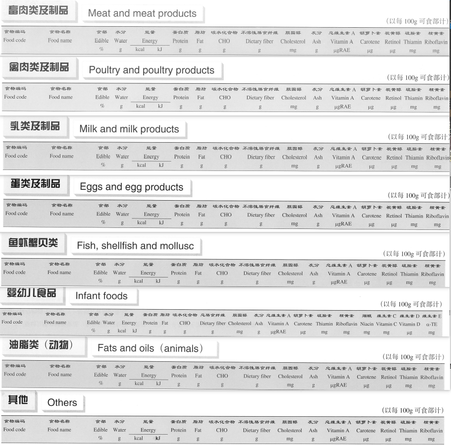
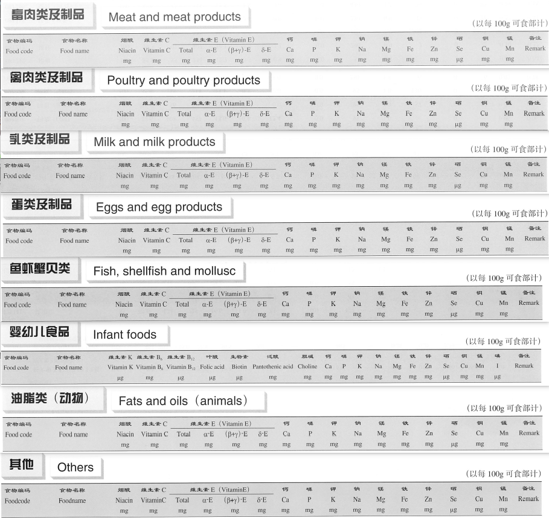

# 营养素截图分类统计报告

## 1. 总体统计

| 统计项     | 数量 | 忽略“婴幼儿食品”后 |
| ---------- | ---- | ------------------ |
| 大分类总数 | 16   | 15                 |
| 总文件数   | 308  | 254                |
| 总食品数   | 1869 | 1677               |
| 总数据行数 | 3738 | 3354               |

2025-12-05 注意：

经过 [issues3](https://github.com/Sanotsu/china-food-composition-data/issues/3) 的提醒，我重新看了一下截图和数据，发现婴幼儿食品能量和营养素的名称和其他 15 项不完全一样，如下图。

表格数据就对不上，所以预设好的 json 栏位名称无法正确匹配，导致调用视觉大模型后的数据解析可能有问题。

因为看起来都是不同品牌奶粉商品，不算是通用食品，所以就不处理“婴幼儿食品”这部分（脚本中设置忽略掉了），json 数据中也不再有这部分的数据了。

第二册 energy 名称部分:

第二册 nutrient 名称部分:

## 2. 各分类详细统计

### 畜肉类及其制品

#### 小分类统计

| 小分类 | 文件数 | 合并前子分类                 |
| ------ | ------ | ---------------------------- |
| 其他   | 2      | 其他                         |
| 牛     | 6      | 牛 2, 牛 3, 牛 1             |
| 猪     | 10     | 猪 4, 猪 2, 猪 5, 猪 3, 猪 1 |
| 羊     | 4      | 羊 2, 羊 1                   |
| 马     | 2      | 马                           |
| 驴     | 2      | 驴                           |

#### 文件列表

| 文件名                           | 子分类 | 数据行数 |
| -------------------------------- | ------ | -------- |
| 畜肉类及其制品-其他-energy.png   | 其他   | 6        |
| 畜肉类及其制品-其他-nutrient.png | 其他   | 6        |
| 畜肉类及其制品-牛 1-energy.png   | 牛     | 11       |
| 畜肉类及其制品-牛 1-nutrient.png | 牛     | 11       |
| 畜肉类及其制品-牛 2-energy.png   | 牛     | 23       |
| 畜肉类及其制品-牛 2-nutrient.png | 牛     | 23       |
| 畜肉类及其制品-牛 3-energy.png   | 牛     | 9        |
| 畜肉类及其制品-牛 3-nutrient.png | 牛     | 9        |
| 畜肉类及其制品-猪 1-energy.png   | 猪     | 21       |
| 畜肉类及其制品-猪 1-nutrient.png | 猪     | 21       |
| 畜肉类及其制品-猪 2-energy.png   | 猪     | 24       |
| 畜肉类及其制品-猪 2-nutrient.png | 猪     | 24       |
| 畜肉类及其制品-猪 3-energy.png   | 猪     | 23       |
| 畜肉类及其制品-猪 3-nutrient.png | 猪     | 23       |
| 畜肉类及其制品-猪 4-energy.png   | 猪     | 23       |
| 畜肉类及其制品-猪 4-nutrient.png | 猪     | 23       |
| 畜肉类及其制品-猪 5-energy.png   | 猪     | 11       |
| 畜肉类及其制品-猪 5-nutrient.png | 猪     | 11       |
| 畜肉类及其制品-羊 1-energy.png   | 羊     | 13       |
| 畜肉类及其制品-羊 1-nutrient.png | 羊     | 13       |
| 畜肉类及其制品-羊 2-energy.png   | 羊     | 23       |
| 畜肉类及其制品-羊 2-nutrient.png | 羊     | 23       |
| 畜肉类及其制品-马-energy.png     | 马     | 3        |
| 畜肉类及其制品-马-nutrient.png   | 马     | 3        |
| 畜肉类及其制品-驴-energy.png     | 驴     | 6        |
| 畜肉类及其制品-驴-nutrient.png   | 驴     | 6        |

6+11+23+9+21+24+23+23+11+13+23+3+6=196
总计: 196

---

### 蛋类及其制品

#### 小分类统计

| 小分类 | 文件数 | 合并前子分类   |
| ------ | ------ | -------------- |
| 鸡蛋   | 2      | 鸡蛋           |
| 鸭蛋   | 4      | 鸭蛋 1, 鸭蛋 2 |
| 鹅蛋   | 2      | 鹅蛋           |
| 鹌鹑蛋 | 2      | 鹌鹑蛋         |

#### 文件列表

| 文件名                           | 子分类 | 数据行数 |
| -------------------------------- | ------ | -------- |
| 蛋类及其制品-鸡蛋-energy.png     | 鸡蛋   | 17       |
| 蛋类及其制品-鸡蛋-nutrient.png   | 鸡蛋   | 17       |
| 蛋类及其制品-鸭蛋 1-energy.png   | 鸭蛋   | 3        |
| 蛋类及其制品-鸭蛋 1-nutrient.png | 鸭蛋   | 3        |
| 蛋类及其制品-鸭蛋 2-energy.png   | 鸭蛋   | 4        |
| 蛋类及其制品-鸭蛋 2-nutrient.png | 鸭蛋   | 4        |
| 蛋类及其制品-鹅蛋-energy.png     | 鹅蛋   | 4        |
| 蛋类及其制品-鹅蛋-nutrient.png   | 鹅蛋   | 4        |
| 蛋类及其制品-鹌鹑蛋-energy.png   | 鹌鹑蛋 | 2        |
| 蛋类及其制品-鹌鹑蛋-nutrient.png | 鹌鹑蛋 | 2        |

17+3+4+4+2=30
总计: 30

---

### 动物油脂类

#### 小分类统计

| 小分类   | 文件数 | 合并前子分类 |
| -------- | ------ | ------------ |
| 动物油脂 | 2      | 动物油脂     |

#### 文件列表

| 文件名                           | 子分类   | 数据行数 |
| -------------------------------- | -------- | -------- |
| 动物油脂类-动物油脂-energy.png   | 动物油脂 | 7        |
| 动物油脂类-动物油脂-nutrient.png | 动物油脂 | 7        |

总计: 7

---

### 干豆类及其制品

#### 小分类统计

| 小分类 | 文件数 | 合并前子分类           |
| ------ | ------ | ---------------------- |
| 其他   | 2      | 其他                   |
| 大豆   | 6      | 大豆 1, 大豆 3, 大豆 2 |
| 绿豆   | 2      | 绿豆                   |
| 芸豆   | 2      | 芸豆                   |
| 蚕豆   | 4      | 蚕豆 2, 蚕豆 1         |
| 赤豆   | 2      | 赤豆                   |

#### 文件列表

| 文件名                             | 子分类 | 数据行数 |
| ---------------------------------- | ------ | -------- |
| 干豆类及其制品-其他-energy.png     | 其他   | 12       |
| 干豆类及其制品-其他-nutrient.png   | 其他   | 12       |
| 干豆类及其制品-大豆 1-energy.png   | 大豆   | 22       |
| 干豆类及其制品-大豆 1-nutrient.png | 大豆   | 22       |
| 干豆类及其制品-大豆 2-energy.png   | 大豆   | 24       |
| 干豆类及其制品-大豆 2-nutrient.png | 大豆   | 24       |
| 干豆类及其制品-大豆 3-energy.png   | 大豆   | 2        |
| 干豆类及其制品-大豆 3-nutrient.png | 大豆   | 2        |
| 干豆类及其制品-绿豆-energy.png     | 绿豆   | 3        |
| 干豆类及其制品-绿豆-nutrient.png   | 绿豆   | 3        |
| 干豆类及其制品-芸豆-energy.png     | 芸豆   | 6        |
| 干豆类及其制品-芸豆-nutrient.png   | 芸豆   | 6        |
| 干豆类及其制品-蚕豆 1-energy.png   | 蚕豆   | 3        |
| 干豆类及其制品-蚕豆 1-nutrient.png | 蚕豆   | 3        |
| 干豆类及其制品-蚕豆 2-energy.png   | 蚕豆   | 5        |
| 干豆类及其制品-蚕豆 2-nutrient.png | 蚕豆   | 5        |
| 干豆类及其制品-赤豆-energy.png     | 赤豆   | 4        |
| 干豆类及其制品-赤豆-nutrient.png   | 赤豆   | 4        |

12+22+24+2+3+6+3+5+4=81
总计: 81

---

### 谷类及其制品

#### 小分类统计

| 小分类   | 文件数 | 合并前子分类           |
| -------- | ------ | ---------------------- |
| 其他     | 4      | 其他 1, 其他           |
| 大麦     | 2      | 大麦                   |
| 小米黄米 | 2      | 小米黄米               |
| 小麦     | 4      | 小麦 2, 小麦           |
| 玉米     | 2      | 玉米                   |
| 稻米     | 6      | 稻米 2, 稻米 3, 稻米 1 |

#### 文件列表

| 文件名                             | 子分类   | 数据行数 |
| ---------------------------------- | -------- | -------- |
| 谷类及其制品-其他-energy.png       | 其他     | 9        |
| 谷类及其制品-其他-nutrient.png     | 其他     | 9        |
| 谷类及其制品-其他 1-energy.png     | 其他     | 5        |
| 谷类及其制品-其他 1-nutrient.png   | 其他     | 5        |
| 谷类及其制品-大麦-energy.png       | 大麦     | 4        |
| 谷类及其制品-大麦-nutrient.png     | 大麦     | 4        |
| 谷类及其制品-小米黄米-energy.png   | 小米黄米 | 6        |
| 谷类及其制品-小米黄米-nutrient.png | 小米黄米 | 6        |
| 谷类及其制品-小麦-energy.png       | 小麦     | 22       |
| 谷类及其制品-小麦-nutrient.png     | 小麦     | 22       |
| 谷类及其制品-小麦 2-energy.png     | 小麦     | 15       |
| 谷类及其制品-小麦 2-nutrient.png   | 小麦     | 15       |
| 谷类及其制品-玉米-energy.png       | 玉米     | 10       |
| 谷类及其制品-玉米-nutrient.png     | 玉米     | 10       |
| 谷类及其制品-稻米 1-energy.png     | 稻米     | 7        |
| 谷类及其制品-稻米 1-nutrient.png   | 稻米     | 7        |
| 谷类及其制品-稻米 2-energy.png     | 稻米     | 23       |
| 谷类及其制品-稻米 2-nutrient.png   | 稻米     | 23       |
| 谷类及其制品-稻米 3-energy.png     | 稻米     | 11       |
| 谷类及其制品-稻米 3-nutrient.png   | 稻米     | 11       |

9+5+4+6+22+15+10+7+23+11=112
总计: 112

---

### 坚果种子类

#### 小分类统计

| 小分类 | 文件数 | 合并前子分类       |
| ------ | ------ | ------------------ |
| 树坚果 | 4      | 树坚果 1, 树坚果 2 |
| 种子   | 4      | 种子 2, 种子 1     |

#### 文件列表

| 文件名                           | 子分类 | 数据行数 |
| -------------------------------- | ------ | -------- |
| 坚果种子类-树坚果 1-energy.png   | 树坚果 | 22       |
| 坚果种子类-树坚果 1-nutrient.png | 树坚果 | 22       |
| 坚果种子类-树坚果 2-energy.png   | 树坚果 | 16       |
| 坚果种子类-树坚果 2-nutrient.png | 树坚果 | 16       |
| 坚果种子类-种子 1-energy.png     | 种子   | 6        |
| 坚果种子类-种子 1-nutrient.png   | 种子   | 6        |
| 坚果种子类-种子 2-energy.png     | 种子   | 20       |
| 坚果种子类-种子 2-nutrient.png   | 种子   | 20       |

22+16+6+20=64
总计: 64

---

### 菌藻类

#### 小分类统计

| 小分类 | 文件数 | 合并前子分类           |
| ------ | ------ | ---------------------- |
| 菌类   | 6      | 菌类 2, 菌类 3, 菌类 1 |
| 藻类   | 2      | 藻类 1                 |

#### 文件列表

| 文件名                     | 子分类 | 数据行数 |
| -------------------------- | ------ | -------- |
| 菌藻类-菌类 1-energy.png   | 菌类   | 22       |
| 菌藻类-菌类 1-nutrient.png | 菌类   | 22       |
| 菌藻类-菌类 2-energy.png   | 菌类   | 22       |
| 菌藻类-菌类 2-nutrient.png | 菌类   | 22       |
| 菌藻类-菌类 3-energy.png   | 菌类   | 11       |
| 菌藻类-菌类 3-nutrient.png | 菌类   | 11       |
| 菌藻类-藻类 1-energy.png   | 藻类   | 11       |
| 菌藻类-藻类 1-nutrient.png | 藻类   | 11       |

22+22+11+11=66
总计: 66

---

### 其他类

#### 小分类统计

| 小分类 | 文件数 | 合并前子分类 |
| ------ | ------ | ------------ |
| 其他   | 2      | 其他 1       |

#### 文件列表

| 文件名                     | 子分类 | 数据行数 |
| -------------------------- | ------ | -------- |
| 其他类-其他 1-energy.png   | 其他   | 21       |
| 其他类-其他 1-nutrient.png | 其他   | 21       |

总计: 21

---

### 禽肉类及其制品

#### 小分类统计

| 小分类 | 文件数 | 合并前子分类   |
| ------ | ------ | -------------- |
| 其他   | 2      | 其他           |
| 火鸡   | 4      | 火鸡 1, 火鸡 2 |
| 鸡     | 4      | 鸡 1, 鸡 2     |
| 鸭     | 4      | 鸭 2, 鸭 1     |
| 鹅     | 2      | 鹅             |

#### 文件列表

| 文件名                             | 子分类 | 数据行数 |
| ---------------------------------- | ------ | -------- |
| 禽肉类及其制品-其他-energy.png     | 其他   | 4        |
| 禽肉类及其制品-其他-nutrient.png   | 其他   | 4        |
| 禽肉类及其制品-火鸡 1-energy.png   | 火鸡   | 2        |
| 禽肉类及其制品-火鸡 1-nutrient.png | 火鸡   | 2        |
| 禽肉类及其制品-火鸡 2-energy.png   | 火鸡   | 3        |
| 禽肉类及其制品-火鸡 2-nutrient.png | 火鸡   | 3        |
| 禽肉类及其制品-鸡 1-energy.png     | 鸡     | 22       |
| 禽肉类及其制品-鸡 1-nutrient.png   | 鸡     | 22       |
| 禽肉类及其制品-鸡 2-energy.png     | 鸡     | 5        |
| 禽肉类及其制品-鸡 2-nutrient.png   | 鸡     | 5        |
| 禽肉类及其制品-鸭 1-energy.png     | 鸭     | 17       |
| 禽肉类及其制品-鸭 1-nutrient.png   | 鸭     | 17       |
| 禽肉类及其制品-鸭 2-energy.png     | 鸭     | 12       |
| 禽肉类及其制品-鸭 2-nutrient.png   | 鸭     | 12       |
| 禽肉类及其制品-鹅-energy.png       | 鹅     | 6        |
| 禽肉类及其制品-鹅-nutrient.png     | 鹅     | 6        |

4+2+3+22+5+17+12+6=71
总计: 71

---

### 乳类及其制品

#### 小分类统计

| 小分类 | 文件数 | 合并前子分类                                               |
| ------ | ------ | ---------------------------------------------------------- |
| 其他   | 2      | 其他                                                       |
| 奶油   | 2      | 奶油                                                       |
| 奶粉   | 12     | 奶粉 6, 奶粉 3, 奶粉 1, 奶粉 2, 奶粉 5, 奶粉 4             |
| 奶酪   | 4      | 奶酪 2, 奶酪 1                                             |
| 液态乳 | 12     | 液态乳 5, 液态乳 2, 液态乳 6, 液态乳 4, 液态乳 1, 液态乳 3 |
| 酸奶   | 4      | 酸奶 1, 酸奶 2                                             |

#### 文件列表

| 文件名                             | 子分类 | 数据行数 |
| ---------------------------------- | ------ | -------- |
| 乳类及其制品-其他-energy.png       | 其他   | 9        |
| 乳类及其制品-其他-nutrient.png     | 其他   | 9        |
| 乳类及其制品-奶油-energy.png       | 奶油   | 10       |
| 乳类及其制品-奶油-nutrient.png     | 奶油   | 10       |
| 乳类及其制品-奶粉 1-energy.png     | 奶粉   | 4        |
| 乳类及其制品-奶粉 1-nutrient.png   | 奶粉   | 4        |
| 乳类及其制品-奶粉 2-energy.png     | 奶粉   | 19       |
| 乳类及其制品-奶粉 2-nutrient.png   | 奶粉   | 19       |
| 乳类及其制品-奶粉 3-energy.png     | 奶粉   | 16       |
| 乳类及其制品-奶粉 3-nutrient.png   | 奶粉   | 16       |
| 乳类及其制品-奶粉 4-energy.png     | 奶粉   | 14       |
| 乳类及其制品-奶粉 4-nutrient.png   | 奶粉   | 14       |
| 乳类及其制品-奶粉 5-energy.png     | 奶粉   | 15       |
| 乳类及其制品-奶粉 5-nutrient.png   | 奶粉   | 15       |
| 乳类及其制品-奶粉 6-energy.png     | 奶粉   | 14       |
| 乳类及其制品-奶粉 6-nutrient.png   | 奶粉   | 14       |
| 乳类及其制品-奶酪 1-energy.png     | 奶酪   | 3        |
| 乳类及其制品-奶酪 1-nutrient.png   | 奶酪   | 3        |
| 乳类及其制品-奶酪 2-energy.png     | 奶酪   | 21       |
| 乳类及其制品-奶酪 2-nutrient.png   | 奶酪   | 21       |
| 乳类及其制品-液态乳 1-energy.png   | 液态乳 | 18       |
| 乳类及其制品-液态乳 1-nutrient.png | 液态乳 | 18       |
| 乳类及其制品-液态乳 2-energy.png   | 液态乳 | 16       |
| 乳类及其制品-液态乳 2-nutrient.png | 液态乳 | 16       |
| 乳类及其制品-液态乳 3-energy.png   | 液态乳 | 17       |
| 乳类及其制品-液态乳 3-nutrient.png | 液态乳 | 17       |
| 乳类及其制品-液态乳 4-energy.png   | 液态乳 | 16       |
| 乳类及其制品-液态乳 4-nutrient.png | 液态乳 | 16       |
| 乳类及其制品-液态乳 5-energy.png   | 液态乳 | 16       |
| 乳类及其制品-液态乳 5-nutrient.png | 液态乳 | 16       |
| 乳类及其制品-液态乳 6-energy.png   | 液态乳 | 16       |
| 乳类及其制品-液态乳 6-nutrient.png | 液态乳 | 16       |
| 乳类及其制品-酸奶 1-energy.png     | 酸奶   | 2        |
| 乳类及其制品-酸奶 1-nutrient.png   | 酸奶   | 2        |
| 乳类及其制品-酸奶 2-energy.png     | 酸奶   | 14       |
| 乳类及其制品-酸奶 2-nutrient.png   | 酸奶   | 14       |

9+10+4+19+16+14+15+14+3+21+18+16+17+16+16+16+2+14=240
总计: 240

---

### 蔬菜类及其制品

#### 小分类统计

| 小分类       | 文件数 | 合并前子分类                                                                   |
| ------------ | ------ | ------------------------------------------------------------------------------ |
| 嫩茎叶花菜类 | 10     | 嫩茎叶花菜类 4, 嫩茎叶花菜类 5, 嫩茎叶花菜类 2, 嫩茎叶花菜类 3, 嫩茎叶花菜类 1 |
| 根菜类       | 2      | 根菜类 1                                                                       |
| 水生蔬菜类   | 2      | 水生蔬菜类                                                                     |
| 茄果瓜菜类   | 6      | 茄果瓜菜类 1, 茄果瓜菜类 2, 茄果瓜菜类 3                                       |
| 葱蒜类       | 4      | 葱蒜类 1, 葱蒜类 2                                                             |
| 薯芋类       | 4      | 薯芋类 1, 薯芋类 2                                                             |
| 野生蔬菜类   | 8      | 野生蔬菜类 4, 野生蔬菜类 3, 野生蔬菜类 1, 野生蔬菜类 2                         |
| 鲜豆类       | 4      | 鲜豆类 2, 鲜豆类 1                                                             |

#### 文件列表

| 文件名                                     | 子分类       | 数据行数 |
| ------------------------------------------ | ------------ | -------- |
| 蔬菜类及其制品-嫩茎叶花菜类 1-energy.png   | 嫩茎叶花菜类 | 17       |
| 蔬菜类及其制品-嫩茎叶花菜类 1-nutrient.png | 嫩茎叶花菜类 | 17       |
| 蔬菜类及其制品-嫩茎叶花菜类 2-energy.png   | 嫩茎叶花菜类 | 23       |
| 蔬菜类及其制品-嫩茎叶花菜类 2-nutrient.png | 嫩茎叶花菜类 | 23       |
| 蔬菜类及其制品-嫩茎叶花菜类 3-energy.png   | 嫩茎叶花菜类 | 23       |
| 蔬菜类及其制品-嫩茎叶花菜类 3-nutrient.png | 嫩茎叶花菜类 | 23       |
| 蔬菜类及其制品-嫩茎叶花菜类 4-energy.png   | 嫩茎叶花菜类 | 23       |
| 蔬菜类及其制品-嫩茎叶花菜类 4-nutrient.png | 嫩茎叶花菜类 | 23       |
| 蔬菜类及其制品-嫩茎叶花菜类 5-energy.png   | 嫩茎叶花菜类 | 6        |
| 蔬菜类及其制品-嫩茎叶花菜类 5-nutrient.png | 嫩茎叶花菜类 | 6        |
| 蔬菜类及其制品-根菜类 1-energy.png         | 根菜类       | 21       |
| 蔬菜类及其制品-根菜类 1-nutrient.png       | 根菜类       | 21       |
| 蔬菜类及其制品-水生蔬菜类-energy.png       | 水生蔬菜类   | 10       |
| 蔬菜类及其制品-水生蔬菜类-nutrient.png     | 水生蔬菜类   | 10       |
| 蔬菜类及其制品-茄果瓜菜类 1-energy.png     | 茄果瓜菜类   | 17       |
| 蔬菜类及其制品-茄果瓜菜类 1-nutrient.png   | 茄果瓜菜类   | 17       |
| 蔬菜类及其制品-茄果瓜菜类 2-energy.png     | 茄果瓜菜类   | 23       |
| 蔬菜类及其制品-茄果瓜菜类 2-nutrient.png   | 茄果瓜菜类   | 23       |
| 蔬菜类及其制品-茄果瓜菜类 3-energy.png     | 茄果瓜菜类   | 7        |
| 蔬菜类及其制品-茄果瓜菜类 3-nutrient.png   | 茄果瓜菜类   | 7        |
| 蔬菜类及其制品-葱蒜类 1-energy.png         | 葱蒜类       | 15       |
| 蔬菜类及其制品-葱蒜类 1-nutrient.png       | 葱蒜类       | 15       |
| 蔬菜类及其制品-葱蒜类 2-energy.png         | 葱蒜类       | 5        |
| 蔬菜类及其制品-葱蒜类 2-nutrient.png       | 葱蒜类       | 5        |
| 蔬菜类及其制品-薯芋类 1-energy.png         | 薯芋类       | 5        |
| 蔬菜类及其制品-薯芋类 1-nutrient.png       | 薯芋类       | 5        |
| 蔬菜类及其制品-薯芋类 2-energy.png         | 薯芋类       | 7        |
| 蔬菜类及其制品-薯芋类 2-nutrient.png       | 薯芋类       | 7        |
| 蔬菜类及其制品-野生蔬菜类 1-energy.png     | 野生蔬菜类   | 14       |
| 蔬菜类及其制品-野生蔬菜类 1-nutrient.png   | 野生蔬菜类   | 14       |
| 蔬菜类及其制品-野生蔬菜类 2-energy.png     | 野生蔬菜类   | 23       |
| 蔬菜类及其制品-野生蔬菜类 2-nutrient.png   | 野生蔬菜类   | 23       |
| 蔬菜类及其制品-野生蔬菜类 3-energy.png     | 野生蔬菜类   | 23       |
| 蔬菜类及其制品-野生蔬菜类 3-nutrient.png   | 野生蔬菜类   | 23       |
| 蔬菜类及其制品-野生蔬菜类 4-energy.png     | 野生蔬菜类   | 24       |
| 蔬菜类及其制品-野生蔬菜类 4-nutrient.png   | 野生蔬菜类   | 24       |
| 蔬菜类及其制品-鲜豆类 1-energy.png         | 鲜豆类       | 22       |
| 蔬菜类及其制品-鲜豆类 1-nutrient.png       | 鲜豆类       | 22       |
| 蔬菜类及其制品-鲜豆类 2-energy.png         | 鲜豆类       | 5        |
| 蔬菜类及其制品-鲜豆类 2-nutrient.png       | 鲜豆类       | 5        |

17+23+23+23+6+21+10+17+23+7+15+5+5+7+14+23+23+24+22+5=313
总计: 313

---

### 薯类淀粉及其制品

#### 小分类统计

| 小分类 | 文件数 | 合并前子分类       |
| ------ | ------ | ------------------ |
| 淀粉类 | 4      | 淀粉类 2, 淀粉类 1 |
| 薯类   | 2      | 薯类               |

#### 文件列表

| 文件名                                 | 子分类 | 数据行数 |
| -------------------------------------- | ------ | -------- |
| 薯类淀粉及其制品-淀粉类 1-energy.png   | 淀粉类 | 10       |
| 薯类淀粉及其制品-淀粉类 1-nutrient.png | 淀粉类 | 10       |
| 薯类淀粉及其制品-淀粉类 2-energy.png   | 淀粉类 | 5        |
| 薯类淀粉及其制品-淀粉类 2-nutrient.png | 淀粉类 | 5        |
| 薯类淀粉及其制品-薯类-energy.png       | 薯类   | 11       |
| 薯类淀粉及其制品-薯类-nutrient.png     | 薯类   | 11       |

10+5+11=26
总计: 26

---

### 水果类及其制品

#### 小分类统计

| 小分类         | 文件数 | 合并前子分类                       |
| -------------- | ------ | ---------------------------------- |
| 仁果类         | 6      | 仁果类 2, 仁果类 3, 仁果类 1       |
| 柑橘类         | 4      | 柑橘类 1, 柑橘类 2                 |
| 核果类         | 6      | 核果类 3, 核果类 1, 核果类 2       |
| 浆果类         | 4      | 浆果类 1, 浆果类 2                 |
| 热带亚热带水果 | 4      | 热带亚热带水果 2, 热带亚热带水果 1 |
| 瓜果类         | 4      | 瓜果类 1, 瓜果类 2                 |

#### 文件列表

| 文件名                                       | 子分类         | 数据行数 |
| -------------------------------------------- | -------------- | -------- |
| 水果类及其制品-仁果类 1-energy.png           | 仁果类         | 22       |
| 水果类及其制品-仁果类 1-nutrient.png         | 仁果类         | 22       |
| 水果类及其制品-仁果类 2-energy.png           | 仁果类         | 23       |
| 水果类及其制品-仁果类 2-nutrient.png         | 仁果类         | 23       |
| 水果类及其制品-仁果类 3-energy.png           | 仁果类         | 12       |
| 水果类及其制品-仁果类 3-nutrient.png         | 仁果类         | 12       |
| 水果类及其制品-柑橘类 1-energy.png           | 柑橘类         | 13       |
| 水果类及其制品-柑橘类 1-nutrient.png         | 柑橘类         | 13       |
| 水果类及其制品-柑橘类 2-energy.png           | 柑橘类         | 2        |
| 水果类及其制品-柑橘类 2-nutrient.png         | 柑橘类         | 2        |
| 水果类及其制品-核果类 1-energy.png           | 核果类         | 10       |
| 水果类及其制品-核果类 1-nutrient.png         | 核果类         | 10       |
| 水果类及其制品-核果类 2-energy.png           | 核果类         | 23       |
| 水果类及其制品-核果类 2-nutrient.png         | 核果类         | 23       |
| 水果类及其制品-核果类 3-energy.png           | 核果类         | 4        |
| 水果类及其制品-核果类 3-nutrient.png         | 核果类         | 4        |
| 水果类及其制品-浆果类 1-energy.png           | 浆果类         | 18       |
| 水果类及其制品-浆果类 1-nutrient.png         | 浆果类         | 18       |
| 水果类及其制品-浆果类 2-energy.png           | 浆果类         | 9        |
| 水果类及其制品-浆果类 2-nutrient.png         | 浆果类         | 9        |
| 水果类及其制品-热带亚热带水果 1-energy.png   | 热带亚热带水果 | 20       |
| 水果类及其制品-热带亚热带水果 1-nutrient.png | 热带亚热带水果 | 20       |
| 水果类及其制品-热带亚热带水果 2-energy.png   | 热带亚热带水果 | 12       |
| 水果类及其制品-热带亚热带水果 2-nutrient.png | 热带亚热带水果 | 12       |
| 水果类及其制品-瓜果类 1-energy.png           | 瓜果类         | 10       |
| 水果类及其制品-瓜果类 1-nutrient.png         | 瓜果类         | 10       |
| 水果类及其制品-瓜果类 2-energy.png           | 瓜果类         | 4        |
| 水果类及其制品-瓜果类 2-nutrient.png         | 瓜果类         | 4        |

22+23+12+13+2+10+23+4+18+9+20+12+10+4=182
总计: 182

---

### 婴幼儿食品

#### 小分类统计

| 小分类                                                        | 文件数 | 合并前子分类                                                                                                                                                                                                           |
| ------------------------------------------------------------- | ------ | ---------------------------------------------------------------------------------------------------------------------------------------------------------------------------------------------------------------------- |
| 婴儿配方食品-婴儿配方食品(乳基)                               | 6      | 婴儿配方食品-婴儿配方食品(乳基)1, 婴儿配方食品-婴儿配方食品(乳基)3, 婴儿配方食品-婴儿配方食品(乳基)2                                                                                                                   |
| 婴儿配方食品-婴儿配方食品(豆基)                               | 2      | 婴儿配方食品-婴儿配方食品(豆基)                                                                                                                                                                                        |
| 婴幼儿灌装辅助食品-汁类罐装食品                               | 2      | 婴幼儿灌装辅助食品-汁类罐装食品                                                                                                                                                                                        |
| 婴幼儿灌装辅助食品-泥糊状灌装食品                             | 4      | 婴幼儿灌装辅助食品-泥糊状灌装食品 2, 婴幼儿灌装辅助食品-泥糊状灌装食品 1                                                                                                                                               |
| 婴幼儿灌装辅助食品-颗粒状罐装食品                             | 4      | 婴幼儿灌装辅助食品-颗粒状罐装食品 1, 婴幼儿灌装辅助食品-颗粒状罐装食品 2                                                                                                                                               |
| 婴幼儿谷类辅助食品-婴幼儿生制类谷类辅助食品                   | 2      | 婴幼儿谷类辅助食品-婴幼儿生制类谷类辅助食品                                                                                                                                                                            |
| 婴幼儿谷类辅助食品-婴幼儿谷类辅助食品                         | 8      | 婴幼儿谷类辅助食品-婴幼儿谷类辅助食品 4, 婴幼儿谷类辅助食品-婴幼儿谷类辅助食品 3, 婴幼儿谷类辅助食品-婴幼儿谷类辅助食品 2, 婴幼儿谷类辅助食品-婴幼儿谷类辅助食品 1                                                     |
| 婴幼儿谷类辅助食品-婴幼儿饼干或其他婴幼儿谷物辅助食品         | 2      | 婴幼儿谷类辅助食品-婴幼儿饼干或其他婴幼儿谷物辅助食品                                                                                                                                                                  |
| 婴幼儿谷类辅助食品-婴幼儿高蛋白谷类辅助食品                   | 2      | 婴幼儿谷类辅助食品-婴幼儿高蛋白谷类辅助食品                                                                                                                                                                            |
| 特殊医学用途婴儿配方食品-无乳糖配方或低乳糖配方               | 2      | 特殊医学用途婴儿配方食品-无乳糖配方或低乳糖配方                                                                                                                                                                        |
| 特殊医学用途婴儿配方食品-早产低出生体重婴儿配方               | 2      | 特殊医学用途婴儿配方食品-早产低出生体重婴儿配方                                                                                                                                                                        |
| 较大婴儿和幼儿配方食品-较大婴儿和幼儿配方食品(幼儿)           | 8      | 较大婴儿和幼儿配方食品-较大婴儿和幼儿配方食品(幼儿)2, 较大婴儿和幼儿配方食品-较大婴儿和幼儿配方食品(幼儿)1, 较大婴儿和幼儿配方食品-较大婴儿和幼儿配方食品(幼儿)4, 较大婴儿和幼儿配方食品-较大婴儿和幼儿配方食品(幼儿)3 |
| 较大婴儿和幼儿配方食品-较大婴儿和幼儿配方食品(较大婴儿)       | 6      | 较大婴儿和幼儿配方食品-较大婴儿和幼儿配方食品(较大婴儿)3, 较大婴儿和幼儿配方食品-较大婴儿和幼儿配方食品(较大婴儿)2, 较大婴儿和幼儿配方食品-较大婴儿和幼儿配方食品(较大婴儿)1                                           |
| 较大婴儿和幼儿配方食品-较大婴儿和幼儿配方食品(较大婴儿和幼儿) | 4      | 较大婴儿和幼儿配方食品-较大婴儿和幼儿配方食品(较大婴儿和幼儿)1, 较大婴儿和幼儿配方食品-较大婴儿和幼儿配方食品(较大婴儿和幼儿)2                                                                                         |

#### 文件列表

| 文件名                                                                                 | 子分类                                                        | 数据行数 |
| -------------------------------------------------------------------------------------- | ------------------------------------------------------------- | -------- |
| 婴幼儿食品-婴儿配方食品-婴儿配方食品(乳基)1-energy.png                                 | 婴儿配方食品-婴儿配方食品(乳基)                               | 13       |
| 婴幼儿食品-婴儿配方食品-婴儿配方食品(乳基)1-nutrient.png                               | 婴儿配方食品-婴儿配方食品(乳基)                               | 13       |
| 婴幼儿食品-婴儿配方食品-婴儿配方食品(乳基)2-energy.png                                 | 婴儿配方食品-婴儿配方食品(乳基)                               | 15       |
| 婴幼儿食品-婴儿配方食品-婴儿配方食品(乳基)2-nutrient.png                               | 婴儿配方食品-婴儿配方食品(乳基)                               | 15       |
| 婴幼儿食品-婴儿配方食品-婴儿配方食品(乳基)3-energy.png                                 | 婴儿配方食品-婴儿配方食品(乳基)                               | 5        |
| 婴幼儿食品-婴儿配方食品-婴儿配方食品(乳基)3-nutrient.png                               | 婴儿配方食品-婴儿配方食品(乳基)                               | 5        |
| 婴幼儿食品-婴儿配方食品-婴儿配方食品(豆基)-energy.png                                  | 婴儿配方食品-婴儿配方食品(豆基)                               | 1        |
| 婴幼儿食品-婴儿配方食品-婴儿配方食品(豆基)-nutrient.png                                | 婴儿配方食品-婴儿配方食品(豆基)                               | 1        |
| 婴幼儿食品-婴幼儿灌装辅助食品-汁类罐装食品-energy.png                                  | 婴幼儿灌装辅助食品-汁类罐装食品                               | 5        |
| 婴幼儿食品-婴幼儿灌装辅助食品-汁类罐装食品-nutrient.png                                | 婴幼儿灌装辅助食品-汁类罐装食品                               | 5        |
| 婴幼儿食品-婴幼儿灌装辅助食品-泥糊状灌装食品 1-energy.png                              | 婴幼儿灌装辅助食品-泥糊状灌装食品                             | 2        |
| 婴幼儿食品-婴幼儿灌装辅助食品-泥糊状灌装食品 1-nutrient.png                            | 婴幼儿灌装辅助食品-泥糊状灌装食品                             | 2        |
| 婴幼儿食品-婴幼儿灌装辅助食品-泥糊状灌装食品 2-energy.png                              | 婴幼儿灌装辅助食品-泥糊状灌装食品                             | 12       |
| 婴幼儿食品-婴幼儿灌装辅助食品-泥糊状灌装食品 2-nutrient.png                            | 婴幼儿灌装辅助食品-泥糊状灌装食品                             | 12       |
| 婴幼儿食品-婴幼儿灌装辅助食品-颗粒状罐装食品 1-energy.png                              | 婴幼儿灌装辅助食品-颗粒状罐装食品                             | 3        |
| 婴幼儿食品-婴幼儿灌装辅助食品-颗粒状罐装食品 1-nutrient.png                            | 婴幼儿灌装辅助食品-颗粒状罐装食品                             | 3        |
| 婴幼儿食品-婴幼儿灌装辅助食品-颗粒状罐装食品 2-energy.png                              | 婴幼儿灌装辅助食品-颗粒状罐装食品                             | 5        |
| 婴幼儿食品-婴幼儿灌装辅助食品-颗粒状罐装食品 2-nutrient.png                            | 婴幼儿灌装辅助食品-颗粒状罐装食品                             | 5        |
| 婴幼儿食品-婴幼儿谷类辅助食品-婴幼儿生制类谷类辅助食品-energy.png                      | 婴幼儿谷类辅助食品-婴幼儿生制类谷类辅助食品                   | 6        |
| 婴幼儿食品-婴幼儿谷类辅助食品-婴幼儿生制类谷类辅助食品-nutrient.png                    | 婴幼儿谷类辅助食品-婴幼儿生制类谷类辅助食品                   | 6        |
| 婴幼儿食品-婴幼儿谷类辅助食品-婴幼儿谷类辅助食品 1-energy.png                          | 婴幼儿谷类辅助食品-婴幼儿谷类辅助食品                         | 2        |
| 婴幼儿食品-婴幼儿谷类辅助食品-婴幼儿谷类辅助食品 1-nutrient.png                        | 婴幼儿谷类辅助食品-婴幼儿谷类辅助食品                         | 2        |
| 婴幼儿食品-婴幼儿谷类辅助食品-婴幼儿谷类辅助食品 2-energy.png                          | 婴幼儿谷类辅助食品-婴幼儿谷类辅助食品                         | 14       |
| 婴幼儿食品-婴幼儿谷类辅助食品-婴幼儿谷类辅助食品 2-nutrient.png                        | 婴幼儿谷类辅助食品-婴幼儿谷类辅助食品                         | 14       |
| 婴幼儿食品-婴幼儿谷类辅助食品-婴幼儿谷类辅助食品 3-energy.png                          | 婴幼儿谷类辅助食品-婴幼儿谷类辅助食品                         | 17       |
| 婴幼儿食品-婴幼儿谷类辅助食品-婴幼儿谷类辅助食品 3-nutrient.png                        | 婴幼儿谷类辅助食品-婴幼儿谷类辅助食品                         | 17       |
| 婴幼儿食品-婴幼儿谷类辅助食品-婴幼儿谷类辅助食品 4-energy.png                          | 婴幼儿谷类辅助食品-婴幼儿谷类辅助食品                         | 11       |
| 婴幼儿食品-婴幼儿谷类辅助食品-婴幼儿谷类辅助食品 4-nutrient.png                        | 婴幼儿谷类辅助食品-婴幼儿谷类辅助食品                         | 11       |
| 婴幼儿食品-婴幼儿谷类辅助食品-婴幼儿饼干或其他婴幼儿谷物辅助食品-energy.png            | 婴幼儿谷类辅助食品-婴幼儿饼干或其他婴幼儿谷物辅助食品         | 6        |
| 婴幼儿食品-婴幼儿谷类辅助食品-婴幼儿饼干或其他婴幼儿谷物辅助食品-nutrient.png          | 婴幼儿谷类辅助食品-婴幼儿饼干或其他婴幼儿谷物辅助食品         | 6        |
| 婴幼儿食品-婴幼儿谷类辅助食品-婴幼儿高蛋白谷类辅助食品-energy.png                      | 婴幼儿谷类辅助食品-婴幼儿高蛋白谷类辅助食品                   | 2        |
| 婴幼儿食品-婴幼儿谷类辅助食品-婴幼儿高蛋白谷类辅助食品-nutrient.png                    | 婴幼儿谷类辅助食品-婴幼儿高蛋白谷类辅助食品                   | 2        |
| 婴幼儿食品-特殊医学用途婴儿配方食品-无乳糖配方或低乳糖配方-energy.png                  | 特殊医学用途婴儿配方食品-无乳糖配方或低乳糖配方               | 2        |
| 婴幼儿食品-特殊医学用途婴儿配方食品-无乳糖配方或低乳糖配方-nutrient.png                | 特殊医学用途婴儿配方食品-无乳糖配方或低乳糖配方               | 2        |
| 婴幼儿食品-特殊医学用途婴儿配方食品-早产低出生体重婴儿配方-energy.png                  | 特殊医学用途婴儿配方食品-早产低出生体重婴儿配方               | 1        |
| 婴幼儿食品-特殊医学用途婴儿配方食品-早产低出生体重婴儿配方-nutrient.png                | 特殊医学用途婴儿配方食品-早产低出生体重婴儿配方               | 1        |
| 婴幼儿食品-较大婴儿和幼儿配方食品-较大婴儿和幼儿配方食品(幼儿)1-energy.png             | 较大婴儿和幼儿配方食品-较大婴儿和幼儿配方食品(幼儿)           | 3        |
| 婴幼儿食品-较大婴儿和幼儿配方食品-较大婴儿和幼儿配方食品(幼儿)1-nutrient.png           | 较大婴儿和幼儿配方食品-较大婴儿和幼儿配方食品(幼儿)           | 3        |
| 婴幼儿食品-较大婴儿和幼儿配方食品-较大婴儿和幼儿配方食品(幼儿)2-energy.png             | 较大婴儿和幼儿配方食品-较大婴儿和幼儿配方食品(幼儿)           | 15       |
| 婴幼儿食品-较大婴儿和幼儿配方食品-较大婴儿和幼儿配方食品(幼儿)2-nutrient.png           | 较大婴儿和幼儿配方食品-较大婴儿和幼儿配方食品(幼儿)           | 15       |
| 婴幼儿食品-较大婴儿和幼儿配方食品-较大婴儿和幼儿配方食品(幼儿)3-energy.png             | 较大婴儿和幼儿配方食品-较大婴儿和幼儿配方食品(幼儿)           | 15       |
| 婴幼儿食品-较大婴儿和幼儿配方食品-较大婴儿和幼儿配方食品(幼儿)3-nutrient.png           | 较大婴儿和幼儿配方食品-较大婴儿和幼儿配方食品(幼儿)           | 15       |
| 婴幼儿食品-较大婴儿和幼儿配方食品-较大婴儿和幼儿配方食品(幼儿)4-energy.png             | 较大婴儿和幼儿配方食品-较大婴儿和幼儿配方食品(幼儿)           | 2        |
| 婴幼儿食品-较大婴儿和幼儿配方食品-较大婴儿和幼儿配方食品(幼儿)4-nutrient.png           | 较大婴儿和幼儿配方食品-较大婴儿和幼儿配方食品(幼儿)           | 2        |
| 婴幼儿食品-较大婴儿和幼儿配方食品-较大婴儿和幼儿配方食品(较大婴儿)1-energy.png         | 较大婴儿和幼儿配方食品-较大婴儿和幼儿配方食品(较大婴儿)       | 5        |
| 婴幼儿食品-较大婴儿和幼儿配方食品-较大婴儿和幼儿配方食品(较大婴儿)1-nutrient.png       | 较大婴儿和幼儿配方食品-较大婴儿和幼儿配方食品(较大婴儿)       | 5        |
| 婴幼儿食品-较大婴儿和幼儿配方食品-较大婴儿和幼儿配方食品(较大婴儿)2-energy.png         | 较大婴儿和幼儿配方食品-较大婴儿和幼儿配方食品(较大婴儿)       | 11       |
| 婴幼儿食品-较大婴儿和幼儿配方食品-较大婴儿和幼儿配方食品(较大婴儿)2-nutrient.png       | 较大婴儿和幼儿配方食品-较大婴儿和幼儿配方食品(较大婴儿)       | 11       |
| 婴幼儿食品-较大婴儿和幼儿配方食品-较大婴儿和幼儿配方食品(较大婴儿)3-energy.png         | 较大婴儿和幼儿配方食品-较大婴儿和幼儿配方食品(较大婴儿)       | 2        |
| 婴幼儿食品-较大婴儿和幼儿配方食品-较大婴儿和幼儿配方食品(较大婴儿)3-nutrient.png       | 较大婴儿和幼儿配方食品-较大婴儿和幼儿配方食品(较大婴儿)       | 2        |
| 婴幼儿食品-较大婴儿和幼儿配方食品-较大婴儿和幼儿配方食品(较大婴儿和幼儿)1-energy.png   | 较大婴儿和幼儿配方食品-较大婴儿和幼儿配方食品(较大婴儿和幼儿) | 9        |
| 婴幼儿食品-较大婴儿和幼儿配方食品-较大婴儿和幼儿配方食品(较大婴儿和幼儿)1-nutrient.png | 较大婴儿和幼儿配方食品-较大婴儿和幼儿配方食品(较大婴儿和幼儿) | 9        |
| 婴幼儿食品-较大婴儿和幼儿配方食品-较大婴儿和幼儿配方食品(较大婴儿和幼儿)2-energy.png   | 较大婴儿和幼儿配方食品-较大婴儿和幼儿配方食品(较大婴儿和幼儿) | 8        |
| 婴幼儿食品-较大婴儿和幼儿配方食品-较大婴儿和幼儿配方食品(较大婴儿和幼儿)2-nutrient.png | 较大婴儿和幼儿配方食品-较大婴儿和幼儿配方食品(较大婴儿和幼儿) | 8        |

13+15+5+1+5+2+12+3+5+6+2+14+17+11+6+2+2+1+3+15+15+2+5+11+2+9+8=192
总计: 192

---

### 鱼虾蟹贝类

#### 小分类统计

| 小分类 | 文件数 | 合并前子分类                             |
| ------ | ------ | ---------------------------------------- |
| 其他   | 4      | 其他 1, 其他 2                           |
| 虾     | 4      | 虾 1, 虾 2                               |
| 蟹     | 4      | 蟹 1, 蟹 2                               |
| 贝     | 6      | 贝 2, 贝 3, 贝 1                         |
| 鱼     | 14     | 鱼 7, 鱼 2, 鱼 3, 鱼 4, 鱼 1, 鱼 5, 鱼 6 |

#### 文件列表

| 文件名                         | 子分类 | 数据行数 |
| ------------------------------ | ------ | -------- |
| 鱼虾蟹贝类-其他 1-energy.png   | 其他   | 18       |
| 鱼虾蟹贝类-其他 1-nutrient.png | 其他   | 18       |
| 鱼虾蟹贝类-其他 2-energy.png   | 其他   | 6        |
| 鱼虾蟹贝类-其他 2-nutrient.png | 其他   | 6        |
| 鱼虾蟹贝类-虾 1-energy.png     | 虾     | 18       |
| 鱼虾蟹贝类-虾 1-nutrient.png   | 虾     | 18       |
| 鱼虾蟹贝类-虾 2-energy.png     | 虾     | 11       |
| 鱼虾蟹贝类-虾 2-nutrient.png   | 虾     | 11       |
| 鱼虾蟹贝类-蟹 1-energy.png     | 蟹     | 11       |
| 鱼虾蟹贝类-蟹 1-nutrient.png   | 蟹     | 11       |
| 鱼虾蟹贝类-蟹 2-energy.png     | 蟹     | 7        |
| 鱼虾蟹贝类-蟹 2-nutrient.png   | 蟹     | 7        |
| 鱼虾蟹贝类-贝 1-energy.png     | 贝     | 15       |
| 鱼虾蟹贝类-贝 1-nutrient.png   | 贝     | 15       |
| 鱼虾蟹贝类-贝 2-energy.png     | 贝     | 23       |
| 鱼虾蟹贝类-贝 2-nutrient.png   | 贝     | 23       |
| 鱼虾蟹贝类-贝 3-energy.png     | 贝     | 3        |
| 鱼虾蟹贝类-贝 3-nutrient.png   | 贝     | 3        |
| 鱼虾蟹贝类-鱼 1-energy.png     | 鱼     | 21       |
| 鱼虾蟹贝类-鱼 1-nutrient.png   | 鱼     | 21       |
| 鱼虾蟹贝类-鱼 2-energy.png     | 鱼     | 22       |
| 鱼虾蟹贝类-鱼 2-nutrient.png   | 鱼     | 22       |
| 鱼虾蟹贝类-鱼 3-energy.png     | 鱼     | 23       |
| 鱼虾蟹贝类-鱼 3-nutrient.png   | 鱼     | 23       |
| 鱼虾蟹贝类-鱼 4-energy.png     | 鱼     | 21       |
| 鱼虾蟹贝类-鱼 4-nutrient.png   | 鱼     | 21       |
| 鱼虾蟹贝类-鱼 5-energy.png     | 鱼     | 23       |
| 鱼虾蟹贝类-鱼 5-nutrient.png   | 鱼     | 23       |
| 鱼虾蟹贝类-鱼 6-energy.png     | 鱼     | 23       |
| 鱼虾蟹贝类-鱼 6-nutrient.png   | 鱼     | 23       |
| 鱼虾蟹贝类-鱼 7-energy.png     | 鱼     | 4        |
| 鱼虾蟹贝类-鱼 7-nutrient.png   | 鱼     | 4        |

18+6+18+11+11+7+15+23+3+21+22+23+21+23+23+4=249
总计: 249

---

### 植物油

#### 小分类统计

| 小分类 | 文件数 | 合并前子分类 |
| ------ | ------ | ------------ |
| 植物油 | 2      | 植物油       |

#### 文件列表

| 文件名              | 子分类 | 数据行数 |
| ------------------- | ------ | -------- |
| 植物油-energy.png   | 植物油 | 19       |
| 植物油-nutrient.png | 植物油 | 19       |

总计: 19

---

## 总计

### 分类文件数

| 大分类           | 小分类                                                        | 文件数 |
| ---------------- | ------------------------------------------------------------- | ------ |
| 乳类及其制品     | 其他                                                          | 2      |
| 乳类及其制品     | 奶油                                                          | 2      |
| 乳类及其制品     | 奶粉                                                          | 12     |
| 乳类及其制品     | 奶酪                                                          | 4      |
| 乳类及其制品     | 液态乳                                                        | 12     |
| 乳类及其制品     | 酸奶                                                          | 4      |
| 其他类           | 其他                                                          | 2      |
| 动物油脂类       | 动物油脂                                                      | 2      |
| 坚果种子类       | 树坚果                                                        | 4      |
| 坚果种子类       | 种子                                                          | 4      |
| 婴幼儿食品       | 婴儿配方食品-婴儿配方食品(乳基)                               | 6      |
| 婴幼儿食品       | 婴儿配方食品-婴儿配方食品(豆基)                               | 2      |
| 婴幼儿食品       | 婴幼儿灌装辅助食品-汁类罐装食品                               | 2      |
| 婴幼儿食品       | 婴幼儿灌装辅助食品-泥糊状灌装食品                             | 4      |
| 婴幼儿食品       | 婴幼儿灌装辅助食品-颗粒状罐装食品                             | 4      |
| 婴幼儿食品       | 婴幼儿谷类辅助食品-婴幼儿生制类谷类辅助食品                   | 2      |
| 婴幼儿食品       | 婴幼儿谷类辅助食品-婴幼儿谷类辅助食品                         | 8      |
| 婴幼儿食品       | 婴幼儿谷类辅助食品-婴幼儿饼干或其他婴幼儿谷物辅助食品         | 2      |
| 婴幼儿食品       | 婴幼儿谷类辅助食品-婴幼儿高蛋白谷类辅助食品                   | 2      |
| 婴幼儿食品       | 特殊医学用途婴儿配方食品-无乳糖配方或低乳糖配方               | 2      |
| 婴幼儿食品       | 特殊医学用途婴儿配方食品-早产低出生体重婴儿配方               | 2      |
| 婴幼儿食品       | 较大婴儿和幼儿配方食品-较大婴儿和幼儿配方食品(幼儿)           | 8      |
| 婴幼儿食品       | 较大婴儿和幼儿配方食品-较大婴儿和幼儿配方食品(较大婴儿)       | 6      |
| 婴幼儿食品       | 较大婴儿和幼儿配方食品-较大婴儿和幼儿配方食品(较大婴儿和幼儿) | 4      |
| 干豆类及其制品   | 其他                                                          | 2      |
| 干豆类及其制品   | 大豆                                                          | 6      |
| 干豆类及其制品   | 绿豆                                                          | 2      |
| 干豆类及其制品   | 芸豆                                                          | 2      |
| 干豆类及其制品   | 蚕豆                                                          | 4      |
| 干豆类及其制品   | 赤豆                                                          | 2      |
| 植物油           | 植物油                                                        | 2      |
| 水果类及其制品   | 仁果类                                                        | 6      |
| 水果类及其制品   | 柑橘类                                                        | 4      |
| 水果类及其制品   | 核果类                                                        | 6      |
| 水果类及其制品   | 浆果类                                                        | 4      |
| 水果类及其制品   | 热带亚热带水果                                                | 4      |
| 水果类及其制品   | 瓜果类                                                        | 4      |
| 畜肉类及其制品   | 其他                                                          | 2      |
| 畜肉类及其制品   | 牛                                                            | 6      |
| 畜肉类及其制品   | 猪                                                            | 10     |
| 畜肉类及其制品   | 羊                                                            | 4      |
| 畜肉类及其制品   | 马                                                            | 2      |
| 畜肉类及其制品   | 驴                                                            | 2      |
| 禽肉类及其制品   | 其他                                                          | 2      |
| 禽肉类及其制品   | 火鸡                                                          | 4      |
| 禽肉类及其制品   | 鸡                                                            | 4      |
| 禽肉类及其制品   | 鸭                                                            | 4      |
| 禽肉类及其制品   | 鹅                                                            | 2      |
| 菌藻类           | 菌类                                                          | 6      |
| 菌藻类           | 藻类                                                          | 2      |
| 蔬菜类及其制品   | 嫩茎叶花菜类                                                  | 10     |
| 蔬菜类及其制品   | 根菜类                                                        | 2      |
| 蔬菜类及其制品   | 水生蔬菜类                                                    | 2      |
| 蔬菜类及其制品   | 茄果瓜菜类                                                    | 6      |
| 蔬菜类及其制品   | 葱蒜类                                                        | 4      |
| 蔬菜类及其制品   | 薯芋类                                                        | 4      |
| 蔬菜类及其制品   | 野生蔬菜类                                                    | 8      |
| 蔬菜类及其制品   | 鲜豆类                                                        | 4      |
| 薯类淀粉及其制品 | 淀粉类                                                        | 4      |
| 薯类淀粉及其制品 | 薯类                                                          | 2      |
| 蛋类及其制品     | 鸡蛋                                                          | 2      |
| 蛋类及其制品     | 鸭蛋                                                          | 4      |
| 蛋类及其制品     | 鹅蛋                                                          | 2      |
| 蛋类及其制品     | 鹌鹑蛋                                                        | 2      |
| 谷类及其制品     | 其他                                                          | 4      |
| 谷类及其制品     | 大麦                                                          | 2      |
| 谷类及其制品     | 小米黄米                                                      | 2      |
| 谷类及其制品     | 小麦                                                          | 4      |
| 谷类及其制品     | 玉米                                                          | 2      |
| 谷类及其制品     | 稻米                                                          | 6      |
| 鱼虾蟹贝类       | 其他                                                          | 4      |
| 鱼虾蟹贝类       | 虾                                                            | 4      |
| 鱼虾蟹贝类       | 蟹                                                            | 4      |
| 鱼虾蟹贝类       | 贝                                                            | 6      |
| 鱼虾蟹贝类       | 鱼                                                            | 14     |

### 分类数据行

| 大分类           | 数据行数 |
| ---------------- | -------- |
| 畜肉类及其制品   | 196      |
| 蛋类及其制品     | 30       |
| 动物油脂类       | 7        |
| 干豆类及其制品   | 81       |
| 谷类及其制品     | 112      |
| 坚果种子类       | 64       |
| 菌藻类           | 66       |
| 其他类           | 21       |
| 禽肉类及其制品   | 71       |
| 乳类及其制品     | 240      |
| 蔬菜类及其制品   | 313      |
| 薯类淀粉及其制品 | 26       |
| 水果类及其制品   | 182      |
| 婴幼儿食品       | 192      |
| 鱼虾蟹贝类       | 249      |
| 植物油           | 19       |

196+30+7+81+112+64+66+21+71+240+313+26+182+192+249+19=1869
总计：1869
