# 智慧厨房管理平台 - 标准需求文档

## 文档元数据

### 项目基础信息

| 项目信息 | 内容 |
| ---- | ---- |
| 项目名称 | 智慧厨房管理平台 |
| 项目类型 | B2B SaaS / 私有化部署一体化厨房管理系统 |
| 核心价值 | 通过全流程数字化，实现厨房运营的高效、规范、可控 |
| 技术栈 | Web管理端 + PC客户端 + 移动端App/小程序 + 后厨触屏一体机 |

### 功能模块索引

| 业务模块 | 主要功能 | 优先级 | 状态 |
| ---- | ---- | ---- | ---- |
| 采购管理 | 供应商管理、采购计划、订单、验收 | P0 | 规划中 |
| 仓储管理 | 出入库、库存、盘点、损耗分析 | P0 | 规划中 |
| 菜谱与配餐 | 菜谱库、排餐计划、营养分析、特殊餐 | P0 | 规划中 |
| 烹饪与出餐 | 烹饪任务、过程监控、设备联动、出餐 | P0 | 规划中 |
| 食品安全 | 留样、销样 | P0 | 规划中 |
| 人员健康 | 人员档案、健康证、晨检、培训 | P0 | 规划中 |
| 设备管理 | 设备档案、接入、监控、告警、维保 | P0 | 规划中 |
| 评价管理 | 用餐评价、统计分析 | P0 | 规划中 |
| 数据看板 | 数据监管看板与统计 | P0 | 规划中 |
| 消息与通知 | 多渠道通知、规则管理 | P0 | 规划中 |
| 系统基础能力 | 组织架构、权限、审批、日志、字典 | P0 | 规划中 |

### 文档职责说明

本文档聚焦于**业务需求**，描述：

- ✅ 成熟的业务流程与功能模块体系
- ✅ 用户角色与权限详细定义
- ✅ 功能清单与业务规则
- ✅ 操作流程与状态流转
- ✅ 异常场景与边界条件

本文档**不包含**技术实现细节：

- ❌ 数据库结构设计（见数据库设计文档）
- ❌ API端点与格式定义（见API设计文档）
- ❌ 前后端技术栈选型（见技术方案文档）
- ❌ 系统架构与部署拓扑（见系统架构文档）

### 文档版本信息

| 版本信息 | 内容 |
| ---- | ---- |
| 版本号 | V2.0（标准PRD规范化版本） |
| 原始版本 | V1.0 |
| 状态 | 待评审 |
| 创建人 | 产品经理 |
| 创建日期 | 2026-03-05 |
| 最后更新 | 2026-03-05 |
| 规范化说明 | 按标准PRD模板重构，已完成业务约束归一与技术内容迁移（详见技术设计文档） |

---

# 第一部分：产品需求概述

## 1. 项目概述

### 1.1 项目背景

#### **产业背景**
公司/单位食堂需要面对多重挑战：
- 食品安全监管日趋严格（《食品安全法》、"明厨亮灶"等监管要求）
- 食材成本上升，需求更精细化的成本控制
- 员工用餐需求多样化，营养健康关注度上升
- 后厨运营繁琐，数据孤岛严重，难以实现科学决策

#### **产品定位**
智慧厨房管理平台是一套以**全流程数字化为基础、以食品安全为底线**的一体化厨房管理系统，实现：
- **过程可控**：全流程数字化记录与监控
- **责任可究**：操作日志与审计追溯
- **数据可析**：数据驱动决策

#### **当前版本适用场景**
聚焦**公司/单位食堂**（员工数500-5000人）场景，后续可扩展至：
- 连锁餐饮集团
- 中央厨房
- 医院/学校食堂

### 1.2 项目目标

| 目标维度 | 具体目标 | 成功衡量指标 |
| ---- | ---- | ---- |
| 运营效率 | 降低后厨运营成本，提升出餐效率 | 食材损耗率 ↓30%，出餐效率 ↑25% |
| 食品安全 | 杜绝违规事件，降低投诉率 | 违规事件 ↓90%，投诉率 ↓50% |
| 营养健康 | 满足膳食标准，提升就餐满意度 | 营养达标率 ≥85%，满意度 ≥4.2/5 |
| 管理决策 | 实现数据驱动决策 | 采购决策基于数据率 ≥80% |
| 合规监管 | 满足政府监管要求 | 审计通过率 100% |

### 1.3 目标用户

* **直接用户（后台）**：食堂内部管理人员及操作人员，包括但不限于：食堂负责人、采购、仓管、厨师、安全员、人事等11个内部角色
* **间接用户（前台）**：使用食堂服务但不直接操作系统后台的人员，包括就餐员工、企业管理层、外部监管部门。
* **用户规模与分级**：
  - 小型食堂：就餐人数 ≤500，后台用户 ≤20
  - 中型食堂：就餐人数 500-2000，后台用户 20-100
  - 大型/集团：就餐人数 2000+，后台用户 100+
* **典型用户画像**：
  - 食堂负责人：45岁，关注成本控制、食品安全；熟悉Excel，需要移动端随时查看数据
  - 一线厨师：35岁，仅需完成菜谱，倾向触屏操作；低计算机素养
  - 就餐员工：30岁，希望了解菜品营养、反馈评价；熟悉手机应用

### 1.4 系统类型

* **B2B运营系统**：为企业食堂管理者提供运营管理工具
* **ToE企业级系统**：支持SaaS多租户和私有化部署
* **多端协同系统**：Web + PC + 移动 + 后厨触屏一体机

---

## 2. 用户与权限体系

### 2.1 用户类型

| 角色 | 职责 | 主要权限范围 | 使用终端 |
| ---- | ---- | ---- | ---- |
| 系统管理员 | 平台配置、用户管理、系统维护 | 全系统配置权限 | Web端 / PC端 |
| 食堂负责人 | 整体运营策略、数据决策、审批 | 食堂级全权限 | Web+PC+移动端 |
| 采购专员 | 需求计划、供应商管理、订单跟踪 | 采购模块全权限 | Web+PC+移动端 |
| 仓库管理员 | 出入库、盘点、库存管理 | 仓储模块全权限 | Web+PC+移动端 |
| 后厨主管 | 烹饪任务分派、食安监督、人员调度 | 后厨+食安权限 | Web+PC+触屏一体机 |
| 一线厨师 | 菜谱查看、烹饪执行、任务确认 | 烹饪模块操作权限 | 触屏一体机+移动端 |
| 食品安全员 | 违规处理、留样管理 | 食安模块全权限 | Web+PC+移动端 |
| 人事/健康管理 | 人员档案、晨检、培训管理 | 人员管理权限 | Web+PC+移动端 |
| 投诉处理员 | 投诉受理、整改派单、跟踪闭环 | 投诉管理权限 | Web+PC+移动端 |
| 监管部门人员 | 远程监管、数据查阅、核查 | 只读权限（特定数据集） | Web+PC+移动端 |
| 就餐人员 | 查菜单、点餐、评价、查营养 | 就餐服务相关 | 小程序/App |

**关键特性**：
- 平台内置11个预设角色，开箱即用
- 支持用户自定义角色创建和权限灵活组合
- 每个用户可拥有多个角色
- 角色可按食堂/组织维度分级授权

### 2.2 注册与登录

系统支持 **SaaS 云端 + 本地化私有化** 双模式部署，注册登录策略一致。

* **注册方式**：
  - 管理员通过后台邀请链接为员工创建账号
  - 管理员导入员工名单，系统自动生成账号和初始密码
  - 不支持员工自助注册（仅限管理员统一创建）

* **登录方式**：
  - 用户名/密码登录（支持手机号/邮箱）
  - 企业SSO登录（支持企业微信/钉钉/飞书，支持 AD/LDAP/OAuth2.0/SAML）；SSO用户锁定策略由SSO侧统一管理，本系统不做额外锁定，仅记录登录失败日志
  - 扫码登录（移动端）；采用二维码扫码登录（类微信扫码），安全规则：二维码有效期≤5分钟，单次有效，扫码后立即失效，杜绝重复使用风险

* **密码要求**：
  - 初始密码由管理员设置或系统生成（初始密码通知渠道：优先短信 > 系统内消息 > 管理员人工告知），首次登录强制修改
  - 密码复杂度：8-20位，包含大小写字母+数字+特殊符号
  - 支持密码定期变更提醒（可配置周期）
  - 针对本地账号，同一账号在 5分钟内连续登录失败5次，该账号将被锁定15分钟。15分钟后自动解锁。所有登录失败事件（包括本地账号和SSO账号）均记录在系统日志中，供安全审计使用。

### 2.3 认证与访问控制（业务约束）

本节仅定义业务层面的认证与访问控制要求，具体技术实现见《智慧厨房管理平台 - 技术设计文档》。

##### 2.3.1 会话管理要求
* 平台需支持多端登录（Web、移动端、触屏一体机）
* 会话有效期、续期规则、并发登录策略需支持后台配置
* 高风险操作需触发二次校验（如重置关键配置、批量删除、权限变更）

##### 2.3.2 账号与密码安全要求
* 首次登录强制修改初始密码
* 密码策略需满足复杂度要求并支持定期更新提醒
* 连续登录失败需触发账号临时锁定与安全告警

##### 2.3.3 单点登录与组织身份
* 平台需支持企业统一身份登录与组织同步
* 登录成功后需按组织、岗位、角色自动匹配权限范围

##### 2.3.4 接口访问保护要求
* 平台需对高频和敏感接口进行访问频率控制
* 平台需具备异常访问识别与拦截能力（如突发高频请求、异常来源）

### 2.4 企业管理

#### 2.4.1 组织架构管理

**组织层级结构**：

```
集团总部（顶级租户或超级组织）
    ├── 分公司A / 区域A
    │     ├── 食堂A1
    │     ├── 食堂A2
    │     └── ...
    └── 分公司B / 区域B
          ├── 食堂B1
          └── ...
```

**功能清单**：

| 功能项 | 功能描述 |
| ---- | ---- |
| 多级组织管理 | 支持3-5级组织架构（集团→分公司/区域→食堂→部门） |
| 组织信息维护 | 维护组织编码、名称、负责人、地址、联系方式等 |
| 组织树展示 | 后台以树形结构呈现组织关系，支持折叠/展开/搜索 |
| 组织绑定资源 | 食堂与菜谱库、采购渠道、设备、人员绑定 |
| 组织停用/启用 | 停用时系统检查是否存在进行中单据，若存在则提示并阻止停用（需先处理完单据）；组织停用后，上级管理员保留只读查询权限，下级用户失去所有访问权限；停用可恢复，恢复后数据重新可见 |

#### 2.4.2 数据隔离与权限规则

**核心遵循原则**：多租户隔离 + RBAC权限

| 规则 | 说明 |
| ---- | ---- |
| 纵向分级管控 | 上级可查看管辖范围内全部下级数据（逐级递推） |
| 下级不可越级 | 下级单位人员不可查看上级或同级其他单位数据 |
| 横向数据隔离 | 同级单位间数据完全隔离 |
| 双重权限机制 | 功能权限（控制能做什么）+ 数据权限（控制能看什么） |
| 个人权限边界 | 个人权限 = 角色权限 ∩ 数据权限 |

**假设**：权限计算遵循交集原则（最小权限原则）

### 2.5 权限设置

#### 2.5.1 权限分类

| 权限类型 | 说明 | 管理方式 |
| ---- | ---- | ---- |
| 功能权限 | 控制用户能否访问某功能菜单或按钮 | 按模块/按功能点配置 |
| 数据权限 | 控制用户能否查看某类数据 | 按组织层级/数据范围配置 |
| 操作权限 | 控制用户能否执行某操作（新增/修改/删除） | 按操作类型配置 |

#### 2.5.2 权限规则

* **内置角色权限**：11个预设角色，权限清单与源文档保持一致
* **自定义角色权限**：管理员可在各模块勾选权限，系统自动聚合
* **角色继承机制**：新增角色可继承某个角色的全部权限作为基础
* **批量授权**：支持批量为用户分配相同角色（部门级别）
* **个性权限调整**：可在用户维度临时增加或剔除单项权限

#### 2.5.3 访问控制与反越权

* **越权防护**：
  - UI层：根据权限动态隐藏/禁用功能按钮
  - 接口层：每次请求都校验数据权限，防止直接请求URL越权
  - 数据层：数据库查询自动添加组织/用户维度的WHERE条件
  
* **租户隔离**：
  - 私有化部署模式下，单个部署对应单个企业，企业内可管理多个食堂与组织层级
  - SaaS模式下，多企业间数据与权限完全隔离

* **权限边界**：
  - 系统管理员：全权限（不受组织层级限制，可管理全部食堂，但是仅可操作系统配置、用户管理、角色授权、日志审计，不可操作业务单据审批、财务结算数据）
  - 分公司管理员：可管理辖下食堂的所有权限
  - 食堂管理员：仅管理本食堂权限
  - 监管部门人员：仅拥有只读权限（仅能访问与食品安全、合规相关的特定数据集，可以查看留样记录、违规告警、晨检报告、食材溯源，不可查看企业内部财务数据、员工个人隐私信息）

#### 2.5.4 操作审计

**审计范围（全覆盖）**：
- ✅ **人员管理**：新增、修改、删除、禁用、恢复
- ✅ **权限变更**：角色授权、权限增删、个性权限调整
- ✅ **数据变更**：采购、库存、菜谱、烹饪、留样、设备、能耗等所有业务数据修改
- ✅ **审批操作**：审批提交、审批通过/拒绝、审批催办
- ✅ **系统配置**：参数修改、规则变更、接口配置
- ✅ **特殊操作**：数据导出、日志查询、系统维护

**日志内容要求**：

| 字段 | 说明 |
| ---- | ---- |
| 操作人 | 操作者用户名和ID |
| 操作时间 | 精确到秒 |
| 操作内容 | 操作描述（如"修改采购单号001的状态为已验收"） |
| 操作IP | 操作人的IP地址 |
| 操作模块 | 所属业务模块（采购/库存/烹饪等） |
| 修改前数据 | 变更前的数据快照（JSON格式） |
| 修改后数据 | 变更后的数据快照（JSON格式） |
| 操作结果 | 成功/失败/异常，失败时记录错误信息 |

**关键特性**：
- 日志不可修改、不可删除（防篡改）
- 支持按操作人/时间/类型/模块多维检索
- 支持按需导出（Excel/PDF）
- 支持自定义保留周期配置

---

## 3. 订阅与计费

本平台采用 **SaaS 云端 + 本地化私有化** 双模式部署，对应两类商业交付策略：

- SaaS模式：按订阅周期（月/年）与功能包计费，可按用户规模扩展。
- 私有化模式：按项目实施与运维服务交付，不采用在线订阅扣费。

**SaaS模式计费要素**：
- 订阅周期（月/年）
- 定价方案（按年费/用户数/功能维度）
- 支付方式（银行转账/在线支付/发票）
- 试用政策
- 续费与升级规则
- 退款机制

---

## 4. 项目管理

平台支持单食堂运营与多食堂集团化管理。

- 在私有化部署模式下：以企业内组织/食堂维度进行管理。
- 在SaaS模式下：支持多企业隔离与多项目（租户）管理。

**管理能力**：
- 项目/组织列表管理（创建、编辑、删除、禁用）
- 成员管理（邀请、移除、权限迁出）
- 项目/组织配置（模块启用、数据归档、容量管理）
- 食堂维度运营管理与集团级统一管控

---

## 5. 文件导入

根据当前业务范围，平台不涉及面向普通用户的自助文件导入场景。

业务侧明确的数据导入能力如下：
- [x] 员工名单批量导入（用于初始化员工档案）
- [x] 供应商库批量导入
- [ ] 菜谱库迁移导入（后续迭代）
- [ ] 历史业务数据导入（实施阶段按项目交付计划执行）

---

## 6. 文档解析

本部分不适用于当前项目。

该部分针对"文档/PDF/脑图自动解析"的特定产品。智慧厨房管理平台不涉及此功能。

---

## 7. 输出规范

本部分不属于本项目核心业务范围。

该部分针对"自动生成PRD文档"的产品特性。智慧厨房平台的输出为：
- 报表（Excel/PDF，由用户手动导出）
- 数据看板可视化（前端展示）

不涉及自动文档生成。

---

## 8. 数据安全与隐私

### 8.1 数据存储

**数据存储原则**：
- 敏感数据（密码、身份证、支付信息）单向加密存储
- 业务数据明文存储（支持查询和统计）
- 医疗/健康相关数据额外加密【假设涉及】

**存储位置**：
- 私有化部署：企业本地服务器 / 企业私有云
- SaaS部署：云端多租户环境（由平台统一运维，支持合规隔离）

### 8.2 数据备份（建议功能）

**备份要求**【【建议支持】】**：

| 备份策略 | 说明 |
| ---- | ---- |
| 全量备份 | 每周末执行一次全库备份 |
| 增量备份 | 每日执行增量备份 |
| 备份频率 | 至少每24小时一次 |
| 恢复粒度 | 支持库/表级恢复 |
| 恢复时效 | RTO ≤ 4小时，RPO ≤ 1小时 |
| 备份存储 | 本地+异地（推荐） |
| 备份加密 | 备份文件单独加密存储 |

### 8.3 数据删除与恢复

**假设**：实现"软删除"机制

| 操作 | 说明 |
| ---- | ---- |
| 数据删除 | 数据标记为已删除，前端不展示，但数据库保留 |
| 恢复条件 | 仅系统管理员可恢复已删除数据（需审批流） |
| 恢复时效 | 删除后90天内可恢复 |
| 永久删除 | 90天后自动物理删除（不可恢复） |
| 用户注销 | 用户注销后，个人信息在90天内逐步删除 |

**备份与删除的交集规则**：
  - 备份文件保留软删除数据（带删除标记），备份保留周期独立于业务数据生命周期
  - 通过备份恢复软删除数据须经系统管理员申请+食堂负责人审批
  - 物理删除执行前，自动触发最后一次备份留存（合规存档备份，保留3年）

### 8.4 隐私政策

#### 8.4.1 隐私政策与个人信息保护规则
本项目需配套独立《隐私政策与个人信息保护说明》文档，PRD 中仅保留业务约束摘要。

基本要求：
- ✅ 遵守《个人信息保护法（PIPL）》和《GDPR》
- ✅ 敏感信息脱敏展示（身份证号、电话号只显示部分）
- ✅ 数据收集告知用户（通过隐私声明）
- ✅ 支持用户的访问权/更正权/删除权

#### 8.4.2 生物特征数据专项规则
  - 采集告知：员工首次录入人脸前须阅读并签署《生物特征信息采集同意书》
  - 存储规则：人脸特征数据单独加密存储，与业务数据物理隔离
  - 删除时效：员工离职后30天内自动删除人脸特征数据，并通知当事人
  - 最小化原则：仅存储特征向量，不存储原始照片（或原始照片加密后单独保管）
  - 禁止用途：人脸数据仅用于晨检核验和身份认证，禁止用于其他商业分析

### 8.5 常见安全防护

| 安全威胁 | 防护措施 |
| ---- | ---- |
| SQL注入 | 使用参数化查询，禁止拼接SQL |
| XSS攻击 | HTML转义，Content-Security-Policy头 |
| CSRF攻击 | Token验证，Same-Site Cookie |
| 暴力破解 | 登录失败锁定，验证码，限流 |
| 路径遍历 | 文件访问权限校验 |
| 命令注入 | 禁止shell命令执行 |

### 8.6 传输安全

| 要求 | 说明 |
| ---- | ---- |
| HTTPS | 所有通信必须HTTPS加密（TLS 1.2+） |
| API签名验证 | 敏感接口需具备请求签名、防重放与来源校验能力（具体实现见技术设计文档） |
| WebSocket安全 | 使用WSS（WebSocket Secure）加密 |
| 证书管理 | 定期更新SSL证书（至少年度） |

### 8.7 病毒与敏感数据

| 要求 | 说明 |
| ---- | ---- |
| 病毒扫描 | 对用户上传的文件（证件、照片）进行病毒扫描【建议支持】 |
| 敏感数据识别 | AI识别身份证、银行卡等敏感数据，禁止存储【可选】 |
| 数据脱敏 | 列表展示中自动脱敏敏感数据（如身份证号显示为***） |
| 加密存储 | 身份证、电话等敏感字段加密存储，查询时解密 |

---

## 9. 用户交互流程

### 示例：食堂日常运营典型流程

```
早上 6:00 - 食堂负责人登录系统
         ├─ 查看今日烹饪编制与采购订单状态
         ├─ 审阅晨检报告（人员到岗情况）
         └─ 确认采购供应范围

早上 6:30 - 采购人员跟踪采购订单
         ├─ 确认昨日订单到货情况
         ├─ 跟踪物流状态
         ├─ 与供应商沟通异常订单
         └─ 调整今日采购计划

早上 7:00 - 后厨主管分配烹饪任务
         ├─ 审阅排餐计划（经营养算法优化）
         ├─ 将烹饪任务分派给具体厨师
         └─ 确认食材领用单

早上 8:00 - 一线厨师自主领取任务
         ├─ 在触屏一体机领取今日烹饪任务
         ├─ 按菜谱标准化工业范操作
         ├─ 系统实时监控烹饪过程（温度/时长）
         └─ AI识别异常操作并预警

早上 9:00+ - 食安员执行巡检
         ├─ 检查后厨卫生及规范操作
         ├─ 拍照取证，记录违规行为
         ├─ AI自动识别动火离人等违规
         └─ 异常问题自动进入整改流程

中午 11:00+ - 出餐
         ├─ 根据点餐数据自动配盘
         ├─ 自动生成留样任务
         ├─ 关联溯源信息（出了哪个食堂的菜）
         └─ 记录就餐人员消费（刷卡/刷脸）

中午 12:00+ - 就餐人员评价
         ├─ 通过小程序对菜品打分
         ├─ 提交评价与建议
         ├─ 可查看菜品营养信息
         └─ 投诉直接进入投诉系统

下午 14:00+ - 留样与销样管理
         ├─ 自动生成留样任务（菜品完成即触发）
         ├─ 留样台秤自动称重并拍照
         ├─ 温湿度传感器自动监测冰箱温度
         ├─ 系统AI评估留样是否合规
         └─ 到期后自动提醒销样

下午 16:00+ - 库存管理
         ├─ 仓管员盘点库存
         ├─ 系统AI预警临期食材
         ├─ AI优化采购需求（基于消耗和排餐）
         └─ 生成明日采购计划

晚上 19:00+ - 数据汇总与决策
         ├─ 食堂负责人查看实时监控看板
         ├─ 查看今日投诉与处理进度
         ├─ 查看能耗统计与设备故障预警
         ├─ 生成日/周/月报表
         ├─ AI给出营养达标率、成本控制建议
         └─ 明日排餐优化建议
```

---

## 10. 通知系统

### 10.1 通知渠道

| 渠道 | 说明 | 适用场景 |
| ---- | ---- | ---- |
| 站内消息 | Web/PC端的消息中心 | 所有通知 |
| App推送 | 移动端App推送通知 | 待办、告警、风险 |
| 企业微信推送 | 通过企业微信工作通知 | 紧急任务、审批待办 |
| 钉钉推送 | 通过钉钉工作通知【可选】 | 同上 |
| 短信通知 | 紧急短信 | P0级告警、系统故障【可选】 |
| 大屏预警 | 可视化大屏弹窗提醒 | 实时告警、设备异常 |
| 后厨一体机弹窗 | 触屏一体机弹窗提醒 | 烹饪任务、食安警告 |

### 10.2 通知场景全覆盖

本平台通知场景覆盖全业务，具体见源文档§19模块十三：消息与通知中心。

**核心通知规则**：
- ✅ 所有关键业务操作必须有对应通知（如审批、异常、待办）
- ✅ 通知内容简洁明了，包含操作链接快速跳转
- ✅ 支持用户配置免打扰时段（如晚上8点-早上8点）
- ✅ 紧急告警（设备故障、食安违规）必须多渠道通知
- ✅ 定期汇总通知（日/周报）在固定时间发送

### 10.3 通知管理能力

**通知规则配置**：
- 管理员可配置各场景的通知规则（触发条件、通知渠道、通知对象）
- 支持按组织/角色设置不同规则
- 支持通知去重（同一事件不重复通知）

**通知模板**：
- 各渠道通知使用统一模板（易于品牌迁移）
- 模板支持变量替换（如${菜品名称}、${异常类型}）

**通知记录**：
- 完整记录所有发送的通知历史
- 支持按收发人、渠道、时间段统计和导出

**报表导出能力（平台级）**：
- 默认支持Excel（xlsx/xls）、PDF、CSV，满足日常统计、监管上报、打印存档等高频场景
- 扩展支持HTML、Markdown、Word（docx）等格式，适配网页分享、文档化输出与办公排版
- 支持导出模板自定义、数据样式保留、批量导出、定时导出
- 导出文件支持附加水印/校验码，满足数据安全与合规性要求

---

## 11. 界面与兼容性

### 11.1 浏览器支持

**支持浏览器**：
- ✅ Chrome（推荐，≥v90）
- ✅ Firefox（≥v88）
- ✅ Edge（≥v90）
- ✅ Safari（≥v14，仅Mac/iOS）

**不支持**：
- ❌ IE 11及以下（已停止维护）
- ❌ 极速浏览器、QQ浏览器等国产浏览器（可能支持，但不保证）

**建议**：用户端统一推荐使用Chrome浏览器

### 11.2 界面语言

**当前版本**：
- 默认语言：中文（简体）
- 国际化：采用多语言架构设计，默认启用简体中文，可按需快速扩展英文、日文等语言

**国际化能力与预留**：
- 支持语言包独立配置与一键切换
- 界面文字、提示信息、报表模板、操作日志等模块支持多语言适配
- 所有文本均从配置表读取（易于翻译）
- 日期/时间/数字格式支持区域自适应
- 无国际化需求的客户可仅启用简体中文模式，不影响系统轻量化运行

### 11.3 响应式设计

| 终端类型 | 设计要求 |
| ---- | ---- |
| 桌面端（1920x1080+） | 完整功能，多列布局，数据密度高 |
| 笔记本（1366x768） | 完整功能，单/双列，适度压缩 |
| 平板（768x1024） | 精简功能，单列+侧边栏折叠，支持横竖切换 |
| 手机（320x568+） | 移动优化，单列，抽屉式导航 |

**响应式设计要求**：
- 使用CSS媒体查询实现自适应
- 不同终端按场景化能力适配（核心流程跨端一致，重配置功能Web优先）
- 触屏设备按钮尺寸≥44x44px

### 11.4 前端架构

| 要求 | 说明 |
| ---- | ---- |
| 首屏性能保障 | 关键页面需满足首屏加载时延目标；是否采用SSR/静态化由技术方案确定 |
| PWA支持 | 支持离线缓存与后台同步（核心业务优先保障） |
| 离线功能 | 核心业务模块支持离线运行（晨检打卡、留样记录、设备操作、整改填报、日志记录）；网络恢复后自动加密同步，支持冲突校验（重复去重、异常标记）；图片/视频等大文件支持断点续传 |
| 无障碍访问 | 支持键盘导航、屏幕阅读器（WCAG 2.1 AA标准）【建议】 |
| 页面加载 | 首屏加载≤3秒（3G网络） |
| 内存管理 | 单页应用内存占用≤200MB |

### 11.5 缓存处理

**缓存策略**：
- 静态资源（CSS/JS/图片）：浏览器缓存 + CDN缓存
- 接口数据：
  - 基础数据（菜谱、物料、供应商）：客户端缓存1小时
  - 库存、订单：实时刷新（不缓存）
  - 用户信息：登录时缓存，30分钟刷新一次

---

## 12. 时区处理

**数据库存储**：
- 所有时间戳采用UTC+0存储（国际标准）
- 数据库时区配置：UTC

**前端展示**：
- 前端所有端（后厨操作端、WEB 管理端、移动端、设备大屏）均无需用户手动选择时区，加载时自动从服务端获取核心基准时区配置，将 UTC 时间戳实时转换为本地基准时区的时间格式（如东八区的YYYY-MM-DD HH:mm:ss），保证所有操作人员看到的是本地实际时间，符合操作习惯。
- 例如：存储为"2026-03-05 10:00:00 UTC"，用户在东八区显示为"2026-03-05 18:00:00"

**数据提交**：
- 前端提交的时间自动转换为UTC+0存储
- 跨时区统计时需明确说明统计时区

---

## 13. 客服支持

本项目客服支持模式已明确如下：
- [x] 自助帮助文档（在线Wiki）
- [x] AI智能客服（支持投诉/问题反馈）
- [ ] 企业客服热线（按客户服务等级开通）
- [ ] 付费用户专属支持群（按合同约定开通）

---

## 14. 帮助文档

平台提供以下帮助支持体系：

* **系统帮助文档**：
  - 快速入门指南（15分钟上手）
  - 各模块详细操作手册（含截图和视频）
  - FAQ常见问题

* **视频教程**：
  - 角色快速入门视频（5-10分钟）
  - 常见操作教程
  - 故障排查视频

* **在线客服**：
  - AI智能客服（实时回答常见问题）
  - 人工客服（复杂问题转接，按客户服务等级开通）

---

# 第二部分：智慧厨房全景系统架构设计

## 2.1 感知与边缘计算层 (Edge & IoT Layer)

### 2.1.1 硬件设备矩阵

平台感知层标准设备包括：
- AI 摄像头（明厨亮灶视频采集、违规行为识别输入）
- 温湿度传感器（冷链/仓储/后厨环境采集）
- 智能秤（称重与批次留痕）
- 农残仪（抽检数据采集）
- 人脸闸机/晨检终端（人员晨检与身份核验）
- POS 机（售卖与残食数据采集）

### 2.1.2 边缘网关部署与本地计算要求

- **强制要求**：后厨现场部署工业级边缘网关（Edge Box）。
- AI 视频分析（如未佩戴口罩、违规操作、鼠患迹象）在本地完成推理计算。
- 云端仅接收“结构化事件结果”，包括：违规截图、事件时间、事件类型、设备标识、告警文本。
- 视频原流按权限保留在本地或流媒体服务，不作为高频事件数据直接上云。

### 2.1.3 离线容错机制（产品落地要求）

- **强制要求**：断网场景下，智能秤与 POS 机本地缓存不少于 7 天。
- 本地缓存数据结构至少包含：`device_id`、`tenant_id`、`biz_time`、`trace_batch_id`、`payload`、`sign`。
- 网络恢复后自动触发断点续传，续传策略为“按时间窗口 + 序列号”补传，保证幂等写入。
- 若超过本地缓存阈值，系统需先告警后覆盖，并记录覆盖审计日志。

## 2.2 数据中枢与消息总线 (Data & Middleware Layer)

### 2.2.1 消息队列职责（Kafka/RabbitMQ）

- 承接高频 IoT 上报（温度、油烟机状态、设备心跳等）。
- 对上游设备流进行削峰、缓冲、重试与顺序控制。
- 对下游业务域提供标准事件主题，确保 SCM/MES/QMS/CRM&BI 解耦消费。

### 2.2.2 视频流媒体服务器职责

- 负责 RTSP 流接入、转发、回放索引与权限控制。
- 为“烹饪监管管理、告警详情、监管端回放”提供统一视频服务。
- 与 AI 事件池通过事件 ID 关联，不直接耦合业务审批流程。

### 2.2.3 唯一标识中心（Global ID Generator）

- 为平台生成全局唯一 `trace_batch_id`（溯源追踪码，一箱一码）。
- **编码规则建议**：`TC-{租户}-{组织}-{日期YYYYMMDD}-{流水}-{校验位}`。
- **全局唯一性要求**：跨租户、跨组织、跨终端不可重复；支持分布式并发生成。
- **关联范围**：采购单、入库批次、出库批次、烹饪任务、留样记录、告警事件、监管报表。

## 2.3 核心业务中台 (Business Domains / 微服务划分)

### 2.3.1 微服务域职责定义

#### 1) SCM 供应链域 (Supply Chain Management)
- **负责步骤**：采购预测（Step 0）-> 食材验收（Step 2）-> 仓储盘点（Step 3）
- **核心模块**：供应商主数据、采购引擎、智能入出库、BOM（菜谱配方）管理、效期预警
- **特性要求**：与后厨执行域故障隔离，即使烹饪侧异常，仓储与收货仍可独立运行

#### 2) MES 生产执行域 (Manufacturing Execution System)
- **负责步骤**：加工准备（Step 5）-> 烹饪（Step 6）-> 售卖与残食（Step 7/11）
- **核心模块**：生产排班、KDS 后厨履约看板、工序流转引擎、菜品出品管控
- **特性要求**：高实时响应，关键页面支持无刷新倒计时与状态推送

#### 3) QMS 质量与合规域 (Quality Management System)
- **负责步骤**：人员晨检（Step 1）-> 抽检（Step 4）-> 留样（Step 8）-> 危机熔断
- **核心模块**：IoT 规则引擎、AI 违规事件池、电子台账生成器、区块链存证上链
- **特性要求**：旁路监听模式，不阻断主交易链路，专注风险监测与证据固化

#### 4) CRM & BI 客户与决策域
- **负责步骤**：前厅展示（Step 9）-> 后台数据治理（Step 10）
- **核心模块**：营养摄入模型、客诉工单闭环、成本毛利核算、大屏驾驶舱（Dashboard）
- **特性要求**：面向经营复盘与监管协同，保证指标一致与可追溯

### 2.3.2 与 PRD 业务模块关联映射

| 微服务域 | 关联 PRD 功能模块 | 对应章节（第四部分） | 核心支撑能力 |
| ---- | ---- | ---- | ---- |
| SCM | 采购管理、仓储管理 | 模块1（1.1-1.4）、模块2（2.1-2.6） | 采购预测、收货验收、库存流转、盘点与预警 |
| MES | 菜谱营养管理、烹饪记录管理、后厨操作端 | 模块3（3.1-3.4）、模块4（4.1）、模块14（14.1-14.3） | 排产、任务执行、温度时长采集、出品过程控制 |
| QMS | 智能人脸晨检、留样管理、烹饪监管管理、AI告警管理 | 模块6（6.1-6.3）、模块5（5.1-5.3）、模块7（7.1-7.4）、模块9（9.1-9.2） | 晨检合规、违规识别、留样销样、告警闭环与存证 |
| CRM & BI | 数据监管、评价管理、移动端监管视图 | 模块11（11.1）、模块12（12.1-12.2）、模块13（13.1-13.2） | 监管看板、客诉闭环、经营分析与指标复盘 |

### 2.3.3 域间通信与解耦原则

- 域间通信以标准 API + 事件总线组合方式实现。
- 写操作由主责域受理，跨域通过事件通知同步，避免双写冲突。
- 所有跨域事件必须携带 `trace_batch_id` 与 `tenant_id`，保证追溯链完整。

## 2.4 应用触点层 (Application Touchpoints)

### 2.4.1 监管端

- **产品形态**：Web 驾驶舱大屏、手机预警 App。
- **核心内容**：违规告警、溯源记录、整改进度、风险趋势。
- **对应功能**：第四部分 模块11（数据监管）、模块9（AI告警）、模块7（烹饪监管）。

### 2.4.2 后厨操作端

- **产品形态**：KDS 工业触屏大屏、仓管 PDA 扫码安卓 App。
- **核心内容**：任务看板、启停控制、温度采集、出入库扫码、盘点执行。
- **对应功能**：第四部分 模块14（后厨操作端）、模块4（烹饪记录）、模块2（仓储）。

### 2.4.3 消费者端

- **产品形态**：微信小程序/移动应用。
- **核心内容**：菜品与营养查看、就餐反馈、视频回放授权访问。
- **对应功能**：第四部分 模块12（评价管理）、模块13（移动端）、模块7（监管回放能力）。

## 2.5 系统开发核心红线要求

### 2.5.1 红线一：溯源链不可断

- **原则定义**：任何业务节点必须可追溯到上游批次与下游处置。
- **落地要求**：采购、入库、出库、烹饪、留样、告警、报表全链路强制关联 `trace_batch_id`。
- **核心约束点**：缺失追踪码的数据不得进入正式业务状态；仅可进入异常池等待补偿。

### 2.5.2 红线二：软硬解耦

- **原则定义**：业务能力不直接绑定单一设备厂商协议。
- **落地要求**：通过设备抽象层（Device Abstraction Layer）统一接入摄像头、传感器、秤、闸机、POS。
- **核心约束点**：业务模块仅调用标准设备能力接口（采集、控制、告警），不得直接耦合厂商 SDK。

### 2.5.3 红线三：权限隔离

- **原则定义**：按租户、组织、角色进行最小权限访问控制。
- **落地要求**：采用 RBAC + 数据域隔离（组织范围、业务范围、字段脱敏）并全量审计。
- **核心约束点**：任何跨组织数据访问必须经过授权校验；越权访问实时拦截并留痕。

### 2.5.4 架构落地补充约束

- 离线补传、事件重放、审计追踪均需支持按 `tenant_id + trace_batch_id` 检索。
- 架构变更不得破坏第四部分既有业务闭环（采购->仓储->烹饪->留样->监管）。
- 涉及监管证据链的关键事件（违规截图、处置记录、复核结果）需满足不可篡改留存要求。

---

# 第三部分：用户·场景·流程全解析

## 3.1 板块1：核心用户角色全解析

| 角色名称 | 岗位职责 | 核心操作权限 | 常用操作端 | 操作核心诉求 |
| ---- | ---- | ---- | ---- | ---- |
| 系统管理员 | 维护平台配置、账号体系与审计策略 | 全局配置、角色授权、日志审计、基础参数维护 | Web端/PC端 | 平台稳定可控、权限边界清晰、审计可追溯 |
| 食堂负责人 | 统筹食堂运营与成本质量目标 | 采购与仓储审批、看板决策、异常处置督办 | Web端/PC端/移动端 | 成本可控、供应稳定、食品安全达标 |
| 采购专员 | 负责供应商与采购业务闭环 | 供应商管理、采购计划、采购订单、收货协同 | Web端/PC端/移动端 | 快速下单、价格合理、履约可追踪 |
| 仓库管理员 | 保障库存准确与出入库规范 | 仓库仓位、物料主数据、入库/出库、盘点、预警处置 | Web端/PC端/移动端 | 库存准确、损耗可控、临期风险可预警 |
| 后厨主管 | 负责出餐组织与现场监督 | 菜谱计划审核、任务调度、异常督办、质量复盘 | Web端/PC端/后厨操作端 | 出餐准时、流程规范、异常快速闭环 |
| 一线厨师 | 执行烹饪任务并回传过程数据 | 查看任务、启停烹饪、温度采集、任务完成确认 | 后厨操作端/移动端 | 操作简单、指令明确、过程可追溯 |
| 食品安全员 | 负责食安过程监管与问题闭环 | 留样与销样、违规处理、风险告警联动 | Web端/PC端/移动端 | 风险早发现、证据链完整、合规可核查 |
| 人事/健康管理员 | 维护员工与健康合规数据 | 员工档案、健康证管理、晨检规则与记录 | Web端/PC端/移动端 | 人员合规在线、到期风险可预警 |
| 设备管理员 | 维护设备可用性与联动稳定性 | 设备档案、参数配置、在线状态监控、告警联动 | Web端/PC端 | 设备在线稳定、采集准确、异常可恢复 |
| 营养师 | 负责菜谱营养分析与膳食优化 | 菜谱营养分析、营养报告生成、膳食方案审核 | Web端/PC端 | 营养达标、膳食均衡、健康可量化 |
| 财务管理员 | 负责成本核算与财务数据管理 | 成本报表查看、财务数据导出、预算对比分析 | Web端/PC端 | 成本透明、数据准确、预算可控 |
| 投诉处理员 | 处理评价申诉与客诉闭环 | 评价分析、申诉处理、整改跟踪 | Web端/PC端/移动端 | 客诉闭环及时、整改可追溯 |
| 监管查看员 | 对外输出监管视图与合规数据 | 监管看板只读、合规数据导出、监管报告生成 | Web端/PC端 | 监管指标透明、数据可追溯、合规可核查 |

## 3.2 板块2：核心业务场景清单（全覆盖）

| 场景编号 | 所属业务模块 | 场景名称 | 服务用户 | 使用操作端 | 触发条件 | 核心诉求 |
| ---- | ---- | ---- | ---- | ---- | ---- | ---- |
| SC-01 | 采购管理 | 供应商准入与审核 | 采购专员、食堂负责人 | Web/PC/移动 | 新增或更新供应商资质 | 保障供应商合规可用，支持批量导入 |
| SC-02 | 采购管理 | 采购计划编制与审批 | 采购专员、食堂负责人 | Web/PC/移动 | 周期补货/库存预警/临时需求 | 需求准确、审批高效，支持批量编制 |
| SC-03 | 采购管理 | 采购订单下达与履约跟踪 | 采购专员 | Web/PC/移动 | 采购计划通过后 | 全流程状态可视、异常可追踪 |
| SC-04 | 采购管理/仓储管理 | 到货验收与收货入库联动 | 采购专员、仓库管理员 | Web/PC/移动 | 订单到货待入库 | 账实一致、证据留存 |
| SC-05 | 仓储管理 | 仓库仓位维护与容量管控 | 仓库管理员 | Web/PC | 新建仓库/仓位或状态变化 | 存储能力清晰、空间可控 |
| SC-06 | 仓储管理 | 物料主数据维护 | 仓库管理员 | Web/PC | 新物料启用或规则调整 | 库存口径统一、规则准确 |
| SC-07 | 仓储管理 | 入库单处理与审核生效 | 仓库管理员、食堂负责人 | Web/PC/移动 | 新增入库单提交 | 入库规范、库存实时更新，支持批量入库 |
| SC-08 | 仓储管理 | 出库单处理与用途追踪 | 仓库管理员、食堂负责人 | Web/PC/移动 | 领用/退货/调拨等出库 | 出库可控、去向可追溯，支持批量出库 |
| SC-09 | 仓储管理 | 盘点与差异闭环 | 仓库管理员、食堂负责人 | Web/PC/移动 | 周期盘点或异常触发 | 账实差异收敛，盘点期间库存锁定，支持批量盘点 |
| SC-10 | 仓储管理 | 库存预警与补货决策 | 仓库管理员、采购专员 | Web/PC/移动 | 低库/积压/临期/过期 | 风险前置、减少损耗 |
| SC-11 | 菜谱营养管理 | 菜谱库维护与营养分析 | 后厨主管、营养师 | Web/PC | 新增或优化菜谱 | 营养达标、成本可控 |
| SC-12 | 菜谱营养管理 | 菜谱计划生成与审核发布 | 后厨主管、食堂负责人 | Web/PC/移动 | 日/周/月排餐编制 | 排餐可执行、审核可闭环 |
| SC-13 | 烹饪记录管理/后厨操作端 | 烹饪任务执行与过程采集 | 一线厨师、后厨主管 | 后厨操作端 | 菜谱计划审核通过后自动生成任务 | 温度时长合规、过程留痕 |
| SC-14 | 留样管理 | 留样登记与AI质量评估 | 食品安全员、一线厨师 | Web/PC/移动 | 烹饪任务完成后 | 留样可追溯、质量可评估 |
| SC-15 | 留样管理 | 销样提醒与销样执行 | 食品安全员 | Web/PC/移动 | 留样满48小时或到期 | 合规销样、证据完整 |
| SC-16 | 智能人脸晨检 | 晨检核验与异常预警 | 人事/健康管理员、一线厨师 | Web/PC/移动 | 上岗前晨检 | 人员健康合规 |
| SC-17 | 烹饪监管管理 | 实时监控、违规识别与回放 | 食品安全员、后厨主管 | Web/PC/移动 | 监管巡检或告警触发 | 违规可识别、可回放取证 |
| SC-18a | 设备管理 | 设备档案维护与参数配置 | 设备管理员 | Web/PC | 新设备接入或参数调整 | 设备信息完整、参数准确 |
| SC-18b | 设备管理 | 设备状态监控与���线管理 | 设备管理员 | Web/PC | 设备离线或状态异常 | 设备在线稳定、异常可恢复 |
| SC-18c | AI告警管理 | AI告警触发与处置闭环 | 设备管理员、食品安全员 | Web/PC/移动 | 阈值越界、事件告警 | 告警及时、处置闭环 |
| SC-19 | 组织员工权限域 | 组织、员工、健康证、角色权限管理 | 系统管理员、人事管理员 | Web/PC/移动 | 人员入转调离或权限变更 | 权责一致、数据隔离 |
| SC-20 | 数据监管/评价管理 | 监管看板、评价申诉与统计分析 | 食堂负责人、投诉处理员、监管查看员 | Web/PC/移动 | 日常复盘、客诉触发、监管核查 | 指标透明、整改闭环 |
| SC-21 | 移动端 | 移动巡检与快捷业务处理 | 食堂负责人、采购专员、仓库管理员、食品安全员 | 移动端 | 非工位场景下处理待办 | 随时处理、跨岗协同 |
| SC-22 | 后厨操作端 | 后厨任务集中执行 | 一线厨师、后厨主管 | 后厨操作端 | 餐次开始、任务下发 | 低门槛操作、高执行效率 |
| SC-23 | 仓储管理 | 跨食堂物料调拨 | 仓库管理员、食堂负责人 | Web/PC/移动 | 集团内多食堂间物料调配 | 调拨可追溯、库存实时同步 |
| SC-24 | 数据监管 | 集团数据汇总与多组织看板 | 系统管理员、财务管理员 | Web/PC | 集团层级数据查看需求 | 多组织数据汇总、成本对比分析 |
| SC-25 | 员工就餐管理 | 员工订餐与就餐预约 | 就餐员工 | 移动端 | 员工提前预约就餐 | 预约便捷、就餐有序 |
| SC-26 | 评价管理 | 员工就餐评价与反馈提交 | 就餐员工 | 移动端 | 就餐后评价提交 | 评价便捷、反馈及时 |

## 3.3 核心业务场景全流程图（纯文本结构化）

### 3.3.1 格式规则说明

- `↓`=正向推进。
- `├─/└─`=分支判断。
- `[触发/通过/拒绝/异常/空态]`=场景标注。
- 节点统一格式：`执行角色【操作端】→ 核心操作（操作细节）→ 状态：XXX`。
- 跨流程联动统一格式：`→ 【XX业务模块-XX场景名称】`。
- 每个场景均包含 `[异常]`、`[回退]`、`[空态]`，确保闭环。
- 全局权限规则：任何操作若角色权限不足，系统统一拒绝并记录审计日志，不再在各场景中单独重复说明。

### 3.3.2 采购管理流程

#### SC-01 供应商准入与审核
[触发] 新增供应商 / 更新资质 / 复审到期
↓
采购专员【Web/PC/移动】→ 新增或编辑供应商（基础信息+资质）→ 状态：待审核
├─ 支持单个录入
└─ 支持批量导入（Excel模板，自动校验必填项与资质有效期）
↓
食堂负责人【Web/PC/移动】→ 审核供应商
├─ [通过] → 状态：已审核
└─ [拒绝] → 状态：已驳回
↓
采购专员【Web/PC/移动】→ 维护供应商档案与评分结果
↓
→ 【采购管理-SC-02 采购计划编制与审批】
[异常]
- 资质缺失/过期 → 阻断提交并提示补全。
- 批量导入数据格式错误 → 返回错误行号与原因，支持修正后重新导入。
[回退]
- 已驳回供应商修订后重提 → 状态回到待审核。
- 注销条件不满足（存在未完成订单） → 拒绝注销并保持已审核。
[空态]
- 无供应商数据 → 展示空态并引导”新增供应商”或”批量导入”。

#### SC-02 采购计划编制与审批
[触发] 周期补货 / 库存预警触发（来源：【仓储管理-SC-10 库存预警与补货决策】）/ 临时需求申请
↓
采购专员【Web/PC/移动】→ 编制采购计划（物料+数量+预算+供应商）→ 状态：待提交
├─ 手动编制
├─ 基于库存预警自动生成
└─ 批量导入（Excel模板，支持多物料快速编制）
↓
采购专员【Web/PC/移动】→ 提交采购计划 → 状态：待审核
↓
食堂负责人【Web/PC/移动】→ 审核采购计划
├─ [通过] → 状态：已审核
└─ [拒绝] → 状态：已驳回
↓
→ 【采购管理-SC-03 采购订单下达与履约跟踪】
[异常]
- 预算超限 → 阻断提交并提示调整。
- 供应商未审核 → 阻断提交并提示先完成供应商审核（【采购管理-SC-01】）。
- 批量导入数据缺失必填项 → 返回错误行号，支持修正后重新导入。
[回退]
- 已驳回计划修订后重提 → 状态回到待审核。
- 已审核计划可撤回（订单未下达） → 状态回到待提交。
[空态]
- 无采购计划 → 展示空态并引导”新增计划”、”基于预警生成”或”批量导入”。

#### SC-03 采购订单下达与履约跟踪
[触发] 采购计划审核通过
↓
采购专员【Web/PC/移动】→ 基于采购计划生成采购订单（自动带入计划信息）→ 状态：待下达
↓
采购专员【Web/PC/移动】→ 下达订单至供��商（系统推送或手动通知）→ 状态：已下达
↓
供应商【外部系统/人工】→ 确认订单并安排发货 → 状态：已确认
↓
采购专员【Web/PC/移动】→ 跟踪物流与到货时间 → 状态：配送中
↓
采购专员【Web/PC/移动】→ 确认到货 → 状态：待验收
↓
→ 【采购管理/仓储管理-SC-04 到货验收与收货入库联动】
[���常]
- 供应商拒单 → 状态：已取消，通知采购专员重新选择供应商。
- 配送超时 → 系统告警，采购专员联系供应商并更新预计到货时间。
- 订单下达后供应商失联 → 标记异常，支持订单取消并重新下单。
[回退]
- 已下达订单可取消（供应商未确认） → 状态回到待下达。
- 已确认订单可协商取消（需供应商同意） → 状态回到已取消。
[空态]
- 无采购订单 → 展示空态并引导”基于计划生成订单”。

#### SC-04 到货验收与收货入库联动
[触发] 采购订单到货待验收
↓
采购专员【Web/PC/移动】→ 发起验收（核对数量、质量、资质，支持扫码拍照留证）→ 状态：验收中
↓
采购专员【Web/PC/移动】→ 验收结果确认
├─ [合格] → 状态：验收通过
└─ [不合格] → 状态：验收不通过
↓
[合格分支]
仓库管理员【Web/PC/移动】→ 创建入库单（自动关联订单信息）→ 状态：待入库
↓
→ 【仓储管理-SC-07 入库单处理与审核生效】
↓
[不合格分支]
采购专员【Web/PC/移动】→ 发起退货或换货流程 → 状态：待退货/待换货
↓
供应商【外部系统/人工】→ 处理退换货 → 状态：已退货/已换货
[异常]
- 到货数量与订单不符 → 记录差异，支持部分验收或全部拒收。
- 资质文件缺失 → 阻断验收通过，要求供应商补充。
- 验收超时未处理 → 系统告警，通知采购专员与仓库管理员。
[回退]
- 验收不通过可重新验收（供应商补货后） → 状态回到验收中。
- 已创建入库单可撤回（入库单未审核） → 状态回到验收通过。
[空态]
- 无待验收订单 → 展示空态并引导”查看采购订单”。

### 3.3.3 仓储管理流程

#### SC-05 仓库仓位维护与容量管控
[触发] 新建仓库/仓位 / 仓位状态变化 / 容量调整
↓
仓库管理员【Web/PC】→ 新增或编辑仓库（名称+类型+容量）→ 状态：启用/停用
↓
仓库管理员【Web/PC】→ 新增或编辑仓位（编号+容量+存储规则）→ 状态：可用/占用/维护中
↓
仓库管理员【Web/PC】→ 设置仓位存储规则（物料类型限制、温度要求等）
↓
系统【自动】→ 实时计算仓位占用率与剩余容量
↓
→ 【仓储管理-SC-07 入库单处理与审核生效】（入库时自动分配仓位）
[异常]
- 仓位容量超限 → 阻断入库并提示调整仓位或扩容。
- 仓位规则冲突（如冷藏物料分配至常温仓位） → 阻断分配并提示重新选择。
- 仓位维护中仍有库存 → 阻断状态变更并提示先清空库存。
[回退]
- 仓位停用可恢复启用（无库存占用） → 状态回到可用。
- 仓库停用可恢复启用（所有仓位已清空） → 状态回到启用。
[空态]
- 无仓库数据 → 展示空态并引导”新增仓库”。
- 无仓位数据 → 展示空态并引导”新增仓位”。

#### SC-06 物料主数据维护
[触发] 新物料启用 / 物料规则调整 / 物料停用
↓
仓库管理员【Web/PC】→ 新增或编辑物料（名称+分类+单位+保质期+预警规则）→ 状态：启用/停用
↓
仓库管理员【Web/PC】→ 设置物料预警规则（低库存阈值、临期天数、过期处理规则）
↓
系统【自动】→ 关联物料至仓位存储规则（如冷藏物料仅可存放冷藏仓位）
↓
→ 【仓储管理-SC-07 入库单处理与审核生效】（入库时选择物料）
→ 【仓储管理-SC-10 库存预警与补货决策】（预警规则生效）
[异常]
- 物料名称重复 → 阻断提交并提示修改。
- 物料停用时仍有库存 → 阻断停用并提示先清空库存。
- 预警规则设置不合理（如低库存阈值大于最大库存） → 阻断提交并提示调整。
[回退]
- 物料停用可恢复启用（无库存占用） → 状态回到启用。
- 物料规则调整后支持查看历史版本。
[空态]
- 无物料数据 → 展示空态并引导”新增物料”。

#### SC-07 入库单处理与审核生效
[触发] 采购入库 / 退货入库 / 调拨入库 / 盘盈入库
↓
仓库管理员【Web/PC/移动】→ 创建入库单（物料+数量+仓位+来源）→ 状态：待提交
├─ 单个入库单录入
└─ 批量入库（Excel模板，支持多物料快速入库）
↓
仓库管理员【Web/PC/移动】→ 提交入库单 → 状态：待审核
↓
食堂负责人【Web/PC/移动】→ 审核入库单
├─ [通过] → 状态：已审核
└─ [拒绝] → 状态：已驳回
↓
系统【自动】→ 库存增加，更新仓位占用率
↓
→ 【仓储管理-SC-10 库存预警与补货决策】（库存变化触发预警重算）
[异常]
- 仓位容量不足 → 阻断提交并提示调整仓位或分批入库。
- 物料未启用 → 阻断提交并提示先启用物料。
- 批量入库数据格式错误 → 返回错误行号与原因，支持修正后重新导入。
[回退]
- 已驳回入库单修订后重提 → 状态回到待审核。
- 已审核入库单可撤回（未发生后续出库） → 状态回到待提交，库存回退。
[空态]
- 无入库单 → 展示空态并引导”新增入库单”或”批量入库”。

#### SC-08 出库单处理与用途追踪
[触发] 领用出库 / 退货出库 / 调拨出库 / 盘亏出库
↓
仓库管理员【Web/PC/移动】→ 创建出库单（物料+数量+用途+领用人）→ 状态：待提交
├─ 单个出库单录入
└─ 批量出库（Excel模板，支持多物料快速出库）
↓
仓库管理员【Web/PC/移动】→ 提交出库单 → 状态：待审核
↓
食堂负责人【Web/PC/移动】→ 审核出库单
├─ [通过] → 状态：已审核
└─ [拒绝] → 状态：已驳回
↓
系统【自动】→ 库存减少，更新仓位占用率
↓
→ 【仓储管理-SC-10 库存预警与补货决策】（库存变化触发预警重算）
[异常]
- 库存不足 → 阻断提交并提示调整数量或补货。
- 物料已停用 → 阻断提交并提示先启用物料。
- 批量出库数据格式错误 → 返回错误行号与原因，支持修正后重新导入。
[回退]
- 已驳回出库单修订后重提 → 状态回到待审核。
- 已审核出库单可撤回（未发生后续入库） → 状态回到待提交，库存回退。
[空态]
- 无出库单 → 展示空态并引导”新增出库单”或”批量出库”。

#### SC-09 盘点与差异闭环
[触发] 周期盘点（月度/季度） / 异常触发（库存异常告警）
↓
仓库管理员【Web/PC/移动】→ 创建盘点任务（盘点范围+盘点时间）→ 状态：待开始
↓
系统【自动】→ 盘点期间锁定库存（禁止入库/出库操作，确保盘点准确性）
↓
仓库管理员【Web/PC/移动】→ 开始盘点（逐一核对实物与账面库存）→ 状态：盘点中
├─ 单个物料盘点
└─ 批量盘点（扫码枪快速录入，支持离线模式）
↓
仓库管理员【Web/PC/移动】→ 提交盘点结果 → 状态：待审核
↓
系统【自动】→ 计算盘点差异（盘盈/盘亏明细）
↓
食堂负责人【Web/PC/移动】→ 审核盘点结果
├─ [通过] → 状态：已审核
└─ [拒绝] → 状态：已驳回，退回重盘
↓
系统【自动】→ 库存调整（盘盈入库/盘亏出库），解除库存锁定
↓
→ 【仓储管理-SC-10 库存预警与补货决策】（库存变化触发预警重算）
[异常]
- 盘点期间有入库/出库请求 → 阻断操作并提示”盘点进行中，库存已锁定”。
- 盘点差异超阈值（如差异率>5%） → 强制要求填写差异原因并复盘确认。
- 盘点任务超时未提交 → 系统告警并通知食堂负责人。
[回退]
- 已驳回盘点退回重盘 → 解锁库存，状态回到待开始。
- 盘点进行中可撤销 → 状态回到待开始，解除锁定。
[空态]
- 无盘点任务 → 展示空态并引导”新增盘点任务”。

#### SC-10 库存预警与补货决策
[触发] 低库/积压/临期/过期预警（系统自动触发）
↓
系统【自动】→ 按物料预警规则实时计算预警状态 → 状态：低库预警/积压预警/临期预警/过期预警
↓
仓库管理员【Web/PC/移动】→ 查看预警看板与预警明细
↓
仓库管理员/采购专员【Web/PC/移动】→ 决策处理方式
├─ 低库/积压预警 → 生成补货建议 → 【采购管理-SC-02 采购计划编制与审批】
├─ 临期预警 → 标记临期物料，加速消耗（推送至菜谱计划）→ 【菜谱营养管理-SC-12 菜谱计划生成与审核发布】
└─ 过期预警 → 锁定过期物料，发起报废出库 → 【仓储管理-SC-08 出库单处理与用途追踪】
[异常]
- 预测服务异常 → 标记异常来源，允许人工手动处理预警。
- 物料预警规则未配置 → 提示配置预警规则（【仓储管理-SC-06 物料主数据维护】）。
[回退]
- 补货建议生成前可撤销 → 回退预警列表待处理状态。
[空态]
- 无预警数据 → 展示”当前库存健康，无预警”。

### 3.3.4 菜谱营养管理流程

#### SC-11 菜谱库维护与营养分析
[触发] 新增菜谱 / 菜谱优化
↓
后厨主管【Web/PC】→ 新增或编辑菜谱（做法、食材配比、目标温度/时长）→ 状态：草稿
↓
营养师【Web/PC】→ 执行AI营养分析并提出优化建议 → 状态：待发布
↓
后厨主管【Web/PC】→ 确认营养分析结果后发布菜谱 → 状态：已发布
↓
→ 【菜谱营养管理-SC-12 菜谱计划生成与审核发布】
[异常]
- 菜谱关键字段缺失（食材/做法/温度目标） → 阻断保存。
- AI营养分析服务异常 → 标记异常来源，允许跳过营养分析直接发布（需后厨主管确认）。
- 菜谱关联食材库存不足 → 提示告警，允许继续保存（排餐时阻断）。
[回退]
- 未发布草稿可修改或撤销 → 回退上版已发布数据。
[空态]
- 无菜谱数据 → 展示空态并引导"新增菜谱"。

#### SC-12 菜谱计划生成与审核发布
[触发] 日/周/月排餐编制（定期触发或手动发起）
↓
后厨主管【Web/PC/移动】→ 新建菜谱计划（日期+餐次+就餐人数+菜谱组合）→ 状态：待提交
↓
系统【自动】→ 校验关联食材库存是否充足（联动：【仓储管理-SC-10 库存预警与补货决策】）
├─ [库存充足] → 允许提交
└─ [库存不足] → 阻断提交并提示替换菜品或先补货
↓
后厨主管【Web/PC/移动】→ 提交菜谱计划 → 状态：待审核
↓
食堂负责人【Web/PC/移动】→ 审核菜谱计划
├─ [通过] → 状态：已审核
└─ [拒绝] → 状态：已驳回
↓
系统【自动】→ 审核通过后自动生成烹饪任务
↓
→ 【烹饪记录管理/后厨操作端-SC-13 烹饪任务执行与过程采集】
[异常]
- 菜谱计划提交后发现库存变动导致不足 → 阻断任务生成并通知后厨主管处理。
- 审核通过但任务生成失败 → 系统告警，支持手动重新生成。
[回退]
- 已驳回计划修订后重提 → 状态回到待审核。
- 已审核计划可撤回（烹饪任务未开始） → 状态回到待提交，已生成任务取消。
[空态]
- 无菜谱计划 → 展示空态并引导"新建菜谱计划"或"从菜谱库快速生成"。
↓
→ 【烹饪记录管理/后厨操作端-SC-13 烹饪任务执行与过程采集】
[异常]
- 库存不足菜品被选中 → 阻断提交并提示替换。
[回退]
- 待审核计划撤回 → 状态：草稿。
- 已驳回修订重提 → 状态：待审核。
[空态]
- 无排餐任务 → 引导从菜谱库快速生成。

### 3.3.5 烹饪记录管理与留样流程

#### SC-13 烹饪任务执行与过程采集
[触发] 菜谱计划审核通过自动生成任务
↓
一线厨师【后厨操作端】→ 开始烹饪（时间窗+角色校验）→ 状态：烹饪中
↓
一线厨师【后厨操作端】→ 温度实时采集与过程记录
↓
一线厨师【后厨操作端】→ 完成烹饪→ 状态：已完成
↓
→ 【留样管理-SC-14 留样登记与AI质量评估】
[异常]
- 非指定厨师/非时间窗启动 → 禁止操作并提示。
- 温度超阈值/采集中断 → 触发告警并要求复核。
[回退]
- 任务未开始前由后厨主管取消 → 状态：已取消/待排产。
[空态]
- 当前餐次无任务 → 展示空态。

#### SC-14 留样登记与AI质量评估
[触发] 烹饪任务完成
↓
食品安全员【Web/PC/移动】→ 新增留样（关联任务、重量、附件）→ 状态：待留样
↓
食品安全员【Web/PC/移动】→ 提交留样并触发AI评估→ 状态：待销样
↓
→ 【留样管理-SC-15 销样提醒与销样执行】
[异常]
- 关联任务缺失/附件不合规 → 阻断提交。
[回退]
- 留样未提交前可修改。
[空态]
- 无待留样任务 → 展示空态。

#### SC-15 销样提醒与销样执行
[触发] 留样满48小时/到期规则触发
↓
系统【Web/PC/移动】→ 推送销样提醒→ 状态：待销样
↓
食品安全员【Web/PC/移动】→ 执行销样（备注+附件）→ 状态：已销样
↓
→ 【数据监管/评价管理-SC-20 监管看板、评价申诉与统计分析】
[异常]
- 销样证据缺失 → 阻断提交。
- 超时未销样 → 自动标记已过期并升级提醒。
[回退]
- 销样提交前可撤销编辑。
[空态]
- 无待销样记录 → 展示空态。

### 3.3.6 智能人脸晨检流程

#### SC-16 晨检核验与异常预警
[触发] 员工上岗前晨检
↓
人事/健康管理员【Web/PC/移动】→ 发起晨检核验（人脸+体温+健康证+手部）→ 状态：通过/不通过
↓
后厨人员【移动】→ 查看结果并执行上岗
├─ [通过] → 状态：可上岗
└─ [拒绝] → 状态：禁止上岗
↓
→ 【组织员工权限域-SC-19 组织、员工、健康证、角色权限管理】
[异常]
- 人脸识别失败/设备异常 → 人工复核并标记来源。
- 健康证过期 → 阻断上岗并预警。
[回退]
- 晨检记录未提交前可重测覆盖。
[空态]
- 无待检员工 → 展示“今日晨检完成”。

### 3.3.7 烹饪监管管理流程

#### SC-17 实时监控、违规识别与回放
[触发] 日常巡检 / 告警触发 / 监管抽查
↓
食品安全员【Web/PC/移动】→ 查看监控与违规识别结果→ 状态：待处理/已处理
↓
后厨主管【Web/PC/移动】→ 处置违规并提交结果→ 状态：处理中/已处置
↓
食品安全员【Web/PC/移动】→ 回放复核→ 状态：已复核
↓
→ 【设备管理/AI告警管理-SC-18 设备状态监控与告警处置】
[异常]
- 摄像头离线/视频中断 → 触发设备异常工单。
- 识别置信度低 → 转人工复核。
[回退]
- 处置结果未提交前可修改。
[空态]
- 无违规事件 → 展示空态。

### 3.3.8 设备管理与AI告警管理流程

#### SC-18 设备状态监控与告警处置
[触发] 设备离线 / 阈值越界 / 传感器异常
↓
设备管理员【Web/PC】→ 查看设备与告警详情→ 状态：待处理
↓
设备管理员【Web/PC】→ 指派责任人并提交处置→ 状态：已指派/处理中
↓
食品安全员【Web/PC】→ 复核处置结果
├─ [通过] → 状态：已复核
└─ [拒绝] → 状态：退回处理中
↓
→ 【烹饪监管管理-SC-17 实时监控、违规识别与回放】
[异常]
- 告警高频爆发 → 自动合并并升级等级。
- 处置超时 → 自动催办并抄送负责人。
[回退]
- 未处置告警可重新指派。
[空态]
- 无告警记录 → 展示“设备运行正常”。

### 3.3.9 组织员工权限域流程

#### SC-19 组织、员工、健康证、角色权限管理
[触发] 入转调离 / 组织调整 / 权限变更
↓
系统管理员【Web/PC/移动】→ 维护组织结构与角色权限→ 状态：生效
↓
人事/健康管理员【Web/PC/移动】→ 维护员工档案与健康证→ 状态：有效/即将过期/已过期
↓
系统管理员【Web/PC/移动】→ 发布权限并完成数据范围校验
↓
→ 【智能人脸晨检-SC-16 晨检核验与异常预警】
[异常]
- 必需权限点缺失 → 阻断发布。
- 组织删除条件不满足 → 拒绝删除。
[回退]
- 权限方案未发布前可撤销。
- 员工角色变更可回退上版。
[空态]
- 无员工数据 → 引导导入员工。

### 3.3.10 数据监管与评价管理流程

#### SC-20 监管看板、评价申诉与统计分析
[触发] 日常复盘 / 客诉触发 / 监管核查
↓
食堂负责人【Web/PC/移动】→ 查看监管指标与趋势
↓
投诉处理员/监管查看角色【Web/PC/移动】→ 处理评价与申诉（派单、跟踪、结案）→ 状态：待处理/处理中/已解决
↓
食堂负责人【Web/PC/移动】→ 复盘整改并输出统计分析
↓
→ 【采购管理-SC-02 采购计划编制与审批】
[异常]
- 申诉证据缺失 → 不允许结案。
- 指标异常波动 → 触发专项整改任务。
[回退]
- 处理中单据可退回补充材料。
- 已解决复核不通过 → 回退处理中。
[空态]
- 无评价申诉数据 → 展示空态。

### 3.3.11 移动端与后厨操作端流程

#### SC-21 移动巡检与快捷业务处理
[触发] 非工位待办处理 / 巡检任务触发
↓
食堂负责人【移动】→ 查看待办与关键指标
↓
采购专员/仓库管理员/食品安全员【移动】→ 快捷处理采购、仓储、预警、巡检→ 状态：同步更新
↓
→ 【数据监管/评价管理-SC-20 监管看板、评价申诉与统计分析】
[异常]
- 网络中断 → 本地暂存并提示重试。
- 权限不足 → 隐藏按钮并提示联系管理员。
[回退]
- 待提交记录可撤销回编辑态。
[空态]
- 无待办事项 → 展示空态。

#### SC-22 后厨任务集中执行
[触发] 餐次开始 / 任务下发
↓
后厨主管【后厨操作端】→ 分发任务并监控进度
↓
一线厨师【后厨操作端】→ 执行任务（开始烹饪/查看详情/完成）→ 状态：待烹饪/烹饪中/已完成
↓
后厨主管【后厨操作端】→ 复核任务质量并归档
↓
→ 【留样管理-SC-14 留样登记与AI质量评估】
[异常]
- 设备采集异常/终端卡顿 → 自动告警并支持重连。
- 温度/时长严重偏离 → 强提醒并要求主管确认。
[回退]
- 任务未开始可取消并回退待排产。
[空态]
- 当前餐次无任务 → 展示空态。

---

# 第四部分：验收标准

## 24. 功能验收清单

### 24.1 采购模块

- [ ] 供应商库完整性验收（商品库≥100家供应商）
- [ ] AI供应商评分准确率≥85%
- [ ] 采购订单追踪准确率100%
- [ ] 到货验收流程可用性验证

### 24.2 库存模块

- [ ] 库存实时准确率≥95%
- [ ] 临期预警及时性≥90%（提前3-7天）
- [ ] 盘点差异率≤2%
- [ ] AI损耗分析准确率≥80%

### 24.3 菜谱与配餐模块

- [ ] 菜谱库完整性（≥200道菜品）
- [ ] 营养分析准确性≥90%
- [ ] AI菜谱推荐满意度≥80%
- [ ] 排餐计划营养达标率≥85%

### 24.4 烹饪与出餐模块

- [ ] 烹饪任务完成率100%
- [ ] AI监控识别准确率≥95%（异常操作识别）
- [ ] 设备联动成功率≥99%
- [ ] 出餐效率提升≥20%

### 24.5 食品安全模块

- [ ] 食材溯源覆盖率100%
- [ ] 留样规范率≥95%
- [ ] AI违规行为识别准确率≥90%
- [ ] 投诉闭环率100%

### 24.6 其他模块

- [ ] 人员晨检签到率≥95%
- [ ] 设备告警及时性（≤5分钟）
- [ ] 能耗采集准确率≥95%
- [ ] 通知送达率≥99%

## 25. 性能验收

| 指标 | 验收标准 |
| ---- | ---- |
| 页面加载时间 | 首屏 ≤3秒，内页 ≤2秒 |
| 接口响应时间 | 常规接口 ≤500ms，复杂查询 ≤2秒 |
| 并发支持 | ≥500个用户同时在线 |
| 可用性 | ≥99.9%（年停机时间≤8.76小时） |
| 数据库查询 | 单表≤100万条记录的查询 ≤1秒 |

## 26. 安全验收

- [ ] 所有登录强制HTTPS
- [ ] 密码加密存储，密码长度≥8位
- [ ] 操作日志100%完整记录，不可篡改
- [ ] SQL注入防护率100%
- [ ] XSS防护覆盖率100%
- [ ] 权限隔离生效，越权测试✓
- [ ] 敏感数据脱敏展示✓

---

# 第五部分：功能模块详细设计


### 模块1：采购管理

#### 1.1 供应商管理

**页面路径：** `菜单 → 采购管理 → 供应商管理`  
**访问权限：** `采购专员、采购经理、食堂负责人、系统管理员`  
**页面类型：** `列表页 + 详情页 + 表单页`

**布局要求：**

- 顶部：供应商状态筛选、地区筛选、品类筛选、关键字搜索、新增按钮
- 中部：供应商列表（含状态、资质到期、商品品类数）
- 右侧：供应商档案抽屉（基础信息、资质信息、AI评分、人工评分、综合评分）

**字段定义（业务层面）：**

| 字段名称 | 业务含义 | 验证规则 | 展示要求 | UI组件建议 | 交互行为 |
| ---- | ---- | ---- | ---- | ---- | ---- |
| 供应商名称 | 供应商主体名称 | 必填，2-100字 | 列表主列 | 文本框 | 支持模糊搜索 |
| 供应商编码 | 供应商唯一编码 | 必填，唯一 | 列表展示 | 文本框 | 新增时校验唯一性 |
| 供应商地址 | 供应商地址信息 | 必填 | 省市区+详细地址 | 地址选择器 | 详情页完整展示 |
| 联系人 | 业务联系人 | 必填 | 列表展示 | 文本框 | 点击进入档案 |
| 联系方式 | 联系电话/邮箱 | 电话格式校验 | 脱敏展示 | 文本框 | 点击复制 |
| 供应商状态 | 已审核/待审核/已驳回/已注销 | 枚举 | 标签展示 | 标签组件 | 按状态筛选 |
| 资质到期日期 | 资质有效截止时间 | 日期格式 | 临期高亮 | 日期组件 | 到期前预警 |
| 商品品类数 | 供应商可供商品品类数 | >=0 | 数值展示 | 数值组件 | 点击查看品类 |
| AI综合评分 | AI综合评分结果 | 0-100 | 详情页展示 | 分数组件 | 可查看评分维度 |
| 人工评分均分 | 人工打分均值 | 0-100 | 详情页展示 | 分数组件 | 可查看评分明细 |

**操作按钮：**

- 新增供应商 → 新建供应商并提交审核
- 编辑供应商 → 修改供应商基础信息和资质信息
- 注销供应商 → 录入注销原因后发起注销
- 审核通过/驳回 → 对待审核供应商进行审核决策
- 查看档案 → 查看供应商完整档案与评分明细

**交互规则（用户体验）：**

**状态联动：**

- 新增提交后状态自动变为“待审核”
- 审核后状态更新为“已审核/已驳回”
- 注销后状态变为“已注销”，并禁止后续采购关联

**资质复审：**

- 编辑时若变更资质信息，系统强制回到“待审核”并提示复审原因

**业务逻辑：**

- 注销前置校验：供应商无任何采购订单数据才能注销
- AI评分依据：资质完整性、历史供货质量、价格稳定性、履约准时率
- 注销后保留历史采购记录用于审计，不允许恢复

**状态流转（如适用）：**

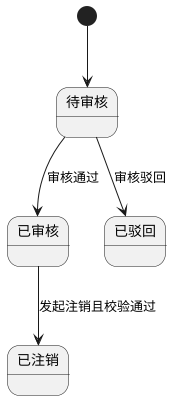

#### 1.2 采购计划管理

**页面路径：** `菜单 → 采购管理 → 采购计划管理`  
**访问权限：** `采购专员、采购经理、食堂负责人`  
**页面类型：** `列表页 + 表单页 + 审核页`

**布局要求：**

- 顶部：计划状态筛选、待审核池快捷入口、新增计划按钮
- 中部：采购计划列表（编号、金额、状态、创建人、创建时间）
- 底部：计划物料明细区与AI采购建议区

**字段定义（业务层面）：**

| 字段名称 | 业务含义 | 验证规则 | 展示要求 | UI组件建议 | 交互行为 |
| ---- | ---- | ---- | ---- | ---- | ---- |
| 计划编号 | 采购计划唯一标识 | 必填，唯一 | 列表主键 | 文本 | 点击查看详情 |
| 总计划金额 | 计划总预算金额 | >=0 | 金额格式 | 数值框 | 自动汇总 |
| 实际采购金额 | 计划执行采购金额 | >=0 | 金额格式 | 数值框 | 执行后回填 |
| 计划状态 | 待审核/已审核/已驳回 | 枚举 | 标签展示 | 标签组件 | 支持状态筛选 |
| 预算金额 | 计划预算 | 必填，>=0 | 表单展示 | 数值框 | 超预算提示 |
| 关联单据 | 关联来源单据 | 可选 | 链接展示 | 选择器 | 支持多选 |
| 计划物料明细 | 供应商、物料、规格、单位、数量、单价、小计 | 必填 | 表格编辑 | 可编辑表格 | 支持导入库存预测 |
| 审核意见 | 审核结论说明 | 审核时必填 | 文本展示 | 文本域 | 审核记录留痕 |
| 驳回原因 | 驳回具体原因 | 驳回时必填 | 文本展示 | 文本域 | 回填申请人 |
| AI采购建议 | 是否采购/推荐供应商/建议数量/预估成本 | AI生成 | 建议卡片 | 建议卡片 | 支持一键应用 |

**操作按钮：**

- 新增计划 → 创建采购计划草稿
- 保存草稿 → 暂存未提交计划
- 提交审核 → 提交进入待审核状态
- 编辑计划 → 修改待审核计划
- 删除计划 → 删除待审核计划
- 审核通过/驳回 → 完成计划审核
- AI采购建议 → 自动生成采购建议并回填

**交互规则（用户体验）：**

**明细维护：**

- 支持手动新增物料行与从库存预测批量导入
- 单价或数量变更后自动计算小计和总金额

**审核规则：**

- 提交后进入待审核池
- 仅待审核状态允许编辑与删除

**业务逻辑：**

- 新增提交后状态=待审核；审核后=已审核/已驳回
- AI采购建议基于历史价格、供应商报价、库存情况联合决策

**状态流转（如适用）：**

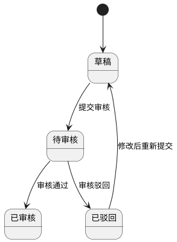

#### 1.3 采购订单管理

**页面路径：** `菜单 → 采购管理 → 采购订单管理`  
**访问权限：** `采购专员、采购经理、仓库管理员、食堂负责人`  
**页面类型：** `列表页 + 详情页 + 表单页 + 审核页`

**布局要求：**

- 顶部：订单状态筛选、统计卡片（未收货/已收货/取消）
- 中部：订单列表（编号、供应商、金额、状态、时间）
- 右侧：订单详情（物料、物流、检测、溯源）

**字段定义（业务层面）：**

| 字段名称 | 业务含义 | 验证规则 | 展示要求 | UI组件建议 | 交互行为 |
| ---- | ---- | ---- | ---- | ---- | ---- |
| 订单编号 | 采购订单唯一编号 | 必填，格式`CGD-YYYYMMDD-XXXXX` | 列表主列 | 文本 | 自动生成 |
| 供应商名称 | 订单对应供应商 | 必填 | 列表展示 | 选择器 | 关联供应商档案 |
| 订单总金额 | 订单金额汇总 | >=0 | 金额格式 | 数值框 | 自动汇总 |
| 订单状态 | 待审核/已驳回/待发货/运输中/待入库/已完成/已作废 | 枚举 | 标签展示 | 标签组件 | 状态筛选 |
| 订单物料明细 | 物料、规格、单位、数量、单价、备注 | 必填 | 表格展示 | 可编辑表格 | 支持行内编辑 |
| 物流追踪信息 | 物流单号、轨迹信息 | 运输中可填 | 详情展示 | 文本域 | 状态联动 |
| 检测报告信息 | 到货质检信息 | 可选 | 附件/文本 | 上传组件 | 详情查看 |
| 溯源信息 | 批次与来源信息 | 可选 | 链接展示 | 文本/链接 | 追溯跳转 |
| 作废原因 | 订单作废申请原因 | 作废时必填 | 文本展示 | 文本域 | 审核可见 |

**操作按钮：**

- 新增订单 → 新建订单并提交审核
- 编辑订单 → 按状态编辑允许字段
- 取消/作废申请 → 发起作废流程
- 审核通过/驳回 → 审核订单或作废申请
- 收货（入库） → 对待入库订单执行收货
- 查看详情 → 查看全链路信息

**交互规则（用户体验）：**

**字段可编辑性：**

- 待审核：可编辑物料数量与单价
- 待发货/运输中：可编辑物流追踪、检测报告、溯源信息

**生命周期驱动：**

- 提交审核后进入待审核
- 审核通过进入待发货，供应商发货后进入运输中
- 到达后进入待入库，收货完成进入已完成

**业务逻辑：**

- 作废申请仅允许在待发货状态发起
- 作废申请审核通过后状态更新为已作废

**状态流转（如适用）：**

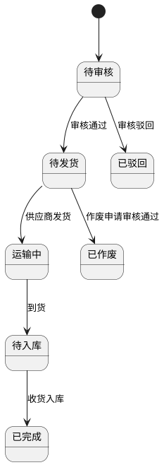

#### 1.4 收货（入库）

**页面路径：** `菜单 → 采购管理 → 收货（入库）`  
**访问权限：** `仓库管理员、采购专员`  
**页面类型：** `列表页 + 详情页 + 执行页`

**布局要求：**

- 顶部：待入库订单筛选
- 中部：待入库订单列表
- 下部：确认收货表单（仓库仓位、拍照/视频、质量评分）

**字段定义（业务层面）：**

| 字段名称 | 业务含义 | 验证规则 | 展示要求 | UI组件建议 | 交互行为 |
| ---- | ---- | ---- | ---- | ---- | ---- |
| 待入库订单编号 | 待收货订单标识 | 必填 | 列表展示 | 文本 | 点击查看详情 |
| 订单物料信息 | 名称、规格、单位、订单数量、已收货数量、待收货数量 | 必填 | 表格展示 | 表格 | 支持逐行收货 |
| 收货数量 | 实际收货数量 | >0且<=待收货 | 表单展示 | 数值框 | 超量拦截 |
| 入库仓库 | 目标仓库 | 必填 | 下拉展示 | 下拉框 | 联动仓位 |
| 入库仓位 | 目标仓位 | 必填 | 下拉展示 | 下拉框 | 仓位可用性校验 |
| 验收附件 | 收货拍照/视频 | 可选 | 附件预览 | 上传组件 | 支持扫码触发拍照 |
| 质量评分 | 收货质量评分 | 1-5星 | 星级展示 | 星级组件 | 评分必填 |
| 备注 | 收货说明 | <=500字 | 文本展示 | 文本域 | 可选输入 |

**操作按钮：**

- 查看订单详情 → 查看待收货明细
- 确认收货 → 提交收货并入库
- 扫码验收 → 扫码定位物料并回填
- 上传附件 → 上传收货证据

**交互规则（用户体验）：**

**验收执行：**

- 支持扫码、拍照快速验收
- 逐物料确认收货数量并联动待收货数量变化

**业务逻辑：**

- 收货入库成功后与采购订单关联
- 全部收货完成后采购订单状态更新为已完成

**状态流转（如适用）：**

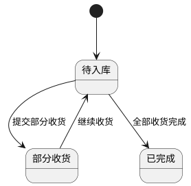

---

### 模块2：仓储管理

#### 2.1 物料库存管理

**页面路径：** `菜单 → 仓储管理 → 物料库存列表`  
**访问权限：** `仓库管理员、食堂负责人、采购专员`  
**页面类型：** `列表页 + 明细页`

**布局要求：**

- 顶部：库存状态筛选、仓库仓位筛选、导出
- 中部：库存列表
- 底部：库存分布与出入库记录快捷页签

**字段定义（业务层面）：**

| 字段名称 | 业务含义 | 验证规则 | 展示要求 | UI组件建议 | 交互行为 |
| ---- | ---- | ---- | ---- | ---- | ---- |
| 物料名称 | 物料主数据名称 | 必填 | 列表主列 | 文本 | 点击进入明细 |
| 物料规格 | 规格型号 | 必填 | 列表展示 | 文本 | 支持筛选 |
| 所在仓库/仓位 | 当前存放位置 | 必填 | 路径展示 | 级联组件 | 跳转仓位详情 |
| 库存数量 | 当前库存 | >=0 | 数值展示 | 数值组件 | 与阈值联动 |
| 库存范围 | 最低库存-最高库存 | 必填，最低<=最高 | 区间展示 | 数值组件 | 阈值编辑入口 |
| 批次号 | 批次标识 | 必填 | 文本展示 | 文本 | 支持追溯 |
| 保质期/剩余天数 | 保质期信息 | 日期合法 | 临期高亮 | 日期组件 | 自动计算剩余天数 |
| 物料库存状态 | 正常/库存不足/库存积压/已过期 | 枚举自动判定 | 标签展示 | 标签组件 | 状态筛选 |

**操作按钮：**

- 查看库存分布 → 查看仓库/仓位分布与保质期分层
- 查看出入库记录 → 查看单据流水并导出Excel
- 导出库存列表 → 导出当前筛选结果

**交互规则（用户体验）：**

**状态判定：**

- 当前库存<=最低库存：库存不足
- 当前库存>=最高库存：库存积压
- 剩余天数<=0：已过期

**业务逻辑：**

- 库存状态实时计算并驱动预警
- 出入库流水与库存快照保持一致

**状态流转（如适用）：**

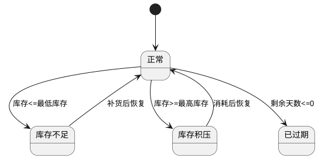

#### 2.2 仓库信息管理

**页面路径：** `菜单 → 仓储管理 → 仓库信息管理`  
**访问权限：** `仓库管理员、系统管理员`  
**页面类型：** `列表页 + 详情页 + 表单页`

**布局要求：**

- 顶部：仓库状态筛选、新增仓库/仓位
- 中部：仓库列表
- 右侧：仓库档案详情（核心指标、容量、仓位统计）

**字段定义（业务层面）：**

| 字段名称 | 业务含义 | 验证规则 | 展示要求 | UI组件建议 | 交互行为 |
| ---- | ---- | ---- | ---- | ---- | ---- |
| 仓库编码 | 仓库唯一编码 | 必填，唯一 | 列表展示 | 文本框 | 唯一性校验 |
| 仓库名称 | 仓库名称 | 必填 | 列表主列 | 文本框 | 点击详情 |
| 仓库类型 | 仓库分类 | 必填 | 标签展示 | 下拉框 | 筛选联动 |
| 仓库状态 | 使用中/停用/闲置 | 枚举 | 标签展示 | 开关/标签 | 控制可用性 |
| 容量信息 | 当前容量/最大容量 | >=0 | 进度条展示 | 进度条 | 超阈值预警 |
| 仓位信息 | 仓位编码、类型、层级、库存数量 | 必填 | 表格展示 | 表格 | 新增编辑删除 |
| 温湿度指标 | 当前温度/湿度及状态 | 自动采集 | 详情展示 | 指标卡 | 预警高亮 |

**操作按钮：**

- 新增仓库/编辑仓库/删除仓库
- 新增仓位/编辑仓位/删除仓位
- 查看仓库档案

**交互规则（用户体验）：**

**删除约束：**

- 删除仓库前校验仓位库存=0
- 删除仓位前校验仓位库存=0

**业务逻辑：**

- 仓库状态影响入出库单据可选范围
- 容量和温湿度异常进入预警流程

**状态流转（如适用）：**

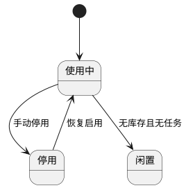

#### 2.3 物料信息管理

**页面路径：** `菜单 → 仓储管理 → 物料信息管理`  
**访问权限：** `仓库管理员、采购专员、系统管理员`  
**页面类型：** `列表页 + 详情页 + 表单页`

**布局要求：**

- 顶部：物料分类筛选、状态筛选、新增按钮
- 中部：物料列表
- 右侧：物料档案详情（库存范围、保质期规则）

**字段定义（业务层面）：**

| 字段名称 | 业务含义 | 验证规则 | 展示要求 | UI组件建议 | 交互行为 |
| ---- | ---- | ---- | ---- | ---- | ---- |
| 物料编码 | 物料唯一编码 | 必填，唯一 | 列表展示 | 文本框 | 唯一校验 |
| 物料名称 | 物料名称 | 必填 | 列表主列 | 文本框 | 支持搜索 |
| 物料单位 | 计量单位 | 必填 | 文本展示 | 下拉框 | 与单据联动 |
| 保质期标准 | 标准保质期天数 | >0 | 数值展示 | 数值框 | 自动计算到期 |
| 临期提醒天数 | 临期提醒阈值 | >=0且<保质期 | 数值展示 | 数值框 | 支持AI建议回填 |
| 预警期 | 预警阈值天数 | >=临期提醒天数 | 数值展示 | 数值框 | 状态计算依据 |
| 最低/最高库存 | 库存控制阈值 | 最低<=最高 | 区间展示 | 数值框 | 驱动库存状态 |
| 物料状态 | 启用/禁用 | 枚举 | 标签展示 | 开关 | 禁用前校验库存 |

**操作按钮：**

- 新增物料/编辑物料/删除物料
- AI建议（临期提醒天数）
- 查看档案详情

**交互规则（用户体验）：**

**阈值联动：**

- 临期提醒与预警期支持并行设置
- AI建议可一键应用后再人工调整

**业务逻辑：**

- 编辑为禁用状态前需校验库存数=0
- 删除物料前需校验库存数=0

**状态流转（如适用）：**

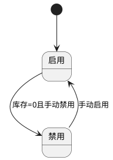

#### 2.4 入库管理

**页面路径：** `菜单 → 仓储管理 → 入库管理`  
**访问权限：** `仓库管理员、采购专员、食堂负责人`  
**页面类型：** `列表页 + 详情页 + 表单页 + 审核页`

**布局要求：**

- 顶部：入库类型筛选、状态筛选、新增入库单
- 中部：入库单列表
- 底部：入库单明细编辑区与AI入库建议区

**字段定义（业务层面）：**

| 字段名称 | 业务含义 | 验证规则 | 展示要求 | UI组件建议 | 交互行为 |
| ---- | ---- | ---- | ---- | ---- | ---- |
| 入库单号 | 入库单唯一编号 | 必填，自动生成 | 列表展示 | 文本 | 点击详情 |
| 入库类型 | 采购/调拨/退货/退料/盘盈/赠品/其他 | 必填 | 标签展示 | 下拉框 | 影响来源单据 |
| 来源单据 | 关联来源 | 可选 | 链接展示 | 选择器 | 关联跳转 |
| 供应商 | 来源供应商 | 可选 | 文本展示 | 选择器 | 与采购关联 |
| 入库组织 | 执行组织 | 必填 | 文本展示 | 组织选择器 | 数据权限校验 |
| 入库物料明细 | 物料、规格、仓库仓位、数量、单位、批次、保质期、单价、小计 | 必填 | 表格展示 | 可编辑表格 | 支持批量录入 |
| 入库金额 | 明细汇总金额 | >=0 | 金额展示 | 数值框 | 自动汇总 |
| 入库状态 | 待审核/已完成 | 枚举 | 标签展示 | 标签组件 | 状态筛选 |

**操作按钮：**

- 新增入库单/编辑入库单/删除入库单
- 提交审核/审核通过/审核驳回
- AI入库建议（临期先出+批次优先）

**交互规则（用户体验）：**

**编辑约束：**

- 仅待审核状态可编辑和删除

**审核生效：**

- 审核通过后库存才生效

**业务逻辑：**

- 提交后状态=待审核；审核通过后状态=已完成
- AI建议按“保质期临期先出+批次优先”生成仓位与分配数量

**状态流转（如适用）：**

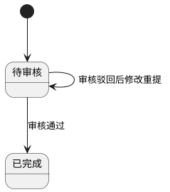

#### 2.5 出库管理

**页面路径：** `菜单 → 仓储管理 → 出库管理`  
**访问权限：** `仓库管理员、后厨主管、食堂负责人`  
**页面类型：** `列表页 + 详情页 + 表单页 + 审核页`

**布局要求：**

- 顶部：出库类型筛选、状态筛选、新增出库单
- 中部：出库单列表
- 底部：出库明细与AI出库建议区

**字段定义（业务层面）：**

| 字段名称 | 业务含义 | 验证规则 | 展示要求 | UI组件建议 | 交互行为 |
| ---- | ---- | ---- | ---- | ---- | ---- |
| 出库单号 | 出库单唯一编号 | 必填，自动生成 | 列表展示 | 文本 | 点击详情 |
| 出库类型 | 领用/销售/退货/调拨/盘亏/赠送/报废/其他 | 必填 | 标签展示 | 下拉框 | 影响用途字段 |
| 出库组织 | 执行组织 | 必填 | 文本展示 | 组织选择器 | 权限校验 |
| 出库用途 | 出库用途说明 | 必填 | 文本展示 | 文本框 | 审核可见 |
| 出库物料明细 | 物料、规格、仓库仓位、数量、单位、批次、用途 | 必填 | 表格展示 | 可编辑表格 | 支持批次选择 |
| 出库金额 | 自动计算金额 | >=0 | 金额展示 | 数值框 | 自动汇总 |
| 出库状态 | 待审核/已完成 | 枚举 | 标签展示 | 标签组件 | 状态筛选 |

**操作按钮：**

- 新增出库单/编辑出库单/删除出库单
- 提交审核/审核通过/审核驳回
- AI出库建议（临期先出+批次优先）

**交互规则（用户体验）：**

**编辑约束：**

- 仅待审核状态可编辑和删除

**库存生效：**

- 审核通过后才扣减库存

**业务逻辑：**

- 提交后状态=待审核；审核通过后状态=已完成
- AI建议按保质期与批次规则推荐仓位和批次

**状态流转（如适用）：**

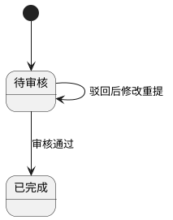

#### 2.6 库存报表与智能分析

**页面路径：** `菜单 → 仓储管理 → 库存汇总报表/AI需求预测/AI智能损耗分析/盘点管理/库存预警`  
**访问权限：** `仓库管理员、食堂负责人、采购经理`  
**页面类型：** `看板页 + 报表页 + 分析页`

**布局要求：**

- 顶部：周期筛选（日/周/月/季）
- 中部：库存看板、预测统计、损耗统计、预警列表、盘点列表
- 底部：明细表与导出区

**字段定义（业务层面）：**

| 字段名称 | 业务含义 | 验证规则 | 展示要求 | UI组件建议 | 交互行为 |
| ---- | ---- | ---- | ---- | ---- | ---- |
| 库存总数/库存品种/库存价值 | 库存总体态势 | >=0 | KPI展示 | 指标卡 | 与明细联动 |
| 预测周期 | 需求预测周期 | 日/周/月 | 筛选展示 | 分段选择器 | 切换重算 |
| 预测结果 | 当前库存、预测需求、建议补货、预估金额、置信度、优先级 | 完整字段 | 表格展示 | 表格 | 勾选生成采购计划 |
| 损耗统计 | 总损耗金额、损耗率、损耗物品数、改善潜力 | >=0 | KPI展示 | 指标卡 | 下钻分析 |
| 损耗明细 | 物料、损耗率、损耗金额、原因、AI建议 | 完整字段 | 表格展示 | 表格 | 点击详情 |
| 盘点状态 | 待完成/待审核/已完成 | 枚举 | 标签展示 | 标签组件 | 状态筛选 |
| 预警状态 | 库存不足/库存积压/保质期预警/已过期 | 枚举 | 高亮展示 | 标签组件 | 快速处理 |

**操作按钮：**

- 生成预测/导出预测
- 生成损耗分析/导出报告
- 新增盘点表/提交盘点/审核盘点
- 查看预警/处理预警
- 生成采购计划

**交互规则（用户体验）：**

**预测联动：**

- 勾选预测结果后可一键生成采购计划

**盘点流转：**

- 新增盘点表后状态=待完成，提交后=待审核，审核通过后=已完成

**业务逻辑：**

- AI需求预测基于历史消耗、菜谱计划、就餐人数、库存数据
- AI损耗分析识别高损耗物料、时段与原因并输出优化建议

**状态流转（如适用）：**

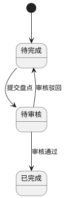

---

### 模块3：菜谱营养管理

#### 3.1 菜谱可视化看板

**页面路径：** `菜单 → 菜谱营养管理 → 菜谱可视化看板`  
**访问权限：** `后厨主管、营养师、食堂负责人`  
**页面类型：** `看板页`

**布局要求：**

- 顶部：统计卡片
- 中部：营养素分布圆环图
- 底部：本周热门菜谱TOP5

**字段定义（业务层面）：**

| 字段名称 | 业务含义 | 验证规则 | 展示要求 | UI组件建议 | 交互行为 |
| ---- | ---- | ---- | ---- | ---- | ---- |
| 菜谱总数 | 菜谱库规模 | >=0 | KPI展示 | 指标卡 | 点击下钻 |
| 食材覆盖率 | 食材覆盖程度 | 0-100% | 百分比展示 | 进度条 | 周期切换 |
| 营养达标率 | 达标菜谱占比 | 0-100% | 百分比展示 | 进度条 | 下钻明细 |
| 营养素分布 | 蛋白质/碳水/脂肪占比 | 0-100% | 圆环图 | 图表 | 悬浮提示 |
| 热门菜谱TOP5 | 高频菜谱 | Top5 | 列表展示 | 排行榜 | 点击查看详情 |

**操作按钮：**

- 时间筛选 → 按日/周/月切换
- 导出报表 → 导出看板数据

**交互规则（用户体验）：**

**图表联动：**

- 点击图表维度可过滤下方排行

**业务逻辑：**

- 看板数据来源于菜谱库、计划执行、营养计算结果

**状态流转（如适用）：**

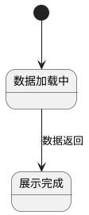

#### 3.2 菜谱库管理

**页面路径：** `菜单 → 菜谱营养管理 → 菜谱库管理`  
**访问权限：** `后厨主管、营养师、食堂负责人`  
**页面类型：** `列表页 + 详情页 + 表单页`

**布局要求：**

- 顶部：新增菜谱、分类筛选
- 中部：菜谱列表
- 右侧：菜谱详情（营养成分、烹饪参数、食材、步骤）

**字段定义（业务层面）：**

| 字段名称 | 业务含义 | 验证规则 | 展示要求 | UI组件建议 | 交互行为 |
| ---- | ---- | ---- | ---- | ---- | ---- |
| 菜谱名称 | 菜谱名称 | 必填 | 列表主列 | 文本框 | 支持搜索 |
| 菜谱类别 | 菜谱分类 | 必填 | 标签展示 | 下拉框 | 分类筛选 |
| 目标烹饪时长 | 标准时长 | >0 | 数值展示 | 数值框 | 支持AI建议 |
| 目标温度 | 标准温度 | >0 | 数值展示 | 数值框 | 支持AI建议 |
| 所需食材列表 | 物料、规格、数量、单位 | 必填 | 表格展示 | 可编辑表格 | 行内维护 |
| 营养成分 | 热量、蛋白质、脂肪、碳水 | 自动计算 | 详情展示 | 指标卡 | 新增后自动分析 |

**操作按钮：**

- 新增菜谱/编辑菜谱/删除菜谱
- AI建议（时长/温度）
- AI营养成分分析

**交互规则（用户体验）：**

**AI建议：**

- 点击“AI建议”后按菜谱名称、做法、食材类型与食品安全标准推荐参数

**业务逻辑：**

- 删除菜谱时，未烹饪计划中的该菜谱同步删除
- 新增后自动产出营养成分并入详情

**状态流转（如适用）：**

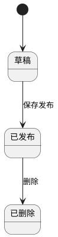

#### 3.3 菜谱计划管理

**页面路径：** `菜单 → 菜谱营养管理 → 菜谱计划管理`  
**访问权限：** `后厨主管、营养师、食堂负责人`  
**页面类型：** `列表页 + 详情页 + 审核页 + 调整页`

**布局要求：**

- 顶部：计划列表与调整申请列表切换
- 中部：计划明细（餐次、人数、菜谱、食材）
- 右侧：AI推荐与AI营养分析

**字段定义（业务层面）：**

| 字段名称 | 业务含义 | 验证规则 | 展示要求 | UI组件建议 | 交互行为 |
| ---- | ---- | ---- | ---- | ---- | ---- |
| 菜谱计划编号 | 计划唯一编号 | 必填，自动生成 | 列表展示 | 文本 | 点击详情 |
| 菜谱计划状态 | 暂存/待审核/已通过/已驳回 | 枚举 | 标签展示 | 标签组件 | 状态筛选 |
| 调整申请状态 | 已生效/待审核/已驳回 | 枚举 | 标签展示 | 标签组件 | 与计划联动 |
| 用餐人数 | 用餐人数规模 | >0 | 数值展示 | 数值框 | 联动总用量 |
| 餐次信息 | 餐次、菜谱、食材用量 | 必填 | 表格展示 | 表格 | 可编辑 |
| AI推荐菜谱 | 推荐明细 | 自动生成 | 推荐卡片 | 卡片组件 | 一键应用 |
| AI营养分析 | 总蛋白质/碳水/脂肪/热量/均衡度/建议 | 自动生成 | 指标卡 | 指标卡 | 实时重算 |
| 审核意见 | 审核说明 | 审核必填 | 文本展示 | 文本域 | 留痕 |

**操作按钮：**

- 新建计划/编辑计划/删除计划
- 提交审核/审核通过/审核驳回
- 发起调整申请/重新提交调整申请
- 审核调整申请
- AI推荐菜谱/AI营养分析

**交互规则（用户体验）：**

**计划审核：**

- 保存后状态=暂存，提交后=待审核，审核后=已通过/已驳回

**调整流程：**

- 调整项自动标红并生成调整详情
- 调整审核通过后即时生效并自动调整烹饪任务

**业务逻辑：**

- 已通过计划自动生成烹饪任务
- 删除仅允许草稿或待审核状态

**状态流转（如适用）：**

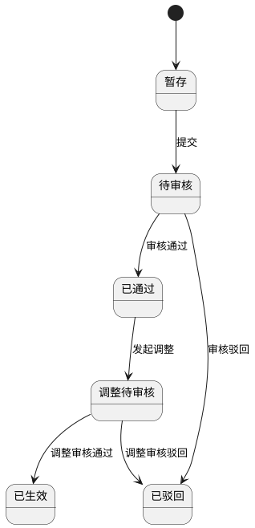

#### 3.4 AI营养评估与AI智能推荐菜谱

**页面路径：** `菜单 → 菜谱营养管理 → AI营养评估/AI智能推荐菜谱`  
**访问权限：** `营养师、食堂负责人`  
**页面类型：** `分析页 + 推荐页`

**布局要求：**

- 顶部：人群画像/预算/健康约束筛选
- 中部：营养目标对比与评分
- 底部：推荐方案明细与营养总览

**字段定义（业务层面）：**

| 字段名称 | 业务含义 | 验证规则 | 展示要求 | UI组件建议 | 交互行为 |
| ---- | ---- | ---- | ---- | ---- | ---- |
| 人群膳食画像 | 老人/儿童/病人等画像 | 必选 | 卡片展示 | 画像卡 | 切换重算 |
| 营养目标 | 蛋白质/碳水/脂肪/热量目标 | 合法范围 | 表格展示 | 表格 | 与实际对比 |
| 所选菜谱营养 | 总量与人均量 | 自动计算 | 指标展示 | 指标卡 | 实时更新 |
| 营养目标对比状态 | 不足/达标/过量 | 枚举 | 标签展示 | 标签组件 | 高亮异常 |
| 营养均衡度评分 | 评分和等级 | 0-100 | 分数展示 | 评分组件 | 趋势对比 |
| 推荐统计 | 推荐菜品数、总成本、人均成本、预算结余 | >=0 | KPI展示 | 指标卡 | 点击明细 |
| 推荐方案明细 | 餐次、菜谱、食材、人均营养、预算 | 完整字段 | 表格展示 | 表格 | 可应用到计划 |

**操作按钮：**

- 生成营养评估报告
- 生成推荐方案
- 应用推荐到菜谱计划

**交互规则（用户体验）：**

**多约束推荐：**

- 推荐同时考虑库存、预算、偏好、健康状态与营养需求

**业务逻辑：**

- 自动生成营养优化建议
- 推荐方案支持日/周/月维度

**状态流转（如适用）：**

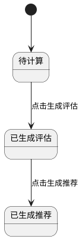

---

### 模块4：烹饪记录管理

#### 4.1 烹饪记录首页

**页面路径：** `菜单 → 烹饪记录管理 → 烹饪记录首页`  
**访问权限：** `后厨主管、一线厨师、食堂负责人`  
**页面类型：** `看板页 + 列表页`

**布局要求：**

- 顶部：数据看板（菜品总数、烹饪中、已完成、温度异常）
- 中部：菜品清单列表
- 底部：今日该餐次完成进度

**字段定义（业务层面）：**

| 字段名称 | 业务含义 | 验证规则 | 展示要求 | UI组件建议 | 交互行为 |
| ---- | ---- | ---- | ---- | ---- | ---- |
| 菜谱名称 | 任务菜谱 | 必填 | 列表主列 | 文本 | 点击详情 |
| 烹饪状态 | 待烹饪/烹饪中/已完成 | 枚举 | 标签展示 | 标签组件 | 状态筛选 |
| 位置 | 烹饪工位 | 必填 | 文本展示 | 文本 | 按工位筛选 |
| 要求温度 | 菜谱目标温度 | 必填 | 数值+单位 | 数值组件 | 异常高亮 |
| 标准时长 | 菜谱目标时长 | 必填 | 数值+单位 | 数值组件 | 超时预警 |
| 当前进度 | 餐次完成百分比 | 0-100% | 进度条 | 进度条 | 实时刷新 |

**操作按钮：**

- 开始烹饪
- 查看温度曲线
- 烹饪完成
- 查看记录

**交互规则（用户体验）：**

**进度更新：**

- 开始后状态变为烹饪中
- 完成后状态变为已完成并刷新进度

**业务逻辑：**

- 数据看板按当餐次实时统计
- 温度异常数量按实时采集结果计算

**状态流转（如适用）：**

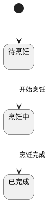

---

### 模块5：留样管理

#### 5.1 留样管理首页

**页面路径：** `菜单 → 留样管理 → 留样管理首页`  
**访问权限：** `食品安全员、后厨主管、食堂负责人`  
**页面类型：** `看板页 + 列表页`

**布局要求：**

- 顶部：留样统计看板
- 中部：留样列表
- 右侧：状态筛选和快捷操作

**字段定义（业务层面）：**

| 字段名称 | 业务含义 | 验证规则 | 展示要求 | UI组件建议 | 交互行为 |
| ---- | ---- | ---- | ---- | ---- | ---- |
| 留样状态 | 待留样/待销样/已销样/已过期 | 枚举 | 标签展示 | 标签组件 | 状态筛选 |
| 关联菜谱 | 留样对应菜谱 | 必填 | 文本展示 | 文本 | 跳转菜谱 |
| 留样重量 | 留样重量 | >0 | 数值展示 | 数值框 | 单位统一 |
| 留样时间 | 留样生成时间 | 必填 | 时间展示 | 时间组件 | 超时高亮 |
| 存储位置 | 留样存放点位 | 必填 | 文本展示 | 选择器 | 定位联动 |
| 质量评分 | AI评分结果 | 1-5星 | 星级展示 | 星级组件 | 进入详情 |

**操作按钮：**

- 新增留样
- 查看留样详情
- 销样提醒列表

**交互规则（用户体验）：**

**自动任务：**

- 当日烹饪任务自动生成留样任务（初始待留样）
- 提交留样后转待销样
- 冷藏超48小时自动转已过期并提醒

**业务逻辑：**

- 留样全链路关联菜谱与烹饪记录，确保可追溯

**状态流转（如适用）：**

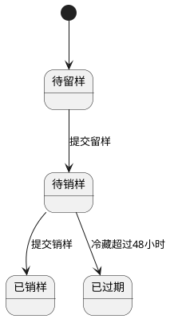

#### 5.2 新增留样与AI智能评估

**页面路径：** `菜单 → 留样管理 → 新增留样/AI智能评估`  
**访问权限：** `食品安全员、后厨主管`  
**页面类型：** `表单页 + 分析页`

**布局要求：**

- 上部：留样录入表单
- 下部：AI评估结果

**字段定义（业务层面）：**

| 字段名称 | 业务含义 | 验证规则 | 展示要求 | UI组件建议 | 交互行为 |
| ---- | ---- | ---- | ---- | ---- | ---- |
| 关联烹饪记录 | 对应烹饪记录 | 必填 | 选择展示 | 选择器 | 关联回填菜谱 |
| 留样附件 | 图片/视频证据 | 可选 | 缩略图展示 | 上传组件 | 支持多文件 |
| 最终得分 | AI综合得分 | 0-100 | 数值展示 | 指标卡 | 与星级联动 |
| 最终星级 | AI综合星级 | 1-5 | 星级展示 | 星级组件 | 点击看维度 |
| 评分维度 | 色泽/形态/熟度 | 0-100 | 分项展示 | 雷达图 | 查看分析 |
| 优化建议 | AI改进建议 | 可选 | 文本展示 | 文本块 | 一键复制 |

**操作按钮：**

- 提交留样
- 启动AI评估
- 重新评估

**交互规则（用户体验）：**

**评估触发：**

- 提交留样后自动触发AI评估

**业务逻辑：**

- AI通过图像识别与规则分析给出评分和建议

**状态流转（如适用）：**

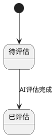

#### 5.3 销样提醒、执行与详情

**页面路径：** `菜单 → 留样管理 → 销样提醒列表/销样执行/销样详情`  
**访问权限：** `食品安全员、后厨主管`  
**页面类型：** `列表页 + 执行页 + 详情页`

**布局要求：**

- 顶部：待销样与已过期筛选
- 中部：提醒列表
- 下部：销样执行表单

**字段定义（业务层面）：**

| 字段名称 | 业务含义 | 验证规则 | 展示要求 | UI组件建议 | 交互行为 |
| ---- | ---- | ---- | ---- | ---- | ---- |
| 提醒状态 | 待销样/已销样/已过期 | 枚举 | 标签展示 | 标签组件 | 状态筛选 |
| 销样备注 | 销样说明 | 提交时可填 | 文本展示 | 文本域 | 审计留痕 |
| 销样附件 | 销样证据 | 可选 | 附件展示 | 上传组件 | 支持图片/视频 |
| 销样人员 | 执行人 | 自动带出 | 文本展示 | 文本 | 不可手改 |
| 销样时间 | 执行时间 | 自动记录 | 时间展示 | 时间组件 | 详情可查 |

**操作按钮：**

- 执行销样
- 查看销样详情

**交互规则（用户体验）：**

**提醒机制：**

- 留样满48小时自动进入提醒列表

**业务逻辑：**

- 销样提交后更新状态为已销样并留存证据链

**状态流转（如适用）：**

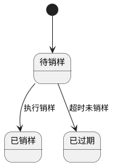

---

### 模块6：智能人脸晨检

#### 6.1 智能人脸晨检首页

**页面路径：** `菜单 → 智能人脸晨检 → 智能人脸晨检首页`  
**访问权限：** `人事管理员、后厨主管、食堂负责人`  
**页面类型：** `看板页 + 列表页`

**布局要求：**

- 顶部：今日晨检统计看板
- 中部：待检查员工列表
- 底部：晨检记录列表

**字段定义（业务层面）：**

| 字段名称 | 业务含义 | 验证规则 | 展示要求 | UI组件建议 | 交互行为 |
| ---- | ---- | ---- | ---- | ---- | ---- |
| 今日检查人数 | 当日已检查人数 | >=0 | KPI展示 | 指标卡 | 点击下钻 |
| 通过人数 | 检查通过人数 | >=0 | KPI展示 | 指标卡 | 点击筛选 |
| 未通过人数 | 检查不通过人数 | >=0 | KPI展示 | 指标卡 | 点击筛选 |
| 健康证异常 | 健康证异常人数 | >=0 | KPI展示 | 指标卡 | 高亮提醒 |
| 待检查员工 | 待检员工信息 | 必填字段完整 | 列表展示 | 列表 | 点击开始检查 |
| 晨检记录 | 检查结果记录 | 完整字段 | 列表展示 | 列表 | 查看详情 |

**操作按钮：**

- 开始晨检
- 查看晨检记录

**交互规则（用户体验）：**

**数据刷新：**

- 检查提交后实时刷新看板和记录

**业务逻辑：**

- 待检查员工列表由在职+当日未检人员构成

**状态流转（如适用）：**

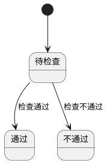

#### 6.2 AI人脸晨检与身份核验

**页面路径：** `菜单 → 智能人脸晨检 → AI人脸晨检与身份核验`  
**访问权限：** `人事管理员、后厨主管`  
**页面类型：** `执行页`

**布局要求：**

- 左侧：识别与检测流程区
- 右侧：检查结果与异常说明

**字段定义（业务层面）：**

| 字段名称 | 业务含义 | 验证规则 | 展示要求 | UI组件建议 | 交互行为 |
| ---- | ---- | ---- | ---- | ---- | ---- |
| 员工信息 | 姓名、职位、工号、头像 | 必填 | 卡片展示 | 信息卡 | 识别后自动回填 |
| 体温检测 | 检测时间、检测结果 | 必填 | 数值展示 | 传感器读数组件 | 异常预警 |
| 健康证校验 | 编号、到期日期、状态 | 必填 | 标签展示 | 标签组件 | 过期拦截 |
| 手部健康判定 | 正常/异常 | 必填 | 标签展示 | 标签组件 | 异常说明 |
| 总结结果 | 体温状态、健康证状态、手部状态 | 必填 | 汇总卡片 | 汇总卡 | 提交结论 |

**操作按钮：**

- 开始识别
- 提交晨检结果

**交互规则（用户体验）：**

**流程顺序：**

- 身份核验→体温检测→健康证校验→手部判定→结果提交

**业务逻辑：**

- 任一关键项异常则结果标记不通过并触发预警

**状态流转（如适用）：**

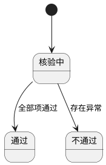

#### 6.3 人脸录入与更新

**页面路径：** `移动端 → 我的 → 人脸信息`  
**访问权限：** `员工本人、管理员`  
**页面类型：** `表单页`

**布局要求：**

- 顶部：当前人脸状态
- 中部：录入/更新入口

**字段定义（业务层面）：**

| 字段名称 | 业务含义 | 验证规则 | 展示要求 | UI组件建议 | 交互行为 |
| ---- | ---- | ---- | ---- | ---- | ---- |
| 人脸录入状态 | 已录入/未录入 | 枚举 | 标签展示 | 标签组件 | 状态提示 |
| 人脸照片 | 人脸识别样本 | 清晰可识别 | 图片展示 | 拍照/上传组件 | 上传后校验 |
| 更新时间 | 最近更新时间 | 自动记录 | 时间展示 | 时间组件 | 详情查看 |

**操作按钮：**

- 录入人脸
- 更新人脸

**交互规则（用户体验）：**

**录入限制：**

- 需登录移动端后才允许录入

**业务逻辑：**

- 人脸数据用于晨检与视频监管身份核验

**状态流转（如适用）：**

```plantuml
@startuml
[*] --> 未录入
未录入 --> 已录入 : 完成录入
已录入 --> 已录入 : 更新人脸
@enduml
```

---

### 模块7：烹饪监管管理

#### 7.1 实时监控首页

**页面路径：** `菜单 → 烹饪监管管理 → 实时监控首页`  
**访问权限：** `食品安全员、后厨主管、食堂负责人`  
**页面类型：** `实时监控页`

**布局要求：**

- 左侧：实时监控列表（画面+状态+预警）
- 右侧：摄像头列表（参数与警告条数）

**字段定义（业务层面）：**

| 字段名称 | 业务含义 | 验证规则 | 展示要求 | UI组件建议 | 交互行为 |
| ---- | ---- | ---- | ---- | ---- | ---- |
| 摄像头名称 | 监控点名称 | 必填 | 列表展示 | 文本 | 点击切换画面 |
| 摄像头位置 | 安装位置 | 必填 | 文本展示 | 文本 | 按位置筛选 |
| 摄像头状态 | 在线/离线 | 枚举 | 标签展示 | 标签组件 | 异常高亮 |
| 实时预警信息 | 当前预警摘要 | 可为空 | 列表高亮 | 告警条 | 点击进详情 |
| 分辨率/帧率 | 监控参数 | 合法值 | 参数展示 | 文本 | 详情查看 |
| 警告条数 | 当前摄像头警告数量 | >=0 | 数值展示 | 数值 | 点击筛选 |

**操作按钮：**

- 切换监控画面
- 查看摄像头详情

**交互规则（用户体验）：**

**实时识别：**

- 监控流实时接入AI违规行为识别与鼠患迹象检测

**业务逻辑：**

- 识别到违规事件自动生成预警并可追溯视频片段

**状态流转（如适用）：**

```plantuml
@startuml
[*] --> 在线
在线 --> 离线 : 设备中断
离线 --> 在线 : 恢复连接
@enduml
```

#### 7.2 视频回放（录像列表）

**页面路径：** `菜单 → 烹饪监管管理 → 视频回放（录像列表）`  
**访问权限：** `食品安全员、后厨主管、管理员`  
**页面类型：** `列表页 + 回放页`

**布局要求：**

- 顶部：时间段筛选、摄像头筛选
- 中部：录像列表
- 底部：回放窗口

**字段定义（业务层面）：**

| 字段名称 | 业务含义 | 验证规则 | 展示要求 | UI组件建议 | 交互行为 |
| ---- | ---- | ---- | ---- | ---- | ---- |
| 录像时间 | 录像开始时间 | 必填 | 时间展示 | 时间组件 | 排序 |
| 录像时长 | 录像长度 | >0 | 时长展示 | 文本 | 筛选 |
| 视频大小 | 文件大小 | >0 | 容量展示 | 文本 | 下载参考 |
| 回放参数 | 开始/结束/分辨率 | 合法范围 | 参数展示 | 播放器参数栏 | 拖拽回放 |

**操作按钮：**

- 回放
- 下载片段

**交互规则（用户体验）：**

**检索回放：**

- 支持按时间和摄像头快速检索

**业务逻辑：**

- 回放记录用于违规取证和复盘

**状态流转（如适用）：**

```plantuml
@startuml
[*] --> 待检索
待检索 --> 可回放 : 命中录像
@enduml
```

#### 7.3 AI违规行为识别页与详情

**页面路径：** `菜单 → 烹饪监管管理 → AI违规行为识别页/详情`  
**访问权限：** `食品安全员、后厨主管`  
**页面类型：** `看板页 + 列表页 + 详情页`

**布局要求：**

- 顶部：违规统计看板
- 中部：违规列表
- 右侧：违规详情（视频片段+处理信息）

**字段定义（业务层面）：**

| 字段名称 | 业务含义 | 验证规则 | 展示要求 | UI组件建议 | 交互行为 |
| ---- | ---- | ---- | ---- | ---- | ---- |
| 违规类型 | 违规行为类别 | 枚举 | 标签展示 | 标签组件 | 筛选 |
| 预警级别 | 提示/警告/紧急/危险 | 枚举 | 颜色分级 | 标签组件 | 高优先置顶 |
| 检测置信度 | 识别可信度 | 0-100% | 百分比展示 | 进度条 | 详情查看 |
| 发生位置/摄像头 | 违规发生点位 | 必填 | 文本展示 | 文本 | 关联回放 |
| 处理状态 | 待处理/已处理 | 枚举 | 标签展示 | 标签组件 | 状态筛选 |
| 处理信息 | 处理人、处理时间、备注 | 处理时必填 | 文本展示 | 表单 | 留痕 |

**操作按钮：**

- 指派处理
- 标记已处理
- 查看违规详情

**交互规则（用户体验）：**

**识别能力：**

- 覆盖口罩/手套/洗手/分区作业/生熟分离/交叉污染/吸烟/动火离人等行为

**业务逻辑：**

- 违规事件输出事件类型、置信度、时间戳和视频片段

**状态流转（如适用）：**

```plantuml
@startuml
[*] --> 待处理
待处理 --> 已处理 : 提交处理结果
@enduml
```

#### 7.4 AI人员行为分析页与详情

**页面路径：** `菜单 → 烹饪监管管理 → AI人员行为分析页/详情`  
**访问权限：** `后厨主管、食堂负责人`  
**页面类型：** `分析页 + 详情页`

**布局要求：**

- 顶部：分析统计卡片
- 中部：人员分析列表
- 右侧：人员分析详情

**字段定义（业务层面）：**

| 字段名称 | 业务含义 | 验证规则 | 展示要求 | UI组件建议 | 交互行为 |
| ---- | ---- | ---- | ---- | ---- | ---- |
| 效率得分 | 操作效率评分 | 0-100 | 数值展示 | 指标卡 | 排序 |
| 规范性评分 | 规范操作评分 | 0-100 | 数值展示 | 指标卡 | 排序 |
| 卫生评分 | 卫生行为评分 | 0-100 | 数值展示 | 指标卡 | 排序 |
| 工作时长 | 工作时长（分钟） | >=0 | 数值展示 | 数值组件 | 趋势查看 |
| 违规次数 | 违规事件次数 | >=0 | 数值展示 | 数值组件 | 下钻事件 |
| AI培训建议 | 改进建议 | 可选 | 文本展示 | 文本块 | 同步培训 |

**操作按钮：**

- 查看详情
- 导出分析结果

**交互规则（用户体验）：**

**分析下钻：**

- 支持按人员、角色、时段筛选

**业务逻辑：**

- 自动识别待改进人员与标杆人员

**状态流转（如适用）：**

```plantuml
@startuml
[*] --> 分析中
分析中 --> 分析完成 : 计算完成
@enduml
```

---

### 模块8：设备管理

#### 8.1 设备管理首页

**页面路径：** `菜单 → 设备管理 → 设备管理首页`  
**访问权限：** `设备管理员、食堂负责人、系统管理员`  
**页面类型：** `看板页 + 列表页`

**布局要求：**

- 顶部：设备统计看板
- 中部：设备列表（按类型分组）
- 右侧：设备状态与最近检测信息

**字段定义（业务层面）：**

| 字段名称 | 业务含义 | 验证规则 | 展示要求 | UI组件建议 | 交互行为 |
| ---- | ---- | ---- | ---- | ---- | ---- |
| 设备总数 | 设备资产总数 | >=0 | KPI展示 | 指标卡 | 点击下钻 |
| 在线/离线/报警/维护中 | 设备状态统计 | >=0 | KPI展示 | 指标卡 | 状态筛选 |
| 设备类型 | 监控/食材检测/温度/气体/留样/晨检 | 枚举 | 分组展示 | 标签组件 | 类型筛选 |
| 设备编号 | 设备唯一编号 | 必填，唯一 | 列表展示 | 文本 | 详情跳转 |
| 设备负责人 | 责任人 | 必填 | 文本展示 | 选择器 | 联系方式联动 |
| 特有信息 | 各设备类型特有字段 | 合法值 | 详情分区 | 分区面板 | 动态展示 |

**操作按钮：**

- 查看设备详情
- 新增设备/修改设备
- 删除设备

**交互规则（用户体验）：**

**联动说明：**

- 温度传感器绑定灶台/蒸箱UUID，烹饪启停时自动下发采集启停指令

**业务逻辑：**

- 设备状态由实时心跳与告警事件共同判定

**状态流转（如适用）：**

```plantuml
@startuml
[*] --> 在线
在线 --> 报警 : 触发告警
在线 --> 离线 : 断连
报警 --> 维护中 : 进入维修
维护中 --> 在线 : 维修完成
@enduml
```

#### 8.2 设备详情/新增修改/删除

**页面路径：** `菜单 → 设备管理 → 设备详情/新增修改设备`  
**访问权限：** `设备管理员、系统管理员`  
**页面类型：** `详情页 + 表单页`

**布局要求：**

- 上部：基础信息与状态
- 中部：负责人组织与SIP配置
- 下部：设备类型特有信息

**字段定义（业务层面）：**

| 字段名称 | 业务含义 | 验证规则 | 展示要求 | UI组件建议 | 交互行为 |
| ---- | ---- | ---- | ---- | ---- | ---- |
| 基础信息 | 名称、类型、编号、UUID、型号、厂商、品牌、生产日期 | 必填项完整 | 分组展示 | 表单组件 | 保存校验 |
| SIP协议配置 | 国标编码、域、服务器、端口、认证信息、协议、安装时间 | 协议字段合法 | 分组展示 | 表单组件 | 连接测试 |
| 负责人组织 | 负责人、联系方式、所属组织 | 必填 | 分组展示 | 选择器 | 权限联动 |
| 特有信息 | 按设备类型的特有字段 | 必填项按类型 | 动态展示 | 动态表单 | 类型切换动态加载 |

**操作按钮：**

- 保存设备
- 删除设备（需二次确认）

**交互规则（用户体验）：**

**二次确认：**

- 删除设备必须二次确认，避免误删

**业务逻辑：**

- 新增与修改统一走设备档案校验流程

**状态流转（如适用）：**

```plantuml
@startuml
[*] --> 新建
新建 --> 启用 : 保存并启用
启用 --> 停用 : 手动停用
停用 --> 启用 : 恢复启用
启用 --> 删除 : 二次确认删除
@enduml
```

---

### 模块9：AI告警管理

#### 9.1 AI告警管理首页

**页面路径：** `菜单 → AI告警管理 → AI告警管理首页`  
**访问权限：** `食品安全员、设备管理员、食堂负责人`  
**页面类型：** `看板页 + 列表页`

**布局要求：**

- 顶部：告警统计看板
- 中部：告警列表
- 右侧：状态筛选与负责人筛选

**字段定义（业务层面）：**

| 字段名称 | 业务含义 | 验证规则 | 展示要求 | UI组件建议 | 交互行为 |
| ---- | ---- | ---- | ---- | ---- | ---- |
| 总告警数 | 告警总量 | >=0 | KPI展示 | 指标卡 | 点击下钻 |
| 待处理数量 | 待处理告警数 | >=0 | KPI展示 | 指标卡 | 点击筛选 |
| 告警级别 | 紧急/严重/一般 | 枚举 | 标签展示 | 标签组件 | 级别筛选 |
| 告警状态 | 待处理/已指派/处理中/已处置/已复核 | 枚举 | 标签展示 | 标签组件 | 状态筛选 |
| 告警信息 | 告警标题与描述 | 必填 | 列表展示 | 文本 | 点击详情 |
| 设备信息 | 设备名称与类型 | 必填 | 列表展示 | 文本 | 跳转设备 |
| 负责人 | 当前负责人 | 可选 | 文本展示 | 选择器 | 指派变更 |

**操作按钮：**

- 查看告警详情
- 指派负责人
- 提交处置结果
- 发起复核

**交互规则（用户体验）：**

**分级处理：**

- 紧急告警置顶并高亮

**业务逻辑：**

- 告警来源统一接收设备、摄像头、传感器、数据检测异常

**状态流转（如适用）：**

```plantuml
@startuml
[*] --> 待处理
待处理 --> 已指派 : 指派负责人
已指派 --> 处理中 : 开始处置
处理中 --> 已处置 : 提交处置结果
已处置 --> 已复核 : 复核通过
@enduml
```

#### 9.2 AI策略配置/告警详情/告警处理

**页面路径：** `菜单 → AI告警管理 → AI策略配置/告警详情/告警处理`  
**访问权限：** `系统管理员、食品安全员`  
**页面类型：** `配置页 + 详情页 + 处理页`

**布局要求：**

- 上部：策略配置
- 中部：告警详情
- 下部：处置与复核记录

**字段定义（业务层面）：**

| 字段名称 | 业务含义 | 验证规则 | 展示要求 | UI组件建议 | 交互行为 |
| ---- | ---- | ---- | ---- | ---- | ---- |
| 抓拍敏感度 | 告警识别敏感参数 | 合法区间 | 数值展示 | 滑块 | 实时预览 |
| 推送策略 | 告警推送规则 | 必填 | 列表展示 | 配置表单 | 保存后生效 |
| 处置记录 | 处置人、时间、描述 | 处置必填 | 时间线展示 | 时间线 | 详情可查 |
| 复核记录 | 复核人、时间、结果 | 复核必填 | 时间线展示 | 时间线 | 结果回写 |

**操作按钮：**

- 保存策略
- 提交处置结果
- 复核通过/不通过

**交互规则（用户体验）：**

**状态驱动界面：**

- 待处理显示指派区
- 已指派/处理中显示处置区
- 已处置显示复核区

**业务逻辑：**

- 复核不通过可回退处理中并要求补充处置

**状态流转（如适用）：**

```plantuml
@startuml
[*] --> 已指派
已指派 --> 处理中 : 开始处置
处理中 --> 已处置 : 处置完成
已处置 --> 已复核 : 复核通过
已处置 --> 处理中 : 复核不通过
@enduml
```

---

### 模块10：组织、员工、健康证、角色权限管理

#### 10.1 组织管理

**页面路径：** `菜单 → 组织管理 → 组织列表`  
**访问权限：** `系统管理员、组织管理员`  
**页面类型：** `树形列表页 + 表单页`

**布局要求：**

- 左侧：组织树
- 右侧：组织信息与成员管理

**字段定义（业务层面）：**

| 字段名称 | 业务含义 | 验证规则 | 展示要求 | UI组件建议 | 交互行为 |
| ---- | ---- | ---- | ---- | ---- | ---- |
| 组织名称 | 组织名称 | 必填 | 树节点展示 | 文本框 | 编辑后实时更新 |
| 组织类型 | 组织分类 | 必填 | 标签展示 | 下拉框 | 分类筛选 |
| 组织编码 | 组织唯一编码 | 必填，唯一 | 文本展示 | 文本框 | 唯一校验 |
| 父级组织 | 上级组织 | 可为空 | 路径展示 | 树选择器 | 拖拽调整 |
| 成员人数 | 组织成员数量 | >=0 | 数值展示 | 数值组件 | 点击查看成员 |
| 组织状态 | 启用/禁用 | 枚举 | 标签展示 | 开关 | 状态切换 |

**操作按钮：**

- 新增组织/修改组织/删除组织
- 添加成员/移除成员

**交互规则（用户体验）：**

**删除约束：**

- 删除组织前必须满足：无成员且无子组织

**业务逻辑：**

- 组织层级决定数据权限边界

**状态流转（如适用）：**

```plantuml
@startuml
[*] --> 启用
启用 --> 禁用 : 手动禁用
禁用 --> 启用 : 恢复
@enduml
```

#### 10.2 员工管理

**页面路径：** `菜单 → 员工管理 → 员工列表`  
**访问权限：** `系统管理员、人事管理员`  
**页面类型：** `列表页 + 表单页`

**布局要求：**

- 顶部：组织筛选、状态筛选、新增员工
- 中部：员工列表
- 右侧：员工详情与角色权限信息

**字段定义（业务层面）：**

| 字段名称 | 业务含义 | 验证规则 | 展示要求 | UI组件建议 | 交互行为 |
| ---- | ---- | ---- | ---- | ---- | ---- |
| 员工姓名 | 员工名称 | 必填 | 列表主列 | 文本框 | 搜索 |
| 员工编码 | 员工唯一编码 | 必填，唯一 | 文本展示 | 文本框 | 唯一校验 |
| 性别/年龄 | 基本信息 | 合法值 | 列表展示 | 选择器/数值框 | 编辑 |
| 联系方式 | 手机号/邮箱 | 格式校验 | 脱敏展示 | 文本框 | 复制 |
| 直属组织 | 所属组织 | 必填 | 文本展示 | 组织选择器 | 组织联动 |
| 拥有角色 | 角色集合 | 至少1个 | 标签展示 | 多选组件 | 权限联动 |
| 人脸录入状态 | 已录入/未录入 | 枚举 | 标签展示 | 标签组件 | 录入入口 |
| 健康证状态 | 未办理/有效/即将过期/已过期 | 枚举 | 标签展示 | 标签组件 | 详情跳转 |
| 员工状态 | 在职/离职 | 枚举 | 标签展示 | 开关 | 状态切换 |

**操作按钮：**

- 新增员工/编辑员工

**交互规则（用户体验）：**

**账号创建：**

- 仅管理员统一创建员工账号

**业务逻辑：**

- 员工角色与组织决定功能权限和数据权限

**状态流转（如适用）：**

```plantuml
@startuml
[*] --> 在职
在职 --> 离职 : 离职处理
离职 --> 在职 : 返聘
@enduml
```

#### 10.3 健康证管理

**页面路径：** `菜单 → 健康证管理 → 健康证管理首页`  
**访问权限：** `人事管理员、食品安全员、食堂负责人`  
**页面类型：** `看板页 + 列表页 + 详情页 + 表单页`

**布局要求：**

- 顶部：健康证统计看板
- 中部：健康证列表
- 右侧：新增/编辑与详情

**字段定义（业务层面）：**

| 字段名称 | 业务含义 | 验证规则 | 展示要求 | UI组件建议 | 交互行为 |
| ---- | ---- | ---- | ---- | ---- | ---- |
| 证件编号 | 健康证编号 | 必填，唯一 | 列表展示 | 文本框 | 唯一校验 |
| 发证日期 | 发证时间 | 必填 | 日期展示 | 日期组件 | 自动计算 |
| 有效期至 | 到期时间 | 必填 | 日期展示 | 日期组件 | 状态联动 |
| 状态 | 有效/即将过期/已过期 | 枚举自动判定 | 标签展示 | 标签组件 | 状态筛选 |
| 电子版上传状态 | 已上传/未上传 | 枚举 | 标签展示 | 标签组件 | 上传入口 |
| 发证机构 | 发证单位 | 必填 | 文本展示 | 文本框 | 编辑 |

**操作按钮：**

- 新增健康证/编辑健康证
- 查看健康证详情

**交互规则（用户体验）：**

**状态判定：**

- 到期前30天标记即将过期

**业务逻辑：**

- 健康证状态联动晨检通过条件

**状态流转（如适用）：**

```plantuml
@startuml
[*] --> 有效
有效 --> 即将过期 : 到期前30天
即将过期 --> 已过期 : 超过有效期
@enduml
```

#### 10.4 角色权限管理

**页面路径：** `菜单 → 角色权限管理 → 角色列表`  
**访问权限：** `系统管理员、组织管理员`  
**页面类型：** `列表页 + 配置页`

**布局要求：**

- 左侧：角色分组与角色列表
- 右侧：角色基础信息、功能权限、数据权限、成员绑定

**字段定义（业务层面）：**

| 字段名称 | 业务含义 | 验证规则 | 展示要求 | UI组件建议 | 交互行为 |
| ---- | ---- | ---- | ---- | ---- | ---- |
| 角色分组名称 | 角色分组名 | 必填 | 列表展示 | 文本框 | 分组维护 |
| 角色名称 | 角色名 | 必填 | 列表展示 | 文本框 | 搜索 |
| 角色编码 | 角色编码 | 必填，唯一 | 文本展示 | 文本框 | 唯一校验 |
| 功能权限点 | 模块权限点集合 | 至少1项 | 树形展示 | 权限树 | 勾选保存 |
| 数据权限信息 | 可访问组织范围 | 必填 | 树形展示 | 组织树 | 选择范围 |
| 成员数量 | 关联成员数 | >=0 | 数值展示 | 数值 | 成员列表跳转 |

**操作按钮：**

- 新增/修改角色分组
- 删除角色分组
- 新增/修改角色
- 删除角色
- 管理角色成员

**交互规则（用户体验）：**

**删除约束：**

- 删除角色分组前：分组下无角色，且不能删除最后一个分组
- 删除角色前：角色下无关联成员

**业务逻辑：**

- 角色权限由功能权限+数据权限组成并同时生效

**状态流转（如适用）：**

```plantuml
@startuml
[*] --> 启用
启用 --> 禁用 : 手动禁用
禁用 --> 启用 : 手动启用
@enduml
```

---

### 模块11：数据监管

#### 11.1 数据监管看板首页

**页面路径：** `菜单 → 数据监管 → 数据监管看板首页`  
**访问权限：** `监管人员、食堂负责人、管理员`  
**页面类型：** `看板页 + 列表页 + 图表页`

**布局要求：**

- 顶部：核心指标卡片
- 中部：违规记录与溯源响应记录
- 底部：趋势分析图

**字段定义（业务层面）：**

| 字段名称 | 业务含义 | 验证规则 | 展示要求 | UI组件建议 | 交互行为 |
| ---- | ---- | ---- | ---- | ---- | ---- |
| 违规率 | 违规率及同比/环比/目标值 | 百分比 | KPI展示 | 指标卡 | 目标对比 |
| 溯源响应时长 | 响应时长及同比/环比/目标值 | 时间 | KPI展示 | 指标卡 | 目标对比 |
| 食材浪费率 | 浪费率及同比/环比/目标值 | 百分比 | KPI展示 | 指标卡 | 趋势查看 |
| 就餐满意度 | 满意度及同比/环比/目标值 | 百分比 | KPI展示 | 指标卡 | 趋势查看 |
| 违规记录 | 名称、说明、地点、时间、状态 | 完整字段 | 列表展示 | 表格 | 点击详情 |
| 溯源响应记录 | 物料、批次、响应时间范围/时长、状态 | 完整字段 | 列表展示 | 表格 | 点击详情 |
| 趋势分析 | 周维度违规率/浪费率/满意度 | 周粒度 | 图表展示 | 柱状图 | 周期切换 |

**操作按钮：**

- 查询筛选
- 导出报表
- 查看记录详情

**交互规则（用户体验）：**

**联动筛选：**

- 指标卡点击可联动过滤记录列表

**业务逻辑：**

- 指标由采购、库存、烹饪、成本等数据自动聚合

**状态流转（如适用）：**

```plantuml
@startuml
[*] --> 数据采集
数据采集 --> 数据计算 : 聚合作业
数据计算 --> 看板展示 : 计算完成
@enduml
```

---

### 模块12：评价管理

#### 12.1 用餐评价页

**页面路径：** `菜单 → 评价管理 → 用餐评价页`  
**访问权限：** `就餐用户、运营人员、食堂负责人`  
**页面类型：** `看板页 + 列表页`

**布局要求：**

- 顶部：评价统计看板
- 中部：用餐评价列表

**字段定义（业务层面）：**

| 字段名称 | 业务含义 | 验证规则 | 展示要求 | UI组件建议 | 交互行为 |
| ---- | ---- | ---- | ---- | ---- | ---- |
| 总评价数 | 评价总量 | >=0 | KPI展示 | 指标卡 | 点击下钻 |
| 评价评分 | 综合评分 | 0-5 | 星级+数值 | 星级组件 | 周期筛选 |
| 五星/四星/三星及以下 | 分档评价量 | >=0 | KPI展示 | 指标卡 | 点击筛选 |
| 评价列表 | 评价等级、被评价人、组织、时间、说明、积分、标签 | 完整字段 | 列表展示 | 表格 | 查看详情 |

**操作按钮：**

- 查询筛选
- 导出报表

**交互规则（用户体验）：**

**统计联动：**

- 评分统计卡片与评价列表联动筛选

**业务逻辑：**

- 五星制聚合并输出评价画像

**状态流转（如适用）：**

```plantuml
@startuml
[*] --> 统计生成中
统计生成中 --> 统计完成
@enduml
```

#### 12.2 申诉与反馈页/详情/统计分析页

**页面路径：** `菜单 → 评价管理 → 申诉与反馈页/申诉与反馈详情/统计分析页`  
**访问权限：** `投诉处理员、运营人员、食堂负责人`  
**页面类型：** `列表页 + 详情页 + 统计页`

**布局要求：**

- 顶部：申诉统计看板
- 中部：申诉列表
- 右侧：详情与处理记录
- 底部：评分分布/热门标签/积分排行

**字段定义（业务层面）：**

| 字段名称 | 业务含义 | 验证规则 | 展示要求 | UI组件建议 | 交互行为 |
| ---- | ---- | ---- | ---- | ---- | ---- |
| 申诉统计 | 总申诉、待处理、处理中、已解决、满意度 | >=0 | KPI展示 | 指标卡 | 点击筛选 |
| 申诉信息 | 标题、说明、申诉人、时间、类型、关联信息 | 完整字段 | 列表展示 | 表格 | 点击详情 |
| 申诉状态 | 待处理/处理中/已解决 | 枚举 | 标签展示 | 标签组件 | 状态驱动操作 |
| 满意度 | 未评价/满意/一般/不满意 | 枚举 | 标签展示 | 标签组件 | 处理后评价 |
| 处理记录 | 处理人、处理时间、处理说明 | 完整字段 | 时间线展示 | 时间线 | 详情查看 |
| 统计分析 | 评分分布、热门标签、积分排行 | 完整字段 | 图表+表格 | 图表+表格 | 时间筛选 |

**操作按钮：**

- 受理申诉
- 转处理中
- 标记已解决
- 导出统计

**交互规则（用户体验）：**

**详情分态展示：**

- 待处理：展示基础信息与关联信息
- 处理中：增加处理人信息
- 已处理：展示完整处理记录与满意度评价

**业务逻辑：**

- 申诉全流程闭环：待处理→处理中→已解决

**状态流转（如适用）：**

```plantuml
@startuml
[*] --> 待处理
待处理 --> 处理中 : 受理
处理中 --> 已解决 : 处理完成
@enduml
```

---

### 模块13：移动端

#### 13.1 移动端首页

**页面路径：** `移动端 → 首页`  
**访问权限：** `移动端已授权用户`  
**页面类型：** `看板页 + 导航页`

**布局要求：**

- 顶部：今日实时数据
- 中部：数据看板+快捷操作+待办事项+实时活动
- 底部：导航栏（首页、采购、仓储、后厨、我的）

**字段定义（业务层面）：**

| 字段名称 | 业务含义 | 验证规则 | 展示要求 | UI组件建议 | 交互行为 |
| ---- | ---- | ---- | ---- | ---- | ---- |
| 今日采购订单数 | 今日订单总数及对比 | >=0 | KPI展示 | 指标卡 | 点击跳转订单 |
| 待处理数 | 待办总数及对比 | >=0 | KPI展示 | 指标卡 | 点击跳转待办 |
| 库存预警数 | 预警数量及摘要 | >=0 | KPI展示 | 指标卡 | 点击跳转预警 |
| 今日菜谱数 | 今日菜谱及已完成数 | >=0 | KPI展示 | 指标卡 | 点击跳转菜谱 |
| 快捷操作 | 采购/入库/出库/盘点 | 固定集合 | 宫格展示 | 快捷宫格 | 一键进入功能 |
| 待办事项 | 类型、数量、紧急程度 | 完整字段 | 列表展示 | 列表 | 一键处理 |
| 实时活动 | 活动名、对象、时间 | 完整字段 | 列表展示 | 活动流 | 倒序刷新 |

**操作按钮：**

- 采购
- 入库
- 出库
- 盘点

**交互规则（用户体验）：**

**导航一致性：**

- 底部导航固定5项，支持跨模块快速切换

**业务逻辑：**

- 首页数据与Web口径一致并实时同步

**状态流转（如适用）：**

```plantuml
@startuml
[*] --> 首页加载中
首页加载中 --> 首页展示完成
@enduml
```

#### 13.2 移动端采购/仓储/后厨/我的

**页面路径：** `移动端 → 采购/仓储/后厨/我的`  
**访问权限：** `按角色权限控制`  
**页面类型：** `功能入口页 + 列表页 + 表单页`

**布局要求：**

- 采购：供应商、计划、订单（与Web一致）
- 仓储：入库、出库、盘点（与Web一致，支持AI盘点辅助）
- 后厨：菜谱计划、烹饪记录、智能晨检、实时监控（与Web一致）
- 我的：个人信息、人脸信息、系统设置

**字段定义（业务层面）：**

| 字段名称 | 业务含义 | 验证规则 | 展示要求 | UI组件建议 | 交互行为 |
| ---- | ---- | ---- | ---- | ---- | ---- |
| 采购模块字段 | 与Web采购一致 | 与Web一致 | 与Web一致 | 适配移动端组件 | 同步Web规则 |
| 仓储模块字段 | 与Web仓储一致 | 与Web一致 | 与Web一致 | 适配移动端组件 | 支持扫码/拍照 |
| AI盘点识别结果 | 识别物料与数量 | 可人工修正 | 列表展示 | 识别结果表格 | 一键回填盘点 |
| 后厨模块字段 | 与Web后厨一致 | 与Web一致 | 与Web一致 | 大按钮化 | 快速执行 |
| 个人中心字段 | 个人信息、人脸信息、系统设置 | 合法校验 | 表单展示 | 表单组件 | 即改即生效 |

**操作按钮：**

- 进入采购/仓储/后厨/我的
- AI盘点识别
- 修改密码
- 人脸录入

**交互规则（用户体验）：**

**一致性：**

- 核心业务流程与Web一致，移动端仅做场景化布局适配

**业务逻辑：**

- 移动端能力受角色权限和数据权限双重控制

**状态流转（如适用）：**

```plantuml
@startuml
[*] --> 模块主页
模块主页 --> 功能执行页 : 点击功能入口
@enduml
```

---

### 模块14：后厨操作端

#### 14.1 后厨操作端首页

**页面路径：** `后厨操作端 → 首页`  
**访问权限：** `一线厨师、后厨主管`  
**页面类型：** `看板页`

**布局要求：**

- 顶部：餐次任务看板
- 中部：任务快捷入口

**字段定义（业务层面）：**

| 字段名称 | 业务含义 | 验证规则 | 展示要求 | UI组件建议 | 交互行为 |
| ---- | ---- | ---- | ---- | ---- | ---- |
| 今日任务总数 | 当餐次任务总量 | >=0 | KPI展示 | 指标卡 | 点击下钻 |
| 正在烹饪数量 | 当前进行中任务 | >=0 | KPI展示 | 指标卡 | 点击筛选 |
| 待烹饪数量 | 待开始任务 | >=0 | KPI展示 | 指标卡 | 点击筛选 |
| 已完成数量 | 已完成任务数 | >=0 | KPI展示 | 指标卡 | 点击筛选 |
| 温度异常/时长异常 | 异常任务数量 | >=0 | KPI展示 | 指标卡 | 高亮提醒 |

**操作按钮：**

- 进入任务列表

**交互规则（用户体验）：**

**大屏友好：**

- 使用大按钮与高对比样式，适配触屏操作

**业务逻辑：**

- 看板数据按当前餐次实时刷新

**状态流转（如适用）：**

```plantuml
@startuml
[*] --> 数据加载中
数据加载中 --> 展示完成
@enduml
```

#### 14.2 烹饪任务列表

**页面路径：** `后厨操作端 → 烹饪任务列表`  
**访问权限：** `一线厨师、后厨主管`  
**页面类型：** `列表页`

**布局要求：**

- 顶部：餐次与状态筛选
- 中部：任务列表（位置、菜谱、温度、时长、状态）

**字段定义（业务层面）：**

| 字段名称 | 业务含义 | 验证规则 | 展示要求 | UI组件建议 | 交互行为 |
| ---- | ---- | ---- | ---- | ---- | ---- |
| 烹饪位置 | 工位位置 | 必填 | 文本展示 | 文本 | 按位置筛选 |
| 菜谱名称 | 任务菜谱 | 必填 | 主列展示 | 文本 | 点击详情 |
| 要求温度/当前温度 | 目标与实时温度 | 数值合法 | 双值展示 | 数值组件 | 异常高亮 |
| 标准时长/当前时长 | 目标与实时时长 | 数值合法 | 双值展示 | 数值组件 | 异常高亮 |
| 烹饪状态 | 待烹饪/烹饪中/已完成 | 枚举 | 标签展示 | 标签组件 | 状态筛选 |
| 预警信息 | 温度/时长异常提示 | 可为空 | 红色提示 | 告警条 | 点击详情 |

**操作按钮：**

- 开始烹饪
- 烹饪完成
- 查看详情

**交互规则（用户体验）：**

**权限与时段限制：**

- 仅允许在对应餐次指定时间段点击开始烹饪
- 若配置指定厨师，仅指定账号可开始烹饪
- 烹饪完成按钮仅对启动该任务的厨师可见

**业务逻辑：**

- 已审核菜谱计划自动生成烹饪任务

**状态流转（如适用）：**

```plantuml
@startuml
[*] --> 待烹饪
待烹饪 --> 烹饪中 : 开始烹饪
烹饪中 --> 已完成 : 烹饪完成
@enduml
```

#### 14.3 烹饪详情/启停控制/温度实时采集/AI烹饪智能监控【新增】

**页面路径：** `后厨操作端 → 烹饪详情/任务操作/监控面板`  
**访问权限：** `一线厨师、后厨主管`  
**页面类型：** `详情页 + 控制页 + 监控页`

**布局要求：**

- 上部：菜谱与任务基本信息
- 中部：温度与时长实时区
- 下部：启停控制与AI异常提示

**字段定义（业务层面）：**

| 字段名称 | 业务含义 | 验证规则 | 展示要求 | UI组件建议 | 交互行为 |
| ---- | ---- | ---- | ---- | ---- | ---- |
| 温度信息 | 要求温度、当前温度、温度偏差 | 数值合法 | 实时曲线+数值 | 折线图+数值 | 30秒刷新 |
| 时长信息 | 标准时长、实际时长、进度、开始结束时间 | 数值合法 | 数值+进度条 | 进度条 | 实时刷新 |
| 启停状态 | 采集中/已停止 | 枚举 | 状态展示 | 标签组件 | 一键启停 |
| AI监控结果 | 合规/异常及提示 | 枚举+说明 | 提示卡 | 提示卡 | 异常确认 |

**操作按钮：**

- 开始烹饪
- 结束烹饪
- 查看温度曲线
- 确认异常处理

**交互规则（用户体验）：**

**联动控制：**

- 开始烹饪时自动启动温度传感器采集并开始计时
- 结束烹饪时自动停止采集并结束计时

**业务逻辑：**

- 每30秒采集一次温度并生成曲线
- AI依据目标温度/标准时长+传感器数据判断是否符合食品安全标准

**状态流转（如适用）：**

```plantuml
@startuml
[*] --> 未开始
未开始 --> 进行中 : 开始烹饪
进行中 --> 已结束 : 结束烹饪
进行中 --> 异常预警 : AI识别异常
异常预警 --> 进行中 : 处理后恢复
@enduml
```

---

# 附录：P0问题确认结果（已确认）

## **P0 优先级问题确认结论（阻塞项已解除）**

1. **【部署模式确认】** 平台采用 **SaaS 云端 + 本地化私有化** 双模式部署。
   - 确认结论：一套系统兼容两种交付方式，可按客户规模、网络环境、安全等级灵活选择，并支持后续平滑切换。

2. **【企业SSO支持】** 需要支持企业微信/钉钉/飞书/AD等统一身份认证。
   - 确认结论：支持企业微信、钉钉、飞书平台集成，支持 AD/LDAP/OAuth2.0/SAML 协议，实现组织同步、SSO 登录、消息推送、待办通知。

3. **【用户自助注册】** 员工不可自助注册，仅支持管理员统一创建账号。
   - 确认结论：管理员创建并分配账号；员工可自助改密、完善个人信息、查看个人相关数据。

4. **【数据备份策略】** 需要支持自动备份和灾难恢复。
   - 确认结论：支持定时自动备份、手动备份、全量备份、增量备份、异地备份，支持故障快速恢复与业务连续性保障。

5. **【AI能力实现】** 平台AI能力采用自研+第三方服务双模式。
   - 确认结论：支持自研模型与第三方AI服务并行接入，架构开放、可扩展、可替换。

6. **【IoT设备链接】** 需要支持主流协议并保持设备品牌中立。
   - 确认结论：支持 MQTT、Modbus RTU/TCP、HTTP/HTTPS、TCP/UDP、RS485、WebSocket、ONVIF 等协议，不绑定特定品牌型号，支持主流设备快速接入。

7. **【外部系统对接】** 明确存在必须对接的外部系统。
   - 确认结论：通过标准开放API支持与一卡通、ERP、财务、企微/钉钉/飞书、AD身份认证、明厨亮灶监管、视频监控、支付系统等对接。

8. **【用户规模与性能】** 需支持单食堂高并发与多食堂集团化管理。
   - 确认结论：支持单食堂日活 10000+、最大并发 500+；支持集团总部-区域公司-食堂门店三级统一管理。

---

## **P1 优先级问题确认结论（已确认）**

9. **【国际化需求】** 是否需要支持多语言界面（英文、日文等）？
   - 确认结论：平台采用多语言架构设计，默认支持简体中文，并预留标准化语言配置能力，可快速扩展英文、日文等语言。
   - 业务约束：需支持语言包独立配置与一键切换，界面文本、提示信息、报表模板、操作日志均需具备多语言适配能力。

10. **【离线功能】** 网络不稳定场景下是否需要支持离线操作和数据同步？
    - 确认结论：核心业务模块需支持离线运行与自动同步。
    - 业务约束：晨检打卡、留样记录、设备操作、整改填报、日志记录需支持离线；网络恢复后自动加密同步并执行冲突校验；大文件上传需支持断点续传。

11. **【媒体存储】** 平台中产生的照片/视频文件（晨检、留样、巡检、销样等）如何存储？
    - 确认结论：采用分布式文件存储与对象存储结合的媒体治理方案。
    - 业务约束：需支持多存储模式切换；文件自动压缩/水印/格式转换/缩略图；媒体文件与业务数据绑定且不可单独删除；访问需鉴权；留存与归档需满足食安合规要求。

12. **【报表导出】** 报表是否需要支持更多格式（HTML、Markdown等）？
    - 确认结论：报表导出采用多格式能力，核心与扩展格式并行。
    - 业务约束：默认支持 Excel/PDF/CSV；扩展支持 HTML/Markdown/Word；需支持模板化、批量导出、定时导出、水印与校验码。

13. **【高可用部署】** 生产环境是否需要支持多地域部署和自动故障转移？
    - 确认结论：生产环境需支持多地域部署与自动故障转移能力。
    - 业务约束：支持同城/异地多节点部署；故障自动检测与秒级切换；按客户规模支持主备或多活模式；跨地域数据需保证一致性与可追溯性。

---

## **P2 优先级问题确认结论（已确认）**

14. **【移动端功能】** 移动端App是否可以与Web端功能完全一致，还是精简版本？
    - 确认结论：采用“核心功能对齐 + 场景化适配”的移动端策略。
    - 业务约束：核心高频流程（晨检、采购、仓储、审批、留样、巡检、整改、告警、通知、日志）需与 Web 端一致并实时同步；后台重配置类能力以 Web 端为主；移动端需支持扫码录入、拍照上传、定位打卡、离线操作、语音快捷填报；权限体系与 Web 端统一。

15. **【数据分享】** 是否允许用户将看板/报表分享给外部人员（如政府监管部门）？
    - 确认结论：支持安全可控的外部数据分享。
    - 业务约束：需支持加密链接、二维码、截图与导出文件等方式；分享需支持有效期、访问密码、查看权限、禁下载/禁编辑；仅允许分享脱敏且可对外公示数据；所有分享操作需留痕审计。

16. **【API开放】** 是否需要向第三方开放OpenAPI接口？
    - 确认结论：支持标准化 OpenAPI 对外开放能力。
    - 业务约束：接口开放需按需授权，不强制全量开放；需具备鉴权、签名校验、白名单、细粒度权限与调用审计；需支持监控、限流、降级等治理能力。

---

## **技术确认项（转技术评审记录）**

以下技术选型项已转入《技术评审记录/技术设计文档》统一维护，PRD 不再维护具体选型。

| 问题项 | 当前状态 | 归属文档 | 优先级 |
| ---- | ---- | ---- | ---- |
| 前端框架 | 待技术评审确认 | 技术评审记录 | P1 |
| 后端框架 | 待技术评审确认 | 技术评审记录 | P1 |
| 数据库 | 待技术评审确认 | 技术评审记录 | P1 |
| 缓存方案 | 待技术评审确认 | 技术评审记录 | P1 |
| 消息队列 | 待技术评审确认 | 技术评审记录 | P1 |
| 容器编排 | 待技术评审确认 | 技术评审记录 | P0 |
| 监控方案 | 待技术评审确认 | 技术评审记录 | P1 |
| IoT通信 | 待技术评审确认 | 技术评审记录 | P0 |

---

# 文档签字确认

| 角色 | 姓名 | 签字 | 日期 |
| ---- | ---- | ---- | ---- |
| 产品经理 | 【待填】 | _____ | 【待填】 |
| 技术负责人 | 【待填】 | _____ | 【待填】 |
| 项目经理 | 【待填】 | _____ | 【待填】 |
| 客户代表 | 【待填】 | _____ | 【待填】 |

---


## **附录：多端功能说明**

### **A. 移动端App/小程序**

**A.1 首页**
- **页面路径**：移动端 → 首页
- **页面类型**：数据看板 + 待办
- **布局要求**：顶部今日关键指标卡片；中部快捷操作；下部待办与活动流
- **核心字段**：今日采购订单数、待处理数、库存预警数、今日菜谱数、今日烹饪任务数
- **交互规则**：点击指标跳转到对应模块列表；待办支持一键处理

**A.2 采购**
- **页面路径**：移动端 → 采购 → 供应商/计划/订单
- **页面类型**：列表 + 详情
- **交互规则**：字段与Web端一致；支持扫码、拍照上传凭证

**A.3 仓储**
- **页面路径**：移动端 → 仓储 → 入库/出库/盘点
- **交互规则**：入库/出库/盘点与Web端一致；支持扫码与拍照识别

**A.4 后厨**
- **页面路径**：移动端 → 后厨 → 菜谱计划/烹饪记录/晨检/监控
- **交互规则**：与Web端一致，简化录入表单

**A.5 我的**
- **页面路径**：移动端 → 我的 → 个人信息/人脸信息/系统设置
- **交互规则**：支持修改密码与人脸录入

### **B. 后厨触屏操作端**

**B.1 首页**
- **页面路径**：后厨触屏一体机 → 首页
- **页面类型**：任务看板
- **核心字段**：今日任务总数、烹饪中数量、已完成数量、温度异常数量
- **交互规则**：大按钮操作；按餐次筛选

**B.2 烹饪任务列表**
- **页面路径**：后厨触屏一体机 → 烹饪任务列表
- **交互规则**：开始烹饪/完成烹饪/查看详情；与设备联动采集温度与时长

**B.3 烹饪详情**
- **页面路径**：后厨触屏一体机 → 烹饪详情
- **交互规则**：展示要求温度/当前温度/标准时长/实际时长；异常提示

**B.4 烹饪启停控制**
- **页面路径**：后厨触屏一体机 → 任务操作
- **交互规则**：开始/结束烹饪联动温度与时长采集；权限与时间段限制

**B.5 温度实时采集与AI监控**
- **页面路径**：后厨触屏一体机 → 监控面板
- **交互规则**：30秒采集一次；异常自动提醒与记录

---

# 版本记录

| 版本 | 日期 | 作者 | 变更说明 |
| ---- | ---- | ---- | ---- |
| V1.0 | 2026-02-27 | 产品团队 | 初版（原始源文档） |
| V2.0 | 2026-03-05 | 产品经理 | 按标准PRD模板规范化，补充Module 1-5详细设计（30页） |
| V2.1 | 2026-03-05 | 产品经理 | 补充Module 6-15详细设计（21页），总计51个功能页面，标注24项AI能力完整应用 |
| V2.2 | 2026-03-11 | 产品经理 | 按P1问题清单回填确认结论，统一为业务约束表达并保持与技术文档分层 |
| V2.3 | 2026-03-11 | 产品经理 | 按P2问题清单回填确认结论，补充移动端/数据分享/OpenAPI业务约束并统一审查记录风格 |

---

**文档结束**


 