# 智慧厨房管理平台 - 标准需求文档

## 文档元数据

### 项目基础信息

| 项目信息 | 内容                                    |
| ---- | ------------------------------------- |
| 项目名称 | 智慧厨房管理平台                              |
| 项目类型 | B2B SaaS / 私有化部署一体化厨房管理系统             |
| 核心价值 | 通过全流程数字化，实现厨房运营的高效、规范、可控              |
| 技术栈  | Web管理端 + PC客户端 + 移动端App/小程序 + 后厨触屏一体机 |

### 功能模块索引

| 业务模块   | 主要功能              | 优先级 | 状态  |
| ------ | ----------------- | --- | --- |
| 采购管理   | 供应商管理、采购计划、订单、验收  | P0  | 规划中 |
| 仓储管理   | 出入库、库存、盘点、损耗分析    | P0  | 规划中 |
| 菜谱与配餐  | 菜谱库、排餐计划、营养分析、特殊餐 | P0  | 规划中 |
| 烹饪与出餐  | 烹饪任务、过程监控、设备联动、出餐 | P0  | 规划中 |
| 食品安全   | 留样、销样             | P0  | 规划中 |
| 人员健康   | 人员档案、健康证、晨检、培训    | P0  | 规划中 |
| 设备管理   | 设备档案、接入、监控、告警、维保  | P0  | 规划中 |
| 评价管理   | 用餐评价、统计分析         | P0  | 规划中 |
| 数据看板   | 数据监管看板与统计         | P0  | 规划中 |
| 消息与通知  | 多渠道通知、规则管理        | P0  | 规划中 |
| 系统基础能力 | 组织架构、权限、审批、日志、字典  | P0  | 规划中 |

### 文档职责说明

本文档聚焦于**业务需求**，描述：

- ✅ 成熟的业务流程与功能模块体系
- ✅ 用户角色与权限详细定义
- ✅ 功能清单与业务规则
- ✅ 操作流程与状态流转
- ✅ 异常场景与边界条件

本文档**不包含**技术实现细节：

- ❌ 数据库结构设计（见数据库设计文档）
- ❌ API端点与格式定义（见API设计文档）
- ❌ 前后端技术栈选型（见技术方案文档）
- ❌ 系统架构与部署拓扑（见系统架构文档）

### 文档版本信息

| 版本信息  | 内容                                    |
| ----- | ------------------------------------- |
| 版本号   | V2.0（标准PRD规范化版本）                      |
| 原始版本  | V1.0                                  |
| 状态    | 待评审                                   |
| 创建人   | 产品经理                                  |
| 创建日期  | 2026-03-05                            |
| 最后更新  | 2026-03-05                            |
| 规范化说明 | 按标准PRD模板重构，已完成业务约束归一与技术内容迁移（详见技术设计文档） |

---

# 第一部分：产品需求概述

## 1. 项目概述

### 1.1 项目背景

#### **产业背景**

公司/单位食堂需要面对多重挑战：

- 食品安全监管日趋严格（《食品安全法》、"明厨亮灶"等监管要求）
- 食材成本上升，需求更精细化的成本控制
- 员工用餐需求多样化，营养健康关注度上升
- 后厨运营繁琐，数据孤岛严重，难以实现科学决策

#### **产品定位**

智慧厨房管理平台是一套以**全流程数字化为基础、以食品安全为底线**的一体化厨房管理系统，实现：

- **过程可控**：全流程数字化记录与监控
- **责任可究**：操作日志与审计追溯
- **数据可析**：数据驱动决策

#### **当前版本适用场景**

聚焦**公司/单位食堂**（员工数500-5000人）场景，后续可扩展至：

- 连锁餐饮集团
- 中央厨房
- 医院/学校食堂

### 1.2 项目目标

| 目标维度 | 具体目标            | 成功衡量指标                |
| ---- | --------------- | --------------------- |
| 运营效率 | 降低后厨运营成本，提升出餐效率 | 食材损耗率 ↓30%，出餐效率 ↑25%  |
| 食品安全 | 杜绝违规事件，降低投诉率    | 违规事件 ↓90%，投诉率 ↓50%    |
| 营养健康 | 满足膳食标准，提升就餐满意度  | 营养达标率 ≥85%，满意度 ≥4.2/5 |
| 管理决策 | 实现数据驱动决策        | 采购决策基于数据率 ≥80%        |
| 合规监管 | 满足政府监管要求        | 审计通过率 100%            |

### 1.3 目标用户

* **直接用户（后台）**：食堂内部管理人员及操作人员，包括但不限于：食堂负责人、采购、仓管、厨师、安全员、人事等11个内部角色
* **间接用户（前台）**：使用食堂服务但不直接操作系统后台的人员，包括就餐员工、企业管理层、外部监管部门。
* **用户规模与分级**：
  - 小型食堂：就餐人数 ≤500，后台用户 ≤20
  - 中型食堂：就餐人数 500-2000，后台用户 20-100
  - 大型/集团：就餐人数 2000+，后台用户 100+
* **典型用户画像**：
  - 食堂负责人：45岁，关注成本控制、食品安全；熟悉Excel，需要移动端随时查看数据
  - 一线厨师：35岁，仅需完成菜谱，倾向触屏操作；低计算机素养
  - 就餐员工：30岁，希望了解菜品营养、反馈评价；熟悉手机应用

### 1.4 系统类型

* **B2B运营系统**：为企业食堂管理者提供运营管理工具
* **ToE企业级系统**：支持SaaS多租户和私有化部署
* **多端协同系统**：Web + PC + 移动 + 后厨触屏一体机

---

## 2. 用户与权限体系

### 2.1 用户类型

| 角色      | 职责               | 主要权限范围      | 使用终端         |
| ------- | ---------------- | ----------- | ------------ |
| 系统管理员   | 平台配置、用户管理、系统维护   | 全系统配置权限     | Web端 / PC端   |
| 食堂负责人   | 整体运营策略、数据决策、审批   | 食堂级全权限      | Web+PC+移动端   |
| 采购专员    | 需求计划、供应商管理、订单跟踪  | 采购模块全权限     | Web+PC+移动端   |
| 仓库管理员   | 出入库、盘点、库存管理      | 仓储模块全权限     | Web+PC+移动端   |
| 后厨主管    | 烹饪任务分派、食安监督、人员调度 | 后厨+食安权限     | Web+PC+触屏一体机 |
| 一线厨师    | 菜谱查看、烹饪执行、任务确认   | 烹饪模块操作权限    | 触屏一体机+移动端    |
| 食品安全员   | 违规处理、留样管理        | 食安模块全权限     | Web+PC+移动端   |
| 人事/健康管理 | 人员档案、晨检、培训管理     | 人员管理权限      | Web+PC+移动端   |
| 投诉处理员   | 投诉受理、整改派单、跟踪闭环   | 投诉管理权限      | Web+PC+移动端   |
| 监管部门人员  | 远程监管、数据查阅、核查     | 只读权限（特定数据集） | Web+PC+移动端   |
| 就餐人员    | 查菜单、点餐、评价、查营养    | 就餐服务相关      | 小程序/App      |

**关键特性**：

- 平台内置11个预设角色，开箱即用
- 支持用户自定义角色创建和权限灵活组合
- 每个用户可拥有多个角色
- 角色可按食堂/组织维度分级授权

### 2.2 注册与登录

系统支持 **SaaS 云端 + 本地化私有化** 双模式部署，注册登录策略一致。

* **注册方式**：
  
  - 管理员通过后台邀请链接为员工创建账号
  - 管理员导入员工名单，系统自动生成账号和初始密码
  - 不支持员工自助注册（仅限管理员统一创建）

* **登录方式**：
  
  - 用户名/密码登录（支持手机号/邮箱）
  - 企业SSO登录（支持企业微信/钉钉/飞书，支持 AD/LDAP/OAuth2.0/SAML）；SSO用户锁定策略由SSO侧统一管理，本系统不做额外锁定，仅记录登录失败日志
  - 扫码登录（移动端）；采用二维码扫码登录（类微信扫码），安全规则：二维码有效期≤5分钟，单次有效，扫码后立即失效，杜绝重复使用风险

* **密码要求**：
  
  - 初始密码由管理员设置或系统生成（初始密码通知渠道：优先短信 > 系统内消息 > 管理员人工告知），首次登录强制修改
  - 密码复杂度：8-20位，包含大小写字母+数字+特殊符号
  - 支持密码定期变更提醒（可配置周期）
  - 针对本地账号，同一账号在 5分钟内连续登录失败5次，该账号将被锁定15分钟。15分钟后自动解锁。所有登录失败事件（包括本地账号和SSO账号）均记录在系统日志中，供安全审计使用。

### 2.3 认证与访问控制（业务约束）

本节仅定义业务层面的认证与访问控制要求，具体技术实现见《智慧厨房管理平台 - 技术设计文档》。

##### 2.3.1 会话管理要求

* 平台需支持多端登录（Web、移动端、触屏一体机）
* 会话有效期、续期规则、并发登录策略需支持后台配置
* 高风险操作需触发二次校验（如重置关键配置、批量删除、权限变更）

##### 2.3.2 账号与密码安全要求

* 首次登录强制修改初始密码
* 密码策略需满足复杂度要求并支持定期更新提醒
* 连续登录失败需触发账号临时锁定与安全告警

##### 2.3.3 单点登录与组织身份

* 平台需支持企业统一身份登录与组织同步
* 登录成功后需按组织、岗位、角色自动匹配权限范围

##### 2.3.4 接口访问保护要求

* 平台需对高频和敏感接口进行访问频率控制
* 平台需具备异常访问识别与拦截能力（如突发高频请求、异常来源）

### 2.4 企业管理

#### 2.4.1 组织架构管理

**组织层级结构**：

```
集团总部（顶级租户或超级组织）
    ├── 分公司A / 区域A
    │     ├── 食堂A1
    │     ├── 食堂A2
    │     └── ...
    └── 分公司B / 区域B
          ├── 食堂B1
          └── ...
```

**功能清单**：

| 功能项     | 功能描述                                                                                   |
| ------- | -------------------------------------------------------------------------------------- |
| 多级组织管理  | 支持3-5级组织架构（集团→分公司/区域→食堂→部门）                                                            |
| 组织信息维护  | 维护组织编码、名称、负责人、地址、联系方式等                                                                 |
| 组织树展示   | 后台以树形结构呈现组织关系，支持折叠/展开/搜索                                                               |
| 组织绑定资源  | 食堂与菜谱库、采购渠道、设备、人员绑定                                                                    |
| 组织停用/启用 | 停用时系统检查是否存在进行中单据，若存在则提示并阻止停用（需先处理完单据）；组织停用后，上级管理员保留只读查询权限，下级用户失去所有访问权限；停用可恢复，恢复后数据重新可见 |

#### 2.4.2 数据隔离与权限规则

**核心遵循原则**：多租户隔离 + RBAC权限

| 规则     | 说明                         |
| ------ | -------------------------- |
| 纵向分级管控 | 上级可查看管辖范围内全部下级数据（逐级递推）     |
| 下级不可越级 | 下级单位人员不可查看上级或同级其他单位数据      |
| 横向数据隔离 | 同级单位间数据完全隔离                |
| 双重权限机制 | 功能权限（控制能做什么）+ 数据权限（控制能看什么） |
| 个人权限边界 | 个人权限 = 角色权限 ∩ 数据权限         |

**假设**：权限计算遵循交集原则（最小权限原则）

### 2.5 权限设置

#### 2.5.1 权限分类

| 权限类型 | 说明                    | 管理方式         |
| ---- | --------------------- | ------------ |
| 功能权限 | 控制用户能否访问某功能菜单或按钮      | 按模块/按功能点配置   |
| 数据权限 | 控制用户能否查看某类数据          | 按组织层级/数据范围配置 |
| 操作权限 | 控制用户能否执行某操作（新增/修改/删除） | 按操作类型配置      |

#### 2.5.2 权限规则

* **内置角色权限**：11个预设角色，权限清单与源文档保持一致
* **自定义角色权限**：管理员可在各模块勾选权限，系统自动聚合
* **角色继承机制**：新增角色可继承某个角色的全部权限作为基础
* **批量授权**：支持批量为用户分配相同角色（部门级别）
* **个性权限调整**：可在用户维度临时增加或剔除单项权限

#### 2.5.3 访问控制与反越权

* **越权防护**：
  
  - UI层：根据权限动态隐藏/禁用功能按钮
  - 接口层：每次请求都校验数据权限，防止直接请求URL越权
  - 数据层：数据库查询自动添加组织/用户维度的WHERE条件

* **租户隔离**：
  
  - 私有化部署模式下，单个部署对应单个企业，企业内可管理多个食堂与组织层级
  - SaaS模式下，多企业间数据与权限完全隔离

* **权限边界**：
  
  - 系统管理员：全权限（不受组织层级限制，可管理全部食堂，但是仅可操作系统配置、用户管理、角色授权、日志审计，不可操作业务单据审批、财务结算数据）
  - 分公司管理员：可管理辖下食堂的所有权限
  - 食堂管理员：仅管理本食堂权限
  - 监管部门人员：仅拥有只读权限（仅能访问与食品安全、合规相关的特定数据集，可以查看留样记录、违规告警、晨检报告、食材溯源，不可查看企业内部财务数据、员工个人隐私信息）

#### 2.5.4 操作审计

**审计范围（全覆盖）**：

- ✅ **人员管理**：新增、修改、删除、禁用、恢复
- ✅ **权限变更**：角色授权、权限增删、个性权限调整
- ✅ **数据变更**：采购、库存、菜谱、烹饪、留样、设备、能耗等所有业务数据修改
- ✅ **审批操作**：审批提交、审批通过/拒绝、审批催办
- ✅ **系统配置**：参数修改、规则变更、接口配置
- ✅ **特殊操作**：数据导出、日志查询、系统维护

**日志内容要求**：

| 字段    | 说明                        |
| ----- | ------------------------- |
| 操作人   | 操作者用户名和ID                 |
| 操作时间  | 精确到秒                      |
| 操作内容  | 操作描述（如"修改采购单号001的状态为已验收"） |
| 操作IP  | 操作人的IP地址                  |
| 操作模块  | 所属业务模块（采购/库存/烹饪等）         |
| 修改前数据 | 变更前的数据快照（JSON格式）          |
| 修改后数据 | 变更后的数据快照（JSON格式）          |
| 操作结果  | 成功/失败/异常，失败时记录错误信息        |

**关键特性**：

- 日志不可修改、不可删除（防篡改）
- 支持按操作人/时间/类型/模块多维检索
- 支持按需导出（Excel/PDF）
- 支持自定义保留周期配置

---

## 3. 订阅与计费

本平台采用 **SaaS 云端 + 本地化私有化** 双模式部署，对应两类商业交付策略：

- SaaS模式：按订阅周期（月/年）与功能包计费，可按用户规模扩展。
- 私有化模式：按项目实施与运维服务交付，不采用在线订阅扣费。

**SaaS模式计费要素**：

- 订阅周期（月/年）
- 定价方案（按年费/用户数/功能维度）
- 支付方式（银行转账/在线支付/发票）
- 试用政策
- 续费与升级规则
- 退款机制

---

## 4. 项目管理

平台支持单食堂运营与多食堂集团化管理。

- 在私有化部署模式下：以企业内组织/食堂维度进行管理。
- 在SaaS模式下：支持多企业隔离与多项目（租户）管理。

**管理能力**：

- 项目/组织列表管理（创建、编辑、删除、禁用）
- 成员管理（邀请、移除、权限迁出）
- 项目/组织配置（模块启用、数据归档、容量管理）
- 食堂维度运营管理与集团级统一管控

---

## 5. 文件导入

根据当前业务范围，平台不涉及面向普通用户的自助文件导入场景。

业务侧明确的数据导入能力如下：

- [x] 员工名单批量导入（用于初始化员工档案）
- [x] 供应商库批量导入
- [ ] 菜谱库迁移导入（后续迭代）
- [ ] 历史业务数据导入（实施阶段按项目交付计划执行）

---

## 6. 文档解析

本部分不适用于当前项目。

该部分针对"文档/PDF/脑图自动解析"的特定产品。智慧厨房管理平台不涉及此功能。

---

## 7. 输出规范

本部分不属于本项目核心业务范围。

该部分针对"自动生成PRD文档"的产品特性。智慧厨房平台的输出为：

- 报表（Excel/PDF，由用户手动导出）
- 数据看板可视化（前端展示）

不涉及自动文档生成。

---

## 8. 数据安全与隐私

### 8.1 数据存储

**数据存储原则**：

- 敏感数据（密码、身份证、支付信息）单向加密存储
- 业务数据明文存储（支持查询和统计）
- 医疗/健康相关数据额外加密【假设涉及】

**存储位置**：

- 私有化部署：企业本地服务器 / 企业私有云
- SaaS部署：云端多租户环境（由平台统一运维，支持合规隔离）

### 8.2 数据备份（建议功能）

**备份要求**【【建议支持】】**：

| 备份策略 | 说明                  |
| ---- | ------------------- |
| 全量备份 | 每周末执行一次全库备份         |
| 增量备份 | 每日执行增量备份            |
| 备份频率 | 至少每24小时一次           |
| 恢复粒度 | 支持库/表级恢复            |
| 恢复时效 | RTO ≤ 4小时，RPO ≤ 1小时 |
| 备份存储 | 本地+异地（推荐）           |
| 备份加密 | 备份文件单独加密存储          |

### 8.3 数据删除与恢复

**假设**：实现"软删除"机制

| 操作   | 说明                    |
| ---- | --------------------- |
| 数据删除 | 数据标记为已删除，前端不展示，但数据库保留 |
| 恢复条件 | 仅系统管理员可恢复已删除数据（需审批流）  |
| 恢复时效 | 删除后90天内可恢复            |
| 永久删除 | 90天后自动物理删除（不可恢复）      |
| 用户注销 | 用户注销后，个人信息在90天内逐步删除   |

**备份与删除的交集规则**：

- 备份文件保留软删除数据（带删除标记），备份保留周期独立于业务数据生命周期
- 通过备份恢复软删除数据须经系统管理员申请+食堂负责人审批
- 物理删除执行前，自动触发最后一次备份留存（合规存档备份，保留3年）

### 8.4 隐私政策

#### 8.4.1 隐私政策与个人信息保护规则

本项目需配套独立《隐私政策与个人信息保护说明》文档，PRD 中仅保留业务约束摘要。

基本要求：

- ✅ 遵守《个人信息保护法（PIPL）》和《GDPR》
- ✅ 敏感信息脱敏展示（身份证号、电话号只显示部分）
- ✅ 数据收集告知用户（通过隐私声明）
- ✅ 支持用户的访问权/更正权/删除权

#### 8.4.2 生物特征数据专项规则

- 采集告知：员工首次录入人脸前须阅读并签署《生物特征信息采集同意书》
- 存储规则：人脸特征数据单独加密存储，与业务数据物理隔离
- 删除时效：员工离职后30天内自动删除人脸特征数据，并通知当事人
- 最小化原则：仅存储特征向量，不存储原始照片（或原始照片加密后单独保管）
- 禁止用途：人脸数据仅用于晨检核验和身份认证，禁止用于其他商业分析

### 8.5 常见安全防护

| 安全威胁   | 防护措施                            |
| ------ | ------------------------------- |
| SQL注入  | 使用参数化查询，禁止拼接SQL                 |
| XSS攻击  | HTML转义，Content-Security-Policy头 |
| CSRF攻击 | Token验证，Same-Site Cookie        |
| 暴力破解   | 登录失败锁定，验证码，限流                   |
| 路径遍历   | 文件访问权限校验                        |
| 命令注入   | 禁止shell命令执行                     |

### 8.6 传输安全

| 要求          | 说明                                  |
| ----------- | ----------------------------------- |
| HTTPS       | 所有通信必须HTTPS加密（TLS 1.2+）             |
| API签名验证     | 敏感接口需具备请求签名、防重放与来源校验能力（具体实现见技术设计文档） |
| WebSocket安全 | 使用WSS（WebSocket Secure）加密           |
| 证书管理        | 定期更新SSL证书（至少年度）                     |

### 8.7 病毒与敏感数据

| 要求     | 说明                          |
| ------ | --------------------------- |
| 病毒扫描   | 对用户上传的文件（证件、照片）进行病毒扫描【建议支持】 |
| 敏感数据识别 | AI识别身份证、银行卡等敏感数据，禁止存储【可选】   |
| 数据脱敏   | 列表展示中自动脱敏敏感数据（如身份证号显示为***）  |
| 加密存储   | 身份证、电话等敏感字段加密存储，查询时解密       |

---

## 9. 用户交互流程

### 示例：食堂日常运营典型流程

```
早上 6:00 - 食堂负责人登录系统
         ├─ 查看今日烹饪编制与采购订单状态
         ├─ 审阅晨检报告（人员到岗情况）
         └─ 确认采购供应范围

早上 6:30 - 采购人员跟踪采购订单
         ├─ 确认昨日订单到货情况
         ├─ 跟踪物流状态
         ├─ 与供应商沟通异常订单
         └─ 调整今日采购计划

早上 7:00 - 后厨主管分配烹饪任务
         ├─ 审阅排餐计划（经营养算法优化）
         ├─ 将烹饪任务分派给具体厨师
         └─ 确认食材领用单

早上 8:00 - 一线厨师自主领取任务
         ├─ 在触屏一体机领取今日烹饪任务
         ├─ 按菜谱标准化工业范操作
         ├─ 系统实时监控烹饪过程（温度/时长）
         └─ AI识别异常操作并预警

早上 9:00+ - 食安员执行巡检
         ├─ 检查后厨卫生及规范操作
         ├─ 拍照取证，记录违规行为
         ├─ AI自动识别动火离人等违规
         └─ 异常问题自动进入整改流程

中午 11:00+ - 出餐
         ├─ 根据点餐数据自动配盘
         ├─ 自动生成留样任务
         ├─ 关联溯源信息（出了哪个食堂的菜）
         └─ 记录就餐人员消费（刷卡/刷脸）

中午 12:00+ - 就餐人员评价
         ├─ 通过小程序对菜品打分
         ├─ 提交评价与建议
         ├─ 可查看菜品营养信息
         └─ 投诉直接进入投诉系统

下午 14:00+ - 留样与销样管理
         ├─ 自动生成留样任务（菜品完成即触发）
         ├─ 留样台秤自动称重并拍照
         ├─ 温湿度传感器自动监测冰箱温度
         ├─ 系统AI评估留样是否合规
         └─ 到期后自动提醒销样

下午 16:00+ - 库存管理
         ├─ 仓管员盘点库存
         ├─ 系统AI预警临期食材
         ├─ AI优化采购需求（基于消耗和排餐）
         └─ 生成明日采购计划

晚上 19:00+ - 数据汇总与决策
         ├─ 食堂负责人查看实时监控看板
         ├─ 查看今日投诉与处理进度
         ├─ 查看能耗统计与设备故障预警
         ├─ 生成日/周/月报表
         ├─ AI给出营养达标率、成本控制建议
         └─ 明日排餐优化建议
```

---

## 10. 通知系统

### 10.1 通知渠道

| 渠道      | 说明           | 适用场景           |
| ------- | ------------ | -------------- |
| 站内消息    | Web/PC端的消息中心 | 所有通知           |
| App推送   | 移动端App推送通知   | 待办、告警、风险       |
| 企业微信推送  | 通过企业微信工作通知   | 紧急任务、审批待办      |
| 钉钉推送    | 通过钉钉工作通知【可选】 | 同上             |
| 短信通知    | 紧急短信         | P0级告警、系统故障【可选】 |
| 大屏预警    | 可视化大屏弹窗提醒    | 实时告警、设备异常      |
| 后厨一体机弹窗 | 触屏一体机弹窗提醒    | 烹饪任务、食安警告      |

### 10.2 通知场景全覆盖

本平台通知场景覆盖全业务，具体见源文档§19模块十三：消息与通知中心。

**核心通知规则**：

- ✅ 所有关键业务操作必须有对应通知（如审批、异常、待办）
- ✅ 通知内容简洁明了，包含操作链接快速跳转
- ✅ 支持用户配置免打扰时段（如晚上8点-早上8点）
- ✅ 紧急告警（设备故障、食安违规）必须多渠道通知
- ✅ 定期汇总通知（日/周报）在固定时间发送

### 10.3 通知管理能力

**通知规则配置**：

- 管理员可配置各场景的通知规则（触发条件、通知渠道、通知对象）
- 支持按组织/角色设置不同规则
- 支持通知去重（同一事件不重复通知）

**通知模板**：

- 各渠道通知使用统一模板（易于品牌迁移）
- 模板支持变量替换（如${菜品名称}、${异常类型}）

**通知记录**：

- 完整记录所有发送的通知历史
- 支持按收发人、渠道、时间段统计和导出

**报表导出能力（平台级）**：

- 默认支持Excel（xlsx/xls）、PDF、CSV，满足日常统计、监管上报、打印存档等高频场景
- 扩展支持HTML、Markdown、Word（docx）等格式，适配网页分享、文档化输出与办公排版
- 支持导出模板自定义、数据样式保留、批量导出、定时导出
- 导出文件支持附加水印/校验码，满足数据安全与合规性要求

---

## 11. 界面与兼容性

### 11.1 浏览器支持

**支持浏览器**：

- ✅ Chrome（推荐，≥v90）
- ✅ Firefox（≥v88）
- ✅ Edge（≥v90）
- ✅ Safari（≥v14，仅Mac/iOS）

**不支持**：

- ❌ IE 11及以下（已停止维护）
- ❌ 极速浏览器、QQ浏览器等国产浏览器（可能支持，但不保证）

**建议**：用户端统一推荐使用Chrome浏览器

### 11.2 界面语言

**当前版本**：

- 默认语言：中文（简体）
- 国际化：采用多语言架构设计，默认启用简体中文，可按需快速扩展英文、日文等语言

**国际化能力与预留**：

- 支持语言包独立配置与一键切换
- 界面文字、提示信息、报表模板、操作日志等模块支持多语言适配
- 所有文本均从配置表读取（易于翻译）
- 日期/时间/数字格式支持区域自适应
- 无国际化需求的客户可仅启用简体中文模式，不影响系统轻量化运行

### 11.3 响应式设计

| 终端类型            | 设计要求                 |
| --------------- | -------------------- |
| 桌面端（1920x1080+） | 完整功能，多列布局，数据密度高      |
| 笔记本（1366x768）   | 完整功能，单/双列，适度压缩       |
| 平板（768x1024）    | 精简功能，单列+侧边栏折叠，支持横竖切换 |
| 手机（320x568+）    | 移动优化，单列，抽屉式导航        |

**响应式设计要求**：

- 使用CSS媒体查询实现自适应
- 不同终端按场景化能力适配（核心流程跨端一致，重配置功能Web优先）
- 触屏设备按钮尺寸≥44x44px

### 11.4 前端架构

| 要求         | 说明                                                                                                                      |
| ---------- | ----------------------------------------------------------------------------------------------------------------------- |
| 首屏性能保障     | 关键页面需满足首屏加载时延目标；是否采用SSR/静态化由技术方案确定                                                                                      |
| PWA支持      | 支持离线缓存、离线任务队列、本地加密存储与后台自动同步（核心业务优先保障）                                                                                   |
| 离线能力覆盖范围   | 支持离线能力的模块包括：后厨操作、入库、出库、盘点、智能人脸晨检、烹饪记录、留样记录、销样记录、整改提交、巡检与操作日志记录；不支持离线的模块包括：权限配置、组织角色管理、系统参数配置、统计报表导出、监管看板实时指标查看、审批结果最终确认 |
| 离线读取策略     | 终端断网后优先读取本地最近一次成功同步的加密缓存数据；缓存数据必须展示“离线数据”标识、最近同步时间、数据来源组织，避免误认为实时服务端结果                                                  |
| 离线写入策略     | 支持离线写入的业务在断网时先写入本地离线任务队列，恢复联网后自动按顺序补传；离线提交成功前不得伪装为“服务端已成功”，仅标记为“待同步”                                                    |
| 冲突处理策略     | 断网期间若服务端同一业务数据已被其他终端修改，重新联网同步时以服务端数据为准；客户端必须弹窗提示冲突原因、冲突字段、服务端最新值，并保留本地记录供人工处理                                           |
| 同步失败重试策略   | 自动同步失败后系统自动重试3次；3次仍失败的记录标记为“同步异常”，保留本地数据并提供人工重试入口                                                                       |
| 大文件补传能力    | 图片、视频、音频等大文件支持分片上传、断点续传、失败续传；业务主记录与附件采用关联补传模式，附件未完成时记录状态为“待附件同步”                                                        |
| 在线/离线状态感知  | 页面顶部、列表页、详情页、提交按钮区域需实时展示在线/离线/同步中/同步异常状态，不允许用户在无感知情况下进行离线提交                                                             |
| 异常数据人工处理入口 | 首页消息中心、我的-同步中心、对应业务列表页均需提供“同步异常”入口，支持查看失败原因、冲突详情、手动重试、放弃本地草稿                                                            |
| 无障碍访问      | 支持键盘导航、屏幕阅读器（WCAG 2.1 AA标准）【建议】                                                                                         |
| 页面加载       | 首屏加载≤3秒（3G网络）                                                                                                           |
| 内存管理       | 单页应用内存占用≤200MB                                                                                                          |
| 端侧安全       | 本地缓存、离线队列、操作日志、附件临时文件均需加密存储；退出登录、切换账号、权限失效后必须清除敏感本地缓存                                                                   |
| 幂等与一致性     | 离线补传必须支持请求幂等、重试幂等、去重幂等，防止重复提交、重复建单、重复写日志                                                                                |

### 11.5 缓存处理

**缓存策略：**

| 缓存类别    | 缓存内容                                | 缓存位置                  | 生效场景           | 失效规则                          |
| ------- | ----------------------------------- | --------------------- | -------------- | ----------------------------- |
| 静态资源缓存  | CSS、JS、字体、图片、页面壳资源                  | 浏览器缓存 + CDN缓存 + 端侧包缓存 | 全端通用           | 版本号变更后强制失效                    |
| 基础主数据缓存 | 菜谱、物料、供应商、仓库、组织、员工基础档案等低频读数据        | 客户端加密缓存               | 在线读取提速、离线只读展示  | 默认1小时自动刷新；手动刷新或重新登录时强制校验      |
| 业务快照缓存  | 支持离线模块的最近一次同步成功列表/详情快照              | 客户端加密缓存               | 断网只读展示         | 联网后自动拉取服务端最新数据覆盖本地快照          |
| 用户与权限缓存 | 当前登录用户信息、组织上下文、角色列表、菜单树、按钮权限、数据权限摘要 | 会话级加密缓存               | 登录后菜单渲染、页面显隐控制 | Token失效、角色切换、组织切换、权限版本变化时立即失效 |
| 离线任务缓存  | 待同步业务记录、附件引用、重试次数、冲突标记、失败原因         | 本地加密数据库/安全存储区         | 离线录入与补传        | 同步成功后清除临时缓存，仅保留审计日志           |
| 媒体临时缓存  | 离线拍照、录音、视频、截图等待上传文件                 | 本地加密文件区               | 断网采集、断点续传      | 附件同步成功后删除临时文件，保留业务引用记录        |
| 审计日志缓存  | 离线操作日志、本地同步日志、冲突日志                  | 本地加密日志区               | 断网行为追溯         | 成功回传后保留可追溯摘要，不保留明文敏感内容        |

**缓存读取规则：**

1. 在线状态下，默认优先读取服务端实时数据；仅基础主数据允许命中短时缓存加速展示。
2. 断网状态下，支持离线的模块优先读取本地最近成功同步的业务快照，并在页面显著位置展示“离线缓存数据”标识。
3. 本地缓存数据不得作为审批、监管看板实时指标、权限配置、生效策略等强实时业务的最终依据。
4. 联网恢复后，系统优先拉取服务端最新数据覆盖本地业务快照，覆盖前需校验组织、角色、权限版本一致性。

**缓存更新与覆盖规则：**

1. 服务端数据更新时间晚于本地快照时，以服务端数据覆盖本地快照。
2. 本地离线写入队列中存在未同步记录时，不得直接覆盖本地离线操作数据，仅允许覆盖其“参考快照数据”。
3. 若本地离线编辑基于旧版本数据，联网同步时发现版本冲突，则停止覆盖并进入“同步异常/冲突待处理”状态。
4. 权限、角色、组织切换后，必须立即清理旧权限缓存并重新加载菜单与数据权限。
5. 退出登录、账号切换、Token失效、账号禁用、员工离职时，必须清理用户信息缓存、权限缓存、敏感业务缓存与本地令牌。

**安全规则：**

1. 缓存数据按租户、组织、账号、终端设备隔离存储，不允许跨账号读取。
2. 人脸图片、健康证附件、密码、Token、短信验证码不得以明文形式缓存。
3. 本地缓存采用加密存储，缓存文件名、索引键、目录结构不得泄露业务敏感信息。
4. 缓存读写、清理、覆盖、失败重试、冲突标记均需记录本地与服务端审计日志。

**异常处理规则：**

1. 缓存损坏时不得继续读取脏数据，需提示用户刷新或重新登录。
2. 缓存解密失败时必须清理本地缓存并提示“本地数据异常，请重新登录”。
3. 缓存空间不足时需先提示告警，再按“临时媒体缓存优先清理、审计日志摘要保留”的原则处理。
4. 缓存失效但网络仍不可用时，页面展示“暂无可用离线数据”空态，不得显示已过期且不可确认的数据。

### 11.6 离线能力与数据同步机制

**11.6.1 适用范围与业务目标**

1. 本章节用于定义断网、弱网、网络抖动场景下的离线能力边界、数据存储规则、同步顺序、冲突处理策略、重试机制与人工介入机制。
2. 目标是在不破坏数据一致性与监管可追溯性的前提下，保障后厨高频、现场强依赖、不可中断的核心业务可继续操作。
3. 离线能力仅覆盖现场采集、现场执行、现场填报类场景，不覆盖组织权限配置、审批结果最终生效、统计看板实时监管、批量导出等强一致性管理场景。

**11.6.2 支持离线模块范围**

| 模块     | 离线支持范围                     | 不支持离线范围             | 联网后同步结果           |
| ------ | -------------------------- | ------------------- | ----------------- |
| 后厨操作端  | 烹饪开始、烹饪完成、温度采样缓存、异常备注、任务确认 | 新任务下发、任务调整生效、监管端查看  | 恢复联网后补传任务执行链与采样数据 |
| 入库管理   | 新建草稿、明细录入、拍照附件、离线提交待同步     | 审核通过、生效入账、跨组织校验结果确认 | 联网后生成正式待审核入库单     |
| 出库管理   | 新建草稿、明细录入、拍照附件、离线提交待同步     | 审核通过、库存正式扣减         | 联网后生成正式待审核出库单     |
| 盘点管理   | 盘点实盘数量录入、拍照、备注、离线提交        | 审核通过、库存调整生效         | 联网后生成待审核盘点单       |
| 智能人脸晨检 | 体温采集、手部检查、健康证缓存校验、晨检提交     | 实时组织权限变更、远程监管查看     | 联网后补传晨检台账与附件      |
| 烹饪记录   | 温度点缓存、过程日志、人工备注            | 管理端统计、外部联动查看        | 联网后补传曲线、极值、告警日志   |
| 留样/销样  | 留样录入、销样录入、附件采集、备注          | 统计报表实时刷新            | 联网后补传业务记录并触发关联更新  |
| 整改提交   | 处理说明、图片视频、整改结果草稿/提交        | 复核通过、归档生效           | 联网后补传整改记录与附件      |
| 巡检/日志  | 现场巡检记录、问题记录、日志补录           | 报表导出、集中分析           | 联网后补传日志与问题记录      |

**11.6.3 本地离线数据结构**

| 字段名    | 类型         | 长度    | 是否必填 | 默认值    | 约束规则                          | 示例                                            |
| ------ | ---------- | ----- | ---- | ------ | ----------------------------- | --------------------------------------------- |
| 本地操作ID | UUID       | 36    | 是    | 系统生成   | 本地唯一，作为幂等键组成部分                | `off-9b7c2f3a-0e01-4fa0-a667-0001`            |
| 业务类型   | Enum       | -     | 是    | 无      | 取值：晨检/烹饪/入库/出库/盘点/留样/销样/整改/日志 | `出库`                                          |
| 业务主键   | String     | 1-64  | 否    | 空      | 服务端已存在记录时必填；本地新建可为空           | `CK20260403-00012`                            |
| 业务临时编号 | String     | 1-64  | 是    | 系统生成   | 离线新建记录本地唯一                    | `LOCAL-CK-20260403-001`                       |
| 租户ID   | String     | 1-64  | 是    | 当前租户   | 不允许跨租户复用                      | `TENANT-001`                                  |
| 组织ID   | String     | 1-64  | 是    | 当前组织   | 记录创建组织                        | `ORG-001`                                     |
| 操作人ID  | String     | 1-64  | 是    | 当前登录用户 | 与登录态一致                        | `EMP-00021`                                   |
| 终端设备标识 | String     | 1-128 | 是    | 自动获取   | 与设备指纹绑定                       | `DEVICE-APP-001`                              |
| 业务时间   | DateTime   | 19    | 是    | 系统时间   | 记录现场实际操作时间                    | `2026-04-03 10:25:00`                         |
| 服务端版本号 | Integer    | 1-10位 | 否    | 0      | 离线编辑已有记录时带入                   | `5`                                           |
| 本地版本号  | Integer    | 1-10位 | 是    | 1      | 本地每次修改+1                      | `2`                                           |
| 业务载荷   | JSON       | -     | 是    | 无      | 保存表单主体数据、明细数据、状态快照            | `{"warehouseId":"WH-01","items":[...]}`       |
| 附件本地引用 | JSON Array | 0-50项 | 否    | []     | 保存本地附件路径、类型、大小、分片状态           | `[{"path":"/local/img1.jpg","type":"image"}]` |
| 同步状态   | Enum       | -     | 是    | 待同步    | 取值：待同步/同步中/已同步/同步异常/冲突待处理/已放弃 | `待同步`                                         |
| 重试次数   | Integer    | 1位    | 是    | 0      | 最大自动重试3次                      | `2`                                           |
| 冲突标记   | Boolean    | -     | 是    | false  | 服务端版本冲突时置true                 | `true`                                        |
| 错误码    | String     | 0-50  | 否    | 空      | 同步失败或冲突时记录                    | `SYNC_CONFLICT`                               |
| 错误原因   | String     | 0-500 | 否    | 空      | 用户可读                          | `服务端记录已被其他用户修改`                               |
| 本地加密签名 | String     | 1-256 | 是    | 系统生成   | 用于完整性校验                       | `9f8c...`                                     |
| 创建时间   | DateTime   | 19    | 是    | 系统时间   | 本地写入时间                        | `2026-04-03 10:25:05`                         |
| 最后同步时间 | DateTime   | 19    | 否    | 空      | 同步成功或失败后更新                    | `2026-04-03 10:30:10`                         |

**11.6.4 在线/离线状态流转**

| 状态    | 说明              | 可执行操作            | 下一状态           |
| ----- | --------------- | ---------------- | -------------- |
| 在线    | 已连接服务端          | 正常读取、正常提交、同步检查   | 离线/同步中         |
| 离线    | 无法连接服务端         | 读取本地缓存、离线录入      | 待同步/在线         |
| 待同步   | 本地存在未回传记录       | 自动同步、手动同步        | 同步中/同步异常       |
| 同步中   | 正在回传本地离线数据      | 等待               | 已同步/同步异常/冲突待处理 |
| 已同步   | 本地离线记录已成功写入服务端  | 清理临时缓存           | 在线             |
| 同步异常  | 自动重试失败或服务端不可用   | 手动重试、查看原因        | 同步中/已放弃        |
| 冲突待处理 | 服务端版本已变化，以服务端为准 | 查看冲突、复制本地内容、手动重提 | 已放弃/待同步        |

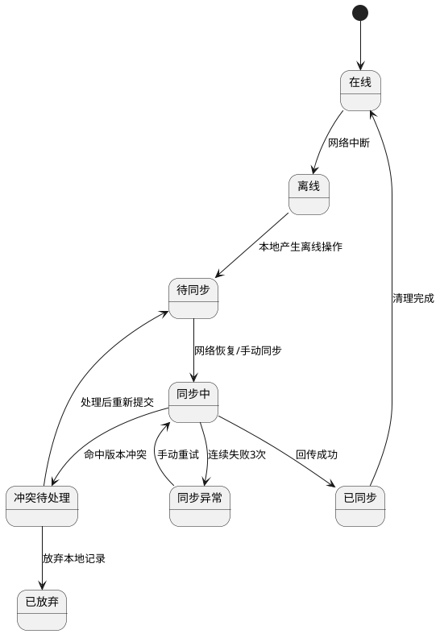

**11.6.5 缓存读取与覆盖规则**

1. 断网时优先读取本地缓存数据，页面需显示“当前为离线模式”状态条、最近同步时间和仅供参考提示。
2. 联网后系统自动拉取最新服务端数据覆盖本地业务快照，本地快照仅保留最近一版可用参考数据。
3. 本地离线操作记录不因服务端快照刷新而被直接覆盖；仅在同步成功或用户确认放弃时清理。
4. 若服务端存在更新后的权威数据，客户端必须提示“服务端数据已更新，以服务端为准”，同时保留本地填写内容供人工复制重提。

**11.6.6 同步顺序与幂等规则**

1. 恢复联网后，系统先校验登录态、Token有效性、组织权限与角色权限；校验失败则暂停同步并提示重新登录。
2. 主数据刷新顺序为：组织与权限上下文 → 基础主数据 → 业务快照数据。
3. 离线业务同步顺序按“业务依赖优先 + 同模块时间顺序”执行：
4. 晨检与身份核验记录优先同步。
5. 烹饪开始/采样/烹饪完成按业务时间升序同步。
6. 入库、出库、盘点按仓库维度和业务时间升序同步。
7. 留样、销样按关联烹饪记录先后顺序同步。
8. 整改提交、巡检日志、附件补传按业务时间升序同步。
9. 每条离线记录必须携带本地操作ID、终端设备标识、业务类型、业务时间组成幂等键，服务端重复接收同一幂等键时必须返回同一业务结果，不得重复建单。
10. 附件与主记录分离同步时，主记录状态先置为“待附件同步”，附件全部成功后才更新为“已同步”。

**11.6.7 冲突处理规则**

1. 断网期间若服务端同一记录已被他人修改、删除、驳回、审批通过或状态推进，则本地重连同步时以服务端数据为准。
2. 命中冲突时，本地记录状态改为“冲突待处理”，不得自动覆盖服务端结果。
3. 冲突提示内容必须包含：业务编号、冲突字段、服务端最新状态、服务端更新时间、本地填写时间、建议处理动作。
4. 用户可执行动作仅限：查看服务端最新数据、复制本地内容重建新草稿、放弃本地记录。
5. 对新增类业务如已存在相同幂等键服务端记录，则视为同步成功，不再重复创建。
6. 对修改类业务如服务端版本号与本地基线版本不一致，则进入冲突待处理，不允许静默覆盖。
7. 对审批、归档、权限、组织、角色等不支持离线的业务，如断网期间误触提交，必须前端直接阻断。

**11.6.8 失败重试与人工处理机制**

1. 自动同步失败后，系统自动重试3次，重试间隔采用递增策略：10秒、30秒、60秒。
2. 3次仍失败的记录标记为“同步异常”，在首页消息中心、我的-同步中心、对应业务列表页同步展示红点提醒。
3. “同步异常”记录必须保留本地完整数据，不得自动覆盖、不丢失、不清空。
4. 用户点击手动重试后，系统重新校验登录态、权限、网络、数据完整性，通过后再次回传。
5. 用户可查看每条同步异常记录的失败原因、失败时间、已重试次数、关联附件状态。
6. 用户可对已无效的本地草稿执行“放弃本地记录”，放弃动作需二次确认并记录日志。

**11.6.9 安全与留痕规则**

1. 离线操作日志、本地业务载荷、附件临时引用均需本地加密存储。
2. 同步成功后清除本地临时缓存，仅保留可追溯操作记录与摘要日志。
3. 放弃本地记录、冲突处理、同步失败、手动重试、服务端覆盖本地快照等动作均需审计留痕。
4. 离线数据按租户、组织、账号、设备隔离，切换账号后不可读取其他账号离线队列。
5. Token失效、账号禁用、员工离职、组织权限被回收时，系统必须停止自动同步，阻断本地回传，并提示重新认证。

---

## 12. 时区处理

**数据库存储**：

- 所有时间戳采用UTC+0存储（国际标准）
- 数据库时区配置：UTC

**前端展示**：

- 前端所有端（后厨操作端、WEB 管理端、移动端、设备大屏）均无需用户手动选择时区，加载时自动从服务端获取核心基准时区配置，将 UTC 时间戳实时转换为本地基准时区的时间格式（如东八区的YYYY-MM-DD HH:mm:ss），保证所有操作人员看到的是本地实际时间，符合操作习惯。
- 例如：存储为"2026-03-05 10:00:00 UTC"，用户在东八区显示为"2026-03-05 18:00:00"

**数据提交**：

- 前端提交的时间自动转换为UTC+0存储
- 跨时区统计时需明确说明统计时区

---

## 13. 客服支持

本项目客服支持模式已明确如下：

- [x] 自助帮助文档（在线Wiki）
- [x] AI智能客服（支持投诉/问题反馈）
- [ ] 企业客服热线（按客户服务等级开通）
- [ ] 付费用户专属支持群（按合同约定开通）

---

## 14. 帮助文档

平台提供以下帮助支持体系：

* **系统帮助文档**：
  
  - 快速入门指南（15分钟上手）
  - 各模块详细操作手册（含截图和视频）
  - FAQ常见问题

* **视频教程**：
  
  - 角色快速入门视频（5-10分钟）
  - 常见操作教程
  - 故障排查视频

* **在线客服**：
  
  - AI智能客服（实时回答常见问题）
  - 人工客服（复杂问题转接，按客户服务等级开通）

---

# 第二部分：智慧厨房全景系统架构设计

## 2.1 感知与边缘计算层 (Edge & IoT Layer)

### 2.1.1 硬件设备矩阵

平台感知层标准设备包括：

- AI 摄像头（明厨亮灶视频采集、违规行为识别输入）
- 温湿度传感器（冷链/仓储/后厨环境采集）
- 智能秤（称重与批次留痕）
- 农残仪（抽检数据采集）
- 人脸闸机/晨检终端（人员晨检与身份核验）
- POS 机（售卖与残食数据采集）

### 2.1.2 边缘网关部署与本地计算要求

- **强制要求**：后厨现场部署工业级边缘网关（Edge Box）。
- AI 视频分析（如未佩戴口罩、违规操作、鼠患迹象）在本地完成推理计算。
- 云端仅接收“结构化事件结果”，包括：违规截图、事件时间、事件类型、设备标识、告警文本。
- 视频原流按权限保留在本地或流媒体服务，不作为高频事件数据直接上云。

### 2.1.3 离线容错机制（产品落地要求）

- **强制要求**：断网场景下，智能秤与 POS 机本地缓存不少于 7 天。
- 本地缓存数据结构至少包含：`device_id`、`tenant_id`、`biz_time`、`trace_batch_id`、`payload`、`sign`。
- 网络恢复后自动触发断点续传，续传策略为“按时间窗口 + 序列号”补传，保证幂等写入。
- 若超过本地缓存阈值，系统需先告警后覆盖，并记录覆盖审计日志。

## 2.2 数据中枢与消息总线 (Data & Middleware Layer)

### 2.2.1 消息队列职责（Kafka/RabbitMQ）

- 承接高频 IoT 上报（温度、油烟机状态、设备心跳等）。
- 对上游设备流进行削峰、缓冲、重试与顺序控制。
- 对下游业务域提供标准事件主题，确保 SCM/MES/QMS/CRM&BI 解耦消费。

### 2.2.2 视频流媒体服务器职责

- 负责 RTSP 流接入、转发、回放索引与权限控制。
- 为“烹饪监管管理、告警详情、监管端回放”提供统一视频服务。
- 与 AI 事件池通过事件 ID 关联，不直接耦合业务审批流程。

### 2.2.3 唯一标识中心（Global ID Generator）

- 为平台生成全局唯一 `trace_batch_id`（溯源追踪码，一箱一码）。
- **编码规则建议**：`TC-{租户}-{组织}-{日期YYYYMMDD}-{流水}-{校验位}`。
- **全局唯一性要求**：跨租户、跨组织、跨终端不可重复；支持分布式并发生成。
- **关联范围**：采购单、入库批次、出库批次、烹饪任务、留样记录、告警事件、监管报表。

## 2.3 核心业务中台 (Business Domains / 微服务划分)

### 2.3.1 微服务域职责定义

#### 1) SCM 供应链域 (Supply Chain Management)

- **负责步骤**：采购预测（Step 0）-> 食材验收（Step 2）-> 仓储盘点（Step 3）
- **核心模块**：供应商主数据、采购引擎、智能入出库、BOM（菜谱配方）管理、效期预警
- **特性要求**：与后厨执行域故障隔离，即使烹饪侧异常，仓储与收货仍可独立运行

#### 2) MES 生产执行域 (Manufacturing Execution System)

- **负责步骤**：加工准备（Step 5）-> 烹饪（Step 6）-> 售卖与残食（Step 7/11）
- **核心模块**：生产排班、KDS 后厨履约看板、工序流转引擎、菜品出品管控
- **特性要求**：高实时响应，关键页面支持无刷新倒计时与状态推送

#### 3) QMS 质量与合规域 (Quality Management System)

- **负责步骤**：人员晨检（Step 1）-> 抽检（Step 4）-> 留样（Step 8）-> 危机熔断
- **核心模块**：IoT 规则引擎、AI 违规事件池、电子台账生成器、区块链存证上链
- **特性要求**：旁路监听模式，不阻断主交易链路，专注风险监测与证据固化

#### 4) CRM & BI 客户与决策域

- **负责步骤**：前厅展示（Step 9）-> 后台数据治理（Step 10）
- **核心模块**：营养摄入模型、客诉工单闭环、成本毛利核算、大屏驾驶舱（Dashboard）
- **特性要求**：面向经营复盘与监管协同，保证指标一致与可追溯

### 2.3.2 与 PRD 业务模块关联映射

| 微服务域     | 关联 PRD 功能模块               | 对应章节（第四部分）                                          | 核心支撑能力                 |
| -------- | ------------------------- | --------------------------------------------------- | ---------------------- |
| SCM      | 采购管理、仓储管理                 | 模块1（1.1-1.4）、模块2（2.1-2.6）                           | 采购预测、收货验收、库存流转、盘点与预警   |
| MES      | 菜谱营养管理、烹饪记录管理、后厨操作端       | 模块3（3.1-3.4）、模块4（4.1）、模块14（14.1-14.3）               | 排产、任务执行、温度时长采集、出品过程控制  |
| QMS      | 智能人脸晨检、留样管理、烹饪监管管理、AI告警管理 | 模块6（6.1-6.3）、模块5（5.1-5.3）、模块7（7.1-7.4）、模块9（9.1-9.2） | 晨检合规、违规识别、留样销样、告警闭环与存证 |
| CRM & BI | 数据监管、评价管理、移动端监管视图         | 模块11（11.1）、模块12（12.1-12.2）、模块13（13.1-13.2）          | 监管看板、客诉闭环、经营分析与指标复盘    |

### 2.3.3 域间通信与解耦原则

- 域间通信以标准 API + 事件总线组合方式实现。
- 写操作由主责域受理，跨域通过事件通知同步，避免双写冲突。
- 所有跨域事件必须携带 `trace_batch_id` 与 `tenant_id`，保证追溯链完整。

## 2.4 应用触点层 (Application Touchpoints)

### 2.4.1 监管端

- **产品形态**：Web 驾驶舱大屏、手机预警 App。
- **核心内容**：违规告警、溯源记录、整改进度、风险趋势。
- **对应功能**：第四部分 模块11（数据监管）、模块9（AI告警）、模块7（烹饪监管）。

### 2.4.2 后厨操作端

- **产品形态**：KDS 工业触屏大屏、仓管 PDA 扫码安卓 App。
- **核心内容**：任务看板、启停控制、温度采集、出入库扫码、盘点执行。
- **对应功能**：第四部分 模块14（后厨操作端）、模块4（烹饪记录）、模块2（仓储）。

### 2.4.3 消费者端

- **产品形态**：微信小程序/移动应用。
- **核心内容**：菜品与营养查看、就餐反馈、视频回放授权访问。
- **对应功能**：第四部分 模块12（评价管理）、模块13（移动端）、模块7（监管回放能力）。

## 2.5 系统开发核心红线要求

### 2.5.1 红线一：溯源链不可断

- **原则定义**：任何业务节点必须可追溯到上游批次与下游处置。
- **落地要求**：采购、入库、出库、烹饪、留样、告警、报表全链路强制关联 `trace_batch_id`。
- **核心约束点**：缺失追踪码的数据不得进入正式业务状态；仅可进入异常池等待补偿。

### 2.5.2 红线二：软硬解耦

- **原则定义**：业务能力不直接绑定单一设备厂商协议。
- **落地要求**：通过设备抽象层（Device Abstraction Layer）统一接入摄像头、传感器、秤、闸机、POS。
- **核心约束点**：业务模块仅调用标准设备能力接口（采集、控制、告警），不得直接耦合厂商 SDK。

### 2.5.3 红线三：权限隔离

- **原则定义**：按租户、组织、角色进行最小权限访问控制。
- **落地要求**：采用 RBAC + 数据域隔离（组织范围、业务范围、字段脱敏）并全量审计。
- **核心约束点**：任何跨组织数据访问必须经过授权校验；越权访问实时拦截并留痕。

### 2.5.4 架构落地补充约束

- 离线补传、事件重放、审计追踪均需支持按 `tenant_id + trace_batch_id` 检索。
- 架构变更不得破坏第四部分既有业务闭环（采购->仓储->烹饪->留样->监管）。
- 涉及监管证据链的关键事件（违规截图、处置记录、复核结果）需满足不可篡改留存要求。

### 2.5.5 全链路追溯与跨端事件一致性约束

- 所有正式业务主记录、关键子记录、离线补传记录、设备回执记录、附件元数据必须统一携带 `tenant_id`、`trace_batch_id`、`biz_event_id`、`source_terminal`、`source_device_id` 五类追溯字段；任一关键字段缺失时，不得进入正式生效、归档、闭环状态。
- `trace_batch_id` 作为全链路食安追溯主键，必须贯穿 `采购订单 → 入库批次 → 库存批次台账 → 领用出库/物料消耗快照 → 烹饪任务 → 留样任务 → 销样任务 → 告警/整改/评价申诉 → 监管报表`；上游已存在合法追溯批次时必须继承，不得重新生成冲突批次。
- `biz_event_id` 作为关键业务动作事件ID，适用于提交、审核、生效、执行、派单、复核、归档、离线补传等关键节点；同一动作在 WEB 端、移动端、后厨端、智能设备侧必须共用同一事件ID或可映射到同一主事件ID。
- `source_terminal` 取值统一限定为 `Web/PC/Mobile/Pad/KDS/Device/API/OfflineSync`；`source_device_id` 在智能设备、离线补传、扫码/PDA、后厨小屏场景下必填，用于跨端追责与异常定位。
- 所有图片、视频、温度曲线、检测报告、晨检附件、留样/销样附件、违规片段、整改佐证必须归集到统一 `evidence_chain_id` 证据链编号；证据文件需记录文件哈希、生成时间、操作者、来源终端、保留策略，禁止无链路孤立存储。
- 任何业务对象存在下游执行、归档、闭环、事故核查、客诉调查、监管抽检等情况时，系统必须写入 `regulatory_lock_status`；锁定后仅允许查看、补证、追加说明，不允许执行破坏链路完整性的删除、反审核、撤回、回退、销样等动作。
- 跨端状态同步以服务端主状态为准，WEB端、移动端、后厨端、智能设备看板的状态、时间戳、异常标记、待办红点同步时延不超过3秒；同一主记录出现跨端状态不一致时，必须进入“状态一致性异常队列”并提供人工处理入口。
- 离线场景下本地缓存仅允许保存加密后的待同步数据；联网补传按“主事件 → 子事件 → 附件/证据 → 状态回写”顺序执行，若服务端状态已变化，则以服务端为准并生成冲突记录，不得静默覆盖。
- 评价差评、投诉申诉、AI告警、晨检异常、留样异常命中食安高风险条件时，必须能反查同一 `trace_batch_id` 对应的采购来源、入库批次、出库去向、烹饪记录、留样销样、整改工单与监管看板风险事件。

---

# 第三部分：用户·场景·流程全解析

## 3.1 板块1：核心用户角色全解析

| 角色名称     | 岗位职责             | 核心操作权限                   | 常用操作端          | 操作核心诉求              |
| -------- | ---------------- | ------------------------ | -------------- | ------------------- |
| 系统管理员    | 维护平台配置、账号体系与审计策略 | 全局配置、角色授权、日志审计、基础参数维护    | Web端/PC端       | 平台稳定可控、权限边界清晰、审计可追溯 |
| 食堂负责人    | 统筹食堂运营与成本质量目标    | 采购与仓储审批、看板决策、异常处置督办      | Web端/PC端/移动端   | 成本可控、供应稳定、食品安全达标    |
| 采购专员     | 负责供应商与采购业务闭环     | 供应商管理、采购计划、采购订单、收货协同     | Web端/PC端/移动端   | 快速下单、价格合理、履约可追踪     |
| 仓库管理员    | 保障库存准确与出入库规范     | 仓库仓位、物料主数据、入库/出库、盘点、预警处置 | Web端/PC端/移动端   | 库存准确、损耗可控、临期风险可预警   |
| 后厨主管     | 负责出餐组织与现场监督      | 菜谱计划审核、任务调度、异常督办、质量复盘    | Web端/PC端/后厨操作端 | 出餐准时、流程规范、异常快速闭环    |
| 一线厨师     | 执行烹饪任务并回传过程数据    | 查看任务、启停烹饪、温度采集、任务完成确认    | 后厨操作端/移动端      | 操作简单、指令明确、过程可追溯     |
| 食品安全员    | 负责食安过程监管与问题闭环    | 留样与销样、违规处理、风险告警联动        | Web端/PC端/移动端   | 风险早发现、证据链完整、合规可核查   |
| 人事/健康管理员 | 维护员工与健康合规数据      | 员工档案、健康证管理、晨检规则与记录       | Web端/PC端/移动端   | 人员合规在线、到期风险可预警      |
| 设备管理员    | 维护设备可用性与联动稳定性    | 设备档案、参数配置、在线状态监控、告警联动    | Web端/PC端       | 设备在线稳定、采集准确、异常可恢复   |
| 营养师      | 负责菜谱营养分析与膳食优化    | 菜谱营养分析、营养报告生成、膳食方案审核     | Web端/PC端       | 营养达标、膳食均衡、健康可量化     |
| 财务管理员    | 负责成本核算与财务数据管理    | 成本报表查看、财务数据导出、预算对比分析     | Web端/PC端       | 成本透明、数据准确、预算可控      |
| 投诉处理员    | 处理评价申诉与客诉闭环      | 评价分析、申诉处理、整改跟踪           | Web端/PC端/移动端   | 客诉闭环及时、整改可追溯        |
| 监管查看员    | 对外输出监管视图与合规数据    | 监管看板只读、合规数据导出、监管报告生成     | Web端/PC端       | 监管指标透明、数据可追溯、合规可核查  |

## 3.2 板块2：核心业务场景清单（全覆盖）

| 场景编号   | 所属业务模块       | 场景名称             | 服务用户                   | 使用操作端     | 触发条件            | 核心诉求                   |
| ------ | ------------ | ---------------- | ---------------------- | --------- | --------------- | ---------------------- |
| SC-01  | 采购管理         | 供应商准入与审核         | 采购专员、食堂负责人             | Web/PC/移动 | 新增或更新供应商资质      | 保障供应商合规可用，支持批量导入       |
| SC-02  | 采购管理         | 采购计划编制与审批        | 采购专员、食堂负责人             | Web/PC/移动 | 周期补货/库存预警/临时需求  | 需求准确、审批高效，支持批量编制       |
| SC-03  | 采购管理         | 采购订单下达与履约跟踪      | 采购专员                   | Web/PC/移动 | 采购计划通过后         | 全流程状态可视、异常可追踪          |
| SC-04  | 采购管理/仓储管理    | 到货验收与收货入库联动      | 采购专员、仓库管理员             | Web/PC/移动 | 订单到货待入库         | 账实一致、证据留存              |
| SC-05  | 仓储管理         | 仓库仓位维护与容量管控      | 仓库管理员                  | Web/PC    | 新建仓库/仓位或状态变化    | 存储能力清晰、空间可控            |
| SC-06  | 仓储管理         | 物料主数据维护          | 仓库管理员                  | Web/PC    | 新物料启用或规则调整      | 库存口径统一、规则准确            |
| SC-07  | 仓储管理         | 入库单处理与审核生效       | 仓库管理员、食堂负责人            | Web/PC/移动 | 新增入库单提交         | 入库规范、库存实时更新，支持批量入库     |
| SC-08  | 仓储管理         | 出库单处理与用途追踪       | 仓库管理员、食堂负责人            | Web/PC/移动 | 领用/退货/调拨等出库     | 出库可控、去向可追溯，支持批量出库      |
| SC-09  | 仓储管理         | 盘点与差异闭环          | 仓库管理员、食堂负责人            | Web/PC/移动 | 周期盘点或异常触发       | 账实差异收敛，盘点期间库存锁定，支持批量盘点 |
| SC-10  | 仓储管理         | 库存预警与补货决策        | 仓库管理员、采购专员             | Web/PC/移动 | 低库/积压/临期/过期     | 风险前置、减少损耗              |
| SC-11  | 菜谱营养管理       | 菜谱库维护与营养分析       | 后厨主管、营养师               | Web/PC    | 新增或优化菜谱         | 营养达标、成本可控              |
| SC-12  | 菜谱营养管理       | 菜谱计划生成与审核发布      | 后厨主管、食堂负责人             | Web/PC/移动 | 日/周/月排餐编制       | 排餐可执行、审核可闭环            |
| SC-13  | 烹饪记录管理/后厨操作端 | 烹饪任务执行与过程采集      | 一线厨师、后厨主管              | 后厨操作端     | 菜谱计划审核通过后自动生成任务 | 温度时长合规、过程留痕            |
| SC-14  | 留样管理         | 留样登记与AI质量评估      | 食品安全员、一线厨师             | Web/PC/移动 | 烹饪任务完成后         | 留样可追溯、质量可评估            |
| SC-15  | 留样管理         | 销样提醒与销样执行        | 食品安全员                  | Web/PC/移动 | 留样满48小时或到期      | 合规销样、证据完整              |
| SC-16  | 智能人脸晨检       | 晨检核验与异常预警        | 人事/健康管理员、一线厨师          | Web/PC/移动 | 上岗前晨检           | 人员健康合规                 |
| SC-17  | 烹饪监管管理       | 实时监控、违规识别与回放     | 食品安全员、后厨主管             | Web/PC/移动 | 监管巡检或告警触发       | 违规可识别、可回放取证            |
| SC-18a | 设备管理         | 设备档案维护与参数配置      | 设备管理员                  | Web/PC    | 新设备接入或参数调整      | 设备信息完整、参数准确            |
| SC-18b | 设备管理         | 设备状态监控与���线管理    | 设备管理员                  | Web/PC    | 设备离线或状态异常       | 设备在线稳定、异常可恢复           |
| SC-18c | AI告警管理       | AI告警触发与处置闭环      | 设备管理员、食品安全员            | Web/PC/移动 | 阈值越界、事件告警       | 告警及时、处置闭环              |
| SC-19  | 组织员工权限域      | 组织、员工、健康证、角色权限管理 | 系统管理员、人事管理员            | Web/PC/移动 | 人员入转调离或权限变更     | 权责一致、数据隔离              |
| SC-20  | 数据监管/评价管理    | 监管看板、评价申诉与统计分析   | 食堂负责人、投诉处理员、监管查看员      | Web/PC/移动 | 日常复盘、客诉触发、监管核查  | 指标透明、整改闭环              |
| SC-21  | 移动端          | 移动巡检与快捷业务处理      | 食堂负责人、采购专员、仓库管理员、食品安全员 | 移动端       | 非工位场景下处理待办      | 随时处理、跨岗协同              |
| SC-22  | 后厨操作端        | 后厨任务集中执行         | 一线厨师、后厨主管              | 后厨操作端     | 餐次开始、任务下发       | 低门槛操作、高执行效率            |
| SC-23  | 仓储管理         | 跨食堂物料调拨          | 仓库管理员、食堂负责人            | Web/PC/移动 | 集团内多食堂间物料调配     | 调拨可追溯、库存实时同步           |
| SC-24  | 数据监管         | 集团数据汇总与多组织看板     | 系统管理员、财务管理员            | Web/PC    | 集团层级数据查看需求      | 多组织数据汇总、成本对比分析         |
| SC-25  | 员工就餐管理       | 员工订餐与就餐预约        | 就餐员工                   | 移动端       | 员工提前预约就餐        | 预约便捷、就餐有序              |
| SC-26  | 评价管理         | 员工就餐评价与反馈提交      | 就餐员工                   | 移动端       | 就餐后评价提交         | 评价便捷、反馈及时              |

## 3.3 核心业务场景全流程图（纯文本结构化）

### 3.3.1 格式规则说明

- `↓`=正向推进。
- `├─/└─`=分支判断。
- `[触发/通过/拒绝/异常/空态]`=场景标注。
- 节点统一格式：`执行角色【操作端】→ 核心操作（操作细节）→ 状态：XXX`。
- 跨流程联动统一格式：`→ 【XX业务模块-XX场景名称】`。
- 每个场景均包含 `[异常]`、`[回退]`、`[空态]`，确保闭环。
- 全局权限规则：任何操作若角色权限不足，系统统一拒绝并记录审计日志，不再在各场景中单独重复说明。

### 3.3.2 采购管理流程

#### SC-01 供应商准入与审核

[触发] 新增供应商 / 更新资质 / 复审到期
↓
采购专员【Web/PC/移动】→ 新增或编辑供应商（基础信息+资质）→ 状态：待审核
├─ 支持单个录入
└─ 支持批量导入（Excel模板，自动校验必填项与资质有效期）
↓
食堂负责人【Web/PC/移动】→ 审核供应商
├─ [通过] → 状态：已审核
└─ [拒绝] → 状态：已驳回
↓
采购专员【Web/PC/移动】→ 维护供应商档案与评分结果
↓
→ 【采购管理-SC-02 采购计划编制与审批】
[异常]

- 资质缺失/过期 → 阻断提交并提示补全。
- 禁用条件不满足（存在待审批采购订单、未入库/部分入库采购订单、待审批入库单） → 阻断禁用并提示先处理完成相关业务。
- 批量导入数据格式错误 → 返回错误行号与原因，支持修正后重新导入。
  [回退]
- 已驳回供应商修订后重提 → 状态回到待审核。
- 注销条件不满足（存在未完成采购订单或未闭环入库单） → 拒绝注销并保持原状态。
- 删除条件不满足（已存在采购订单或入库单业务引用） → 拒绝删除并保持原状态。
  [空态]
- 无供应商数据 → 展示空态并引导”新增供应商”或”批量导入”。

#### SC-02 采购计划编制与审批

[触发] 周期补货 / 库存预警触发（来源：【仓储管理-SC-10 库存预警与补货决策】）/ 临时需求申请
↓
采购专员【Web/PC/移动】→ 编制采购计划（物料+数量+预算+供应商）→ 状态：待提交
├─ 手动编制
├─ 基于库存预警自动生成
└─ 批量导入（Excel模板，支持多物料快速编制）
↓
采购专员【Web/PC/移动】→ 提交采购计划 → 状态：待审核
↓
食堂负责人【Web/PC/移动】→ 审核采购计划
├─ [通过] → 状态：已审核
└─ [拒绝] → 状态：已驳回
↓
→ 【采购管理-SC-03 采购订单下达与履约跟踪】
[异常]

- 预算超限 → 阻断提交并提示调整。
- 供应商未审核 → 阻断提交并提示先完成供应商审核（【采购管理-SC-01】）。
- 批量导入数据缺失必填项 → 返回错误行号，支持修正后重新导入。
  [回退]
- 已驳回计划修订后重提 → 状态回到待审核。
- 已审核计划可撤回（订单未下达） → 状态回到待提交。
  [空态]
- 无采购计划 → 展示空态并引导”新增计划”、”基于预警生成”或”批量导入”。

#### SC-03 采购订单下达与履约跟踪

[触发] 采购计划审核通过
↓
采购专员【Web/PC/移动】→ 基于采购计划生成采购订单（自动带入计划信息）→ 状态：待下达
↓
采购专员【Web/PC/移动】→ 下达订单至供��商（系统推送或手动通知）→ 状态：已下达
↓
供应商【外部系统/人工】→ 确认订单并安排发货 → 状态：已确认
↓
采购专员【Web/PC/移动】→ 跟踪物流与到货时间 → 状态：配送中
↓
采购专员【Web/PC/移动】→ 确认到货 → 状态：待验收
↓
→ 【采购管理/仓储管理-SC-04 到货验收与收货入库联动】
[���常]

- 供应商拒单 → 状态：已取消，通知采购专员重新选择供应商。
- 配送超时 → 系统告警，采购专员联系供应商并更新预计到货时间。
- 订单下达后供应商失联 → 标记异常，支持订单取消并重新下单。
  [回退]
- 已下达订单可取消（供应商未确认） → 状态回到待下达。
- 已确认订单可协商取消（需供应商同意） → 状态回到已取消。
  [空态]
- 无采购订单 → 展示空态并引导”基于计划生成订单”。

#### SC-04 到货验收与收货入库联动

[触发] 采购订单到货待验收
↓
采购专员【Web/PC/移动】→ 发起验收（核对数量、质量、资质，支持扫码拍照留证）→ 状态：验收中
↓
采购专员【Web/PC/移动】→ 验收结果确认
├─ [合格] → 状态：验收通过
└─ [不合格] → 状态：验收不通过
↓
[合格分支]
仓库管理员【Web/PC/移动】→ 创建入库单（自动关联订单信息）→ 状态：待入库
↓
→ 【仓储管理-SC-07 入库单处理与审核生效】
↓
[不合格分支]
采购专员【Web/PC/移动】→ 发起退货或换货流程 → 状态：待退货/待换货
↓
供应商【外部系统/人工】→ 处理退换货 → 状态：已退货/已换货
[异常]

- 到货数量与订单不符 → 记录差异，支持部分验收或全部拒收。
- 资质文件缺失 → 阻断验收通过，要求供应商补充。
- 验收超时未处理 → 系统告警，通知采购专员与仓库管理员。
  [回退]
- 验收不通过可重新验收（供应商补货后） → 状态回到验收中。
- 已创建入库单可撤回（入库单未审核） → 状态回到验收通过。
  [空态]
- 无待验收订单 → 展示空态并引导”查看采购订单”。

### 3.3.3 仓储管理流程

#### SC-05 仓库仓位维护与容量管控

[触发] 新建仓库/仓位 / 仓位状态变化 / 容量调整
↓
仓库管理员【Web/PC】→ 新增或编辑仓库（名称+类型+容量）→ 状态：启用/停用
↓
仓库管理员【Web/PC】→ 新增或编辑仓位（编号+容量+存储规则）→ 状态：可用/占用/维护中
↓
仓库管理员【Web/PC】→ 设置仓位存储规则（物料类型限制、温度要求等）
↓
系统【自动】→ 实时计算仓位占用率与剩余容量
↓
→ 【仓储管理-SC-07 入库单处理与审核生效】（入库时自动分配仓位）
[异常]

- 仓位容量超限 → 阻断入库并提示调整仓位或扩容。
- 仓位规则冲突（如冷藏物料分配至常温仓位） → 阻断分配并提示重新选择。
- 仓位维护中仍有库存 → 阻断状态变更并提示先清空库存。
  [回退]
- 仓位停用可恢复启用（无库存占用） → 状态回到可用。
- 仓库停用可恢复启用（所有仓位已清空） → 状态回到启用。
  [空态]
- 无仓库数据 → 展示空态并引导”新增仓库”。
- 无仓位数据 → 展示空态并引导”新增仓位”。

#### SC-06 物料主数据维护

[触发] 新物料启用 / 物料规则调整 / 物料停用
↓
仓库管理员【Web/PC】→ 新增或编辑物料（名称+分类+单位+保质期+预警规则）→ 状态：启用/停用
↓
仓库管理员【Web/PC】→ 设置物料预警规则（低库存阈值、临期天数、过期处理规则）
↓
系统【自动】→ 关联物料至仓位存储规则（如冷藏物料仅可存放冷藏仓位）
↓
→ 【仓储管理-SC-07 入库单处理与审核生效】（入库时选择物料）
→ 【仓储管理-SC-10 库存预警与补货决策】（预警规则生效）
[异常]

- 物料名称重复 → 阻断提交并提示修改。
- 物料停用时仍有库存 → 阻断停用并提示先清空库存。
- 预警规则设置不合理（如低库存阈值大于最大库存） → 阻断提交并提示调整。
  [回退]
- 物料停用可恢复启用（无库存占用） → 状态回到启用。
- 物料规则调整后支持查看历史版本。
  [空态]
- 无物料数据 → 展示空态并引导”新增物料”。

#### SC-07 入库单处理与审核生效

[触发] 采购入库 / 退货入库 / 调拨入库 / 盘盈入库
↓
仓库管理员【Web/PC/移动】→ 创建入库单（物料+数量+仓位+来源）→ 状态：待提交
├─ 单个入库单录入
└─ 批量入库（Excel模板，支持多物料快速入库）
↓
仓库管理员【Web/PC/移动】→ 提交入库单 → 状态：待审核
↓
食堂负责人【Web/PC/移动】→ 审核入库单
├─ [通过] → 状态：已审核
└─ [拒绝] → 状态：已驳回
↓
系统【自动】→ 库存增加，更新仓位占用率
↓
→ 【仓储管理-SC-10 库存预警与补货决策】（库存变化触发预警重算）
[异常]

- 仓位容量不足 → 阻断提交并提示调整仓位或分批入库。
- 物料未启用 → 阻断提交并提示先启用物料。
- 批量入库数据格式错误 → 返回错误行号与原因，支持修正后重新导入。
  [回退]
- 已驳回入库单修订后重提 → 状态回到待审核。
- 已审核入库单可撤回（未发生后续出库） → 状态回到待提交，库存回退。
  [空态]
- 无入库单 → 展示空态并引导”新增入库单”或”批量入库”。

#### SC-08 出库单处理与用途追踪

[触发] 领用出库 / 退货出库 / 调拨出库 / 盘亏出库
↓
仓库管理员【Web/PC/移动】→ 创建出库单（物料+数量+用途+领用人）→ 状态：待提交
├─ 单个出库单录入
└─ 批量出库（Excel模板，支持多物料快速出库）
↓
仓库管理员【Web/PC/移动】→ 提交出库单 → 状态：待审核
↓
食堂负责人【Web/PC/移动】→ 审核出库单
├─ [通过] → 状态：已审核
└─ [拒绝] → 状态：已驳回
↓
系统【自动】→ 库存减少，更新仓位占用率
↓
→ 【仓储管理-SC-10 库存预警与补货决策】（库存变化触发预警重算）
[异常]

- 库存不足 → 阻断提交并提示调整数量或补货。
- 物料已停用 → 阻断提交并提示先启用物料。
- 批量出库数据格式错误 → 返回错误行号与原因，支持修正后重新导入。
  [回退]
- 已驳回出库单修订后重提 → 状态回到待审核。
- 已审核出库单可撤回（未发生后续入库） → 状态回到待提交，库存回退。
  [空态]
- 无出库单 → 展示空态并引导”新增出库单”或”批量出库”。

#### SC-09 盘点与差异闭环

[触发] 周期盘点（月度/季度） / 异常触发（库存异常告警）
↓
仓库管理员【Web/PC/移动】→ 创建盘点任务（盘点范围+盘点时间）→ 状态：待开始
↓
系统【自动】→ 盘点期间锁定库存（禁止入库/出库操作，确保盘点准确性）
↓
仓库管理员【Web/PC/移动】→ 开始盘点（逐一核对实物与账面库存）→ 状态：盘点中
├─ 单个物料盘点
└─ 批量盘点（扫码枪快速录入，支持离线模式）
↓
仓库管理员【Web/PC/移动】→ 提交盘点结果 → 状态：待审核
↓
系统【自动】→ 计算盘点差异（盘盈/盘亏明细）
↓
食堂负责人【Web/PC/移动】→ 审核盘点结果
├─ [通过] → 状态：已审核
└─ [拒绝] → 状态：已驳回，退回重盘
↓
系统【自动】→ 库存调整（盘盈入库/盘亏出库），解除库存锁定
↓
→ 【仓储管理-SC-10 库存预警与补货决策】（库存变化触发预警重算）
[异常]

- 盘点期间有入库/出库请求 → 阻断操作并提示”盘点进行中，库存已锁定”。
- 盘点差异超阈值（如差异率>5%） → 强制要求填写差异原因并复盘确认。
- 盘点任务超时未提交 → 系统告警并通知食堂负责人。
  [回退]
- 已驳回盘点退回重盘 → 解锁库存，状态回到待开始。
- 盘点进行中可撤销 → 状态回到待开始，解除锁定。
  [空态]
- 无盘点任务 → 展示空态并引导”新增盘点任务”。

#### SC-10 库存预警与补货决策

[触发] 低库/积压/临期/过期预警（系统自动触发）
↓
系统【自动】→ 按物料预警规则实时计算预警状态 → 状态：低库预警/积压预警/临期预警/过期预警
↓
仓库管理员【Web/PC/移动】→ 查看预警看板与预警明细
↓
仓库管理员/采购专员【Web/PC/移动】→ 决策处理方式
├─ 低库/积压预警 → 生成补货建议 → 【采购管理-SC-02 采购计划编制与审批】
├─ 临期预警 → 标记临期物料，加速消耗（推送至菜谱计划）→ 【菜谱营养管理-SC-12 菜谱计划生成与审核发布】
└─ 过期预警 → 锁定过期物料，发起报废出库 → 【仓储管理-SC-08 出库单处理与用途追踪】
[异常]

- 预测服务异常 → 标记异常来源，允许人工手动处理预警。
- 物料预警规则未配置 → 提示配置预警规则（【仓储管理-SC-06 物料主数据维护】）。
  [回退]
- 补货建议生成前可撤销 → 回退预警列表待处理状态。
  [空态]
- 无预警数据 → 展示”当前库存健康，无预警”。

### 3.3.4 菜谱营养管理流程

#### SC-11 菜谱库维护与营养分析

[触发] 新增菜谱 / 菜谱优化
↓
后厨主管【Web/PC】→ 新增或编辑菜谱（做法、食材配比、目标温度/时长）→ 状态：草稿
↓
营养师【Web/PC】→ 执行AI营养分析并提出优化建议 → 状态：待发布
↓
后厨主管【Web/PC】→ 确认营养分析结果后发布菜谱 → 状态：已发布
↓
→ 【菜谱营养管理-SC-12 菜谱计划生成与审核发布】
[异常]

- 菜谱关键字段缺失（食材/做法/温度目标） → 阻断保存。
- AI营养分析服务异常 → 标记异常来源，允许跳过营养分析直接发布（需后厨主管确认）。
- 菜谱关联食材库存不足 → 提示告警，允许继续保存（排餐时阻断）。
  [回退]
- 未发布草稿可修改或撤销 → 回退上版已发布数据。
  [空态]
- 无菜谱数据 → 展示空态并引导"新增菜谱"。

#### SC-12 菜谱计划生成与审核发布

[触发] 日/周/月排餐编制（定期触发或手动发起）
↓
后厨主管【Web/PC/移动】→ 新建菜谱计划（日期+餐次+就餐人数+菜谱组合）→ 状态：待提交
↓
系统【自动】→ 生成食材需求快照、食材总用量快照、营养基线快照，并校验启用菜谱、食材主数据、库存可用量（联动：【仓储管理-SC-10 库存预警与补货决策】）
├─ [校验通过] → 允许提交
└─ [校验不通过] → 阻断提交并提示缺口明细、替换建议或补货建议
↓
后厨主管【Web/PC/移动】→ 提交菜谱计划 → 状态：待审核
↓
食堂负责人【Web/PC/移动】→ 审核菜谱计划
├─ [通过] → 状态：已审核
└─ [拒绝] → 状态：已驳回
↓
系统【自动】→ 审核通过后执行联动：

1. 固化菜谱、做法、食材、人数、营养分析快照
2. 生成备料需求清单，供【仓储管理-SC-08 出库单处理与用途追踪】引用发起领用出库
3. 自动生成烹饪任务，并为每个烹饪任务预生成待留样任务
   ↓
   → 【烹饪记录管理/后厨操作端-SC-13 烹饪任务执行与过程采集】
   [异常]
- 菜谱计划提交后发现库存变动、菜谱被禁用、食材被归档 → 阻断烹饪任务与备料清单生成，并通知后厨主管、仓库管理员处理。
- 审核通过但烹饪任务生成失败 → 系统告警，支持手动重新生成；计划状态保持已审核未生效。
- 烹饪任务生成成功但待留样任务生成失败 → 记录补偿任务并触发异常告警。
  [回退]
- 已驳回计划修订后重提 → 状态回到待审核。
- 已审核计划可撤回（烹饪任务未开始、领用出库未执行） → 状态回到待提交，已生成任务与待留样任务同步取消。
- 已生效计划如需变更 → 仅允许通过调整申请处理，不允许直接改写原计划。
  [空态]
- 无菜谱计划 → 展示空态并引导"新建菜谱计划"或"从菜谱库快速生成"。

### 3.3.5 烹饪记录管理与留样流程

#### SC-13 烹饪任务执行与过程采集

[触发] 菜谱计划已生效，且进入当日/当餐次执行窗口
↓
系统【自动】→ 向后厨操作端推送烹饪任务，并同步到WEB端查看页、移动端待办与监管看板
↓
系统【自动】→ 校验关联领用出库/备料状态
├─ [已备料] → 允许开始烹饪
└─ [未备料/回写失败] → 阻断开始并提示先完成领用出库
↓
一线厨师【后厨操作端】→ 开始烹饪（时间窗+角色校验+设备在线校验）→ 状态：烹饪中
↓
系统【自动】→ 启动温度传感器并每30秒采集温度，实时执行AI温度/时长/食安阈值判定，过程数据同步WEB端只读查看
↓
一线厨师【后厨操作端】→ 完成烹饪 → 状态：已完成
↓
系统【自动】→ 停止采集、固化温度与时长数据、回写菜谱计划执行状态、解锁对应待留样任务
↓
→ 【留样管理-SC-14 留样登记与AI质量评估】
[异常]

- 关联领用出库未执行、被反审核或跨组织不一致 → 禁止开始烹饪。
- 非指定厨师/非时间窗启动 → 禁止操作并提示。
- 温度超阈值/采集中断 → 触发告警并要求复核。
- 烹饪完成后数据归档失败 → 状态保持已完成并进入补偿同步队列。
  [回退]
- 任务未开始前由后厨主管取消 → 状态：已取消/待排产/待备料。
- 已开始任务不允许通过页面直接回退，仅允许走异常补偿流程。
  [空态]
- 当前餐次无任务 → 展示空态。

#### SC-14 留样登记与AI质量评估

[触发] 对应烹饪任务已完成，且系统已解锁待留样任务
↓
系统【自动】→ 展示已预生成的待留样任务，并回填菜谱、烹饪记录、计划信息 → 状态：待留样
↓
食品安全员/后厨主管【Web/PC/移动】→ 执行留样（关联任务、重量、存储位置、附件）→ 状态：已留样
↓
系统【自动】→ 联动智能留样设备识别并触发AI质量评估
├─ [评估完成] → 状态：已评估
└─ [设备离线/评估异常] → 保持已留样并进入人工复核队列
↓
系统【自动】→ 留样提交成功后激活对应销样任务与提醒计划
↓
→ 【留样管理-SC-15 销样提醒与销样执行】
[异常]

- 关联任务缺失/附件不合规 → 阻断提交。
- 留样任务未解锁或烹饪任务未完成 → 禁止执行留样。
- 智能留样设备离线、AI评估服务异常 → 记录异常并允许人工补录评估说明。
  [回退]
- 留样未提交前可修改。
  [空态]
- 无待留样任务 → 展示空态。

#### SC-15 销样提醒与销样执行

[触发] 留样满48小时/到期规则触发
↓
系统【Web/PC/移动】→ 推送销样提醒→ 状态：待销样
↓
食品安全员【Web/PC/移动】→ 执行销样（备注+附件）→ 状态：已销样
↓
系统【自动】→ 回写留样状态、停止提醒计划、同步更新监管看板与统计结果
↓
→ 【数据监管/评价管理-SC-20 监管看板、评价申诉与统计分析】
[异常]

- 销样证据缺失 → 阻断提交。
- 超时未销样 → 自动标记已过期并升级提醒。
- 记录被事故核查或客诉调查锁定 → 禁止销样并提示监管锁定原因。
  [回退]
- 销样提交前可撤销编辑。
  [空态]
- 无待销样记录 → 展示空态。

### 3.3.6 智能人脸晨检流程

#### SC-16 晨检核验与异常预警

[触发] 每日00:00自动生成晨检任务 / 员工上岗前晨检
↓
系统【自动】→ 为在岗后厨员工生成当日晨检任务，并同步人脸录入状态、健康证状态、晨检设备可用状态
↓
员工本人【晨检端/移动】→ 通过人脸识别完成人员身份核验
├─ [通过] → 自动打开本人当日晨检任务
└─ [失败/未录入] → 阻断晨检并提示先完成人脸录入或人工复核
↓
员工本人【晨检端/移动】→ 完成体温检测、健康证自动校验、手部健康检查并提交
↓
系统【自动】→ 生成晨检结论与不可篡改台账
├─ [通过] → 状态：可上岗
└─ [异常] → 状态：禁止上岗并触发预警、待办和消息提醒
↓
人事/健康管理员【Web/PC】→ 查看异常台账、处理健康证或人员异常
↓
→ 【组织员工权限域-SC-19 组织、员工、健康证、角色权限管理】
[异常]

- 人脸识别失败/设备异常 → 人工复核并标记来源。
- 健康证过期 → 阻断上岗并预警。
- 晨检台账生成失败 → 阻断完成状态并进入补偿任务。
  [回退]
- 晨检记录未提交前可重测覆盖。
  [空态]
- 无待检员工 → 展示“今日晨检完成”。

### 3.3.7 烹饪监管管理流程

#### SC-17 实时监控、违规识别与回放

[触发] 日常巡检 / 告警触发 / 监管抽查
↓
系统【自动】→ 拉取实时视频流并执行AI违规识别，命中事件后自动切屏、录像、截图并生成违规事件与AI告警工单
↓
食品安全员【Web/PC/移动】→ 查看监控与违规识别结果 → 状态：待处理/已处理
↓
后厨主管【Web/PC/移动】→ 处置违规并提交结果 → 状态：处理中/已处置
↓
食品安全员【Web/PC/移动】→ 回放复核、确认取证材料并决定是否进入整改闭环 → 状态：已复核
↓
→ 【设备管理/AI告警管理-SC-18 设备状态监控与告警处置】
[异常]

- 摄像头离线/视频中断 → 触发设备异常工单。
- 识别置信度低 → 转人工复核。
- 事件媒体写入失败 → 标记“证据待补偿”，并禁止直接归档。
  [回退]
- 处置结果未提交前可修改。
  [空态]
- 无违规事件 → 展示空态。

### 3.3.8 设备管理与AI告警管理流程

#### SC-18 设备状态监控与告警处置

[触发] 设备离线 / 阈值越界 / 传感器异常
↓
系统【自动】→ 统一接收摄像头AI、温度/气体传感器、晨检、留样、设备离线等告警，执行去重、分级并生成处置工单 → 状态：待处理
↓
设备管理员/食品安全员【Web/PC】→ 查看设备与告警详情、指派责任人并提交处置 → 状态：已指派/处理中
↓
食品安全员【Web/PC】→ 复核处置结果
├─ [通过] → 状态：已复核
└─ [拒绝] → 状态：退回处理中
↓
系统【自动】→ 同步更新监管看板、事件统计与整改闭环状态
↓
→ 【数据监管/评价管理-SC-20 监管看板、评价申诉与统计分析】
[异常]

- 告警高频爆发 → 自动合并并升级等级。
- 处置超时 → 自动催办并抄送负责人。
- 处置工单与原始事件断链 → 禁止闭环并要求补齐来源关系。
  [回退]
- 未处置告警可重新指派。
  [空态]
- 无告警记录 → 展示“设备运行正常”。

### 3.3.9 组织员工权限域流程

#### SC-19 组织、员工、健康证、角色权限管理

[触发] 入转调离 / 组织调整 / 权限变更
↓
系统管理员【Web/PC/移动】→ 维护组织结构与角色权限→ 状态：生效
↓
人事/健康管理员【Web/PC/移动】→ 维护员工档案与健康证→ 状态：有效/即将过期/已过期
↓
系统管理员【Web/PC/移动】→ 发布权限并完成数据范围校验
↓
系统【自动】→ 即时刷新登录会话、菜单权限、数据范围；员工离职、账号禁用、组织权限回收后立即强制相关会话下线
↓
→ 【智能人脸晨检-SC-16 晨检核验与异常预警】
[异常]

- 必需权限点缺失 → 阻断发布。
- 组织删除条件不满足 → 拒绝删除。
- 负责人不存在、父级组织闭环、角色权限越权 → 阻断保存并提示修正。
  [回退]
- 权限方案未发布前可撤销。
- 员工角色变更可回退上版。
  [空态]
- 无员工数据 → 引导导入员工。

### 3.3.10 数据监管与评价管理流程

#### SC-20 监管看板、评价申诉与统计分析

[触发] 日常复盘 / 客诉触发 / 监管核查
↓
系统【自动】→ 汇聚采购、库存、烹饪、留样、销样、晨检、AI告警、评价、申诉整改等数据并更新监管看板
↓
食堂负责人【Web/PC/移动】→ 查看监管指标、典型风险事件与整改完成情况
↓
投诉处理员/监管查看角色【Web/PC/移动】→ 处理评价与申诉（派单、跟踪、整改、复查、结案）→ 状态：待处理/处理中/已解决
↓
食堂负责人【Web/PC/移动】→ 复盘整改并输出统计分析，必要时回流至采购补货、菜谱优化、设备维保、人员培训
↓
→ 【采购管理-SC-02 采购计划编制与审批】
[异常]

- 申诉证据缺失 → 不允许结案。
- 指标异常波动 → 触发专项整改任务。
- 客诉、差评、AI告警、晨检异常、留样异常生成的整改工单状态不一致 → 禁止归档并提示修复来源链路。
  [回退]
- 处理中单据可退回补充材料。
- 已解决复核不通过 → 回退处理中。
  [空态]
- 无评价申诉数据 → 展示空态。

### 3.3.11 移动端与后厨操作端流程

#### SC-21 移动巡检与快捷业务处理

[触发] 非工位待办处理 / 巡检任务触发
↓
食堂负责人/业务人员/用餐人员【移动】→ 根据角色查看待办、关键指标、评价投诉进度
↓
采购专员/仓库管理员/食品安全员【移动】→ 快捷处理采购、仓储、预警、巡检、整改、人脸录入等业务 → 状态：同步更新
↓
系统【自动】→ 将移动端操作结果同步至WEB端、后厨操作端与监管看板；断网场景写入本地离线队列，联网后按服务端优先规则补传
↓
→ 【数据监管/评价管理-SC-20 监管看板、评价申诉与统计分析】
[异常]

- 网络中断 → 本地暂存并提示重试，进入“待同步/冲突待处理”状态。
- 权限不足 → 隐藏按钮并提示联系管理员。
  [回退]
- 待提交记录可撤销回编辑态。
  [空态]
- 无待办事项 → 展示空态。

#### SC-22 后厨任务集中执行

[触发] 餐次开始 / 任务下发
↓
后厨主管【后厨操作端】→ 分发任务并监控进度
↓
一线厨师【后厨操作端】→ 执行任务（开始烹饪/查看详情/完成）→ 状态：待烹饪/烹饪中/已完成
↓
系统【自动】→ 同步任务状态、温度曲线、异常事件到WEB端只读页、移动端首页、监管看板，并解锁对应留样/销样链路
↓
后厨主管【后厨操作端】→ 复核任务质量并归档
↓
→ 【留样管理-SC-14 留样登记与AI质量评估】
[异常]

- 设备采集异常/终端卡顿 → 自动告警并支持重连。
- 温度/时长严重偏离 → 强提醒并要求主管确认。
- 断网执行 → 本地缓存开始/采样/完成数据，联网后按“开始→采样→完成”顺序补传。
  [回退]
- 任务未开始可取消并回退待排产。
- 已开始任务不可通过WEB端、移动端或其他账号直接回退。
  [空态]
- 当前餐次无任务 → 展示空态。

**【全链路闭环与多端一致性补充规则】**

1. 菜谱计划、领用出库、烹饪任务、留样任务、销样任务必须通过业务ID形成一条完整可追溯主链：`菜谱计划ID → 领用出库单ID → 烹饪任务ID → 留样任务ID → 销样任务ID`。
2. 晨检、人脸、健康证、晨检设备必须通过业务ID形成完整身份与上岗链：`员工ID → 人脸档案ID → 晨检任务ID → 晨检台账ID → 健康证ID/晨检设备ID`。
3. 摄像头、传感器、算法事件、AI告警、整改工单必须通过业务ID形成完整监管链：`设备ID/摄像头ID/传感器ID → 违规/告警事件ID → 处置工单ID → 复核记录ID → 归档记录ID`。
4. WEB端、移动端、后厨操作端、智能设备全部以服务端主记录为唯一权威数据源；端侧仅允许缓存快照、待同步队列与本地日志，不允许自行扩权、改写终态或跳过服务端状态校验。
5. 关键状态同步时延要求：
   审批结果、烹饪启停、晨检结论、留样/销样状态、AI告警状态、投诉整改状态同步时延不超过3秒。
   统计看板、列表摘要、图表聚合数据同步时延不超过5秒。
6. 支持离线的模块仅限现场执行与采集场景；离线补传必须按依赖顺序执行，并严格遵循“服务端优先、冲突不覆盖、失败可重试、异常可人工处理”的统一策略。
7. 所有“提交后不可物理删除”的对象，必须同时满足：
   前端无删除入口。
   后端接口强拦截。
   审计日志完整记录。
   仅允许作废、归档、补偿、撤回等受控动作。
8. 所有设备联动操作必须具备“指令下发、设备回执、失败重试、异常告警、补偿任务”五类记录；任一环节缺失均不得标记为执行成功。
9. 所有附件、截图、视频片段、台账、温度曲线、AI分析结果必须保存来源业务ID、创建时间、操作者、文件哈希和保留策略，保证监管取证、防篡改和跨模块追溯一致。
10. 任何跨模块反审核、撤回、回退、作废动作，必须同步校验下游状态；如下游已执行、已归档、已闭环或已被监管锁定，则禁止回退，并返回明确阻断原因。

---

# 第四部分：验收标准

## 24. 功能验收清单

### 24.1 采购模块

| 验收编号      | 功能点                 | 验收规则                                                                                                                                                                         | 可测标准                                                                              | 异常场景                                     |
| --------- | ------------------- | ---------------------------------------------------------------------------------------------------------------------------------------------------------------------------- | --------------------------------------------------------------------------------- | ---------------------------------------- |
| AC-PUR-01 | 供应商查询与筛选            | 支持按供应商名称、编码、状态、地区、资质到期区间组合查询，支持分页与排序                                                                                                                                         | 查询结果与数据库一致；分页无重复无漏数；复杂查询响应≤2秒                                                     | 查询条件格式错误（日期区间非法）拦截；越权查询不返回数据             |
| AC-PUR-02 | 供应商新增/编辑/审核         | 新增后状态=待审核；审核通过/驳回可追溯；资质变更触发复审                                                                                                                                                | 必填校验100%生效；状态流转准确；审核意见留痕完整                                                        | 必填为空、编码重复、格式错误、非待审核执行审核拦截                |
| AC-PUR-03 | 供应商启用/禁用/注销         | 启用/禁用/注销受状态约束；禁用、启用、注销的新增校验、提示文案与状态展示按供应商管理补充规则执行                                                                                                                            | 启禁用后在采购计划、采购订单、入库单等选择器联动生效；注销后不可恢复                                                | 状态不允许、存在关联数据、权限不足拦截                      |
| AC-PUR-04 | 供应商导入/导出/附件         | 支持模板导入、按筛选导出、资质附件上传/查看/删除                                                                                                                                                    | 导入结果返回成功/失败明细；导出内容与筛选一致；附件可追溯                                                     | 模板错误、文件超限、附件类型不支持、无权限操作拦截                |
| AC-PUR-05 | 采购计划新增/编辑/删除        | 支持新增、编辑、删除；删除仅限待审核且未关联订单                                                                                                                                                     | 计划编号唯一；金额计算准确；删除后列表与统计实时刷新                                                        | 必填为空、已审核不可改、已关联订单不可删、权限不足拦截              |
| AC-PUR-06 | 采购计划查询/筛选/分页        | 支持按编号、状态、供应商、创建人、日期筛选与分页                                                                                                                                                     | 筛选命中率100%；分页与排序稳定                                                                 | 非法筛选值拦截；无数据空态展示                          |
| AC-PUR-07 | 采购计划导入/导出           | 支持批量导入计划及明细，支持导出列表与明细                                                                                                                                                        | 导入失败返回行号与原因；导出字段完整且金额一致                                                           | 模板缺失字段、明细格式错误、越权导出拦截                     |
| AC-PUR-08 | 采购计划审核流转            | 采购计划支持一级/二级审核配置与驳回重提                                                                                                                                                         | 审核节点、审核人、时间、意见全量记录；流转准确                                                           | 越级审核、重复审核、状态不允许审核拦截                      |
| AC-PUR-09 | 勾选多计划合并生成采购订单       | 支持勾选多个已审核计划关联合并生成订单                                                                                                                                                          | 订单生成成功；计划与订单关联关系可追溯                                                               | 未勾选、计划状态非法、计划无剩余可下单数量拦截                  |
| AC-PUR-10 | 采购订单新增              | 新增订单必须选择供应商，并可关联多个采购计划                                                                                                                                                       | 订单编号自动生成且唯一；供应商关联校验通过后方可保存/提交                                                     | 未选择供应商、供应商状态不合法、计划与供应商不一致拦截              |
| AC-PUR-11 | 采购订单编辑              | 待审核可编辑基础信息与明细；待发货/运输中仅可编辑扩展信息                                                                                                                                                | 字段级可编辑控制准确；编辑留痕完整                                                                 | 已审核不可编辑基础字段；已入库不可编辑数量/单价                 |
| AC-PUR-12 | 采购订单删除              | 仅待审核且未发生入库的订单允许删除                                                                                                                                                            | 删除后列表与统计正确更新；审计日志完整                                                               | 已审核不可删、已入库不可删、权限不足拦截                     |
| AC-PUR-13 | 采购订单查询/筛选/分页        | 支持按订单编号、供应商、状态、创建人、日期区间筛选与分页                                                                                                                                                 | 查询结果准确；分页稳定；复杂查询响应≤2秒                                                             | 非法筛选值拦截；越权查询不返回数据                        |
| AC-PUR-14 | 采购订单导入              | 支持模板导入订单主信息与明细，导入后进入待审核                                                                                                                                                      | 合法数据导入成功；失败行返回行号与错误原因                                                             | 编号重复、供应商不存在、明细为空、格式错误拦截                  |
| AC-PUR-15 | 采购订单导出              | 支持按筛选导出订单及明细数据                                                                                                                                                               | 导出字段完整、金额准确、脱敏规则正确                                                                | 无导出权限拦截；超大导出转异步任务                        |
| AC-PUR-16 | 采购订单审核流程            | 支持订单提交审核、审核通过/驳回、驳回后重提                                                                                                                                                       | 状态从待审核→待发货/已驳回准确；审核留痕完整                                                           | 状态不允许审核、空审核意见、重复审核拦截                     |
| AC-PUR-17 | 作废申请与作废审核           | 仅待发货可发起作废申请，作废需审核通过                                                                                                                                                          | 作废通过后状态=已作废且不可继续收货                                                                | 非待发货发起作废、空作废原因、权限不足拦截                    |
| AC-PUR-18 | 物流追踪信息维护            | 审核通过后支持物流追踪手工录入与第三方接口写入                                                                                                                                                      | 运输节点、物流单号、承运商等信息可维护并可追溯                                                           | 状态不允许维护、接口字段缺失、格式错误拦截                    |
| AC-PUR-19 | 检测报告信息维护            | 审核通过后支持检测报告手工录入与第三方接口写入                                                                                                                                                      | 检测机构、报告编号、检测结论等可维护并可追溯                                                            | 状态不允许维护、检测报告编号重复、接口异常拦截                  |
| AC-PUR-20 | 溯源信息维护              | 审核通过后支持溯源信息手工录入与第三方接口写入                                                                                                                                                      | 溯源码、批次、产地等可维护并可追溯                                                                 | 状态不允许维护、溯源码格式错误、接口异常拦截                   |
| AC-PUR-21 | 三类扩展信息附件管理          | 物流/检测/溯源均支持附件上传、查看、删除                                                                                                                                                        | 上传后可预览、可下载、可删除；附件与信息记录强绑定                                                         | 文件格式不支持、大小超限、无权限删除拦截                     |
| AC-PUR-22 | 多订单合并生成入库单          | 支持选择多个采购订单关联合并生成入库单                                                                                                                                                          | 合并生成成功；入库单与订单关系可追溯；数量汇总准确                                                         | 订单状态非法、供应商不一致、无待入库数量、重复提交拦截              |
| AC-PUR-23 | 一单多次入库              | 支持一个采购订单对应多个入库单（分批发货/分批验收）                                                                                                                                                   | 每次入库后自动回写已入库数量、剩余待入库数量、入库进度                                                       | 入库数量超订单剩余数量、并发入库冲突、回写失败拦截并回滚             |
| AC-PUR-24 | 入库状态联动与完成判定         | 入库后自动更新订单状态（待入库/已完成）与统计指标                                                                                                                                                    | 全部明细入库完成后状态=已完成；部分入库保持待入库并展示进度                                                    | 状态不允许入库、关联关系冲突、越权操作拦截                    |
| AC-PUR-25 | 权限控制                | 按角色控制新增、编辑、删除、审核、导入导出、扩展信息维护、合并入库                                                                                                                                            | 前端按钮显隐正确；后端越权返回403                                                                | 无权限访问或越权操作拦截并记录日志                        |
| AC-PUR-26 | 数据范围与审计             | 按组织维度隔离数据，关键操作全量审计留痕                                                                                                                                                         | 跨组织数据不可见；日志含操作者、时间、操作前后值、来源终端                                                     | 伪造参数越权、重复提交、并发写入冲突均可识别与拦截                |
| AC-PUR-27 | 待入库订单列表             | 收货页展示待入库订单编号、供应商、订单数量、已收货数量、待收货数量、部分收货进度                                                                                                                                     | 字段完整率100%；列表与订单状态口径一致                                                             | 订单已完成仍出现在待收货列表                           |
| AC-PUR-28 | 待入库订单详情             | 支持查看订单基础信息、物料明细、已收货记录、待收货数量                                                                                                                                                  | 详情字段与订单主数据一致率100%                                                                 | 详情缺失明细或数量口径不一致                           |
| AC-PUR-29 | 确认收货校验              | 收货数量必须`>0`且`<=待收货数量`，仓库仓位必填                                                                                                                                                  | 校验命中率100%                                                                         | 超量收货、空仓位、非法仓位                            |
| AC-PUR-30 | 分批收货回写              | 支持单订单多次收货，收货后自动回写已收货数量、待收货数量、部分收货进度                                                                                                                                          | 回写准确率100%；并发场景无脏数据                                                                | 重复提交导致累计数量错误                             |
| AC-PUR-31 | 扫码验收                | 支持扫码定位订单明细并辅助回填物料信息                                                                                                                                                          | 扫码定位成功率≥98%                                                                       | 无法匹配当前订单物料、扫码异常                          |
| AC-PUR-32 | 收货附件上传              | 支持上传照片、视频、证明文件作为收货证据                                                                                                                                                         | 上传成功率≥99%；附件可预览下载                                                                 | 文件格式不支持、大小超限、网络中断                        |
| AC-PUR-33 | 质量评分                | 支持1-5星质量评分并随收货记录留痕                                                                                                                                                           | 评分保存成功率100%                                                                       | 配置必填时未评分仍可提交                             |
| AC-PUR-34 | 收货入库联动              | 收货成功后自动生成采购入库联动记录，并与采购订单建立追溯关系                                                                                                                                               | 联动成功率≥99%；单据关系可追溯                                                                 | 收货成功但未生成入库关联                             |
| AC-PUR-35 | 收货状态流转              | 收货状态按“待收货→部分收货→已完成/已拒收”流转                                                                                                                                                    | 非法流转拦截率100%                                                                       | 已完成后仍可继续收货                               |
| AC-PUR-36 | 采购订单统计卡片展示          | 列表顶部展示本月订单数、本月订单总金额、本月已收货订单数、本月待收货订单数、本月订单平均金额、本月取消订单数                                                                                                                       | 统计卡片字段完整率100%；展示口径与明细一致                                                           | 卡片缺字段、文案不一致                              |
| AC-PUR-37 | 本月订单总金额统计           | 本月订单总金额按当前月份有效订单金额汇总                                                                                                                                                         | 计算准确率100%                                                                         | 已作废订单统计口径错误                              |
| AC-PUR-38 | 本月已收货订单数统计          | 本月已收货订单数按存在有效收货记录的订单统计                                                                                                                                                       | 统计准确率100%                                                                         | 部分收货订单漏算                                 |
| AC-PUR-39 | 本月待收货订单数统计          | 本月待收货订单数按待发货/运输中/待入库且未全部收货完成订单统计                                                                                                                                             | 统计准确率100%                                                                         | 已完成订单仍计入待收货                              |
| AC-PUR-40 | 本月订单平均金额统计          | 本月订单平均金额=`本月订单总金额/本月订单数`，当订单数=0时显示0.00                                                                                                                                       | 计算准确率100%                                                                         | 除零异常、保留位数错误                              |
| AC-PUR-41 | 供应商内置类型初始化          | 系统预置12类内置供应商类型且默认启用                                                                                                                                                          | 类型清单完整率100%；名称、编码、来源、状态正确                                                         | 内置类型缺失、重复、状态异常                           |
| AC-PUR-42 | 自定义供应商类型新增/编辑/禁用    | 支持管理员新增自定义供应商类型并编辑名称、编码、排序、状态                                                                                                                                                | 新增/编辑成功率≥99%；筛选器与表单5秒内同步刷新                                                        | 名称重复、编码重复、无权限操作                          |
| AC-PUR-43 | 内置供应商类型删除保护         | 系统内置供应商类型不允许删除，仅允许调整排序、状态、备注                                                                                                                                                 | 删除拦截率100%；前后端拦截一致                                                                 | 前端隐藏但后端仍可删、误删内置类型                        |
| AC-PUR-44 | 供应商类型状态联动           | 禁用供应商类型不得出现在新增/编辑/导入可选项，历史档案保留展示                                                                                                                                             | 联动准确率100%                                                                         | 禁用类型仍可选、历史展示丢失                           |
| AC-PUR-45 | 自定义供应商类型引用删除校验      | 自定义供应商类型仅在禁用且引用数=0时允许删除                                                                                                                                                      | 校验命中率100%                                                                         | 已有关联供应商仍可删除、无引用仍无法删除                     |
| AC-PUR-46 | 采购订单追溯批次生成与继承       | 采购订单必须生成或继承`trace_batch_id`，并在分批收货、分批入库场景保持一致                                                                                                                                | 追溯批次一致率100%                                                                       | 分批收货后批次变化、批次缺失                           |
| AC-PUR-47 | 证据链编号连续性            | 物流、检测、溯源、收货附件与采购订单必须共享同一证据链编号                                                                                                                                                | 证据链一致率100%                                                                        | 附件孤立存储、证据链断裂                             |
| AC-PUR-48 | 采购至库存批次透传           | 审核通过后自动将`trace_batch_id`、证据链编号、来源终端透传至收货记录、入库单、库存批次台账                                                                                                                        | 透传成功率≥99%；3秒内可追溯                                                                  | 收货成功但下游单据缺字段                             |
| AC-PUR-49 | 正式状态链路阻断            | `trace_batch_id`、证据链编号或来源链不完整时，采购订单不得进入待入库、已完成、监管导出等正式状态                                                                                                                     | 阻断命中率100%                                                                         | 链路缺失仍进入正式状态                              |
| AC-PUR-50 | 供应商禁用原因必填与前置校验      | 执行禁用时必须填写禁用原因；若存在待审批采购订单、未入库/部分入库采购订单、待审批入库单任一情形，则禁止禁用                                                                                                                       | 通过UI操作与接口校验验证：原因为空时不可提交；命中任一业务条件时必须弹出文案“该供应商存在进行中采购订单/入库业务，不允许禁用，请先处理完成相关业务后再操作。” | 原因为空仍可禁用、校验命中但未拦截、弹窗文案不一致                |
| AC-PUR-51 | 供应商禁用后业务约束与历史展示     | 禁用后供应商页面展示状态=【禁用】；新增采购订单、入库单等业务不可再选择该供应商；历史采购订单、入库单、台账、溯源记录全部保留，且历史单据中的供应商状态展示为【禁用】，不影响查看、打印、导出                                                                              | 通过新增单据、查看历史单据、打印与导出场景验证：禁用供应商不出现在新增选择器中；历史单据可正常打开且状态展示为【禁用】                       | 禁用后仍可被新增业务选择、历史单据状态未变更、打印/导出受阻           |
| AC-PUR-52 | 供应商启用状态合法性与恢复规则     | 仅供应商当前页面展示状态为【禁用】时允许启用；启用时不校验进行中采购业务、历史单据等数据，仅校验状态合法性；启用后页面展示状态变更为【已审核】并恢复正常使用                                                                                               | 通过状态切换与新增单据引用验证：非禁用状态不可启用；禁用状态启用成功后可正常被新增采购订单、入库单引用；历史单据不发生变化                     | 非禁用状态可启用、启用时仍校验业务数据、启用后仍不可被选择            |
| AC-PUR-53 | 供应商编辑页按钮显隐新增规则      | 当供应商页面展示状态为【已审核】【禁用】【已驳回】【待审核】时，进入编辑界面后底部仅显示“提交”和“取消”，不显示“保存”按钮，避免进入暂存态影响关联业务                                                                                                | 通过UI页面验收：新增/编辑页不出现“保存”按钮；兼容入口下禁用状态进入编辑页时仍仅展示“提交”“取消”按钮                            | 编辑页仍出现“保存”按钮、按钮文案错误、出现暂存态                |
| AC-PUR-54 | 供应商删除校验与二次确认        | 仅完全无任何业务数据的供应商可删除；若采购订单或入库单任一状态引用过该供应商，则禁止删除并弹出文案“该供应商已存在业务数据，为保证数据完整性与追溯性，不允许删除。”；校验通过后需弹出二次确认提示“确认删除该供应商？删除后不可恢复”                                                          | 通过构造“无业务数据”“有采购订单引用”“有入库单引用”三类测试数据验证：仅无业务数据供应商可删除；删除前出现二次确认框；删除后记录从系统中移除          | 有业务数据仍可删除、校验通过后无二次确认、删除后列表仍可见            |
| AC-PUR-55 | 供应商注销原因必填与闭环校验      | 注销时必须填写注销原因；仅当无未完成采购订单且无未完成、未入库的入库单时允许注销，否则必须弹出文案“该供应商存在未完成采购订单/入库业务，不允许注销，请先完成所有业务闭环后再操作。”                                                                                  | 通过UI操作与接口校验验证：原因为空时不可提交；存在未闭环采购订单或入库单时必须拦截并弹出指定文案                                 | 原因为空仍可注销、存在未闭环业务仍可注销、弹窗文案不一致             |
| AC-PUR-56 | 供应商注销后只读与历史链路约束     | 注销后页面展示状态=【已注销】，不可恢复、不可再次启用、不可删除、不可编辑；新增采购订单、入库等业务不再显示该供应商；历史采购、入库、台账、溯源数据全部保留可查看，但不可跳转至供应商详情、不可编辑、不可重新关联；历史统计、成本核算与食安追溯链路保持完整                                               | 通过注销后新增业务、历史单据查看、统计报表、追溯链路校验：注销供应商不再出现在新增业务选择器；历史数据仍可查询但详情跳转入口关闭；统计报表口径不受影响       | 注销后仍可启用/编辑/删除、历史单据丢失、仍可重新关联、统计或追溯链条异常    |
| AC-PUR-57 | 供应商AI综合评分模块展示       | 供应商档案详情页必须新增展示`AI综合评分`模块，至少包含：AI综合评分、资质完整性得分、历史供货质量得分、价格稳定性得分、履约准时率得分、评分更新时间、统计周期说明                                                                                          | 通过进入供应商档案详情验证：模块完整展示；5项分数字段齐全；空数据场景有明确“数据样本不足/暂无数据”提示；页面刷新后分数展示一致                 | 模块缺失、维度字段不全、无更新时间、空数据无提示、展示口径前后不一致       |
| AC-PUR-58 | 近6个月数据统计范围与每日凌晨自动更新 | AI综合评分必须自动提取供应商近6个月滚动全量业务数据，系统每日凌晨统一批量计算并更新全部供应商评分结果；任务失败时保留上次成功结果并记录失败原因                                                                                                    | 通过构造跨月、跨组织、近6个月边界数据与定时任务回放验证：统计范围严格命中近6个月有效数据；每日凌晨任务可自动执行；更新成功率≥99%               | 统计周期取错、跨月边界漏算、仅更新部分供应商、任务失败后分数清空或无日志     |
| AC-PUR-59 | AI评分不可人工修改与全程可追溯    | AI综合评分及各维度评分必须由系统自动运算生成，不提供任何人工录入、手工修改、后台调整入口；前后端越权修改请求统一拦截，异常仅允许通过修正源业务数据后重新计算                                                                                              | 通过UI、接口、权限与审计日志联合验收验证：无人工编辑入口；接口修改被100%拦截；日志可追溯到计算时间、统计周期、数据快照                    | 前端隐藏但接口仍可改分、后台存在手工改分入口、改分后无审计记录、无法追溯源数据  |
| AC-PUR-60 | 资质完整性评分规则           | 资质完整性满分30分；基础信息完整性满分10分，企业名称、统一社会信用代码、地址、联系人、联系电话每项2分，缺失按项扣减；资质证件有效性满分20分，营业执照、食品经营/生产许可证、检疫证明、合格检测报告纳入计算，证件缺失按重要性扣5~8分，任一关键证件过期则本维度直接判0分                                    | 通过构造“基础信息齐全/缺项”“证件齐全有效”“缺少关键证件”“关键证件过期”场景验证：分值计算准确；过期场景直接归零；结果可追溯                 | 基础信息缺失未扣分、证件缺失扣分错误、证件过期未清零、前后端计算口径不一致    |
| AC-PUR-61 | 历史供货质量评分规则          | 历史供货质量满分25分；按近6个月有效入库验收批次计算`供货合格率=合格入库批次÷总入库批次`，并按`≥98%=25分`、`95%-98%=20分`、`90%-95%=15分`、`85%-90%=8分`、`<85%=0~5分`区间打分；单次验收不合格扣5分、单次正常退货扣3分、出现食材变质或异物等严重质量问题直接判0分             | 通过构造不同合格率区间、正常退货、单次验收不合格、严重质量问题场景验证：基础分与扣分计算准确；严重质量问题场景直接归零                       | 合格率公式错误、退货未扣分、严重质量问题未清零、扣分后分值越界          |
| AC-PUR-62 | 价格稳定性评分规则           | 价格稳定性满分25分；按近6个月主营食材有效供货单价计算`价格波动=(最高单价-最低单价)÷平均单价`，并按`≤3%=25分`、`3%-5%=20分`、`5%-8%=15分`、`8%-12%=8分`、`>12%=0~5分`打分；同一主营物料连续3个月价格无波动额外加2分；恶意连续涨价额外扣5分                          | 通过构造不同波动区间、连续3个月无波动、连续涨价场景验证：波动幅度计算准确；加减分命中正确；结果不超过25分                            | 波动计算公式错误、加2/扣5规则未生效、错误纳入无效价格数据、分值越界      |
| AC-PUR-63 | 履约准时率评分规则           | 履约准时率满分20分；按近6个月有效采购订单计算`准时率=准时送达订单数÷总有效订单数`，并按`100%=20分`、`95%-100%=16分`、`90%-95%=12分`、`85%-90%=6分`、`<85%=0~4分`打分；单次送货逾期扣2分；逾期超过3天或严重影响食堂正常供餐时本维度直接判0分                       | 通过构造不同准时率区间、单次逾期、逾期超过3天、供餐受影响场景验证：准时率计算准确；扣分与清零规则命中                               | 准时率统计口径错误、逾期未扣分、逾期超过3天未清零、已作废订单误计入       |
| AC-PUR-64 | AI综合评分加权计算逻辑与保留位数   | AI综合评分满分100分，统一按`资质完整性30% + 历史供货质量25% + 价格稳定性25% + 履约准时率20%`加权计算；计算公式为`综合评分 = 资质完整性得分 × 0.30 + 历史供货质量得分 × 0.25 + 价格稳定性得分 × 0.25 + 履约准时率得分 × 0.20`；页面展示统一保留1位小数，不改变底层既有字段存储精度 | 通过构造多组维度分值样本回放验证：加权结果与公式完全一致；页面展示统一保留1位小数；四舍五入口径一致                                | 权重取值错误、保留位数错误、页面与接口分数不一致、展示结果与公式不符       |
| AC-PUR-65 | 异常扣分、加分与样本不足边界      | 严重质量问题、关键资质过期、严重履约逾期必须命中直接清零规则；价格连续稳定加2分、恶意连续涨价扣5分必须按规则执行；近6个月无有效业务样本的维度必须标记为`数据样本不足`并按0分计入AI综合评分，禁止人工补分                                                                     | 通过构造直接清零、额外加减分、无样本数据场景验证：边界处理准确；无样本维度展示明确提示且总分可复算                                 | 清零规则未生效、样本不足被手工补分、无样本提示缺失、加减分重复叠加导致异常    |
| AC-PUR-66 | AI评分业务应用场景          | AI综合评分必须作为供应商等级评定、采购优先推荐、供货风险预警、供应商优胜劣汰优化管理的核心参考依据；在不改动现有人工评分、综合总分、供应商等级基础规则前提下，AI综合评分可独立用于详情展示、推荐排序、风险识别与监管看板引用                                                             | 通过供应商详情、采购推荐排序、风险预警列表、监管看板联动验证：AI综合评分可被正确引用；不影响现有人工评分与综合总分原有逻辑                    | AI评分无法被下游模块引用、错误覆盖人工评分/综合总分、风险预警与详情口径不一致 |

### 24.2 库存模块

| 验收编号       | 功能点                       | 验收规则                                                                                                                                               | 可测标准                                                                                            | 异常场景                                                 |
| ---------- | ------------------------- | -------------------------------------------------------------------------------------------------------------------------------------------------- | ----------------------------------------------------------------------------------------------- | ---------------------------------------------------- |
| AC-INV-01  | 物料查询/筛选/分页                | 支持按物料名称、编码、类别、规格、物料状态、库存状态、仓库、日期区间查询与分页排序                                                                                                          | 查询结果与数据库一致；分页无重复无漏数；复杂查询响应≤2秒                                                                   | 查询条件格式错误拦截；越权查询不返回数据；无数据展示空态                         |
| AC-INV-02  | 物料新增                      | 支持新增物料，必须录入存储要求、保质期标准、临期提醒天数、预警期等关键字段                                                                                                              | 必填校验100%生效；保存后列表与详情可查；创建日志完整                                                                    | 必填为空、编码重复、保质期/阈值非法、权限不足拦截                            |
| AC-INV-03  | 物料编辑                      | 支持编辑物料基础字段、库存阈值、状态字段                                                                                                                               | 编辑后字段回写准确；更新时间与更新人正确                                                                            | 状态不允许编辑、并发版本冲突、记录不存在拦截                               |
| AC-INV-04  | 物料删除（归档）                  | 支持删除；删除动作按归档处理，保留历史记录                                                                                                                              | 删除后默认列表不可见；归档记录可审计查询                                                                            | 物料库存>0、存在进行中业务单据、权限不足时拦截                             |
| AC-INV-05  | 物料导入                      | 支持按模板批量导入物料主数据                                                                                                                                     | 合法数据导入成功；失败行返回“行号+原因”                                                                           | 模板字段缺失、编码重复、格式错误、非法单位/类别拦截                           |
| AC-INV-06  | 物料导出                      | 支持按筛选条件导出物料列表与详情字段                                                                                                                                 | 导出字段完整、数量准确、脱敏规则正确                                                                              | 无导出权限拦截；超大数据量转异步任务                                   |
| AC-INV-07  | 关键字段强制录入                  | 新增/编辑必须录入存储要求、保质期标准（天）、临期提醒天数、预警期                                                                                                                  | 接口层和UI层双重校验；漏填不可提交                                                                              | 任一关键字段为空拦截                                           |
| AC-INV-08  | 阈值逻辑校验                    | 保质期标准、临期提醒天数、预警期必须满足逻辑约束                                                                                                                           | `保质期标准>0`、`0<临期提醒天数<预警期<=保质期标准`校验100%生效                                                         | 阈值越界、负数、非数字、小数精度超限拦截                                 |
| AC-INV-09  | AI建议入口                    | 在“临期提醒天数”字段旁展示“AI建议”按钮/区域                                                                                                                          | 页面可见且可点击；触发后返回建议结果                                                                              | 缺少必要输入条件时提示缺失字段并阻断计算                                 |
| AC-INV-10  | AI建议计算规则                  | AI根据物料名称、规格、单位、存储要求、保质期标准与同类物料保质期范围、食品安全通用标准计算建议值                                                                                                  | 返回建议天数、建议依据摘要、置信度；计算结果可复现                                                                       | 模型服务异常时降级提示，不影响手工录入                                  |
| AC-INV-11  | AI建议使用方式                  | AI建议仅供参考，用户可采纳或忽略                                                                                                                                  | 点击“应用建议”才写入字段；不点击不写入                                                                            | 自动覆盖用户输入被判定为验收失败                                     |
| AC-INV-12  | AI建议不强制写入                 | AI建议不会覆盖已输入值，不改变表单提交状态                                                                                                                             | 用户原值保持不变；字段可继续手工修改                                                                              | 建议回填后仍可编辑；不可编辑判定失败                                   |
| AC-INV-13  | 物料状态流转                    | 支持启用/禁用/归档状态管理                                                                                                                                     | 状态流转准确并留痕                                                                                       | 非法状态切换、跨状态越权操作拦截                                     |
| AC-INV-14  | 状态联动控制                    | 禁用/归档后影响可选范围与可编辑权限                                                                                                                                 | 禁用/归档物料不可被新入出库单选择；已有关联历史仍可查                                                                     | 状态未联动导致可选错误拦截                                        |
| AC-INV-15  | 附件上传/查看/删除                | 支持物料图片/附件上传、预览、下载、删除                                                                                                                               | 上传成功后可预览；删除后不可访问；审计日志完整                                                                         | 文件类型不支持、大小超限、无权限删除拦截                                 |
| AC-INV-16  | 唯一性校验                     | 物料编码同组织唯一；同组织下名称+规格组合唯一                                                                                                                            | 重复提交命中率100%                                                                                     | 编码重复、名称规格重复、空格变体重复拦截                                 |
| AC-INV-17  | 关联保护规则                    | 删除/归档前校验库存与关联业务占用                                                                                                                                  | 库存>0或存在进行中单据时禁止删除/归档                                                                            | 关联关系冲突、并发写入冲突拦截                                      |
| AC-INV-18  | 权限控制                      | 按角色控制新增、编辑、删除、导入、导出、AI建议、附件操作                                                                                                                      | 前端按钮显隐正确；后端越权返回403                                                                              | 权限不足用户操作被拒绝并记录审计                                     |
| AC-INV-19  | 数据范围控制                    | 按组织维度控制物料可见与可操作范围                                                                                                                                  | 跨组织数据不可见；导出遵循数据权限                                                                               | 伪造组织参数越权拦截                                           |
| AC-INV-20  | 物料列表与档案展示                 | 列表与档案字段与功能清单一致（含存储要求、保质期、库存范围、物料状态）                                                                                                                | 字段完整展示且一致性100%                                                                                  | 字段缺失或展示口径不一致判定失败                                     |
| AC-INV-21  | 库存状态自动判定                  | 库存状态按阈值与保质期剩余天数自动计算                                                                                                                                | `<=最低库存`为库存不足；`>=最高库存`为库存积压；`剩余天数<=0`为已过期                                                       | 判定错误、延迟更新、状态不一致需告警                                   |
| AC-INV-22  | 审计追踪                      | 关键操作全量审计留痕（新增、编辑、删除、状态切换、导入导出、AI建议应用、附件删除）                                                                                                         | 日志包含操作者、时间、前后值、来源终端                                                                             | 日志缺失、关键字段缺失判定验收失败                                    |
| AC-INV-23  | 库存实时准确率                   | 库存数量与出入库流水实时一致                                                                                                                                     | 库存实时准确率≥95%                                                                                     | 回写延迟、并发导致账实不一致需告警                                    |
| AC-INV-24  | 临期预警及时性                   | 临期预警按规则提前触发                                                                                                                                        | 临期预警及时性≥90%（提前3-7天）                                                                             | 预警未触发、重复预警、错误预警需记录                                   |
| AC-INV-25  | 盘点差异控制                    | 盘点差异可追溯并闭环处理                                                                                                                                       | 盘点差异率≤2%                                                                                        | 盘点数据异常、审核未闭环拦截                                       |
| AC-INV-26  | AI损耗分析                    | 损耗分析结果可解释、可追溯                                                                                                                                      | AI损耗分析准确率≥80%                                                                                   | 数据缺失、模型异常时降级并提示                                      |
| AC-INV-27  | 新增盘点表                     | 支持按盘点仓库、盘点仓位新增盘点表并生成系统库存快照                                                                                                                         | 快照生成成功率≥99%；快照数量与当前库存一致                                                                         | 未选择仓库仍可建单、快照为空                                       |
| AC-INV-28  | 盘点历史列表                    | 支持查看盘点表编码、日期、盘点人、盘点仓库、盘点仓位、盘点物料数、状态                                                                                                                | 列表字段完整率100%；分页无重无漏                                                                              | 列表口径与详情不一致                                           |
| AC-INV-29  | 盘点表详情                     | 支持展示系统库存、实际库存、差异、备注、附件                                                                                                                             | 详情字段完整率100%                                                                                     | 明细缺失、差异未计算                                           |
| AC-INV-30  | 实际库存录入                    | 支持逐行录入实际库存数并自动计算差异方向、差异数量、差异金额                                                                                                                     | 计算准确率100%                                                                                       | 负数、非法格式、计算错误                                         |
| AC-INV-31  | AI盘点辅助回传                  | 支持移动端扫码/拍照识别结果回传至盘点单，并记录识别来源与置信度                                                                                                                   | 回传成功率≥98%                                                                                       | 回传丢失、置信度未记录                                          |
| AC-INV-32  | 提交盘点审核                    | 盘点单完成后提交审核，状态由待完成流转为待审核                                                                                                                            | 状态切换准确率100%                                                                                     | 数据未录完仍可提交                                            |
| AC-INV-33  | 审核通过库存回写                  | 审核通过后生成盘盈/盘亏调整流水并回写库存                                                                                                                              | 回写成功率≥99%；库存与流水一致                                                                               | 审核通过但库存未更新                                           |
| AC-INV-34  | 审核驳回返修                    | 审核驳回后盘点单返回可编辑状态并保留审核意见                                                                                                                             | 返修准确率100%                                                                                       | 驳回后仍只读                                               |
| AC-INV-35  | 差异超阈值管控                   | 差异率超配置阈值时强制填写差异原因并标红提示                                                                                                                             | 强制规则命中率100%                                                                                     | 超阈值未填原因仍可提交                                          |
| AC-INV-36  | 同范围重复盘点拦截                 | 同一仓库/仓位存在待完成或待审核盘点单时禁止重复新建                                                                                                                         | 拦截率100%                                                                                         | 同范围重复建单成功                                            |
| AC-INV-37  | 盘点附件与导出                   | 支持盘点附件上传、盘点历史导出、导出字段完整                                                                                                                             | 上传/导出成功率≥99%                                                                                    | 附件丢失、导出字段缺失                                          |
| AC-INV-38  | 领用出库来源业务关联                | 领用出库单支持关联菜谱计划、烹饪任务、留样任务、销样任务等来源业务，并展示来源摘要                                                                                                          | 来源字段完整率100%；关联关系可追溯                                                                             | 来源业务不存在、跨组织关联、来源已关闭仍可关联                              |
| AC-INV-39  | 出库成功回写备料状态                | 领用出库审核通过并完成出库后，自动回写烹饪任务/菜谱计划备料状态为“已备料”                                                                                                             | 回写成功率≥99%；任务列表与详情5秒内同步                                                                          | 出库成功但备料状态未更新、回写部分成功                                  |
| AC-INV-40  | 下游执行后反审核阻断                | 已关联的烹饪任务、留样任务、销样任务已启动/已执行/已归档时，禁止对上游领用出库单反审核或撤销                                                                                                    | 阻断命中率100%                                                                                       | 下游已执行仍可反审核，导致链路断裂                                    |
| AC-INV-41  | 回写失败补偿机制                  | 出库回写失败时系统自动生成补偿任务并提示人工处理，不得静默丢失                                                                                                                    | 补偿任务生成率100%；异常可追溯                                                                               | 回写失败无提示、无补偿、备料状态长期不一致                                |
| AC-INV-42  | 仓库内置类型初始化                 | 系统预置常温仓库、冷藏仓库、冷冻仓库、干货仓库、危险品仓库、留样专用仓库、非食耗材仓库                                                                                                        | 类型清单完整率100%；默认状态正确                                                                              | 内置类型缺失、重复、状态异常                                       |
| AC-INV-43  | 自定义仓库类型管理                 | 支持管理员新增、编辑、禁用自定义仓库类型                                                                                                                               | 新增/编辑成功率≥99%；下拉5秒内刷新                                                                            | 名称重复、编码重复、无权限操作                                      |
| AC-INV-44  | 仓库类型禁用与删除联动               | 内置仓库类型不可删除；禁用仓库类型不可用于新建/编辑/导入；自定义类型仅禁用且无引用可删                                                                                                       | 联动准确率100%；删除拦截率100%                                                                             | 禁用类型仍可选、有关联仍可删                                       |
| AC-INV-45  | 仓位内置类型初始化                 | 系统预置常温仓位、冷藏仓位、冷冻仓位、干货仓位、危险品仓位、留样专用仓位                                                                                                               | 类型清单完整率100%；默认状态正确                                                                              | 内置类型缺失、重复、状态异常                                       |
| AC-INV-46  | 自定义仓位类型管理                 | 支持管理员新增、编辑、禁用自定义仓位类型                                                                                                                               | 新增/编辑成功率≥99%；下拉5秒内刷新                                                                            | 名称重复、编码重复、无权限操作                                      |
| AC-INV-47  | 仓位类型兼容与删除校验               | 仓位类型需满足仓库类型兼容规则；内置不可删除；自定义类型仅禁用且无引用可删                                                                                                              | 兼容校验命中率100%；删除拦截率100%                                                                           | 仓位类型与仓库类型不兼容仍可保存、有关联仍可删                              |
| AC-INV-48  | 物料类别内置初始化                 | 系统预置12类内置物料类别并默认启用                                                                                                                                 | 类别清单完整率100%；名称、编码、来源正确                                                                          | 内置类别缺失、重复、状态异常                                       |
| AC-INV-49  | 自定义物料类别管理                 | 支持管理员新增、编辑、禁用自定义物料类别                                                                                                                               | 新增/编辑成功率≥99%；物料表单与筛选器5秒内刷新                                                                      | 名称重复、编码重复、无权限操作                                      |
| AC-INV-50  | 物料类别禁用与删除联动               | 内置类别不可删除；禁用类别不可用于新建/编辑/导入；自定义类别仅禁用且无引用可删                                                                                                           | 联动准确率100%；删除拦截率100%                                                                             | 禁用类别仍可选、物料/菜谱已引用仍可删                                  |
| AC-INV-51  | 入库类型字典管理                  | 系统预置7类内置入库类型；支持管理员新增、编辑、禁用自定义类型；内置不可删除，禁用不可选                                                                                                       | 类型清单完整率100%；联动准确率100%                                                                           | 内置类型缺失、禁用类型仍可用于入库单、有关联仍可删                            |
| AC-INV-52  | 出库类型字典管理                  | 系统预置8类内置出库类型；支持管理员新增、编辑、禁用自定义类型；内置不可删除，禁用不可选                                                                                                       | 类型清单完整率100%；联动准确率100%                                                                           | 内置类型缺失、禁用类型仍可用于出库单、有关联仍可删                            |
| AC-INV-53  | 入库批次追溯字段固化                | 入库过账必须生成库存批次台账并固化`trace_batch_id`、证据链编号、来源单据、供应商等关键信息                                                                                              | 固化成功率≥99%；历史批次不可被覆盖                                                                             | 入库成功但批次台账缺字段                                         |
| AC-INV-54  | 出库物料消耗快照回写                | 领用出库完成后必须将`trace_batch_id`、库存批次台账ID、出库数量回写至烹饪物料消耗快照                                                                                                | 回写成功率≥99%；WEB端与后厨端5秒内一致                                                                         | 出库成功但烹饪侧无批次信息                                        |
| AC-INV-55  | 证据链跨单一致性                  | 入库附件、库存批次台账、出库附件与下游烹饪、留样、销样证据链编号保持一致                                                                                                               | 一致率100%                                                                                         | 同一批次出现多套证据链                                          |
| AC-INV-56  | 下游锁定回退阻断                  | 当下游烹饪、留样、销样、整改链路已执行、已归档或监管锁定时，禁止入库/出库反审核、作废、回退                                                                                                     | 阻断命中率100%                                                                                       | 下游已闭环仍可回退上游单据                                        |
| AC-INV-57  | 链路修复与补偿任务                 | 追溯字段回写失败或链路断裂时自动生成补偿任务，并提供人工修复入口                                                                                                                   | 补偿任务生成率100%；修复后链路可恢复                                                                            | 断链无告警、无修复入口                                          |
| AC-INV-58  | 仓库删除入口、二次确认与结果刷新          | 仓库删除仅在原有状态条件满足时提供入口；点击删除后必须先执行删除前置校验，全部校验通过后弹出二次确认弹窗，弹窗文案为“确认删除该仓库？删除后不可恢复”；确认删除后后端需再次校验，删除成功后刷新仓库列表、仓位列表、详情抽屉及统计信息                                | 通过UI操作+接口校验验证：仅有权限且状态合法的仓库显示删除入口；校验通过后必须弹出二次确认；删除成功后默认列表中不再展示该仓库，仓位列表同步清空或切换                    | 校验通过后无确认弹窗、删除成功后页面未刷新、前端通过但后端未二次校验                   |
| AC-INV-59  | 仓库删除前库存清零校验               | 删除仓库前系统自动校验仓库内所有物料库存数量必须全部为0；若任一物料仍有库存，必须禁止删除并弹窗提示“当前仓库仍存在库存，无法删除。请先将仓库内所有物料库存清零后再操作。”                                                             | 通过构造“库存全为0”“单物料库存>0”“多物料分散库存>0”三类数据验证：仅库存全为0时通过本项校验；列表、详情、接口返回结果一致                              | 存在库存仍可删除、提示文案不一致、仓库汇总库存为0但仓位明细仍有库存未拦截                |
| AC-INV-60  | 仓库删除前入库单占用校验              | 删除仓库前系统自动校验该仓库不存在待审批、未入库、部分入库的入库单；命中任一状态时禁止删除并弹窗提示“当前仓库存在待审批、未入库或部分入库的入库单，无法删除。请先完成相关入库业务后再操作。”                                                    | 通过构造“无入库单”“待审批入库单”“未入库入库单”“部分入库入库单”四类数据验证：仅无占用数据时允许继续删除流程；校验需覆盖主单、明细、仓库引用三层                     | 已存在占用入库单仍可删除、仅校验主单未校验明细仓库、部分入库状态漏拦截                  |
| AC-INV-61  | 仓库删除前出库单占用校验              | 删除仓库前系统自动校验该仓库不存在待审批、未出库的出库单；命中任一状态时禁止删除并弹窗提示“当前仓库存在待审批或未出库的出库单，无法删除。请先完成相关出库业务后再操作。”                                                              | 通过构造“无出库单”“待审批出库单”“未出库出库单”三类数据验证：仅无占用数据时通过；主单状态、明细仓库引用、前后端校验结果一致                                | 存在待审批/未出库单据仍可删除、只拦截部分状态、前端与后端校验口径不一致                 |
| AC-INV-62  | 仓库删除前盘点单占用校验              | 删除仓库前系统自动校验该仓库不存在进行中、未完成的盘点单；命中时禁止删除并弹窗提示“当前仓库存在进行中或未完成的盘点单，无法删除。请先完成相关盘点业务后再操作。”                                                                  | 通过构造“无盘点单”“待完成盘点单”“审核中盘点单”“进行中盘点任务”四类数据验证：仅无未闭环盘点数据时允许进入下一步                                     | 存在盘点单仍可删除、盘点单状态口径不清导致漏拦截、仓库级盘点与仓位级盘点校验不一致            |
| AC-INV-63  | 仓库删除前历史流水校验               | 删除仓库前系统自动校验该仓库不存在任何历史入库、出库、库存流水数据；若存在任一历史流水，必须禁止删除并弹窗提示“当前仓库已存在历史入库、出库或库存流水数据，为保证数据完整性与追溯性，不允许删除。”                                                 | 通过构造“从未发生业务”“仅存在已完成历史入库”“仅存在已完成历史出库”“仅存在库存流水”四类数据验证：仅完全无历史流水的仓库可删除                              | 已有历史流水仍可删除、只校验近期开单未校验历史台账、流水已归档后被误判为可删               |
| AC-INV-64  | 仓库删除前仓位存在性校验              | 删除仓库前系统自动校验仓库下未创建任何仓位；只要存在任意仓位记录（含闲置、停用、已归档前有效记录），即禁止删除并弹窗提示“当前仓库下仍存在仓位数据，无法删除。请先处理仓位后再操作。”                                                        | 通过构造“无仓位”“存在空仓位”“存在停用仓位”三类数据验证：仅无任何仓位记录时允许继续删除；仓位数量统计与删除校验结果一致                                  | 有仓位仍可删除、仅校验使用中仓位导致闲置仓位漏拦截、仓位统计口径与校验结果不一致             |
| AC-INV-65  | 仓库删除失败提示聚合与并发重校验          | 仓库删除任一条件不满足时，系统必须一次性返回全部命中原因并展示明确提示弹窗；用户在确认删除到提交期间若发生并发数据变化，后端必须按最新数据重校验并阻断删除                                                                      | 通过构造多条件同时命中及并发新增单据场景验证：弹窗可展示全部拦截原因；确认后若新产生库存/单据，删除必须失败且返回最新原因                                   | 仅提示首条原因、并发场景误删成功、前端缓存校验通过但后端未重校验                     |
| AC-INV-66  | 仓库删除后业务约束与影响验证            | 仓库删除后保持原有归档逻辑并从默认系统列表中移除，后续新增所有业务单据下拉选择器不再展示该仓库；删除后数据不可恢复，如需复用必须重新新建；因删除前已校验无任何业务数据关联，不影响系统数据统计、食安台账生成、食材溯源链路完整性                                   | 通过删除成功后的列表查询、选择器校验、统计报表、台账生成、溯源查询验证：默认列表与选择器均不可见；恢复入口不存在；统计、台账、溯源结果无异常波动                        | 删除后仍出现在选择器、可恢复或可重新启用、统计口径异常、台账或溯源链路受影响               |
| AC-INV-67  | 仓位删除入口、二次确认与结果刷新          | 仓位删除仅在原有状态条件满足时提供入口；点击删除后必须先执行删除前置校验，全部校验通过后弹出二次确认弹窗，弹窗文案为“确认删除该仓位？删除后不可恢复”；确认删除后后端需再次校验，删除成功后刷新所属仓库下仓位列表、仓位统计与详情信息                                | 通过UI操作+接口校验验证：仅有权限且状态合法的仓位显示删除入口；校验通过后必须弹出二次确认；删除成功后所属仓库仓位列表实时刷新                                | 校验通过后无确认弹窗、删除成功后仓位统计未刷新、前后端校验口径不一致                   |
| AC-INV-68  | 仓位删除前库存清零校验               | 删除仓位前系统自动校验仓位下所有物料库存数量必须全部为0；若任一物料仍有库存，必须禁止删除并弹窗提示“当前仓位仍存在库存，无法删除。请先将仓位内所有物料库存清零后再操作。”                                                             | 通过构造“仓位库存为0”“单物料库存>0”“多批次库存>0”三类数据验证：仅库存全为0时允许继续删除流程                                            | 存在库存仍可删除、按仓位汇总为0但批次库存未清未拦截、文案不一致                     |
| AC-INV-69  | 仓位删除前历史流水校验               | 删除仓位前系统自动校验该仓位不存在任何入库、出库、盘点业务流水记录；存在任一历史流水时必须禁止删除并弹窗提示“当前仓位已存在入库、出库或盘点业务流水数据，为保证数据完整性与追溯性，不允许删除。”                                                  | 通过构造“从未发生业务”“仅存在历史入库流水”“仅存在历史出库流水”“仅存在盘点流水”四类数据验证：仅完全无历史流水的仓位可删除                                | 已有流水仍可删除、只校验部分业务流水、盘点调整流水漏拦截                         |
| AC-INV-70  | 仓位删除前单据占用校验               | 删除仓位前系统自动校验该仓位不存在进行中、未闭环的单据占用；命中时禁止删除并弹窗提示“当前仓位存在进行中或未闭环的业务单据占用，无法删除。请先完成相关业务后再操作。”                                                                | 通过构造“无占用单据”“待审批入库占用”“待审批出库占用”“待完成盘点占用”四类数据验证：仅无占用数据时通过本项校验                                      | 仍有单据占用却删除成功、只校验单据状态未校验仓位明细引用、前后端口径不一致                |
| AC-INV-71  | 仓位删除失败提示聚合与并发重校验          | 仓位删除任一条件不满足时，系统必须一次性返回全部命中原因并展示明确提示弹窗；用户在确认删除到提交期间若发生并发库存或单据变化，后端必须按最新数据重校验并阻断删除                                                                   | 通过构造多条件同时命中及并发新增占用场景验证：弹窗展示全部拦截原因；确认后若新增库存/单据，删除必须失败并返回最新原因                                     | 仅提示首条原因、并发场景误删成功、后端未重校验                              |
| AC-INV-72  | 仓位删除后业务约束与影响验证            | 仓位删除后保持原有归档逻辑并从所属仓库默认仓位列表中移除，后续新增业务单据不再可选该仓位；删除后数据不可恢复，如需复用必须重新创建；因删除前已校验无任何关联业务数据，不影响系统所有数据统计、库存核算、溯源及台账数据                                        | 通过删除成功后的仓位列表、业务选择器、库存统计、核算报表、溯源与台账查询验证：默认列表与选择器均不可见；恢复入口不存在；统计与核算口径不受影响                         | 删除后仍可被选择、可恢复、仓位统计异常、库存核算或台账数据受影响                     |
| AC-INV-73  | 物料删除入口、统一提示与结果刷新          | 物料删除仅在原有状态条件满足时提供入口；点击删除后必须先执行删除前置校验；任一条件不满足时统一弹窗提示“该物料已存在库存或业务单据数据，为保证食材溯源完整、库存准确及台账可追溯，不允许删除。”；全部校验通过后弹出二次确认弹窗，删除成功后刷新列表、详情、筛选器与统计信息             | 通过UI操作+接口校验验证：仅状态合法且有权限用户可见删除入口；失败场景统一展示指定文案；成功删除后默认列表中不再展示该物料                                  | 删除入口显隐错误、失败提示文案不统一、删除成功后页面未刷新                        |
| AC-INV-74  | 物料删除前全仓库存清零校验             | 删除物料前系统自动校验该物料在所有仓库、所有仓位、所有批次中的库存数量均为0；只要任一仓库或仓位仍有库存，即禁止删除并返回统一提示文案                                                                                | 通过构造“全仓库存为0”“单仓有库存”“多仓分散库存”“批次库存未清”四类数据验证：仅全仓库存为0时通过本项校验；列表、详情、库存分布口径一致                         | 汇总库存为0但批次库存未清仍可删除、跨仓库存漏校验、库存明细与校验结果不一致               |
| AC-INV-75  | 物料删除前采购引用校验               | 删除物料前系统自动校验该物料从未被采购计划、采购订单任意状态单据引用；只要存在历史或当前引用记录，即禁止删除并返回统一提示文案                                                                                    | 通过构造“从未引用”“仅采购计划引用”“仅采购订单引用”“采购计划与采购订单均引用”四类数据验证：仅从未引用过采购业务时允许继续删除                              | 已有历史采购引用仍可删除、仅校验待处理单据未校验历史完成单据、主单校验通过但明细引用漏拦截        |
| AC-INV-76  | 物料删除前入库出库盘点与库存流水校验        | 删除物料前系统自动校验该物料从未被入库单、出库单、盘点单引用，且不存在任何库存流水记录；若存在任一历史或当前引用/流水，即禁止删除并返回统一提示文案                                                                         | 通过构造“无引用无流水”“仅入库引用”“仅出库引用”“仅盘点引用”“仅库存流水记录”五类数据验证：仅完全无入库、出库、盘点及库存流水时通过                           | 已有历史单据或流水仍可删除、只校验单据未校验库存流水、盘点调整流水漏拦截                 |
| AC-INV-77  | 物料删除前菜谱与计划引用校验            | 删除物料前系统自动校验该物料从未被菜谱库、菜谱计划任意状态数据引用；只要存在食材映射、菜谱快照、菜谱计划食材明细引用，即禁止删除并返回统一提示文案                                                                          | 通过构造“未被菜谱引用”“仅菜谱库引用”“仅菜谱计划引用”“菜谱库与菜谱计划均引用”四类数据验证：仅无任何菜谱相关引用时通过                                  | 菜谱库已引用仍可删除、计划快照已引用未拦截、历史计划引用漏校验                      |
| AC-INV-78  | 物料删除前台账、溯源与消耗关联校验         | 删除物料前系统自动校验该物料无任何食安台账、食材溯源、食材消耗相关记录关联；若存在任一关联记录，即禁止删除并返回统一提示文案                                                                                     | 通过构造“无台账/溯源/消耗关联”“仅台账关联”“仅溯源关联”“仅消耗快照关联”四类数据验证：仅无任何关联记录时通过                                      | 台账已写入仍可删除、溯源链已生成仍可删除、食材消耗快照漏校验                       |
| AC-INV-79  | 物料删除失败聚合展示与并发重校验          | 物料删除任一条件不满足时，系统必须阻断删除并返回删除失败结果；用户在确认删除到提交期间若发生库存变动、业务单据新增或引用关系生成，后端必须基于最新数据重校验并阻断删除，失败弹窗仍统一展示指定文案                                                  | 通过构造多条件同时命中及并发新增引用场景验证：删除失败率100%；并发场景不会误删；前后端返回结果一致                                             | 并发场景误删成功、前端校验通过但后端未重校验、失败时返回多套不一致文案                  |
| AC-INV-80  | 物料删除后业务约束与影响验证            | 物料删除后保持原有归档逻辑并从系统默认列表中移除，后续所有业务单据下拉选择器不再展示该物料；删除后数据不可恢复，如需复用需重新新建；因删除前已校验无任何业务数据与库存关联，不影响库存核算、成本统计、食安台账及食材全流程管理相关数据                                | 通过删除成功后的列表查询、业务选择器、库存核算、成本统计、台账报表、溯源查询验证：默认列表与选择器均不可见；恢复入口不存在；统计与追溯链路无异常                        | 删除后仍可被选择、可恢复或重新启用、库存核算异常、成本统计或台账/溯源数据受影响             |
| AC-INV-81  | 入库单删除入口、统一提示与结果刷新         | 入库单删除仅在原有状态条件满足时提供入口；点击删除后必须先执行删除前置校验；任一条件不满足时统一弹窗提示“该入库单已提交审批或已完成入库生成库存数据，为保证溯源完整与库存准确，不允许删除。”；校验通过后执行删除并刷新列表、详情、统计信息                             | 通过UI操作+接口校验验证：仅状态合法且有权限用户可见删除入口；失败场景统一展示指定文案；删除成功后列表不再展示该草稿入库单                                  | 删除入口显隐错误、失败提示文案不统一、删除成功后页面未刷新                        |
| AC-INV-82  | 入库单删除前草稿状态与审批流转记录校验       | 删除入库单前系统自动校验单据当前仅为草稿状态，且未提交审批、无任何审批流转记录；若单据状态不为草稿或存在任一审批流转记录，则禁止删除并返回统一提示文案                                                                        | 通过构造“草稿无审批记录”“草稿但存在审批日志”“待审核”“已审核”“已入库”五类数据验证：仅草稿且无审批流转记录时允许删除                                  | 非草稿仍可删除、存在审批记录仍可删除、仅校验状态未校验审批历史                      |
| AC-INV-83  | 入库单删除前未入库与未产生库存校验         | 删除入库单前系统自动校验该单据未完成入库操作、未生成库存、未造成库存数量变动；只要存在入库执行记录、库存批次记录或库存数量变动，即禁止删除并返回统一提示文案                                                                     | 通过构造“仅草稿未执行”“已审核未执行”“已执行入库”“已回写库存变动”四类数据验证：仅未执行入库且未产生库存数据时允许删除                                  | 已产生库存仍可删除、已执行记录回滚不完整仍误判可删、只校验主单未校验库存批次               |
| AC-INV-84  | 入库单删除前后续业务单据关联校验          | 删除入库单前系统自动校验该单据无关联出库单、盘点单等后续业务单据；若存在任一后续业务引用记录，即禁止删除并返回统一提示文案                                                                                      | 通过构造“无后续单据”“有关联出库单”“有关联盘点单”“有关联其他下游业务单据”四类数据验证：仅无任何后续业务关联时允许删除                                  | 已有关联单据仍可删除、仅校验主关联未校验明细引用、后续业务范围不完整                   |
| AC-INV-85  | 入库单删除前库存流水、食安台账与食材溯源校验    | 删除入库单前系统自动校验该单据无库存流水、食安台账、食材溯源相关记录生成；若存在任一流水、台账、追溯链记录，则禁止删除并返回统一提示文案                                                                               | 通过构造“无流水无台账无溯源”“仅库存流水”“仅台账记录”“仅溯源记录”四类数据验证：仅无任何相关记录时允许删除                                        | 已生成流水或台账仍可删除、追溯链已生成仍可删除、只校验流水未校验台账/溯源                |
| AC-INV-86  | 入库单删除后业务约束与并发重校验          | 草稿入库单删除后单据信息直接清除，系统列表不再展示；删除前未产生库存变动、业务关联及台账数据，不影响库存核算与数据统计；删除后不可恢复；删除请求提交前若单据状态、审批记录或库存关联发生并发变化，后端必须按最新数据重校验并阻断删除                                 | 通过删除成功后的列表查询、详情打开、统计校验、并发删除场景验证：删除成功后单据不可见、不可恢复、统计无异常；并发场景不会误删                                  | 删除后仍可查询、可恢复、统计异常、并发状态变化后仍删除成功                        |
| AC-INV-87  | 入库管理顶部统计卡片展示              | 入库管理列表顶部展示4项核心指标：本月入库总单数、本月待审批单数、本月已审批单数、本月入库金额                                                                                                    | 统计卡片字段完整率100%；标题文案与展示顺序一致；空数据时显示0或0.00                                                          | 卡片缺字段、文案错误、顺序错误、空数据展示异常                              |
| AC-INV-88  | 本月入库总单数统计                 | 本月入库总单数=当前自然月内所有入库单据总数；统计口径受当前数据权限、组织范围、顶部通用筛选条件影响，不受分页影响                                                                                          | 通过构造跨月、跨组织、多状态单据数据验证：统计结果与明细列表口径一致                                                              | 跨月数据误计入、分页影响总数、越权数据被统计                               |
| AC-INV-89  | 本月待审批单数统计                 | 本月待审批单数=当前自然月内状态为`待审核`的入库单数量；展示名称固定为“本月待审批单数”                                                                                                      | 通过构造草稿、待审核、已审核、已入库混合数据验证：仅`待审核`状态被统计                                                            | 将草稿/已审核误计入待审批、状态映射错误、跨月待审核漏算                         |
| AC-INV-90  | 本月已审批单数统计                 | 本月已审批单数=当前自然月内状态为`已审核`、`已入库`的入库单数量；展示名称固定为“本月已审批单数”                                                                                                | 通过构造待审核、已审核、已入库混合数据验证：仅`已审核`与`已入库`状态被统计                                                         | 已审核或已入库漏算、待审核误计入、状态口径与原状态流转不一致                       |
| AC-INV-91  | 本月入库金额统计                  | 本月入库金额=当前自然月内所有`已入库`单据金额合计，计算公式为`Σ（物料入库数量 × 物料采购单价）`，结果保留2位小数；无已入库单据时显示`0.00`                                                                      | 通过构造多明细、多单据、跨月、未入库/已入库混合数据验证：仅`已入库`单据参与统计；金额计算与明细小计合计一致；保留2位小数                                  | 将未入库单据计入金额、金额保留位数错误、按主表错误字段汇总导致口径偏差                  |
| AC-INV-92  | 统计卡片交互与口径同步               | 点击本月入库总单数卡片，列表自动切换到当前自然月全部入库单；点击本月待审批单数卡片，列表自动筛选当前自然月`待审核`单据；点击本月已审批单数卡片，列表自动筛选当前自然月`已审核/已入库`单据；点击本月入库金额卡片，列表自动筛选当前自然月`已入库`单据；卡片统计与列表筛选口径需保持一致     | 通过点击4张卡片验证：列表筛选条件自动联动；卡片与列表口径一致；切换筛选条件后卡片同步重算                                                   | 点击卡片无联动、联动条件错误、卡片与列表口径不一致、切换筛选后卡片未刷新                 |
| AC-INV-93  | 出库单删除入口、统一提示与结果刷新         | 出库单删除仅在原有状态条件满足时提供入口；点击删除后必须先执行删除前置校验；任一条件不满足时统一弹窗提示“该出库单已提交审批或已完成出库扣减库存数据，为保证库存准确与溯源完整，不允许删除。”；校验通过后执行删除并刷新列表、详情、统计信息                             | 通过UI操作+接口校验验证：仅状态合法且有权限用户可见删除入口；失败场景统一展示指定文案；删除成功后列表不再展示该草稿出库单                                  | 删除入口显隐错误、失败提示文案不统一、删除成功后页面未刷新                        |
| AC-INV-94  | 出库单删除前草稿状态与审批流转记录校验       | 删除出库单前系统自动校验单据当前仅为草稿状态，且未提交审批、无任何审批流转记录；若单据状态不为草稿或存在任一审批流转记录，则禁止删除并返回统一提示文案                                                                        | 通过构造“草稿无审批记录”“草稿但存在审批日志”“待审核”“已审核”“已出库”五类数据验证：仅草稿且无审批流转记录时允许删除                                  | 非草稿仍可删除、存在审批记录仍可删除、仅校验状态未校验审批历史                      |
| AC-INV-95  | 出库单删除前未出库与未扣减库存校验         | 删除出库单前系统自动校验该单据未完成出库操作、未扣减库存、未造成库存数量变动；只要存在出库执行记录、库存扣减记录或库存余额变动，即禁止删除并返回统一提示文案                                                                     | 通过构造“仅草稿未执行”“已审核未执行”“已执行出库”“已回写库存扣减”四类数据验证：仅未执行出库且未产生库存数据时允许删除                                  | 已扣减库存仍可删除、已执行记录回滚不完整仍误判可删、只校验主单未校验库存变更               |
| AC-INV-96  | 出库单删除前盘点单及后续库存流水关联校验      | 删除出库单前系统自动校验该单据无关联盘点单及后续库存流水数据；若存在任一盘点引用、下游库存调整或其他后续流水关联，则禁止删除并返回统一提示文案                                                                            | 通过构造“无后续关联”“有关联盘点单”“有关联库存调整流水”“有关联其他后续库存流水”四类数据验证：仅无任何后续业务关联时允许删除                               | 已有关联数据仍可删除、仅校验主关联未校验明细引用、后续流水范围不完整                   |
| AC-INV-97  | 出库单删除前库存流水、食材消耗、食安台账与溯源校验 | 删除出库单前系统自动校验该单据无库存流水、食材消耗记录、食安台账及溯源相关数据生成；若存在任一流水、消耗、台账、溯源记录，则禁止删除并返回统一提示文案                                                                        | 通过构造“无流水无消耗无台账无溯源”“仅库存流水”“仅食材消耗记录”“仅台账记录”“仅溯源记录”五类数据验证：仅无任何相关记录时允许删除                            | 已生成流水或消耗/台账/溯源仍可删除、只校验流水未校验其他关联                      |
| AC-INV-98  | 出库单删除后业务约束与并发重校验          | 草稿出库单删除后单据信息直接清除，系统列表不再展示；删除前未产生库存变动、业务关联及台账数据，不影响库存核算与数据统计；删除后不可恢复；删除请求提交前若单据状态、审批记录或库存关联发生并发变化，后端必须按最新数据重校验并阻断删除                                 | 通过删除成功后的列表查询、详情打开、统计校验、并发删除场景验证：删除成功后单据不可见、不可恢复、统计无异常；并发场景不会误删                                  | 删除后仍可查询、可恢复、统计异常、并发状态变化后仍删除成功                        |
| AC-INV-99  | 出库管理顶部统计卡片展示              | 出库管理列表顶部展示4项核心指标：本月出库总单数、本月待审批单数、本月已审批单数、本月出库金额                                                                                                    | 统计卡片字段完整率100%；标题文案与展示顺序一致；空数据时显示0或0.00                                                          | 卡片缺字段、文案错误、顺序错误、空数据展示异常                              |
| AC-INV-100 | 本月出库总单数统计                 | 本月出库总单数=当前自然月内所有出库单据总数；统计口径受当前数据权限、组织范围、顶部通用筛选条件影响，不受分页影响                                                                                          | 通过构造跨月、跨组织、多状态单据数据验证：统计结果与明细列表口径一致                                                              | 跨月数据误计入、分页影响总数、越权数据被统计                               |
| AC-INV-101 | 本月待审批单数统计                 | 本月待审批单数=当前自然月内状态为`待审核`的出库单数量；展示名称固定为“本月待审批单数”                                                                                                      | 通过构造草稿、待审核、已审核、已出库混合数据验证：仅`待审核`状态被统计                                                            | 将草稿/已审核误计入待审批、状态映射错误、跨月待审核漏算                         |
| AC-INV-102 | 本月已审批单数统计                 | 本月已审批单数=当前自然月内状态为`已审核`、`已出库`的出库单数量；展示名称固定为“本月已审批单数”                                                                                                | 通过构造待审核、已审核、已出库混合数据验证：仅`已审核`与`已出库`状态被统计                                                         | 已审核或已出库漏算、待审核误计入、状态口径与原状态流转不一致                       |
| AC-INV-103 | 移动加权平均库存成本单价更新规则          | 出库金额统计所使用的库存成本单价为系统自动计算的移动加权平均成本价；每次采购入库、调拨入库、退货入库、盘盈入库按原有入库流程形成有效入库结果后，系统自动更新对应物料库存成本单价                                                           | 通过构造“首次入库”“二次不同单价入库”“非成本型入库不参与”“跨仓同物料成本更新”场景验证：系统按移动加权平均规则更新成本单价；结果可复算                          | 成本单价未更新、非指定入库类型误参与计算、更新后成本价错误                        |
| AC-INV-104 | 出库金额统计与成本取值规则             | 本月出库金额=当月所有`已出库`单据明细行按“出库数量 × 物料当前库存成本单价”累加求和，结果保留2位小数；出库时应取系统按移动加权平均法计算出的库存成本单价，统计口径不使用手工录入单价                                                     | 通过构造多明细、多单据、跨月、不同成本单价变化场景验证：仅`已出库`单据参与统计；单行成本与汇总金额计算准确；保留2位小数                                   | 将未出库单据计入金额、错误使用手工单价、金额保留位数错误、历史统计重算口径不一致             |
| AC-INV-105 | 移动加权平均成本计算示例验收            | 按示例数据验证：100kg×3.0元首次入库后成本单价=3.0元；再入库50kg×3.6元后成本单价=(100×3.0+50×3.6)÷150=3.2元/kg；随后出库20kg与15kg，单行成本分别为64元、48元，本月出库金额合计=112.00元                      | 通过示例数据回放验证：系统计算结果与示例完全一致；过程口径可追溯                                                                | 示例场景计算错误、四舍五入错误、出库时取值不是3.2元                          |
| AC-INV-106 | 出库统计卡片交互与口径同步             | 点击本月出库总单数卡片，列表自动切换到当前自然月全部出库单；点击本月待审批单数卡片，列表自动筛选当前自然月`待审核`单据；点击本月已审批单数卡片，列表自动筛选当前自然月`已审核/已出库`单据；点击本月出库金额卡片，列表自动筛选当前自然月`已出库`单据；卡片统计与列表筛选口径需保持一致     | 通过点击4张卡片验证：列表筛选条件自动联动；卡片与列表口径一致；切换筛选条件后卡片同步重算                                                   | 点击卡片无联动、联动条件错误、卡片与列表口径不一致、切换筛选后卡片未刷新                 |
| AC-INV-107 | 盘点管理顶部统计卡片展示与实时计算         | 盘点管理列表顶部新增展示4项核心指标：`本月盘点次数`、`待处理盘点单`、`盘盈总金额`、`盘亏总金额`；页面进入时系统实时自动计算，切换顶部筛选条件后同步重算                                                                   | 通过进入页面、切换仓库/仓位/盘点人/日期筛选条件验证：4张卡片全部展示、标题文案正确、空数据时显示0或0.00、查询后实时刷新                                | 卡片缺失、文案错误、进入页面不自动计算、筛选后卡片未刷新、空数据展示异常                 |
| AC-INV-108 | 本月盘点次数统计                  | 本月盘点次数统计当前自然月内状态为`待完成`、`待审核`、`已完成`的盘点单数量；为保持原状态流转不变，本指标中业务描述的“盘点中/待确认/已确认/已完成”分别映射到本PRD既有状态`待完成/待审核/已完成`；`已驳回`、`已作废`不计入统计                          | 通过构造跨月、`待完成`、`待审核`、`已完成`、`已驳回`、`已作废`混合数据验证：仅当前自然月且状态为`待完成/待审核/已完成`的单据被统计；1张单据计1次                | `已驳回`或`已作废`误计入、跨月数据误计入、按明细重复累加、状态映射错误                |
| AC-INV-109 | 待处理盘点单统计                  | 待处理盘点单统计当前仍需确认盈亏差异且未完结的盘点单数量；统计状态为`待完成`、`待审核`，按主单计数，单位为`张`                                                                                         | 通过构造`待完成`、`待审核`、`已完成`、`已驳回`、`已作废`混合数据验证：仅`待完成`与`待审核`单据被统计；1张盘点单计1张                              | `已完成`误计入待处理、按明细重复累加、未完结口径与原状态流转不一致                   |
| AC-INV-110 | 盘盈总金额统计                   | 盘盈总金额=当前自然月内所有`已完成`盘点单中，全部盘盈明细按“盘盈数量 × 物料库存成本单价”累加求和；仅累加正向盘盈金额，不计入盘亏数据，结果保留2位小数                                                                    | 通过构造跨月、已完成/未完成混合盘点单、同时存在盘盈盘亏明细场景验证：仅`已完成`盘点单参与统计；仅盘盈明细计入；金额计算准确且保留2位小数                          | 未完成盘点单误计入、盘亏金额冲抵盘盈、金额计算错误、保留位数错误                     |
| AC-INV-111 | 盘亏总金额统计                   | 盘亏总金额=当前自然月内所有`已完成`盘点单中，全部盘亏明细按“盘亏数量 × 物料库存成本单价”累加求和；仅累加正向盘亏金额，不计入盘盈数据，结果保留2位小数                                                                    | 通过构造跨月、已完成/未完成混合盘点单、同时存在盘盈盘亏明细场景验证：仅`已完成`盘点单参与统计；仅盘亏明细计入；金额计算准确且保留2位小数                          | 未完成盘点单误计入、盘盈金额冲抵盘亏、金额计算错误、保留位数错误                     |
| AC-INV-112 | 盘点金额统计成本单价取值规则            | 盘盈总金额与盘亏总金额所使用的物料库存成本单价，统一沿用平台既定`移动加权平均成本价`规则；统计优先取盘点单完成时已固化的差异金额/成本口径，不允许使用手工录入单价或临时展示价格                                                          | 通过构造多次入库形成成本变化、同月多张盘点单、不同物料成本不同场景验证：盘点金额统计均按移动加权平均成本单价取值，结果可复算                                  | 错误使用手工单价、取值时点错误、成本单价与平台既定规则不一致                       |
| AC-INV-113 | 盘点统计卡片口径一致性与边界场景          | 4项统计卡片均受当前数据权限、组织范围、顶部筛选条件影响，不受分页影响；卡片统计需与列表查询口径一致；无数据时卡片正常展示0值，不隐藏、不置灰                                                                            | 通过切换组织权限、仓库、仓位、盘点人、日期范围及分页场景验证：卡片与列表口径一致；越权数据不被统计；无数据时展示正常                                      | 分页影响统计结果、越权数据被统计、卡片与列表口径不一致、无数据时卡片异常隐藏               |
| AC-INV-114 | 系统默认批次内置与只读保护             | 系统全局内置固定【默认批次】，为系统固定项，不可编辑、不可删除、不可修改名称；所有物料共用同一默认批次定义                                                                                              | 系统初始化后全平台可见且名称固定；管理端无编辑/删除入口；接口侧修改、删除请求均被拦截                                                     | 手工改名、删除默认批次、重复创建多个默认批次、按物料重复生成默认批次均判定失败              |
| AC-INV-115 | 入库批次非必填与默认批次自动归集          | 入库单明细批次号允许为空；手工填写时归属对应自定义独立批次；未填写或为空时，系统后端自动统一赋值为【默认批次】，并将无批次入库数据归集至该物料默认批次库存池                                                                     | 通过“填写自定义批次”“留空批次”两类场景验证：填写值原样入账；留空时自动落入默认批次；入库详情、库存分布、库存流水展示一致                                  | 留空仍形成空批次库存、自动生成多个匿名批次、详情与台账批次展示不一致                   |
| AC-INV-116 | 同物料空批次入库合并与批次锁定           | 同一物料多次未填写批次入库时，系统自动合并累加至同一默认批次统一核算、统一管理；入库单据审核生效后批次信息锁定，不支持事后补录、更换或修改                                                                              | 通过多次空批次入库及审核生效后回查验证：默认批次库存累计准确；审核后批次字段只读且修改接口被拦截                                                | 空批次多次入库生成多个默认批次池、审核后仍可改批次、历史台账批次被覆盖                  |
| AC-INV-117 | 出库批次必选与空批次拦截              | 出库批次选择为必填项，出库必须选择具体批次（自定义业务批次 / 系统默认批次），禁止空批次出库、无批次出库                                                                                              | 新增、编辑、导入、复制、AI建议回填、提交审核、执行出库各入口均校验批次必填；未选择批次时不得提交审核或执行出库                                        | 空批次可保存并流转、可提审、可执行出库；默认批次未出现在可选列表                     |
| AC-INV-118 | 跨批次库存隔离与当前批次库存校验          | 自定义批次与默认批次库存相互独立、分开核算、互不占用；出库仅校验当前选中批次的剩余可用库存，不得跨批次自动占用库存                                                                                          | 构造同物料多批次库存场景验证：切换批次后可用库存同步切换；仅当前选中批次参与扣减与余额计算                                                   | 默认批次库存被自定义批次占用、跨批次自动抵扣、批次余额展示与实际扣减不一致                |
| AC-INV-119 | 批次库存超限拦截与明确提示             | 当出库数量大于当前所选批次剩余可用库存时，系统必须自动拦截并弹出明确提示，禁止超额出库                                                                                                        | 通过“等于库存”“小于库存”“大于库存”三类场景验证：仅前两类允许流转；超额场景统一提示所选批次剩余可用库存                                          | 超额仍可提审或出库、提示缺少批次信息、前后端拦截口径不一致                        |
| AC-INV-120 | 默认批次与自定义批次成本台账一致性         | 默认批次、自定义批次统一沿用平台既定移动加权平均成本核算规则，同步生成库存流水、盘点数据、食安台账及溯源记录，全流程可追溯                                                                                      | 通过默认批次与自定义批次入库、出库、盘点、台账查询场景验证：成本计算口径一致；库存流水、盘点数据、食安台账、溯源记录均可按批次追溯                               | 默认批次不参与成本核算、台账缺少默认批次记录、溯源链断裂                         |
| AC-INV-121 | 入库面积自动换算                  | 提交入库单时，系统必须按“物料 -> 物料类别 -> 物料类别统一面积系数（㎡/单件）”链路自动匹配面积系数，并按公式`本次入库预计占用面积 = 本次入库数量 × 物料类别统一面积系数`、`入库后仓位总占用面积 = 仓位当前已占用总面积 + 本次入库预计占用面积`完成逐行换算与同仓位汇总校验 | 通过构造单明细入库、多明细同仓位入库、不同物料同类别入库场景验证：面积系数自动带出正确；换算结果与公式完全一致；同一物料类别下不同物料复用同一固定系数                     | 系数取错、同类别物料使用不同系数、换算公式错误、同仓位多行未汇总导致校验偏差               |
| AC-INV-122 | 仓位容量超限拦截                  | 若入库后仓位总占用面积`<=仓位总容量`则允许继续按原流程提交审核与生效；若`>仓位总容量`，系统必须强制拦截并弹出统一提示“当前选择仓位空间容量不足，本次入库后将超出仓位最大面积上限，请减少入库数量或更换其他仓位”；平台不提供强制超容入库权限                         | 通过构造“刚好等于容量”“小于容量”“超出容量”“并发占用后超容”四类场景验证：仅前两类允许流转；超容场景前后端统一拦截并返回固定文案                             | 超容仍可提交、存在隐藏越权/强制放行入口、提示文案不一致、前端通过但后端未重校验             |
| AC-INV-123 | 出入库及盘点报废面积自动更新            | 入库、出库、盘点、报废等仓储业务在完成各自既有生效动作后，系统必须按“业务数量 × 物料类别统一面积系数”自动累加、扣减或调整对应仓位`当前已占用总面积`；历史存量数据需按对应物料大类系数统一回溯核算，确保仓位容量数据闭环一致                                  | 通过构造“入库增加占用”“出库扣减占用”“盘盈增加占用”“盘亏/报废扣减占用”“历史库存回溯初始化”场景验证：仓位已占用总面积更新准确；回写结果与库存变动方向一致；回溯后仓位容量口径闭环一致 | 入库后面积未增加、出库后面积未扣减、盘点/报废未联动、历史存量未回溯导致仓位占用失真、并发更新后面积异常 |
| AC-INV-124 | 无系数兜底放行                   | 物料未归属任何物料类别或无匹配物料类别统一面积系数时，系统必须自动跳过仓位面积校验，仅做文字温馨提示，不拦截入库操作；该类数据后续在补齐类别与系数后纳入统一回溯核算口径                                                               | 通过构造“无物料类别”“有物料类别但无面积系数”“补齐后回溯”场景验证：入库可正常提交；页面展示温馨提示；后续补齐配置后可纳入回溯计算                             | 无系数仍被强制拦截、未提示用户、直接写入错误面积占用数据、补齐配置后无法回溯修正             |

### 24.3 菜谱与配餐模块

| 验收编号       | 功能点                     | 验收规则                                                                                                                                    | 可测标准                                                                                      | 异常场景                                              |
| ---------- | ----------------------- | --------------------------------------------------------------------------------------------------------------------------------------- | ----------------------------------------------------------------------------------------- | ------------------------------------------------- |
| AC-MENU-01 | 菜谱计划列表查询/筛选/分页          | 支持按计划编号、计划维度（日/周/月）、计划日期区间、状态、创建人筛选并分页                                                                                                  | 查询结果与数据库一致；分页无重复无漏数；复杂查询响应≤2秒                                                             | 条件格式错误拦截；无权限数据不返回；无数据展示空态                         |
| AC-MENU-02 | 新增菜谱计划（日维度）             | 支持按“日”创建计划，起止日期同一天                                                                                                                      | 保存成功后列表可查；详情展示正确                                                                          | 起止日期不一致、日期为空时拦截                                   |
| AC-MENU-03 | 新增菜谱计划（周维度）             | 支持按“周”创建计划，起止跨度为7天                                                                                                                      | 周维度数据保存成功；跨天餐次数据完整                                                                        | 周跨度非法、跨周配置错误时拦截                                   |
| AC-MENU-04 | 新增菜谱计划（月维度）             | 支持按“月”创建计划，覆盖所选自然月                                                                                                                      | 月维度数据生成正确；餐次数据可完整维护                                                                       | 跨月日期非法、月份为空时拦截                                    |
| AC-MENU-05 | 餐次基础能力                  | 默认提供早餐、午餐、晚餐三个基础餐次                                                                                                                      | 新建计划时自动生成3个餐次                                                                             | 基础餐次缺失或重复生成判定失败                                   |
| AC-MENU-06 | 自定义餐次增删                 | 支持用户新增/删除自定义餐次，餐次名称同计划内唯一                                                                                                               | 自定义餐次新增、删除、排序生效；保存后顺序一致                                                                   | 餐次重名、删除后无餐次、非法字符命名拦截                              |
| AC-MENU-07 | 选择菜谱自动带出                | 餐次选择菜谱后自动带出食材清单、单份用量、菜谱做法                                                                                                               | 自动带出字段完整率100%；明细映射正确                                                                      | 菜谱禁用/不存在、快照加载失败时拦截并提示                             |
| AC-MENU-08 | 用餐人数联动计算                | 输入餐次用餐人数后，自动按“人数×单人用量”计算食材总用量                                                                                                           | 总用量计算准确率100%；修改人数后实时重算                                                                    | 用餐人数为空、<=0、非整数、超范围拦截                              |
| AC-MENU-09 | 菜谱计划编辑                  | 草稿、待审核、已驳回状态可编辑                                                                                                                         | 编辑后数据回写正确；更新人、更新时间正确                                                                      | 已审核/已生效计划直接编辑被拦截                                  |
| AC-MENU-10 | 菜谱计划删除                  | 草稿、待审核、已驳回可删除；删除时联动未执行烹饪计划                                                                                                              | 删除成功后计划与未执行烹饪计划同步删除                                                                       | 已执行/执行中任务关联时拦截删除                                  |
| AC-MENU-11 | 菜谱计划导出                  | 支持按当前筛选导出计划及餐次明细                                                                                                                        | 导出字段完整、数量准确、口径一致                                                                          | 无导出权限拦截；超量导出转异步                                   |
| AC-MENU-12 | 提交审核                    | 草稿计划提交后进入待审核                                                                                                                            | 状态准确流转；提交日志完整                                                                             | 必填缺失、无菜谱、食材用量非法时拦截                                |
| AC-MENU-13 | 审核通过/驳回                 | 审核支持通过与驳回，驳回需填写原因                                                                                                                       | 审核结果落库准确；审核意见可追溯                                                                          | 重复审核、越权审核、意见为空拦截                                  |
| AC-MENU-14 | 审核通过自动生效                | 计划审核通过后先置已审核，再自动生效为已生效                                                                                                                  | 状态链路完整：草稿→待审核→已审核→已生效                                                                     | 烹饪任务生成失败时回退并提示                                    |
| AC-MENU-15 | 自动生成烹饪任务                | 已生效计划自动生成烹饪任务供厨师执行                                                                                                                      | 任务生成成功率100%；任务字段映射准确                                                                      | 重复生成、任务缺失、映射错误拦截                                  |
| AC-MENU-16 | 已审核不可直接编辑               | 已审核、已生效状态禁止直接编辑主计划                                                                                                                      | 编辑入口禁用；接口越权返回403/409                                                                      | 前端可编辑但后端未拦截判定失败                                   |
| AC-MENU-17 | 发起调整申请                  | 已生效计划可发起调整申请并进入调整审核流程                                                                                                                   | 调整单创建成功；原计划进入调整中锁定                                                                        | 无权限、无变更内容、重复发起拦截                                  |
| AC-MENU-18 | 调整重新审核                  | 调整后提交审核，通过后状态更新为已调整并生效                                                                                                                  | 调整审核状态正确；调整版本号递增                                                                          | 审核冲突、版本冲突、重复提交拦截                                  |
| AC-MENU-19 | 调整后任务同步                 | 调整审核通过后同步更新未执行烹饪任务                                                                                                                      | 未执行任务更新成功率100%；变更项一致                                                                      | 已执行任务被误改、同步部分失败需回滚                                |
| AC-MENU-20 | 调整内容版本留痕                | 系统记录调整前后差异、调整原因、版本号                                                                                                                     | 差异日志可查；版本链连续                                                                              | 版本断档、差异丢失判定失败                                     |
| AC-MENU-21 | 调整中锁定规则                 | 计划处于调整中时主计划禁止再次编辑/删除/再次调整                                                                                                               | 锁定规则前后端一致生效                                                                               | 并发调整导致脏写需拦截                                       |
| AC-MENU-22 | AI营养分析触发                | 支持一键触发整套计划营养分析                                                                                                                          | 任务状态可追踪；分析完成可查看报告                                                                         | 无数据、任务超时、服务异常时可重试                                 |
| AC-MENU-23 | 人群膳食画像                  | 支持老人、儿童、病人等画像生成与目标对比                                                                                                                    | 画像参数可保存；目标对比结果正确                                                                          | 画像参数缺失、目标值非法拦截                                    |
| AC-MENU-24 | 营养评估报告                  | 报告包含总蛋白质、总碳水、总脂肪、总热量、均衡度、AI优化建议                                                                                                         | 报告字段完整率100%；结果与输入一致                                                                       | 报告缺字段、口径不一致判定失败                                   |
| AC-MENU-25 | 食材相克识别                  | 自动识别相克食材并输出具体食材组合与风险提示                                                                                                                  | 风险识别结果可追溯；风险等级展示正确                                                                        | 识别失败无提示、风险明细缺失判定失败                                |
| AC-MENU-26 | AI菜谱推荐触发条件              | 推荐依据菜谱库、偏好、人数、健康状况、营养需求                                                                                                                 | 输入条件完整校验100%生效                                                                            | 条件缺失、约束冲突时阻断并提示                                   |
| AC-MENU-27 | 推荐方案生成                  | 支持生成日/周/月推荐方案，兼顾营养、成本、口味多样性                                                                                                             | 方案生成成功；维度与目标一致                                                                            | 无可用菜谱、库存不足、预算约束冲突提示                               |
| AC-MENU-28 | 推荐菜谱一键应用                | 支持勾选推荐菜谱并一键应用到计划                                                                                                                        | 应用后餐次与菜谱行正确写入；食材总量自动重算                                                                    | 勾选为空、重复应用、版本冲突拦截                                  |
| AC-MENU-29 | AI无数据处理                 | AI分析/推荐无数据时不影响手工编制计划                                                                                                                    | 清晰提示并允许手工继续操作                                                                             | AI失败导致页面不可提交判定失败                                  |
| AC-MENU-30 | 用餐人数边界校验                | 用餐人数必须为正整数且在配置范围内                                                                                                                       | 边界值校验100%生效                                                                               | 空值、负数、超上限、非数字拦截                                   |
| AC-MENU-31 | 菜谱可选范围校验                | 仅允许选择启用状态菜谱                                                                                                                             | 下拉可选项与状态一致                                                                                | 禁用/归档菜谱可选判定失败                                     |
| AC-MENU-32 | 唯一性与重复校验                | 计划编号唯一；同计划内餐次名称唯一；同餐次菜谱不可重复                                                                                                             | 重复数据拦截率100%                                                                               | 并发重复提交、空格变体重复拦截                                   |
| AC-MENU-33 | 关联关系一致性                 | 计划、调整单、烹饪任务、营养报告、推荐方案关联可追溯                                                                                                              | 任一记录可追溯上游/下游关系                                                                            | 关联断链、孤儿数据拦截                                       |
| AC-MENU-34 | 权限与数据范围                 | 按角色控制新增/编辑/审核/调整/AI/导出；按组织隔离数据                                                                                                          | 前端显隐正确；后端越权返回403                                                                          | 伪造组织参数越权访问拦截                                      |
| AC-MENU-35 | 日志与审计                   | 关键操作全量留痕（新增、编辑、删除、审核、调整、AI分析、推荐应用）                                                                                                      | 日志包含操作者、时间、前后值、来源终端                                                                       | 日志缺失、关键字段缺失判定失败                                   |
| AC-MENU-36 | 关键流程稳定性                 | 审核生效、任务生成、调整同步链路具备幂等与事务一致性                                                                                                              | 重复请求不重复落库；失败可回滚重试                                                                         | 部分成功导致状态与任务不一致需拦截                                 |
| AC-MENU-37 | 菜谱看板基础指标                | 看板展示菜谱总数、食材覆盖率、营养达标率                                                                                                                    | 指标准确率100%                                                                                 | 卡片数值与明细不一致                                        |
| AC-MENU-38 | 营养素分布圆环图                | 看板展示蛋白质、碳水、脂肪三类营养素占比                                                                                                                    | 图表渲染成功率≥99%；占比合计=100%                                                                     | 图表空白、占比异常                                         |
| AC-MENU-39 | 热门菜谱TOP5                | 看板展示本周热门菜谱TOP5及执行次数                                                                                                                     | 排名准确率100%；同分排序稳定                                                                          | 热门排行与执行数据不一致                                      |
| AC-MENU-40 | 看板穿透与导出                 | 指标卡、图表、排行支持点击下钻与导出                                                                                                                      | 下钻成功率≥99%；导出字段完整                                                                          | 点击无响应、导出失败                                        |
| AC-MENU-41 | 菜谱保存后营养自动计算             | 菜谱保存后自动计算热量、蛋白质、脂肪、碳水等营养成分                                                                                                              | 自动计算成功率≥99%                                                                               | 计算失败无提示、结果不回写                                     |
| AC-MENU-42 | AI智能菜谱优化触发              | 支持选择指定菜谱与分析周期发起AI智能菜谱优化                                                                                                                 | 任务状态可追踪；触发成功率≥99%                                                                         | 未选菜谱仍可分析                                          |
| AC-MENU-43 | 成本分析完整性                 | 展示最近采购记录、高成本食材预警、成本较均价偏差                                                                                                                | 字段完整率100%                                                                                 | 高成本食材未识别                                          |
| AC-MENU-44 | 投诉反馈分析完整性               | 展示口味/质量/份量问题统计、最近评价或投诉摘要                                                                                                                | 统计准确率100%                                                                                 | 反馈数据缺失、标签错算                                       |
| AC-MENU-45 | AI优化建议生成                | 输出建议方案名称、来源、优先级、建议描述、改善后趋势描述                                                                                                            | 建议字段完整率100%                                                                               | 建议为空、来源不明                                         |
| AC-MENU-46 | AI优化异常处理                | 无采购数据、无反馈数据、AI服务异常时给出明确提示并支持重试                                                                                                          | 异常提示命中率100%                                                                               | 失败无提示、页面不可用                                       |
| AC-MENU-47 | 菜谱内置类别初始化               | 系统预置10类内置菜谱类别并默认启用                                                                                                                      | 类别清单完整率100%；名称、编码、来源正确                                                                    | 内置类别缺失、重复、状态异常                                    |
| AC-MENU-48 | 自定义菜谱类别管理               | 支持管理员新增、编辑、禁用自定义菜谱类别                                                                                                                    | 新增/编辑成功率≥99%；表单与筛选器5秒内刷新                                                                  | 名称重复、编码重复、无权限操作                                   |
| AC-MENU-49 | 菜谱类别禁用与删除校验             | 内置类别不可删除；禁用类别不可用于新建菜谱和AI推荐；自定义类别仅禁用且无引用可删                                                                                               | 联动准确率100%；删除拦截率100%                                                                       | 禁用类别仍可选、已有关联计划仍可删                                 |
| AC-MENU-50 | 菜谱类别跨模块联动               | 菜谱类别变更后，菜谱库、菜谱计划筛选、AI推荐分组、看板统计按编码同步更新                                                                                                   | 跨模块一致率100%；同步时延≤5秒                                                                        | 列表、计划、推荐、统计口径不一致                                  |
| AC-MENU-51 | 计划追溯链编号生成               | 菜谱计划审核通过并生效时必须生成唯一计划追溯链编号                                                                                                               | 生成成功率100%；编号唯一率100%                                                                       | 已生效计划无追溯链编号                                       |
| AC-MENU-52 | 计划链路下发                  | 计划追溯链编号自动下发至领用备料建议、烹饪任务、留样销样和监管看板                                                                                                       | 下发成功率≥99%；5秒内多端可见                                                                         | 下游任务缺少追溯链                                         |
| AC-MENU-53 | 生效阻断校验                  | 计划追溯链编号生成失败或与下游任务映射失败时，不得进入已生效状态                                                                                                        | 阻断命中率100%                                                                                 | 任务生成失败但计划已生效                                      |
| AC-MENU-54 | 菜谱删除入口、统一提示与结果刷新        | 菜谱删除沿用原有删除入口与交互；删除前系统必须执行新增删除前置校验；任一校验不通过时统一弹窗提示“该菜谱已被菜谱计划、食材出库或台账数据引用，为保证数据可追溯，不允许删除。”；删除成功后列表、详情、选择器同步刷新                              | 通过UI操作与接口校验验证：失败场景统一展示指定文案；成功删除后菜谱在默认列表与选择器中均不可见；页面无中间态                                   | 删除入口显隐错误、失败提示文案不统一、删除成功后列表或选择器未刷新                 |
| AC-MENU-55 | 菜谱删除前菜谱计划引用校验           | 删除前系统自动校验该菜谱从未被任何菜谱计划单据引用；必须覆盖计划主单、餐次菜谱明细、调整申请、历史快照及任意状态历史引用；只要存在任一历史或当前引用，即禁止删除并返回统一提示文案                                               | 通过构造“从未引用”“仅草稿计划引用”“仅待审核计划引用”“仅已驳回历史计划引用”“调整申请历史快照引用”五类数据验证：仅从未被引用的菜谱允许继续删除               | 已有历史计划引用仍可删除、仅校验当前计划未校验历史快照、已驳回/已调整引用漏拦截          |
| AC-MENU-56 | 菜谱删除前食材出库、食材消耗及后续业务关联校验 | 删除前系统自动校验无基于该菜谱产生的食材出库记录、食材消耗流水及任何后续业务关联数据；必须覆盖领用出库、食材消耗快照、烹饪任务、食安台账、溯源链等全部关联数据                                                         | 通过构造“无关联”“仅食材出库记录”“仅食材消耗流水”“仅烹饪任务关联”“仅食安台账/溯源关联”五类数据验证：仅完全无任何关联数据时允许继续删除                  | 已有出库或消耗/台账/溯源数据仍可删除、仅校验主关联未校验快照或链路数据、后续业务范围不完整    |
| AC-MENU-57 | 菜谱删除后业务约束与影响验证          | 菜谱删除后从系统中移除，后续所有业务单据下拉选择不再展示；删除前已校验无任何业务数据关联，不会造成溯源断链、统计异常、脏数据问题；删除后不可恢复，如需复用需重新新建；不影响食材消耗核算、成本统计、食安台账相关数据                              | 通过删除成功后的列表查询、业务选择器、消耗核算、成本统计、台账报表与溯源查询验证：默认列表与选择器均不可见；恢复入口不存在；统计与台账口径无异常                  | 删除后仍可被选择、可恢复、统计或台账异常、删除影响历史核算口径                   |
| AC-MENU-58 | 菜谱禁用前未完结计划与待消耗未闭环业务校验   | 菜谱禁用前系统自动校验无进行中、未完成、待执行的菜谱计划单据，且无待消耗未闭环业务；若存在未完结菜谱计划或待消耗未闭环业务，统一弹窗提示“该菜谱存在未完成的菜谱计划业务，不允许禁用，请先处理完相关业务后再操作。”                              | 通过构造“无未完结计划”“草稿计划引用”“待审核计划引用”“已生效未来计划引用”“待烹饪任务”“烹饪中任务”“领用未回写/消耗未闭环”场景验证：命中任一场景均禁止禁用       | 存在未完结计划仍可禁用、只校验计划未校验待消耗业务、提示文案不一致                 |
| AC-MENU-59 | 菜谱禁用后状态展示与业务选择器联动       | 菜谱禁用成功后状态更新为【禁用】；后续新增菜谱计划时系统不再展示该菜谱，无法选用该菜谱新建业务；历史已生成计划、食材出库消耗、食安台账、溯源记录全部保留且正常查看                                                       | 通过禁用后新增计划、查看历史计划、查看历史出库消耗与台账/溯源场景验证：禁用菜谱不出现在新计划选择器中；历史数据可正常打开与展示                          | 禁用后仍可被新计划选择、历史数据无法查看、状态展示未更新                      |
| AC-MENU-60 | 菜谱禁用后编辑限制与只读规则          | 菜谱禁用后，禁止编辑菜谱基础信息与食材配比信息；若仍可进入原编辑页，则页面必须为只读态，不允许修改、保存、提交、应用AI建议或调整食材明细                                                                   | 通过UI页面与接口校验验证：禁用状态下编辑提交全部被阻断；基础信息、食材清单、AI建议应用能力均不可写                                       | 禁用后仍可保存修改、仍可调整食材配比、仅前端置灰但后端未拦截                    |
| AC-MENU-61 | 菜谱重新启用状态合法性与免历史校验规则     | 本补充规则中的重新启用仅适用于当前状态为【禁用】的菜谱；重新启用时不校验任何历史业务数据、单据数据，仅校验状态合法性与权限；当前状态非【禁用】时必须阻断启用                                                          | 通过构造“禁用状态”“启用状态”“草稿状态”“归档状态”四类数据验证：仅禁用状态可执行重新启用；重新启用时不会因历史计划、出库、消耗、台账数据被拦截                | 非禁用状态仍可重新启用、重新启用时错误校验历史业务、草稿首次启用与重新启用口径混淆         |
| AC-MENU-62 | 菜谱重新启用后权限恢复与历史链路保持不变    | 重新启用成功后菜谱状态恢复为【启用】，恢复编辑权限与新建计划选用权限；所有历史业务数据、台账及溯源信息保持不变，不发生清理、重算或覆盖                                                                     | 通过重新启用后的编辑、计划选用、历史计划查看、历史出库消耗查询、台账溯源校验验证：启用后可正常新建业务；历史链路不变                                | 启用后仍不可编辑或不可选用、历史数据被改写、台账或溯源链异常                    |
| AC-MENU-63 | 菜谱计划删除入口、统一提示与结果刷新      | 菜谱计划删除沿用原有删除入口与交互；删除前系统必须执行新增删除前置校验；任一校验不通过时统一弹窗提示“该菜谱计划已提交审批、已执行食材出库或已生成烹饪任务，为保证库存准确与溯源完整，不允许删除。”；删除成功后列表、详情、相关选择器同步刷新                 | 通过UI操作与接口校验验证：失败场景统一展示指定文案；成功删除后单据在默认列表、详情抽屉及关联选择器中均不可见；页面无中间态、无残留缓存                      | 删除入口显隐错误、失败提示文案不统一、删除成功后列表或详情未刷新、缓存导致已删单据仍显示      |
| AC-MENU-64 | 菜谱计划删除前状态与审批流转记录校验      | 删除前系统自动校验菜谱计划当前仅为【草稿】状态，且单据从未提交审批、无任何审批流转记录；必须覆盖已提交后撤回、已驳回后再次编辑、审批日志已生成但状态被回写等场景；只要存在任一审批流转痕迹，即禁止删除并返回统一提示文案                            | 通过构造“纯草稿未提交”“草稿已提交后撤回”“待审核”“已驳回含审批记录”“已审核”五类数据验证：仅纯草稿且无审批记录的单据允许继续删除                      | 草稿但已有审批流转记录仍可删除、仅校验当前状态未校验审批日志、已驳回历史流转漏拦截         |
| AC-MENU-65 | 菜谱计划删除前食材出库、库存扣减与食材消耗校验 | 删除前系统自动校验该菜谱计划未执行任何食材出库操作，未扣减库存，未产生食材消耗数据；必须覆盖领用出库单、库存扣减结果、消耗流水、成本核算快照、台账回写等全部关联数据                                                      | 通过构造“无出库无消耗”“仅已生成领用出库申请”“仅已完成食材出库”“仅已扣减库存”“仅已生成食材消耗流水/成本快照”五类数据验证：命中任一场景均禁止删除             | 已发生领用出库、库存扣减或消耗流水仍可删除、只校验主单未校验库存流水/成本快照、删除后库存口径异常 |
| AC-MENU-66 | 菜谱计划删除前烹饪任务执行记录校验       | 删除前系统自动校验无已执行完成的烹饪任务记录；必须覆盖任务主表、任务执行日志、后厨端完成回执、设备采集完成记录等全部执行留痕；只要存在任一已执行完成记录，即禁止删除并返回统一提示文案                                             | 通过构造“未生成任务”“已生成未执行任务”“烹饪中任务”“已完成任务”“已归档任务”五类数据验证：存在已完成或已归档执行记录时均禁止删除；无已执行完成记录时方可进入下一步删除校验 | 已完成/已归档任务仍可删除、仅校验任务状态未校验执行日志、设备完成回执存在但删除未拦截       |
| AC-MENU-67 | 菜谱计划删除后业务约束、并发重校验与不可恢复性 | 草稿菜谱计划删除后单据信息直接清除，系统列表不再展示；删除前未产生库存变动、业务关联及台账数据，不影响库存核算、食材成本统计；删除后不可恢复，如需使用需重新新建；后端在提交删除时必须再次执行全部校验，若删除过程中并发产生审批、出库或烹饪任务数据则整体阻断，不允许部分删除 | 通过删除成功后的列表查询、统计报表、库存核算、食材成本统计、台账溯源查询及并发删除验证：默认列表不可见、恢复入口不存在、统计口径不变、并发冲突时删除失败且数据保持原状       | 删除后可恢复、删除影响库存或成本统计、并发情况下出现部分删除、列表删除成功但审计或关联数据残留异常 |

### 24.4 烹饪与出餐模块

| 验收编号         | 功能点            | 验收规则                                               | 可测标准                                  | 异常场景                    |
| ------------ | -------------- | -------------------------------------------------- | ------------------------------------- | ----------------------- |
| AC-COOK-01   | 烹饪任务查看与筛选      | 支持按餐次日期、餐次、菜品、烹饪状态、烹饪人筛选烹饪任务                       | 查询结果与数据库一致；分页无重复无漏数；响应≤2秒             | 条件格式非法、无权限数据访问、无数据结果    |
| AC-COOK-02   | 厨师端开始/完成烹饪     | 厨师端支持“开始烹饪、烹饪完成”操作，状态按规则流转                         | 点击后2秒内状态更新成功；开始/结束时间自动记录              | 重复点击、无权限、非可操作状态         |
| AC-COOK-03   | 设备联动采集         | 开始烹饪自动联动设备采集，完成烹饪自动停止采集                            | 指令下发成功率≥99%；回执完整                      | 设备离线、指令超时、采集中断          |
| AC-COOK-04   | 30秒温度采集        | 烹饪中每30秒采集温度并存储                                     | 采集间隔30±3秒；采集完整率≥99%                   | 采集失败、丢点、时间戳错序           |
| AC-COOK-05   | 温度曲线与食品安全校验    | 实时生成温度曲线并支持阈值判定（如肉类中心温度≥70℃）                       | 曲线刷新≤5秒；判定结果可追溯                       | 曲线渲染失败、阈值配置缺失、判定失败      |
| AC-COOK-06   | 烹饪状态流转         | 状态按“待烹饪→烹饪中→已完成→已归档”流转                             | 非法逆向流转拦截率100%                         | 并发冲突导致状态错乱              |
| AC-COOK-07   | 烹饪异常告警         | 支持温度异常、时长异常实时提示                                    | 异常识别准确率≥95%；告警记录完整                    | 误报、漏报、重复告警              |
| AC-COOK-08   | 操作审计           | 烹饪启停、状态变更、异常处理全量留痕                                 | 日志字段完整率100%                           | 日志写入失败、日志缺关键字段          |
| AC-COOK-09   | 开始前备料状态校验      | 烹饪开始前必须校验关联领用出库已完成且备料状态=已备料                        | 拦截命中率100%                             | 未备料、备料异常仍可开始烹饪          |
| AC-COOK-10   | 出库-烹饪回写一致性     | 领用出库成功后，烹饪记录首页、后厨任务列表、烹饪详情三处备料状态保持一致               | 三端一致率100%；同步时延≤5秒                     | 列表与详情状态不一致、WEB与后厨端口径不一致 |
| AC-COOK-11   | 完成后留样任务解锁      | 烹饪完成后自动解锁对应待留样任务并回写留样可执行状态                         | 解锁成功率≥99%；留样任务可追溯关联当前烹饪任务             | 烹饪完成但留样任务仍不可执行          |
| AC-COOK-12   | 离线补传顺序与一致性     | 离线烹饪补传必须按“开始→温度采样→完成”顺序回放，补传后WEB端、后厨端、留样待办状态一致     | 顺序正确率100%；补传后5秒内状态一致                  | 乱序补传、重复补传、补传后状态不一致      |
| AC-COOK-13   | 今日该餐次完成进度      | 烹饪记录首页支持按“已完成任务数/当前餐次任务总数”展示进度条百分比，并与任务状态、异常状态联动刷新 | 进度计算准确率100%；状态变化后5秒内刷新；总数=0时显示`0.00%` | 进度条不刷新、百分比错误、异常状态未变色    |
| AC-COOK-14   | 追溯批次与食安台账字段完整性 | 烹饪任务开始前必须存在`trace_batch_id`与食安台账编号，完成后写入正式台账链      | 字段完整率100%                             | 缺追溯批次仍可开始、完成后无台账编号      |
| AC-COOK-15   | 温度采样事件ID留痕     | 每次采样、补偿、重放必须记录`biz_event_id`与来源终端                  | 事件ID唯一率100%；留痕完整率100%                 | 采样点无事件ID、重复事件ID         |
| AC-COOK-16   | 监管锁定阻断         | 烹饪记录处于调查锁定或事故锁定时，禁止回退、作废、重放覆盖正式记录                  | 阻断命中率100%                             | 锁定后仍可改写温度或状态            |
| AC-COOK-17   | 烹饪追溯穿透         | 管理端可按`trace_batch_id`一键反查领用出库、留样销样、AI告警、评价申诉链路     | 穿透成功率≥99%                             | 追溯链断裂、关联错误              |
| AC-REPLAY-01 | 历史录像列表查询       | 支持查看历史监控录像列表                                       | 列表字段完整率100%；分页准确                      | 第三方索引拉取失败、空列表           |
| AC-REPLAY-02 | 视频回放播放         | 支持在列表中选择录像进行回放                                     | 播放成功率≥98%；首帧时间≤3秒                     | 视频流获取失败、解码异常            |
| AC-REPLAY-03 | 第三方监控API对接     | 完成录像索引、回放地址、片段截取、截图回传接口联调                          | 接口联调通过率100%；鉴权成功率≥99%                 | API超时、签名失败、鉴权失效         |
| AC-REPLAY-04 | 自动存储时长         | 系统自动存储监控录像，保留时长不低于30天                              | 任意抽检录像保留天数≥30天                        | 存储超时、生命周期策略错误           |
| AC-REPLAY-05 | 区域/点位筛选        | 支持按监控区域、摄像头点位精确筛选                                  | 筛选命中率100%；筛选响应≤2秒                     | 非法区域、无权限点位              |
| AC-REPLAY-06 | 时间范围筛选         | 支持按起止时间筛选，精确到分钟                                    | 分钟级命中准确率100%                          | 起止时间非法、跨界查询超限           |
| AC-REPLAY-07 | 违规视频筛选         | 支持筛选“包含违规事件”的录像                                    | 违规关联命中率100%                           | 关联断链、违规标签缺失             |
| AC-REPLAY-08 | 播放控制           | 支持播放、暂停、快进、快退、拖动进度条                                | 控件可用率100%；进度定位误差≤2秒                   | 控件失效、拖动后跳转失败            |
| AC-REPLAY-09 | 片段截取           | 支持按时间段截取视频片段并保存                                    | 截取成功率≥98%；片段时长与输入一致                   | 截取失败、时间段越界、片段损坏         |
| AC-REPLAY-10 | 回放抓拍           | 支持回放过程中抓拍并保存截图                                     | 抓拍成功率≥98%；截图可预览可下载                    | 抓拍失败、截图写入失败             |
| AC-REPLAY-11 | 片段与截图证据用途      | 片段和截图支持违规追溯、事故核查、流程复盘                              | 证据可关联事件并可检索                           | 证据丢失、关联失败               |
| AC-REPLAY-12 | 自动加载联动         | 选择时间范围后自动加载对应录像列表                                  | 自动刷新成功率100%                           | 时间范围变更后未刷新              |
| AC-REPLAY-13 | 事件跳转联动         | 点击违规事件可跳转对应录像与时间点                                  | 跳转成功率≥98%；定位误差≤5秒                     | 事件无关联录像、跳转失败            |
| AC-REPLAY-14 | 状态流转           | 回放状态按“可播放→播放中→已截取/已截图→已导出”流转                       | 状态切换准确率100%                           | 非法状态跳转、并发状态冲突           |
| AC-REPLAY-15 | 下载与导出          | 支持录像片段、截图下载与导出                                     | 下载成功率≥99%；文件可打开                       | 导出超时、权限不足               |
| AC-REPLAY-16 | 文件字段完整性        | 列表与详情必须展示摄像头编号、区域、开始/结束时间、文件大小、存储路径                | 字段完整率100%                             | 字段为空、口径不一致              |
| AC-REPLAY-17 | 违规关联字段完整性      | 必须展示关联违规事件ID与事件摘要                                  | 关联字段完整率100%                           | 违规事件ID缺失、关联错误           |
| AC-REPLAY-18 | 截取/截图标记        | 录像明细支持“截取标记、截图标记、截图路径”展示                           | 标记状态与实际文件一致率100%                      | 标记未更新、路径无效              |
| AC-REPLAY-19 | 无录像处理          | 查询时间段无录像时给出明确空态提示                                  | 空态提示正确；不报错不白屏                         | 空态错误显示为系统异常             |
| AC-REPLAY-20 | 视频解码异常处理       | 解码异常时给出错误提示并支持重试/切码率                               | 错误码可读；重试入口可用                          | 重试无效、播放器卡死              |
| AC-REPLAY-21 | 截取/截图异常处理      | 截取/截图失败给出失败原因并支持重试                                 | 失败原因可读；重试可执行                          | 失败无提示、重复写入脏数据           |
| AC-REPLAY-22 | 存储与缓存异常处理      | 存储写入超时、缓存失效时有降级与告警                                 | 降级策略命中率100%                           | 未降级导致回放不可用              |
| AC-REPLAY-23 | 权限控制           | 按角色控制查询、回放、截取、截图、导出权限与数据范围                         | 前后端权限一致；越权拦截率100%                     | 跨组织越权、按钮显隐错误            |
| AC-REPLAY-24 | 审计与追溯          | 查询、回放、截取、截图、导出全量审计                                 | 日志可追溯率100%                            | 操作日志缺失、关键字段缺失           |

### 24.5 食品安全模块

- [ ] 食材溯源覆盖率100%
- [ ] 留样规范率≥95%
- [ ] AI违规行为识别准确率≥90%
- [ ] 投诉闭环率100%

#### 24.5.1 留样管理验收项

| 验收编号     | 功能点           | 验收规则                                          | 可测标准                    | 异常场景              |
| -------- | ------------- | --------------------------------------------- | ----------------------- | ----------------- |
| AC-FS-01 | 留样任务自动生成      | 菜谱计划审核通过并生成烹饪任务后，系统按当日烹饪任务自动生成留样任务            | 自动生成成功率≥99%；重复生成拦截率100% | 无烹饪任务仍生成留样任务、重复生成 |
| AC-FS-02 | 留样任务新增（补录）    | 支持人工补录留样任务，需关联烹饪任务                            | 补录保存成功且可追溯来源            | 未关联烹饪任务仍保存        |
| AC-FS-03 | 留样任务编辑        | 待留样状态支持编辑基础信息                                 | 编辑后列表与详情一致              | 非待留样状态越权编辑        |
| AC-FS-04 | 留样任务查询        | 支持按任务ID、菜品、留样人、状态、时间区间查询                      | 查询结果与数据库一致；响应≤2秒        | 条件非法、越权查询         |
| AC-FS-05 | 留样状态筛选        | 支持待留样、已留样、已评估、已销样、已归档、已作废、已过期筛选               | 状态命中准确率100%             | 状态口径不一致           |
| AC-FS-06 | 留样分页排序        | 支持分页、每页条数切换、时间倒序默认排序                          | 翻页无重无漏；总数一致             | 大数据量分页超时          |
| AC-FS-07 | 留样导出          | 支持按当前筛选导出留样任务台账                               | 导出成功率≥99%；字段完整率100%     | 导出超时、权限不足         |
| AC-FS-08 | 导出命名规范        | 导出文件命名规则为`留样任务台账_导出日期.xlsx`                   | 命名命中率100%               | 命名不规范             |
| AC-FS-09 | 留样附件上传        | 留样记录提交前必须支持上传照片/视频/证明文件                       | 上传成功率≥99%               | 上传失败、网络中断         |
| AC-FS-10 | 附件格式限制        | 附件仅支持`jpg/jpeg/png/mp4/pdf`                   | 非法格式拦截率100%             | 上传`exe/zip`等非法文件  |
| AC-FS-11 | 附件大小限制        | 单文件≤50MB，单次最多20个附件                            | 超限拦截率100%               | 文件过大导致提交失败        |
| AC-FS-12 | 附件预览与下载       | 已上传附件支持预览与下载                                  | 预览成功率≥99%；下载成功率≥99%     | 文件损坏、预览失败         |
| AC-FS-13 | 附件替换与删除       | 提交前允许替换/删除附件；提交后仅允许新增补充附件并留痕                  | 操作日志完整率100%             | 提交后无留痕直接覆盖附件      |
| AC-FS-14 | 留样提交不可物理删除    | 留样记录提交后禁止物理删除                                 | 删除接口拦截率100%             | 绕过前端直接调用删除成功      |
| AC-FS-15 | 作废操作          | 提交后支持作废，必须填写作废原因                              | 作废记录完整可追溯               | 作废无原因、越权作废        |
| AC-FS-16 | 归档操作          | 已销样记录支持归档，归档后只读                               | 归档后编辑入口禁用率100%          | 归档后仍可编辑           |
| AC-FS-17 | 操作留痕          | 新增、编辑、提交、作废、归档、附件操作全量留痕                       | 日志完整率100%               | 操作日志缺失            |
| AC-FS-18 | 烹饪任务关联校验      | 留样任务必须关联有效烹饪任务与菜品                             | 关联校验命中率100%             | 关联任务不存在           |
| AC-FS-19 | 销样任务关联        | 已留样记录可生成并关联销样任务                               | 关联成功率≥99%               | 销样任务孤立、无留样来源      |
| AC-FS-20 | 48小时销样提醒      | 留样后冷藏满48小时自动进入销样提醒                            | 提醒触达率≥99%               | 满48小时未提醒          |
| AC-FS-21 | 过期识别          | 超48小时未销样自动标记已过期并红色提示                          | 过期判定准确率100%             | 临界值判定错误           |
| AC-FS-22 | 智能留样设备识别      | 样品入柜后设备自动识别留样菜品并回传                            | 识别成功率≥95%               | 设备离线、识别失败         |
| AC-FS-23 | 智能设备离线处理      | 设备离线时提示人工补录并生成异常事件                            | 异常事件写入成功率100%           | 离线无提示、无告警         |
| AC-FS-24 | AI评估自动触发      | 识别成功后自动触发AI评估                                 | 触发成功率≥99%               | AI任务未触发           |
| AC-FS-25 | AI评估维度完整      | AI评估必须包含色泽、形态、熟度、异物识别                         | 维度完整率100%               | 维度缺失              |
| AC-FS-26 | AI结论与风险提示     | 自动生成最终得分、星级、评估结论、风险提示                         | 结果可展示可追溯                | 风险提示缺失            |
| AC-FS-27 | AI异常标红        | AI评估异常结果自动标红并提示复核                             | 标红触发准确率100%             | 异常未标红             |
| AC-FS-28 | AI服务异常处理      | AI服务不可用时返回可读错误并支持重试/人工评估                      | 失败提示可读率100%             | 失败无提示             |
| AC-FS-29 | 状态主链流转        | 状态按“待留样→已留样→已评估→已销样→已归档/已作废”流转                | 非法流转拦截率100%             | 逆向流转              |
| AC-FS-30 | 已提交状态联动       | 已留样/已评估/已销样记录禁止物理删除                           | 联动生效率100%               | 已提交仍可删除           |
| AC-FS-31 | 晨检/设备/留样数据一致性 | 烹饪任务、留样任务、设备识别、AI评估关联链可追溯                     | 链路完整率100%               | 关联断链              |
| AC-FS-32 | 权限控制          | 按角色控制新增、编辑、提交、作废、归档、导出、日志查看                   | 越权拦截率100%               | 跨组织越权             |
| AC-FS-33 | 留痕失败兜底        | 留痕写入失败时阻断关键提交并告警                              | 阻断命中率100%               | 提交成功但无留痕          |
| AC-FS-34 | 边界场景覆盖        | 覆盖48小时临界值、附件上限、AI超时、设备断连场景                    | 边界用例通过率100%             | 临界值误判             |
| AC-FS-35 | 数据同步时效        | 留样状态变化、AI结果、销样结果同步至列表与详情                      | 同步时延≤5秒                 | 同步延迟导致数据不一致       |
| AC-FS-36 | 综合验收覆盖        | 覆盖新增、编辑、查询、筛选、分页、导出、附件、状态流转、设备联动、AI评估、作废归档、审计 | 覆盖率100%，用例可执行           | 漏测关键链路            |

#### 24.5.2 销样管理验收项

| 验收编号     | 功能点         | 验收规则                                          | 可测标准               | 异常场景             |
| -------- | ----------- | --------------------------------------------- | ------------------ | ---------------- |
| AC-FS-37 | 销样任务自动生成    | 留样任务生成后系统自动同步生成对应销样任务                         | 自动生成成功率≥99%        | 留样已生成但销样任务缺失     |
| AC-FS-38 | 自动生成链路幂等    | 同一留样任务重复触发仅生成1条有效销样任务                         | 重复生成拦截率100%        | 定时任务重跑导致重复建单     |
| AC-FS-39 | 销样任务新增（补录）  | 支持异常场景手工补录销样任务，必须关联留样任务                       | 补录成功且可追溯来源         | 未关联留样任务仍保存       |
| AC-FS-40 | 销样任务编辑      | 待销样/销样中状态支持编辑备注与附件                            | 编辑后列表与详情一致         | 已销样/已作废仍可编辑      |
| AC-FS-41 | 销样任务删除      | 待销样且未提交销样记录的手工补录任务允许物理删除                      | 删除成功且关系清理完整        | 已销样记录被物理删除       |
| AC-FS-42 | 销样任务查询      | 支持按任务ID、菜品、留样时间、销样人、状态、时间区间查询                 | 查询结果与数据库一致；响应≤2秒   | 条件非法、越权查询        |
| AC-FS-43 | 销样任务筛选      | 支持按状态、组织、是否超期、提醒处理状态筛选                        | 筛选命中准确率100%        | 状态口径不一致          |
| AC-FS-44 | 销样分页排序      | 支持分页、每页条数切换、默认按计划销样时间升序                       | 翻页无重无漏；总数一致        | 大数据量分页超时         |
| AC-FS-45 | 状态筛选完整性     | 支持待销样、销样中、已销样、已作废全状态筛选                        | 状态命中准确率100%        | 漏状态、错状态          |
| AC-FS-46 | 执行销样        | 点击执行销样后状态从待销样变更为销样中                           | 状态切换成功率100%        | 重复点击导致状态错乱       |
| AC-FS-47 | 提交销样        | 提交销样后状态变更为已销样并写入销样时间、销样人                      | 关键字段完整率100%        | 提交成功但字段缺失        |
| AC-FS-48 | 销样附件上传      | 执行/提交销样支持上传图片、视频、证明文件                         | 上传成功率≥99%          | 上传失败、网络中断        |
| AC-FS-49 | 附件格式限制      | 附件仅支持`jpg/jpeg/png/mp4/pdf`                   | 非法格式拦截率100%        | 上传`exe/zip`等非法文件 |
| AC-FS-50 | 附件大小与数量限制   | 单文件≤50MB，单次最多20个附件                            | 超限拦截率100%          | 大文件导致提交失败        |
| AC-FS-51 | 附件预览与下载     | 已上传销样附件支持预览与下载                                | 预览/下载成功率≥99%       | 文件损坏、访问失效        |
| AC-FS-52 | 提交后禁止物理删除   | 销样记录提交后禁止物理删除，仅允许作废                           | 删除接口拦截率100%        | 绕过前端直接删除成功       |
| AC-FS-53 | 作废操作        | 已销样记录支持作废，作废时必须填写原因                           | 作废记录完整可追溯          | 作废无原因、越权作废       |
| AC-FS-54 | 作废统计剔除      | 已作废记录不参与业务统计与看板汇总                             | 统计口径一致率100%        | 作废后仍计入完成率        |
| AC-FS-55 | 留样详情一体化展示   | 留样详情页展示销样信息板块（状态、时间、人员、附件、备注）                 | 展示字段完整率100%        | 详情缺失销样信息         |
| AC-FS-56 | 留样详情执行入口    | 在留样详情页提供执行销样入口并联动刷新                           | 入口可用率100%；提交后5秒内刷新 | 入口不可见、提交后不刷新     |
| AC-FS-57 | 销样状态流转      | 状态按“待销样→销样中→已销样→已作废”规则流转                      | 非法流转拦截率100%        | 逆向流转、跳级流转        |
| AC-FS-58 | 已销样重复执行拦截   | 已销样记录不可再次执行销样                                 | 重复执行拦截率100%        | 多次提交导致重复销样       |
| AC-FS-59 | 提醒时间自动计算    | 计划销样时间按留样时间+48小时自动计算                          | 计算准确率100%          | 临界值计算错误          |
| AC-FS-60 | 到时提醒推送      | 到达计划销样时间自动触发红点+站内消息推送                         | 提醒触达率≥99%          | 到时未提醒            |
| AC-FS-61 | 推送失败重试      | 提醒推送失败自动重试（最多3次）并记录失败原因                       | 重试机制命中率100%        | 推送失败无重试          |
| AC-FS-62 | 超期提醒升级      | 超过计划销样时间未处理自动升级为高亮告警                          | 超期识别准确率100%        | 超期未高亮、误高亮        |
| AC-FS-63 | 重复提交幂等      | 并发提交销样仅成功一次，其他请求返回幂等提示                        | 幂等命中率100%          | 并发写入多条销样记录       |
| AC-FS-64 | 物理删除拦截      | 对已销样/已作废记录调用删除接口必须拦截                          | 后端拦截率100%          | 越权或直连接口删除成功      |
| AC-FS-65 | 关联关系校验      | 销样任务必须关联有效留样任务与烹饪任务                           | 关联校验命中率100%        | 关联ID不存在或跨组织      |
| AC-FS-66 | 关联异常处理      | 关联关系断链时禁止执行销样并提示修复                            | 阻断命中率100%          | 断链数据仍可提交         |
| AC-FS-67 | 权限控制        | 按角色控制新增、编辑、删除、执行、作废、查看日志权限                    | 越权拦截率100%          | 跨组织越权操作          |
| AC-FS-68 | 操作日志完整性     | 新增、编辑、删除、执行、提交、作废、附件操作全量留痕                    | 日志完整率100%          | 日志缺关键字段          |
| AC-FS-69 | 日志失败兜底      | 审计日志写入失败时阻断关键提交并告警                            | 阻断命中率100%          | 提交成功但无日志         |
| AC-FS-70 | 附件存储规则      | 附件按统一路径存储，元数据完整可追溯                            | 路径与元数据一致率100%      | 存储成功但元数据缺失       |
| AC-FS-71 | 数据同步时效      | 销样状态、提醒状态、统计结果同步到列表/详情/看板                     | 同步时延≤5秒            | 页面数据不一致          |
| AC-FS-72 | 统计口径一致性     | 应销样数、已销样数、完成率按统一口径计算                          | 报表核对一致率100%        | 页面与导出数据不一致       |
| AC-FS-73 | 综合验收覆盖      | 覆盖新增、编辑、删除、查询、筛选、分页、附件、提醒、状态流转、作废、统计、留痕       | 覆盖率100%，用例可执行      | 漏测关键闭环场景         |
| AC-FS-74 | 留样销样追溯批次一致性 | 留样、销样必须继承同一`trace_batch_id`，并与来源烹饪任务、领用出库保持一致 | 一致率100%            | 留样与销样批次不一致       |
| AC-FS-75 | 食安台账连续性     | 留样、销样与烹饪记录共享同一食安台账编号，支持单号全链追溯                 | 台账连续率100%          | 同一菜品生成多套台账号      |
| AC-FS-76 | 证据链编号归集     | 留样附件、AI评估结果、销样附件、客诉补证统一归集到同一证据链编号             | 证据链一致率100%         | 附件散落、多链并存        |
| AC-FS-77 | 监管锁定阻断      | 当留样或销样记录处于调查锁定或事故锁定时，禁止作废、销样、归档，仅允许补充说明和附件    | 阻断命中率100%          | 锁定状态仍可执行关键操作     |
| AC-FS-78 | 链路异常阻断归档    | 采购批次、烹饪任务、留样、销样任一链路缺失或状态不一致时，禁止进入已销样、已归档等正式状态 | 阻断命中率100%          | 断链记录仍归档          |
| AC-FS-79 | 食安全链路回查     | 支持按留样或销样记录一键回查采购来源、入库批次、出库去向、烹饪温度和整改结果        | 回查成功率≥99%          | 回查缺环节或字段         |

#### 24.5.3 人脸录入与更新验收项

| 验收编号          | 功能点          | 验收规则                              | 可测标准                  | 异常场景            |
| ------------- | ------------ | --------------------------------- | --------------------- | --------------- |
| AC-FS-FACE-01 | 移动端本人录入      | 员工仅能在移动端登录后由本人完成人脸录入              | 录入成功率≥98%             | 未登录、他人代录、非移动端录入 |
| AC-FS-FACE-02 | 人脸更新         | 已录入人脸支持更新，不支持删除                   | 更新成功率≥98%；删除接口拦截率100% | 更新后不生效、删除成功     |
| AC-FS-FACE-03 | 立即生效         | 录入或更新成功后立即可用于晨检与人脸登录核验            | 生效时延≤3秒               | 更新后晨检仍提示未录入     |
| AC-FS-FACE-04 | 未录入拦截晨检      | 未录入人脸员工不可进行人脸识别晨检                 | 拦截率100%               | 未录入仍可晨检         |
| AC-FS-FACE-05 | 活体检测         | 人脸录入与更新必须通过活体检测                   | 检测命中率100%             | 活体未通过仍可提交       |
| AC-FS-FACE-06 | 采集质量校验       | 光线不足、图像模糊、角度异常时必须阻断采集并提示原因        | 提示命中率100%             | 低质量照片入库成功       |
| AC-FS-FACE-07 | 绑定唯一性        | 一张有效人脸仅允许绑定一个启用员工账号               | 重复绑定拦截率100%           | 同一人脸绑定多个账号      |
| AC-FS-FACE-08 | WEB端状态查看     | WEB端员工管理可查看录入状态、录入时间、最后更新时间、有效性状态 | 字段展示完整率100%           | WEB端状态缺失        |
| AC-FS-FACE-09 | WEB端原图与特征值保护 | 管理人员禁止查看、下载、导出、复制人脸原图及特征值         | 拦截率100%               | 低权限可查看原图        |
| AC-FS-FACE-10 | 管理人员代录拦截     | 管理人员不得代替员工录入或更新人脸                 | 拦截率100%               | 管理员可代录成功        |
| AC-FS-FACE-11 | 状态流转         | 状态按“未采集→采集中→已采集→已更新→失效”流转         | 非法流转拦截率100%           | 状态跳转错乱          |
| AC-FS-FACE-12 | 更新时间戳回写      | 更新成功后自动刷新最后更新时间戳                  | 时间回写准确率100%           | 更新时间不更新         |
| AC-FS-FACE-13 | 网络异常处理       | 采集上传失败时不生成半成品绑定记录，并允许重试           | 半成品记录发生率=0            | 上传失败仍显示已录入      |
| AC-FS-FACE-14 | 账号未登录拦截      | 未登录状态访问人脸录入页需跳转登录                 | 拦截率100%               | 未登录可直接采集        |
| AC-FS-FACE-15 | 有效性异常处理      | 人脸状态失效时禁止晨检并提示重新采集                | 拦截率100%               | 失效状态仍可核验通过      |
| AC-FS-FACE-16 | 操作留痕         | 录入、更新、失败、失效、越权访问全量记录审计日志          | 日志完整率100%             | 关键操作无日志         |
| AC-FS-FACE-17 | 数据安全         | 人脸数据加密存储，本地不明文缓存                  | 安全检查通过率100%           | 明文落盘、脱敏失效       |
| AC-FS-FACE-18 | 综合验收覆盖       | 覆盖录入、更新、状态查看、权限边界、异常处理、安全留痕       | 覆盖率100%               | 关键链路漏测          |

#### 24.5.4 智能人脸晨检管理验收项

| 验收编号        | 功能点       | 验收规则                                                     | 可测标准                  | 异常场景              |
| ----------- | --------- | -------------------------------------------------------- | --------------------- | ----------------- |
| AC-FS-MC-01 | 每日任务自动生成  | 系统每日00:00自动为全部后厨在岗员工生成当日晨检任务                             | 生成成功率≥99%；重复生成拦截率100% | 定时任务失败、重复建单       |
| AC-FS-MC-02 | 任务生成范围    | 仅在岗后厨员工生成晨检任务                                            | 命中准确率100%             | 离职/非后厨员工被生成任务     |
| AC-FS-MC-03 | 人脸核验开任务   | 人脸核验通过后自动打开本人当日晨检任务                                      | 打开成功率≥99%             | 核验通过但未打开任务        |
| AC-FS-MC-04 | 未录入人脸拦截   | 未录入人脸员工禁止进行人脸晨检                                          | 拦截率100%               | 未录入仍可晨检           |
| AC-FS-MC-05 | 人脸识别失败处理  | 人脸识别失败给出可读提示并支持重试                                        | 提示可读率100%             | 失败无提示、无重试         |
| AC-FS-MC-06 | 无当日任务处理   | 核验通过但无当日任务时提示并留痕                                         | 处理准确率100%             | 无任务进入空白页          |
| AC-FS-MC-07 | 体温采集-设备模式 | 支持智能晨检设备自动采集体温                                           | 采集成功率≥99%             | 设备离线、超时           |
| AC-FS-MC-08 | 体温采集-手动模式 | 设备异常时支持手动录入体温并记录来源                                       | 来源标记准确率100%           | 手动录入无来源标记         |
| AC-FS-MC-09 | 体温超标预警    | 体温>37.3℃立即弹窗预警并标红                                        | 触发准确率100%             | 超标不预警             |
| AC-FS-MC-10 | 健康证自动校验   | 系统自动校验健康证有效期                                             | 校验准确率100%             | 有效期计算错误           |
| AC-FS-MC-11 | 健康证过期预警   | 健康证已过期自动预警                                               | 触发准确率100%             | 过期未预警             |
| AC-FS-MC-12 | 健康证临期预警   | 距到期≤7日自动预警                                               | 临期判定准确率100%           | 7日边界误判            |
| AC-FS-MC-13 | 手部检查-AI模式 | 拍照上传后AI自动识别通过/不通过                                        | AI返回成功率≥98%           | 上传失败、AI异常         |
| AC-FS-MC-14 | 手部检查-人工模式 | 支持人工选择正常/有伤口/有污渍                                         | 选项准确率100%             | 非法枚举写入            |
| AC-FS-MC-15 | 异常备注必填    | 体温/健康证/手部任一异常时备注必填                                       | 必填拦截率100%             | 异常无备注可提交          |
| AC-FS-MC-16 | 晨检提交      | 三项检查完成后方可提交晨检结果                                          | 提交成功率≥99%             | 流程未完成可提交          |
| AC-FS-MC-17 | 重复晨检拦截    | 同员工同日期仅允许一条有效提交                                          | 幂等拦截率100%             | 重复提交成功            |
| AC-FS-MC-18 | 状态流转      | 状态按“未晨检→晨检中→已完成（正常/异常）→已台账归档”流转                          | 非法流转拦截率100%           | 跳级、逆向流转           |
| AC-FS-MC-19 | 异常自动标红    | 任一检查异常自动标记异常并标红                                          | 标红准确率100%             | 异常未标红             |
| AC-FS-MC-20 | 台账自动生成    | 晨检提交后自动生成台账编号与台账记录                                       | 生成成功率≥99%             | 提交成功无台账           |
| AC-FS-MC-21 | 台账不可篡改    | 台账生成后禁止编辑、删除、覆盖                                          | 篡改拦截率100%             | 台账可被修改            |
| AC-FS-MC-22 | 台账字段完整性   | 台账完整记录人员、时间、体温、健康证、手部、备注                                 | 字段完整率100%             | 台账字段缺失            |
| AC-FS-MC-23 | WEB未晨检列表  | 首页可查看未晨检人员列表                                             | 列表准确率100%             | 已晨检出现在未晨检列表       |
| AC-FS-MC-24 | WEB已晨检列表  | 首页可查看已晨检人员列表                                             | 列表准确率100%             | 未晨检出现在已晨检列表       |
| AC-FS-MC-25 | 单人详情查看    | 支持查看单人员晨检详情明细                                            | 详情完整率100%             | 详情缺关键字段           |
| AC-FS-MC-26 | 日期组织状态筛选  | 支持按日期、组织、状态筛选                                            | 筛选准确率100%；响应≤2秒       | 条件筛选失效            |
| AC-FS-MC-27 | 权限边界-查看   | 管理端仅可查看状态/结果，不可编辑台账                                      | 越权拦截率100%             | 管理端可改台账           |
| AC-FS-MC-28 | 组织数据隔离    | 按组织范围隔离晨检数据                                              | 越权拦截率100%             | 跨组织访问成功           |
| AC-FS-MC-29 | 设备异常降级    | 设备采集失败可降级手动录入并留痕                                         | 降级可用率100%             | 设备异常导致流程中断        |
| AC-FS-MC-30 | 手部AI异常降级  | AI识别异常可切人工判定并留痕                                          | 降级可用率100%             | AI异常后不可提交         |
| AC-FS-MC-31 | 台账失败阻断    | 台账生成失败时阻断完成状态并告警                                         | 阻断命中率100%             | 已完成但无台账           |
| AC-FS-MC-32 | 审计留痕      | 识别、采集、预警、提交、归档、越权全量留痕                                    | 日志完整率100%             | 关键日志缺失            |
| AC-FS-MC-33 | 边界场景覆盖    | 覆盖37.3℃、7日临期、跨日任务等边界场景                                   | 边界用例通过率100%           | 临界值误判             |
| AC-FS-MC-34 | 监管追溯闭环    | 支持按员工+日期追溯完整晨检链路                                         | 链路完整率100%             | 链路断裂              |
| AC-FS-MC-35 | 离线晨检执行    | 断网时仅允许对已同步到本地的本人当日晨检任务离线执行，并展示离线状态                       | 离线可用率≥99%；状态提示准确率100% | 无本地任务仍可离线提交、离线无提示 |
| AC-FS-MC-36 | 联网补传顺序    | 联网后晨检数据按“身份核验记录→体温数据→手部检查附件→晨检提交主记录”顺序补传，健康证状态以服务端复核结果为准 | 补传成功率≥99%；顺序正确率100%   | 乱序补传、台账先生成后附件丢失   |
| AC-FS-MC-37 | 冲突处理服务端优先 | 离线期间若服务端健康证状态、任务状态已变化，再次联网同步时以服务端为准并标记冲突待处理              | 冲突判定准确率100%           | 本地静默覆盖服务端、冲突无提示   |

### 24.6 其他模块

#### 24.6.1 设备管理验收项

| 验收编号      | 功能点                   | 验收规则                                                                                                            | 可测标准                                                                                       | 异常场景                                         |
| --------- | --------------------- | --------------------------------------------------------------------------------------------------------------- | ------------------------------------------------------------------------------------------ | -------------------------------------------- |
| AC-DEV-01 | 设备列表查询                | 支持按设备名称、设备编号、设备类型、所属组织、安装区域、在线状态、设备状态组合查询                                                                       | 查询结果与数据库一致；响应≤2秒                                                                           | 查询条件非法、越权查询被拦截                               |
| AC-DEV-02 | 设备筛选与分页               | 支持筛选条件组合、分页、每页条数切换、默认排序                                                                                         | 翻页无重无漏；总数一致                                                                                | 大数据量分页超时、排序异常                                |
| AC-DEV-03 | 设备新增                  | 支持新增设备并保存通用字段与类型差异化字段                                                                                           | 新增成功后列表可检索；详情字段回显正确                                                                        | 必填为空、权限不足、字段格式错误                             |
| AC-DEV-04 | 设备编辑                  | 支持修改设备基础信息、类型字段、负责人、维保信息                                                                                        | 编辑后数据实时生效；审计日志完整                                                                           | 并发编辑冲突、越权修改                                  |
| AC-DEV-05 | 设备删除前置校验              | 删除前必须进行业务绑定校验（监控、烹饪、检测、台账等）                                                                                     | 已绑定业务数据时删除被阻断且无脏数据                                                                         | 校验接口异常、绕过前端直接调用删除                            |
| AC-DEV-06 | 设备删除提示                | 删除受阻时提示明确关联原因与业务类型                                                                                              | 提示信息可读且包含关联模块                                                                              | 仅提示“删除失败”无具体原因                               |
| AC-DEV-07 | 设备基础字段完整性             | 设备名称、UUID、型号、厂商、品牌、生产日期、保质期、到期日期、国标编码、区域编码、SIP信息、协议、安装时间、维保记录、负责人及联系方式字段完整可维护                                   | 字段完整率100%；展示与保存口径一致                                                                        | 字段缺失、保存后回显不一致                                |
| AC-DEV-08 | UUID唯一性校验             | UUID全局唯一，不允许重复新增或导入                                                                                             | 重复UUID拦截率100%                                                                              | 大小写变体、空格变体绕过                                 |
| AC-DEV-09 | 设备编号唯一性校验             | 设备编号在同组织内唯一                                                                                                     | 组织内重复拦截率100%                                                                               | 跨组织校验误拦截或漏拦截                                 |
| AC-DEV-10 | SIP国标信息格式校验           | SIP国标编码、国标域、服务器IP、端口、认证用户、认证密码格式合法                                                                              | 字段格式校验100%生效                                                                               | IP非法、端口越界、编码长度不合法                            |
| AC-DEV-11 | 协议合法性校验               | 连接协议仅支持TCP/UDP                                                                                                  | 非法值拦截率100%                                                                                 | 手工篡改请求写入非法协议                                 |
| AC-DEV-12 | 设备类型切换联动              | 切换设备类型时动态加载对应差异化字段并清理不适用字段                                                                                      | 差异化字段显隐正确；提交数据不混型                                                                          | 切换后旧字段残留、必填规则错乱                              |
| AC-DEV-13 | 监控设备字段校验              | 监控设备必须维护设备编号、安装区域、AI算法类型、在线状态、最后检测时间                                                                            | 必填与枚举校验100%生效                                                                              | 算法类型非法、时间为空                                  |
| AC-DEV-14 | 食材检测设备字段校验            | 食材检测设备必须维护检测品类、校准时间、台账规则、最近检测结果                                                                                 | 字段保存与回显一致                                                                                  | 校准时间格式错误、台账规则缺失                              |
| AC-DEV-15 | 温度传感器字段校验             | 温度传感器必须维护绑定灶台/蒸箱、采集频率、校准状态、最近采集温度                                                                               | 保存成功且可联动采集服务                                                                               | 采集频率越界、绑定设备不存在                               |
| AC-DEV-16 | 气体监测设备字段校验            | 气体设备必须维护安装位置、监测气体类型、报警阈值、最近监测值、报警状态                                                                             | 阈值与监测值格式合法；状态联动正确                                                                          | 阈值非法、状态显示错误                                  |
| AC-DEV-17 | 智能留样设备字段校验            | 留样设备必须维护绑定烹饪区、识别精度、台账保存时长、销样提醒时间                                                                                | 字段保存成功；提醒规则可触发                                                                             | 精度越界、时长非法                                    |
| AC-DEV-18 | 智能晨检设备字段校验            | 晨检设备必须维护安装位置、人脸识别精度、体温阈值、台账生成规则                                                                                 | 字段落库准确；规则可执行                                                                               | 阈值越界、规则缺失                                    |
| AC-DEV-19 | 设备状态流转                | 状态支持未接入、在线、离线、故障、维保中、已报废并按规则流转                                                                                  | 状态流转准确率100%；非法流转被拦截                                                                        | 逆向流转、并发状态冲突                                  |
| AC-DEV-20 | 状态标签展示                | 在线/离线/故障等状态颜色标签统一且实时刷新                                                                                          | 列表与详情标签一致；刷新延迟≤5秒                                                                          | 前后端状态不一致                                     |
| AC-DEV-21 | 删除按钮联动禁用              | 已绑定业务数据设备删除按钮禁用且后端二次拦截                                                                                          | 前后端拦截一致率100%                                                                               | 前端禁用但后端可删                                    |
| AC-DEV-22 | 导出设备列表                | 支持按当前筛选导出设备列表                                                                                                   | 导出字段完整；数量与筛选结果一致                                                                           | 导出超时、权限不足                                    |
| AC-DEV-23 | 导出字段与脱敏               | 导出包含必要业务字段，敏感字段按权限脱敏                                                                                            | 脱敏规则命中率100%                                                                                | 低权限导出明文敏感信息                                  |
| AC-DEV-24 | 组织数据权限                | 设备数据按组织范围隔离                                                                                                     | 跨组织访问返回403                                                                                 | 伪造组织ID越权访问                                   |
| AC-DEV-25 | 展示权限控制                | 字段按角色控制可见范围（如SIP认证密码仅高权限可见）                                                                                     | 字段显隐与角色一致                                                                                  | 低权限看到高敏字段                                    |
| AC-DEV-26 | 业务绑定关系一致性             | 设备与监控、烹饪、检测、台账等关联关系可追溯                                                                                          | 关联查询准确率100%                                                                                | 关联断链、孤儿数据                                    |
| AC-DEV-27 | 在线状态自动更新              | 设备在线状态根据心跳/第三方回调自动更新                                                                                            | 状态更新时延≤10秒                                                                                 | 心跳中断导致状态不更新                                  |
| AC-DEV-28 | 故障自动告警                | 设备进入故障状态自动触发告警记录                                                                                                | 告警生成成功率≥99%                                                                                | 故障无告警、重复告警风暴                                 |
| AC-DEV-29 | 维保流程可追溯               | 维保中状态与维保记录联动，维保完成可恢复状态                                                                                          | 维保记录完整；状态切换正确                                                                              | 维保完成未恢复状态                                    |
| AC-DEV-30 | 表单合法性校验               | 生产日期、到期日期、保质期、联系方式等基础字段合法                                                                                       | 校验命中率100%                                                                                  | 日期先后错误、手机号格式错误                               |
| AC-DEV-31 | 接口异常处理                | 新增/编辑/删除/查询接口异常时提供可读错误提示并支持重试                                                                                   | 错误码可追踪；页面不白屏                                                                               | 超时无提示、重试无效                                   |
| AC-DEV-32 | 并发与幂等                 | 重复提交新增/编辑请求不产生重复数据                                                                                              | 幂等校验通过率100%                                                                                | 网络抖动导致重复写入                                   |
| AC-DEV-33 | 审计日志                  | 新增、编辑、删除、状态切换、导出操作全量留痕                                                                                          | 日志字段完整率100%                                                                                | 关键操作无日志                                      |
| AC-DEV-34 | 综合验收覆盖                | 覆盖新增、编辑、删除、查询、筛选、分页、导出、状态联动、权限与异常流程                                                                             | 覆盖率100%，用例全部可执行                                                                            | 漏测关键场景导致上线风险                                 |
| AC-DEV-35 | 首页看板统计项               | 设备首页展示设备总数、在线数量、离线数量、报警数量、维护中数量                                                                                 | 指标展示完整率100%                                                                                | 看板缺少报警数量或维护中数量                               |
| AC-DEV-36 | 报警数量统计口径              | 报警数量按存在未解除设备告警的设备数量统计，并与AI告警管理口径一致                                                                              | 统计一致率100%                                                                                  | 重复告警导致重复计数                                   |
| AC-DEV-37 | 设备分类内置初始化             | 系统预置12类内置设备分类并默认启用                                                                                              | 分类清单完整率100%；名称、编码、来源正确                                                                     | 内置分类缺失、重复、状态异常                               |
| AC-DEV-38 | 自定义设备分类管理             | 支持管理员新增、编辑、禁用自定义设备分类                                                                                            | 新增/编辑成功率≥99%；首页筛选器与设备表单5秒内刷新                                                               | 名称重复、编码重复、无权限操作                              |
| AC-DEV-39 | 设备分类禁用与删除校验           | 内置分类不可删除；禁用分类不可用于新建设备和导入；自定义分类仅禁用且无引用可删                                                                         | 联动准确率100%；删除拦截率100%                                                                        | 禁用分类仍可选、有关联设备仍可删                             |
| AC-DEV-40 | 设备分类与设备类型双维联动         | 设备分类用于资产统计，设备类型用于接入与差异化字段，二者在列表、详情、导出中需同时准确展示                                                                   | 字段一致率100%；统计口径一致率100%                                                                      | 列表与详情口径不一致、导出缺字段                             |
| AC-DEV-41 | 设备删除入口、统一提示与结果刷新      | 设备删除沿用原有删除入口与交互；删除前系统必须执行新增删除前置校验；任一校验不通过时统一弹窗提示“该设备已存在巡检、维保或相关业务台账数据，为保证食安追溯完整，不允许删除。”；删除成功后列表、详情、相关业务选择器同步刷新  | 通过UI操作与接口校验验证：失败场景统一展示指定文案；成功删除后设备在默认列表、详情页及所有新增业务选择器中均不可见；页面无中间态、无残留缓存                    | 删除入口显隐错误、失败提示文案不统一、删除成功后列表或详情未刷新、缓存导致已删设备仍显示 |
| AC-DEV-42 | 设备删除前巡检、维保与业务台账校验     | 删除前系统自动校验该设备无任何巡检记录、无任何维保或维修保养记录、无设备使用台账及食安安全检查相关记录；必须覆盖巡检主单、巡检明细、维保工单、维修记录、设备使用台账、食安检查台账及关联日志                  | 通过构造“无记录”“仅巡检记录”“仅维保记录”“仅维修保养记录”“仅设备使用台账”“仅食安安全检查记录”六类数据验证：命中任一场景均禁止删除并返回统一提示文案            | 已存在巡检/维保/检查台账仍可删除、仅校验主记录未校验明细或日志、历史记录漏拦截     |
| AC-DEV-43 | 设备删除前业务关联与历史流水校验      | 删除前系统自动校验无任何业务关联数据与历史流水数据；必须覆盖设备告警、设备状态变更历史、联动指令回执、业务绑定关系、导出留痕及其他引用该设备的历史流水                                     | 通过构造“无关联”“仅设备告警”“仅状态历史”“仅联动回执”“仅业务绑定关系”“仅历史流水”六类数据验证：仅完全无任何关联和历史流水时允许继续删除                  | 已有关联数据仍可删除、仅校验当前绑定未校验历史流水、删除后出现孤儿数据或溯源断链     |
| AC-DEV-44 | 设备删除后业务约束与不可恢复性       | 设备删除后信息从系统中移除，后续所有业务单据下拉选择不再展示该设备；删除前已校验无任何业务数据关联，不会造成溯源断链、统计异常、脏数据问题；删除后不可恢复，如需复用需重新新建设备；不影响食安巡检统计、维保管理及台账相关数据 | 通过删除成功后的列表查询、选择器校验、巡检统计、维保报表、设备台账与历史报表验证：默认列表与选择器均不可见；恢复入口不存在；相关统计口径不发生异常波动                | 删除后仍可被选择、可恢复、统计或台账异常、删除影响历史报表口径              |
| AC-DEV-45 | 设备禁用前未完结任务校验与统一提示     | 设备禁用前系统自动校验无进行中、待完成、待巡检、待维保的在途任务；若存在未完结巡检、维保业务，统一弹窗提示“该设备存在未完成巡检、维保任务，不允许禁用，请先处理完毕相关业务后再操作。”                    | 通过构造“无在途任务”“待巡检任务”“巡检中任务”“待维保任务”“维保中任务”“混合在途任务”六类场景验证：命中任一场景均禁止禁用并返回统一提示文案                 | 存在未完结巡检或维保任务仍可禁用、只校验巡检未校验维保、提示文案不一致          |
| AC-DEV-46 | 设备禁用后业务联动、编辑限制与历史数据保留 | 设备禁用成功后管理状态更新为【禁用】；后续新增巡检任务、维保任务、设备使用记录时系统不再展示该设备；历史已生成的巡检记录、维保记录、设备档案、食安台账全部保留且可正常查看、展示、导出；设备禁用后禁止编辑设备基础信息     | 通过禁用后新增业务、查看历史巡检/维保/台账、设备详情只读及导出校验验证：禁用设备不可被新业务选用；历史数据可正常查看导出；基础信息不可编辑保存                   | 禁用后仍可被新业务选择、历史数据无法查看、设备基础信息仍可编辑、仅前端置灰但后端未拦截  |
| AC-DEV-47 | 设备启用状态合法性与免历史校验规则     | 仅状态为【已禁用】的设备可执行启用操作；启用时不校验任何历史业务数据、任务数据，仅校验状态合法性；启用后设备管理状态恢复为【启用】，恢复所有编辑权限与业务选用权限；所有历史设备档案、巡检维保数据、台账信息保持不变      | 通过构造“已禁用”“已启用”“已报废”“维保中”四类数据验证：仅已禁用状态可执行启用；启用后可正常编辑并重新参与业务选择；历史数据不被清理、改写或重算                | 非已禁用状态仍可启用、启用时错误校验历史业务、启用后仍不可编辑或不可选用、历史数据被改写 |
| AC-DEV-48 | 设备Excel导出范围与文件生成规则    | 设备管理支持将系统内全部设备基础档案一键导出为Excel文件；导出范围包含正常、禁用全部设备档案，但不包含巡检、维保、台账等业务流水数据；导出文件生成后支持用户本地保存，无时效限制                      | 通过构造“仅正常设备”“仅禁用设备”“正常+禁用混合设备”“存在巡检维保台账历史”四类数据验证：导出文件包含全部设备基础档案且不包含业务流水字段；文件可正常下载保存         | 禁用设备未导出、业务流水被误导出、导出文件损坏或无法本地保存               |
| AC-DEV-49 | 设备Excel导出字段口径规则       | 导出字段至少包含设备编码、设备名称、设备类型、规格型号、存放位置、设备状态、备注、创建时间等设备基础档案信息，且字段顺序、列名与平台标准导出模板一致                                      | 通过导出文件字段核对验证：字段完整率100%；列名、顺序、数据回显与页面一致；敏感字段仍遵循现有权限脱敏规则                                     | 导出缺少关键字段、字段顺序错乱、页面与Excel口径不一致、敏感字段越权导出       |
| AC-DEV-50 | Excel导入模板结构与文件格式校验    | 系统提供统一固定Excel导入模板，用户仅可填写内容，不可新增删除模板列、不可修改模板字段顺序；仅支持`.xlsx`格式文件导入                                                | 通过构造“标准模板”“删列模板”“增列模板”“调换列顺序模板”“非xlsx文件”五类数据验证：仅标准`.xlsx`模板允许导入                            | 模板被改列仍可导入、`.xls/.csv`文件被放行、列顺序错误未拦截          |
| AC-DEV-51 | 批量导入新增唯一性与基础校验        | 批量新增时，设备编码作为唯一识别字段执行全局唯一校验；库内已存在相同设备编码则该行失败并跳过；系统同时执行必填非空、字段格式、文本长度、内容合法性校验；设备类型仅允许选择系统已存在的内置类型与用户自建类型          | 通过构造“全新编码”“重复编码”“必填为空”“字段超长”“非法设备类型”五类数据验证：仅合法且唯一的数据导入成功                                   | 重复编码写入成功、非法设备类型被导入、必填空值或超长字段未拦截              |
| AC-DEV-52 | 批量导入新增默认状态与逐条入库规则     | 导入新增的设备默认状态为【正常启用】；系统按行逐条校验并处理，成功数据直接入库，失败数据跳过，不因单行失败回滚整批成功数据                                                   | 通过构造“全部成功”“部分成功部分失败”“全部失败”三类模板验证：成功行实时落库且失败行不影响其他行；新增设备默认状态正确                              | 单行失败导致整批回滚、失败行被误写入、默认状态错误或导入后状态为空            |
| AC-DEV-53 | 批量导入修改主键匹配与禁止自动新增规则   | 批量修改模式以【设备编码】作为唯一匹配主键；系统自动匹配库内对应设备；若设备编码在系统中不存在，则该行导入失败，不自动新增设备                                                 | 通过构造“编码存在”“编码不存在”“同文件重复编码”三类数据验证：仅存在编码的设备进入修改流程；不存在编码全部失败并返回原因                             | 不存在编码被自动新增、重复编码覆盖错误设备、修改模式主键匹配错误             |
| AC-DEV-54 | 批量导入修改空白单元格处理规则       | Excel内空白单元格不覆盖系统原有数据，仅更新表格中已填写字段；未填写字段保持系统原值不变                                                                  | 通过构造“部分字段填写”“仅备注填写”“多列留空”“全空行”四类模板验证：仅有值字段被更新；空白字段不被置空                                     | 空白单元格覆盖原值、全空行触发误更新、未填写字段被清空                  |
| AC-DEV-55 | 批量导入修改状态限制与设备编码修改边界   | 设备【禁用/启用】状态不支持导入修改，仅允许前端手动操作；已存在巡检、维保、台账记录的设备禁止通过导入修改设备编码，仅允许修改名称、型号、备注等基础信息；系统自动执行全量字段合法性校验                    | 通过构造“尝试改禁用状态”“无业务记录设备改编码”“有巡检记录设备改编码”“有维保记录设备改编码”“有台账记录设备改编码”五类场景验证：状态字段修改被阻断；有历史业务设备编码不可改 | 通过导入修改禁用/启用状态成功、有历史业务设备编码被改写、非法字段值未拦截        |
| AC-DEV-56 | 导入结果报告与失败原因反馈         | 每次导入完成后系统自动生成导入结果报告，展示成功条数、失败条数及逐行详细失败原因；失败原因需定位到具体行号、字段与错误说明                                                   | 通过构造部分失败模板验证：结果报告中的成功/失败条数与实际一致；每条失败原因可读且可定位                                               | 仅提示导入失败不返回明细、行号错误、失败原因过于模糊无法定位               |
| AC-DEV-57 | 导入导出全局风控与审计规则         | 导入功能不支持删除设备、不清理历史业务数据，不可通过导入新增系统分类字典、不可绕过平台原有删除/禁用业务规则；所有导入操作自动留存后台操作日志，记录操作人、操作时间、数据变动摘要信息                     | 通过导入删除列、字典列伪造、状态绕过、历史数据影响及日志审计验证：导入不会触发删除、不会改写历史业务链路、不会新增字典项，后台日志完整可查                      | 通过导入变相删除设备、导入时创建新字典项、绕过禁用删除规则、导入操作无审计日志      |

#### 24.6.2 组织管理验收项

| 验收编号      | 功能点         | 验收规则                                                              | 可测标准                     | 异常场景               |
| --------- | ----------- | ----------------------------------------------------------------- | ------------------------ | ------------------ |
| AC-ORG-01 | 组织列表查询      | 支持按组织名称、组织编码、组织类型、父级组织、组织状态筛选                                     | 查询结果与数据库一致；响应≤2秒         | 查询条件非法、越权查询被拦截     |
| AC-ORG-02 | 组织分页        | 支持分页与每页条数切换                                                       | 翻页无重无漏；总数一致              | 大数据量分页超时           |
| AC-ORG-03 | 新增组织        | 支持新增组织并保存基础字段                                                     | 新增成功后列表可检索               | 必填为空、权限不足          |
| AC-ORG-04 | 编辑组织        | 支持修改组织名称、父级组织、负责人、状态等                                             | 编辑后数据实时生效                | 并发编辑冲突、越权修改        |
| AC-ORG-05 | 删除组织前置校验    | 删除前同时校验成员数量与下级组织数量，仅成员数=0且下级组织数=0允许删除                             | 任一条件不满足时阻断删除             | 删除接口绕过前端校验         |
| AC-ORG-06 | 删除拦截提示      | 成员数>0时提示“该组织下仍有员工，无法删除”；下级组织数>0时提示“该组织下仍有下级组织，无法删除”               | 提示文案完全一致                 | 文案错误或未提示           |
| AC-ORG-07 | 组织名称必填      | 组织名称必填                                                            | 空值拦截率100%                | 仅空格、超长、非法字符        |
| AC-ORG-08 | 组织编码自动生成    | 新增组织自动生成组织编码                                                      | 生成规则稳定、无重复               | 编码为空、编码重复          |
| AC-ORG-09 | 组织编码手动修改    | 支持手动修改组织编码并校验唯一性                                                  | 保存后编码正确回写                | 重复编码、非法格式          |
| AC-ORG-10 | 组织类型下拉选项    | 组织类型支持系统内置：集团总部、区域公司/分公司、配送中心/中央厨房、食堂/餐厅、部门/班组、监管单位，并支持管理员新增自定义类型 | 下拉值加载完整率100%；仅启用状态类型可选   | 手工篡改非法类型入库、禁用类型仍可选 |
| AC-ORG-11 | 父级组织可为空     | 父级组织允许不选，表示顶级组织                                                   | 顶级组织创建成功                 | 必须选父级导致无法创建        |
| AC-ORG-12 | 父级组织选择      | 父级组织只能选择已有且可选组织                                                   | 选择成功并建立层级关系              | 父级不存在、父级禁用         |
| AC-ORG-13 | 成员数量自动统计    | 成员数量系统自动统计，不可手工编辑                                                 | 统计值与成员关系表一致              | 统计延迟、人工可改          |
| AC-ORG-14 | 组织负责人选择     | 负责人从员工列表选择并校验有效性                                                  | 负责人回显正确                  | 负责人不存在、已删除         |
| AC-ORG-15 | 组织状态默认值     | 新增组织默认状态为启用                                                       | 默认值命中率100%               | 默认值异常为禁用           |
| AC-ORG-16 | 组织状态切换      | 支持启用↔禁用状态切换                                                       | 切换后标签颜色与状态一致             | 状态切换失败、显示未刷新       |
| AC-ORG-17 | 新增下级组织      | 支持在组织行点击“新增下级组织”                                                  | 下级组织自动挂载到父级              | 未建立父子关系            |
| AC-ORG-18 | 下级组织编码继承    | 下级组织编码继承父级编码前缀                                                    | 编码继承规则正确                 | 未继承、继承冲突           |
| AC-ORG-19 | 成员新增        | 支持从员工列表勾选新增员工到组织                                                  | 新增后成员关系落库成功              | 员工重复加入、员工不存在       |
| AC-ORG-20 | 成员移除        | 支持移除已关联员工                                                         | 移除后关系解除成功                | 移除失败、误移除           |
| AC-ORG-21 | 成员数量实时更新    | 新增/移除成员后成员数量自动更新                                                  | 更新延迟≤2秒                  | 数量不变或统计错误          |
| AC-ORG-22 | 导入模板下载      | 支持下载Excel导入模板                                                     | 模板字段完整、可用                | 模板下载失败             |
| AC-ORG-23 | 批量导入组织      | 支持Excel批量导入组织数据                                                   | 导入成功率可统计；导入结果可追溯         | 格式错误、空模板、字段缺失      |
| AC-ORG-24 | 导入唯一性校验     | 导入时校验组织编码唯一                                                       | 重复编码拦截率100%              | 重复编码写入成功           |
| AC-ORG-25 | 导入失败明细      | 导入失败返回行号与原因                                                       | 错误明细完整可读                 | 仅提示失败不返回明细         |
| AC-ORG-26 | 组织导出        | 支持导出组织完整列表                                                        | 导出字段完整、数量一致              | 导出超时、权限不足          |
| AC-ORG-27 | 导出文件命名      | 导出文件命名为“组织列表_导出日期.xlsx”                                           | 命名规则100%符合               | 命名不规范              |
| AC-ORG-28 | 禁用状态联动-成员新增 | 禁用组织不可新增员工                                                        | 按钮禁用+接口拦截                | 前端禁用但后端可写入         |
| AC-ORG-29 | 禁用状态联动-负责人  | 禁用组织不可选为负责人所属组织                                                   | 禁用组织不出现在可选项              | 禁用组织仍可选            |
| AC-ORG-30 | 禁用状态联动-父级   | 禁用组织不可作为父级组织                                                      | 父级下拉过滤禁用组织               | 禁用组织仍可作为父级         |
| AC-ORG-31 | 父级闭环校验      | 父级选择不得形成组织闭环                                                      | 闭环拦截率100%                | A→B→A闭环写入成功        |
| AC-ORG-32 | 数据权限控制      | 按角色和组织范围进行数据隔离                                                    | 越权访问返回403                | 跨组织读写未拦截           |
| AC-ORG-33 | 唯一性规则       | 组织编码唯一；同父级下组织名称去空格后不重复                                            | 校验命中率100%                | 空格/大小写变体绕过         |
| AC-ORG-34 | 审计日志        | 新增、编辑、删除、状态切换、成员变更、导入导出全量留痕                                       | 日志字段完整率100%              | 日志缺失或关键字段缺失        |
| AC-ORG-35 | 组织类型内置初始化   | 系统预置集团总部、区域公司/分公司、配送中心/中央厨房、食堂/餐厅、部门/班组、监管单位六类内置组织类型              | 类型清单完整率100%；名称、编码、来源正确   | 内置类型缺失、重复、状态异常     |
| AC-ORG-36 | 自定义组织类型管理   | 支持管理员新增、编辑、禁用自定义组织类型                                              | 新增/编辑成功率≥99%；筛选器与表单5秒内刷新 | 名称重复、编码重复、无权限操作    |
| AC-ORG-37 | 组织类型禁用与删除校验 | 内置类型不可删除；禁用类型不可用于新建、编辑、导入；自定义类型仅禁用且无引用可删                          | 联动准确率100%；删除拦截率100%      | 禁用类型仍可选、有关联组织仍可删   |
| AC-ORG-38 | 组织类型跨页面联动   | 组织类型变更后，组织树、筛选器、导入校验、统计报表按编码同步刷新                                  | 跨页面一致率100%；同步时延≤5秒       | 表单、树形列表、导入、报表口径不一致 |
| AC-ORG-39 | 下级组织数量自动统计  | 新增、删除、移动下级组织后，下级组织数量字段与组织树层级关系实时同步                                | 统计准确率100%；同步时延≤2秒        | 数量未更新、组织树与列表口径不一致  |

#### 24.6.3 员工管理验收项

| 验收编号      | 功能点       | 验收规则                                  | 可测标准                  | 异常场景           |
| --------- | --------- | ------------------------------------- | --------------------- | -------------- |
| AC-EMP-01 | 员工列表查询    | 支持按员工姓名、员工编号、手机号、账号、所属组织、岗位、角色、状态组合查询 | 查询结果与数据库一致；响应≤2秒      | 查询条件非法、越权查询被拦截 |
| AC-EMP-02 | 员工筛选与分页   | 支持筛选条件组合、分页、每页条数切换、排序                 | 翻页无重无漏；总数一致           | 大数据量分页超时、排序异常  |
| AC-EMP-03 | 新增员工      | 支持新增员工基础信息并保存                         | 新增成功后列表可检索；详情回显一致     | 必填为空、权限不足、格式错误 |
| AC-EMP-04 | 编辑员工      | 支持编辑员工基础信息、组织、岗位、状态                   | 编辑后数据实时生效；审计日志完整      | 并发编辑冲突、越权修改    |
| AC-EMP-05 | 物理删除限制    | 员工不提供物理删除，仅支持状态管理                     | 页面无删除入口；接口删除请求被拦截     | 绕过前端调用删除接口成功   |
| AC-EMP-06 | 状态管理-启用   | 员工可设置为启用状态                            | 启用后可正常登录与访问授权菜单       | 状态更新失败、缓存未刷新   |
| AC-EMP-07 | 状态管理-停用   | 员工可由启用切换为停用                           | 停用后登录受限；状态标签正确        | 停用后仍可登录、状态未刷新  |
| AC-EMP-08 | 状态管理-离职   | 员工可标记为离职，不删除历史数据                      | 离职后状态固定为离职；历史记录可查询    | 离职后被误删除、状态回退异常 |
| AC-EMP-09 | 离职登录联动    | 离职员工自动禁用登录权限                          | 离职后登录拦截率100%；在线会话失效   | 离职后仍可继续访问系统    |
| AC-EMP-10 | 离职权限联动    | 离职员工不可分配或修改角色权限                       | 角色配置区禁用+接口拦截          | 前端禁用但后端可写入     |
| AC-EMP-11 | 角色配置区域展示  | 员工编辑页提供“角色权限”配置区域                     | 区域可见且可操作（有权限时）        | 无权限用户仍可见可改     |
| AC-EMP-12 | 角色列表加载    | 展示系统内所有可用角色并支持多选                      | 角色列表完整率100%；加载成功率≥99% | 角色拉取失败、角色缺失    |
| AC-EMP-13 | 多角色勾选     | 支持多角色勾选与取消勾选                          | 保存后角色关系落库正确           | 勾选状态与保存结果不一致   |
| AC-EMP-14 | 权限继承-菜单权限 | 勾选角色后自动继承角色下菜单权限                      | 菜单权限继承正确率100%         | 角色已勾选但菜单未生效    |
| AC-EMP-15 | 权限继承-数据权限 | 勾选角色后自动继承角色下数据权限范围                    | 数据权限命中正确率100%         | 数据权限越界或遗漏      |
| AC-EMP-16 | 权限回收      | 取消勾选角色后立即收回对应权限                       | 权限回收生效≤5秒             | 取消后仍可访问原权限     |
| AC-EMP-17 | 权限即时生效    | 权限变更保存后即时生效，员工重新登录按最新权限展示菜单           | 重登后菜单与权限一致率100%       | 菜单未刷新、旧权限残留    |
| AC-EMP-18 | 权限变更审计    | 角色勾选/取消、权限变更全量留痕                      | 日志字段完整率100%           | 日志缺失、前后值缺失     |
| AC-EMP-19 | 手机号唯一性    | 手机号全租户唯一                              | 重复手机号拦截率100%          | 格式变体绕过、空格绕过    |
| AC-EMP-20 | 账号唯一性     | 登录账号全租户唯一                             | 重复账号拦截率100%           | 大小写变体绕过        |
| AC-EMP-21 | 员工编号唯一性   | 员工编号全租户唯一                             | 重复员工编号拦截率100%         | 并发新增产生重复编号     |
| AC-EMP-22 | 组织编码关联校验  | 导入/新增/编辑时校验组织编码存在且可访问                 | 编码不存在拦截率100%          | 组织编码不存在仍导入成功   |
| AC-EMP-23 | 导入模板下载    | 支持下载员工标准Excel模板                       | 模板字段完整且可用             | 模板下载失败         |
| AC-EMP-24 | 员工批量导入    | 支持Excel批量导入员工信息                       | 导入成功率可统计；结果可追溯        | 导入格式错误、字段缺失    |
| AC-EMP-25 | 导入错误明细    | 导入失败返回行号、字段、错误原因                      | 错误明细完整可读              | 仅提示失败无明细       |
| AC-EMP-26 | 导出员工列表    | 支持导出员工完整列表（含角色权限信息）                   | 导出字段完整、数量一致           | 导出超时、权限不足      |
| AC-EMP-27 | 导出命名规则    | 导出文件名为`员工列表_导出日期.xlsx`                | 命名规则100%符合            | 文件命名不规范        |
| AC-EMP-28 | 状态流转校验    | 状态按“启用↔停用→离职”规则流转                     | 非法流转拦截率100%           | 离职直接改回启用、逆向流转  |
| AC-EMP-29 | 数据权限隔离    | 按角色和组织范围隔离员工数据                        | 越权访问返回403             | 跨组织读写未拦截       |
| AC-EMP-30 | 权限分配异常处理  | 权限分配失败时需回滚并给出明确提示                     | 回滚成功率100%；提示可读        | 部分权限写入成功导致脏数据  |
| AC-EMP-31 | 导出异常处理    | 导出失败时返回明确原因并支持重试                      | 错误码可追踪；重试可执行          | 导出失败无提示        |
| AC-EMP-32 | 综合验收覆盖    | 覆盖新增、编辑、查询、筛选、分页、导出、状态管理、角色权限、导入异常    | 覆盖率100%，用例全部可执行       | 漏测关键场景导致上线风险   |

#### 24.6.4 角色权限管理验收项

| 验收编号       | 功能点           | 验收规则                                | 可测标准                   | 异常场景            |
| ---------- | ------------- | ----------------------------------- | ---------------------- | --------------- |
| AC-RBAC-01 | 角色分组列表查询      | 支持按分组名称、分组编码、创建时间查询并分页              | 查询结果与数据库一致；响应≤2秒       | 查询条件非法、越权查询     |
| AC-RBAC-02 | 新增角色分组        | 支持新增分组（名称、描述、排序）                    | 新增成功后可检索；排序生效          | 必填为空、名称重复、权限不足  |
| AC-RBAC-03 | 修改角色分组        | 支持修改分组名称、描述、排序                      | 修改后列表实时刷新              | 并发编辑冲突、越权修改     |
| AC-RBAC-04 | 角色分组排序        | 支持拖拽排序/上下移动排序                       | 保存后排序一致；重载后顺序不变        | 排序保存失败、并发覆盖     |
| AC-RBAC-05 | 删除空角色分组       | 仅分组下无角色时允许删除                        | 删除成功且不留孤儿角色            | 删除后缓存未刷新        |
| AC-RBAC-06 | 删除非空角色分组拦截    | 分组下存在角色时禁止删除并提示原因                   | 拦截率100%；提示文案明确         | 前端拦截但后端可删       |
| AC-RBAC-07 | 最后一个分组保护      | 系统内最后一个角色分组不可删除                     | 拦截率100%；提示“至少保留一个角色分组” | 误删最后分组导致角色无归属   |
| AC-RBAC-08 | 角色列表查询        | 支持按角色名称、角色编码、角色分组、状态、成员数查询并分页       | 查询结果准确；分页无重复无漏数        | 越权查询、筛选条件非法     |
| AC-RBAC-09 | 新增角色          | 支持新增角色并配置基础信息、功能权限、数据权限             | 保存成功后角色可检索             | 必填为空、编码重复、权限点为空 |
| AC-RBAC-10 | 修改角色          | 支持修改角色名称、分组、描述、权限配置                 | 修改后权限即时生效              | 并发冲突、越权修改       |
| AC-RBAC-11 | 角色启用/禁用       | 角色状态支持启用↔禁用流转                       | 状态切换准确率100%            | 非法状态流转、重复操作     |
| AC-RBAC-12 | 删除角色前置校验      | 仅角色下无关联员工时允许删除                      | 删除成功后无残留关联             | 关联未清理导致脏数据      |
| AC-RBAC-13 | 删除有关联员工角色拦截   | 角色下存在员工时禁止删除并提示                     | 拦截率100%；提示明确           | 前端禁用但后端可删       |
| AC-RBAC-14 | 角色名称唯一性       | 同组织下角色名称唯一（去空格后）                    | 重复拦截率100%              | 空格/大小写变体绕过      |
| AC-RBAC-15 | 角色编码唯一性       | 角色编码全租户唯一                           | 重复拦截率100%              | 并发创建重复编码        |
| AC-RBAC-16 | 功能权限树加载       | 按模块树展示采购管理、仓储管理、菜谱管理、烹饪监管、设备管理等权限节点 | 节点完整率100%              | 节点缺失、层级错乱       |
| AC-RBAC-17 | 功能权限粒度控制      | 支持页面/按钮/操作级权限点勾选                    | 权限点保存与回显一致             | 点位映射错误、权限错配     |
| AC-RBAC-18 | 全选/反选/半选联动    | 父子节点支持全选、反选、半选状态联动                  | 联动准确率100%              | 半选状态错误、父子不同步    |
| AC-RBAC-19 | 权限点依赖校验       | 操作级权限依赖页面权限，保存时自动补齐或拦截              | 依赖规则命中率100%            | 仅勾选操作未勾选页面导致脏配置 |
| AC-RBAC-20 | 数据权限类型配置      | 支持“全部数据/本组织及下级/仅本组织/仅本人数据”四类配置      | 枚举值保存正确；回显正确           | 非法枚举入库          |
| AC-RBAC-21 | 数据权限范围控制      | 数据权限可控制组织/仓库/设备/订单可见范围              | 越界数据不可见；抽样验证100%       | 数据越权访问          |
| AC-RBAC-22 | 数据范围越权拦截      | 配置数据范围不得超出操作者授权范围                   | 越权拦截率100%              | 通过接口绕过前端越权保存    |
| AC-RBAC-23 | 功能权限与数据权限独立保存 | 两类权限独立编辑、同次提交统一生效                   | 保存后权限一致率100%           | 部分保存成功导致不一致     |
| AC-RBAC-24 | 权限保存事务回滚      | 权限保存失败时主从数据回滚                       | 回滚成功率100%              | 主表成功、明细失败脏数据    |
| AC-RBAC-25 | 角色详情添加员工      | 角色详情支持添加员工并建立关联                     | 添加成功后成员数实时更新           | 员工不存在、权限不足      |
| AC-RBAC-26 | 角色详情移除员工      | 角色详情支持移除员工并回收权限                     | 移除后权限回收生效≤5秒           | 回收延迟、回收失败       |
| AC-RBAC-27 | 员工重复添加拦截      | 同一员工不可重复加入同一角色                      | 重复拦截率100%              | 并发添加导致重复关联      |
| AC-RBAC-28 | 角色与员工双向同步     | 角色页与员工管理页角色分配实时同步                   | 双向数据一致率100%            | 一侧更新另一侧未同步      |
| AC-RBAC-29 | 禁用角色权限回收      | 角色禁用后，关联员工自动失去该角色权限                 | 回收生效≤5秒；菜单权限同步收敛       | 禁用后仍保留原权限       |
| AC-RBAC-30 | 权限即时生效        | 角色权限变更后即时生效，员工重登按最新权限加载菜单           | 重登后菜单一致率100%           | 菜单缓存未刷新         |
| AC-RBAC-31 | 权限冲突检测        | 多角色并集时冲突策略可解释且一致                    | 冲突处理命中率100%            | 同一资源被冲突规则放大或误限  |
| AC-RBAC-32 | 数据隔离校验        | 组织级数据隔离对所有角色生效                      | 跨组织访问返回403             | 跨组织数据泄露         |
| AC-RBAC-33 | 审计日志完整性       | 分组、角色、权限、成员关联变更全量留痕                 | 日志完整率100%              | 日志缺关键字段         |
| AC-RBAC-34 | 并发幂等保障        | 重复提交/并发保存不产生重复关联或错配权限               | 幂等命中率100%              | 重复写入、覆盖写错       |
| AC-RBAC-35 | 边界场景处理        | 空权限、空成员、无分组、超长名称、非法字符等边界可控          | 边界用例通过率100%            | 边界输入导致页面异常      |
| AC-RBAC-36 | 综合验收覆盖        | 覆盖分组管理、角色管理、权限配置、双向关联、状态联动、异常处理     | 覆盖率100%，用例可执行          | 漏测导致权限风险        |

#### 24.6.5 健康证管理验收项

| 验收编号        | 功能点      | 验收规则                                  | 可测标准                  | 异常场景             |
| ----------- | -------- | ------------------------------------- | --------------------- | ---------------- |
| AC-HCERT-01 | 健康证列表查询  | 支持按员工姓名/编号、组织、证件编号、发证机构、证件状态、有效期区间查询  | 查询结果与数据库一致；响应≤2秒      | 查询条件非法、越权查询      |
| AC-HCERT-02 | 健康证筛选分页  | 支持分页、排序、每页条数切换                        | 翻页无重无漏；总数一致           | 大数据量分页超时         |
| AC-HCERT-03 | 新增健康证    | 支持新增健康证信息并关联员工                        | 保存成功后可检索；明细回显一致       | 必填为空、员工不存在、权限不足  |
| AC-HCERT-04 | 编辑健康证    | 支持编辑证件编号、发证日期、有效期、发证机构、电子版证件          | 编辑后状态与校验规则即时更新        | 并发编辑冲突、越权修改      |
| AC-HCERT-05 | 必填字段校验   | 证件编号、发证日期、有效期开始/结束、电子版证件、发证机构、员工ID为必填 | 必填拦截率100%             | 空值、仅空格           |
| AC-HCERT-06 | 员工ID不可手改 | 员工ID仅来源于员工关联选择，不可手工输入或篡改              | 前后端双重拦截100%           | 接口参数篡改           |
| AC-HCERT-07 | 证件编号唯一性  | 健康证证件编号全租户唯一                          | 重复拦截率100%             | 空格/大小写变体绕过       |
| AC-HCERT-08 | 有效期合法性   | 有效期开始日期不得晚于结束日期                       | 校验命中率100%             | 开始日期>结束日期        |
| AC-HCERT-09 | 上传格式限制   | 电子版证件仅支持`pdf/jpg/jpeg/png`            | 非法格式拦截率100%           | 上传`exe/zip`等非法格式 |
| AC-HCERT-10 | 上传大小限制   | 单文件大小≤20MB                            | 超限拦截率100%             | 文件过大导致上传失败       |
| AC-HCERT-11 | 电子版预览    | 支持在线预览电子版证件                           | 预览成功率≥99%             | 文件损坏、预览失败        |
| AC-HCERT-12 | 电子版替换    | 支持替换电子版证件并保留替换日志                      | 替换后新文件可预览，旧文件不可作为当前版本 | 替换失败、版本错乱        |
| AC-HCERT-13 | 电子版删除    | 支持删除当前电子版并要求二次确认                      | 删除后文件不可访问，状态正确更新      | 删除后仍可访问文件        |
| AC-HCERT-14 | 状态自动计算   | 系统按当前日期自动计算“正常有效/即将过期/已过期”            | 状态计算准确率100%           | 状态与有效期不一致        |
| AC-HCERT-15 | 即将过期分层筛选 | 支持“即将过期7天/30天”筛选                      | 命中准确率100%             | 7天/30天边界误判       |
| AC-HCERT-16 | 过期边界判定   | 边界日按自然日处理，`当前日期>有效期结束日期`判定过期          | 临界值测试通过率100%          | 结束当日误判过期         |
| AC-HCERT-17 | 状态回滚     | 更新有效期后可从“已过期/即将过期”回滚到“正常有效”           | 回滚生效≤5秒               | 状态未回滚            |
| AC-HCERT-18 | 晨检联动触发   | 晨检触发时自动校验员工健康证状态                      | 联动调用成功率≥99%           | 联动接口超时/失败        |
| AC-HCERT-19 | 过期拦截规则   | 健康证已过期员工晨检不通过                         | 拦截准确率100%             | 已过期仍晨检通过         |
| AC-HCERT-20 | 晨检弹窗告警   | 过期时晨检界面弹窗提示                           | 弹窗触达率100%             | 弹窗未显示            |
| AC-HCERT-21 | 晨检声音告警   | 过期时触发声音告警                             | 声音告警触发率≥99%           | 声音未触发/重复播放异常     |
| AC-HCERT-22 | 预警事件落库   | 过期预警同步记录员工姓名、证件编号、过期天数、触发时间           | 事件字段完整率100%           | 预警记录缺字段          |
| AC-HCERT-23 | 即将过期提醒   | 即将过期员工晨检给出提醒提示并记录提醒事件                 | 提醒触达率≥99%             | 无提醒、提醒重复风暴       |
| AC-HCERT-24 | 正常员工校验通过 | 正常有效员工晨检自动通过健康证校验                     | 通过准确率100%             | 正常员工被误拦截         |
| AC-HCERT-25 | 无健康证晨检处理 | 员工未关联健康证时晨检提示“未绑定健康证”并记录事件            | 拦截/提示准确率100%          | 无健康证员工被放行        |
| AC-HCERT-26 | 导出即将过期名单 | 支持导出“即将过期员工名单”                        | 导出成功率≥99%；数据准确        | 导出超时、数据缺失        |
| AC-HCERT-27 | 导出字段完整性  | 导出包含员工基本信息、证件编号、有效期、剩余天数              | 字段完整率100%             | 字段漏导、剩余天数计算错误    |
| AC-HCERT-28 | 导出命名规范   | 导出文件命名为`健康证即将过期员工名单_导出日期.xlsx`        | 命名命中率100%             | 命名不规范            |
| AC-HCERT-29 | 导出权限控制   | 无导出权限用户不可导出                           | 越权拦截率100%             | 越权导出成功           |
| AC-HCERT-30 | 过期员工快速更新 | 支持在列表对“已过期/即将过期”员工直接进入编辑更新            | 更新操作路径可用率100%         | 无法进入更新流程         |
| AC-HCERT-31 | 更新后告警解除  | 更新为有效证件后，过期告警自动解除                     | 告警解除时延≤5秒             | 告警未解除、重复告警       |
| AC-HCERT-32 | 联动异常兜底   | 晨检联动失败时提供降级提示并记录异常日志                  | 降级处理可用率100%           | 失败无提示、无日志        |
| AC-HCERT-33 | 文件存储一致性  | 上传/替换/删除与对象存储状态一致                     | 一致性校验通过率100%          | 元数据与文件状态不一致      |
| AC-HCERT-34 | 审计日志     | 新增、编辑、上传、替换、删除、导出、晨检联动告警全量留痕          | 日志完整率100%             | 关键操作无日志          |

#### 24.6.6 评价管理验收项

| 验收编号       | 功能点           | 验收规则                                    | 可测标准                     | 异常场景          |
| ---------- | ------------- | --------------------------------------- | ------------------------ | ------------- |
| AC-EVAL-01 | 多渠道投诉接入       | 支持小程序、公众号、APP、AI智能客服、意见箱、现场服务台、投诉热线统一接入 | 各渠道入库成功率≥99%；来源字段完整率100% | 渠道数据丢失、来源无法识别 |
| AC-EVAL-02 | 投诉来源可追溯       | 每条投诉必须记录来源渠道、来源单号/会话ID、提交时间             | 追溯字段完整率100%              | 来源信息为空、追溯断链   |
| AC-EVAL-03 | 自动生成处置工单      | 投诉提交后自动生成处置工单并分配唯一工单编号                  | 自动生成成功率≥99%；编号唯一率100%    | 工单未生成、编号重复    |
| AC-EVAL-04 | 关联证据自动聚合      | 自动关联视频、溯源、晨检、留样、设备等证据数据                 | 关联命中率≥95%；手工抽检一致率100%    | 关联失败、关联错单     |
| AC-EVAL-05 | 自动派单          | 系统按规则自动派单至责任人                           | 自动派单成功率≥99%；派单时延≤30秒     | 规则命中失败、无人可派   |
| AC-EVAL-06 | 手动派单          | 监管人员可手动指定处理人派单                          | 手动派单成功率100%              | 指定人员不存在、无权限派单 |
| AC-EVAL-07 | 派单校验          | 派单前校验处理人状态与数据权限范围                       | 越权派单拦截率100%              | 离职/停用人员被派单    |
| AC-EVAL-08 | 工单列表查询        | 支持按时间、来源渠道、问题类型、状态、处理人筛选查询              | 查询结果与数据库一致；响应≤2秒         | 条件非法、越权查询     |
| AC-EVAL-09 | 工单分页与排序       | 支持分页、每页条数切换、按创建时间倒序                     | 翻页无重无漏；排序正确              | 大数据量查询超时      |
| AC-EVAL-10 | 工单详情展示        | 详情展示投诉信息、处理流转、整改记录、复查结果、附件              | 字段完整率100%                | 详情缺字段、附件无法查看  |
| AC-EVAL-11 | 闭环流程执行        | 问题生成→分类派单→整改执行→整改复查→归档完整可执行             | 全流程通过率100%               | 流程中断、状态跳步     |
| AC-EVAL-12 | 整改提交          | 处理中工单支持提交整改内容、附件、整改时间                   | 提交成功率≥99%；必填校验100%生效     | 必填缺失仍可提交      |
| AC-EVAL-13 | 复查通过          | 待复查工单可复查通过并进入已完成                        | 状态流转准确率100%              | 复查通过后状态未更新    |
| AC-EVAL-14 | 复查驳回再整改       | 复查未通过时回退整改中并记录原因                        | 回退准确率100%；驳回原因必填拦截率100%  | 未通过后无法再次整改    |
| AC-EVAL-15 | 超时预警          | 超过SLA未处理/未复查自动标红并消息告警                   | 超时识别准确率100%；告警触达率≥99%    | 超时未告警、误告警     |
| AC-EVAL-16 | 状态流转合法性       | 状态仅允许待派单→处理中→整改中→待复查→已完成→已归档，超时为并行标记    | 非法流转拦截率100%              | 直接从待派单归档      |
| AC-EVAL-17 | 归档管控          | 已归档工单不可编辑，仅可查看与导出                       | 已归档修改拦截率100%             | 归档后仍可改内容      |
| AC-EVAL-18 | 重复投诉处理        | 相同来源+时间窗+问题特征的投诉支持合并并保留关联关系             | 合并准确率≥95%                | 误合并、漏合并       |
| AC-EVAL-19 | 整改闭环唯一性       | 单工单仅存在一个最终闭环结果（完成或归档）                   | 唯一性校验命中率100%             | 同工单出现多个最终状态   |
| AC-EVAL-20 | 统计分析          | 支持按时间、问题类型、来源渠道、处理状态统计                  | 统计口径一致率100%              | 图表与明细不一致      |
| AC-EVAL-21 | 趋势图与分布图       | 支持投诉趋势、类型分布、处理时长、超时率图表展示                | 图表加载成功率≥99%              | 图表空白、口径错误     |
| AC-EVAL-22 | 导出闭环记录        | 支持导出完整闭环记录（投诉信息、处理过程、整改结果、附件）           | 导出成功率≥99%；数量一致           | 导出超时、字段缺失     |
| AC-EVAL-23 | 导出文件命名        | 导出命名规则：`申诉反馈闭环记录_导出日期.xlsx`             | 命名规则命中率100%              | 命名不规范         |
| AC-EVAL-24 | 导出权限控制        | 仅有导出权限角色可导出                             | 越权导出拦截率100%              | 无权限用户导出成功     |
| AC-EVAL-25 | 关联数据存在性校验     | 关联视频/溯源/晨检/留样/设备数据不存在时阻断并提示             | 校验命中率100%                | 关联空数据仍提交成功    |
| AC-EVAL-26 | 整改附件管理        | 支持整改附件上传、预览、下载，格式和大小受控                  | 上传成功率≥99%；格式拦截率100%      | 非法格式绕过、预览失败   |
| AC-EVAL-27 | 权限与数据隔离       | 按组织与角色隔离工单可见范围                          | 越权访问返回403                | 跨组织工单可见       |
| AC-EVAL-28 | 工单超时恢复        | 超时工单完成整改并复查通过后可解除超时未处理标记并保留历史记录         | 标记更新准确率100%              | 已处理仍长期显示待处理超时 |
| AC-EVAL-29 | 接口异常处理        | 第三方或内部接口失败时返回可读错误并可重试                   | 错误码可追踪；重试成功率可统计          | 失败无提示、重复报错    |
| AC-EVAL-30 | 审计日志          | 创建、派单、整改、复查、归档、导出全量留痕                   | 日志完整率100%                | 关键节点日志缺失      |
| AC-EVAL-31 | 边界场景覆盖        | 覆盖空数据、临界超时、跨日处理、批量导出上限等边界场景             | 边界用例通过率100%              | 临界值误判、导出异常    |
| AC-EVAL-32 | 综合验收覆盖        | 覆盖接入、派单、闭环、统计、导出、权限、异常全链路               | 覆盖率100%，可重复执行            | 漏测导致闭环不可追溯    |
| AC-EVAL-33 | 申诉类型字段        | 工单必须支持“投诉/建议”两类申诉类型并可筛选统计               | 类型保存与筛选准确率100%           | 类型缺失、筛选错乱     |
| AC-EVAL-34 | 快捷统计卡片        | 列表页展示总申诉数、待处理数、处理中数、已解决数、满意度            | 卡片展示完整率100%              | 缺少满意度或状态口径不一致 |
| AC-EVAL-35 | 满意度评价         | 已闭环工单支持满意度评价（未评价/满意/一般/不满意）并回写统计        | 回写成功率≥99%                | 满意度提交后统计不刷新   |
| AC-EVAL-36 | 列表状态映射        | 列表状态需按待处理/处理中/已解决统一展示，详情保留完整内部状态        | 状态映射准确率100%              | 列表与详情状态冲突     |
| AC-EVAL-37 | 统计导出包含满意度     | 导出记录包含满意度评价、满意度时间与备注                    | 字段完整率100%                | 导出漏字段         |
| AC-EVAL-38 | 追溯批次与证据链字段完整性 | 工单命中食安链路时必须写入`trace_batch_id`与证据链编号     | 字段完整率100%                | 食安工单缺追溯批次     |
| AC-EVAL-39 | AI告警联动建链      | 投诉或申诉触发风险事件时自动关联AI告警、整改工单与证据链           | 关联成功率≥99%                | 已建工单但无AI告警关联  |
| AC-EVAL-40 | 归档前闭环校验       | 归档前必须校验关联AI告警、整改复查、追溯链状态全部闭环一致          | 阻断命中率100%                | 来源未闭环仍可归档     |
| AC-EVAL-41 | 结果回写同步        | 工单闭环后同步回写评价中心、AI告警、数据监管看板状态             | 回写成功率≥99%；5秒内一致          | 一侧已闭环另一侧仍处理中  |
| AC-EVAL-42 | 追溯穿透取证        | 支持按工单一键穿透查看关联视频、晨检、留样销样、采购批次等证据链        | 穿透成功率≥99%                | 证据链断裂、视频跳转失败  |

#### 24.6.7 用餐评价管理验收项

| 验收编号       | 功能点           | 验收规则                                       | 可测标准          | 异常场景         |
| ---------- | ------------- | ------------------------------------------ | ------------- | ------------ |
| AC-MEAL-01 | 多渠道评价接入       | 支持小程序、公众号、APP、AI智能客服、意见箱、现场服务台统一接入         | 各渠道接入成功率≥99%  | 某渠道数据未入库     |
| AC-MEAL-02 | 渠道标识规范        | 每条评价必须包含渠道编码与渠道名称，编码为固定枚举                  | 渠道字段完整率100%   | 渠道为空、渠道编码非法  |
| AC-MEAL-03 | 统一归集入库        | 各渠道评价统一写入评价中心，不分散存储                        | 跨渠道数据可在同一列表检索 | 渠道数据分表但列表缺失  |
| AC-MEAL-04 | 餐次评价能力        | 支持对早餐/午餐/晚餐等餐次评价                           | 餐次枚举命中率100%   | 餐次值异常、无法筛选   |
| AC-MEAL-05 | 综合体验评分        | 支持口味、分量评分并参与综合评分                           | 评分计算正确率100%   | 分值越界、计算错误    |
| AC-MEAL-06 | 溯源体验评分        | 支持食材溯源体验评分                                 | 溯源评分保存成功率100% | 溯源评分缺失仍提交成功  |
| AC-MEAL-07 | 评分必填校验        | 综合评分、口味评分、分量评分、溯源评分未填写时不可提交                | 必填拦截率100%     | 空评分提交成功      |
| AC-MEAL-08 | 评价类型自动判定      | 按评分自动判定好评/中评/差评                            | 判定准确率100%     | 阈值边界判定错误     |
| AC-MEAL-09 | 文字评价提交        | 支持文字评价并校验长度与非法字符                           | 文本保存成功率≥99%   | 文本超长、注入字符    |
| AC-MEAL-10 | 图片上传          | 支持上传评价图片并关联评价记录                            | 上传成功率≥99%     | 上传失败未提示      |
| AC-MEAL-11 | 图片格式大小校验      | 图片仅支持`jpg/jpeg/png/webp`，单张≤10MB，最多9张      | 非法文件拦截率100%   | 格式超标或大小超标绕过  |
| AC-MEAL-12 | 重复提交拦截        | 同用户同餐次同就餐日期同内容在10分钟内重复提交需拦截                | 重复拦截率≥99%     | 网络重试导致重复入库   |
| AC-MEAL-13 | 提交后默认状态       | 新评价提交后处理状态默认为“未读”                          | 默认状态命中率100%   | 提交后状态异常      |
| AC-MEAL-14 | 新评价红色提示       | 未读评价在WEB端列表与统计卡片标红提示                       | 红点/标红触达率100%  | 新评价未提示       |
| AC-MEAL-15 | 列表查看          | WEB端可查看全量授权范围内评价列表                         | 列表字段完整率100%   | 列表缺字段、越权可见   |
| AC-MEAL-16 | 时间范围筛选        | 支持按评价时间范围筛选，精确到分钟                          | 筛选准确率100%     | 时间边界漏数       |
| AC-MEAL-17 | 评价类型筛选        | 支持按好评/中评/差评筛选                              | 筛选准确率100%     | 类型筛选结果错误     |
| AC-MEAL-18 | 餐次筛选          | 支持按早餐/午餐/晚餐等筛选                             | 筛选准确率100%     | 餐次筛选无效       |
| AC-MEAL-19 | 评分区间筛选        | 支持按评分区间筛选（如0-2/2-4/4-5）                    | 区间筛选准确率100%   | 区间重叠或遗漏      |
| AC-MEAL-20 | 渠道筛选          | 支持按评价渠道筛选                                  | 渠道筛选准确率100%   | 渠道筛选结果混乱     |
| AC-MEAL-21 | 组合筛选与分页       | 支持多条件组合筛选、分页、排序                            | 翻页无重无漏；排序正确   | 大数据量筛选超时     |
| AC-MEAL-22 | 无结果态展示        | 筛选无结果时展示空状态与清空筛选入口                         | 空态展示正确率100%   | 空白页无提示       |
| AC-MEAL-23 | 时间维度统计        | 支持按日/周/月统计评价量与均分趋势                         | 统计口径一致率100%   | 趋势图与明细不一致    |
| AC-MEAL-24 | 类型维度统计        | 支持按好中差统计占比                                 | 占比计算准确率100%   | 占比总和异常       |
| AC-MEAL-25 | 渠道维度统计        | 支持按渠道统计评价数量与均分                             | 渠道统计准确率100%   | 渠道统计漏算       |
| AC-MEAL-26 | 状态流转规则        | 处理状态按“未读→已读→已回复→已归档”流转                     | 非法流转拦截率100%   | 直接从未读归档      |
| AC-MEAL-27 | 已读联动          | 管理人员首次打开详情后自动更新为“已读”                       | 自动更新成功率100%   | 查看后仍未读       |
| AC-MEAL-28 | 回复联动          | 提交回复后状态更新为“已回复”并记录回复人/时间                   | 更新准确率100%     | 已回复无时间戳      |
| AC-MEAL-29 | 归档联动          | 已归档记录只读不可编辑                                | 只读控制命中率100%   | 归档后仍可修改      |
| AC-MEAL-30 | 差评整改联动        | 差评支持一键关联整改工单                               | 关联成功率≥99%     | 差评无法创建工单     |
| AC-MEAL-31 | 工单防重复关联       | 同一评价仅允许关联一个有效整改工单                          | 重复关联拦截率100%   | 同评价重复建单      |
| AC-MEAL-32 | 统计异常处理        | 统计服务异常时提示并支持重试，不影响列表查询                     | 异常提示命中率100%   | 统计异常导致页面不可用  |
| AC-MEAL-33 | 权限控制          | 无权限角色不可访问评价列表与统计                           | 越权拦截率100%     | 普通用户可看全量数据   |
| AC-MEAL-34 | 数据权限隔离        | 按组织与角色范围隔离评价数据                             | 跨组织访问返回403    | 数据串看         |
| AC-MEAL-35 | 审计日志          | 提交、查看、回复、归档、关联工单全量留痕                       | 日志完整率100%     | 关键操作无日志      |
| AC-MEAL-36 | 边界场景覆盖        | 覆盖评分临界值、跨日评价、图片上限、重复提交、无结果筛选               | 边界用例通过率100%   | 临界值误判        |
| AC-MEAL-37 | 顶部统计卡片        | 展示总评价数、评价评分、五星好评数、四星好评数、三星及以下评价数、未读数       | 卡片展示完整率100%   | 统计卡片缺字段      |
| AC-MEAL-38 | 五星/四星/三星及以下统计 | 星级分层按统一评分区间统计并与评分分布图一致                     | 统计一致率100%     | 分层口径不一致      |
| AC-MEAL-39 | 列表字段完整性       | 列表展示评价等级、被评价对象、被评价对象所属组织、评价时间、评价说明、积分数、标签  | 字段完整率100%     | 列表漏字段        |
| AC-MEAL-40 | 热门标签统计        | 统计分析页支持热门标签展示并按出现次数排序                      | 排序准确率100%     | 标签频次错误       |
| AC-MEAL-41 | 积分排行          | 统计分析页支持积分排行展示并按积分数倒序                       | 排名准确率100%     | 排名错乱、并列处理异常  |
| AC-MEAL-42 | 食安差评追溯链回填     | 命中食安关键词或低分阈值的评价自动回填`trace_batch_id`与关联菜品链路 | 回填成功率≥99%     | 差评无追溯批次      |
| AC-MEAL-43 | 差评自动触发风险事件    | 食安差评自动生成风险事件、AI告警与整改工单                     | 自动生成成功率≥99%   | 仅生成评价记录未触发闭环 |
| AC-MEAL-44 | 风险事件防重复       | 同一评价在有效时间窗内仅允许关联1条有效风险事件或整改主链              | 重复拦截率100%     | 差评重复触发多条整改   |
| AC-MEAL-45 | 归档前闭环校验       | 已关联AI告警、申诉或整改的评价，待关联链路闭环后方可归档              | 阻断命中率100%     | 关联工单未完成仍可归档  |
| AC-MEAL-46 | 评价反向追溯        | 支持从评价记录反查采购、入库、出库、烹饪、留样、销样与整改结果            | 反查成功率≥99%     | 评价无法反查上游批次   |

#### 24.6.8 后厨操作端烹饪任务与智能监控验收项

| 验收编号      | 功能点        | 验收规则                                              | 可测标准                  | 异常场景                |
| --------- | ---------- | ------------------------------------------------- | --------------------- | ------------------- |
| AC-KOT-01 | 烹饪任务自动生成   | 已审核生效的菜谱计划自动生成当日烹饪任务                              | 自动生成成功率≥99%           | 菜谱计划已审核但任务未生成       |
| AC-KOT-02 | 任务自动推送     | 系统按当日/当餐次自动推送任务给后厨操作端                             | 推送到达率≥99%，延迟≤30秒      | 推送失败、重复推送           |
| AC-KOT-03 | 任务列表展示完整性  | 列表展示位置、菜谱、食材、目标温度、当前温度、标准时长、当前时长、烹饪人、状态、预警        | 字段完整率100%             | 列表缺字段、数据错位          |
| AC-KOT-04 | 状态展示       | 状态仅允许待烹饪/烹饪中/已完成/已归档                              | 状态枚举命中率100%           | 非法状态入库              |
| AC-KOT-05 | 开始烹饪操作     | 点击开始后任务状态从待烹饪变为烹饪中                                | 状态切换准确率100%           | 重复点击开始导致状态错乱        |
| AC-KOT-06 | 传感器启动联动    | 开始烹饪后自动下发启动采集指令到绑定传感器                             | 指令下发成功率≥99%           | 传感器离线、指令超时          |
| AC-KOT-07 | 采集频率       | 温度按30秒/次采集                                        | 采样间隔30秒±5秒，命中率≥99%    | 采样中断、采样抖动过大         |
| AC-KOT-08 | 开始时间与计时    | 开始烹饪自动记录开始时间并启动计时                                 | 时间写入准确率100%           | 开始后无计时              |
| AC-KOT-09 | 温度曲线生成     | 采样数据实时生成温度曲线                                      | 曲线点与采样点一致率100%        | 曲线断点、时间轴错位          |
| AC-KOT-10 | 最高/最低温记录   | 烹饪过程自动记录最高温、最低温                                   | 极值计算准确率100%           | 极值漏记或错记             |
| AC-KOT-11 | AI实时对比     | AI实时对比当前温度/时长与目标温度/目标时长                           | 计算准确率100%             | AI结果滞后或错误           |
| AC-KOT-12 | 食安阈值判定     | 按规则判定食安阈值（如肉类中心温度≥70℃）                            | 判定准确率100%             | 达标误报、未达标漏报          |
| AC-KOT-13 | 异常弹窗预警     | AI识别异常自动弹窗提醒并标红任务                                 | 弹窗触达率≥99%             | 异常未提醒               |
| AC-KOT-14 | 烹饪完成操作     | 点击烹饪完成后状态变更为已完成                                   | 状态切换准确率100%           | 已完成仍可再次完成           |
| AC-KOT-15 | 传感器停止联动    | 烹饪完成后自动下发停止采集指令                                   | 指令下发成功率≥99%           | 完成后仍持续采集            |
| AC-KOT-16 | 总时长计算      | 完成后自动记录结束时间并计算总时长                                 | 时长计算准确率100%           | 总时长为负值或异常           |
| AC-KOT-17 | 数据绑定存档     | 温度数据与任务/菜品绑定并进入归档链路                               | 绑定完整率100%             | 温度数据孤儿记录            |
| AC-KOT-18 | WEB端边界控制   | WEB端烹饪记录首页仅查看，不允许启停操作                             | WEB端启停拦截率100%         | WEB端可发起启停           |
| AC-KOT-19 | 后厨端操作边界    | 开始/完成仅允许后厨操作端执行                                   | 非后厨端操作拦截率100%         | 移动/Web绕过调用成功        |
| AC-KOT-20 | 时段校验       | 仅允许在配置时段内点击开始烹饪                                   | 时段校验命中率100%           | 非时段仍可开始             |
| AC-KOT-21 | 时段边界值      | 开始时刻与结束时刻边界可配置（含边界）                               | 边界用例通过率100%           | 边界时间误拦截             |
| AC-KOT-22 | 指定厨师校验     | 配置指定厨师后仅该账号可开始烹饪                                  | 权限拦截率100%             | 非指定厨师可启动            |
| AC-KOT-23 | 非指定厨师提示    | 非指定厨师点击开始时给出明确无权限提示                               | 提示准确率100%             | 仅失败无原因              |
| AC-KOT-24 | 完成按钮互斥     | 完成按钮仅对启动任务的当前厨师可见可用                               | 隐藏与可用规则命中率100%        | 其他账号可见或可操作          |
| AC-KOT-25 | 非发起人完成拦截   | 非发起人通过接口尝试完成时后端必须拦截                               | 后端拦截率100%             | 前端隐藏但后端可完成          |
| AC-KOT-26 | 重复启停拦截     | 重复开始、重复完成均拦截并提示                                   | 重复拦截率100%             | 网络重试导致重复状态变更        |
| AC-KOT-27 | 传感器离线处理    | 传感器离线时禁止开始并提示设备异常                                 | 拦截率100%               | 离线仍允许开始             |
| AC-KOT-28 | 采集失败告警     | 采集中断/失败时自动告警并记录异常日志                               | 告警触发率≥99%             | 采集中断无告警             |
| AC-KOT-29 | 持续不达标预警    | 温度长期不达标持续触发预警与红色标识                                | 触发准确率100%             | 仅首报不持续监控            |
| AC-KOT-30 | 存档失败处理     | 存档失败自动重试并记录失败原因                                   | 重试成功率可统计，日志完整率100%    | 存档失败无补偿             |
| AC-KOT-31 | 列表筛选与分页    | 支持按餐次、状态、位置、预警筛选及分页                               | 翻页无重无漏，响应≤2秒          | 大数据量超时              |
| AC-KOT-32 | 权限与数据隔离    | 按组织与角色隔离任务数据访问                                    | 越权访问返回403             | 跨组织数据可见             |
| AC-KOT-33 | 食安合规追溯     | 管理端可查询任务全流程温度记录与判定结果                              | 追溯链路完整率100%           | 温度链路断裂              |
| AC-KOT-34 | 操作审计       | 启停、异常、告警确认、归档全量留痕                                 | 日志完整率100%             | 关键节点无日志             |
| AC-KOT-35 | 网络异常恢复     | 网络中断后支持重连并继续采集展示                                  | 恢复成功率≥99%             | 重连后数据丢失             |
| AC-KOT-36 | 综合验收覆盖     | 覆盖自动推送、启停联动、权限互斥、时段限制、AI预警、归档追溯                   | 用例覆盖率100%             | 关键场景漏测              |
| AC-KOT-37 | 备料状态前置校验   | 任务详情与任务列表开始烹饪前均必须校验备料状态=已备料                       | 拦截命中率100%             | 详情页可开始但列表页被拦截，或反之   |
| AC-KOT-38 | 领用出库回写一致性  | 关联领用出库完成后，任务详情、任务列表、WEB端烹饪记录页同步展示同一出库单ID与备料状态     | 字段一致率100%；同步时延≤5秒     | 关联出库单ID丢失、三端状态不一致   |
| AC-KOT-39 | 留样任务自动解锁   | 烹饪任务完成后自动解锁对应待留样任务，留样详情可追溯烹饪任务ID                  | 解锁成功率≥99%             | 完成后留样入口仍锁定、关联断链     |
| AC-KOT-40 | 离线补传与服务端优先 | 离线开始、采样、完成事件联网后按顺序补传；若服务端已归档或状态冲突，以服务端为准并保留本地冲突记录 | 补传成功率≥99%；冲突标记准确率100% | 离线补传覆盖已归档数据、冲突无人工入口 |

#### 24.6.9 AI告警管理验收项

| 验收编号        | 功能点                 | 验收规则                                                                                                                      | 可测标准                                                                           | 异常场景                                    |
| ----------- | ------------------- | ------------------------------------------------------------------------------------------------------------------------- | ------------------------------------------------------------------------------ | --------------------------------------- |
| AC-AIALM-01 | 多源告警统一接收            | 支持接收摄像头AI、温度/气体传感器、食材检测、晨检、留样、设备离线等告警                                                                                     | 各来源接入成功率≥99%                                                                   | 某来源告警丢失或延迟                              |
| AC-AIALM-02 | 告警来源标准化             | 来源类型、来源模块、设备编号、区域信息统一映射                                                                                                   | 标准化字段完整率100%                                                                   | 来源字段缺失、映射错误                             |
| AC-AIALM-03 | 告警基础字段完整性           | 每条告警必须包含告警ID、类型、等级、触发时间、内容、状态                                                                                             | 必填校验命中率100%                                                                    | 告警入库缺关键字段                               |
| AC-AIALM-04 | 告警去重机制              | 同去重键在窗口期内重复上报合并处理                                                                                                         | 重复去重准确率≥99%                                                                    | 重复告警未合并或误合并                             |
| AC-AIALM-05 | 重复告警计数              | 合并后累计重复次数并更新最近触发时间                                                                                                        | 计数准确率100%                                                                      | 次数丢失、触发时间未刷新                            |
| AC-AIALM-06 | 自动分级规则              | 按内置规则自动分级：一般/严重/紧急                                                                                                        | 分级准确率≥99%                                                                      | 级别误判                                    |
| AC-AIALM-07 | 分级颜色标识              | 一般黄、严重橙、紧急红，紧急支持闪烁提示                                                                                                      | 样式命中率100%                                                                      | 颜色与等级不一致                                |
| AC-AIALM-08 | 告警工单自动生成            | 每条有效告警自动生成处置工单                                                                                                            | 工单生成成功率≥99%                                                                    | 告警已入库但无工单                               |
| AC-AIALM-09 | 自动派单                | 命中策略时自动派单给责任人                                                                                                             | 自动派单成功率≥99%                                                                    | 无责任人或派单失败                               |
| AC-AIALM-10 | 手动派单                | 管理员可手动指定处理人                                                                                                               | 手动派单成功率100%                                                                    | 派单对象不存在                                 |
| AC-AIALM-11 | 派单合法性校验             | 处理人必须在职、启用、具备权限范围                                                                                                         | 越权/无效对象拦截率100%                                                                 | 派给离职或无权限人员                              |
| AC-AIALM-12 | 告警确认                | 支持确认告警并记录确认人、确认时间                                                                                                         | 记录完整率100%                                                                      | 已确认信息缺失                                 |
| AC-AIALM-13 | 处置记录填写              | 支持填写处理过程、处理结果                                                                                                             | 必填拦截率100%                                                                      | 处理记录为空仍可提交                              |
| AC-AIALM-14 | 现场照片上传              | 处置时支持上传照片佐证                                                                                                               | 上传成功率≥99%                                                                      | 上传失败、超时                                 |
| AC-AIALM-15 | 照片格式大小校验            | 仅允许jpg/jpeg/png/webp，单张≤20MB                                                                                              | 非法文件拦截率100%                                                                    | 格式超标绕过                                  |
| AC-AIALM-16 | 告警复核发起条件            | 仅处理完成后可发起复核                                                                                                               | 前置校验命中率100%                                                                    | 未处理直接复核                                 |
| AC-AIALM-17 | 复核通过闭环              | 复核通过后状态变更为已闭环                                                                                                             | 状态切换准确率100%                                                                    | 复核通过未闭环                                 |
| AC-AIALM-18 | 复核驳回回退              | 复核不通过回退处理中并记录原因                                                                                                           | 回退准确率100%                                                                      | 驳回后状态未回退                                |
| AC-AIALM-19 | 状态流转合法性             | 状态仅允许未处理→已派单→处理中→待复核→已闭环→已挂起（含挂起恢复）                                                                                       | 非法流转拦截率100%                                                                    | 跳状态或逆序流转                                |
| AC-AIALM-20 | 紧急告警高亮              | 紧急告警自动置顶、标红闪烁并触发提醒                                                                                                        | 告警触达率≥99%                                                                      | 紧急告警不高亮                                 |
| AC-AIALM-21 | 超时提醒                | 未处理/处理中超SLA自动提醒与标记                                                                                                        | 超时识别准确率100%                                                                    | 超时未提醒                                   |
| AC-AIALM-22 | 已闭环只读控制             | 已闭环告警禁止再次处理                                                                                                               | 重复处理拦截率100%                                                                    | 已闭环被再次修改                                |
| AC-AIALM-23 | 告警列表查询              | 支持按时间、类型、等级、区域、状态、处理人筛选                                                                                                   | 查询准确率100%，响应≤2秒                                                                | 查询结果错乱                                  |
| AC-AIALM-24 | 告警分页与排序             | 支持分页、排序、组合过滤                                                                                                              | 翻页无重无漏                                                                         | 大数据分页异常                                 |
| AC-AIALM-25 | 告警详情完整展示            | 展示告警信息、证据、工单、处置、复核全链路                                                                                                     | 字段完整率100%                                                                      | 详情缺失关键数据                                |
| AC-AIALM-26 | 告警统计总览              | 支持总告警数、类型/等级/区域分布统计                                                                                                       | 统计口径一致率100%                                                                    | 图表与明细不一致                                |
| AC-AIALM-27 | 平均处理时长统计            | 支持统计平均处理时长                                                                                                                | 计算准确率100%                                                                      | 时长计算偏差                                  |
| AC-AIALM-28 | 处理率与闭环率统计           | 支持处理率、闭环率自动计算                                                                                                             | 计算准确率100%                                                                      | 分母口径错误                                  |
| AC-AIALM-29 | 图表可视化               | 支持柱状图、饼图、趋势图联动展示                                                                                                          | 渲染成功率≥99%                                                                      | 图表空白                                    |
| AC-AIALM-30 | 统计异常兜底              | 统计异常不影响列表业务，提供错误提示                                                                                                        | 异常提示命中率100%                                                                    | 页面整体不可用                                 |
| AC-AIALM-31 | 设备离线告警接收            | 设备离线事件可自动转告警并分级                                                                                                           | 接收与分级准确率100%                                                                   | 离线未告警                                   |
| AC-AIALM-32 | 权限控制                | 不同角色按权限执行查看、派单、处置、复核                                                                                                      | 越权拦截率100%                                                                      | 普通账号可复核                                 |
| AC-AIALM-33 | 数据权限隔离              | 按组织/区域隔离告警数据                                                                                                              | 跨组织访问返回403                                                                     | 数据越权可见                                  |
| AC-AIALM-34 | 派单策略生效              | 策略变更后新告警按新规则派单                                                                                                            | 生效时延≤60秒                                                                       | 规则未生效                                   |
| AC-AIALM-35 | 高并发稳定性              | 告警峰值写入与处理链路稳定                                                                                                             | 峰值场景成功率≥99%                                                                    | 高峰告警积压                                  |
| AC-AIALM-36 | 审计留痕                | 接收、分级、派单、处理、复核、闭环全量留痕                                                                                                     | 日志完整率100%                                                                      | 关键操作无日志                                 |
| AC-AIALM-37 | 边界场景覆盖              | 覆盖阈值临界、SLA临界、重复窗口临界场景                                                                                                     | 边界用例通过率100%                                                                    | 临界值误判                                   |
| AC-AIALM-38 | 综合验收覆盖              | 覆盖全链路功能、异常、边界、权限场景                                                                                                        | 覆盖率100%                                                                        | 关键场景漏测                                  |
| AC-AIALM-39 | 客诉差评来源接入            | 投诉申诉与食安差评可作为有效告警来源自动入库                                                                                                    | 接入成功率≥99%                                                                      | 客诉升级事件未生成告警                             |
| AC-AIALM-40 | 追溯与证据字段完整性          | 告警命中上游业务时必须携带`trace_batch_id`、证据链编号、来源终端                                                                                  | 字段完整率100%                                                                      | 告警缺追溯字段                                 |
| AC-AIALM-41 | 告警闭环回写              | 告警闭环后自动回写申诉工单、评价风险事件、监管看板状态                                                                                               | 回写成功率≥99%；5秒内一致                                                                | 告警已闭环但工单未同步                             |
| AC-AIALM-42 | 闭环前完整性校验            | 告警进入已闭环前必须完成工单、处置、复核、证据链校验                                                                                                | 阻断命中率100%                                                                      | 缺照片、缺复核仍可闭环                             |
| AC-AIALM-43 | 告警一键追溯              | 支持按告警记录一键穿透采购批次、烹饪、留样销样、整改证据                                                                                              | 穿透成功率≥99%                                                                      | 追溯链缺失、跳转错误                              |
| AC-AIALM-44 | AI告警策略列表展示与筛选       | AI告警策略配置页支持分页展示全部策略，支持按策略名称、告警类型、状态检索筛选；列表展示策略编号、策略名称、告警类型、触发维度、阈值范围、告警等级、启用状态、创建信息，并支持快捷启用/禁用                            | 通过构造多类型、多状态、多来源策略数据验证：列表字段完整率100%；筛选结果准确；启用/禁用快捷操作成功后列表状态实时刷新                  | 列表缺字段、筛选无效、快捷启用/禁用状态未更新                 |
| AC-AIALM-45 | AI告警策略新增唯一性与参数完整性校验 | 新增AI告警策略时，策略名称全局唯一，不允许重复；必须完整配置告警分类、触发条件、阈值上下限、告警等级、推送方式、触发频次、生效范围等参数；系统自动校验字段合法性、阈值逻辑`下限<上限`、数值非负                        | 通过构造“合法新增”“重名策略”“下限>=上限”“负数阈值”“参数缺失”五类数据验证：仅合法数据允许保存                           | 重名策略写入成功、阈值上下限逻辑错误未拦截、缺失参数仍可保存          |
| AC-AIALM-46 | AI告警策略新增默认启用与即时生效规则 | 新增策略默认状态为【启用】，保存后立即生效，AI后台开始按最新配置执行智能监控；历史已入库告警不因新建策略被回溯改写                                                                | 通过新增策略后触发模拟监控数据验证：新策略在生效时延内参与监控；历史告警等级与结果保持不变                                  | 新增后未启用、保存后长时间未生效、历史告警被回写                |
| AC-AIALM-47 | AI告警策略编辑权限与实时更新规则   | 仅管理员自定义创建的策略支持编辑；支持修改策略名称、阈值参数、告警等级、推送配置、生效范围等信息；策略唯一编码固定不可修改；编辑保存后实时更新，后续AI监控按最新配置运行                                     | 通过构造“编辑自定义策略”“编辑内置策略”“尝试修改唯一编码”“修改阈值后触发新监控”四类场景验证：仅自定义策略可编辑，编码不可改，修改后新告警按新规则执行 | 内置策略可编辑、唯一编码被改写、保存后监控仍按旧规则运行            |
| AC-AIALM-48 | AI告警策略详情查看与历史触发记录展示 | 策略详情页仅支持查看，不支持在线修改；需完整展示基础信息、触发条件、全部阈值参数、告警配置、关联范围，并展示该策略对应的历史触发告警记录                                                      | 通过详情页查看验证：字段完整率100%；历史触发记录可查询、可追溯；详情页无在线保存入口                                   | 详情缺字段、历史触发记录缺失、详情页可直接修改保存               |
| AC-AIALM-49 | AI告警策略删除前置校验与统一提示   | 删除前系统自动校验：策略从未触发任何告警事件、无历史告警流水记录、无待处理或未闭环在途告警任务、且不属于系统内置默认告警策略；任一条件不满足时，统一弹窗提示“该AI告警策略已触发过告警事件或存在未处理告警，为保障食安监控不中断，不允许删除。” | 通过构造“无历史无在途自定义策略”“有历史告警策略”“有未闭环任务策略”“系统内置策略”四类数据验证：仅完全满足条件的自定义策略允许删除           | 有历史或在途告警仍可删除、内置策略被删除、提示文案不一致            |
| AC-AIALM-50 | AI告警策略删除后业务约束与不可恢复性 | 策略删除后配置从系统移除，后台AI不再基于该策略进行监控告警；删除前无历史告警与未完结事件，不影响告警台账及其他策略运行；删除后不可恢复，如需使用需重新新增配置，不破坏整体食安监控链路                              | 通过删除成功后的策略列表、监控触发验证、告警台账校验验证：已删策略不可见、不可恢复、其他策略监控不受影响                           | 删除后仍参与监控、可恢复、删除影响现有台账或其他策略运行            |
| AC-AIALM-51 | 内置策略约束、自定义策略权限与全局风控 | 系统内置告警策略仅支持查看、启用/禁用，禁止编辑、禁止删除；自定义策略支持启用、禁用、编辑；禁用策略暂停触发告警但历史告警永久保留；告警等级固定分级不可自定义新增；所有策略操作自动记录后台日志，所有AI智能告警同步生成食安监控台账       | 通过内置/自定义策略权限校验、禁用后触发验证、历史数据保留验证、日志与台账校验验证：权限与风控规则全部生效                          | 内置策略可编辑删除、禁用后仍触发告警、历史数据丢失、无日志或未生成食安监控台账 |

#### 24.6.10 数据监管看板验收项

| 验收编号       | 功能点         | 验收规则                                                             | 可测标准                          | 异常场景                      |
| ---------- | ----------- | ---------------------------------------------------------------- | ----------------------------- | ------------------------- |
| AC-DREG-01 | 全域数据接入      | 看板统一接入采购、仓储、菜谱、烹饪、留样、晨检、AI违规、设备、告警、评价、申诉整改数据                     | 数据源覆盖率100%                    | 某模块数据未接入                  |
| AC-DREG-02 | 数据来源标识      | 每个指标记录必须带来源模块标识                                                  | 来源字段完整率100%                   | 指标来源为空                    |
| AC-DREG-03 | 组织筛选        | 支持按组织筛选看板数据                                                      | 筛选准确率100%                     | 越权组织数据可见                  |
| AC-DREG-04 | 食堂筛选        | 支持按食堂筛选看板数据                                                      | 筛选准确率100%                     | 食堂筛选无效                    |
| AC-DREG-05 | 区域筛选        | 支持按区域筛选看板数据                                                      | 筛选准确率100%                     | 区域数据未联动                   |
| AC-DREG-06 | 日期筛选        | 支持按日期范围筛选，包含当日/近7日/自定义区间                                         | 日期筛选准确率100%                   | 跨日数据遗漏                    |
| AC-DREG-07 | 组合筛选        | 支持组织+食堂+区域+日期组合筛选                                                | 组合筛选准确率100%                   | 组合条件冲突导致错误                |
| AC-DREG-08 | 卡片穿透钻取      | 指标卡片点击可下钻至明细列表                                                   | 下钻成功率≥99%                     | 点击无响应                     |
| AC-DREG-09 | 图表穿透钻取      | 图表分区点击可联动明细                                                      | 联动准确率100%                     | 图表与明细口径不一致                |
| AC-DREG-10 | 综合概览-就餐与执行  | 展示今日就餐人数、菜谱执行数、烹饪任务数、留样数、销样数、晨检人数                                | 指标准确率100%                     | 部分指标为空或错算                 |
| AC-DREG-11 | 综合概览-设备与告警  | 展示设备在线率、异常设备数、今日告警总数及等级分布                                        | 指标准确率100%                     | 设备在线率计算错误                 |
| AC-DREG-12 | 综合概览-评价与申诉  | 展示评价总数、好评率、投诉闭环率                                                 | 指标准确率100%                     | 闭环率分母口径错误                 |
| AC-DREG-13 | 食安监管-晨检     | 展示晨检完成率、体温超标/健康证过期/手部异常人数                                        | 指标准确率100%                     | 异常人数重复计数                  |
| AC-DREG-14 | 食安监管-留样销样   | 展示留样合规率、销样及时率                                                    | 指标准确率100%                     | 留样或销样状态同步延迟               |
| AC-DREG-15 | 食安监管-烹饪     | 展示烹饪温度达标率、超时烹饪统计                                                 | 指标准确率100%                     | 达标率阈值错误                   |
| AC-DREG-16 | 食安监管-AI违规趋势 | 展示未戴口罩/手套、动火离人、生熟混放等趋势                                           | 趋势图数据完整率100%                  | 违规分类缺失                    |
| AC-DREG-17 | 物资库存监管      | 展示库存预警物料数、过期物料统计                                                 | 指标准确率100%                     | 过期判定错误                    |
| AC-DREG-18 | 台账完整性监管     | 展示出入库台账完整性指标                                                     | 指标准确率100%                     | 台账完整率异常                   |
| AC-DREG-19 | 溯源覆盖率监管     | 展示食材采购溯源覆盖率                                                      | 指标准确率100%                     | 溯源链路断裂                    |
| AC-DREG-20 | 告警整改监管      | 展示未处理告警、超时未处理工单、整改完成率、复查通过率                                      | 指标准确率100%                     | 工单状态未同步                   |
| AC-DREG-21 | 风险事件滚动      | 支持典型风险事件实时滚动展示                                                   | 刷新延迟≤5秒                       | 事件滚动中断                    |
| AC-DREG-22 | 饼图展示        | 展示告警等级分布、异常类型分布、设备状态占比                                           | 图表渲染成功率≥99%                   | 饼图渲染失败                    |
| AC-DREG-23 | 柱状图展示       | 展示按日/餐次晨检完成情况、烹饪达标情况                                             | 图表渲染成功率≥99%                   | 柱状图数据错位                   |
| AC-DREG-24 | 折线图展示       | 展示近7日告警趋势、评价趋势                                                   | 趋势连续性100%                     | 趋势断点                      |
| AC-DREG-25 | 热力/状态卡片展示   | 展示区域风险等级、设备在线状态热力                                                | 渲染成功率≥99%                     | 热力颜色规则错误                  |
| AC-DREG-26 | 状态颜色联动      | 正常绿色、预警黄色、异常/紧急红色，超阈自动变色                                         | 颜色联动命中率100%                   | 超阈未变色                     |
| AC-DREG-27 | 实时刷新        | 支持手动实时刷新                                                         | 刷新成功率≥99%                     | 刷新按钮失效                    |
| AC-DREG-28 | 定时刷新        | 支持定时刷新                                                           | 定时任务成功率≥99%                   | 定时中断                      |
| AC-DREG-29 | 秒级风险更新      | 关键风险指标支持秒级更新                                                     | 关键指标更新延迟≤5秒                   | 秒级指标滞后                    |
| AC-DREG-30 | 数据接口异常兜底    | 指标接口异常时展示错误提示与重试入口                                               | 异常提示命中率100%                   | 页面白屏                      |
| AC-DREG-31 | 统计计算异常兜底    | 统计失败不影响页面其他模块展示                                                  | 隔离成功率100%                     | 全页不可用                     |
| AC-DREG-32 | 无数据空态       | 筛选无数据时展示空态与清空筛选入口                                                | 空态展示准确率100%                   | 空白无提示                     |
| AC-DREG-33 | 图表渲染异常兜底    | 图表异常时展示降级占位和重试                                                   | 降级可用率100%                     | 图表区域卡死                    |
| AC-DREG-34 | 大数据量性能      | 大数据量下看板加载与筛选稳定                                                   | 首屏≤3秒，筛选响应≤2秒                 | 加载卡顿                      |
| AC-DREG-35 | 明细分页策略      | 下钻明细支持分页、排序、导出                                                   | 分页无重无漏                        | 分页重复/漏数                   |
| AC-DREG-36 | 统计口径一致性     | 卡片、图表、明细口径一致                                                     | 抽检一致率100%                     | 同指标多值不一致                  |
| AC-DREG-37 | 数据权限控制      | 按组织/食堂/区域数据权限隔离                                                  | 越权访问返回403                     | 越权可见                      |
| AC-DREG-38 | 脱敏规则        | 涉及人员敏感信息按角色脱敏展示                                                  | 脱敏命中率100%                     | 低权限看到明文                   |
| AC-DREG-39 | 报表导出        | 支持按当前筛选导出监管报表                                                    | 导出成功率≥99%                     | 导出失败或字段缺失                 |
| AC-DREG-40 | 审计留痕        | 筛选、钻取、导出、刷新等关键操作全量留痕                                             | 日志完整率100%                     | 关键日志缺失                    |
| AC-DREG-41 | 违规率指标       | 展示违规率及同比/环比/目标值，并支持穿透违规记录                                        | 指标准确率100%                     | 违规率口径错误                   |
| AC-DREG-42 | 溯源响应时长指标    | 展示溯源响应时长及超时状态，并支持穿透溯源记录                                          | 指标准确率100%                     | 响应时长计算错误                  |
| AC-DREG-43 | 食材浪费率指标     | 展示食材浪费率及趋势分析，并支持下钻损耗明细                                           | 指标准确率100%                     | 浪费率分母口径错误                 |
| AC-DREG-44 | 就餐满意度指标     | 展示就餐满意度/家长满意度及同比环比，并支持穿透评价明细                                     | 指标准确率100%                     | 满意度换算错误                   |
| AC-DREG-45 | 自定义报表模板     | 支持保存、编辑、复用自定义报表模板，模板记录指标、图表、明细列与筛选条件                             | 模板保存成功率≥99%；复用后口径一致率100%      | 模板丢失、复用后筛选条件错乱            |
| AC-DREG-46 | 外部分享链接与二维码  | 支持生成对外分享链接/二维码并配置有效期、脱敏策略、水印、导出权限                                | 生成成功率≥99%；过期失效率100%           | 过期后仍可访问、权限配置未生效           |
| AC-DREG-47 | 外部分享安全控制    | 外部分享默认只读、带水印、按组织范围和脱敏规则控制；支持IP白名单限制                              | 安全控制命中率100%                   | 越权访问、无水印、禁导出仍可下载          |
| AC-DREG-48 | OpenAPI开放能力 | 支持标准化 OpenAPI 输出监管指标、趋势、风险事件明细，按应用鉴权、签名、限流、范围授权控制                | 鉴权成功率≥99%；越权拦截率100%；口径一致率100% | 签名错误仍返回数据、限流失效、字段口径与页面不一致 |
| AC-DREG-49 | 分享与接口审计     | 分享创建、禁用、访问、OpenAPI创建、调用、失败原因全量留痕                                 | 日志完整率100%；访问主体可追溯率100%        | 分享或接口调用无日志、关键字段缺失         |
| AC-DREG-50 | 全链路一键追溯     | 风险卡片、事件详情支持按`trace_batch_id`一键穿透采购、入库、出库、烹饪、留样、销样、评价、申诉、告警、整改全链路 | 穿透成功率≥99%                     | 穿透缺环节、路径错误                |
| AC-DREG-51 | 来源终端聚合展示    | 风险事件明细展示来源终端集合、最近同步时间和跨端一致性状态                                    | 字段完整率100%                     | 终端集合缺失、时间未刷新              |
| AC-DREG-52 | 跨端一致性异常监测   | WEB端、移动端、后厨端、设备数据不一致时自动标红并提供人工处理入口                               | 识别准确率100%                     | 数据已不一致但未告警                |
| AC-DREG-53 | 监管锁定状态展示    | 被调查锁定或事故锁定的风险链路在看板显著展示并禁止误判为已闭环                                  | 展示准确率100%                     | 锁定事件显示为正常闭环               |
| AC-DREG-54 | 追溯与整改状态联动   | 告警、申诉、整改、评价、留样等闭环状态变化后5秒内同步刷新看板风险态与闭环率                           | 同步时延≤5秒；统计一致率100%             | 明细已闭环但看板未更新               |

#### 24.6.11 注册登录与认证验收项

| 验收编号       | 功能点        | 验收规则                                       | 可测标准                   | 异常场景            |
| ---------- | ---------- | ------------------------------------------ | ---------------------- | --------------- |
| AC-AUTH-01 | 登录页加载      | 登录页支持Web、移动端、触屏端按终端适配展示                    | 页面加载成功率≥99%；首屏≤2秒      | 页面空白、布局错乱       |
| AC-AUTH-02 | 账号密码登录     | 支持账号/手机号+密码登录                              | 登录成功率≥99%；登录后进入默认首页    | 账号不存在、密码错误      |
| AC-AUTH-03 | 短信验证码登录    | 支持手机号+短信验证码登录                              | 验证通过率≥99%              | 验证码错误、验证码过期     |
| AC-AUTH-04 | 人脸认证登录     | 支持已绑定有效人脸账号进行人脸登录                          | 核验成功率≥98%；活体校验通过率可统计   | 人脸未绑定、活体失败、比对失败 |
| AC-AUTH-05 | 企业SSO登录    | 支持企业微信/钉钉/飞书/AD等SSO登录接入                    | SSO登录成功率≥99%           | 回调失败、组织映射失败     |
| AC-AUTH-06 | 扫码登录       | 支持二维码扫码登录，二维码单次有效且5分钟内过期                   | 二维码失效率100%；重复扫码拦截率100% | 过期二维码仍可登录       |
| AC-AUTH-07 | 手机号格式校验    | 手机号格式不合法时禁止提交                              | 非法手机号拦截率100%           | 短号、字母、特殊字符绕过    |
| AC-AUTH-08 | 密码复杂度校验    | 密码需满足8-20位，包含大小写字母、数字、特殊符号                 | 复杂度校验命中率100%           | 弱密码保存成功         |
| AC-AUTH-09 | 图形验证码/安全校验 | 高频登录失败后触发附加安全校验                            | 触发准确率100%              | 暴力尝试无额外校验       |
| AC-AUTH-10 | 短信验证码发送    | 支持发送登录/注册/找回密码验证码                          | 发送成功率≥99%              | 发送失败、无回执        |
| AC-AUTH-11 | 验证码倒计时     | 发送验证码后60秒内禁止重复发送                           | 倒计时展示准确率100%           | 倒计时失效可重复点击      |
| AC-AUTH-12 | 验证码有效期     | 验证码默认5分钟内有效，超时失效                           | 过期拦截率100%              | 过期验证码仍通过        |
| AC-AUTH-13 | 连续输错锁定     | 本地账号5分钟内连续输错密码5次，账号锁定15分钟                  | 锁定触发准确率100%            | 错误次数超限仍可继续尝试    |
| AC-AUTH-14 | 锁定自动解锁     | 锁定满15分钟后自动恢复可登录                            | 自动解锁准确率100%            | 锁定不解除或提前解除      |
| AC-AUTH-15 | 账号禁用拦截     | 禁用账号不可登录                                   | 拦截率100%                | 禁用账号仍可进入系统      |
| AC-AUTH-16 | 离职账号拦截     | 离职员工自动失去登录权限                               | 拦截率100%                | 离职后仍可登录         |
| AC-AUTH-17 | 无组织权限拦截    | 登录成功但无组织/数据权限时禁止进入系统                       | 拦截率100%；提示文案明确         | 登录后进入空白页        |
| AC-AUTH-18 | 登录成功会话创建   | 登录成功后写入组织ID、角色ID、登录IP、设备标识、Token、过期时间等会话信息 | 关键字段完整率100%            | 登录成功但会话字段缺失     |
| AC-AUTH-19 | 首次登录强制改密   | 初始密码登录后必须先修改密码                             | 强制跳转命中率100%            | 首次登录可跳过改密       |
| AC-AUTH-20 | 忘记密码-发送验证码 | 忘记密码支持手机号校验后发送验证码                          | 发送成功率≥99%              | 手机号不存在仍提示成功无区分  |
| AC-AUTH-21 | 忘记密码-重置密码  | 验证通过后支持设置新密码                               | 重置成功率≥99%              | 新旧密码相同、确认密码不一致  |
| AC-AUTH-22 | 修改密码       | 已登录用户支持输入旧密码修改新密码                          | 修改成功率≥99%              | 旧密码错误、新密码不合规    |
| AC-AUTH-23 | 修改密码后会话处理  | 修改密码后除当前会话外其他会话自动失效或按策略下线                  | 策略执行准确率100%            | 修改后旧会话仍长期有效     |
| AC-AUTH-24 | Token有效性校验 | 所有受保护接口必须校验Token有效性                        | 无效Token拦截率100%         | 未登录可访问受保护接口     |
| AC-AUTH-25 | Token过期处理  | Token过期时自动跳转登录页并提示“登录已过期”                  | 触发准确率100%              | 过期后仍可继续操作       |
| AC-AUTH-26 | Token伪造拦截  | 伪造、篡改、签名不合法Token必须被拦截                      | 拦截率100%                | 伪造Token可通过      |
| AC-AUTH-27 | 会话超时提醒     | 会话空闲超时前给予提示                                | 提示触达率≥99%              | 直接退出无提示         |
| AC-AUTH-28 | 会话超时退出     | 会话超时后自动登出并清理本地敏感缓存                         | 自动退出准确率100%            | 超时后仍可继续访问       |
| AC-AUTH-29 | 主动登出       | 用户可主动退出登录，退出后Token立即失效                     | 登出后接口拦截率100%           | 登出后仍可调用接口       |
| AC-AUTH-30 | 多端互斥-同端    | 支持同端互斥策略，新登录可下线同类型旧会话                      | 执行准确率100%              | 同端多会话并存         |
| AC-AUTH-31 | 多端互斥-全端    | 高敏角色支持全端互斥，新登录强制其他终端下线                     | 下线生效率100%              | 强制下线未触发         |
| AC-AUTH-32 | 强制下线提示     | 被互踢会话收到明确提示并跳转登录页                          | 提示触达率≥99%              | 被下线无提示          |
| AC-AUTH-33 | 权限加载       | 登录成功后自动加载菜单、按钮、数据权限                        | 加载成功率≥99%              | 登录成功但菜单空白       |
| AC-AUTH-34 | 菜单渲染       | 菜单按角色与数据权限准确渲染                             | 菜单一致率100%              | 无权限菜单可见、应有菜单缺失  |
| AC-AUTH-35 | 按钮权限显隐     | 页面按钮按权限点准确显隐                               | 显隐命中率100%              | 越权按钮可见          |
| AC-AUTH-36 | 企业注册       | 支持企业管理员开户注册，手机号校验、验证码、协议勾选必填               | 注册成功率≥99%              | 手机号重复、协议未勾选     |
| AC-AUTH-37 | 个人注册       | 支持就餐人员/外部用户个人注册                            | 注册成功率≥99%              | 验证码错误、手机号重复     |
| AC-AUTH-38 | 员工自助注册限制   | 员工账号不支持自助注册，仅支持管理员创建或邀请                    | 拦截率100%                | 员工手机号可直接注册员工账号  |
| AC-AUTH-39 | 协议勾选校验     | 注册前必须勾选用户协议与隐私政策                           | 未勾选拦截率100%             | 未勾选仍注册成功        |
| AC-AUTH-40 | 人脸绑定       | 已登录员工可完成人脸绑定并用于登录与晨检核验                     | 绑定成功率≥98%              | 非本人绑定、绑定后不生效    |
| AC-AUTH-41 | 人脸绑定唯一性    | 一张有效人脸仅允许绑定一个启用账号                          | 重复绑定拦截率100%            | 同一人脸绑定多个账号      |
| AC-AUTH-42 | 人脸核验失败处理   | 人脸识别失败给出明确原因并允许重试或切换其他登录方式                 | 提示可读率100%              | 失败无原因           |
| AC-AUTH-43 | 登录审计留痕     | 登录、登出、失败、锁定、解锁、互踢、改密、重置密码、人脸绑定全量留痕         | 日志完整率100%              | 关键认证日志缺失        |
| AC-AUTH-44 | 综合验收覆盖     | 覆盖注册、登录、认证、改密、重置、Token、会话、多端互斥、权限加载、人脸绑定   | 覆盖率100%，用例可执行          | 漏测关键安全链路        |

#### 24.6.12 离线能力与数据同步验收项

| 验收编号      | 功能点         | 验收规则                               | 可测标准          | 异常场景          |
| --------- | ----------- | ---------------------------------- | ------------- | ------------- |
| AC-OFF-01 | 在线/离线状态提示   | 页面实时展示在线、离线、同步中、同步异常状态             | 状态展示准确率100%   | 断网无提示         |
| AC-OFF-02 | 断网读取本地缓存    | 断网后优先读取本地缓存快照                      | 离线读取成功率≥99%   | 断网白屏、读取旧脏数据   |
| AC-OFF-03 | 联网覆盖本地快照    | 联网后自动拉取服务端最新数据覆盖本地快照               | 覆盖准确率100%     | 联网后仍显示旧缓存     |
| AC-OFF-04 | 支持模块范围      | 后厨操作、出入库、盘点、晨检、烹饪记录、留样/销样、整改提交支持离线 | 支持范围命中率100%   | 支持模块无法离线使用    |
| AC-OFF-05 | 不支持模块拦截     | 权限配置、审批最终确认、统计导出等不支持离线             | 拦截率100%       | 不支持模块断网下仍可误提交 |
| AC-OFF-06 | 离线队列创建      | 离线提交后本地生成待同步任务记录                   | 队列生成成功率≥99%   | 断网提交后数据丢失     |
| AC-OFF-07 | 本地加密存储      | 离线业务载荷、日志、附件引用本地加密存储               | 加密命中率100%     | 明文落盘          |
| AC-OFF-08 | 附件离线暂存      | 断网拍照/视频等附件可本地暂存并关联业务记录             | 关联成功率≥99%     | 附件孤立、引用丢失     |
| AC-OFF-09 | 同步顺序执行      | 联网后按定义顺序自动同步离线记录                   | 顺序准确率100%     | 依赖记录后传、主从错序   |
| AC-OFF-10 | 幂等键去重       | 相同离线记录重复补传不重复建单                    | 幂等命中率100%     | 网络抖动导致重复写入    |
| AC-OFF-11 | 服务端优先冲突处理   | 同一记录服务端已更新时，以服务端为准                 | 冲突判定准确率100%   | 本地静默覆盖服务端     |
| AC-OFF-12 | 冲突提示内容      | 冲突时展示业务编号、冲突字段、服务端最新值、处理建议         | 提示完整率100%     | 仅提示“同步失败”     |
| AC-OFF-13 | 冲突待处理状态     | 冲突记录状态标记为“冲突待处理”                   | 状态切换准确率100%   | 冲突后状态不明确      |
| AC-OFF-14 | 自动重试次数      | 同步失败自动重试3次                         | 重试次数准确率100%   | 少重试或无限重试      |
| AC-OFF-15 | 同步异常标记      | 3次重试仍失败后标记“同步异常”                   | 标记准确率100%     | 失败后无状态标识      |
| AC-OFF-16 | 手动重试入口      | 用户可从同步中心或业务列表手动重试                  | 入口可用率100%     | 无法找到重试入口      |
| AC-OFF-17 | 异常数据本地保留    | 同步异常数据保留本地且不可自动覆盖                  | 保留完整率100%     | 异常数据被清空       |
| AC-OFF-18 | 放弃本地记录      | 用户可手动放弃无效本地记录并记录日志                 | 放弃动作成功率100%   | 放弃无确认、无日志     |
| AC-OFF-19 | 同步成功清理临时缓存  | 同步成功后清除本地临时业务缓存与附件临时文件             | 清理成功率≥99%     | 同步成功后缓存残留     |
| AC-OFF-20 | 同步成功保留审计    | 同步成功后保留可追溯操作记录                     | 审计保留率100%     | 成功后日志被误删      |
| AC-OFF-21 | 权限重校验       | 联网补传前重新校验登录态、权限、组织范围               | 校验命中率100%     | 权限失效仍继续补传     |
| AC-OFF-22 | Token过期补传处理 | 补传过程中Token过期时暂停同步并提示重新登录           | 处理准确率100%     | Token过期仍继续写入  |
| AC-OFF-23 | 大文件断点续传     | 附件补传支持断点续传                         | 续传成功率≥95%     | 重新上传导致重复文件    |
| AC-OFF-24 | 网络频繁切换处理    | 网络抖动下离线队列不丢失、不重复、不乱序               | 一致率100%       | 频繁切换导致重复或漏传   |
| AC-OFF-25 | 部分成功隔离      | 某条记录同步失败不影响其他离线记录继续同步              | 隔离成功率100%     | 一条失败阻塞全部队列    |
| AC-OFF-26 | 业务结果一致性     | 同步成功后移动端、本地状态、WEB端状态一致             | 一致率100%       | 多端状态不一致       |
| AC-OFF-27 | 异常提醒方式      | 同步异常通过红点、消息、列表标签三种方式提醒             | 触达率≥99%       | 仅日志记录无用户感知    |
| AC-OFF-28 | 最近同步时间展示    | 支持展示最近一次成功同步时间                     | 展示准确率100%     | 时间为空或错误       |
| AC-OFF-29 | 边界场景覆盖      | 覆盖断网提交、重连冲突、三次失败、手动重试、附件续传、账号切换等场景 | 边界用例通过率100%   | 临界网络场景未覆盖     |
| AC-OFF-30 | 综合验收覆盖      | 覆盖缓存读取、覆盖策略、冲突处理、失败重试、人工处理、安全留痕全链路 | 覆盖率100%，用例可执行 | 漏测导致数据丢失风险    |

#### 24.6.13 移动端验收项

| 验收编号      | 功能点       | 验收规则                                         | 可测标准                      | 异常场景               |
| --------- | --------- | -------------------------------------------- | ------------------------- | ------------------ |
| AC-MOB-01 | 多端适配      | 支持微信小程序、公众号、APP三端适配                          | 主流程页面可用率100%              | 某端页面错位、功能缺失        |
| AC-MOB-02 | 角色首页差异化   | 业务人员、管理人员、用餐人员首页内容按角色动态展示                    | 菜单与卡片命中率100%              | 错角色看到错首页           |
| AC-MOB-03 | 底部导航栏     | 底部导航栏按角色动态展示且与权限一致                           | 导航展示准确率100%               | 无权限导航可见            |
| AC-MOB-04 | 首页实时数据    | 今日实时数据、数据看板、待办、活动流可正常加载与刷新                   | 首页加载成功率≥99%               | 数据空白、刷新无效          |
| AC-MOB-05 | 快捷操作权限    | 采购、入库、出库、盘点等快捷入口按按钮权限显隐                      | 显隐命中率100%                 | 越权入口可见             |
| AC-MOB-06 | 业务人员业务操作  | 业务人员支持供应商、采购计划、采购订单、入库、出库、盘点、菜谱计划新增/编辑/删除/提交 | 操作成功率≥99%                 | 表单缺字段、重复提交         |
| AC-MOB-07 | 管理人员审批    | 管理人员支持供应商、采购计划、采购订单、入库、出库、盘点、菜谱计划审批          | 审批成功率≥99%                 | 审批状态错乱、越权审批        |
| AC-MOB-08 | 用餐评价      | 用餐人员支持评分、文字评价、图片上传                           | 提交成功率≥99%                 | 评分未填仍可提交           |
| AC-MOB-09 | 投诉反馈      | 用餐人员支持提交投诉、上传图片、查看处理进度                       | 提交成功率≥99%                 | 进度不同步、图片丢失         |
| AC-MOB-10 | 投诉整改处理    | 业务/管理人员支持查看、处理、提交整改结果、催办、复核                  | 闭环链路成功率≥99%               | 派单失败、复核异常          |
| AC-MOB-11 | AI盘点辅助    | 移动端盘点支持扫码、拍照识别物料种类和数量并回填盘点数据                 | 识别回填成功率≥95%               | 识别错乱、回填失败          |
| AC-MOB-12 | 实时监控管理    | 后厨场景支持移动端查看实时监控画面与告警信息                       | 查看成功率≥98%                 | 无法取流、无权限仍可见        |
| AC-MOB-13 | 人脸录入与更新   | 员工可在移动端录入、更新人脸，并与晨检联动                        | 生效率100%                   | 录入后晨检不可用           |
| AC-MOB-14 | 个人信息维护    | 支持修改头像、昵称/姓名、手机号、密码等允许修改字段                   | 保存成功率≥99%                 | 越权修改组织主数据          |
| AC-MOB-15 | 系统设置      | 支持消息推送、声音提醒、权限查看、关于我们、退出登录                   | 设置保存成功率≥99%               | 设置不生效              |
| AC-MOB-16 | 待办红点提醒    | 待办、审批、投诉、告警等支持红点提醒                           | 红点触达率≥99%                 | 已有待办无红点            |
| AC-MOB-17 | 超时提醒      | 超时待办、整改、审批支持超时标红与消息提醒                        | 提醒命中率100%                 | 超时未提醒              |
| AC-MOB-18 | WEB双向同步   | 移动端操作与WEB端状态双向同步                             | 关键状态同步时延≤3秒               | 双端状态不一致            |
| AC-MOB-19 | 图片/视频上传   | 业务、投诉、整改、评价等场景支持上传图片/视频                      | 上传成功率≥99%                 | 格式不支持、大小超限         |
| AC-MOB-20 | 无权限访问拦截   | 无权限菜单、页面、按钮、数据全部拦截                           | 越权拦截率100%                 | 深链绕过访问成功           |
| AC-MOB-21 | 网络异常处理    | 弱网/断网下提交失败需明确提示并支持重试或草稿保存                    | 提示命中率100%                 | 提交失败无反馈            |
| AC-MOB-22 | 重复提交幂等    | 多次点击提交仅成功一次                                  | 幂等命中率100%                 | 生成重复单据             |
| AC-MOB-23 | 数据版本冲突    | WEB端已更新同一记录时，移动端提交需阻断并提示刷新                   | 冲突拦截率100%                 | 静默覆盖服务端数据          |
| AC-MOB-24 | 审计留痕      | 移动端新增、编辑、删除、提交、审批、评价、投诉、人脸录入等关键操作全量留痕        | 日志完整率100%                 | 移动端关键操作无日志         |
| AC-MOB-25 | 综合验收覆盖    | 覆盖三类用户首页、业务处理、审批、评价、投诉、个人中心、消息同步、权限、异常场景     | 覆盖率100%                   | 关键场景漏测             |
| AC-MOB-26 | 消息中心与同步中心 | 支持统一查看消息提醒、同步异常、冲突待处理记录，并提供手动重试与放弃本地草稿入口     | 页面可用率≥99%；状态准确率100%       | 消息不聚合、同步异常无入口、重试失效 |
| AC-MOB-27 | 强制定位打卡    | 收货、盘点、巡检、整改等配置为强制定位的现场任务，必须打卡成功后方可最终提交       | 拦截命中率100%；定位数据完整率100%     | 超范围仍可提交、定位失败无提示    |
| AC-MOB-28 | 语音快捷填报    | 支持语音录入备注、整改说明、巡检记录并自动转写，可人工修订后提交             | 转写成功率≥95%；修订后文本保存成功率≥99%  | 语音丢失、转写失败无兜底、文本未保存 |
| AC-MOB-29 | 移动巡检与现场快报 | 支持移动端执行巡检类现场记录，并联动定位、语音、附件、离线同步能力            | 现场记录提交成功率≥99%；WEB端同步时延≤5秒 | 巡检记录无法补传、双端记录不一致   |

#### 24.6.14 系统管理-字典分类维护验收项

| 验收编号      | 功能点             | 验收规则                                                                                             | 可测标准                                                                      | 异常场景                                         |
| --------- | --------------- | ------------------------------------------------------------------------------------------------ | ------------------------------------------------------------------------- | -------------------------------------------- |
| AC-SYS-01 | 系统管理统一维护入口展示    | 系统管理模块提供统一“字典分类维护”入口，页面固定展示7类分类页签：菜谱类别、仓库类型、物料类别、供应商类型、设备类型、组织类型、员工职位                            | 通过进入页面验证：7类页签完整展示；页签切换正常；默认列表加载成功率≥99%                                    | 页签缺失、切换后数据错位、页面空白或加载失败                       |
| AC-SYS-02 | 七类内置分类初始化与业务可选性 | 系统初始化时必须为7类分类写入默认基础选项，且对应业务模块可正常选用内置分类项                                                          | 通过检查初始化数据和业务模块选择器验证：7类内置分类项均存在且可被对应模块正常选用                                 | 内置分类缺失、重复、业务模块无法选择内置分类                       |
| AC-SYS-03 | 内置分类只读保护        | 所有系统内置分类项在系统管理统一入口中仅支持查看，禁止编辑修改、禁止删除；前后端均需强校验拦截                                                  | 通过UI与接口双验收验证：内置项不展示编辑/删除入口；直接调用编辑/删除接口返回拦截结果                              | 前端隐藏但后端仍可编辑/删除、误改内置项名称、误删内置项                 |
| AC-SYS-04 | 用户自建分类新增权限与规则   | 仅系统管理员可在7类分类中新增用户自建分类项；新增时必须带入分类大类并完成名称、排序号校验；保存后当前分类列表与对应业务选择器5秒内同步刷新                           | 通过构造7类新增场景验证：系统管理员可新增成功；无权限用户新增被拦截；新增后业务模块选择器可见                           | 无权限仍可新增、保存成功但业务模块不刷新、分类大类写错仍保存               |
| AC-SYS-05 | 用户自建分类编辑名称规则    | 用户自建分类项支持编辑名称；编辑时分类大类不可变更，名称去首尾空格后在同一分类大类下唯一                                                     | 通过构造“正常编辑”“重名编辑”“跨分类变更尝试”场景验证：仅名称与排序号可变更；重名被拦截                            | 可修改分类大类、重名仍可保存、更新后业务模块显示旧名称                  |
| AC-SYS-06 | 用户自建分类排序调整规则    | 用户自建分类项支持排序调整；调整后当前列表与对应业务模块选择器按“排序号升序 + 更新时间降序”展示                                               | 通过构造多条自建数据验证：排序调整后列表顺序正确；业务模块选择器同步更新                                      | 列表顺序正确但业务模块顺序未同步、排序冲突后顺序混乱                   |
| AC-SYS-07 | 用户自建分类删除前统一引用校验 | 删除用户自建分类项前系统自动校验“该分类从未被任何业务数据引用绑定”方可删除；校验范围必须覆盖当前业务数据、历史业务快照、已归档/已完成业务数据                         | 通过构造“从未引用”“仅当前业务引用”“仅历史业务引用”“已归档数据引用”场景验证：仅从未被引用的分类可删除                    | 只校验当前数据未校验历史引用、已归档数据引用仍可删除、并发新引用未拦截          |
| AC-SYS-08 | 删除失败统一提示弹窗      | 用户自建分类项命中任一引用绑定场景时，系统必须统一弹窗提示“该分类已被业务数据引用绑定，为保证数据完整可追溯，不允许删除。”                                   | 通过构造7类分类被引用场景验证：失败弹窗文案完全一致；前后端返回结果一致                                      | 提示文案不一致、仅接口报错无弹窗、不同分类返回多套文案                  |
| AC-SYS-09 | 用户自建分类删除后业务约束   | 删除成功后分类信息从列表移除，后续新增业务不再可选；删除前无任何业务绑定引用，不会造成溯源断链、统计异常；删除后不可恢复，如需复用需重新新增；不影响内置分类及历史业务数据            | 通过删除成功后的列表、选择器、历史业务、统计报表验证：默认列表与选择器中不可见；历史数据展示正常；恢复入口不存在                  | 删除后仍可选、历史数据异常、可恢复、影响内置分类或统计口径                |
| AC-SYS-10 | 菜谱类别维护联动        | 系统管理中的菜谱类别维护结果需同步联动菜谱库管理中的新增、编辑、筛选、详情展示场景                                                        | 通过新增/编辑/删除自建菜谱类别验证：菜谱库相关选择器与筛选器同步更新                                       | 系统管理已更新但菜谱库列表或表单未同步                          |
| AC-SYS-11 | 仓库类型维护联动        | 系统管理中的仓库类型维护结果需同步联动仓库信息管理中的新增、编辑、筛选、详情展示场景                                                       | 通过新增/编辑/删除自建仓库类型验证：仓库信息管理相关选择器与筛选器同步更新                                    | 仓库模块未同步、排序口径不一致、删除后仍可选                       |
| AC-SYS-12 | 物料类别维护联动        | 系统管理中的物料类别维护结果需同步联动物料信息管理中的新增、编辑、筛选、详情展示场景                                                       | 通过新增/编辑/删除自建物料类别验证：物料信息管理相关选择器与筛选器同步更新                                    | 物料模块未同步、历史口径异常、删除后仍可被新增业务选择                  |
| AC-SYS-13 | 供应商类型维护联动       | 系统管理中的供应商类型维护结果需同步联动供应商管理中的新增、编辑、筛选、详情展示场景                                                       | 通过新增/编辑/删除自建供应商类型验证：供应商管理相关选择器与筛选器同步更新                                    | 供应商模块未同步、已删除类型仍可被新建业务选择                      |
| AC-SYS-14 | 设备类型维护联动        | 系统管理中的设备类型维护结果需同步联动设备管理中的新增、编辑、筛选、详情展示场景                                                         | 通过新增/编辑/删除自建设备类型验证：设备管理相关选择器与筛选器同步更新                                      | 设备模块未同步、设备详情口径不一致、删除后仍可选                     |
| AC-SYS-15 | 组织类型维护联动        | 系统管理中的组织类型维护结果需同步联动组织管理中的新增、编辑、筛选、详情展示场景                                                         | 通过新增/编辑/删除自建组织类型验证：组织管理相关选择器与筛选器同步更新                                      | 组织模块未同步、已删除类型仍可导入或新建使用                       |
| AC-SYS-16 | 员工职位维护联动        | 系统管理中的员工职位维护结果需同步联动员工管理中的岗位/职位选择、筛选、详情展示场景                                                       | 通过新增/编辑/删除自建员工职位验证：员工管理岗位/职位相关选择器、筛选项与详情展示同步更新                            | 员工管理未同步、删除后职位仍可选、历史员工数据展示异常                  |
| AC-SYS-17 | 并发重校验与幂等控制      | 用户自建分类项删除提交前后若发生并发引用变更，后端必须按最新数据重校验并阻断删除；新增、编辑、删除重复提交需具备幂等控制                                     | 通过构造并发新增引用、重复点击保存/删除场景验证：并发场景不会误删；重复提交不生成重复数据                             | 前端校验通过但后端未重校验、重复保存生成脏数据、重复删除导致异常             |
| AC-SYS-18 | 物料类别统一面积系数内置维护  | 系统内置`物料类别`初始化时，必须为每个内置物料大类预设`物料类别统一面积系数（㎡/单件）`；同一物料大类下全部物料统一复用该类别固定面积系数，不得在单个物料维度重复单独配置第二套面积系数   | 通过检查内置物料类别初始化数据、物料档案关联关系、同类别不同物料入库取值场景验证：内置类别系数完整存在；同类别物料统一取同一系数          | 内置类别缺少系数、同类别物料取值不一致、物料档案出现单独面积系数配置口径         |
| AC-SYS-19 | 新增物料类别统一面积系数录入  | 系统管理员手动新增`物料类别`时，`物料类别统一面积系数（㎡/单件）`为必填项；未填写、填写0、负数或非法格式时必须阻断保存；保存成功后该系数立即作为后续仓储业务唯一取值来源          | 通过构造“正常新增”“未填写”“填写0”“负数”“非法格式”场景验证：仅合法系数可保存；保存后物料表单、入库面积换算可正常联动取值         | 新增类别未录系数仍可保存、非法数值未拦截、保存成功后仓储模块无法取值           |
| AC-SYS-20 | 物料类别AI智能建议系数    | 在新增`物料类别`弹窗中，系统应提供`AI建议`入口，结合行业通用仓储占用标准自动推荐合理面积系数供用户参考；AI建议仅在用户点击`应用建议`后写入正式输入框，失败或超时不得阻断人工录入与保存 | 通过点击AI建议、应用建议、忽略建议、AI异常降级场景验证：建议值、建议依据摘要可正常返回；不点击应用不自动覆盖输入值；AI异常时仍可手工录入保存 | AI建议自动覆盖手工输入、无建议依据摘要、AI失败后无法继续录入、建议应用后未留审计日志 |

## 25. 性能验收

| 指标     | 验收标准                 |
| ------ | -------------------- |
| 页面加载时间 | 首屏 ≤3秒，内页 ≤2秒        |
| 接口响应时间 | 常规接口 ≤500ms，复杂查询 ≤2秒 |
| 并发支持   | ≥500个用户同时在线          |
| 可用性    | ≥99.9%（年停机时间≤8.76小时） |
| 数据库查询  | 单表≤100万条记录的查询 ≤1秒    |

## 26. 安全验收

- [ ] 所有登录强制HTTPS
- [ ] 密码加密存储，密码长度≥8位
- [ ] 操作日志100%完整记录，不可篡改
- [ ] SQL注入防护率100%
- [ ] XSS防护覆盖率100%
- [ ] 权限隔离生效，越权测试✓
- [ ] 敏感数据脱敏展示✓

---

# 第五部分：功能模块详细设计

### 模块1：采购管理

#### 1.1 供应商管理

**页面路径：** `菜单 → 采购管理 → 供应商管理`  
**访问权限：** `采购专员、采购经理、食堂负责人、系统管理员`  
**页面类型：** `列表页 + 详情抽屉 + 表单弹窗 + 审核弹窗 + 导入弹窗 + 禁用/启用/注销/删除确认弹窗`

**1）模块概述与业务目标**

1. 本模块用于完成供应商从准入、审核、启停用、注销到档案维护的全生命周期管理，保证采购来源合规、可追溯。
2. 本模块输出采购可用供应商池，供采购计划、采购订单、收货入库等模块直接引用。
3. 本模块通过资质附件、评分体系与状态联动实现风险前置控制，确保“待审核、禁用、已驳回、已注销”供应商不能进入采购主流程。
4. 本模块支持批量导入与导出，满足初始化建库、日常运维、审计留痕场景。
5. 为保持原有状态模型不变，本模块仍采用“审核状态 + 启停状态”双状态管理；新增页面展示状态口径：`已审核+启用`统一展示为【已审核】，`已审核+停用`统一展示为【禁用】，其余展示状态沿用原审核状态文案。

**2）完整字段定义**

| 字段名         | 类型            | 长度     | 是否必填 | 默认值     | 约束规则                                                                                                                                      | 示例                                     |
| ----------- | ------------- | ------ | ---- | ------- | ----------------------------------------------------------------------------------------------------------------------------------------- | -------------------------------------- |
| 供应商ID       | UUID          | 36     | 是    | 系统生成    | 全局唯一、不可编辑                                                                                                                                 | `9b9f4c26-7c1d-4d1f-8f5f-8db2f9bb1d11` |
| 供应商名称       | String        | 2-100  | 是    | 无       | 同组织内唯一；去首尾空格后校验；禁止纯符号                                                                                                                     | `晨辉农副产品有限公司`                           |
| 供应商编码       | String        | 4-32   | 是    | 系统生成可修改 | 全租户唯一；仅允许大写字母/数字/`-`/`_`                                                                                                                  | `SUP-BJ-00021`                         |
| 供应商类型       | Enum/String   | -      | 是    | 无       | 从“供应商类型字典”选择；系统内置：生鲜食材供应商、粮油米面供应商、调味品供应商、冻品供应商、蛋禽奶制品供应商、一次性用品供应商、厨房耗材供应商、厨具设备供应商、消杀服务供应商、设备维保供应商、包装物料供应商、第三方检测机构；支持管理员新增自定义类型；仅允许选择启用状态类型 | `生鲜食材供应商`                              |
| 省份编码        | String        | 6      | 是    | 无       | 必须为有效行政区划编码                                                                                                                               | `110000`                               |
| 城市编码        | String        | 6      | 是    | 无       | 必须与省份编码匹配                                                                                                                                 | `110100`                               |
| 区县编码        | String        | 6      | 是    | 无       | 必须与城市编码匹配                                                                                                                                 | `110105`                               |
| 详细地址        | String        | 1-200  | 是    | 无       | 不得仅填空白字符                                                                                                                                  | `朝阳区XX路88号`                            |
| 联系人姓名       | String        | 2-30   | 是    | 无       | 中英文/空格/中点，禁止特殊注入字符                                                                                                                        | `王敏`                                   |
| 联系人电话       | String        | 11-20  | 是    | 无       | 手机或座机格式合法                                                                                                                                 | `13800138000`                          |
| 联系人邮箱       | String        | 5-100  | 否    | 空       | 邮箱格式合法                                                                                                                                    | `wm@supplier.com`                      |
| 收货地址        | String        | 1-200  | 是    | 同详细地址   | 可与注册地址不同                                                                                                                                  | `海淀区XX冷链仓`                             |
| 发票抬头        | String        | 2-100  | 否    | 空       | 非空时不得含非法字符                                                                                                                                | `北京晨辉农副产品有限公司`                         |
| 商品类别        | Array<String> | 1-50项  | 是    | 无       | 至少选择1个有效类别                                                                                                                                | `["蔬菜","肉禽"]`                          |
| 商品品类数       | Integer       | 0-9999 | 否    | 系统计算    | 根据商品类别自动计算                                                                                                                                | `2`                                    |
| 供应商等级       | Enum          | -      | 否    | `B`     | 取值：A/B/C/D                                                                                                                                | `A`                                    |
| 资质文件列表      | Array<File>   | 1-10个  | 是    | 无       | `jpg/jpeg/png/pdf`；单文件≤20MB                                                                                                               | `营业执照.pdf`                             |
| 资质到期日期      | Date          | 10     | 是    | 无       | 必须晚于当前业务日期                                                                                                                                | `2027-12-31`                           |
| 资质状态        | Enum          | -      | 否    | 系统计算    | 取值：有效/临期/已过期                                                                                                                              | `有效`                                   |
| 审核状态        | Enum          | -      | 是    | `待审核`   | 取值：待审核/已审核/已驳回/已注销                                                                                                                        | `待审核`                                  |
| 启停状态        | Enum          | -      | 是    | `停用`    | 取值：启用/停用；仅已审核可启用                                                                                                                          | `启用`                                   |
| 供应商状态（页面展示） | Enum          | -      | 否    | 系统计算    | 展示口径：待审核+停用=`待审核`；已审核+启用=`已审核`；已审核+停用=`禁用`；已驳回+停用=`已驳回`；已注销+停用=`已注销`                                                                      | `禁用`                                   |
| 审核意见        | String        | 0-500  | 条件必填 | 空       | 审核操作时记录                                                                                                                                   | `资料完整，同意准入`                            |
| 驳回原因        | String        | 1-500  | 条件必填 | 空       | 审核驳回时必填                                                                                                                                   | `资质文件缺少食品经营许可证`                        |
| 停用原因        | String        | 1-200  | 条件必填 | 空       | 停用/禁用时必填                                                                                                                                  | `阶段性停止合作`                              |
| 启用原因        | String        | 0-200  | 否    | 空       | 启用时可选记录                                                                                                                                   | `恢复合作`                                 |
| 注销原因        | String        | 1-500  | 条件必填 | 空       | 注销时必填                                                                                                                                     | `主体注销`                                 |
| AI综合评分      | Decimal       | 0-100  | 否    | 系统计算    | 保留2位小数                                                                                                                                    | `86.50`                                |
| AI评分维度      | JSON          | -      | 否    | `{}`    | 维度：资质完整性/历史供货质量/价格稳定性/履约准时率                                                                                                               | `{"资质完整性":90,"历史供货质量":88}`             |
| 人工评分平均分     | Decimal       | 0-100  | 否    | 系统计算    | 保留2位小数                                                                                                                                    | `84.00`                                |
| 人工评分维度      | JSON          | -      | 否    | `{}`    | 维度：服务态度/供货质量/价格合理性/交货及时性                                                                                                                  | `{"服务态度":85}`                          |
| 综合总分        | Decimal       | 0-100  | 否    | 系统计算    | `综合总分=0.6*AI综合评分+0.4*人工评分平均分`                                                                                                             | `85.50`                                |
| 创建组织ID      | String        | 36     | 是    | 当前组织    | 用于数据权限隔离                                                                                                                                  | `ORG-10001`                            |
| 创建人         | String        | 2-50   | 是    | 当前用户    | 只读                                                                                                                                        | `zhangsan`                             |
| 创建时间        | DateTime      | 19     | 是    | 系统时间    | 只读                                                                                                                                        | `2026-03-27 10:30:21`                  |
| 更新人         | String        | 2-50   | 是    | 当前用户    | 只读                                                                                                                                        | `lisi`                                 |
| 更新时间        | DateTime      | 19     | 是    | 系统时间    | 只读                                                                                                                                        | `2026-03-27 14:02:11`                  |
| 审核人         | String        | 2-50   | 否    | 空       | 审核后写入                                                                                                                                     | `manager01`                            |
| 审核时间        | DateTime      | 19     | 否    | 空       | 审核后写入                                                                                                                                     | `2026-03-28 09:12:00`                  |
| 注销人         | String        | 2-50   | 否    | 空       | 注销后写入                                                                                                                                     | `head01`                               |
| 注销时间        | DateTime      | 19     | 否    | 空       | 注销后写入                                                                                                                                     | `2026-04-01 16:20:00`                  |

**3）页面结构与交互规则**

**页面结构**

1. 列表区：顶部筛选（供应商状态、启停状态、地区、商品类别、资质到期区间、关键字）+ 操作区（新增、导入、导出）+ 数据表格。
2. 表单弹窗：分为“基础信息、资质信息、商品类别、联系人信息”四块，支持附件上传与实时校验。
3. 详情抽屉：展示供应商档案全量信息、评分明细、资质附件、操作日志。
4. 审核弹窗：展示待审核信息差异摘要，支持“通过/驳回+意见”。
5. 导入弹窗：下载模板、上传文件、预校验结果、导入结果回执。
6. 操作确认弹窗：禁用、启用、注销、删除均使用独立确认弹窗；禁用与注销必须填写原因。
7. 历史单据联动展示：采购订单、入库单、台账、溯源记录中展示供应商状态时，统一使用“供应商状态（页面展示）”字段口径。

**编辑页按钮与字段规则（新增补充）**

1. 当供应商页面展示状态为【已审核】【已驳回】【待审核】时，点击“编辑”进入编辑界面后，底部仅显示“提交”和“取消”按钮，不显示“保存”按钮。
2. 当供应商页面展示状态为【禁用】时，若系统因兼容旧版页面保留“编辑”入口，则进入编辑页后仍仅显示“提交”和“取消”按钮，不显示“保存”按钮；其中全部字段只读，“提交”按钮置灰不可用，仅允许“取消”返回。
3. 本规则的核心目的是防止通过“保存”产生暂存态，影响已关联的业务数据与状态口径。

**按钮显隐与操作前置条件**

| 按钮    | 可见角色                  | 显示条件                       | 操作前置条件                                   | 执行结果                                  |
| ----- | --------------------- | -------------------------- | ---------------------------------------- | ------------------------------------- |
| 新增供应商 | 采购专员、系统管理员            | 有创建权限                      | 无                                        | 打开新增表单                                |
| 编辑供应商 | 采购专员、系统管理员            | 页面展示状态∈{待审核,已审核,已驳回,禁用}    | 有编辑权限且记录在数据权限范围内                         | 打开编辑表单；底部仅显示“提交”“取消”，不显示“保存”；禁用状态字段只读 |
| 提交审核  | 采购专员、系统管理员            | 审核状态=待审核或已驳回修改后            | 字段校验通过                                   | 进入待审核（复审场景同理）                         |
| 审核通过  | 采购经理、食堂负责人            | 审核状态=待审核                   | 有审核权限                                    | 审核状态=已审核，启停状态=启用，页面展示状态=已审核           |
| 审核驳回  | 采购经理、食堂负责人            | 审核状态=待审核                   | 有审核权限且填写驳回原因                             | 审核状态=已驳回，启停状态=停用，页面展示状态=已驳回           |
| 禁用    | 采购经理、食堂负责人            | 审核状态=已审核 且 启停状态=启用         | 必须填写禁用原因；且不存在待审批采购订单、未入库/部分入库采购订单、待审批入库单 | 审核状态保持已审核，启停状态=停用，页面展示状态=禁用           |
| 启用    | 采购经理、食堂负责人            | 页面展示状态=禁用                  | 仅校验状态合法性，不校验进行中采购业务、历史单据等数据              | 审核状态=已审核，启停状态=启用，页面展示状态=已审核           |
| 注销    | 食堂负责人                 | 页面展示状态∈{已审核,禁用,已驳回} 且 非已注销 | 必须填写注销原因；且无未完成采购订单、无未完成或未入库入库单           | 审核状态=已注销，启停状态=停用，页面展示状态=已注销           |
| 删除    | 食堂负责人                 | 页面展示状态∈{待审核,已审核,禁用,已驳回}    | 采购订单、入库单均未引用过该供应商；校验通过后需二次确认             | 删除成功后从系统中移除该供应商信息，不可恢复                |
| 批量导入  | 采购专员、系统管理员            | 有导入权限                      | 模板与数据校验通过                                | 批量创建供应商记录                             |
| 导出    | 采购专员、采购经理、食堂负责人、系统管理员 | 有导出权限                      | 无                                        | 导出当前筛选结果                              |
| 上传附件  | 采购专员、系统管理员            | 新增/编辑表单内                   | 文件类型与大小校验通过                              | 附件绑定当前供应商                             |

**关键提示弹窗文案（新增补充）**

| 场景     | 触发条件                              | 弹窗文案                                       | 说明         |
| ------ | --------------------------------- | ------------------------------------------ | ---------- |
| 禁用校验失败 | 存在待审批采购订单、未入库/部分入库采购订单、待审批入库单任一情形 | `该供应商存在进行中采购订单/入库业务，不允许禁用，请先处理完成相关业务后再操作。` | 文案必须完全一致   |
| 删除校验失败 | 采购订单或入库单任一状态引用过该供应商               | `该供应商已存在业务数据，为保证数据完整性与追溯性，不允许删除。`          | 文案必须完全一致   |
| 删除二次确认 | 删除校验通过                            | `确认删除该供应商？删除后不可恢复`                         | 用户确认后才执行删除 |
| 注销校验失败 | 存在未完成采购订单或未完成、未入库入库单              | `该供应商存在未完成采购订单/入库业务，不允许注销，请先完成所有业务闭环后再操作。` | 文案必须完全一致   |

**4）所有正向业务流程**

1. 新增供应商：采购专员点击“新增供应商” → 填写基础信息与资质信息并上传附件 → 点击提交审核 → 系统校验通过后保存记录，审核状态=待审核、启停状态=停用、页面展示状态=待审核。
2. 审核通过：采购经理/食堂负责人在待审核列表打开审核弹窗 → 填写审核意见并点击通过 → 系统写入审核人和审核时间 → 状态变更为“已审核+启用”，页面展示状态=已审核。
3. 审核驳回并重提：审核人驳回并填写原因 → 采购专员编辑后重新提交 → 状态回到待审核 → 再次进入审核流程。
4. 编辑基础信息：采购专员对待审核、已审核、已驳回供应商点击编辑 → 页面底部仅显示“提交”“取消” → 修改非资质字段提交后，系统保留对应审核状态并更新更新时间。
5. 编辑资质触发复审：采购专员编辑资质文件或资质到期日期并提交 → 系统自动将状态切回“待审核+停用” → 审核通过后恢复“已审核+启用”。
6. 供应商禁用：采购经理/食堂负责人点击禁用 → 填写禁用原因 → 系统校验不存在待审批采购订单、未入库/部分入库采购订单、待审批入库单 → 校验通过后状态变更为“已审核+停用”，页面展示状态=禁用。
7. 供应商启用：采购经理/食堂负责人点击启用 → 系统仅校验当前页面展示状态=禁用 → 校验通过后状态变更为“已审核+启用”，页面展示状态=已审核。
8. 供应商注销：食堂负责人发起注销并填写原因 → 系统校验无未完成采购订单且无未完成、未入库入库单 → 通过后状态变更为“已注销+停用”，且不可恢复。
9. 供应商删除：食堂负责人点击删除 → 系统校验采购订单与入库单均未引用该供应商 → 通过后弹出二次确认框 → 用户确认后完成删除并从系统中移除。
10. 批量导入：用户下载模板并填充数据 → 上传文件执行预校验 → 通过后批量写入记录并返回导入结果。
11. 导出供应商：用户设置筛选条件并点击导出 → 系统按数据权限生成导出文件 → 用户下载并用于业务归档。
12. 附件上传与查看：用户在表单上传资质附件 → 系统完成安全校验与存储 → 在详情抽屉可预览或下载。

**5）所有异常业务流程**

1. 必填为空：提交新增/编辑时必填项为空 → 系统逐项高亮并阻断提交。
2. 重复数据：供应商编码重复或名称重复 → 系统提示重复并阻断保存。
3. 格式错误：联系人电话/邮箱格式不合法 → 系统提示格式错误并阻断。
4. 资质日期错误：资质到期日期小于等于当前日期 → 阻断提交并提示更新有效期。
5. 附件不合规：附件类型不支持、大小超限、文件损坏或病毒风险 → 阻断上传。
6. 状态不允许操作：对非待审核数据执行审核、对已注销数据执行编辑/启用/禁用等 → 系统返回“状态不允许当前操作”。
7. 权限不足：无对应功能权限或越过数据范围操作 → 前端隐藏按钮，后端返回403并记录审计日志。
8. 并发冲突：两人同时编辑同一供应商 → 后提交方收到版本冲突提示并需刷新后重试。
9. 禁用原因为空：点击禁用未填写原因 → 阻断提交并提示填写禁用原因。
10. 禁用校验失败：供应商存在待审批采购订单、未入库/部分入库采购订单、待审批入库单任一情形 → 阻断禁用并弹出“该供应商存在进行中采购订单/入库业务，不允许禁用，请先处理完成相关业务后再操作。”
11. 启用状态非法：当前页面展示状态不为禁用时发起启用 → 阻断并提示“当前状态不允许启用”。
12. 注销原因为空：点击注销未填写原因 → 阻断提交并提示填写注销原因。
13. 注销校验失败：存在未完成采购订单或未完成、未入库入库单 → 阻断注销并弹出“该供应商存在未完成采购订单/入库业务，不允许注销，请先完成所有业务闭环后再操作。”
14. 删除校验失败：采购订单或入库单任一状态已引用该供应商 → 阻断删除并弹出“该供应商已存在业务数据，为保证数据完整性与追溯性，不允许删除。”
15. 删除确认取消：用户在二次确认框选择取消 → 不执行删除，供应商状态与档案数据保持不变。
16. 导入异常：模板字段缺失、行数据非法、编码重复 → 返回错误行号与原因，允许修正后重导。
17. 导出异常：无权限导出或导出数据超系统同步阈值 → 拦截或转异步任务并通知结果。

**6）状态定义与状态流转图逻辑**

**状态定义**

| 底层状态   | 页面展示状态 | 定义                 | 进入条件         | 退出条件            |
| ------ | ------ | ------------------ | ------------ | --------------- |
| 待审核+停用 | 待审核    | 新增或资质变更后待审核，不可用于采购 | 新增提交；资质更新复审  | 审核通过/审核驳回/删除    |
| 已审核+启用 | 已审核    | 审核通过且可参与采购主流程      | 审核通过；禁用后重新启用 | 禁用；资质变更复审；注销；删除 |
| 已审核+停用 | 禁用     | 审核通过但暂不可参与采购主流程    | 人工禁用         | 启用；资质变更复审；注销；删除 |
| 已驳回+停用 | 已驳回    | 审核未通过，不可用于采购       | 审核驳回         | 修改后重提审核；注销；删除   |
| 已注销+停用 | 已注销    | 业务终止状态，不可恢复        | 注销通过         | 无               |

**状态流转图**

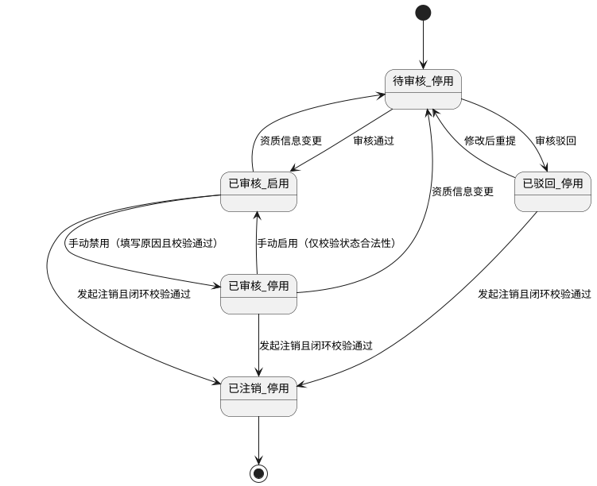

**说明：** 删除为物理移除操作，不纳入状态流转图；仅删除无任何业务数据的供应商档案。

**7）状态联动规则**

| 触发事件   | 联动对象                | 联动规则                                                                       | 按钮禁用规则                       |
| ------ | ------------------- | -------------------------------------------------------------------------- | ---------------------------- |
| 审核通过   | 采购计划、采购订单、入库单供应商选择器 | 供应商进入可选池，页面展示状态=已审核                                                        | 隐藏“审核通过/驳回”，显示“禁用”           |
| 审核驳回   | 采购计划、采购订单、入库单供应商选择器 | 供应商不可选，页面展示状态=已驳回                                                          | 隐藏“禁用/启用”，显示“编辑/重提审核”        |
| 禁用     | 采购订单、入库单等新增业务       | 禁止新单选择；历史已关联的采购订单、入库单、台账、溯源记录全部保留并正常展示；历史单据中的供应商状态统一展示为【禁用】；不影响查看、打印、导出    | 显示“启用”，隐藏“禁用”；“编辑”入口保留兼容只读规则 |
| 启用     | 采购订单、入库单等新增业务       | 恢复可选；历史业务不受影响，原有关联单据保持不变                                                   | 显示“禁用”，隐藏“启用”                |
| 资质变更提交 | 采购主流程               | 立即移出可选池，进入复审                                                               | 禁用“禁用/启用/注销”直至审核完成           |
| 资质过期   | 供应商详情与预警中心          | 高亮资质预警并保留档案查询能力；不影响历史单据展示                                                  | 保留“编辑资质/重提审核”                |
| 注销成功   | 全采购流程               | 新增采购订单、入库等业务不再显示该供应商；历史采购、入库、台账、溯源单据全部保留，可正常查看，但不可跳转至供应商详情、不可编辑、不可重新关联该供应商 | 禁用“编辑/启用/禁用/删除”，仅保留档案只读查看    |
| 删除成功   | 全采购流程               | 供应商信息从系统中移除；后续新增业务与筛选器均不可见                                                 | 删除后不再展示任何操作按钮                |

**8）权限控制**

| 角色    | 功能权限                           | 数据范围            |
| ----- | ------------------------------ | --------------- |
| 采购专员  | 查询、新增、编辑、提交审核、导入、导出、附件上传/查看    | 仅本组织及被授权组织      |
| 采购经理  | 查询、审核通过/驳回、启用/禁用、导出、查看附件       | 本组织及下级组织        |
| 食堂负责人 | 查询、审核通过/驳回、启用/禁用、注销、删除、导出、查看附件 | 本食堂全量数据         |
| 系统管理员 | 查询、导入、导出、字典维护、审计查看             | 全组织可见；不参与业务审核决策 |

**权限实现规则**

1. 前端按权限动态显示菜单与按钮，未授权按钮不可见。
2. 后端接口执行功能权限和数据范围双重校验，越权统一返回403。
3. 所有新增、编辑、审核、启停用、注销、删除、导入、导出、附件下载均记录审计日志。

**9）唯一性、重复性、合法性校验规则**

| 校验项       | 校验规则                                   | 处理方式                |
| --------- | -------------------------------------- | ------------------- |
| 供应商编码唯一性  | 全租户唯一                                  | 冲突即阻断保存             |
| 供应商名称唯一性  | 同组织内唯一（标准化后比较）                         | 冲突即阻断保存             |
| 联系人电话合法性  | 手机/座机格式校验                              | 非法即阻断               |
| 联系人邮箱合法性  | 邮箱正则校验                                 | 非法即阻断               |
| 地址完整性     | 省市区与详细地址必须完整                           | 缺失即阻断               |
| 商品类别合法性   | 至少1项且必须存在于类别字典                         | 非法即阻断               |
| 资质附件合法性   | 类型、大小、数量均需满足限制                         | 不满足即阻断              |
| 资质到期日期合法性 | 必须晚于当前业务日期                             | 不满足即阻断              |
| 审核操作合法性   | 仅待审核可审核                                | 状态不符即拦截             |
| 启停用合法性    | 仅已审核状态允许启停用；启用时仅校验状态合法性                | 状态不符即拦截             |
| 禁用前置校验    | 待审批采购订单、未入库/部分入库采购订单、待审批入库单任一存在时，不允许禁用 | 不满足即拦截并弹出指定文案       |
| 注销合法性     | 必须填写注销原因，且无未完成采购订单、无未完成或未入库入库单         | 不满足即拦截并弹出指定文案       |
| 删除合法性     | 仅采购订单、入库单均未引用过该供应商时允许删除                | 不满足即拦截并弹出指定文案       |
| 禁用后编辑合法性  | 禁用状态不可编辑供应商任何信息                        | 编辑入口进入后仅允许只读查看并取消返回 |

**10）导入/导出/附件上传规则**

**导入规则**

1. 文件格式仅支持 `xlsx`，单文件≤10MB，单次≤5000行。
2. 导入模板字段：供应商名称、供应商编码、供应商类型、省市区、详细地址、联系人姓名、联系人电话、联系人邮箱、商品类别、供应商等级、资质到期日期。
3. 导入校验顺序：模板结构校验 → 必填校验 → 格式校验 → 唯一性校验 → 业务规则校验。
4. 导入结果支持“部分成功”，失败行输出“行号+错误原因”；成功行默认状态=待审核、启停状态=停用。

**导出规则**

1. 导出范围为“当前筛选条件 + 当前用户数据权限范围”。
2. 导出格式支持 `xlsx/csv`，包含列表字段及必要审计字段（创建人、创建时间、状态）。
3. 单次同步导出建议上限50000行，超限转异步导出任务。
4. 导出文件中的敏感字段（联系方式）按权限策略进行脱敏或明文展示。

**附件上传规则**

1. 支持 `jpg/jpeg/png/pdf`，单文件≤20MB，单供应商最多10个资质文件。
2. 上传后执行文件安全扫描；失败文件不得入库。
3. 附件与供应商ID强绑定，支持预览与下载，下载受权限控制。
4. 附件替换保留历史版本索引与操作日志，满足审计追溯。
5. 供应商删除成功后，与该供应商绑定的当前档案附件一并移除；审计日志独立保留。

**11）与其他模块的关联关系**

| 关联模块       | 关联点     | 联动规则                                                       |
| ---------- | ------- | ---------------------------------------------------------- |
| 1.2 采购计划管理 | 供应商选择   | 仅“已审核+启用”供应商可选；页面展示状态为禁用、已驳回、待审核、已注销时不可选                   |
| 1.3 采购订单管理 | 订单供应商引用 | 新增订单仅可选当前可用供应商；供应商后续禁用不影响已生效订单历史数据；供应商注销后历史单据保留但不可跳转至供应商详情 |
| 采购收货/入库    | 到货与入库单据 | 收货入库单据保留供应商快照信息（名称、编码、联系人、页面展示状态）用于追溯                      |
| 仓储管理-物料信息  | 商品类别映射  | 供应商商品类别与物料类别字典联动，确保采购与库存口径一致                               |
| 数据监管模块     | 风险分析与看板 | 供应商评分、履约与质量数据进入监管指标，用于高风险供应商预警                             |
| 组织与权限模块    | 数据隔离与授权 | 供应商数据按组织域隔离，跨组织访问必须通过数据权限授权                                |

**12）供应商类型字典管理规则**

**系统内置供应商类型**

1. 生鲜食材供应商、粮油米面供应商、调味品供应商、冻品供应商、蛋禽奶制品供应商、一次性用品供应商、厨房耗材供应商、厨具设备供应商、消杀服务供应商、设备维保供应商、包装物料供应商、第三方检测机构。
2. 系统支持管理员新增自定义供应商类型，用于补充特殊业务场景。
3. 系统内置供应商类型不允许删除；自定义供应商类型仅在“已禁用且无业务引用”时允许删除。

**类型字段定义**

| 字段名  | 类型      | 长度    | 是否必填 | 约束规则                               | 默认值     | 示例             |
| ---- | ------- | ----- | ---- | ---------------------------------- | ------- | -------------- |
| 类型ID | UUID    | 36    | 是    | 全局唯一，不可编辑                          | 系统生成    | `SUPTYPE-0001` |
| 类型名称 | String  | 2-50  | 是    | 名称唯一；去首尾空格后校验；系统内置名称不可修改           | 无       | `生鲜食材供应商`      |
| 类型编码 | String  | 2-50  | 是    | 编码唯一；仅允许大写字母、数字、`-`、`_`；系统内置编码不可修改 | 系统生成    | `SUP_FRESH`    |
| 类型来源 | Enum    | -     | 是    | 系统内置/自定义                           | `自定义`   | `系统内置`         |
| 状态   | Enum    | -     | 是    | 启用/禁用                              | `启用`    | `启用`           |
| 排序号  | Integer | 1-5位  | 是    | 0-99999，数值越小排序越靠前                  | `0`     | `10`           |
| 引用数量 | Integer | 1-8位  | 是    | 系统自动统计已关联供应商数量                     | `0`     | `16`           |
| 删除权限 | Boolean | -     | 是    | 系统内置固定为否；自定义按引用关系判断                | `false` | `false`        |
| 备注   | String  | 0-200 | 否    | 可为空                                | 空       | `适用于冷链生鲜采购`    |

**交互规则**

1. 供应商管理列表筛选区、供应商新增/编辑表单提供“供应商类型”选择器；系统管理员在该选择器旁可进入“类型管理”弹窗。
2. 类型管理弹窗展示类型名称、编码、来源、状态、排序号、引用数量、更新时间；支持新增自定义类型、编辑自定义类型、调整排序、启用/禁用。
3. 系统内置类型展示“系统内置”标签，仅允许修改排序号、状态、备注，不允许修改名称、编码，不显示删除按钮。
4. 自定义类型支持编辑名称、编码、状态、排序号、备注；删除按钮仅在`状态=禁用且引用数量=0`时显示。
5. 供应商新增/编辑时仅允许选择启用状态类型；已禁用类型在历史供应商详情中保留展示，但不出现在新建和编辑下拉中。
6. 导入模板中的供应商类型字段必须匹配启用状态类型名称或编码；类型不存在、已禁用或已删除时该行导入失败。

**状态定义与状态流转**

| 状态  | 定义                   | 可选范围 | 可删除性         |
| --- | -------------------- | ---- | ------------ |
| 启用  | 可被供应商档案、筛选器、导入模板选择   | 可选   | 不允许删除        |
| 禁用  | 不可被新建/编辑/导入选择，历史数据保留 | 不可选  | 仅自定义且无引用允许删除 |

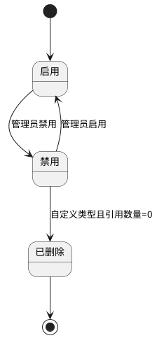

**正向业务流程**

1. 系统初始化加载全部内置供应商类型并默认启用。
2. 系统管理员进入类型管理弹窗，新增自定义类型并保存。
3. 保存成功后，供应商新增/编辑表单、筛选器、导入校验规则实时刷新可选项。
4. 管理员可调整类型排序与启用状态，刷新后列表、下拉顺序同步更新。
5. 自定义类型不再使用时，管理员先禁用，再在引用数量为0时删除。

**异常业务流程**

1. 类型名称或编码重复时，阻断保存并提示冲突类型。
2. 尝试删除系统内置类型时，前端隐藏删除按钮，后端统一拦截并返回“系统内置类型不允许删除”。
3. 自定义类型存在供应商引用时，删除操作被阻断并返回关联供应商数量与示例编号。
4. 已禁用类型被旧表单缓存选中并提交时，后端校验失败并提示刷新后重试。
5. 无字典维护权限用户尝试新增、编辑、禁用、删除类型时，返回403并记录审计日志。

**13）供应商AI综合评分补充规则**

**13.1 补充说明**

1. 本补充规则仅在现有供应商管理能力基础上，增量追加`供应商AI综合评分`模块的展示、计算、调度、权限、防篡改与业务应用规则，不改动本章节既有供应商基础字段、审核状态、启停状态、删除/禁用/注销逻辑、库存规则、供应商类型规则、人工评分平均分与综合总分既有规则。
2. 本次新增的`AI综合评分`模块与现有`人工评分平均分`、`综合总分`字段并行存在；AI综合评分作为既有综合总分中的AI输入项单独展示，不覆盖、不替代原有人工评分与综合总分计算规则。
3. 本次新增的供应商AI综合评分结果，作为供应商等级评定、采购优先推荐、供货风险预警、供应商优胜劣汰优化管理的核心参考依据。

**13.2 页面展示补充规则**

1. 在不改动本章节既有页面主体结构前提下，供应商档案详情页/详情抽屉评分明细区域末尾补充新增`AI综合评分`模块。
2. `AI综合评分`模块至少展示以下内容：
   （1）AI综合评分；
   （2）资质完整性得分；
   （3）历史供货质量得分；
   （4）价格稳定性得分；
   （5）履约准时率得分；
   （6）评分统计周期；
   （7）评分更新时间。
3. 页面展示统一口径：
   （1）AI综合评分页面展示保留1位小数；
   （2）各维度得分页面展示保留1位小数；
   （3）评分统计周期固定展示为`近6个月滚动统计`。
4. 若近6个月内某维度无有效业务样本，页面该维度展示`数据样本不足`提示，并按本补充规则的边界处理口径继续参与系统自动计算。

**13.3 补充字段定义**

| 字段名         | 类型       | 长度   | 是否必填 | 默认值  | 约束规则                   | 示例                       |
| ----------- | -------- | ---- | ---- | ---- | ---------------------- | ------------------------ |
| AI综合评分（展示值） | Decimal  | 5,1  | 否    | 系统计算 | 页面展示统一保留1位小数；仅允许系统写入   | `86.5`                   |
| 资质完整性得分     | Decimal  | 4,1  | 否    | 系统计算 | 取值范围`0-30`；仅允许系统写入     | `27.0`                   |
| 历史供货质量得分    | Decimal  | 4,1  | 否    | 系统计算 | 取值范围`0-25`；仅允许系统写入     | `20.0`                   |
| 价格稳定性得分     | Decimal  | 4,1  | 否    | 系统计算 | 取值范围`0-25`；仅允许系统写入     | `18.0`                   |
| 履约准时率得分     | Decimal  | 4,1  | 否    | 系统计算 | 取值范围`0-20`；仅允许系统写入     | `16.0`                   |
| 评分统计周期      | String   | 1-50 | 否    | 系统生成 | 固定口径：近6个月滚动统计          | `近6个月滚动统计`               |
| 评分更新时间      | DateTime | 19   | 否    | 系统计算 | 每日凌晨批量计算完成后刷新          | `2026-04-28 00:00:00`    |
| 评分数据快照ID    | String   | 1-64 | 否    | 系统生成 | 用于记录本次评分计算使用的数据快照与审计追溯 | `SUPSCORE-20260428-0001` |

**13.4 数据来源、统计周期与计算调度规则**

1. 供应商AI综合评分的数据来源必须覆盖供应商近6个月滚动全量业务数据。
2. 近6个月滚动统计口径定义为：以系统评分计算日期为基准，向前滚动统计最近6个自然月的有效业务数据。
3. 各维度数据来源口径如下：
   （1）资质完整性：供应商当前有效基础档案数据、资质附件、资质到期日期、资质状态；
   （2）历史供货质量：近6个月采购收货、入库验收、批次合格率、退货记录、质量异常记录；
   （3）价格稳定性：近6个月已生效采购订单与有效入库单中的主营食材供货单价；
   （4）履约准时率：近6个月有效采购订单、承诺到货时间、实际到货/签收时间、逾期记录。
4. 系统必须每日凌晨统一批量计算并更新所有供应商AI综合评分，默认调度时间为每日`00:00`。
5. 每次批量计算完成后，系统需写入评分更新时间、评分数据快照ID、统计周期范围与本次计算结果，用于审计追溯。
6. 若每日凌晨批量计算任务执行失败，系统保留上一次成功评分结果，不得清空既有评分，并记录失败原因与失败时间，待下一次调度自动重试。

**13.5 权限与防篡改规则**

1. 本模块所有AI维度评分、AI综合评分均为系统自动运算生成，禁止人工修改、手动录入、后台篡改。
2. 前端页面不提供任何AI评分编辑、保存、覆盖、手工调分入口。
3. 后端接口不提供任何人工改分能力；若通过异常请求尝试修改AI综合评分、维度得分、评分更新时间、快照ID，系统必须统一拦截并返回无权限或非法操作结果。
4. 若源业务数据存在录入错误，只允许通过修正采购、收货、入库、资质等源业务数据后，在下一次定时计算或人工触发重算任务时自动刷新评分结果，不允许直接改分。
5. 每次评分计算、重算、异常失败、异常拦截均必须记录审计日志，日志至少包含供应商ID、评分数据快照ID、计算时间、统计周期、计算结果摘要、触发方式、操作者/系统任务标识。

**13.6 AI综合评分总规则**

1. AI综合评分由4个维度加权计算得出，满分100分。
2. 4个维度及权重分配如下：
   （1）资质完整性：30%；
   （2）历史供货质量：25%；
   （3）价格稳定性：25%；
   （4）履约准时率：20%。
3. AI综合评分系统每日定时自动运算更新，不支持人工干预调整。
4. 本次新增的AI综合评分结果仅约束AI评分模块本身，不改变本章节既有`人工评分平均分`与`综合总分=0.6*AI综合评分+0.4*人工评分平均分`规则。

**13.6.1 资质完整性评分规则**

1. 资质完整性满分30分。
2. 评分逻辑：根据供应商基础信息完善度、资质证件齐全性、证件有效期自动核算打分。
3. 基础信息完整性满分10分，评分项如下：
   （1）企业名称：2分；
   （2）统一社会信用代码：2分；
   （3）地址信息：2分；
   （4）联系人：2分；
   （5）联系电话：2分。
4. 基础信息任一项缺失，则该项不得分，按项扣减。
5. 资质证件有效性满分20分，纳入评分的关键证件包括：
   （1）营业执照；
   （2）食品经营/生产许可证；
   （3）检疫证明；
   （4）合格检测报告。
6. 证件齐全且全部在有效期内，得满分20分。
7. 每缺失1项关键证件，按重要性扣5~8分；默认扣分口径如下：
   （1）营业执照缺失扣8分；
   （2）食品经营/生产许可证缺失扣8分；
   （3）检疫证明缺失扣5分；
   （4）合格检测报告缺失扣5分。
8. 若任意关键证件过期，本维度直接判0分，不再继续执行本维度其他加减分。
9. 资质最终得分计算公式：
   `资质完整性得分 = （实际得分 ÷ 本项总分）× 30`
10. 由于本维度总分即30分，系统按上述公式计算后输出结果，并统一保留1位小数展示。

**13.6.2 历史供货质量评分规则**

1. 历史供货质量满分25分。
2. 评分逻辑：基于供应商近6个月入库验收数据、批次合格率、退货记录、质量异常记录综合计算。
3. 供货合格率计算公式：
   `供货合格率 = 合格入库批次 ÷ 总入库批次`
4. 总入库批次统计口径：近6个月内与该供应商关联、且已完成有效验收入库的全部批次记录；已作废、无效、重复冲销记录不纳入统计。
5. 基础打分规则如下：
   （1）合格率 `>=98%`：25分；
   （2）`95% <= 合格率 < 98%`：20分；
   （3）`90% <= 合格率 < 95%`：15分；
   （4）`85% <= 合格率 < 90%`：8分；
   （5）`80% <= 合格率 < 85%`：5分；
   （6）`合格率 < 80%`：0分。
6. 在基础打分结果上执行扣分规则：
   （1）单次验收不合格扣5分；
   （2）单次正常退货扣3分；
   （3）出现食材变质、异物等严重质量问题，本维度直接判0分。
7. 多条扣分同时命中时，可累计扣减，但最终结果不得低于0分。
8. 若近6个月无有效入库验收样本，则本维度标记为`数据样本不足`，并按0分计入AI综合评分。

**13.6.3 价格稳定性评分规则**

1. 价格稳定性满分25分。
2. 评分逻辑：依据近6个月该供应商主营食材历史供货单价，计算价格波动幅度进行打分。
3. 价格波动计算公式：
   `价格波动 = （最高单价 − 最低单价）÷ 平均单价`
4. 主营食材价格样本口径：近6个月已生效采购订单、有效入库单中与该供应商关联的主营食材有效供货单价；单价`<=0`或已作废数据不纳入计算。
5. 基础打分规则如下：
   （1）波动幅度 `<= ±3%`：25分；
   （2）`3% < 波动 <= 5%`：20分；
   （3）`5% < 波动 <= 8%`：15分；
   （4）`8% < 波动 <= 12%`：8分；
   （5）`12% < 波动 <= 15%`：5分；
   （6）`波动 > 15%`：0分。
6. 额外扣分规则：
   （1）若同一主营物料连续3个自然月月均单价环比上涨，判定为恶意连续涨价，额外扣5分；
   （2）额外扣分执行后，本维度最低不得低于0分。
7. 额外加分规则：
   （1）若同一主营物料连续3个月价格无波动、保持稳定，则额外加2分；
   （2）额外加分执行后，本维度最高不得高于25分。
8. 若近6个月无有效价格样本，或有效价格样本不足以形成波动计算，则本维度标记为`数据样本不足`，并按0分计入AI综合评分。

**13.6.4 履约准时率评分规则**

1. 履约准时率满分20分。
2. 评分逻辑：统计近6个月有效采购订单，核算准时送达率进行评分。
3. 准时率计算公式：
   `准时率 = 准时送达订单数 ÷ 总有效订单数`
4. 总有效订单统计口径：近6个月内与该供应商关联、非作废、存在承诺到货时间且进入实际履约过程的采购订单。
5. 准时送达判定规则：实际到货/签收时间`<=`承诺到货时间，记为准时送达。
6. 基础打分规则如下：
   （1）准时率 `=100%`：20分；
   （2）`95% <= 准时率 < 100%`：16分；
   （3）`90% <= 准时率 < 95%`：12分；
   （4）`85% <= 准时率 < 90%`：6分；
   （5）`80% <= 准时率 < 85%`：4分；
   （6）`准时率 < 80%`：0分。
7. 扣分规则：
   （1）单次送货逾期扣2分；
   （2）逾期超过3天，或严重影响食堂正常供餐，本维度直接判0分。
8. 多次逾期扣分可累计执行，但最终结果不得低于0分。
9. 若近6个月无有效采购订单样本，则本维度标记为`数据样本不足`，并按0分计入AI综合评分。

**13.7 AI综合评分统一计算公式与结果展示规则**

1. AI综合评分统一计算公式：
   `AI综合评分 = 资质完整性得分 × 0.30 + 历史供货质量得分 × 0.25 + 价格稳定性得分 × 0.25 + 履约准时率得分 × 0.20`
2. 计算结果统一保留1位小数展示。
3. 页面展示保留1位小数不改变本章节既有字段定义中的底层存储精度口径；若系统内部存储需保留更多小数位用于计算，则按既有数据存储能力执行，最终前端展示统一按1位小数输出。
4. 供应商详情页中展示的各维度得分、AI综合评分、评分更新时间必须来自同一评分数据快照，禁止跨批次混用旧值与新值。

**13.8 业务应用场景规则**

1. AI综合评分作为供应商等级评定的核心参考依据，用于辅助采购管理人员判断供应商综合供货能力，但不直接改写本章节既有供应商等级字段与人工评分规则。
2. AI综合评分作为采购优先推荐的核心参考依据，在供应商列表、采购推荐、下游监管看板等场景可作为排序、筛选、推荐输入项使用。
3. AI综合评分作为供货风险预警的重要参考依据，当供应商出现低分、维度持续下降、严重质量问题、恶意连续涨价、严重履约逾期等情况时，应在风险看板、监管场景中高亮提示。
4. AI综合评分作为供应商优胜劣汰优化管理的核心参考依据，用于辅助运营方开展供应商复盘、替换建议、合作优化和资源倾斜决策。

**13.9 异常与边界补充规则**

1. 近6个月内无有效业务样本的维度，一律标记为`数据样本不足`并按0分计入本次AI综合评分，禁止人工补分、补录、手工覆盖。
2. 若同一条业务数据同时命中多个扣分规则，系统按规则累计扣分；若同时命中“直接判0分”规则，则该维度以0分为准。
3. 任一维度最终得分不得小于0分，不得超过该维度满分上限。
4. 若评分计算过程中命中脏数据、缺失数据、重复数据、冲销中间态数据，系统应按有效业务数据口径去重过滤，不得将无效数据计入评分。
5. 每日定时计算过程中，若供应商基础档案正在被编辑但尚未提交成功，则本次评分以最近一次已提交成功的有效数据快照为准。
6. 采购、收货、入库、资质等源业务数据一旦修正，不允许直接回写修改历史评分值，必须等待下一次统一重算后自动刷新评分结果。

#### 1.2 采购计划管理

**页面路径：** `菜单 → 采购管理 → 采购计划管理`  
**访问权限：** `采购专员、采购经理、食堂负责人`  
**页面类型：** `列表页 + 详情抽屉 + 表单页 + 审核页 + 导入弹窗`

**1）模块概述与业务目标**

1. 本模块负责采购需求的结构化编制、审批流转与执行闭环，确保采购计划“可审、可控、可追溯”。
2. 本模块支持采购计划新增、编辑、删除、查询、分页、筛选、导入、导出，满足日常运营与批量作业场景。
3. 本模块支持一级/二级审核配置，并将多级审核节点与计划状态联动管理。
4. 本模块支持勾选多个已审核采购计划，关联合并生成采购订单，实现采购执行提效。

**2）完整字段定义**

**2.1 采购计划主信息字段**

| 字段名        | 类型            | 长度     | 是否必填 | 默认值     | 约束规则                          | 示例                                     |
| ---------- | ------------- | ------ | ---- | ------- | ----------------------------- | -------------------------------------- |
| 计划ID       | UUID          | 36     | 是    | 系统生成    | 全局唯一、不可编辑                     | `6a2a1f11-0a29-4f20-9e7a-5f64dfb2a8b1` |
| 计划编号       | String        | 24     | 是    | 系统生成    | 全局唯一，格式：`CGJH-YYYYMMDD-XXXXX` | `CGJH-20260327-00018`                  |
| 计划名称       | String        | 2-100  | 否    | 空       | 非空时不允许纯空格                     | `3月末蔬菜补货计划`                            |
| 计划日期       | Date          | 10     | 是    | 当前日期    | 不得晚于当前日期+180天                 | `2026-03-27`                           |
| 预算金额       | Decimal       | 18,2   | 是    | `0.00`  | `>=0`，最多2位小数                  | `50000.00`                             |
| 总计划金额      | Decimal       | 18,2   | 是    | 系统计算    | 明细小计汇总；只读                     | `46320.50`                             |
| 实际采购金额     | Decimal       | 18,2   | 否    | `0.00`  | 由关联订单执行回写；只读                  | `35800.00`                             |
| 关联单据       | Array<String> | 0-50项  | 否    | 空数组     | 支持多选；去重存储                     | `["YJ-202603-002","SQ-202603-118"]`    |
| 计划状态（展示）   | Enum          | -      | 是    | `待审核`   | 取值：待审核/已审核/已驳回/已关闭            | `待审核`                                  |
| 审核节点状态（流程） | Enum          | -      | 是    | `待一级审核` | 取值：待一级审核/待二级审核/审核通过/审核驳回      | `待二级审核`                                |
| 关联状态       | Enum          | -      | 是    | `未关联`   | 取值：未关联/部分关联/已关联               | `部分关联`                                 |
| 关联订单数      | Integer       | 0-9999 | 是    | `0`     | 系统回写；只读                       | `2`                                    |
| 创建组织ID     | String        | 36     | 是    | 当前组织    | 用于数据权限隔离                      | `ORG-10001`                            |
| 创建人        | String        | 2-50   | 是    | 当前用户    | 只读                            | `zhangsan`                             |
| 创建时间       | DateTime      | 19     | 是    | 系统时间    | 只读                            | `2026-03-27 10:20:33`                  |
| 更新人        | String        | 2-50   | 是    | 当前用户    | 只读                            | `lisi`                                 |
| 更新时间       | DateTime      | 19     | 是    | 系统时间    | 只读                            | `2026-03-27 14:10:08`                  |

**2.2 采购计划物料明细字段**

| 字段名     | 类型      | 长度     | 是否必填 | 默认值    | 约束规则                         | 示例                                     |
| ------- | ------- | ------ | ---- | ------ | ---------------------------- | -------------------------------------- |
| 明细ID    | UUID    | 36     | 是    | 系统生成   | 全局唯一、不可编辑                    | `d93a8d95-6a44-49b9-b545-748b8fcbfcd5` |
| 行号      | Integer | 1-9999 | 是    | 自动递增   | 同一计划内唯一                      | `1`                                    |
| 供应商ID   | String  | 36     | 是    | 无      | 必须为当前可用供应商（审核状态=已审核，启停状态=启用） | `SUP-00021`                            |
| 供应商名称   | String  | 2-100  | 是    | 自动带出   | 与供应商ID一致                     | `晨辉农副产品有限公司`                           |
| 物料ID    | String  | 36     | 是    | 无      | 必须存在于物料主数据                   | `MAT-100234`                           |
| 物料名称    | String  | 1-100  | 是    | 自动带出   | 与物料ID一致                      | `上海青`                                  |
| 物料规格    | String  | 1-100  | 是    | 自动带出   | 与物料档案一致                      | `10kg/箱`                               |
| 计量单位    | String  | 1-20   | 是    | 自动带出   | 必须为物料基础单位或换算单位               | `箱`                                    |
| 预采购数量   | Decimal | 18,3   | 是    | 无      | `>0`，最多3位小数                  | `80.000`                               |
| 预估单价    | Decimal | 18,4   | 是    | 无      | `>=0`，最多4位小数                 | `85.5000`                              |
| 小计      | Decimal | 18,2   | 是    | 系统计算   | `预采购数量*预估单价`，四舍五入2位          | `6840.00`                              |
| 期望到货日期  | Date    | 10     | 否    | 空      | 非空时不得早于计划日期                  | `2026-03-29`                           |
| 来源类型    | Enum    | -      | 是    | `手工录入` | 取值：手工录入/库存预测导入/Excel导入       | `库存预测导入`                               |
| 已下单数量   | Decimal | 18,3   | 是    | `0`    | 由关联订单回写；只读                   | `30.000`                               |
| 剩余可下单数量 | Decimal | 18,3   | 是    | 系统计算   | `预采购数量-已下单数量`，不得小于0          | `50.000`                               |
| 备注      | String  | 0-200  | 否    | 空      | 超长拦截                         | `优先晨间到货`                               |

**2.3 审核与关联字段**

| 字段名      | 类型            | 长度     | 是否必填 | 默认值 | 约束规则         | 示例                                            |
| -------- | ------------- | ------ | ---- | --- | ------------ | --------------------------------------------- |
| 一级审核人    | String        | 2-50   | 条件必填 | 空   | 一级审核通过/驳回时写入 | `manager01`                                   |
| 一级审核意见   | String        | 1-500  | 条件必填 | 空   | 一级审核时必填      | `预算合理，同意流转`                                   |
| 一级审核时间   | DateTime      | 19     | 条件必填 | 空   | 一级审核操作后写入    | `2026-03-27 15:08:31`                         |
| 二级审核人    | String        | 2-50   | 条件必填 | 空   | 二级审核通过/驳回时写入 | `head01`                                      |
| 二级审核意见   | String        | 1-500  | 条件必填 | 空   | 二级审核时必填      | `同意采购执行`                                      |
| 二级审核时间   | DateTime      | 19     | 条件必填 | 空   | 二级审核操作后写入    | `2026-03-27 16:05:18`                         |
| 驳回原因     | String        | 1-500  | 条件必填 | 空   | 任一层级驳回时必填    | `预算超出本期上限，请拆分提交`                              |
| 关联订单编号列表 | Array<String> | 0-100项 | 否    | 空数组 | 去重存储；只读      | `["CGD-20260327-00128","CGD-20260327-00129"]` |
| 关闭原因     | String        | 0-200  | 否    | 空   | 手动关闭时必填      | `阶段需求终止`                                      |

**3）页面结构与交互规则**

**页面结构**

1. 顶部区域：计划状态筛选、审核节点筛选、供应商筛选、创建人筛选、日期区间筛选、关键字搜索、待审核池快捷入口。
2. 中部区域：采购计划列表（支持勾选、排序、固定列、行内状态标签），展示计划编号、总计划金额、实际采购金额、状态、审核节点、关联状态、创建人、创建时间。
3. 右侧区域：计划详情抽屉（主信息、明细、审核记录、关联订单、操作日志）。
4. 底部区域：分页器（页码、每页条数、总条数），默认每页20条，支持20/50/100切换。
5. 弹窗区域：新增/编辑表单、审核弹窗、导入弹窗、合并生成采购订单确认弹窗。

**按钮显隐与操作前置条件**

| 按钮       | 可见角色            | 显示条件                 | 操作前置条件                         | 执行结果                     |
| -------- | --------------- | -------------------- | ------------------------------ | ------------------------ |
| 新增计划     | 采购专员            | 有创建权限                | 无                              | 打开新增表单                   |
| 编辑计划     | 采购专员            | 状态=待审核或已驳回，且关联状态=未关联 | 有编辑权限且数据在权限范围内                 | 打开编辑表单                   |
| 删除计划     | 采购专员            | 状态=待审核，且关联状态=未关联     | 二次确认                           | 删除计划及明细                  |
| 提交审核     | 采购专员            | 状态=待审核或已驳回编辑后        | 主信息、明细校验通过                     | 进入待审核（一级节点）              |
| 撤回提交     | 采购专员            | 状态=待审核且尚未被审核处理       | 发起人本人或具备撤回权限                   | 回到待编辑态（不改变计划编号）          |
| 一级审核通过   | 采购经理            | 审核节点=待一级审核           | 审核意见必填                         | 二级审核开启时进入待二级审核；未开启时直接已审核 |
| 一级审核驳回   | 采购经理            | 审核节点=待一级审核           | 驳回原因必填                         | 状态=已驳回                   |
| 二级审核通过   | 食堂负责人           | 审核节点=待二级审核           | 审核意见必填                         | 状态=已审核                   |
| 二级审核驳回   | 食堂负责人           | 审核节点=待二级审核           | 驳回原因必填                         | 状态=已驳回                   |
| 导入计划     | 采购专员            | 有导入权限                | 模板校验通过                         | 批量创建计划与明细                |
| 导出计划     | 采购专员、采购经理、食堂负责人 | 有导出权限                | 无                              | 导出当前筛选结果                 |
| 合并生成采购订单 | 采购专员            | 勾选至少1条计划             | 勾选计划均为已审核、未关闭、存在剩余可下单数量、满足合并约束 | 生成采购订单并回写关联信息            |
| 查看关联订单   | 采购专员、采购经理、食堂负责人 | 关联订单数>0              | 无                              | 跳转订单详情/列表                |
| 关闭计划     | 采购专员、采购经理       | 状态=已审核               | 计划已全部关联订单或人工确认终止并填写关闭原因        | 状态=已关闭                   |

**4）状态定义与状态流转逻辑**

**状态定义**

| 状态      | 业务含义         | 可编辑    | 可删除    | 可合并生成订单 |
| ------- | ------------ | ------ | ------ | ------- |
| 待审核（一级） | 已提交，等待一级审核   | 否（可撤回） | 是（未关联） | 否       |
| 待审核（二级） | 一级已通过，等待二级审核 | 否      | 否      | 否       |
| 已审核     | 审核完成，可执行采购   | 否      | 否      | 是       |
| 已驳回     | 审核未通过，待修订    | 是（未关联） | 否      | 否       |
| 已关闭     | 执行完成或手动终止    | 否      | 否      | 否       |

**说明：** 列表“计划状态”统一展示为 `待审核/已审核/已驳回/已关闭`；一级/二级通过“审核节点状态”区分。

**状态流转**

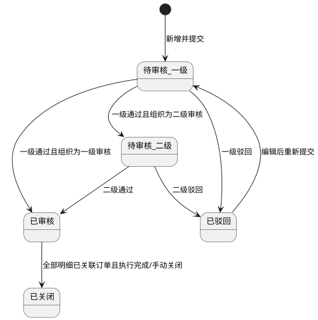

**5）状态联动控制**

| 触发事件     | 联动对象      | 联动规则                       | 按钮禁用规则               |
| -------- | --------- | -------------------------- | -------------------- |
| 提交审核     | 审核池、计划列表  | 计划进入待审核池并记录当前审核节点          | 禁用编辑、合并生成、关闭         |
| 一级审核通过   | 审核池       | 二级审核开启时流转至待二级审核；否则直接已审核    | 待二级审核阶段禁用删除、编辑       |
| 审核驳回     | 计划编辑页     | 状态变为已驳回，允许修订后重提            | 禁用合并生成、关闭            |
| 终审通过     | 采购订单模块    | 计划进入可合并生成订单候选池             | 启用“合并生成采购订单”         |
| 合并生成订单成功 | 订单模块、计划明细 | 回写关联订单号、已下单数量、剩余可下单数量、关联状态 | 已关联状态禁用删除；已审核状态仍禁用编辑 |
| 计划关闭     | 列表与下游选择器  | 从可执行计划池移除，仅保留查询与导出         | 禁用提交审核、编辑、删除、合并生成    |

**6）完整正向业务流程**

1. 采购专员新增采购计划并填写主信息、明细信息，系统实时校验并计算金额。
2. 采购专员可通过“库存预测导入”或Excel导入批量写入明细，完成后提交审核。
3. 系统按组织审核配置发起一级审核；一级审核通过后，按配置进入二级审核或直接终审通过。
4. 审核通过后计划状态更新为已审核，进入“可执行计划池”。
5. 用户可按条件查询、筛选、分页浏览计划，并在待审核池对待办计划排序处理。
6. 用户可勾选多个已审核计划，点击“合并生成采购订单”。
7. 系统执行合并约束校验，通过后生成采购订单并自动写入关联计划编号。
8. 系统同步回写计划与明细的关联信息（关联状态、关联订单数、已下单数量、剩余可下单数量）。
9. 用户可在计划详情查看关联订单，并继续对“部分关联”计划执行后续合并下单。
10. 当计划全部执行完成或业务终止后，按权限执行计划关闭。

**7）完整异常业务流程**

1. 主信息必填为空（计划日期、预算金额等）时，阻断提交并定位字段。
2. 明细必填为空（供应商、物料、数量、单价）时，阻断提交并高亮行列。
3. 计划编号重复时，阻断保存并提示重复编号。
4. 明细重复（同供应商+同物料+同规格）时，阻断提交并提示合并明细。
5. 数量、单价格式错误（负数、超精度、非数字）时，阻断提交。
6. 供应商状态非法（待审核、禁用、已驳回、已注销）时，阻断提交。
7. 预算金额小于总计划金额时，提示超预算并按配置阻断或要求提交说明。
8. 非待审核状态执行删除时，阻断并提示“仅待审核可删除”。
9. 已审核计划执行编辑时，阻断并提示“已审核不允许修改”。
10. 已关联订单计划执行删除时，阻断并提示“已关联订单不允许删除”。
11. 无审核权限或越级审核时，阻断并返回权限不足。
12. 非当前审核节点执行审核时，阻断并提示状态不匹配。
13. 合并生成订单未勾选计划时，阻断并提示至少选择1条计划。
14. 合并计划不满足同组织/同供应商/同收货地址约束时，阻断并返回具体差异项。
15. 合并计划存在剩余可下单数量=0时，阻断并提示不可下单计划编号。
16. 导入文件模板不匹配、字段缺失、格式错误时，返回错误行号与原因。
17. 导出权限不足或数据范围越权时，阻断并记录审计日志。
18. 并发编辑导致版本冲突时，阻断保存并提示刷新后重试。
19. 重复点击“合并生成采购订单”时，系统按幂等键防重，避免重复生成订单。
20. 计划不存在或已被他人删除时，返回“数据已变更”并刷新列表。

**8）权限控制与数据范围**

| 角色    | 功能权限                                 | 数据范围       |
| ----- | ------------------------------------ | ---------- |
| 采购专员  | 查询、新增、编辑、删除、提交审核、导入、导出、合并生成订单、查看关联订单 | 仅本组织及被授权组织 |
| 采购经理  | 查询、一级审核通过/驳回、导出、查看关联订单、关闭计划          | 本组织及下级组织   |
| 食堂负责人 | 查询、二级审核通过/驳回、导出、查看关联订单               | 本食堂全量数据    |

**权限实现规则**

1. 前端按权限动态控制菜单与按钮显隐，未授权按钮不可见。
2. 后端接口强制执行“功能权限+数据权限”双校验，越权统一返回403。
3. 新增、编辑、删除、审核、导入、导出、合并生成订单、关闭计划均记录审计日志。

**9）唯一性、重复性、合法性校验规则**

| 校验项       | 校验规则                         | 处理方式       |
| --------- | ---------------------------- | ---------- |
| 计划编号唯一性   | 全局唯一                         | 冲突即阻断      |
| 明细唯一性     | 同一计划内“供应商+物料+规格”唯一           | 冲突即阻断并提示合并 |
| 数量合法性     | 预采购数量 `>0`，最多3位小数            | 不合法即阻断     |
| 单价合法性     | 预估单价 `>=0`，最多4位小数            | 不合法即阻断     |
| 金额合法性     | 小计与总金额由系统计算，不允许手工改写          | 改写请求直接拒绝   |
| 供应商合法性    | 必须为当前可用供应商（审核状态=已审核，启停状态=启用） | 不满足即阻断     |
| 期望到货日期合法性 | 不得早于计划日期                     | 不满足即阻断     |
| 审核合法性     | 仅当前审核节点可审核                   | 不满足即阻断     |
| 删除合法性     | 仅待审核且未关联订单可删除                | 不满足即阻断     |
| 编辑合法性     | 仅待审核/已驳回且未关联订单可编辑            | 不满足即阻断     |
| 合并下单合法性   | 仅已审核计划可参与，且满足合并约束            | 不满足即阻断     |
| 数据权限合法性   | 仅可操作授权组织数据                   | 越权即403     |

**10）导入/导出规则**

**导入规则**

1. 支持 `xlsx` 模板导入采购计划（主信息+明细），单文件≤10MB，单次≤3000条明细。
2. 导入模板字段必须包含：计划日期、预算金额、供应商、物料、规格、单位、预采购数量、预估单价、期望到货日期（可选）、备注（可选）。
3. 支持“从库存预测导入明细”，导入后可手工补充与修订。
4. 导入结果支持部分成功；失败行返回“行号+字段+错误原因”。

**导出规则**

1. 支持按当前筛选条件导出采购计划列表及明细。
2. 导出格式支持 `xlsx/csv`；默认包含计划状态、审核节点、关联状态、金额字段。
3. 导出范围受数据权限控制，越权数据不导出。
4. 超大数据量导出转异步任务，任务完成后通知下载。

**11）与其他模块关联关系**

| 关联模块       | 关联点    | 联动规则                                                     |
| ---------- | ------ | -------------------------------------------------------- |
| 1.1 供应商管理  | 供应商选择  | 仅允许选择当前可用供应商（审核状态=已审核，启停状态=启用）；页面展示状态为禁用、已驳回、待审核、已注销时不可选 |
| 1.3 采购订单管理 | 合并生成订单 | 支持勾选多计划关联合并生成订单；订单记录反向保存计划编号列表                           |
| 仓储管理-库存预测  | 明细导入   | 可从库存预测一键导入建议明细并二次编辑                                      |
| 收货入库流程     | 执行回写   | 入库完成后回写实际采购金额与执行进度                                       |
| 组织与权限模块    | 数据隔离   | 按组织维度隔离计划数据并控制可见范围                                       |

#### 1.3 采购订单管理

**页面路径：** `菜单 → 采购管理 → 采购订单管理`  
**访问权限：** `采购专员、采购经理、仓库管理员、食堂负责人`  
**页面类型：** `列表页 + 详情抽屉 + 表单页 + 审核弹窗 + 扩展信息弹窗 + 导入弹窗 + 合并入库弹窗`

**1）模块概述与业务目标**

1. 本模块用于管理采购订单全生命周期，覆盖“新增、审核、发货、运输、到货、入库、作废”的完整链路。
2. 本模块支持采购订单新增、编辑、删除、查询、筛选、分页、导入、导出，并提供状态驱动的可编辑性控制。
3. 本模块要求新增/编辑订单必须选择供应商，并与采购计划、供应商状态进行关联合法性校验。
4. 本模块在订单审核通过后支持维护物流追踪信息、检测报告信息、溯源信息，三类信息均支持手工录入与第三方接口接入，并支持附件上传、查看、删除。
5. 本模块支持选择多个采购订单关联合并生成入库单，并支持一个采购订单对应多次入库（多个入库单）场景，自动回写入库进度与订单状态。

**2）完整字段定义**

**2.1 采购订单主信息字段**

| 字段名                   | 类型            | 长度     | 是否必填 | 默认值                                       | 约束规则                                  | 示例                                              |
| --------------------- | ------------- | ------ | ---- | ----------------------------------------- | ------------------------------------- | ----------------------------------------------- |
| 订单ID                  | UUID          | 36     | 是    | 系统生成                                      | 全局唯一、不可编辑                             | `1d2f4f3a-bf48-4fb8-a6b6-977491f89c20`          |
| 订单编号                  | String        | 24     | 是    | 系统生成                                      | 全局唯一，格式：`CGD-YYYYMMDD-XXXXX`          | `CGD-20260327-00128`                            |
| 订单日期                  | Date          | 10     | 是    | 当前日期                                      | 不得晚于当前日期+180天                         | `2026-03-27`                                    |
| 供应商ID                 | String        | 36     | 是    | 无                                         | 必须选择；供应商状态须为当前可用供应商（审核状态=已审核，启停状态=启用） | `SUP-00021`                                     |
| 供应商名称                 | String        | 2-100  | 是    | 自动带出                                      | 与供应商ID一致；不可手工改写                       | `晨辉农副产品有限公司`                                    |
| 收货地址                  | String        | 1-200  | 是    | 供应商默认收货地址                                 | 必填                                    | `海淀区XX冷链仓`                                      |
| 关联采购计划编号列表            | Array<String> | 0-100项 | 否    | 空数组                                       | 支持多选；同一订单内去重                          | `["CGJH-20260327-00018","CGJH-20260327-00019"]` |
| 追溯批次号(trace_batch_id) | String        | 1-64   | 是    | 上游供应链已提供时必须继承；未提供时在收货前补齐；缺失时不得进入待入库/已完成状态 | 系统生成/上游带入                             | `TB-20260327-000128`                            |
| 证据链编号                 | String        | 1-64   | 是    | 物流、检测、溯源、收货附件、审计日志统一归集编号；同一订单生命周期内保持不变    | 系统生成                                  | `EVC-20260327-00128`                            |
| 来源终端                  | Enum          | -      | 是    | 取值：Web/移动端/API/导入                         | 当前终端                                  | `Web`                                           |
| 订单总金额                 | Decimal       | 18,2   | 是    | 系统计算                                      | 明细小计汇总；只读                             | `35680.00`                                      |
| 订单状态                  | Enum          | -      | 是    | `待审核`                                     | 取值：待审核/已驳回/待发货/运输中/待入库/已完成/已作废        | `待发货`                                           |
| 入库总数量                 | Decimal       | 18,3   | 是    | `0`                                       | 系统汇总回写；只读                             | `120.000`                                       |
| 已入库数量                 | Decimal       | 18,3   | 是    | `0`                                       | 系统汇总回写；只读                             | `90.000`                                        |
| 剩余待入库数量               | Decimal       | 18,3   | 是    | 系统计算                                      | `入库总数量-已入库数量`；不得小于0                   | `30.000`                                        |
| 入库进度                  | Decimal       | 5,2    | 是    | `0`                                       | `已入库数量/入库总数量*100%`；只读                 | `75.00`                                         |
| 入库进度状态                | Enum          | -      | 是    | `未入库`                                     | 取值：未入库/部分入库/全部入库                      | `部分入库`                                          |
| 创建组织ID                | String        | 36     | 是    | 当前组织                                      | 数据权限隔离字段                              | `ORG-10001`                                     |
| 创建人                   | String        | 2-50   | 是    | 当前用户                                      | 只读                                    | `zhangsan`                                      |
| 创建时间                  | DateTime      | 19     | 是    | 系统时间                                      | 只读                                    | `2026-03-27 13:02:15`                           |
| 更新人                   | String        | 2-50   | 是    | 当前用户                                      | 只读                                    | `lisi`                                          |
| 更新时间                  | DateTime      | 19     | 是    | 系统时间                                      | 只读                                    | `2026-03-27 16:40:06`                           |

**2.2 采购订单物料明细字段**

| 字段名   | 类型      | 长度     | 是否必填 | 默认值  | 约束规则               | 示例                                     |
| ----- | ------- | ------ | ---- | ---- | ------------------ | -------------------------------------- |
| 明细ID  | UUID    | 36     | 是    | 系统生成 | 全局唯一               | `f8ab3911-c8c6-4678-b5cb-67d5d6ff9f3f` |
| 行号    | Integer | 1-9999 | 是    | 自动递增 | 同一订单内唯一            | `1`                                    |
| 物料ID  | String  | 36     | 是    | 无    | 必须存在于物料主数据         | `MAT-100234`                           |
| 物料名称  | String  | 1-100  | 是    | 自动带出 | 与物料ID一致            | `上海青`                                  |
| 物料规格  | String  | 1-100  | 是    | 自动带出 | 与物料档案一致            | `10kg/箱`                               |
| 计量单位  | String  | 1-20   | 是    | 自动带出 | 必须为物料合法单位          | `箱`                                    |
| 订单数量  | Decimal | 18,3   | 是    | 无    | `>0`，最多3位小数        | `120.000`                              |
| 单价    | Decimal | 18,4   | 是    | 无    | `>=0`，最多4位小数       | `85.6000`                              |
| 小计    | Decimal | 18,2   | 是    | 系统计算 | `订单数量*单价`；四舍五入2位   | `10272.00`                             |
| 已入库数量 | Decimal | 18,3   | 是    | `0`  | 由入库回写；只读           | `90.000`                               |
| 待入库数量 | Decimal | 18,3   | 是    | 系统计算 | `订单数量-已入库数量`，不得小于0 | `30.000`                               |
| 备注    | String  | 0-200  | 否    | 空    | 超长拦截               | `低温运输`                                 |

**2.3 审核与作废字段**

| 字段名    | 类型       | 长度    | 是否必填 | 默认值 | 约束规则       | 示例                    |
| ------ | -------- | ----- | ---- | --- | ---------- | --------------------- |
| 审核人    | String   | 2-50  | 条件必填 | 空   | 审核通过/驳回时写入 | `manager01`           |
| 审核意见   | String   | 1-500 | 条件必填 | 空   | 审核操作必填     | `数量与预算匹配，同意采购`        |
| 审核时间   | DateTime | 19    | 条件必填 | 空   | 审核后写入      | `2026-03-27 14:12:10` |
| 作废申请人  | String   | 2-50  | 条件必填 | 空   | 发起作废申请时写入  | `zhangsan`            |
| 作废原因   | String   | 1-500 | 条件必填 | 空   | 作废申请必填     | `供应商未按期发货`            |
| 作废审核人  | String   | 2-50  | 条件必填 | 空   | 作废审核时写入    | `head01`              |
| 作废审核意见 | String   | 1-500 | 条件必填 | 空   | 作废审核必填     | `同意作废`                |
| 作废审核时间 | DateTime | 19    | 条件必填 | 空   | 作废审核后写入    | `2026-03-27 16:03:11` |

**2.4 扩展信息字段（物流/检测/溯源）**

| 字段名    | 类型          | 长度     | 是否必填 | 默认值    | 约束规则                       | 示例                        |
| ------ | ----------- | ------ | ---- | ------ | -------------------------- | ------------------------- |
| 扩展信息ID | UUID        | 36     | 是    | 系统生成   | 全局唯一                       | `INFO-4f7b8d88`           |
| 信息类型   | Enum        | -      | 是    | 无      | 取值：物流追踪/检测报告/溯源信息          | `物流追踪`                    |
| 数据来源   | Enum        | -      | 是    | `手工录入` | 取值：手工录入/第三方接口              | `第三方接口`                   |
| 外部系统编码 | String      | 1-50   | 条件必填 | 空      | 数据来源=第三方接口时必填              | `WMS-TMS-01`              |
| 外部记录ID | String      | 1-100  | 条件必填 | 空      | 数据来源=第三方接口时必填；同类型唯一        | `TMS-TRK-20260327-9881`   |
| 外部同步时间 | DateTime    | 19     | 否    | 空      | 接口回填                       | `2026-03-27 18:20:00`     |
| 物流单号   | String      | 1-50   | 条件必填 | 空      | 信息类型=物流追踪时必填               | `SF1234567890`            |
| 承运商    | String      | 1-50   | 条件必填 | 空      | 信息类型=物流追踪时必填               | `顺丰冷运`                    |
| 物流轨迹描述 | String      | 0-2000 | 否    | 空      | 支持多次追加                     | `17:30 到达北京分拨中心`          |
| 预计到货时间 | DateTime    | 19     | 否    | 空      | 不得早于订单日期                   | `2026-03-28 09:30:00`     |
| 检测机构   | String      | 1-100  | 条件必填 | 空      | 信息类型=检测报告时必填               | `北京市食品检测中心`               |
| 报告编号   | String      | 1-100  | 条件必填 | 空      | 信息类型=检测报告时必填；同订单内唯一        | `JC-20260327-0011`        |
| 检测日期   | Date        | 10     | 否    | 空      | 不得晚于当前日期                   | `2026-03-27`              |
| 检测结论   | Enum        | -      | 条件必填 | 无      | 取值：合格/不合格/待复检              | `合格`                      |
| 溯源码    | String      | 1-100  | 条件必填 | 空      | 信息类型=溯源信息时必填；格式校验          | `TRACE-20260327-ABC8899`  |
| 批次号    | String      | 1-50   | 条件必填 | 空      | 信息类型=溯源信息时必填               | `P20260327A`              |
| 产地     | String      | 1-100  | 条件必填 | 空      | 信息类型=溯源信息时必填               | `山东寿光`                    |
| 生产日期   | Date        | 10     | 否    | 空      | 不得晚于当前日期                   | `2026-03-25`              |
| 附件列表   | Array<File> | 0-20项  | 否    | 空数组    | 每类信息支持附件上传/查看/删除；文件规则见附件规则 | `["物流回执.jpg","检测报告.pdf"]` |

**2.5 入库关联字段**

| 字段名       | 类型       | 长度   | 是否必填 | 默认值  | 约束规则               | 示例                    |
| --------- | -------- | ---- | ---- | ---- | ------------------ | --------------------- |
| 入库单关联记录ID | UUID     | 36   | 是    | 系统生成 | 全局唯一               | `REL-3fd81f2a`        |
| 入库单编号     | String   | 24   | 是    | 无    | 必须为有效入库单           | `RKD-20260327-0039`   |
| 关联订单编号    | String   | 24   | 是    | 无    | 必须存在并可入库           | `CGD-20260327-00128`  |
| 本次入库数量    | Decimal  | 18,3 | 是    | 无    | `>0` 且 `<=订单待入库数量` | `30.000`              |
| 入库时间      | DateTime | 19   | 是    | 系统时间 | 只读                 | `2026-03-28 11:12:23` |

**2.6 采购订单统计字段**

| 字段名      | 类型       | 长度   | 是否必填 | 默认值    | 约束规则                                     | 示例                    |
| -------- | -------- | ---- | ---- | ------ | ---------------------------------------- | --------------------- |
| 统计月份     | String   | 7    | 是    | 当前自然月  | 格式：`YYYY-MM`                             | `2026-03`             |
| 本月订单数    | Integer  | 1-8位 | 是    | `0`    | 统计口径为当前自然月创建的有效采购订单总数，不含已物理删除数据          | `126`                 |
| 本月订单总金额  | Decimal  | 18,2 | 是    | `0.00` | 统计口径为当前自然月有效采购订单`订单总金额`汇总                | `356800.00`           |
| 本月已收货订单数 | Integer  | 1-8位 | 是    | `0`    | 统计口径为当前自然月内至少完成一次有效收货且当前订单未作废的订单数量       | `78`                  |
| 本月待收货订单数 | Integer  | 1-8位 | 是    | `0`    | 统计口径为当前自然月内状态为`待发货/运输中/待入库`且未全部收货完成的订单数量 | `31`                  |
| 本月取消订单数  | Integer  | 1-8位 | 是    | `0`    | 统计口径为当前自然月作废审核通过的订单数量                    | `5`                   |
| 本月订单平均金额 | Decimal  | 18,2 | 是    | `0.00` | 计算规则=`本月订单总金额/本月订单数`；当本月订单数=0时固定为`0.00`  | `2831.75`             |
| 统计更新时间   | DateTime | 19   | 是    | 系统时间   | 每次列表刷新或统计任务更新后回写                         | `2026-03-31 18:30:00` |

**3）页面结构与交互规则**

**页面结构**

1. 顶部区域：订单状态筛选、供应商筛选、创建人筛选、日期区间筛选、关键字搜索、统计卡片（本月订单数/本月订单总金额/本月已收货订单数/本月待收货订单数/本月订单平均金额/本月取消订单数）。
2. 中部区域：订单列表（支持勾选），展示订单编号、供应商、总金额、状态、入库进度、创建人、创建时间。
3. 右侧详情抽屉：基础信息、订单明细、物流追踪、检测报告、溯源信息、入库记录、操作日志。
4. 弹窗区域：新增/编辑表单、审核弹窗、作废申请弹窗、作废审核弹窗、扩展信息维护弹窗、导入弹窗、合并生成入库单弹窗。
5. 底部区域：分页器（默认20条，支持20/50/100）。

**按钮显隐与操作前置条件**

| 按钮         | 可见角色             | 显示条件             | 操作前置条件                        | 执行结果       |
| ---------- | ---------------- | ---------------- | ----------------------------- | ---------- |
| 新增订单       | 采购专员             | 有创建权限            | 无                             | 打开新增表单     |
| 编辑订单       | 采购专员             | 状态∈{待审核,待发货,运输中} | 待审核可编辑基础信息/明细；待发货/运输中仅可编辑扩展信息 | 保存更新并留痕    |
| 删除订单       | 采购专员             | 状态=待审核           | 未发生入库记录                       | 删除订单及明细    |
| 提交审核       | 采购专员             | 状态=待审核或已驳回修订后    | 必填校验通过                        | 进入待审核      |
| 审核通过       | 采购经理、食堂负责人       | 状态=待审核           | 审核意见必填                        | 状态=待发货     |
| 审核驳回       | 采购经理、食堂负责人       | 状态=待审核           | 驳回原因必填                        | 状态=已驳回     |
| 作废申请       | 采购专员             | 状态=待发货           | 作废原因必填                        | 进入作废待审核    |
| 作废审核通过     | 采购经理、食堂负责人       | 作废申请已提交          | 审核意见必填                        | 状态=已作废     |
| 作废审核驳回     | 采购经理、食堂负责人       | 作废申请已提交          | 驳回原因必填                        | 恢复待发货      |
| 维护物流信息     | 采购专员             | 状态∈{待发货,运输中}     | 选择手工或接口来源并通过校验                | 写入物流信息     |
| 维护检测报告     | 采购专员             | 状态∈{待发货,运输中}     | 选择手工或接口来源并通过校验                | 写入检测信息     |
| 维护溯源信息     | 采购专员             | 状态∈{待发货,运输中}     | 选择手工或接口来源并通过校验                | 写入溯源信息     |
| 上传/查看/删除附件 | 采购专员、采购经理、食堂负责人  | 对应信息记录存在         | 文件规则校验通过；删除需权限                | 附件状态更新并留痕  |
| 导入订单       | 采购专员             | 有导入权限            | 模板校验通过                        | 批量创建订单     |
| 导出订单       | 采购专员、采购经理、食堂负责人  | 有导出权限            | 无                             | 导出当前筛选结果   |
| 合并生成入库单    | 采购专员、仓库管理员       | 勾选至少1个订单         | 订单状态∈{待入库}；存在待入库数量；通过合并校验     | 生成入库单并建立关联 |
| 查看入库记录     | 采购专员、仓库管理员、食堂负责人 | 订单已关联入库单         | 无                             | 查看入库明细与进度  |

**表单校验与弹窗规则**

1. 新增/编辑订单弹窗中，供应商为必选字段，不允许为空。
2. 当选择关联采购计划时，系统自动校验计划与供应商一致性，不一致时阻断保存。
3. 扩展信息弹窗中，数据来源=第三方接口时，外部系统编码、外部记录ID必填。
4. 附件删除采用二次确认弹窗，确认后执行逻辑删除并保留审计记录。

**统计卡片交互规则**

1. 点击`本月订单数`卡片，列表自动清空订单状态筛选，仅保留当前月份范围。
2. 点击`本月订单总金额`卡片，打开订单金额统计抽屉，默认展示按供应商、按状态的金额分布。
3. 点击`本月已收货订单数`卡片，列表自动筛选“存在有效收货记录”的订单。
4. 点击`本月待收货订单数`卡片，列表自动筛选状态为`待发货/运输中/待入库`且未全部收货完成的订单。
5. 点击`本月取消订单数`卡片，列表自动筛选状态=`已作废`且创建时间在当前月份的订单。
6. 统计卡片与列表筛选口径必须一致，用户切换筛选条件后统计卡片同步重算。

**4）状态定义与状态流转逻辑**

**状态定义**

| 状态  | 业务含义          | 基础信息可编辑 | 扩展信息可编辑  | 可删除    |
| --- | ------------- | ------- | -------- | ------ |
| 待审核 | 订单已提交，待审核     | 是       | 否        | 是（未入库） |
| 已驳回 | 审核不通过，待修订     | 是       | 否        | 否      |
| 待发货 | 审核通过，等待供应商发货  | 否       | 是        | 否      |
| 运输中 | 已发货，物流在途      | 否       | 是        | 否      |
| 待入库 | 已到货，等待入库或部分入库 | 否       | 否（仅补充附件） | 否      |
| 已完成 | 全部入库完成        | 否       | 否        | 否      |
| 已作废 | 作废审核通过，订单终止   | 否       | 否        | 否      |

**状态流转**

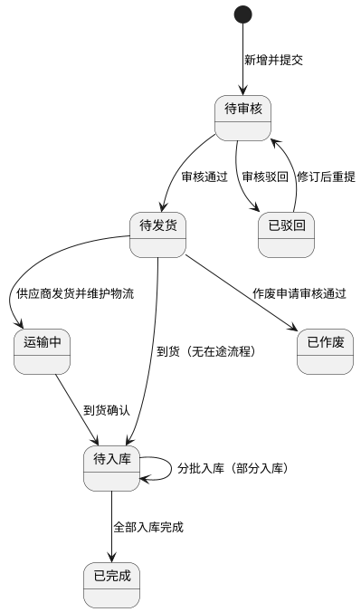

**5）状态联动规则**

| 触发事件   | 联动对象       | 联动规则                    | 按钮禁用规则        |
| ------ | ---------- | ----------------------- | ------------- |
| 审核通过   | 订单状态、扩展信息区 | 状态变更为待发货，开放物流/检测/溯源维护入口 | 禁用删除、禁用基础信息编辑 |
| 供应商发货  | 订单状态       | 状态变更为运输中                | 禁用数量/单价编辑     |
| 到货确认   | 订单状态、入库入口  | 状态变更为待入库，开放合并生成入库单      | 禁用作废申请        |
| 分批入库成功 | 订单数量字段     | 回写已入库数量、剩余待入库数量、入库进度    | 未完成前保持待入库     |
| 全部入库完成 | 订单状态       | 状态自动变更为已完成              | 禁用所有编辑与删除     |
| 作废审核通过 | 订单状态       | 状态变更为已作废                | 禁用入库与扩展信息维护   |

**6）完整正向业务流程**

1. 采购专员新增采购订单，录入订单日期、供应商、收货地址、关联采购计划、订单明细。
2. 系统校验供应商必选与关联合法性（供应商状态、计划一致性、数量有效性），通过后保存并提交审核。
3. 审核人执行审核通过，订单状态由待审核变更为待发货；驳回则进入已驳回。
4. 供应商发货后，采购专员维护物流追踪信息，订单状态进入运输中；检测报告与溯源信息可同步维护。
5. 三类扩展信息支持手工录入与第三方接口写入，均可上传、查看、删除附件。
6. 订单到货后状态变更为待入库；采购专员或仓库管理员可勾选多个待入库订单合并生成入库单。
7. 入库执行支持分批处理，一个订单可关联多个入库单；每次入库后自动回写已入库与剩余待入库数量。
8. 当订单全部明细数量完成入库后，订单状态自动更新为已完成。
9. 订单审核通过后，`trace_batch_id`、证据链编号与物流/检测/溯源信息同步下发到收货、入库、库存批次台账；任一链路节点写入失败时不得标记为待入库或已完成。
10. 在待发货状态下可发起作废申请，经审核通过后订单状态变更为已作废。

**7）完整异常业务流程**

1. 新增/编辑未选择供应商时阻断提交，提示“供应商为必选项”。
2. 选择供应商为待审核、禁用、已驳回、已注销时阻断保存。
3. 关联采购计划与订单供应商不一致时阻断保存并提示冲突计划编号。
4. 订单明细为空、数量<=0、单价<0或格式非法时阻断保存。
5. 待审核以外状态编辑基础信息时阻断，提示“已审核不可修改基础信息”。
6. 已入库订单执行删除时阻断，提示“已入库不可删除”。
7. 非待发货状态发起作废申请时阻断。
8. 状态不允许时维护物流/检测/溯源信息被阻断。
9. 第三方接口写入时外部记录ID缺失、重复或格式非法时阻断并记录失败原因。
10. 附件上传类型不支持、大小超限、文件损坏时阻断上传。
11. 无权限用户执行审核、删除、作废审核、合并入库时返回403并记录审计日志。
12. 合并生成入库单时勾选订单状态不一致、供应商不一致、无待入库数量时阻断。
13. 入库数量超过订单剩余待入库数量时阻断并提示超量明细行。
14. 并发场景下重复提交（审核、作废、合并入库）触发幂等保护，后续重复请求拒绝。
15. 关联数据冲突（订单不存在、入库单已作废、关系重复写入）时事务回滚并提示重试。
16. `trace_batch_id`、证据链编号缺失或与收货/入库记录不一致时，阻断进入待入库、已完成、监管导出等正式状态，并生成链路修复任务。

**8）唯一性校验、关联关系、附件上传规则**

**唯一性校验**

1. 订单编号全局唯一。
2. 同一订单内明细行“物料ID+规格”唯一（重复时提示合并行）。
3. 同一订单内检测报告编号唯一。
4. 同一订单同类型扩展信息下，外部记录ID唯一。

**关联关系规则**

1. 订单与采购计划：多对多关系（一个订单可关联多个计划，一个计划可关联多个订单）。
2. 订单与入库单：多对多关系（支持多订单合并入库、单订单多次入库）。
3. 订单明细与入库明细：按物料维度建立数量映射关系，用于回写已入库/待入库数量。
4. 采购订单主记录的 `trace_batch_id` 必须透传至收货记录、入库批次、库存批次台账与后续领用出库，不得因分批入库而断链。
5. 物流、检测、溯源、收货附件与订单主记录必须共享同一证据链编号，支持按订单编号、`trace_batch_id`、证据链编号三种方式任意检索。

**附件上传规则**

1. 三类扩展信息（物流/检测/溯源）均支持附件上传、查看、删除。
2. 支持格式：`jpg/jpeg/png/pdf/doc/docx/xls/xlsx/mp4`。
3. 单文件大小≤50MB；单条扩展信息最多20个附件。
4. 删除附件采用逻辑删除，保留操作日志与版本留痕。

**订单统计口径规则**

1. 本月统计口径默认按订单`创建时间`所属自然月计算，用户切换月份后按所选自然月重算。
2. `本月订单总金额`仅统计状态不为物理删除的有效订单，已作废订单纳入统计但在金额分布图中单独标记为“已作废订单金额”。
3. `本月已收货订单数`与`本月待收货订单数`允许同一订单在不同时间点发生状态迁移，但同一统计时刻不得同时重复计入两个口径。
4. `本月订单平均金额`保留两位小数，采用四舍五入规则。
5. 统计卡片默认跟随顶部筛选中的组织与数据权限范围变化，禁止跨组织汇总越权数据。

**9）权限控制与数据范围**

| 角色    | 功能权限                                | 数据范围      |
| ----- | ----------------------------------- | --------- |
| 采购专员  | 新增、编辑、删除、提交审核、维护扩展信息、导入导出、发起作废、合并入库 | 本组织及授权组织  |
| 采购经理  | 订单审核、作废审核、查询导出                      | 本组织及下级组织  |
| 仓库管理员 | 查询订单、查看扩展信息、合并生成入库单、查看入库关联          | 本组织仓储相关数据 |
| 食堂负责人 | 审核、作废审核、查询导出、全过程监管                  | 本食堂全量数据   |

**权限实现规则**

1. 前端按权限控制菜单与按钮显隐。
2. 后端接口执行功能权限+数据权限双校验，越权统一返回403。
3. 关键操作（新增、编辑、删除、审核、作废、扩展信息维护、附件删除、合并入库）全量审计。

#### 1.4 收货（入库）

**页面路径：** `菜单 → 采购管理 → 收货（入库）`  
**访问权限：** `仓库管理员、采购专员、食堂负责人（只读查看）`  
**页面类型：** `列表页 + 详情页 + 执行页 + 验收记录页`

**1）模块概述与业务目标**

1. 本页面用于承接采购订单到货后的现场收货、扫码验收、仓库仓位分配、收货证据上传、质量评分与入库联动。
2. 本模块需支持一个采购订单多次分批收货，并按订单、订单明细两个维度实时回写已收货数量、待收货数量、部分收货进度与最终订单状态。
3. 收货成功后需同步生成对应入库记录并与采购订单、供应商、仓库仓位、验收附件建立完整追溯链路。
4. 本模块需兼容扫码、拍照、视频上传等现场操作场景，保证弱网环境下也能稳定完成单据保存与后续补传。

**2）完整字段定义**

**2.1 待入库订单列表字段**

| 字段名       | 类型       | 长度    | 是否必填 | 默认值    | 约束规则                | 示例                                         |
| --------- | -------- | ----- | ---- | ------ | ------------------- | ------------------------------------------ |
| 收货任务ID    | UUID     | 36    | 是    | 系统生成   | 全局唯一                | `RCV-4d5f0e91-2f1b-4ab7-9db2-61f0d5c70001` |
| 采购订单ID    | UUID     | 36    | 是    | 无      | 必须关联有效采购订单          | `1d2f4f3a-bf48-4fb8-a6b6-977491f89c20`     |
| 采购订单编号    | String   | 24    | 是    | 无      | 支持点击查看详情            | `CGD-20260403-00018`                       |
| 供应商名称     | String   | 2-100 | 是    | 订单带出   | 与采购订单快照一致           | `晨辉农副产品有限公司`                               |
| 入库类型      | Enum     | -     | 是    | 采购入库   | 固定为采购入库             | `采购入库`                                     |
| 订单总数量     | Decimal  | 18,3  | 是    | 订单汇总   | `>0`                | `180.000`                                  |
| 已收货数量     | Decimal  | 18,3  | 是    | 0      | 系统回写累计值             | `90.000`                                   |
| 待收货数量     | Decimal  | 18,3  | 是    | 系统计算   | `订单总数量-已收货数量`，不得为负  | `90.000`                                   |
| 部分收货进度(%) | Decimal  | 5,2   | 是    | 0.00   | `已收货数量/订单总数量*100%`  | `50.00`                                    |
| 收货状态      | Enum     | -     | 是    | 待收货    | 取值：待收货/部分收货/已完成/已拒收 | `部分收货`                                     |
| 到货日期      | Date     | 10    | 否    | 当前业务日期 | 不得晚于当前日期+1天         | `2026-04-03`                               |
| 收货组织ID    | String   | 1-64  | 是    | 当前组织   | 必须在数据权限范围内          | `ORG-001`                                  |
| 收货组织名称    | String   | 1-100 | 是    | 当前组织   | 自动带出                | `第一食堂`                                     |
| 创建人       | String   | 2-50  | 是    | 订单创建人  | 只读                  | `zhangsan`                                 |
| 最后收货时间    | DateTime | 19    | 否    | 空      | 有收货记录后回写            | `2026-04-03 10:25:16`                      |
| 更新时间      | DateTime | 19    | 是    | 系统时间   | 任意收货动作后更新           | `2026-04-03 10:25:16`                      |

**2.2 订单详情与待收货明细字段**

| 字段名      | 类型      | 长度    | 是否必填 | 默认值    | 约束规则             | 示例                  |
| -------- | ------- | ----- | ---- | ------ | ---------------- | ------------------- |
| 明细ID     | UUID    | 36    | 是    | 系统生成   | 全局唯一             | `RCV-ITEM-0001`     |
| 采购订单明细ID | UUID    | 36    | 是    | 无      | 必须关联订单明细         | `POI-0b79d7d5`      |
| 物料ID     | String  | 36    | 是    | 无      | 必须存在于物料主数据       | `MAT-000321`        |
| 物料名称     | String  | 1-100 | 是    | 订单带出   | 只读               | `鸡腿肉`               |
| 物料规格     | String  | 1-100 | 是    | 订单带出   | 只读               | `10kg/箱`            |
| 计量单位     | String  | 1-20  | 是    | 订单带出   | 只读               | `箱`                 |
| 订单数量     | Decimal | 18,3  | 是    | 无      | `>0`             | `60.000`            |
| 已收货数量    | Decimal | 18,3  | 是    | 0      | 系统累计             | `20.000`            |
| 待收货数量    | Decimal | 18,3  | 是    | 系统计算   | `订单数量-已收货数量`     | `40.000`            |
| 本次收货数量   | Decimal | 18,3  | 否    | 0      | `>0` 且 `<=待收货数量` | `20.000`            |
| 入库仓库ID   | String  | 36    | 条件必填 | 空      | 选中收货行后必填         | `WH-001`            |
| 入库仓库名称   | String  | 1-100 | 条件必填 | 空      | 与仓库ID联动          | `冷藏主仓`              |
| 入库仓位ID   | String  | 36    | 条件必填 | 空      | 必须归属所选仓库且状态可用    | `LOC-A-01-03`       |
| 入库仓位名称   | String  | 1-100 | 条件必填 | 空      | 与仓位ID联动          | `A-01-03`           |
| 批次号      | String  | 0-50  | 否    | 系统建议/空 | 批次管理开启时建议填写      | `BATCH-20260403-01` |
| 保质期(天)   | Integer | 1-5位  | 否    | 物料标准值  | `>0`             | `7`                 |
| 单价       | Decimal | 18,4  | 否    | 订单带出   | 只读               | `85.6000`           |
| 小计       | Decimal | 18,2  | 否    | 系统计算   | `本次收货数量*单价`      | `1712.00`           |
| 验收结论     | Enum    | -     | 否    | 通过     | 取值：通过/部分通过/拒收    | `通过`                |
| 拒收原因     | String  | 0-500 | 否    | 空      | 验收结论=拒收时必填       | `包装破损并伴随异味`         |
| 行备注      | String  | 0-500 | 否    | 空      | 长度限制             | `先入冷藏库`             |

**2.3 验收记录与附件字段**

| 字段名    | 类型       | 长度    | 是否必填 | 默认值    | 约束规则                        | 示例                                        |
| ------ | -------- | ----- | ---- | ------ | --------------------------- | ----------------------------------------- |
| 验收记录ID | UUID     | 36    | 是    | 系统生成   | 全局唯一                        | `RCV-LOG-0001`                            |
| 验收方式   | Enum     | -     | 是    | 手工录入   | 取值：手工录入/扫码验收/拍照识别           | `扫码验收`                                    |
| 质量评分   | Integer  | 1位    | 否    | 空      | 取值：1-5星；要求评分时必填             | `5`                                       |
| 验收人ID  | String   | 1-64  | 是    | 当前登录用户 | 自动写入                        | `EMP-00021`                               |
| 验收人姓名  | String   | 2-50  | 是    | 当前登录用户 | 自动带出                        | `张三`                                      |
| 验收时间   | DateTime | 19    | 是    | 系统时间   | 自动写入                        | `2026-04-03 10:25:16`                     |
| 附件ID   | UUID     | 36    | 否    | 系统生成   | 全局唯一                        | `FILE-001`                                |
| 附件类型   | Enum     | -     | 否    | 图片     | 取值：图片/视频/文件                 | `视频`                                      |
| 附件名称   | String   | 1-200 | 否    | 原文件名   | 保留后缀                        | `arrival_check_001.mp4`                   |
| 附件URL  | String   | 1-500 | 否    | 空      | 上传成功后返回                     | `https://oss.example.com/receipt/001.mp4` |
| 附件大小KB | Integer  | 1-10位 | 否    | 0      | 图片≤10240，视频≤204800，文件≤20480 | `2048`                                    |
| 上传状态   | Enum     | -     | 是    | 待上传    | 取值：待上传/上传中/上传成功/上传失败        | `上传成功`                                    |
| 上传失败原因 | String   | 0-500 | 否    | 空      | 上传失败时必填                     | `网络中断`                                    |
| 收货备注   | String   | 0-500 | 否    | 空      | 单次验收说明                      | `包装完整，温度正常`                               |

**3）页面结构与交互规则**

**页面结构**

1. 顶部筛选区：采购订单编号、供应商、到货日期、收货状态、收货组织、关键字、查询、重置。
2. 中部列表区：待入库订单列表，展示订单编号、供应商、数量、进度、状态、最后收货时间、操作按钮。
3. 右侧详情抽屉：订单基础信息、订单物料明细、已收货记录、入库记录、操作日志。
4. 底部执行区：本次收货明细表单、仓库仓位选择、扫码验收、附件上传、质量评分、备注、确认收货按钮。

**按钮显隐与操作前置条件**

| 按钮     | 可见角色             | 显示条件     | 操作前置条件              | 执行结果           |
| ------ | ---------------- | -------- | ------------------- | -------------- |
| 查看订单详情 | 仓库管理员、采购专员、食堂负责人 | 列表有数据    | 订单在数据权限范围内          | 打开详情抽屉         |
| 扫码验收   | 仓库管理员、采购专员       | 收货状态≠已完成 | 终端支持扫码；已选中待收货明细     | 扫码定位物料并回填当前行   |
| 上传附件   | 仓库管理员、采购专员       | 编辑态      | 文件格式与大小合法           | 绑定到本次验收记录      |
| 暂存收货记录 | 仓库管理员、采购专员       | 编辑态      | 至少填写1行本次收货数量        | 保存草稿，不回写订单完成状态 |
| 确认收货   | 仓库管理员、采购专员       | 编辑态      | 数量、仓库仓位、附件、质量评分校验通过 | 生成收货记录并联动入库    |
| 查看收货记录 | 仓库管理员、采购专员、食堂负责人 | 存在历史收货记录 | 无                   | 查看收货履历         |

**关键交互规则**

1. 进入页面默认展示收货状态为`待收货`和`部分收货`的订单。
2. 点击订单后，明细区按订单明细行展示待收货数量，支持逐行填写本次收货数量。
3. 选择入库仓库后，仓位下拉仅显示该仓库下状态=使用中的可用仓位。
4. 扫码验收成功后，系统自动定位物料行并回填物料信息、建议仓库/仓位、建议批次号，不自动提交。
5. 单次确认收货支持部分行收货，未填写本次收货数量的行不参与本次提交。
6. 质量评分默认非必填；若供应商或组织配置启用了到货质检评分，则质量评分必填。
7. 收货成功后页面仅局部刷新当前订单进度与明细待收货数量，避免整页跳转。

**4）状态定义与状态流转**

| 状态   | 含义                    | 可执行操作        | 下一状态          |
| ---- | --------------------- | ------------ | ------------- |
| 待收货  | 订单存在待收货数量，尚未发生收货      | 扫码验收、暂存、确认收货 | 部分收货/已完成/已拒收  |
| 部分收货 | 已发生至少一次有效收货，但仍存在待收货数量 | 扫码验收、暂存、确认收货 | 部分收货/已完成/已拒收  |
| 已完成  | 订单明细全部收货完成并已回写入库      | 查看详情、查看记录    | 终态            |
| 已拒收  | 本次或全部到货验收拒收，等待后续处理    | 查看详情、查看记录    | 终态/待收货（经重新到货） |

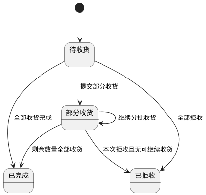

**5）状态联动规则**

1. 本次收货成功后，订单明细已收货数量实时累加，待收货数量实时扣减。
2. 任一明细仍存在待收货数量时，订单收货状态维持`部分收货`，采购订单状态维持`待入库`。
3. 全部明细收货完成后，收货状态变更为`已完成`，采购订单状态同步判断为`已完成`或保持`待入库`，以最终入库完成情况为准。
4. 验收结论为`拒收`时，不回写已收货数量，不生成入库记录，并要求填写拒收原因。
5. 收货成功后自动生成入库联动记录，入库数量与本次收货数量一致，不允许手工篡改。
6. 订单已完成后，确认收货按钮置灰，扫码验收、上传附件、暂存入口关闭，只保留查看能力。

**6）完整正向业务流程**

1. 仓库管理员进入收货（入库）页面，按订单编号、供应商或到货日期筛选待入库订单。
2. 选择目标订单后查看待收货明细，系统展示订单数量、已收货数量、待收货数量及部分收货进度。
3. 现场通过扫码、人工录入或拍照识别定位物料行，填写本次收货数量并选择入库仓库、仓位。
4. 按需上传现场照片、视频或证明文件，并填写质量评分与收货备注。
5. 点击确认收货后，系统执行数量校验、仓库仓位校验、附件与评分校验。
6. 校验通过后系统生成本次收货记录、收货附件记录、入库联动记录，并回写采购订单收货进度。
7. 若本次收货后仍有待收货数量，订单状态更新为`部分收货`；若全部完成，则更新为`已完成`。

**7）完整异常业务流程**

1. 收货数量为空、<=0、超过待收货数量时，阻断提交并定位到错误行。
2. 仓库或仓位未选择时，阻断确认收货并提示补全仓储信息。
3. 选择的仓位不属于当前仓库、仓位状态非使用中或容量不足时，阻断提交并提示具体原因。
4. 扫码结果无法匹配订单明细时，提示“当前订单无对应物料，请人工确认”，不自动写入。
5. 附件上传失败、文件格式不支持、大小超限时，返回明确原因并支持重传；必传附件失败时禁止提交。
6. 质量评分要求开启但未评分时，阻断提交。
7. 并发场景下同一订单明细被他人先收货，当前提交需基于最新待收货数量重新校验，超量则阻断。
8. 入库联动失败时，整笔收货事务回滚，不得出现“已收货但未入库”半成功状态。
9. 网络异常导致提交失败时，页面保留已填写内容，支持重试或暂存草稿，不得生成重复收货记录。
10. 权限不足用户查看或执行收货时，前端隐藏入口，后端返回403并记录审计日志。

**8）与采购订单、入库单的关联规则**

1. 收货记录必须关联采购订单、采购订单明细、入库联动记录三类对象。
2. 一个采购订单可对应多条收货记录；一条收货记录可包含多个订单明细行。
3. 收货成功后自动生成采购入库类型的入库记录，作为后续库存回写与台账追溯依据。
4. 收货记录删除仅允许删除未正式提交的暂存草稿；已提交收货记录不允许物理删除，仅允许作废并记录原因。
5. 收货附件与收货记录强关联，附件删除遵循逻辑删除并保留版本留痕。

**9）权限控制、导出与审计规则**

| 角色    | 功能权限                        | 数据范围       |
| ----- | --------------------------- | ---------- |
| 仓库管理员 | 查询、扫码验收、暂存、确认收货、上传附件、查看收货记录 | 本组织及授权仓库范围 |
| 采购专员  | 查询、查看详情、上传附件、确认收货           | 本组织及授权订单范围 |
| 食堂负责人 | 查询、查看详情、查看收货记录              | 本组织及授权订单范围 |

1. 收货、暂存、扫码验收、附件上传、作废、查看记录等关键动作必须记录操作日志。
2. 支持按当前筛选条件导出待收货订单与收货记录，导出文件命名规则为`收货记录_YYYYMMDD_HHmmss.xlsx`。
3. 导出字段至少包含订单编号、供应商、物料、规格、订单数量、已收货数量、待收货数量、本次收货数量、仓库、仓位、验收人、验收时间、质量评分、状态。
4. 所有越权访问、重复提交、超量收货、联动失败等异常均需写入安全审计与业务异常日志。

---

### 模块2：仓储管理

#### 2.1 物料库存管理

**页面路径：** `菜单 → 仓储管理 → 物料库存管理`  
**访问权限：** `仓库管理员、食堂负责人、采购专员、系统管理员`  
**页面类型：** `总览列表页 + 物料库存详情页（库存分布/出入库明细）`

**1）模块概述与业务目标**

1. 本模块用于按物料维度提供库存总览、库存分布、保质期分层、出入库明细查询能力。
2. 本模块支持库存总览筛选与导出、出入库明细筛选与导出，支撑运营盘点与追溯分析。
3. 本模块按规则自动计算库存状态标签，并实时联动展示，确保库存风险识别一致性。

**2）完整字段定义**

**2.1 查询与筛选字段**

| 字段名   | 类型      | 长度    | 是否必填 | 约束规则                | 默认值  | 示例            |
| ----- | ------- | ----- | ---- | ------------------- | ---- | ------------- |
| 关键字   | String  | 0-100 | 否    | 匹配物料名称/编码/规格，去首尾空格  | 空    | `西红柿`         |
| 物料类型  | Enum    | -     | 否    | 必须为物料类型字典值          | 全部   | `蔬菜`          |
| 物料类别  | String  | 1-50  | 否    | 必须为物料类别字典值          | 全部   | `叶菜类`         |
| 仓库ID  | String  | 36    | 否    | 必须在数据权限范围内          | 全部   | `WH-001`      |
| 仓位ID  | String  | 36    | 否    | 必须归属所选仓库            | 全部   | `LOC-A-01-03` |
| 库存状态  | Enum    | -     | 否    | 取值：正常/库存不足/库存积压/已过期 | 全部   | `库存不足`        |
| 保质期分层 | Enum    | -     | 否    | 取值：正常/预警/临期/过期      | 全部   | `临期`          |
| 页码    | Integer | 1-6位  | 是    | `>=1`               | `1`  | `1`           |
| 每页条数  | Integer | 1-3位  | 是    | 取值：10/20/50/100     | `20` | `50`          |

**2.2 物料库存总览字段**

| 字段名        | 类型          | 长度    | 是否必填 | 约束规则                  | 默认值        | 示例                            |
| ---------- | ----------- | ----- | ---- | --------------------- | ---------- | ----------------------------- |
| 物料ID       | String      | 36    | 是    | 全局唯一，主键               | 无          | `MAT-000018`                  |
| 物料图片       | String(URL) | 0-500 | 否    | 图片URL合法               | 空          | `/upload/material/tomato.jpg` |
| 物料名称       | String      | 1-100 | 是    | 只读，来自物料主数据            | 无          | `西红柿`                         |
| 物料类型       | Enum        | -     | 是    | 来自物料主数据               | 无          | `蔬菜`                          |
| 物料规格       | String      | 1-100 | 是    | 只读                    | 无          | `10kg/箱`                      |
| 所在仓库       | String      | 1-100 | 是    | 多仓库时展示“多仓库”并可下钻       | 无          | `冷藏主仓`                        |
| 所在仓位       | String      | 1-100 | 是    | 多仓位时展示“多仓位”并可下钻       | 无          | `A-01-03`                     |
| 当前库存       | Decimal     | 18,3  | 是    | `>=0`                 | 系统计算       | `186.500`                     |
| 最低库存       | Decimal     | 18,3  | 是    | `>=0`                 | 物料主数据      | `80.000`                      |
| 最高库存       | Decimal     | 18,3  | 是    | `>=最低库存`              | 物料主数据      | `300.000`                     |
| 库存范围       | String      | 3-50  | 是    | 展示格式：`最低库存-最高库存`      | 系统拼接       | `80.000-300.000`              |
| 批次号（最新）    | String      | 0-50  | 否    | 展示最新批次号               | 空          | `BATCH-20260328-01`           |
| 生产日期（最新批次） | Date        | 10    | 否    | 日期合法                  | 空          | `2026-03-25`                  |
| 保质期（天）     | Integer     | 1-5位  | 否    | `>0`                  | 物料主数据/批次数据 | `7`                           |
| 剩余天数（最小）   | Integer     | 1-5位  | 是    | 可为负值                  | 系统计算       | `2`                           |
| 库存状态       | Enum        | -     | 是    | 自动计算：正常/库存不足/库存积压/已过期 | 系统计算       | `库存不足`                        |
| 最后更新时间     | DateTime    | 19    | 是    | 只读                    | 系统时间       | `2026-03-30 15:20:43`         |

**2.3 物料库存分布字段（仓库/仓位）**

| 字段名    | 类型      | 长度    | 是否必填 | 约束规则      | 默认值  | 示例                  |
| ------ | ------- | ----- | ---- | --------- | ---- | ------------------- |
| 分布ID   | String  | 36    | 是    | 全局唯一      | 无    | `INV-DIST-0001`     |
| 物料ID   | String  | 36    | 是    | 关联物料      | 无    | `MAT-000018`        |
| 仓库ID   | String  | 36    | 是    | 合法仓库      | 无    | `WH-001`            |
| 仓库名称   | String  | 1-100 | 是    | 只读        | 无    | `冷藏主仓`              |
| 仓位ID   | String  | 36    | 是    | 必须归属仓库ID  | 无    | `LOC-A-01-03`       |
| 仓位名称   | String  | 1-100 | 是    | 只读        | 无    | `A-01-03`           |
| 批次号    | String  | 0-50  | 否    | 批次管理开启时必填 | 空    | `BATCH-20260328-01` |
| 分布数量   | Decimal | 18,3  | 是    | `>=0`     | 无    | `60.000`            |
| 生产日期   | Date    | 10    | 否    | 日期合法      | 空    | `2026-03-25`        |
| 保质期（天） | Integer | 1-5位  | 否    | `>0`      | 空    | `7`                 |
| 剩余天数   | Integer | 1-5位  | 是    | 可为负值      | 系统计算 | `2`                 |

**2.4 保质期分层统计字段**

| 字段名   | 类型      | 长度   | 是否必填 | 约束规则           | 默认值     | 示例           |
| ----- | ------- | ---- | ---- | -------------- | ------- | ------------ |
| 物料ID  | String  | 36   | 是    | 关联物料           | 无       | `MAT-000018` |
| 正常层库存 | Decimal | 18,3 | 是    | `>=0`          | `0.000` | `80.000`     |
| 预警层库存 | Decimal | 18,3 | 是    | `>=0`          | `0.000` | `50.000`     |
| 临期层库存 | Decimal | 18,3 | 是    | `>=0`          | `0.000` | `40.000`     |
| 过期层库存 | Decimal | 18,3 | 是    | `>=0`          | `0.000` | `16.500`     |
| 分层总库存 | Decimal | 18,3 | 是    | `=正常+预警+临期+过期` | 系统计算    | `186.500`    |

**2.5 出入库明细字段**

| 字段名     | 类型       | 长度    | 是否必填 | 约束规则             | 默认值  | 示例                    |
| ------- | -------- | ----- | ---- | ---------------- | ---- | --------------------- |
| 流水ID    | String   | 36    | 是    | 全局唯一             | 无    | `STK-LOG-000012`      |
| 单据类型    | Enum     | -     | 是    | 入库单/出库单/盘点单/调拨单等 | 无    | `入库单`                 |
| 单据编号    | String   | 1-50  | 是    | 可追溯到业务单据         | 无    | `RK-20260330-00012`   |
| 操作类型    | Enum     | -     | 是    | 入库/出库/调整         | 无    | `出库`                  |
| 物料ID    | String   | 36    | 是    | 关联物料             | 无    | `MAT-000018`          |
| 物料名称    | String   | 1-100 | 是    | 只读               | 无    | `西红柿`                 |
| 规格      | String   | 1-100 | 是    | 只读               | 无    | `10kg/箱`              |
| 数量      | Decimal  | 18,3  | 是    | `>0`             | 无    | `12.000`              |
| 单位      | String   | 1-20  | 是    | 合法单位字典值          | 无    | `箱`                   |
| 操作后库存数量 | Decimal  | 18,3  | 是    | `>=0`            | 系统计算 | `174.500`             |
| 仓库名称    | String   | 1-100 | 是    | 只读               | 无    | `冷藏主仓`                |
| 仓位名称    | String   | 1-100 | 否    | 只读               | 空    | `A-01-03`             |
| 操作人     | String   | 2-50  | 是    | 只读               | 无    | `zhangsan`            |
| 操作时间    | DateTime | 19    | 是    | 只读               | 系统时间 | `2026-03-30 14:12:06` |

**3）页面结构与交互规则**

**页面结构**

1. 顶部筛选区：关键字、物料类型、物料类别、仓库、仓位、库存状态、保质期分层、查询、重置、导出。
2. 中部总览区：物料库存总览列表（分页、排序、状态标签、操作按钮）。
3. 详情区（点击“查看详情”）：页签一“库存分布（仓库/仓位）”；页签二“保质期分层”；页签三“出入库明细记录”。
4. 操作区：总览导出按钮、出入库明细导出按钮。

**按钮显隐与操作前置条件**

| 按钮      | 可见角色                   | 显示条件           | 操作前置条件    | 执行结果          |
| ------- | ---------------------- | -------------- | --------- | ------------- |
| 查询      | 全部有权限角色                | 始终显示           | 筛选参数合法    | 刷新总览列表        |
| 重置      | 全部有权限角色                | 始终显示           | 无         | 清空筛选恢复默认      |
| 查看详情    | 全部有权限角色                | 列表有数据          | 物料在权限范围内  | 打开库存详情页       |
| 导出库存总览  | 仓库管理员、食堂负责人、采购专员、系统管理员 | 有导出权限          | 当前筛选参数合法  | 导出当前筛选结果Excel |
| 导出出入库明细 | 仓库管理员、食堂负责人、系统管理员      | 在出入库明细页签且有导出权限 | 物料与筛选参数合法 | 导出当前明细Excel   |

**状态颜色标识**

1. 库存状态颜色：正常 `#67C23A`、库存不足 `#F56C6C`、库存积压 `#E6A23C`、已过期 `#C03639`。
2. 保质期分层颜色：正常 `#67C23A`、预警 `#E6A23C`、临期 `#F56C6C`、过期 `#C03639`。

**导出按钮逻辑**

1. 默认导出“当前筛选结果”，不导出未筛选的隐藏数据。
2. 查询结果为0时允许导出，生成仅表头文件并提示“无匹配数据”。
3. 导出数据量>100000行时自动转异步导出任务，前端展示任务状态与下载入口。

**4）库存状态自动判断与联动规则**

**4.1 库存状态自动判断规则（强制）**

1. 库存不足：`当前库存 <= 最低库存`。
2. 库存积压：`当前库存 >= 最高库存`。
3. 已过期：`保质期剩余天数 <= 0`。

**4.2 状态计算优先级**

1. 优先级：`已过期 > 库存不足 > 库存积压 > 正常`。
2. 当条件同时命中时按优先级仅展示一个库存状态标签，避免多状态并存。

**4.3 保质期分层规则**

1. 过期层：`剩余天数 <= 0`。
2. 临期层：`0 < 剩余天数 <= 临期提醒天数`。
3. 预警层：`临期提醒天数 < 剩余天数 <= 预警期`。
4. 正常层：`剩余天数 > 预警期`。

**4.4 状态联动触发**

1. 触发事件：入库、出库、盘点、库存调整、批次信息变更、每日定时任务。
2. 联动结果：自动重算库存状态与保质期分层，并同步刷新总览、详情、导出数据口径。

**状态流转图**

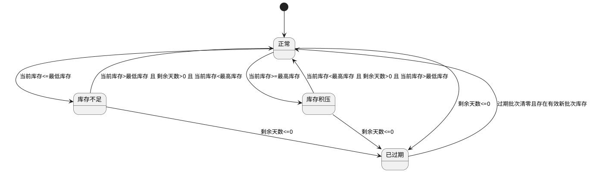

**5）完整正向业务流程**

1. 用户进入物料库存管理页面，系统加载默认总览列表。
2. 用户按筛选条件查询目标物料库存，查看状态标签与关键字段。
3. 用户点击某物料“查看详情”，查看该物料在各仓库、仓位的分布数量。
4. 用户在详情中查看保质期分层统计（正常、预警、临期、过期）。
5. 用户切换到“出入库明细”页签，按时间与单据条件查询库存流水。
6. 用户点击“导出库存总览”导出当前筛选结果Excel。
7. 用户点击“导出出入库明细”导出当前筛选明细Excel。
8. 系统记录查询、导出操作日志用于审计。

**6）完整异常业务流程**

1. 无库存数据时，页面展示空态和引导文案，不显示异常堆栈。
2. 筛选无结果时，展示“无匹配数据”，支持一键重置筛选。
3. 筛选参数不合法（如日期区间反向、非法枚举）时，阻断查询并提示具体字段。
4. 用户无查看权限时，页面仅显示授权范围内数据；越权请求返回403。
5. 用户无导出权限时，隐藏导出按钮；直接调用导出接口返回403。
6. 导出服务异常（超时/网络中断）时，提示失败原因并支持重试。
7. 导出任务失败时，任务状态标记为失败并保留失败原因，不生成脏文件。
8. 物料详情不存在或被归档时，阻断详情页加载并提示“物料不可用”。
9. 数据并发更新导致分页数据变化时，系统以最新快照返回并刷新总数。
10. 分层阈值缺失导致无法计算时，分层区域提示“配置缺失”，同时写入告警日志。

**7）导出规则**

1. 导出格式：仅支持 `xlsx`。
2. 文件命名：
   - 库存总览：`库存总览_YYYYMMDD_HHmmss.xlsx`
   - 出入库明细：`出入库明细_物料编码_YYYYMMDD_HHmmss.xlsx`
3. 导出范围：仅导出“当前筛选结果 + 当前数据权限范围”数据。
4. 字段范围：
   - 库存总览导出：总览列表全部字段。
   - 出入库明细导出：出入库明细页签全部字段。
5. 字段格式：数量保留3位小数；时间统一 `YYYY-MM-DD HH:mm:ss`。
6. 数据量约束：`<=100000` 行同步导出；`>100000` 行异步导出。
7. 安全控制：导出接口执行功能权限与数据权限双校验，日志记录导出条件与结果。

**8）权限控制与数据范围**

| 角色    | 功能权限                        | 数据范围     |
| ----- | --------------------------- | -------- |
| 仓库管理员 | 查询总览、查看分布、查看出入库明细、导出总览、导出明细 | 本组织及授权组织 |
| 食堂负责人 | 查询总览、查看分布、查看出入库明细、导出总览、导出明细 | 本组织及授权组织 |
| 采购专员  | 查询总览、查看分布、查看出入库明细、导出总览      | 本组织及授权组织 |
| 系统管理员 | 全量查询与全量导出、审计查看              | 全组织范围    |

**权限实现规则**

1. 前端按角色动态控制按钮显隐与页签可见性。
2. 后端接口执行“功能权限+数据权限”双校验，越权统一返回403。
3. 查询、导出操作全量审计留痕，日志包含操作者、时间、筛选条件、导出结果。

#### 2.2 仓库信息管理

**页面路径：** `菜单 → 仓储管理 → 仓库信息管理`  
**访问权限：** `仓库管理员、系统管理员`  
**页面类型：** `仓库列表页 + 仓位列表页 + 详情抽屉 + 表单弹窗 + 导入弹窗`

**1）模块概述与业务目标**

1. 本模块用于管理仓库与仓位主数据，支撑入库、出库、盘点、库存分布等仓储业务。
2. 本模块同时覆盖仓库信息与仓位信息的新增、编辑、删除、查询、筛选、分页、导入、导出。
3. 本模块严格执行层级关系：一个组织可拥有多个仓库；一个仓库可包含多个仓位；一个仓位仅归属一个仓库；新增/编辑仓位必须选择所属仓库。
4. 本模块通过状态流转与联动规则，确保仓库/仓位在停用、归档、删除时不影响库存与在途单据一致性。

**2）完整字段定义**

**2.1 仓库主信息字段**

| 字段名     | 类型          | 长度       | 是否必填 | 默认值                                                                               | 约束规则                   | 示例                                        |
| ------- | ----------- | -------- | ---- | --------------------------------------------------------------------------------- | ---------------------- | ----------------------------------------- |
| 仓库ID    | UUID        | 36       | 是    | 系统生成                                                                              | 全局唯一、不可编辑              | `WH-7d3f9e21-8a2a-4a40-a3e1-2f33289c84e1` |
| 组织ID    | String      | 36       | 是    | 当前组织                                                                              | 必须为当前授权组织              | `ORG-10001`                               |
| 仓库编码    | String      | 4-32     | 是    | 无                                                                                 | 同组织唯一；仅允许字母/数字/`-`/`_` | `WH-BJ-001`                               |
| 仓库名称    | String      | 2-100    | 是    | 无                                                                                 | 同组织唯一；去空格后校验           | `朝阳主仓`                                    |
| 仓库类型    | Enum/String | -        | 是    | 从“仓库类型字典”选择；系统内置：常温仓库、冷藏仓库、冷冻仓库、干货仓库、危险品仓库、留样专用仓库、非食耗材仓库；支持管理员新增自定义类型；仅允许选择启用状态类型 | `常温仓库`                 | `冷藏仓库`                                    |
| 仓库状态    | Enum        | -        | 是    | `闲置`                                                                              | 取值：使用中/停用/闲置/已归档       | `使用中`                                     |
| 仓库位置    | String      | 1-200    | 是    | 无                                                                                 | 必填                     | `北京市朝阳区XX路88号B1`                          |
| 负责人姓名   | String      | 2-30     | 是    | 无                                                                                 | 中文/英文字符合法              | `王磊`                                      |
| 负责人联系方式 | String      | 11-20    | 是    | 无                                                                                 | 手机或固话格式合法              | `13800138000`                             |
| 最大容量    | Decimal     | 18,3     | 是    | `0`                                                                               | `>0`                   | `5000.000`                                |
| 当前占用容量  | Decimal     | 18,3     | 是    | 系统计算                                                                              | `>=0` 且 `<=最大容量`；只读    | `2450.000`                                |
| 容量占用率   | Decimal     | 5,2      | 是    | 系统计算                                                                              | `当前占用容量/最大容量*100`；只读   | `49.00`                                   |
| 温度值     | Decimal     | 6,2      | 否    | 空                                                                                 | 设备采集或手工登记              | `4.50`                                    |
| 温度状态    | Enum        | -        | 否    | `正常`                                                                              | 取值：正常/预警/异常            | `正常`                                      |
| 湿度值     | Decimal     | 6,2      | 否    | 空                                                                                 | 设备采集或手工登记              | `62.00`                                   |
| 湿度状态    | Enum        | -        | 否    | `正常`                                                                              | 取值：正常/预警/异常            | `预警`                                      |
| 温度预警条数  | Integer     | 0-999999 | 否    | 系统计算                                                                              | 只读                     | `3`                                       |
| 仓位总数    | Integer     | 0-99999  | 是    | 系统计算                                                                              | 只读                     | `120`                                     |
| 已使用仓位数  | Integer     | 0-99999  | 是    | 系统计算                                                                              | 只读                     | `86`                                      |
| 空闲仓位数   | Integer     | 0-99999  | 是    | 系统计算                                                                              | 只读                     | `34`                                      |
| 创建人     | String      | 2-50     | 是    | 当前用户                                                                              | 只读                     | `zhangsan`                                |
| 创建时间    | DateTime    | 19       | 是    | 系统时间                                                                              | 只读                     | `2026-03-27 09:20:11`                     |
| 更新人     | String      | 2-50     | 是    | 当前用户                                                                              | 只读                     | `lisi`                                    |
| 更新时间    | DateTime    | 19       | 是    | 系统时间                                                                              | 只读                     | `2026-03-27 15:08:39`                     |

**2.2 仓位信息字段**

| 字段名    | 类型          | 长度    | 是否必填 | 默认值                                                                        | 约束规则                    | 示例                                        |
| ------ | ----------- | ----- | ---- | -------------------------------------------------------------------------- | ----------------------- | ----------------------------------------- |
| 仓位ID   | UUID        | 36    | 是    | 系统生成                                                                       | 全局唯一                    | `WL-2dc8f2e5-e2ca-4fd7-8736-8ad90a5cb2da` |
| 所属仓库ID | String      | 36    | 是    | 无                                                                          | 必选；必须为当前组织下有效仓库         | `WH-7d3f9e21-8a2a-4a40-a3e1-2f33289c84e1` |
| 所属仓库编码 | String      | 4-32  | 是    | 自动带出                                                                       | 与仓库ID一致                 | `WH-BJ-001`                               |
| 所属仓库名称 | String      | 2-100 | 是    | 自动带出                                                                       | 与仓库ID一致                 | `朝阳主仓`                                    |
| 仓位编码   | String      | 4-32  | 是    | 无                                                                          | 同仓库内唯一；仅允许字母/数字/`-`/`_` | `A-01-03`                                 |
| 仓位类型   | Enum/String | -     | 是    | 从“仓位类型字典”选择；系统内置：常温仓位、冷藏仓位、冷冻仓位、干货仓位、危险品仓位、留样专用仓位；支持管理员新增自定义类型；仅允许选择启用状态类型 | `常温仓位`                  | `冷藏仓位`                                    |
| 区域编码   | String      | 1-20  | 是    | 无                                                                          | 层级字段必填                  | `A`                                       |
| 货架编码   | String      | 1-20  | 是    | 无                                                                          | 层级字段必填                  | `01`                                      |
| 货位编码   | String      | 1-20  | 是    | 无                                                                          | 层级字段必填                  | `03`                                      |
| 仓位层级路径 | String      | 1-100 | 是    | 系统拼接                                                                       | 只读，格式：区域-货架-货位          | `A-01-03`                                 |
| 仓位状态   | Enum        | -     | 是    | `闲置`                                                                       | 取值：使用中/停用/闲置/已归档        | `闲置`                                      |
| 仓位最大容量 | Decimal     | 18,3  | 否    | 空                                                                          | 非空时 `>0`                | `120.000`                                 |
| 当前库存数量 | Decimal     | 18,3  | 是    | 系统计算                                                                       | 只读，`>=0`                | `56.000`                                  |
| 当前占用容量 | Decimal     | 18,3  | 是    | 系统计算                                                                       | 只读                      | `48.000`                                  |
| 占用率    | Decimal     | 5,2   | 是    | 系统计算                                                                       | 只读                      | `40.00`                                   |
| 存储限制说明 | String      | 0-500 | 否    | 空                                                                          | 可选                      | `仅允许冷藏蔬菜`                                 |
| 创建人    | String      | 2-50  | 是    | 当前用户                                                                       | 只读                      | `zhangsan`                                |
| 创建时间   | DateTime    | 19    | 是    | 系统时间                                                                       | 只读                      | `2026-03-27 10:03:20`                     |
| 更新人    | String      | 2-50  | 是    | 当前用户                                                                       | 只读                      | `lisi`                                    |
| 更新时间   | DateTime    | 19    | 是    | 系统时间                                                                       | 只读                      | `2026-03-27 16:02:11`                     |

**3）页面结构与交互规则**

**页面结构**

1. 顶部区域：组织筛选、仓库状态筛选、仓位状态筛选、仓库类型筛选、关键字搜索、导入、导出。
2. 中部区域：左侧仓库列表，右侧仓位列表（按当前仓库过滤），均支持分页与排序。
3. 右侧详情抽屉：仓库档案详情（基本信息、核心指标、容量信息、仓位统计）与仓位详情。
4. 弹窗区域：新增/编辑仓库弹窗、新增/编辑仓位弹窗、删除确认弹窗、导入弹窗。

**按钮显隐与操作前置条件**

| 按钮   | 可见角色        | 显示条件                 | 操作前置条件             | 执行结果       |
| ---- | ----------- | -------------------- | ------------------ | ---------- |
| 新增仓库 | 仓库管理员、系统管理员 | 有创建权限                | 无                  | 打开仓库表单     |
| 编辑仓库 | 仓库管理员、系统管理员 | 仓库状态≠已归档             | 数据在权限范围内           | 打开编辑表单     |
| 删除仓库 | 仓库管理员、系统管理员 | 仓库状态∈{闲置,停用}         | 仓库下所有仓位库存=0且无进行中单据 | 逻辑删除并置为已归档 |
| 新增仓位 | 仓库管理员、系统管理员 | 当前已选仓库且仓库状态∈{使用中,闲置} | 必须选择所属仓库           | 打开仓位表单     |
| 编辑仓位 | 仓库管理员、系统管理员 | 仓位状态≠已归档             | 数据在权限范围内           | 打开仓位编辑     |
| 删除仓位 | 仓库管理员、系统管理员 | 仓位状态∈{闲置,停用}         | 仓位库存=0且无进行中单据      | 逻辑删除并置为已归档 |
| 导入仓库 | 仓库管理员、系统管理员 | 有导入权限                | 模板校验通过             | 批量创建仓库     |
| 导入仓位 | 仓库管理员、系统管理员 | 有导入权限                | 模板校验通过且所属仓库有效      | 批量创建仓位     |
| 导出仓库 | 仓库管理员、系统管理员 | 有导出权限                | 无                  | 导出仓库列表     |
| 导出仓位 | 仓库管理员、系统管理员 | 有导出权限                | 无                  | 导出仓位列表     |

**表单校验规则**

1. 新增/编辑仓位时，所属仓库必填且只能选择当前权限范围内仓库。
2. 所属仓库为停用或已归档时，不允许新建仓位。
3. 仓位仓库切换时，若仓位当前库存>0，则禁止变更所属仓库。

**4）状态定义与状态流转逻辑**

**仓库状态定义**

| 状态  | 含义              | 可用于入出库单选择 |
| --- | --------------- | --------- |
| 使用中 | 正常可用，支持入出库与仓位维护 | 是         |
| 闲置  | 暂无库存或未投入使用      | 是         |
| 停用  | 临时停用，不可新增业务占用   | 否         |
| 已归档 | 删除后归档，仅可查询不可操作  | 否         |

**仓位状态定义**

| 状态  | 含义             | 可用于入出库单选择 |
| --- | -------------- | --------- |
| 使用中 | 正常可用，存在或可接受库存  | 是         |
| 闲置  | 当前无库存，可投入使用    | 是         |
| 停用  | 临时停用，不可新分配库存   | 否         |
| 已归档 | 删除后归档，仅可查询不可操作 | 否         |

**状态流转图**

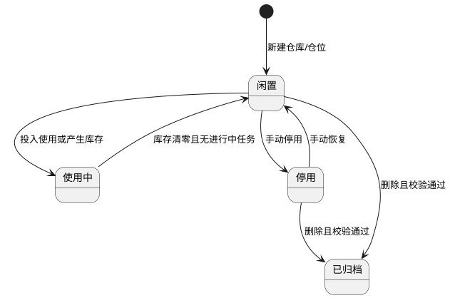

**5）状态联动规则**

| 触发事件 | 联动对象             | 联动规则                 | 禁用规则           |
| ---- | ---------------- | -------------------- | -------------- |
| 仓库停用 | 入出库单仓库选择器、仓位新增入口 | 停用仓库不可被新增业务选择        | 禁用新增仓位、禁用入出库选择 |
| 仓位停用 | 入出库单仓位选择器        | 停用仓位不可被新增业务选择        | 禁用仓位分配         |
| 仓库归档 | 仓库/仓位列表、业务选择器    | 归档仓库及其仓位仅查询可见        | 禁用编辑、删除、状态切换   |
| 仓位归档 | 仓位列表、业务选择器       | 归档仓位仅查询可见            | 禁用编辑、状态切换      |
| 库存变化 | 仓库容量、仓位占用率、状态建议  | 实时回写占用率；库存=0可由使用中转闲置 | 超容量时阻断入库并预警    |

**6）完整正向业务流程**

1. 仓库管理员新增仓库，填写编码、名称、类型、容量、位置、负责人等信息并保存。
2. 仓库管理员在仓库详情中新增仓位，必须选择所属仓库并填写仓位编码、仓位类型、层级信息。
3. 系统保存后建立“组织-仓库-仓位”层级关系，并刷新仓位统计数据。
4. 用户通过筛选条件查询仓库与仓位列表，支持分页、排序与详情查看。
5. 用户根据业务需要编辑仓库/仓位基础信息与状态，系统按状态联动更新业务可选范围。
6. 用户可通过模板批量导入仓库或仓位信息，系统校验后批量落库。
7. 用户按当前筛选条件导出仓库/仓位数据，用于运营与审计。
8. 当仓库或仓位满足删除条件时，执行删除并归档，保留历史审计记录。

**7）完整异常业务流程**

1. 仓库编码为空或格式非法时阻断保存。
2. 同组织下仓库编码或仓库名称重复时阻断保存。
3. 仓位新增未选择所属仓库时阻断提交。
4. 仓位编码在同仓库内重复时阻断保存。
5. 选择非法上级仓库（不存在、跨组织、已归档）时阻断提交。
6. 仓位状态切换为停用/归档时若库存>0，阻断操作。
7. 删除仓库时存在仓位库存或进行中单据，阻断删除。
8. 删除仓位时存在库存或进行中单据，阻断删除。
9. 停用仓库后尝试新建仓位或分配入库，系统阻断并提示状态不允许。
10. 导入模板缺列、字段格式错误、上级仓库无效、重复编码时导入失败并返回错误行号。
11. 导出时权限不足或数据越权，系统拒绝导出。
12. 并发编辑导致版本冲突时，阻断保存并提示刷新重试。

**8）层级关联校验与唯一性校验规则**

| 校验项      | 校验规则             | 处理方式   |
| -------- | ---------------- | ------ |
| 组织-仓库关系  | 仓库必须归属唯一组织       | 不满足即拦截 |
| 仓库-仓位关系  | 仓位必须归属唯一仓库       | 不满足即拦截 |
| 新增仓位归属必填 | 新增/编辑仓位必须选择所属仓库  | 不满足即拦截 |
| 仓库编码唯一   | 同组织内唯一           | 冲突即拦截  |
| 仓位编码唯一   | 同仓库内唯一           | 冲突即拦截  |
| 仓位层级唯一   | 同仓库内区域-货架-货位组合唯一 | 冲突即拦截  |

**9）导入导出规则**

**导入规则**

1. 仓库导入支持 `xlsx`，模板字段：组织编码、仓库编码、仓库名称、仓库类型、仓库位置、负责人、联系方式、最大容量、状态。
2. 仓位导入支持 `xlsx`，模板字段：组织编码、所属仓库编码、仓位编码、仓位类型、区域编码、货架编码、货位编码、状态、仓位最大容量。
3. 单文件≤10MB；单次导入≤5000行。
4. 导入支持部分成功，失败返回“行号+字段+原因”。

**导出规则**

1. 支持按当前筛选条件导出仓库列表与仓位列表。
2. 导出格式支持 `xlsx/csv`。
3. 导出范围受数据权限控制，越权数据不导出。
4. 超大数据量导出转异步任务并通知下载。

**10）权限控制与数据范围**

| 角色    | 功能权限                   | 数据范围     |
| ----- | ---------------------- | -------- |
| 仓库管理员 | 仓库/仓位新增、编辑、删除、导入、导出、查询 | 本组织及授权组织 |
| 系统管理员 | 全局查询、导入、导出、跨组织维护、审计查看  | 全组织范围    |

**权限实现规则**

1. 前端按权限控制菜单、按钮显隐。
2. 后端接口执行“功能权限+数据权限”双校验，越权返回403。
3. 新增、编辑、删除、导入、导出、状态切换操作全量审计留痕。

**11）仓库类型与仓位类型字典管理规则**

**系统内置仓库类型**

1. 常温仓库、冷藏仓库、冷冻仓库、干货仓库、危险品仓库、留样专用仓库、非食耗材仓库。

**系统内置仓位类型**

1. 常温仓位、冷藏仓位、冷冻仓位、干货仓位、危险品仓位、留样专用仓位。
2. 系统支持管理员新增自定义仓库类型与自定义仓位类型，补充特殊经营场景。
3. 系统内置仓库类型、仓位类型不允许删除；自定义类型仅在禁用且无引用时允许删除。

**字典字段定义**

| 字段名    | 类型      | 长度    | 是否必填 | 约束规则                | 默认值   | 示例             |
| ------ | ------- | ----- | ---- | ------------------- | ----- | -------------- |
| 字典ID   | UUID    | 36    | 是    | 全局唯一，不可编辑           | 系统生成  | `WHDICT-0001`  |
| 字典类别   | Enum    | -     | 是    | 仓库类型/仓位类型           | 无     | `仓库类型`         |
| 类型名称   | String  | 2-50  | 是    | 同字典类别内唯一；系统内置名称不可修改 | 无     | `冷藏仓库`         |
| 类型编码   | String  | 2-50  | 是    | 同字典类别内唯一；系统内置编码不可修改 | 无     | `WH_COLD`      |
| 类型来源   | Enum    | -     | 是    | 系统内置/自定义            | `自定义` | `系统内置`         |
| 状态     | Enum    | -     | 是    | 启用/禁用               | `启用`  | `启用`           |
| 排序号    | Integer | 1-5位  | 是    | 0-99999             | `0`   | `20`           |
| 引用数量   | Integer | 1-8位  | 是    | 系统自动统计被仓库/仓位使用次数    | `0`   | `8`            |
| 兼容类型说明 | String  | 0-200 | 否    | 描述仓库类型与仓位类型的默认兼容关系  | 空     | `冷藏仓库默认匹配冷藏仓位` |

**交互规则**

1. 仓库信息管理页提供“仓库类型管理”和“仓位类型管理”入口，仅系统管理员可见。
2. 新增/编辑仓库时，仓库类型下拉仅展示启用状态仓库类型；新增/编辑仓位时，仓位类型下拉仅展示启用状态仓位类型。
3. 系统默认兼容关系为：常温仓库→常温仓位，冷藏仓库→冷藏仓位，冷冻仓库→冷冻仓位，干货仓库→干货仓位，危险品仓库→危险品仓位，留样专用仓库→留样专用仓位，非食耗材仓库→常温仓位或管理员自定义兼容仓位。
4. 系统内置类型仅允许修改排序号、状态、兼容类型说明；不允许修改名称、编码，不显示删除按钮。
5. 禁用类型在历史详情中保留展示，但不可被新建、编辑、导入选择；若仓库或仓位已引用该类型，则仅允许禁用，不允许删除。

**状态定义与状态流转**

| 状态  | 定义                     | 业务联动      | 可删除性         |
| --- | ---------------------- | --------- | ------------ |
| 启用  | 可被仓库、仓位新增/编辑/导入选择      | 正常参与选择与校验 | 不允许删除        |
| 禁用  | 不可被新增/编辑/导入选择，历史数据保留展示 | 仅历史数据可见   | 仅自定义且无引用允许删除 |

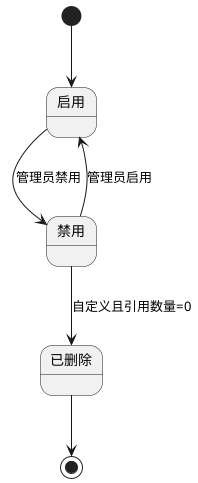

**正向业务流程**

1. 系统初始化装载内置仓库类型与仓位类型。
2. 系统管理员根据业务需要新增自定义类型或调整排序、状态。
3. 仓库管理员在新增仓库、仓位时选择启用状态类型，系统按兼容关系提示可选仓位类型。
4. 导入仓库、仓位数据时，系统按类型名称/编码匹配字典并完成校验。
5. 当自定义类型不再使用时，管理员先禁用，再在引用数量为0时删除。

**异常业务流程**

1. 同一字典类别下名称或编码重复时，阻断保存。
2. 系统内置仓库类型或仓位类型删除请求统一拦截并返回固定提示。
3. 已有关联仓库/仓位的自定义类型删除时，阻断并返回关联记录数量。
4. 仓库类型与仓位类型不兼容时，保存失败并提示允许的兼容类型。
5. 导入文件中引用禁用类型、已删除类型或不存在类型时，失败行返回“类型无效”。

**12）仓库/仓位删除补充规则**

**12.1 删除操作通用交互补充**

1. 本补充规则仅对仓库删除、仓位删除的校验维度、弹窗提示、删除后影响进行细化，不改变本章节原有“删除后归档”的业务逻辑与状态流转规则。
2. 删除入口仍遵循原有按钮显隐规则：仅在用户具备删除权限且仓库/仓位状态满足原有条件时展示或可点击。
3. 用户点击“删除仓库”或“删除仓位”后，前端必须先调用“删除前校验”接口，不允许直接提交删除。
4. 删除前校验接口返回结构至少包含：是否允许删除、命中拦截原因列表、拦截原因编码、拦截原因文案、校验时间。
5. 若存在任一拦截项，系统必须弹出“删除失败提示弹窗”，一次性展示全部命中原因，不得仅提示首条原因。
6. 仅当全部校验通过时，系统才可弹出“二次确认弹窗”；用户点击“确认删除”后，后端必须基于最新数据再次校验，防止并发误删。
7. 删除校验失败、删除成功、删除并发冲突三类场景均必须记录审计日志，日志内容至少包含：操作对象、对象编码、操作人、操作时间、操作终端、校验结果、失败原因或成功结果。

**12.2 仓库删除校验规则**

**删除触发流程**

1. 用户在仓库列表或仓库详情中点击“删除仓库”。
2. 系统执行仓库删除前置校验。
3. 若校验不通过，弹出删除失败提示弹窗，并保留当前页面数据不变。
4. 若校验全部通过，弹出二次确认弹窗。
5. 用户确认后，后端再次执行全量校验；校验通过则按原有逻辑执行删除归档，校验失败则返回最新拦截原因。
6. 删除成功后，刷新仓库列表、仓位列表、详情抽屉、统计卡片与所有相关下拉选择器。

**仓库删除前置校验明细**

| 校验项     | 校验规则                                                      | 不通过时提示文案                                    | 处理方式 |
| ------- | --------------------------------------------------------- | ------------------------------------------- | ---- |
| 仓库库存校验  | 删除仓库前，仓库内所有物料库存数量必须全部为0；校验范围包括仓库下全部仓位、全部批次、全部库存分布记录       | 当前仓库仍存在库存，无法删除。请先将仓库内所有物料库存清零后再操作。          | 阻断删除 |
| 入库单占用校验 | 删除仓库前，不允许存在待审批、未入库、部分入库的入库单引用该仓库；校验需覆盖入库单主表、入库明细、来源联动单据引用 | 当前仓库存在待审批、未入库或部分入库的入库单，无法删除。请先完成相关入库业务后再操作。 | 阻断删除 |
| 出库单占用校验 | 删除仓库前，不允许存在待审批、未出库的出库单引用该仓库；校验需覆盖出库单主表与出库明细引用             | 当前仓库存在待审批或未出库的出库单，无法删除。请先完成相关出库业务后再操作。      | 阻断删除 |
| 盘点单占用校验 | 删除仓库前，不允许存在进行中、未完成的盘点单引用该仓库；包含待完成、待审核、处理中等未闭环状态           | 当前仓库存在进行中或未完成的盘点单，无法删除。请先完成相关盘点业务后再操作。      | 阻断删除 |
| 历史流水校验  | 删除仓库前，不允许存在任何历史入库、出库、库存流水数据；已完成、已归档、已关闭数据同样视为历史流水         | 当前仓库已存在历史入库、出库或库存流水数据，为保证数据完整性与追溯性，不允许删除。   | 阻断删除 |
| 仓位存在性校验 | 删除仓库前，仓库下未创建任何仓位；只要存在任意仓位记录，即不允许删除仓库                      | 当前仓库下仍存在仓位数据，无法删除。请先处理仓位后再操作。               | 阻断删除 |

**仓库删除失败提示弹窗规则**

1. 弹窗标题：`仓库删除失败`
2. 弹窗内容：按命中顺序逐条展示所有不满足的删除条件，每条单独换行展示，不折叠、不截断。
3. 弹窗按钮：仅展示`我知道了`。
4. 若同时命中多条规则，必须一次性返回全部命中原因，减少用户重复操作。
5. 删除失败后，仓库数据、仓位数据、列表分页位置、筛选条件保持不变。

**仓库删除二次确认弹窗规则**

1. 弹窗标题：`确认删除仓库`
2. 弹窗内容第一行固定为：`确认删除该仓库？删除后不可恢复。`
3. 弹窗内容第二行固定为：`系统将再次校验该仓库是否仍满足删除条件。`
4. 弹窗按钮：`取消`、`确认删除`。
5. 用户点击`取消`后关闭弹窗，不执行任何数据变更。
6. 用户点击`确认删除`后按钮进入加载态，直至后端返回最终结果。

**仓库删除成功后的业务约束**

1. 删除成功后，仓库状态仍按原有逻辑进入`已归档`，保持现有状态流转规则不变。
2. 删除成功后，该仓库从默认系统列表中移除；后续新增所有业务单据下拉选择器不再展示该仓库。
3. 删除成功后，该仓库下不再允许新增仓位、编辑仓库、再次删除、状态切换等操作。
4. 仓库删除后数据不可恢复；后续如需复用该仓库，必须重新新建仓库档案。
5. 因删除前已校验无库存、无未闭环单据、无历史流水、无仓位数据，因此不会影响系统数据统计、食安台账生成、食材溯源链路完整性。
6. 删除成功后必须记录成功审计日志；删除失败同样记录失败日志及失败原因。

**仓库删除边界与并发规则**

1. 前端删除前校验通过后至用户点击确认删除前，若仓库新增了库存、单据或仓位，后端二次校验必须阻断删除并返回最新原因。
2. 删除操作必须具备幂等性；重复提交删除请求时，系统不得重复删除或产生多条成功记录。
3. 删除过程中任一校验失败时，不得出现部分删除、部分归档、部分刷新成功的中间态。
4. 若仓库数据已被其他用户删除或归档，当前用户再次删除时返回“当前仓库状态已变更，请刷新后重试”。

**12.3 仓位删除校验规则**

**删除触发流程**

1. 用户在仓位列表或仓位详情中点击“删除仓位”。
2. 系统执行仓位删除前置校验。
3. 若校验不通过，弹出删除失败提示弹窗，并保留当前仓位列表、所属仓库详情与筛选状态不变。
4. 若校验全部通过，弹出二次确认弹窗。
5. 用户确认后，后端再次执行全量校验；校验通过则按原有逻辑执行删除归档，校验失败则返回最新拦截原因。
6. 删除成功后，刷新所属仓库下仓位列表、仓位统计、详情抽屉与相关业务选择器。

**仓位删除前置校验明细**

| 校验项    | 校验规则                                                        | 不通过时提示文案                                  | 处理方式 |
| ------ | ----------------------------------------------------------- | ----------------------------------------- | ---- |
| 仓位库存校验 | 删除仓位前，仓位下所有物料库存数量必须全部为0；校验范围包括该仓位全部批次、全部库存分布记录              | 当前仓位仍存在库存，无法删除。请先将仓位内所有物料库存清零后再操作。        | 阻断删除 |
| 历史流水校验 | 删除仓位前，不允许存在任何入库、出库、盘点业务流水记录；已完成、已归档、已关闭流水同样计入历史流水           | 当前仓位已存在入库、出库或盘点业务流水数据，为保证数据完整性与追溯性，不允许删除。 | 阻断删除 |
| 单据占用校验 | 删除仓位前，不允许存在进行中、未闭环的单据占用；校验范围包括待审批入库、待审批出库、待完成盘点及其他未闭环仓位占用记录 | 当前仓位存在进行中或未闭环的业务单据占用，无法删除。请先完成相关业务后再操作。   | 阻断删除 |

**仓位删除失败提示弹窗规则**

1. 弹窗标题：`仓位删除失败`
2. 弹窗内容：按命中顺序逐条展示所有不满足的删除条件，每条单独换行展示，不折叠、不截断。
3. 弹窗按钮：仅展示`我知道了`。
4. 若同时命中多条规则，必须一次性返回全部命中原因。
5. 删除失败后，所属仓库详情、仓位列表分页位置、筛选条件保持不变。

**仓位删除二次确认弹窗规则**

1. 弹窗标题：`确认删除仓位`
2. 弹窗内容第一行固定为：`确认删除该仓位？删除后不可恢复。`
3. 弹窗内容第二行固定为：`系统将再次校验该仓位是否仍满足删除条件。`
4. 弹窗按钮：`取消`、`确认删除`。
5. 用户点击`取消`后关闭弹窗，不执行任何数据变更。
6. 用户点击`确认删除`后按钮进入加载态，直至后端返回最终结果。

**仓位删除成功后的业务约束**

1. 删除成功后，仓位状态仍按原有逻辑进入`已归档`，保持现有状态流转规则不变。
2. 删除成功后，该仓位从所属仓库默认仓位列表中移除；后续新增业务单据不再可选该仓位。
3. 删除成功后，该仓位不再允许编辑、再次删除、状态切换等操作。
4. 仓位删除后数据不可恢复；后续如需复用该仓位，必须重新创建仓位档案。
5. 因删除前已校验无任何关联业务数据，不影响系统所有数据统计、库存核算、溯源及台账数据。
6. 删除成功后必须记录成功审计日志；删除失败同样记录失败日志及失败原因。

**仓位删除边界与并发规则**

1. 前端删除前校验通过后至用户点击确认删除前，若仓位新增了库存、流水或未闭环单据占用，后端二次校验必须阻断删除并返回最新原因。
2. 删除操作必须具备幂等性；重复提交删除请求时，系统不得重复删除或产生多条成功记录。
3. 删除过程中任一校验失败时，不得出现部分删除、部分归档、部分刷新成功的中间态。
4. 若仓位数据已被其他用户删除或归档，当前用户再次删除时返回“当前仓位状态已变更，请刷新后重试”。

#### 2.3 物料信息管理

**页面路径：** `菜单 → 仓储管理 → 物料信息管理`  
**访问权限：** `仓库管理员、采购专员、系统管理员`  
**页面类型：** `列表页 + 详情抽屉 + 表单弹窗 + 导入弹窗`

**1）模块概述与业务目标**

1. 本模块用于管理物料主数据，支撑采购、入库、出库、盘点、库存预警与食品安全管理。
2. 本模块覆盖物料信息新增、编辑、删除、查询、筛选、分页、导入、导出全流程。
3. 本模块强制维护关键保质期策略字段：存储要求、保质期标准（天）、临期提醒天数、预警期。
4. 本模块提供“AI建议”能力，为临期提醒天数提供可解释、可修改、非强制的建议值。

**2）完整字段定义**

**2.1 物料主信息字段**

| 字段名      | 类型       | 长度    | 是否必填 | 约束规则                                                                                                                 | 默认值  | 示例                                         |
| -------- | -------- | ----- | ---- | -------------------------------------------------------------------------------------------------------------------- | ---- | ------------------------------------------ |
| 物料ID     | UUID     | 36    | 是    | 全局唯一、不可编辑                                                                                                            | 系统生成 | `MAT-79b8f2b4-4e4e-45d8-8b2e-a23d75a648c1` |
| 组织ID     | String   | 36    | 是    | 必须为当前授权组织                                                                                                            | 当前组织 | `ORG-10001`                                |
| 物料编码     | String   | 4-32  | 是    | 同组织唯一；仅允许字母/数字/`-`/`_`                                                                                               | 无    | `WL-VEG-0001`                              |
| 物料名称     | String   | 2-100 | 是    | 同组织下名称+规格组合唯一                                                                                                        | 无    | `菠菜`                                       |
| 物料规格     | String   | 1-100 | 是    | 必填                                                                                                                   | 无    | `10kg/箱`                                   |
| 物料单位     | String   | 1-20  | 是    | 必须为计量单位字典合法值                                                                                                         | `kg` | `kg`                                       |
| 物料类别     | String   | 1-50  | 是    | 必须从“物料类别字典”选择；系统内置：粮油米面类、新鲜蔬菜类、新鲜肉类、水产品类、蛋禽奶制品、调味品干货类、速冻食品类、一次性用品类、清洁消杀类、厨具耗材类、食品添加剂类、其他物资类；支持管理员新增自定义类别；仅允许选择启用状态类别 | 无    | `新鲜蔬菜类`                                    |
| 存储要求     | String   | 1-200 | 是    | 必填；描述存储温湿度/避光等要求                                                                                                     | 无    | `0-4℃冷藏，避光密封`                              |
| 保质期标准（天） | Integer  | 1-5位  | 是    | `>0` 且 `<=3650`                                                                                                      | 无    | `15`                                       |
| 临期提醒天数   | Integer  | 1-5位  | 是    | `>0` 且 `<=保质期标准（天）`                                                                                                  | 无    | `3`                                        |
| 预警期      | Integer  | 1-5位  | 是    | `>临期提醒天数` 且 `<=保质期标准（天）`                                                                                             | 无    | `7`                                        |
| 最低库存     | Decimal  | 18,3  | 是    | `>=0`                                                                                                                | `0`  | `50.000`                                   |
| 最高库存     | Decimal  | 18,3  | 是    | `>=最低库存`                                                                                                             | `0`  | `300.000`                                  |
| 当前库存     | Decimal  | 18,3  | 是    | 系统回写，`>=0`                                                                                                           | 系统计算 | `82.500`                                   |
| 物料库存状态   | Enum     | -     | 是    | 自动判定：正常/库存不足/库存积压/已过期                                                                                                | 系统计算 | `库存不足`                                     |
| 物料状态     | Enum     | -     | 是    | 取值：启用/禁用/已归档                                                                                                         | `启用` | `启用`                                       |
| 备注       | String   | 0-500 | 否    | 长度限制                                                                                                                 | 空    | `仅限当日加工`                                   |
| 创建人      | String   | 2-50  | 是    | 只读                                                                                                                   | 当前用户 | `zhangsan`                                 |
| 创建时间     | DateTime | 19    | 是    | 只读                                                                                                                   | 系统时间 | `2026-03-27 10:11:08`                      |
| 更新人      | String   | 2-50  | 是    | 只读                                                                                                                   | 当前用户 | `lisi`                                     |
| 更新时间     | DateTime | 19    | 是    | 只读                                                                                                                   | 系统时间 | `2026-03-27 15:23:57`                      |

**2.2 AI建议与附件字段**

| 字段名           | 类型          | 长度    | 是否必填 | 约束规则                 | 默认值 | 示例                      |
| ------------- | ----------- | ----- | ---- | -------------------- | --- | ----------------------- |
| AI建议值（临期提醒天数） | Integer     | 1-5位  | 否    | 仅用于建议，不自动覆盖用户输入      | 空   | `4`                     |
| AI建议依据摘要      | String      | 0-500 | 否    | 返回计算依据说明             | 空   | `基于冷藏叶菜类保质期15天，建议4天提醒`  |
| AI置信度         | Decimal     | 5,2   | 否    | `0-100`              | 空   | `87.50`                 |
| 物料图片/附件列表     | Array<File> | 0-20项 | 否    | 支持上传、查看、删除；文件规则见附件规则 | 空数组 | `["菠菜.jpg","检测说明.pdf"]` |

**3）页面结构与交互规则**

**页面结构**

1. 顶部区域：物料类别筛选、物料状态筛选、库存状态筛选、关键字搜索、导入、导出、新增物料。
2. 中部区域：物料列表（支持分页、排序），展示图片、名称、编码、规格、单位、类别、存储要求、保质期标准、阈值字段、库存状态、物料状态。
3. 右侧详情抽屉：物料档案详情（库存范围、保质期策略、AI建议记录、附件信息、操作日志）。
4. 弹窗区域：新增/编辑物料弹窗、AI建议弹层、附件上传弹层、删除确认弹窗、导入弹窗。

**按钮显隐与操作前置条件**

| 按钮   | 可见角色             | 显示条件      | 操作前置条件                 | 执行结果           |
| ---- | ---------------- | --------- | ---------------------- | -------------- |
| 新增物料 | 仓库管理员、采购专员、系统管理员 | 有新增权限     | 无                      | 打开新增表单         |
| 编辑物料 | 仓库管理员、采购专员、系统管理员 | 物料状态≠已归档  | 数据在权限范围内               | 打开编辑表单         |
| 删除物料 | 仓库管理员、系统管理员      | 物料状态∈{禁用} | 当前库存=0且无进行中业务单据        | 删除后归档          |
| 启用   | 仓库管理员、系统管理员      | 物料状态=禁用   | 数据在权限范围内               | 状态切换为启用        |
| 禁用   | 仓库管理员、系统管理员      | 物料状态=启用   | 当前库存=0                 | 状态切换为禁用        |
| AI建议 | 仓库管理员、采购专员、系统管理员 | 编辑/新增弹窗内  | 名称、规格、单位、存储要求、保质期标准已填写 | 返回建议值与依据       |
| 应用建议 | 仓库管理员、采购专员、系统管理员 | 已生成AI建议   | 用户点击确认                 | 将建议值写入“临期提醒天数” |
| 导入物料 | 仓库管理员、采购专员、系统管理员 | 有导入权限     | 模板校验通过                 | 批量创建物料         |
| 导出物料 | 仓库管理员、采购专员、系统管理员 | 有导出权限     | 无                      | 导出当前筛选结果       |
| 上传附件 | 仓库管理员、采购专员、系统管理员 | 编辑/详情页    | 文件校验通过                 | 上传并关联物料        |
| 删除附件 | 仓库管理员、系统管理员      | 附件存在      | 二次确认通过                 | 逻辑删除并留痕        |

**AI建议触发方式与规则**

1. “AI建议”按钮固定显示在“临期提醒天数”字段右侧。
2. 点击“AI建议”后，系统读取：物料名称、规格、单位、存储要求、保质期标准（天）、同类物料保质期范围及食品安全通用标准，计算推荐值。
3. AI建议仅返回参考结果，不自动写入；仅在用户点击“应用建议”时写入字段。
4. 若用户已输入临期提醒天数，AI建议不会自动覆盖用户输入。
5. 用户可在应用后继续手工修改，系统仅做合法性校验，不做强制覆盖。

**表单校验规则**

1. 新增/编辑提交时，存储要求、保质期标准（天）、临期提醒天数、预警期为必填项。
2. 阈值逻辑必须满足：`保质期标准（天）>0`、`0<临期提醒天数<预警期<=保质期标准（天）`。
3. 名称、编码、规格、单位、类别必填且格式合法。

**4）状态定义与状态流转**

**状态定义**

| 状态  | 含义                | 可被新业务单据选择 |
| --- | ----------------- | --------- |
| 启用  | 可正常用于采购、入库、出库等新业务 | 是         |
| 禁用  | 暂停使用，不可用于新业务单据    | 否         |
| 已归档 | 删除归档，仅可查询不可操作     | 否         |

**状态流转图**

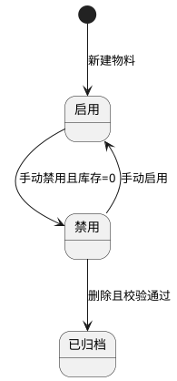

**5）状态联动规则**

| 触发事件 | 联动对象         | 联动规则                 | 禁用规则                    |
| ---- | ------------ | -------------------- | ----------------------- |
| 物料禁用 | 入出库单、采购单据选择器 | 禁用物料不可被新增业务单据选择      | 禁用状态下隐藏“删除前置校验通过前的删除入口” |
| 物料启用 | 入出库单、采购单据选择器 | 启用物料恢复可选             | 已归档状态不可启用               |
| 物料归档 | 列表与详情        | 默认列表不展示归档数据；历史单据保留引用 | 归档后禁用编辑、状态切换、附件上传       |
| 阈值调整 | 库存状态计算与预警    | 实时重算库存状态与预警任务        | 非法阈值不允许保存               |

**6）完整正向业务流程**

1. 用户新增物料并录入基础信息、关键保质期策略字段及库存阈值。
2. 用户可上传物料图片/附件，系统完成校验后保存。
3. 用户可点击“AI建议”获取临期提醒建议，选择“应用建议”后写入字段，或保留手工输入。
4. 提交保存后，系统完成唯一性校验与阈值校验，写入物料数据并生成审计日志。
5. 用户可通过筛选条件查询、分页浏览物料，并查看物料档案详情。
6. 用户可编辑物料信息；当库存为0时可将物料禁用或删除（归档）。
7. 用户可通过导入模板批量新增/更新物料，并可按筛选条件导出物料数据。

**7）完整异常业务流程**

1. 关键字段为空（存储要求、保质期标准、临期提醒天数、预警期）时阻断提交。
2. 物料编码重复或名称+规格重复时阻断保存。
3. 保质期标准<=0、临期提醒天数<=0、预警期<=临期提醒天数、预警期>保质期标准时阻断保存。
4. 字段格式错误（长度超限、非法字符、单位/类别非法）时阻断提交。
5. 当前库存>0时执行禁用或删除操作，系统阻断并提示先清空库存。
6. 存在进行中业务单据（入库/出库/采购）时执行删除，系统阻断并提示关联冲突。
7. 权限不足用户尝试新增/编辑/删除/导入导出/附件删除时返回403。
8. AI建议触发时输入条件缺失，系统提示缺失项并不计算建议。
9. AI建议服务异常时提示“建议暂不可用”，不影响用户手工录入。
10. 导入模板字段缺失、行格式错误、重复编码时导入失败并返回错误行号。
11. 附件类型不支持、大小超限、文件损坏时上传失败并提示原因。
12. 并发编辑导致版本冲突时阻断保存并提示刷新后重试。

**8）唯一性校验、导入导出规则、附件上传规则**

**唯一性校验**

1. 同组织内物料编码唯一。
2. 同组织内物料名称+规格组合唯一。

**导入规则**

1. 支持 `xlsx` 导入，模板字段包括：物料编码、物料名称、规格、单位、类别、存储要求、保质期标准（天）、临期提醒天数、预警期、最低库存、最高库存、状态、备注。
2. 单文件≤10MB；单次导入≤5000行。
3. 支持部分成功；失败行返回“行号+字段+原因”。

**导出规则**

1. 支持按当前筛选条件导出列表字段与档案字段。
2. 导出格式支持 `xlsx/csv`。
3. 导出范围受数据权限控制，越权数据不导出。

**附件上传规则**

1. 支持上传物料图片与文档附件，支持格式：`jpg/jpeg/png/webp/pdf`。
2. 单文件大小≤20MB；单物料最多20个附件。
3. 支持附件预览、下载、删除；删除采用逻辑删除并保留审计记录。

**9）权限控制与数据范围**

| 角色    | 功能权限                                  | 数据范围     |
| ----- | ------------------------------------- | -------- |
| 仓库管理员 | 新增、编辑、禁用/启用、删除（归档）、查询、导入、导出、AI建议、附件管理 | 本组织及授权组织 |
| 采购专员  | 新增、编辑、查询、导入、导出、AI建议、附件上传/查看           | 本组织及授权组织 |
| 系统管理员 | 全量维护与审计查看                             | 全组织范围    |

**权限实现规则**

1. 前端按角色权限动态控制菜单与按钮显隐。
2. 后端接口执行“功能权限+数据权限”双校验，越权统一返回403。
3. 新增、编辑、删除（归档）、状态切换、导入导出、AI建议应用、附件删除等关键操作全量审计留痕。

**10）物料类别字典管理规则**

**系统内置物料类别**

1. 粮油米面类、新鲜蔬菜类、新鲜肉类、水产品类、蛋禽奶制品、调味品干货类、速冻食品类、一次性用品类、清洁消杀类、厨具耗材类、食品添加剂类、其他物资类。
2. 系统支持管理员新增自定义物料类别，满足特殊经营、耗材、半成品场景。
3. 系统内置物料类别不允许删除；自定义物料类别仅在禁用且无物料、供应商商品类别、菜谱食材引用时允许删除。

**字典字段定义**

| 字段名  | 类型      | 长度    | 是否必填 | 约束规则                    | 默认值   | 示例            |
| ---- | ------- | ----- | ---- | ----------------------- | ----- | ------------- |
| 类别ID | UUID    | 36    | 是    | 全局唯一，不可编辑               | 系统生成  | `MATCAT-0001` |
| 类别名称 | String  | 2-50  | 是    | 唯一；系统内置名称不可修改           | 无     | `新鲜蔬菜类`       |
| 类别编码 | String  | 2-50  | 是    | 唯一；系统内置编码不可修改           | 无     | `MAT_VEG`     |
| 类别来源 | Enum    | -     | 是    | 系统内置/自定义                | `自定义` | `系统内置`        |
| 状态   | Enum    | -     | 是    | 启用/禁用                   | `启用`  | `启用`          |
| 排序号  | Integer | 1-5位  | 是    | 0-99999                 | `0`   | `30`          |
| 引用数量 | Integer | 1-8位  | 是    | 自动统计物料、供应商商品类别、菜谱食材引用总数 | `0`   | `26`          |
| 备注   | String  | 0-200 | 否    | 可为空                     | 空     | `用于鲜配蔬菜管理`    |

**交互规则**

1. 物料信息管理列表筛选、物料新增/编辑表单、导入模板均使用“物料类别字典”作为唯一合法来源。
2. 系统管理员可进入“物料类别管理”弹窗，执行新增自定义类别、编辑自定义类别、启用/禁用、排序调整。
3. 系统内置类别仅允许修改排序号、状态、备注；名称与编码只读，不允许删除。
4. 禁用类别不再出现在物料新增/编辑、采购导入、供应商商品类别、菜谱食材映射的新建选择项中；历史记录保留原类别展示。
5. AI建议、库存统计、采购分析等报表统一按当前类别编码聚合；类别名称变更时，历史统计口径按类别编码不变。

**状态定义与状态流转**

| 状态  | 定义             | 可选范围 | 可删除性         |
| --- | -------------- | ---- | ------------ |
| 启用  | 可被物料主数据及联动模块选择 | 可选   | 不允许删除        |
| 禁用  | 不可被新建/编辑/导入选择  | 不可选  | 仅自定义且无引用允许删除 |


**正向业务流程**

1. 系统初始化写入内置物料类别并默认启用。
2. 系统管理员根据经营需要新增自定义物料类别。
3. 仓库管理员、采购专员在物料新增/编辑、导入过程中选择启用状态类别。
4. 类别排序或状态调整后，列表筛选、表单下拉、统计图表同步刷新。
5. 自定义类别停用且无引用后，可执行删除并写入审计日志。

**异常业务流程**

1. 类别名称或编码重复时，阻断保存。
2. 尝试删除系统内置物料类别时，前后端统一拦截。
3. 类别已被物料、供应商商品类别或菜谱食材引用时，删除操作被阻断并返回引用来源。
4. 导入文件引用禁用类别或不存在类别时，对应行导入失败并返回错误原因。
5. 无字典维护权限用户执行新增、编辑、禁用、删除时，返回403并记录审计。

**11）物料删除补充规则**

**11.1 删除操作通用补充说明**

1. 本补充规则仅对物料删除前校验条件、失败提示、二次确认、删除后约束与边界场景进行细化，不改变本章节原有“删除后归档”的业务逻辑、状态定义、状态流转与现有字段规则。
2. 删除入口仍遵循本章节原有按钮显隐规则：仅在用户具备删除权限且物料状态满足原有条件时展示。
3. 用户点击“删除物料”后，前端必须先调用“物料删除前校验”接口，不允许绕过校验直接提交删除。
4. 删除前校验接口至少返回：是否允许删除、命中校验项列表、命中校验项编码、校验时间、统一提示文案。
5. 物料删除校验需同时满足全部条件方可执行删除；任一条件不满足，系统必须禁止删除。
6. 所有校验失败场景统一提示文案为：`该物料已存在库存或业务单据数据，为保证食材溯源完整、库存准确及台账可追溯，不允许删除。`
7. 删除校验失败、删除成功、删除并发冲突三类场景均必须记录审计日志，日志至少包含：物料ID、物料编码、物料名称、操作人、操作时间、操作终端、校验结果、失败原因或成功结果。

**11.2 物料删除触发流程**

1. 用户在物料列表或物料详情中点击“删除物料”。
2. 系统执行物料删除前置校验。
3. 若任一校验不通过，弹出删除失败提示弹窗，展示统一提示文案，并保持当前列表、详情、分页和筛选条件不变。
4. 若全部校验通过，弹出二次确认弹窗。
5. 用户确认后，后端必须基于最新数据再次执行全量校验；校验通过则按原有逻辑执行删除归档，校验失败则返回统一提示文案并终止删除。
6. 删除成功后，系统刷新物料列表、物料详情、物料选择器、相关统计信息与缓存数据。

**11.3 物料删除前置校验明细**

| 校验项      | 校验规则                    | 校验范围说明                                       | 不通过时提示文案                                    | 处理方式 |
| -------- | ----------------------- | -------------------------------------------- | ------------------------------------------- | ---- |
| 全仓库存校验   | 删除物料前，该物料在所有仓库中的库存数量均为0 | 必须覆盖所有仓库、所有仓位、所有批次、所有库存分布记录及实时库存汇总口径         | 该物料已存在库存或业务单据数据，为保证食材溯源完整、库存准确及台账可追溯，不允许删除。 | 阻断删除 |
| 采购计划引用校验 | 删除物料前，该物料从未被采购计划引用      | 必须覆盖草稿、待审核、已审核、已驳回、已关闭、已删除前历史快照等全部采购计划数据     | 该物料已存在库存或业务单据数据，为保证食材溯源完整、库存准确及台账可追溯，不允许删除。 | 阻断删除 |
| 采购订单引用校验 | 删除物料前，该物料从未被采购订单引用      | 必须覆盖待审核、已驳回、待发货、运输中、待入库、已完成、已作废及历史归档订单明细     | 该物料已存在库存或业务单据数据，为保证食材溯源完整、库存准确及台账可追溯，不允许删除。 | 阻断删除 |
| 入库单引用校验  | 删除物料前，该物料从未被入库单引用       | 必须覆盖草稿、待审核、已审核、已入库、已驳回、已归档等全部入库单主明细数据        | 该物料已存在库存或业务单据数据，为保证食材溯源完整、库存准确及台账可追溯，不允许删除。 | 阻断删除 |
| 出库单引用校验  | 删除物料前，该物料从未被出库单引用       | 必须覆盖草稿、待审核、已审核、已出库、已驳回、已归档等全部出库单主明细数据        | 该物料已存在库存或业务单据数据，为保证食材溯源完整、库存准确及台账可追溯，不允许删除。 | 阻断删除 |
| 盘点单引用校验  | 删除物料前，该物料从未被盘点单引用       | 必须覆盖待完成、待审核、已完成、已驳回及历史盘点快照、差异处理记录            | 该物料已存在库存或业务单据数据，为保证食材溯源完整、库存准确及台账可追溯，不允许删除。 | 阻断删除 |
| 库存流水校验   | 删除物料前，该物料不存在任何库存流水记录    | 必须覆盖入库流水、出库流水、盘盈盘亏流水、调拨流水、库存调整流水及历史库存变更记录    | 该物料已存在库存或业务单据数据，为保证食材溯源完整、库存准确及台账可追溯，不允许删除。 | 阻断删除 |
| 菜谱库引用校验  | 删除物料前，该物料从未被菜谱库引用       | 必须覆盖菜谱食材映射、菜谱版本快照、菜谱营养分析关联数据                 | 该物料已存在库存或业务单据数据，为保证食材溯源完整、库存准确及台账可追溯，不允许删除。 | 阻断删除 |
| 菜谱计划引用校验 | 删除物料前，该物料从未被菜谱计划引用      | 必须覆盖草稿、待审核、已通过、已驳回、已生效、已执行计划中的食材快照与计划明细引用    | 该物料已存在库存或业务单据数据，为保证食材溯源完整、库存准确及台账可追溯，不允许删除。 | 阻断删除 |
| 食安台账关联校验 | 删除物料前，该物料无任何食安台账记录关联    | 必须覆盖库存台账、业务台账、监管台账及其他以物料为维度沉淀的合规记录           | 该物料已存在库存或业务单据数据，为保证食材溯源完整、库存准确及台账可追溯，不允许删除。 | 阻断删除 |
| 食材溯源关联校验 | 删除物料前，该物料无任何食材溯源记录关联    | 必须覆盖`trace_batch_id`、证据链编号、采购到入出库到烹饪的物料级追溯链路 | 该物料已存在库存或业务单据数据，为保证食材溯源完整、库存准确及台账可追溯，不允许删除。 | 阻断删除 |
| 食材消耗关联校验 | 删除物料前，该物料无任何食材消耗相关记录关联  | 必须覆盖领用出库消耗快照、烹饪消耗记录、损耗分析、成本消耗分析等物料消耗数据       | 该物料已存在库存或业务单据数据，为保证食材溯源完整、库存准确及台账可追溯，不允许删除。 | 阻断删除 |

**11.4 删除失败提示弹窗规则**

1. 弹窗标题：`物料删除失败`
2. 弹窗正文固定展示统一提示文案：`该物料已存在库存或业务单据数据，为保证食材溯源完整、库存准确及台账可追溯，不允许删除。`
3. 弹窗按钮：仅展示`我知道了`。
4. 若系统需要记录命中校验项明细，明细用于日志与接口返回，不要求在用户弹窗中逐条暴露，前端统一展示上述固定文案即可。
5. 删除失败后，列表分页位置、筛选条件、详情抽屉状态、已录入查询条件均保持不变。

**11.5 删除二次确认弹窗规则**

1. 弹窗标题：`确认删除物料`
2. 弹窗内容第一行固定为：`确认删除该物料？删除后不可恢复。`
3. 弹窗内容第二行固定为：`系统将再次校验该物料是否仍满足删除条件。`
4. 弹窗按钮：`取消`、`确认删除`。
5. 用户点击`取消`后关闭弹窗，不执行任何数据变更。
6. 用户点击`确认删除`后按钮进入加载态，直至后端返回最终结果。

**11.6 物料删除成功后的业务约束**

1. 删除成功后，物料状态仍按原有逻辑进入`已归档`，保持现有状态流转规则不变。
2. 物料信息从系统默认列表中移除，后续所有业务单据下拉选择器不再展示该物料。
3. 删除前已校验无任何业务数据与库存关联，不会造成食材溯源断链、统计异常、脏数据或历史口径错乱问题。
4. 物料删除后数据不可恢复；后续如需复用该物料，必须重新新建物料档案。
5. 删除成功后，不影响系统库存核算、成本统计、食安台账及食材全流程管理相关数据。
6. 删除成功后，该物料不再允许编辑、启用、禁用、再次删除、附件上传等操作。

**11.7 边界场景与并发控制规则**

1. 前端删除前校验通过后至用户点击确认删除前，若该物料新增了库存、被新建业务单据引用、生成了台账/溯源/消耗记录，后端二次校验必须阻断删除。
2. 删除校验必须同时校验实时业务表、历史快照表、台账表、流水表及追溯链表，不能仅校验当前有效单据。
3. 删除操作必须具备幂等性；重复提交删除请求时，系统不得重复删除或产生多条成功记录。
4. 若该物料已被其他用户删除或归档，当前用户再次删除时返回“当前物料状态已变更，请刷新后重试”。
5. 删除过程中任一校验失败时，不得出现部分归档、部分刷新、部分缓存失效的中间态。

#### 2.4 入库管理

**页面路径：** `菜单 → 仓储管理 → 入库管理`  
**访问权限：** `仓库管理员、采购专员、食堂负责人、系统管理员`  
**页面类型：** `列表页 + 详情抽屉 + 表单页 + 审核页 + 导入弹窗`

**1）模块概述与业务目标**

1. 本模块用于管理各类入库业务，覆盖入库单新增、编辑、删除、查询、筛选、分页、导入、导出、审核、反审核、附件管理全流程。
2. 本模块统一管理固定入库类型，并通过来源单据联动实现来源可追溯与数量可控。
3. 本模块支持由采购订单生成入库单，自动带出未入库明细并支持用户增删改，满足分批入库场景。
4. 本模块通过“草稿→待审核→已审核→已入库”状态流转，保障库存变更可审计、可回滚。
5. 本模块在入库明细区域提供“AI 入库建议”能力，基于“保质期临期先出 + 批次优先”策略推荐仓库、仓位与建议分批入库数量，并支持一键应用到当前入库明细。

**2）完整字段定义**

**2.1 入库单主表字段**

| 字段名                   | 类型          | 长度    | 是否必填 | 约束规则                                                                              | 默认值       | 示例                                        |
| --------------------- | ----------- | ----- | ---- | --------------------------------------------------------------------------------- | --------- | ----------------------------------------- |
| 入库单ID                 | UUID        | 36    | 是    | 全局唯一，不可编辑                                                                         | 系统生成      | `IN-4fbc3d11-3f4d-4f2d-a18e-9fce4aa2c001` |
| 入库单号                  | String      | 10-32 | 是    | 全局唯一，格式：`RK-YYYYMMDD-XXXXX`                                                       | 系统生成      | `RK-20260330-00012`                       |
| 入库类型                  | Enum/String | -     | 是    | 从“入库类型字典”选择；系统内置：采购入库、调拨入库、退货入库、退料入库、盘盈入库、赠品/捐赠入库、其他入库；支持管理员新增自定义入库类型；仅允许选择启用状态类型 | 无         | `采购入库`                                    |
| 来源单据                  | Enum        | -     | 是    | 根据入库类型自动映射来源单据类型，不可手输非法值                                                          | 无         | `采购订单`                                    |
| 来源单号                  | String      | 1-64  | 是    | 只能从联动下拉选择合法来源单号                                                                   | 无         | `CGD-20260328-00008`                      |
| 追溯批次号(trace_batch_id) | String      | 1-64  | 是    | 采购入库默认继承来源订单追溯批次；其他入库类型需在过账前生成；缺失不得提交审核/过账                                        | 来源带出/系统生成 | `TB-20260328-00008`                       |
| 证据链编号                 | String      | 1-64  | 是    | 与来源单据、收货附件、入库附件、库存批次台账统一关联                                                        | 来源带出/系统生成 | `EVC-20260328-00008`                      |
| 供应商ID                 | String      | 36    | 否    | 采购入库、赠品/捐赠入库可必填；其余按业务规则                                                           | 空         | `SUP-10086`                               |
| 供应商名称                 | String      | 1-100 | 否    | 来源单据联动带出，可手工选择时须在供应商主数据中存在                                                        | 空         | `晨光农副产品有限公司`                              |
| 入库组织ID                | String      | 36    | 是    | 必须在当前用户数据权限范围内                                                                    | 当前组织      | `ORG-10001`                               |
| 入库日期                  | Date        | 10    | 是    | 不得晚于当前系统日期+1天                                                                     | 当前日期      | `2026-03-30`                              |
| 状态                    | Enum        | -     | 是    | 草稿/待审核/已审核/已入库                                                                    | `草稿`      | `待审核`                                     |
| 审核意见                  | String      | 0-500 | 否    | 审核通过/驳回时记录；驳回时必填                                                                  | 空         | `数量与来源单据一致，同意入库`                          |
| 驳回原因                  | String      | 0-500 | 否    | 审核驳回时必填                                                                           | 空         | `仓位信息缺失`                                  |
| 反审核原因                 | String      | 0-500 | 否    | 反审核时必填                                                                            | 空         | `单据录入错误，需重提`                              |
| 入库总数量                 | Decimal     | 18,3  | 是    | 自动汇总，`>=0`                                                                        | `0.000`   | `126.500`                                 |
| 入库总金额                 | Decimal     | 18,2  | 是    | 自动汇总，`>=0`                                                                        | `0.00`    | `3850.75`                                 |
| AI建议批次ID              | String      | 1-64  | 否    | 最近一次 AI 建议批次标识；未生成时为空                                                             | 空         | `AISUG-20260330-00012`                    |
| AI建议状态                | Enum        | -     | 是    | 未生成/已生成未应用/部分已应用/已全部应用                                                            | `未生成`     | `已生成未应用`                                  |
| AI建议更新时间              | DateTime    | 19    | 否    | AI 建议生成或应用成功后自动刷新                                                                 | 空         | `2026-03-30 11:08:45`                     |
| 备注                    | String      | 0-500 | 否    | 长度限制                                                                              | 空         | `分两批到货，本单为第一批`                            |
| 版本号                   | Integer     | 10    | 是    | 乐观锁版本，更新时+1                                                                       | `1`       | `3`                                       |
| 创建人                   | String      | 2-50  | 是    | 只读                                                                                | 当前用户      | `zhangsan`                                |
| 创建时间                  | DateTime    | 19    | 是    | 只读                                                                                | 系统时间      | `2026-03-30 09:18:27`                     |
| 更新人                   | String      | 2-50  | 是    | 只读                                                                                | 当前用户      | `lisi`                                    |
| 更新时间                  | DateTime    | 19    | 是    | 只读                                                                                | 系统时间      | `2026-03-30 10:32:11`                     |

**2.2 入库单明细字段**

| 字段名       | 类型      | 长度    | 是否必填 | 约束规则                    | 默认值     | 示例                                         |
| --------- | ------- | ----- | ---- | ----------------------- | ------- | ------------------------------------------ |
| 明细ID      | UUID    | 36    | 是    | 全局唯一                    | 系统生成    | `IND-2d7c85e8-42ac-4f14-8c73-b16cd64f8701` |
| 入库单ID     | UUID    | 36    | 是    | 必须关联有效入库单               | 无       | `IN-4fbc3d11-3f4d-4f2d-a18e-9fce4aa2c001`  |
| 来源明细ID    | String  | 36    | 否    | 来源单据带出时必填               | 空       | `POI-000123`                               |
| 物料ID      | String  | 36    | 是    | 必须存在于物料主数据且状态=启用        | 无       | `MAT-000321`                               |
| 物料名称      | String  | 1-100 | 是    | 由物料ID带出                 | 无       | `大米`                                       |
| 规格ID      | String  | 36    | 是    | 必须属于所选物料                | 无       | `SPEC-10KG`                                |
| 规格        | String  | 1-100 | 是    | 由规格ID带出                 | 无       | `10kg/袋`                                   |
| 单位        | String  | 1-20  | 是    | 选择规格后自动带出，默认只读          | 自动带出    | `袋`                                        |
| 来源剩余可入库数量 | Decimal | 18,3  | 否    | 来源单据场景自动带出，`>=0`        | `0.000` | `32.000`                                   |
| 本次入库数量    | Decimal | 18,3  | 是    | `>0`；有来源时`<=来源剩余可入库数量`  | 无       | `20.000`                                   |
| 入库仓库ID    | String  | 36    | 是    | 必须在用户数据权限范围内            | 无       | `WH-001`                                   |
| 入库仓位ID    | String  | 36    | 是    | 必须属于所选仓库且在权限范围内         | 无       | `LOC-A-01-03`                              |
| 批次号       | String  | 1-50  | 否    | 可选；同单内重复规则受唯一性校验限制      | 空       | `BATCH-20260329-01`                        |
| 生产日期      | Date    | 10    | 否    | 不得晚于入库日期                | 空       | `2026-03-25`                               |
| 保质期（天）    | Integer | 1-5位  | 否    | `>0` 且 `<=3650`         | 空       | `180`                                      |
| 到期日期      | Date    | 10    | 否    | `生产日期 + 保质期`自动计算        | 空       | `2026-09-21`                               |
| 单价        | Decimal | 18,2  | 否    | `>=0`；采购入库建议必填          | `0.00`  | `120.50`                                   |
| 小计        | Decimal | 18,2  | 是    | `本次入库数量 * 单价`自动计算       | `0.00`  | `2410.00`                                  |
| 建议仓库ID    | String  | 36    | 否    | AI 建议生成字段，仅用于建议展示与应用    | 空       | `WH-001`                                   |
| 建议仓位ID    | String  | 36    | 否    | 必须属于建议仓库                | 空       | `LOC-A-01-03`                              |
| 建议分批序号    | Integer | 1-5位  | 否    | 同一明细建议分批从1递增            | 空       | `1`                                        |
| 建议入库数量    | Decimal | 18,3  | 否    | `>0`；同明细建议分批数量合计=本次入库数量 | 空       | `12.000`                                   |
| 建议策略标签    | Enum    | -     | 否    | FEFO优先/批次优先/容量均衡        | 空       | `FEFO优先`                                   |
| 是否应用AI建议  | Boolean | -     | 是    | AI 建议应用后置为`true`        | `false` | `true`                                     |
| 行备注       | String  | 0-200 | 否    | 长度限制                    | 空       | `外包装轻微破损已拍照`                               |

**2.3 附件字段**

| 字段名      | 类型       | 长度    | 是否必填 | 约束规则       | 默认值  | 示例                                          |
| -------- | -------- | ----- | ---- | ---------- | ---- | ------------------------------------------- |
| 附件ID     | UUID     | 36    | 是    | 全局唯一       | 系统生成 | `ATT-9f14d6f8-3b71-4a27-a5c2-d1a2d3c0a001`  |
| 业务ID     | UUID     | 36    | 是    | 关联入库单ID    | 无    | `IN-4fbc3d11-3f4d-4f2d-a18e-9fce4aa2c001`   |
| 附件类型     | Enum     | -     | 是    | 图片/视频/文档   | 无    | `视频`                                        |
| 文件名      | String   | 1-200 | 是    | 原文件名保留     | 无    | `arrival-check.mp4`                         |
| 文件格式     | String   | 1-20  | 是    | 受白名单控制     | 无    | `mp4`                                       |
| 文件大小(KB) | Integer  | 1-10位 | 是    | 不得超过对应类型上限 | 无    | `15360`                                     |
| 文件地址     | String   | 1-500 | 是    | 受签名访问控制    | 无    | `/upload/inbound/2026/03/arrival-check.mp4` |
| 上传人      | String   | 2-50  | 是    | 只读         | 当前用户 | `wangwu`                                    |
| 上传时间     | DateTime | 19    | 是    | 只读         | 系统时间 | `2026-03-30 10:15:02`                       |

**2.4 AI 入库建议结果字段**

| 字段名    | 类型       | 长度    | 是否必填 | 约束规则                    | 默认值    | 示例                                          |
| ------ | -------- | ----- | ---- | ----------------------- | ------ | ------------------------------------------- |
| 建议ID   | UUID     | 36    | 是    | 全局唯一                    | 系统生成   | `AISR-0d5b5d73-0e95-4f7e-a84a-ec8f00340111` |
| 建议批次ID | String   | 1-64  | 是    | 同一次点击 AI 建议生成同一批次号      | 无      | `AISUG-20260330-00012`                      |
| 入库单ID  | UUID     | 36    | 是    | 关联入库单主表                 | 无      | `IN-4fbc3d11-3f4d-4f2d-a18e-9fce4aa2c001`   |
| 明细ID   | UUID     | 36    | 是    | 关联入库单明细                 | 无      | `IND-2d7c85e8-42ac-4f14-8c73-b16cd64f8701`  |
| 物料ID   | String   | 36    | 是    | 与明细物料一致                 | 无      | `MAT-000321`                                |
| 规格ID   | String   | 36    | 是    | 与明细规格一致                 | 无      | `SPEC-10KG`                                 |
| 供应商ID  | String   | 36    | 否    | 存在供应商信息时回传，用于增强建议精度     | 空      | `SUP-10086`                                 |
| 推荐仓库ID | String   | 36    | 是    | 必须在用户数据权限内且满足存储要求       | 无      | `WH-001`                                    |
| 推荐仓位ID | String   | 36    | 是    | 必须归属推荐仓库且仓位可用           | 无      | `LOC-A-01-03`                               |
| 推荐分批数量 | Decimal  | 18,3  | 是    | `>0`；同明细推荐分批数量合计=本次入库数量 | 无      | `8.000`                                     |
| 推荐原因   | String   | 1-500 | 是    | 说明命中规则与排序依据             | 无      | `仓位余量充足且临期先出动线优先`                           |
| 建议置信度  | Decimal  | 5,2   | 否    | 范围`0-100`，仅展示           | 空      | `86.50`                                     |
| 生成状态   | Enum     | -     | 是    | 生成成功/生成失败/部分成功          | `生成成功` | `部分成功`                                      |
| 生成时间   | DateTime | 19    | 是    | 只读                      | 系统时间   | `2026-03-30 11:08:45`                       |

**3）页面结构与交互规则**

**页面结构**

1. 顶部区域：入库单号、入库类型、来源单据、来源单号、状态、日期区间筛选；新增、导入、导出按钮。
2. 中部区域：入库单列表，展示入库单号、类型、来源单据、来源单号、供应商、总数量、入库日期、状态、创建人、操作。
3. 详情抽屉：主信息、来源信息、明细、附件、审核记录、反审核记录、操作日志。
4. 表单区域：主信息表单 + 明细可编辑表格（含 AI 入库建议工具栏）+ 附件上传区 + 提交审核操作区。

**按钮显隐与操作前置条件**

| 按钮         | 可见角色                   | 显示条件          | 操作前置条件                                | 执行结果                |
| ---------- | ---------------------- | ------------- | ------------------------------------- | ------------------- |
| 新增入库单      | 仓库管理员、采购专员、系统管理员       | 有新增权限         | 无                                     | 新建草稿单               |
| 编辑         | 仓库管理员、采购专员、系统管理员       | 状态=草稿         | 数据在权限范围内                              | 打开编辑表单              |
| 删除         | 仓库管理员、系统管理员            | 状态=草稿         | 数据在权限范围内                              | 删除草稿单               |
| 提交审核       | 仓库管理员、采购专员、系统管理员       | 状态=草稿         | 主信息与明细校验通过                            | 状态变更为待审核            |
| 撤回         | 提交人、系统管理员              | 状态=待审核        | 当前用户有撤回权限                             | 状态回到草稿              |
| 审核通过       | 食堂负责人、系统管理员            | 状态=待审核        | 审核意见符合规则                              | 状态变更为已审核            |
| 审核驳回       | 食堂负责人、系统管理员            | 状态=待审核        | 驳回原因必填                                | 状态回到草稿              |
| 执行入库       | 仓库管理员、系统管理员            | 状态=已审核        | 过账前校验通过                               | 库存过账并变更为已入库         |
| 反审核        | 食堂负责人、系统管理员            | 状态∈{已审核, 已入库} | 反审核前置校验通过且反审核原因必填                     | 回滚并恢复为草稿            |
| 导入         | 仓库管理员、采购专员、系统管理员       | 有导入权限         | 模板校验通过                                | 批量导入                |
| 导出         | 仓库管理员、采购专员、食堂负责人、系统管理员 | 有导出权限         | 无                                     | 导出当前筛选数据            |
| 上传附件       | 仓库管理员、采购专员、系统管理员       | 状态∈{草稿, 待审核}  | 文件校验通过                                | 附件上传成功              |
| 删除附件       | 仓库管理员、系统管理员            | 状态∈{草稿, 待审核}  | 二次确认通过                                | 逻辑删除附件              |
| AI 入库建议    | 仓库管理员、采购专员、系统管理员       | 状态=草稿         | 明细至少1行；每行物料、规格、本次入库数量齐全；采购/赠品场景需供应商信息 | 生成 AI 建议结果批次        |
| 一键应用 AI 建议 | 仓库管理员、采购专员、系统管理员       | 状态=草稿且已生成建议   | 建议结果存在且未过期；版本号未冲突                     | 将建议仓库、仓位、分批数量写入当前明细 |

**AI 建议交互位置、触发方式与结果展示**

1. `AI 入库建议`按钮位于入库明细表格右上工具栏，紧邻“新增明细”按钮。
2. 点击按钮后进入加载状态：按钮禁用并显示`生成中...`，明细区域显示骨架屏；超时30秒提示“建议生成超时，请重试”。
3. 生成完成后在明细下方展示“AI 建议结果区”，按物料维度展示推荐仓库、推荐仓位、建议分批数量、推荐原因、置信度、是否可应用。
4. 当建议存在冲突（仓位无权限、容量不足、仓位已禁用）时，该行标记为“不可应用”并展示具体原因。
5. 用户点击“一键应用 AI 建议”后，系统仅对“可应用”建议行执行填充，应用结果以成功/失败计数反馈。
6. AI 建议默认不覆盖用户手工输入；仅在用户明确点击“一键应用 AI 建议”后执行覆盖写入。

**联动刷新规则**

1. 修改入库类型时，系统立即清空并刷新【来源单据】【来源单号】及自动带出明细。
2. 选择来源单号后，自动带出来源主信息、供应商信息、未入库明细与剩余可入库数量。
3. 明细选择物料后，仅展示该物料合法规格；选择规格后自动带出单位并默认只读。
4. 选择入库仓库后，仓位下拉仅展示该仓库下且用户有权限的仓位。
5. 修改本次入库数量、单价后，系统实时重算小计、总数量、总金额并执行上限校验。
6. 审核通过/反审核后，自动刷新来源单据累计入库量与剩余可入库量。
7. 点击`AI 入库建议`时，系统先执行明细完整性校验，通过后调用 AI 建议服务并生成建议批次。
8. AI 建议生成后，若用户修改了物料、规格、数量、供应商任一关键字段，当前建议批次自动置失效并提示“请重新生成建议”。
9. 点击“一键应用 AI 建议”后，系统自动回填推荐仓库、推荐仓位、建议分批数量并重算汇总字段。
10. 应用后若用户再次手工改动仓库、仓位、数量，对应行`是否应用AI建议`保留`true`并记录“手工覆写”审计日志。

**表单校验规则**

1. 主信息必填：入库类型、来源单据、来源单号、入库组织、入库日期。
2. 明细必填：物料、规格、单位、入库仓库、入库仓位、本次入库数量。
3. 数值规则：本次入库数量>0；金额≥0；精度按数量3位小数、金额2位小数。
4. 来源单据场景中，本次入库数量不得超过来源剩余可入库数量。
5. 已审核/已入库状态禁止编辑和删除；仅允许查看与反审核（满足前置校验）。
6. AI 建议生成前，明细关键字段缺失时阻断并提示缺失字段；采购入库与赠品/捐赠入库场景缺少供应商信息时不允许生成建议。
7. AI 建议应用时，建议分批数量合计必须等于目标明细本次入库数量，且每条建议仓位必须通过仓库归属、容量与权限校验。

**入库、出库批次统一管理业务规则（新增）**

1. 本规则为本章节增量新增规则，仅补充入库、出库批次统一管理要求；本章节原有入库业务逻辑、状态流转、删除规则、统计卡片、成本计算规则全部保持不变。
2. 系统全局内置固定【默认批次】，为系统内置固定项，不可编辑、不可删除、不可修改名称，全平台所有物料通用。
3. 入库单据批次号为非必填项：
   （1）操作人员手动填写批次号时，本次入库物料归属对应自定义独立批次；
   （2）入库未填写批次号、批次为空时，系统后端在形成有效入库结果时自动统一赋值为【默认批次】，所有无批次入库数据自动归集至该物料默认批次库存池。
4. 同一物料多次未填写批次入库时，在平台既有仓储管理、库存核算、状态流转规则不变前提下，库存自动合并累加至同一默认批次下统一核算、统一管理，不额外生成其他匿名批次或临时批次。
5. 入库单据审核生效后，批次信息锁定。单据进入`已审核`及以上状态后，不支持事后修改、补录、更换批次；已归档入库单据保持原批次记录不变。
6. 为保证入库、出库批次口径一致，出库环节强约束：批次选择为必填项，出库必须选择具体批次（自定义业务批次 / 系统默认批次），禁止空批次出库、无批次出库。
7. 多批次库存隔离管控：自定义批次与默认批次库存相互独立、分开核算、互不占用；出库仅校验当前选中批次的剩余可用库存，超出批次库存数量系统自动拦截并弹出明确提示，禁止超额出库。
8. 成本与台账统一规则：默认批次、自定义批次统一沿用平台既定移动加权平均成本核算规则，同步生成库存流水、盘点数据、食安台账及溯源记录，全流程数据可追溯。
9. 前端录入层不要求在批次号为空时预先写死【默认批次】文本；是否落入默认批次以系统后端入库生效时的统一赋值结果为准，确保前后端口径一致、审计可追溯。

**4）状态定义与状态流转**

**状态定义**

| 状态  | 含义                  | 可编辑性               |
| --- | ------------------- | ------------------ |
| 草稿  | 已保存未提交审核            | 可编辑、可删除            |
| 待审核 | 已提交待审核              | 不可编辑，可撤回           |
| 已审核 | 审核通过待过账             | 不可编辑，可执行入库、可反审核    |
| 已入库 | 已完成库存过账（列表可映射“已完成”） | 不可编辑，不可删除，可反审核（受限） |

**状态流转图**

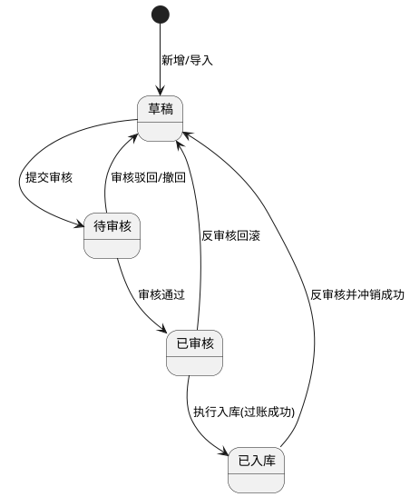

**5）状态联动规则**

| 触发状态  | 联动对象  | 联动规则                       |
| ----- | ----- | -------------------------- |
| 草稿    | 按钮与字段 | 显示编辑、删除、提交审核、上传附件；字段可编辑    |
| 待审核   | 按钮与字段 | 隐藏编辑、删除；显示审核通过/驳回、撤回；字段只读  |
| 已审核   | 按钮与字段 | 隐藏编辑、删除；显示执行入库、反审核；字段只读    |
| 已入库   | 按钮与字段 | 隐藏编辑、删除、上传附件；显示反审核（满足前置校验） |
| 反审核成功 | 单据与来源 | 单据回到草稿；库存与来源累计入库量回滚；恢复可编辑  |

**AI 状态联动补充**

1. 单据状态=草稿时允许生成与应用 AI 建议；状态进入待审核及以上后，AI 建议按钮隐藏且结果只读。
2. `AI建议状态`由系统自动维护：首次生成后置为“已生成未应用”；部分应用置为“部分已应用”；全部建议行应用成功后置为“已全部应用”。
3. 单据关键字段（物料、规格、数量、供应商）变化时，`AI建议状态`自动回退为“未生成”，并清空旧建议批次ID。

**6）来源单据联动规则（固定入库类型）**

| 入库类型    | 来源单据     | 来源单号可选范围                | 自动带出             |
| ------- | -------- | ----------------------- | ---------------- |
| 采购入库    | 采购订单     | 状态为未全部入库且剩余可入库数量>0的采购订单 | 供应商、未入库明细、剩余可入库量 |
| 调拨入库    | 调拨出库单    | 状态为未入库的调拨出库单            | 调出组织、明细、剩余可入库量   |
| 退货入库    | 退货单      | 状态为已审批且未完成入库的退货单        | 关联物料明细、可入库量      |
| 退料入库    | 退料单      | 状态为已审批且未完成入库的退料单        | 关联物料明细、可入库量      |
| 盘盈入库    | 盘点盘盈单    | 状态为盘盈已审核且未生成入库的盘盈单      | 盘盈明细、可入库量        |
| 赠品/捐赠入库 | 赠品/捐赠接收单 | 状态为已确认且未入库的接收单          | 供应方信息、接收明细       |
| 其他入库    | 其他入库申请单  | 状态为已审批且未入库的申请单          | 申请明细、可入库量        |

**7）AI 入库建议规则**

**7.1 触发条件与输入数据**

1. 触发入口：入库单新增/编辑页面明细区域`AI 入库建议`按钮。
2. 输入字段：物料名称、规格、本次入库数量、供应商信息（供应商ID/名称）。
3. 增强输入：当前组织仓库与仓位可用容量、物料存储要求、批次属性、历史入库与出库周转数据。

**7.2 推荐策略与计算逻辑**

1. 策略一：保质期临期先出（FEFO）  
   系统优先推荐可支撑临期先出拣选路径的仓库/仓位，确保后续出库按临期批次优先流转。
2. 策略二：批次优先  
   同批次物料优先建议集中入同仓位；容量不足时按“同仓库相邻仓位”进行分批拆分并给出建议分批数量。
3. 计算步骤：  
   第一步，过滤符合存储要求与权限范围的候选仓位；  
   第二步，按 FEFO 适配度、批次连续性、仓位可用容量进行评分排序；  
   第三步，输出每条明细的推荐仓库、推荐仓位、建议分批数量与推荐原因。
4. 输出原则：建议仅供参考，生成阶段不改写单据数据。

**7.3 一键应用规则**

1. 点击“一键应用 AI 建议”后，系统按建议结果回填当前明细的仓库、仓位、数量（分批场景自动拆分/更新明细行）。
2. 应用时执行二次校验：权限、仓位归属、可用容量、来源剩余可入库数量、版本号一致性。
3. 应用成功后更新`AI建议状态`与`是否应用AI建议`，并记录“生成建议/应用建议”审计日志。

**8）由采购订单生成入库单规则**

1. 支持在采购订单页发起“生成入库单”，或在入库单新增页选择“采购入库+来源单号”。
2. 生成后系统自动带出该采购订单未入库明细及剩余可入库数量。
3. 用户可对自动带出明细进行新增、删除、修改，满足业务补录需求。
4. 每条明细必须填写本次入库数量、入库仓库、入库仓位。
5. 任一明细本次入库数量超过来源剩余可入库数量时，阻断保存与提交审核。
6. 同一采购订单支持分批入库，系统按明细维度累计回写已入库与剩余待入库数量。

**9）完整正向业务流程**

1. 用户进入入库管理列表页，通过筛选查询目标数据。
2. 用户点击“新增入库单”，填写主信息并选择固定入库类型。
3. 用户选择来源单据与来源单号，系统自动带出可入库明细。
4. 用户在明细区域点击`AI 入库建议`，系统基于明细关键字段生成仓库、仓位与分批数量建议。
5. 用户查看“AI 建议结果区”，确认后点击“一键应用 AI 建议”将建议写入当前明细。
6. 用户可继续手工调整明细（新增、删除、修改）并上传验收附件（照片、视频、文档）。
7. 系统执行主信息、明细、数量上限、权限与数据范围校验。
8. 校验通过后保存草稿，用户可继续编辑或提交审核。
9. 提交审核后状态变更为待审核，进入审核流程。
10. 审核通过后状态变更为已审核，执行库存过账。
11. 过账成功后状态变更为已入库，并回写来源单据入库进度。
12. 如发现单据错误且满足条件，可执行反审核，完成库存与来源回滚后恢复草稿。

**10）完整异常业务流程**

1. 入库数量超出来源剩余可入库数量时，阻断保存/提交并提示“超出可入库上限”。
2. 已审核/已入库状态尝试编辑或删除时，阻断并提示状态不允许。
3. 反审核前置校验失败（存在下游出库占用、库存不足以冲销、状态不匹配）时，阻断反审核。
4. 物料/规格/单位/仓库/仓位为空时，阻断保存并定位到错误字段。
5. 物料已禁用、规格不属于物料、仓位不属于仓库、仓库仓位无权限时，阻断提交。
6. 来源单号已全部入库或状态变更为不可用时，阻断保存并提示刷新来源。
7. 重复提交导致重复入库时，系统按幂等键与版本号拦截并提示“请勿重复提交”。
8. 并发操作导致剩余可入库数量变化时，后端二次校验失败并返回最新可入库量。
9. 导入模板缺失字段、格式错误、数量非法、来源单号不存在时，整行失败并返回错误明细。
10. 附件上传格式非法、大小超限、文件损坏时上传失败并给出明确原因。
11. 审核/反审核权限不足时返回403并记录审计日志。
12. 库存过账失败时整单事务回滚，状态保持已审核并支持重试过账。
13. 明细缺少物料、规格、数量或（采购/赠品场景）供应商信息时，阻断 AI 建议生成并逐行提示缺失字段。
14. 可用仓位数据不足、仓位容量不足或规则冲突导致无法生成建议时，返回“无法生成建议”并给出原因。
15. AI 服务超时、接口异常或返回数据格式不合法时，生成失败并允许重试，不影响手工录单流程。
16. 一键应用时若检测到版本号冲突、仓位状态变化或权限变化，阻断应用并提示刷新后重试。
17. 建议分批数量合计与本次入库数量不一致时，阻断应用并高亮冲突行。

**11）唯一性校验、关联关系、导入导出规则、附件上传规则**

**唯一性校验**

1. 入库单号全局唯一。
2. 同一入库单内，`来源明细ID + 物料ID + 规格ID + 入库仓库ID + 入库仓位ID + 批次号`不可重复。
3. 同一`AI建议批次ID + 明细ID + 建议分批序号`唯一，防止重复应用。

**关联关系规则**

1. 入库单与来源单据为多对一关系，支持同一来源单据分批生成多张入库单。
2. 入库单明细与来源单据明细按`来源明细ID`建立映射，回写累计入库数量与剩余可入库数量。
3. 已入库明细产生库存流水、批次库存记录与审计日志记录。
4. AI 建议结果与入库单明细一对多关联，应用记录保留审计追踪，不参与库存过账。
5. 入库过账成功后，系统必须生成库存批次台账，并将 `trace_batch_id`、批次号、仓库仓位、来源单据、供应商、保质期、证据链编号一次性固化，不得覆盖历史批次记录。
6. 采购入库、赠品/捐赠入库等存在来源证据的场景，入库附件、验收结果、库存批次台账与采购订单必须共享同一证据链编号，支持监管一键回溯。

**导入规则**

1. 支持 `xlsx` 模板导入，模板包含主信息与明细信息。
2. 单文件≤10MB，单次导入≤5000行明细。
3. 导入仅允许生成草稿单据；导入后仍需人工提交审核。
4. 支持部分成功，失败数据返回“行号+字段+错误原因”。
5. 导入不支持直接导入 AI 建议结果字段，系统统一按当前单据数据实时生成。

**导出规则**

1. 支持按当前筛选条件导出入库单列表及明细。
2. 导出格式支持 `xlsx/csv`。
3. 导出数据受数据权限控制，越权数据不得导出。
4. 明细导出可选包含`AI建议状态`、`是否应用AI建议`字段。

**附件上传规则**

1. 支持格式：`jpg/jpeg/png/webp/mp4/mov/pdf/doc/docx/xls/xlsx`。
2. 单文件大小限制：图片≤20MB，视频≤200MB，文档≤50MB；单据最多30个附件。
3. 已审核/已入库状态默认仅允许查看与下载，禁止新增或删除附件。

**12）权限控制与数据范围**

| 角色    | 功能权限                                        | 数据范围     |
| ----- | ------------------------------------------- | -------- |
| 仓库管理员 | 新增、编辑、删除、查询、提交审核、执行入库、导入、导出、附件管理、AI 建议生成/应用 | 本组织及授权组织 |
| 采购专员  | 新增、编辑、查询、提交审核、导入、导出、附件上传/查看、AI 建议生成/应用      | 本组织及授权组织 |
| 食堂负责人 | 查询、审核通过/驳回、反审核、导出、附件查看、AI 建议结果查看            | 本组织及授权组织 |
| 系统管理员 | 全量权限（含跨组织维护与审计查看）                           | 全组织范围    |

**权限实现规则**

1. 前端按功能权限控制菜单与按钮显隐。
2. 后端接口执行“功能权限+数据权限+状态权限”三重校验，越权统一返回403。
3. 新增、编辑、删除、提交审核、审核、反审核、导入导出、附件操作、AI 建议生成/应用全量审计留痕。

**13）入库类型字典管理规则**

**系统内置入库类型**

1. 采购入库、调拨入库、退货入库、退料入库、盘盈入库、赠品/捐赠入库、其他入库。
2. 系统支持管理员新增自定义入库类型，用于覆盖特殊业务场景。
3. 系统内置入库类型不允许删除；自定义入库类型仅在禁用且无入库单引用时允许删除。

**字典字段定义**

| 字段名    | 类型      | 长度    | 是否必填 | 约束规则            | 默认值   | 示例             |
| ------ | ------- | ----- | ---- | --------------- | ----- | -------------- |
| 类型ID   | UUID    | 36    | 是    | 全局唯一，不可编辑       | 系统生成  | `INSTYPE-0001` |
| 类型名称   | String  | 2-50  | 是    | 唯一；系统内置名称不可修改   | 无     | `采购入库`         |
| 类型编码   | String  | 2-50  | 是    | 唯一；系统内置编码不可修改   | 无     | `IN_PURCHASE`  |
| 类型来源   | Enum    | -     | 是    | 系统内置/自定义        | `自定义` | `系统内置`         |
| 状态     | Enum    | -     | 是    | 启用/禁用           | `启用`  | `启用`           |
| 排序号    | Integer | 1-5位  | 是    | 0-99999         | `0`   | `10`           |
| 来源单据要求 | String  | 0-200 | 否    | 描述该类型是否强制关联来源单据 | 空     | `采购入库必须关联采购订单` |
| 引用数量   | Integer | 1-8位  | 是    | 自动统计入库单引用数      | `0`   | `124`          |

**交互规则**

1. 入库管理新增/编辑表单、筛选区、导入模板统一引用“入库类型字典”。
2. 系统管理员可在入库管理页进入“入库类型管理”弹窗，新增自定义类型、编辑自定义类型、启用/禁用、调整排序。
3. 系统内置类型仅允许修改排序号、状态、来源单据要求说明；名称与编码只读，不允许删除。
4. 禁用类型不再出现在新增、编辑、导入选择项中；历史入库单详情保留原类型展示。
5. 不同入库类型对应的来源单据、供应商、库存校验规则继续按业务规则执行，字典管理仅控制可选范围与展示顺序。

**状态定义与状态流转**

| 状态  | 定义                | 业务联动     | 可删除性         |
| --- | ----------------- | -------- | ------------ |
| 启用  | 可被新增、编辑、导入、筛选使用   | 正常参与业务   | 不允许删除        |
| 禁用  | 不可用于新单据和导入，历史单据保留 | 仅历史展示与查询 | 仅自定义且无引用允许删除 |


**正向业务流程**

1. 系统初始化写入内置入库类型并默认启用。
2. 系统管理员按业务需要新增自定义入库类型并设置排序。
3. 仓库管理员、采购专员在新建入库单时选择启用状态类型，系统按类型联动来源单据规则。
4. 管理员调整类型状态后，表单下拉、筛选器、导入校验规则同步刷新。
5. 自定义入库类型停用且引用数量为0后，可执行删除。

**异常业务流程**

1. 类型名称或编码重复时，阻断保存。
2. 系统内置入库类型删除请求统一拦截并提示“系统内置类型不允许删除”。
3. 自定义入库类型已被入库单引用时，删除操作被阻断并返回关联单据数量。
4. 导入文件、旧表单提交禁用类型时，后端返回“入库类型不可用”并要求刷新。
5. 无字典维护权限用户新增、编辑、禁用、删除类型时，返回403并记录审计。

**14）入库单删除补充规则与顶部统计卡片规则**

**14.1 补充说明**

1. 本补充规则仅新增入库单删除校验规则、删除失败提示文案、删除后业务约束、顶部统计卡片指标与统计逻辑，不改变本章节原有字段定义、页面结构正文、单据状态流转、审核流程、执行入库流程与反审核流程。
2. 删除入口仍遵循本章节原有按钮显隐规则：仅在用户具备删除权限且单据满足原有状态条件时展示。
3. 入库管理顶部统计卡片为页面数据概览补充能力，统计口径与本章节现有入库单状态定义保持一致，不新增或改写任何单据状态。

**14.2 入库单删除触发与处理流程**

1. 用户在入库管理列表或详情中点击“删除”。
2. 系统先执行入库单删除前置校验。
3. 若任一校验不通过，立即弹出删除失败提示弹窗，终止删除。
4. 若全部校验通过，系统执行删除；删除成功后移除该草稿单据并刷新列表、详情与统计卡片。
5. 删除动作仅针对草稿单据，删除后不保留恢复入口，不支持回收站恢复。
6. 删除提交到服务端时，后端必须基于最新数据再次执行全量校验，防止并发误删。

**14.3 入库单删除前置校验明细**

| 校验项              | 校验规则                      | 校验范围说明                                              | 不通过时提示文案                                  | 处理方式 |
| ---------------- | ------------------------- | --------------------------------------------------- | ----------------------------------------- | ---- |
| 草稿状态校验           | 删除入库单前，单据当前仅允许为草稿状态       | 必须校验主单最新状态，不允许使用前端缓存状态作为唯一依据                        | 该入库单已提交审批或已完成入库生成库存数据，为保证溯源完整与库存准确，不允许删除。 | 阻断删除 |
| 审批流转记录校验         | 单据未提交审批，无任何审批流转记录         | 必须覆盖提交审核、审核通过、审核驳回、撤回、审批节点流转、审批操作日志等全部审批轨迹          | 该入库单已提交审批或已完成入库生成库存数据，为保证溯源完整与库存准确，不允许删除。 | 阻断删除 |
| 入库执行与库存变动校验      | 单据未完成入库操作，未生成库存、未造成库存数量变动 | 必须覆盖入库执行记录、库存批次记录、库存余额变更、库存占用变更、过账任务记录              | 该入库单已提交审批或已完成入库生成库存数据，为保证溯源完整与库存准确，不允许删除。 | 阻断删除 |
| 后续业务关联校验         | 单据无关联出库单、盘点单等后续业务单据       | 必须覆盖直接关联、明细级关联、来源链关联及其他基于该入库单生成的后续业务数据              | 该入库单已提交审批或已完成入库生成库存数据，为保证溯源完整与库存准确，不允许删除。 | 阻断删除 |
| 库存流水、食安台账、食材溯源校验 | 单据无库存流水、食安台账、食材溯源相关记录生成   | 必须覆盖库存流水表、库存批次台账、食安台账、`trace_batch_id`追溯链、证据链编号关联记录 | 该入库单已提交审批或已完成入库生成库存数据，为保证溯源完整与库存准确，不允许删除。 | 阻断删除 |

**14.4 删除失败提示弹窗规则**

1. 弹窗标题：`入库单删除失败`
2. 弹窗正文固定展示统一提示文案：`该入库单已提交审批或已完成入库生成库存数据，为保证溯源完整与库存准确，不允许删除。`
3. 弹窗按钮：仅展示`我知道了`。
4. 删除失败后，列表分页位置、筛选条件、详情抽屉状态保持不变。
5. 若后端需要记录具体命中校验项，详细命中结果用于接口返回与审计日志，不要求在用户弹窗中逐条展开。

**14.5 入库单删除成功后的业务约束**

1. 草稿入库单删除后单据信息直接清除，系统列表不再展示。
2. 删除前已校验未产生库存变动、业务关联及台账数据，不影响库存核算、数据统计。
3. 单据删除后不可恢复；后续如需使用，必须重新新建入库单。
4. 删除后不存在溯源断链、数据异常风险。
5. 删除成功后必须记录审计日志；删除失败同样记录失败日志及失败原因。

**14.6 删除边界场景与并发控制规则**

1. 前端删除前校验通过后至用户提交删除请求前，若单据状态由草稿变更为待审核、已审核或已入库，后端必须阻断删除。
2. 若在删除过程中新增了审批流转记录、库存批次记录、库存流水记录、后续业务关联记录，后端必须按最新数据阻断删除。
3. 删除操作必须具备幂等性；重复提交删除请求时，系统不得重复删除或产生多条成功记录。
4. 若当前单据已被其他用户删除，系统返回“当前单据不存在或已删除，请刷新后重试”。
5. 删除过程中任一校验失败时，不得出现部分删除、列表已删除但详情仍可见、统计未刷新等中间态。

**14.7 顶部统计卡片指标补充**

1. 在不改动本章节现有页面结构正文的前提下，入库管理列表页顶部补充展示4项核心统计卡片：
   `本月入库总单数`、`本月待审批单数`、`本月已审批单数`、`本月入库金额`
2. 卡片默认展示位置位于列表页顶部筛选区域下方、数据列表上方。
3. 卡片统计结果受当前用户数据权限、组织范围及顶部通用筛选条件影响，不受分页影响。
4. 卡片时间窗口固定为当前自然月；用户点击卡片时，列表自动切换到与卡片一致的当前自然月筛选口径。

**14.8 顶部统计卡片指标定义与统计逻辑**

| 卡片名称    | 统计逻辑                         | 统计口径说明                                                   | 展示格式            |
| ------- | ---------------------------- | -------------------------------------------------------- | --------------- |
| 本月入库总单数 | 统计当前自然月内所有入库单据总数             | 统计范围覆盖草稿、待审核、已审核、已入库全部状态；按当前数据权限、组织范围、顶部通用筛选条件统计         | 整数，不足1显示`0`     |
| 本月待审批单数 | 统计当前自然月内状态为`待审核`的入库单数量       | 卡片名称保持“待审批”展示口径，但底层状态映射使用本章节原有状态`待审核`                    | 整数，不足1显示`0`     |
| 本月已审批单数 | 统计当前自然月内状态为`已审核`、`已入库`的入库单数量 | 卡片名称保持“已审批”展示口径，但底层状态映射使用本章节原有状态`已审核`、`已入库`              | 整数，不足1显示`0`     |
| 本月入库金额  | 统计当前自然月内所有`已入库`单据金额合计        | 计算公式：`本月入库金额 = Σ（物料入库数量 × 物料采购单价）`；仅`已入库`单据参与统计，结果保留2位小数 | 金额格式，默认显示`0.00` |

**14.9 顶部统计卡片交互规则**

1. 点击`本月入库总单数`卡片，列表自动筛选为当前自然月内全部入库单据，不追加状态过滤条件。
2. 点击`本月待审批单数`卡片，列表自动筛选为当前自然月且状态=`待审核`的入库单据。
3. 点击`本月已审批单数`卡片，列表自动筛选为当前自然月且状态∈{`已审核`,`已入库`}的入库单据。
4. 点击`本月入库金额`卡片，列表自动筛选为当前自然月且状态=`已入库`的入库单据，并按入库金额降序展示。
5. 统计卡片与列表筛选口径必须保持一致；当用户切换顶部通用筛选条件后，卡片数值同步重算。
6. 卡片统计仅展示当前用户有权访问的数据，禁止跨组织、跨权限范围汇总越权数据。
7. 当卡片统计结果为0时，卡片仍正常展示，不隐藏、不置灰。

**15）仓位面积自动计算与容量校验补充规则**

**15.1 补充说明**

1. 本补充规则仅新增基于`物料类别统一面积系数（㎡/单件）`的仓位面积换算、容量校验、占用面积更新与兜底规则，不改动本章节既有字段定义、单据状态流转、审核流程、执行入库流程、删除规则、AI建议规则与统计卡片规则。
2. 本补充规则所需面积系数统一取自`系统管理-字典分类维护`中`物料类别`维护的固定面积系数口径。
3. 同一物料大类下所有物料统一复用所属类别固定面积系数，不支持在入库单明细环节手工修改面积系数。

**15.2 补充计算字段**

| 字段名              | 类型      | 长度   | 是否必填 | 约束规则                         | 默认值      | 示例        |
| ---------------- | ------- | ---- | ---- | ---------------------------- | -------- | --------- |
| 物料类别统一面积系数（㎡/单件） | Decimal | 18,4 | 否    | 由物料所属物料类别自动匹配；只读             | 自动带出     | `0.2500`  |
| 本次入库预计占用面积（㎡）    | Decimal | 18,4 | 是    | `本次入库数量 × 物料类别统一面积系数`自动计算；只读 | `0.0000` | `5.0000`  |
| 仓位当前已占用总面积（㎡）    | Decimal | 18,4 | 是    | 取当前仓位实时累计占用面积；只读             | 系统计算     | `28.5000` |
| 入库后仓位总占用面积（㎡）    | Decimal | 18,4 | 是    | `仓位当前已占用总面积 + 本次入库预计占用面积`；只读 | 系统计算     | `33.5000` |
| 仓位总容量（㎡）         | Decimal | 18,4 | 是    | 取当前仓位容量管控口径；只读               | 仓位档案带出   | `40.0000` |
| 面积校验结果           | Enum    | -    | 是    | 通过/超限/免校验                    | 系统计算     | `通过`      |

**15.3 入库占用面积自动计算规则**

1. 用户提交入库单时，系统自动根据物料所属`物料类别`匹配对应大类统一面积系数。
2. 自动计算公式：
   `本次入库预计占用面积 = 本次入库数量 × 物料类别统一面积系数`
3. 自动计算公式：
   `入库后仓位总占用面积 = 仓位当前已占用总面积 + 本次入库预计占用面积`
4. 同一张入库单存在多条明细落入同一仓位时，系统按明细逐行计算后进行同仓位汇总，再以汇总结果作为该仓位最终校验口径。
5. AI入库建议一键应用后的仓库、仓位与分批明细，在提交审核及后续既有生效动作前，仍需按本补充规则执行后端二次面积校验。

**15.4 仓位容量校验约束**

1. 若`入库后仓位总占用面积 <= 仓位总容量`，则校验通过，允许单据继续按本章节既有流程提交审核并进入后续生效环节。
2. 若`入库后仓位总占用面积 > 仓位总容量`，系统必须强制拦截提交，并弹出标准化提示弹窗：
   `当前选择仓位空间容量不足，本次入库后将超出仓位最大面积上限，请减少入库数量或更换其他仓位`
3. 平台不提供强制超容入库权限；前端与后端均必须按同一口径执行超容拦截，禁止通过隐藏权限、异常接口调用或重复提交绕过校验。
4. 提交审核至服务端落库前，若其他并发单据已改变同一仓位最新占用面积，后端必须按最新仓位数据重新计算并校验，校验失败时仍返回本节统一拦截文案。

**15.5 占用面积自动更新规则**

1. 入库单完成本章节既有有效入库生效动作后，系统自动按已生效明细累计更新对应仓位`当前已占用总面积`。
2. 单条入库明细的面积增量计算公式为：
   `面积增量 = 实际生效入库数量 × 物料类别统一面积系数`
3. 出库、盘点、报废等仓储业务单据完成各自既有生效动作后，系统自动按同一面积系数口径扣减或调整仓位已占用面积，保证仓位容量数据实时准确。
4. 若本章节既有反审核、回滚或冲销流程被触发，仓位已占用面积必须按原生效数量和原面积系数同步回滚，确保面积数据与库存数据保持一致。
5. 面积更新必须与库存生效、库存流水、批次台账写入保持同事务边界，禁止出现库存已生效但仓位面积未更新、或面积已更新但库存未生效的中间态。

**15.6 历史存量数据回溯核算规则**

1. 启用本补充规则后，系统需按“当前库存余额 + 物料所属类别统一面积系数 + 当前所在仓位”口径，对历史存量数据进行仓位维度统一回溯核算，生成仓位初始`当前已占用总面积`。
2. 回溯核算结果作为后续入库、出库、盘点、报废面积增减的统一基线，确保仓位容量数据闭环一致。
3. 若后续历史物料补齐了所属物料类别及其统一面积系数，系统需支持按最新匹配关系重新纳入回溯核算范围。

**15.7 特殊兜底规则**

1. 若物料未归属任何物料类别，或虽已归属物料类别但无匹配统一面积系数时，系统自动跳过该明细仓位面积校验，不拦截入库操作。
2. 无系数场景下，系统需对用户展示统一温馨提示：
   `当前物料未配置物料类别统一面积系数，本次暂不执行仓位面积校验，可继续提交入库；请尽快在系统管理-字典分类维护中补齐配置。`
3. 命中兜底规则的明细，面积校验结果统一标记为`免校验`；本次单据不触发超容拦截。
4. 上述免校验数据在后续补齐物料类别与统一面积系数后，统一纳入本节既有历史存量回溯核算口径。

#### 2.5 出库管理

**页面路径：** `菜单 → 仓储管理 → 出库管理`  
**访问权限：** `仓库管理员、后厨主管、食堂负责人、系统管理员`  
**页面类型：** `列表页 + 详情抽屉 + 表单页 + 审核页 + 导入弹窗`

**1）模块概述与业务目标**

1. 本模块用于管理领用、销售、调拨、报废等各类出库业务，覆盖出库单新增、编辑、删除、查询、筛选、分页、导入、导出。
2. 本模块提供审核、反审核能力，形成“草稿→待审核→已审核→已出库”闭环，并支持反审核回滚。
3. 本模块支持附件上传，满足出库现场照片、视频、审批材料等留档要求。
4. 本模块通过物料-规格-单位联动、仓库-仓位级联与库存校验，保障出库数据合法性与库存准确性。
5. 本模块在出库明细区域提供“AI 出库建议”能力，基于“保质期临期先出 + 批次优先”策略推荐出库仓库、出库仓位、批次号及各批次建议出库数量，并支持一键应用。

**2）完整字段定义**

**2.1 出库单主表字段**

| 字段名                   | 类型          | 长度    | 是否必填 | 约束规则                                                                                   | 默认值     | 示例                                         |
| --------------------- | ----------- | ----- | ---- | -------------------------------------------------------------------------------------- | ------- | ------------------------------------------ |
| 出库单ID                 | UUID        | 36    | 是    | 全局唯一，不可编辑                                                                              | 系统生成    | `OUT-8e6f4ef3-5f2d-4dc5-a357-0b9a91cd1001` |
| 出库单号                  | String      | 10-32 | 是    | 全局唯一，格式：`CK-YYYYMMDD-XXXXX`                                                            | 系统生成    | `CK-20260330-00026`                        |
| 出库类型                  | Enum/String | -     | 是    | 从“出库类型字典”选择；系统内置：领用出库、销售出库、退货出库、调拨出库、盘亏出库、赠送/捐赠出库、报废出库、其他出库；支持管理员新增自定义出库类型；仅允许选择启用状态类型 | 无       | `领用出库`                                     |
| 出库组织ID                | String      | 36    | 是    | 必须在当前用户数据权限范围内                                                                         | 当前组织    | `ORG-10001`                                |
| 出库组织名称                | String      | 1-100 | 是    | 由组织ID带出                                                                                | 自动带出    | `第一食堂`                                     |
| 出库日期                  | Date        | 10    | 是    | 不得晚于当前系统日期+1天                                                                          | 当前日期    | `2026-03-30`                               |
| 用途                    | String      | 1-200 | 是    | 必填；说明业务用途                                                                              | 无       | `午餐领用`                                     |
| 来源业务类型                | Enum        | -     | 否    | 出库类型=领用出库时可选；取值：菜谱计划/烹饪任务/留样任务/销样任务/其他                                                 | 空       | `烹饪任务`                                     |
| 来源业务ID                | String      | 36    | 否    | 来源业务类型非空时必填；必须存在于对应业务表且在同组织权限范围内                                                       | 空       | `CKT-4fd3e2b1-7cb9-4b2d-a2fd-97d17db10001` |
| 追溯批次号(trace_batch_id) | String      | 1-64  | 是    | 领用/销售/报废等正式出库必须绑定可追溯批次；缺失不得审核通过或执行出库                                                   | 来源批次带出  | `TB-20260328-00008`                        |
| 证据链编号                 | String      | 1-64  | 是    | 与库存批次台账、附件、下游烹饪/留样/销样证据统一关联                                                            | 系统继承/生成 | `EVC-20260328-00008`                       |
| 领用回写状态                | Enum        | -     | 是    | 未回写/已回写/回写失败；仅领用出库场景启用                                                                 | `未回写`   | `已回写`                                      |
| 状态                    | Enum        | -     | 是    | 草稿/待审核/已审核/已出库                                                                         | `草稿`    | `待审核`                                      |
| 审核意见                  | String      | 0-500 | 否    | 审核通过可填；驳回时必填驳回原因                                                                       | 空       | `库存充足，同意出库`                                |
| 驳回原因                  | String      | 0-500 | 否    | 审核驳回时必填                                                                                | 空       | `出库仓位缺失`                                   |
| 反审核原因                 | String      | 0-500 | 否    | 反审核时必填                                                                                 | 空       | `数量录入错误，需重提`                               |
| 出库总数量                 | Decimal     | 18,3  | 是    | 自动汇总，`>0`                                                                              | `0.000` | `58.500`                                   |
| 出库总金额                 | Decimal     | 18,2  | 是    | 自动汇总，`>=0`                                                                             | `0.00`  | `2360.40`                                  |
| AI建议批次ID              | String      | 1-64  | 否    | 最近一次 AI 建议批次标识；未生成时为空                                                                  | 空       | `AIOUT-20260330-00007`                     |
| AI建议状态                | Enum        | -     | 是    | 未生成/已生成未应用/部分已应用/已全部应用                                                                 | `未生成`   | `已生成未应用`                                   |
| AI建议更新时间              | DateTime    | 19    | 否    | AI 建议生成或应用成功后自动刷新                                                                      | 空       | `2026-03-30 13:12:08`                      |
| 备注                    | String      | 0-500 | 否    | 长度限制                                                                                   | 空       | `冷链配送，优先先进先出`                              |
| 版本号                   | Integer     | 10    | 是    | 乐观锁版本，更新时+1                                                                            | `1`     | `3`                                        |
| 创建人                   | String      | 2-50  | 是    | 只读                                                                                     | 当前用户    | `zhangsan`                                 |
| 创建时间                  | DateTime    | 19    | 是    | 只读                                                                                     | 系统时间    | `2026-03-30 09:30:25`                      |
| 更新人                   | String      | 2-50  | 是    | 只读                                                                                     | 当前用户    | `lisi`                                     |
| 更新时间                  | DateTime    | 19    | 是    | 只读                                                                                     | 系统时间    | `2026-03-30 11:42:06`                      |

**2.2 出库单明细字段**

| 字段名      | 类型      | 长度    | 是否必填 | 约束规则                              | 默认值     | 示例                                         |
| -------- | ------- | ----- | ---- | --------------------------------- | ------- | ------------------------------------------ |
| 明细ID     | UUID    | 36    | 是    | 全局唯一                              | 系统生成    | `OD-35fd0b58-9de3-4b2b-8d7e-7f1f7d218001`  |
| 出库单ID    | UUID    | 36    | 是    | 必须关联有效出库单                         | 无       | `OUT-8e6f4ef3-5f2d-4dc5-a357-0b9a91cd1001` |
| 物料ID     | String  | 36    | 是    | 必须来自物料基础资料，且状态=启用                 | 无       | `MAT-000123`                               |
| 物料名称     | String  | 1-100 | 是    | 由物料ID带出                           | 自动带出    | `鸡蛋`                                       |
| 规格ID     | String  | 36    | 是    | 必须属于所选物料                          | 无       | `SPEC-30枚/箱`                               |
| 规格       | String  | 1-100 | 是    | 由规格ID带出                           | 自动带出    | `30枚/箱`                                    |
| 默认单位     | String  | 1-20  | 是    | 选择规格后自动带出，默认只读                    | 自动带出    | `箱`                                        |
| 出库仓库ID   | String  | 36    | 是    | 必须在用户数据权限范围内                      | 无       | `WH-001`                                   |
| 出库仓位ID   | String  | 36    | 是    | 必须归属所选仓库且在权限范围内                   | 无       | `LOC-B-02-01`                              |
| 批次号      | String  | 1-50  | 否    | 可选；开启批次管理时必填                      | 空       | `BATCH-20260320-03`                        |
| 库存批次台账ID | String  | 1-64  | 否    | 启用批次管理、领用出库、报废出库等场景必填；必须与批次号、仓位一致 | 空       | `LOT-20260320-03`                          |
| 当前可用库存   | Decimal | 18,3  | 是    | 系统实时带出，`>=0`                      | 自动带出    | `120.000`                                  |
| 本次出库数量   | Decimal | 18,3  | 是    | `>0` 且 `<=当前可用库存`                 | 无       | `18.000`                                   |
| 单价       | Decimal | 18,2  | 否    | `>=0`                             | `0.00`  | `28.50`                                    |
| 小计       | Decimal | 18,2  | 是    | 自动计算=`数量*单价`                      | `0.00`  | `513.00`                                   |
| 建议出库仓库ID | String  | 36    | 否    | AI 建议结果字段，仅用于展示与应用                | 空       | `WH-001`                                   |
| 建议出库仓位ID | String  | 36    | 否    | 必须归属建议仓库                          | 空       | `LOC-B-02-01`                              |
| 建议批次号    | String  | 1-50  | 否    | 来自 AI 推荐批次                        | 空       | `BATCH-20260320-03`                        |
| 建议批次序号   | Integer | 1-5位  | 否    | 同一明细建议分批从1递增                      | 空       | `1`                                        |
| 建议出库数量   | Decimal | 18,3  | 否    | `>0`；同明细建议分批数量合计=本次出库数量           | 空       | `8.000`                                    |
| 建议策略标签   | Enum    | -     | 否    | FEFO优先/批次优先/库存均衡                  | 空       | `FEFO优先`                                   |
| 是否应用AI建议 | Boolean | -     | 是    | AI 建议应用后置为`true`                  | `false` | `true`                                     |
| 行用途      | String  | 0-200 | 否    | 可选，默认继承主表用途                       | 继承主表    | `早餐备餐`                                     |
| 行备注      | String  | 0-200 | 否    | 长度限制                              | 空       | `优先消耗临期批次`                                 |

**2.3 附件字段**

| 字段名      | 类型       | 长度    | 是否必填 | 约束规则     | 默认值  | 示例                                               |
| -------- | -------- | ----- | ---- | -------- | ---- | ------------------------------------------------ |
| 附件ID     | UUID     | 36    | 是    | 全局唯一     | 系统生成 | `ATT-4d4a2f17-59e7-44f8-b8fc-1ab221ce3001`       |
| 业务ID     | UUID     | 36    | 是    | 关联出库单ID  | 无    | `OUT-8e6f4ef3-5f2d-4dc5-a357-0b9a91cd1001`       |
| 附件类型     | Enum     | -     | 是    | 图片/视频/文档 | 无    | `图片`                                             |
| 文件名      | String   | 1-200 | 是    | 原文件名保留   | 无    | `outbound-photo-01.jpg`                          |
| 文件格式     | String   | 1-20  | 是    | 白名单控制    | 无    | `jpg`                                            |
| 文件大小(KB) | Integer  | 1-10位 | 是    | 不得超过类型上限 | 无    | `2048`                                           |
| 文件地址     | String   | 1-500 | 是    | 签名地址访问   | 无    | `/upload/outbound/2026/03/outbound-photo-01.jpg` |
| 上传人      | String   | 2-50  | 是    | 只读       | 当前用户 | `wangwu`                                         |
| 上传时间     | DateTime | 19    | 是    | 只读       | 系统时间 | `2026-03-30 10:06:15`                            |

**2.4 AI 出库建议结果字段**

| 字段名      | 类型       | 长度    | 是否必填 | 约束规则                    | 默认值    | 示例                                          |
| -------- | -------- | ----- | ---- | ----------------------- | ------ | ------------------------------------------- |
| 建议ID     | UUID     | 36    | 是    | 全局唯一                    | 系统生成   | `AOSR-14d8d122-5c6e-4b65-bd65-732126f70101` |
| 建议批次ID   | String   | 1-64  | 是    | 同一次点击 AI 建议生成同一批次号      | 无      | `AIOUT-20260330-00007`                      |
| 出库单ID    | UUID     | 36    | 是    | 关联出库单主表                 | 无      | `OUT-8e6f4ef3-5f2d-4dc5-a357-0b9a91cd1001`  |
| 明细ID     | UUID     | 36    | 是    | 关联出库单明细                 | 无      | `OD-35fd0b58-9de3-4b2b-8d7e-7f1f7d218001`   |
| 物料ID     | String   | 36    | 是    | 与明细物料一致                 | 无      | `MAT-000123`                                |
| 规格ID     | String   | 36    | 是    | 与明细规格一致                 | 无      | `SPEC-30枚/箱`                                |
| 推荐出库仓库ID | String   | 36    | 是    | 必须在用户数据权限范围内            | 无      | `WH-001`                                    |
| 推荐出库仓位ID | String   | 36    | 是    | 必须归属推荐仓库且仓位可用           | 无      | `LOC-B-02-01`                               |
| 推荐批次号    | String   | 1-50  | 是    | 批次需存在且可出库               | 无      | `BATCH-20260320-03`                         |
| 推荐出库数量   | Decimal  | 18,3  | 是    | `>0`；同明细推荐分批数量合计=本次出库数量 | 无      | `8.000`                                     |
| 推荐原因     | String   | 1-500 | 是    | 说明 FEFO 与批次优先命中依据       | 无      | `临期剩余2天，优先消耗该批次`                            |
| 建议置信度    | Decimal  | 5,2   | 否    | 范围`0-100`，仅展示           | 空      | `88.40`                                     |
| 生成状态     | Enum     | -     | 是    | 生成成功/生成失败/部分成功          | `生成成功` | `部分成功`                                      |
| 生成时间     | DateTime | 19    | 是    | 只读                      | 系统时间   | `2026-03-30 13:12:08`                       |

**3）页面结构与交互规则**

**页面结构**

1. 顶部区域：出库单号、出库类型、状态、出库组织、日期区间筛选；新增、导入、导出按钮。
2. 中部区域：出库单列表，展示单号、类型、组织、总数量、日期、状态、创建人、操作。
3. 详情抽屉：主信息、明细、附件、审核记录、反审核记录、库存流水。
4. 表单区域：主信息表单 + 明细可编辑表格（含 AI 出库建议工具栏）+ 附件区 + 审核操作区。

**按钮显隐与操作前置条件**

| 按钮         | 可见角色                   | 显示条件         | 操作前置条件                  | 执行结果             |
| ---------- | ---------------------- | ------------ | ----------------------- | ---------------- |
| 新增出库单      | 仓库管理员、后厨主管、系统管理员       | 有新增权限        | 无                       | 新建草稿             |
| 编辑         | 仓库管理员、后厨主管、系统管理员       | 状态=草稿        | 数据在权限范围内                | 打开编辑页            |
| 删除         | 仓库管理员、系统管理员            | 状态=草稿        | 数据在权限范围内                | 删除草稿             |
| 提交审核       | 仓库管理员、后厨主管、系统管理员       | 状态=草稿        | 表单校验通过                  | 状态=待审核           |
| 撤回         | 提交人、系统管理员              | 状态=待审核       | 有撤回权限                   | 状态=草稿            |
| 审核通过       | 食堂负责人、系统管理员            | 状态=待审核       | 审核权限通过                  | 状态=已审核           |
| 审核驳回       | 食堂负责人、系统管理员            | 状态=待审核       | 驳回原因必填                  | 状态=草稿            |
| 执行出库       | 仓库管理员、系统管理员            | 状态=已审核       | 库存校验通过                  | 状态=已出库并扣减库存      |
| 反审核        | 食堂负责人、系统管理员            | 状态∈{已审核,已出库} | 反审核前置校验通过               | 回滚为草稿            |
| AI 出库建议    | 仓库管理员、后厨主管、系统管理员       | 状态=草稿        | 明细至少1行；每行物料、规格、本次出库数量齐全 | 生成 AI 建议结果批次     |
| 一键应用 AI 建议 | 仓库管理员、后厨主管、系统管理员       | 状态=草稿且已生成建议  | 建议结果存在且未过期；版本号未冲突       | 回填仓库、仓位、批次号、出库数量 |
| 上传附件       | 仓库管理员、后厨主管、系统管理员       | 状态∈{草稿,待审核}  | 文件校验通过                  | 上传成功             |
| 删除附件       | 仓库管理员、系统管理员            | 状态∈{草稿,待审核}  | 二次确认通过                  | 逻辑删除             |
| 导入         | 仓库管理员、后厨主管、系统管理员       | 有导入权限        | 模板校验通过                  | 批量导入草稿           |
| 导出         | 仓库管理员、后厨主管、食堂负责人、系统管理员 | 有导出权限        | 无                       | 导出结果             |

**AI 建议交互位置、触发方式、加载状态、结果展示**

1. `AI 出库建议`按钮位于出库明细表格右上角工具栏，紧邻“新增明细”按钮。
2. 点击后按钮进入禁用态并显示`生成中...`；明细区域展示骨架屏与进度提示，超时30秒提示“建议生成超时，请重试”。
3. 结果区位于明细表格下方，按“明细行→建议分批行”结构展示：推荐仓库、推荐仓位、推荐批次号、建议出库数量、推荐原因、置信度、可应用状态。
4. 不可应用建议需标注具体原因（库存不足、批次失效、仓位禁用、无权限）。
5. 点击“一键应用 AI 建议”后，系统仅对“可应用”建议行回填；若存在多批次建议，自动拆分明细行并保持数量合计一致。
6. AI 建议默认不覆盖用户输入；仅在用户确认点击“一键应用 AI 建议”后执行写入。

**级联联动规则**

1. 选择物料后，规格下拉仅展示该物料可用规格。
2. 选择规格后自动带出默认单位，默认不可手工修改。
3. 选择出库仓库后，仓位下拉仅展示该仓库下可用仓位。
4. 切换仓库时自动清空原仓位并触发仓位重载。
5. 明细数量变更后实时刷新小计、总数量、总金额。
6. 录入明细时实时读取当前可用库存，提交与执行出库时再次后端校验。
7. 点击`AI 出库建议`前先执行明细完整性校验，不通过则逐行提示并阻断请求。
8. AI 建议生成后，若用户修改物料、规格、出库数量，当前建议批次自动失效并提示“请重新生成建议”。
9. 一键应用后自动回填仓库、仓位、批次号、数量并重算汇总字段。
10. 应用后用户仍可手工调整，系统记录“手工覆写 AI 建议”审计日志。
11. 出库类型=领用出库且已选择来源业务时，页面展示来源业务编号、来源状态、关联菜品/任务摘要作为只读参考信息。
12. 领用出库执行成功后，若来源业务为菜谱计划或烹饪任务，系统自动回写来源业务备料状态；回写失败时标记`领用回写状态=回写失败`并触发异常告警。
13. 已存在来源业务且来源业务已开始执行、已归档或已锁定时，禁止对出库单执行反审核。

**表单校验规则**

1. 主表必填：出库类型、出库组织、出库日期、用途。
2. 明细必填：物料、规格、默认单位、出库仓库、出库仓位、本次出库数量。
3. 数值校验：出库数量>0，且不得超过当前可用库存；金额≥0。
4. 级联校验：仓位必须归属已选仓库；规格必须归属已选物料。
5. 状态校验：已审核、已出库状态禁止编辑与删除。
6. AI 建议生成校验：每行必须具备物料、规格、出库数量，且出库数量为正数。
7. AI 建议应用校验：各明细建议分批数量合计必须等于目标出库数量；建议仓位需通过归属、权限与库存可用性校验。

**入库、出库批次统一管理业务规则（新增）**

1. 本规则为本章节增量新增规则，仅补充入库、出库批次统一管理要求；本章节原有出库业务逻辑、状态流转、删除规则、统计卡片、成本计算规则全部保持不变。
2. 系统全局内置固定【默认批次】，为系统内置固定项，不可编辑、不可删除、不可修改名称，全平台所有物料通用。
3. 入库单据批次号为非必填项：
   （1）操作人员手动填写批次号时，本次入库物料归属对应自定义独立批次；
   （2）入库未填写批次号、批次为空时，系统后端在形成有效入库结果时自动统一赋值为【默认批次】，所有无批次入库数据自动归集至该物料默认批次库存池。
4. 同一物料多次未填写批次入库时，在平台既有仓储管理、库存核算、状态流转规则不变前提下，库存自动合并累加至同一默认批次下统一核算、统一管理，不额外生成其他匿名批次或临时批次。
5. 入库单据审核生效后，批次信息锁定。单据进入`已审核`及以上状态后，不支持事后修改、补录、更换批次；已归档入库单据保持原批次记录不变。
6. 出库环节强约束：平台批次统一管理在本期默认开启，批次选择为必填项，出库必须选择具体批次（自定义业务批次 / 系统默认批次），禁止空批次出库、无批次出库；涉及出库批次字段的前后端实现与验收均以本规则为准。
7. 多批次库存隔离管控：自定义批次与默认批次库存相互独立、分开核算、互不占用；出库仅校验当前选中批次的剩余可用库存，系统不得跨批次自动挪用、拆借、混用库存。
8. 当本次出库数量超出当前选中批次的剩余可用库存时，系统自动拦截并弹出明确提示，禁止提交审核、审核通过或执行出库。
9. 成本与台账统一规则：默认批次、自定义批次统一沿用平台既定移动加权平均成本核算规则，同步生成库存流水、盘点数据、食安台账及溯源记录，全流程数据可追溯。
10. 当物料存在由空批次入库形成的默认批次库存时，出库批次选择器必须展示【默认批次】作为合法可选项，并按普通批次一致参与库存展示、扣减、盘点、台账与溯源。

**4）状态定义与状态流转**

**状态定义**

| 状态  | 含义                  | 可编辑性                 |
| --- | ------------------- | -------------------- |
| 草稿  | 已保存未提审              | 可编辑、可删除              |
| 待审核 | 已提交待审核              | 不可编辑，可撤回             |
| 已审核 | 审核通过待执行出库           | 不可编辑，可执行出库、可反审核      |
| 已出库 | 已完成库存扣减（列表可映射“已完成”） | 不可编辑、不可删除，可反审核（满足前置） |

**状态流转图**

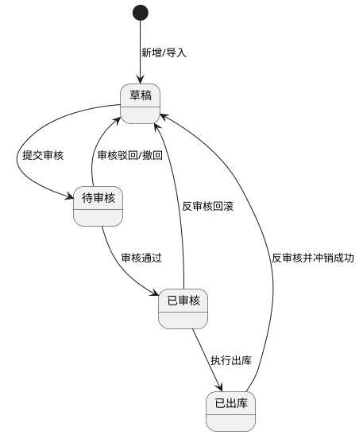

**5）状态联动规则**

| 触发状态  | 联动对象    | 联动规则                      |
| ----- | ------- | ------------------------- |
| 草稿    | 页面按钮与字段 | 显示编辑、删除、提交审核、上传附件；字段可编辑   |
| 待审核   | 页面按钮与字段 | 隐藏编辑/删除；显示审核通过/驳回、撤回；字段只读 |
| 已审核   | 页面按钮与字段 | 隐藏编辑/删除；显示执行出库、反审核；字段只读   |
| 已出库   | 页面按钮与字段 | 隐藏编辑/删除/上传附件；仅保留查看与反审核入口  |
| 反审核成功 | 单据与库存   | 单据回到草稿，库存与流水回滚，恢复可编辑状态    |

**AI 状态联动补充**

1. 仅草稿状态允许生成与应用 AI 建议；待审核及以上状态 AI 建议按钮隐藏且结果只读。
2. `AI建议状态`自动维护：生成后为“已生成未应用”；部分应用为“部分已应用”；全部应用成功为“已全部应用”。
3. 关键字段变更时，`AI建议状态`自动回退“未生成”，并清空旧`AI建议批次ID`。

**6）完整正向业务流程**

1. 用户进入出库管理列表，按条件查询目标单据。
2. 点击“新增出库单”，填写主信息并新增明细。
3. 领用出库场景下，用户可选择来源业务类型与来源业务ID，系统自动带出来源业务摘要并校验关联合法性。
4. 在明细中选择物料、规格，系统自动带出单位与可用库存。
5. 用户填写出库数量后点击`AI 出库建议`，系统进入加载并生成建议结果。
6. 系统展示建议仓库、建议仓位、建议批次号及各批次建议出库数量，用户可查看推荐原因与可应用状态。
7. 用户点击“一键应用 AI 建议”，系统回填明细（多批次自动拆分）并重算汇总字段。
8. 用户可继续手工调整明细，上传照片、视频、审批材料等附件。
9. 保存草稿后可继续编辑，确认无误后提交审核。
10. 审核通过后进入已审核，仓库管理员执行出库。
11. 执行出库成功后状态变更为已出库，系统生成库存流水、回写库存余额，并在领用出库场景回写来源业务备料状态。
12. 如业务错误且满足前置条件，发起反审核并回滚至草稿后重新提审。

**7）完整异常业务流程**

1. 本次出库数量大于当前可用库存时，阻断保存/提交/执行出库并提示剩余库存。
2. 已出库状态执行编辑或删除时，系统阻断并提示“状态不允许操作”。
3. 反审核前置校验不通过（存在下游占用、结算锁定、库存回滚冲突）时，阻断反审核。
4. 物料、规格、单位、仓库、仓位为空或不合法时，阻断提交并定位错误字段。
5. 规格不归属物料、仓位不归属仓库时，阻断提交并提示级联错误。
6. 重复出库提交（重复请求/并发）时按幂等键与版本号拦截。
7. 出库执行时库存被其他单据占用导致数据冲突，系统返回最新库存并要求重提。
8. 已审核状态重复审核、越权审核时，系统统一返回403/409并记录日志。
9. 导入数据中数量超库存、类型非法、仓位非法时，对应行失败并返回“行号+原因”。
10. 附件上传格式非法、大小超限、文件损坏时上传失败并提示可重试。
11. 无权限用户进行新增、编辑、删除、审核、反审核、导入导出时统一拦截。
12. 扣减库存事务异常时整单回滚，避免出现“状态已出库但库存未扣减”的不一致。
13. 物料信息不全（物料/规格/数量缺失）时，阻断 AI 建议生成并逐行提示缺失字段。
14. 当前可用库存不足以覆盖目标出库数量时，AI 返回“库存不足无法建议”，并给出缺口数量。
15. 无对应可用批次（无批次库存、批次已锁定、批次已过期禁出）时，AI 返回“无对应批次数据”，不生成可应用建议。
16. AI 服务超时、接口异常、返回格式错误时，显示失败提示并允许重试，不影响手工填写流程。
17. 一键应用失败（版本冲突、仓位状态变化、权限变化）时，阻断写入并提示刷新后重试。
18. 同一建议批次重复应用时，系统按`建议批次ID+明细ID`幂等拦截，避免重复覆盖。
19. 领用出库来源业务不存在、已关闭、跨组织或状态不允许引用时，阻断保存与提交。
20. 领用出库执行成功但来源业务备料状态回写失败时，主单据保持已出库，`领用回写状态`标记为回写失败并生成补偿任务。
21. 已开始执行的来源烹饪任务、已归档来源业务或监管锁定业务触发反审核时，系统必须阻断并提示下游已执行。

**8）唯一性校验、关联关系、导入导出规则、附件上传规则、数据权限控制**

**唯一性校验**

1. 出库单号全局唯一。
2. 同一单据内`物料ID+规格ID+出库仓库ID+出库仓位ID+批次号+行用途`组合唯一。
3. 同一请求幂等键在有效期内仅允许成功一次。
4. 同一`AI建议批次ID+明细ID+建议批次序号`唯一，防止重复应用。

**关联关系规则**

1. 出库单明细与库存批次、库存流水建立一对多关联。
2. 调拨出库与调拨入库建立可追溯关联关系，支持后续对账。
3. 销售出库/领用出库可关联下游业务单据，反审核需校验下游状态。
4. 领用出库可关联菜谱计划、烹饪任务、留样任务、销样任务等来源业务，执行出库后需回写来源业务的备料/领用状态。
5. AI 建议结果与出库单明细一对多关联，应用记录保留审计追踪，不参与库存扣减结算。
6. 领用出库执行成功后，系统必须按明细维度将 `trace_batch_id`、库存批次台账ID、出库数量、来源单据与操作时间写入烹饪任务物料消耗快照；后续留样、销样、评价申诉、AI告警按同一追溯批次串联查询。
7. 若下游烹饪、留样、销样、整改、客诉调查链路已进入执行、归档、闭环或监管锁定状态，则出库反审核、作废、回退一律阻断并返回具体下游业务编号。

**导入规则**

1. 支持 `xlsx` 模板导入，导入范围为草稿单据。
2. 单文件≤10MB，单次导入≤5000行明细。
3. 支持部分成功，失败行返回“行号+字段+原因”。
4. 导入不支持直接导入 AI 建议结果字段，建议结果由系统按实时库存动态生成。

**导出规则**

1. 支持按当前筛选条件导出列表与明细。
2. 导出格式支持 `xlsx/csv`。
3. 导出范围受数据权限控制，越权数据不导出。
4. 明细导出可选包含`AI建议状态`、`是否应用AI建议`字段。

**附件上传规则**

1. 支持格式：`jpg/jpeg/png/webp/mp4/mov/pdf/doc/docx/xls/xlsx`。
2. 单文件大小限制：图片≤20MB，视频≤200MB，文档≤50MB；单单据最多30个附件。
3. 附件支持预览、下载、逻辑删除；删除与下载均记录审计日志。

**数据权限控制**

| 角色    | 功能权限                                     | 数据范围     |
| ----- | ---------------------------------------- | -------- |
| 仓库管理员 | 新增、编辑、删除、提交审核、执行出库、导入、导出、附件管理、AI 建议生成/应用 | 本组织及授权组织 |
| 后厨主管  | 新增、编辑、查询、提交审核、导入、导出、附件上传/查看、AI 建议生成/应用   | 本组织及授权组织 |
| 食堂负责人 | 查询、审核通过/驳回、反审核、导出、附件查看、AI 建议结果查看         | 本组织及授权组织 |
| 系统管理员 | 全量权限（含跨组织维护与审计查看）                        | 全组织范围    |

**权限实现规则**

1. 前端按角色与状态双维度控制菜单、按钮、字段可编辑性。
2. 后端执行“功能权限+数据权限+状态权限”三重校验，越权统一返回403。
3. 新增、编辑、删除、审核、反审核、执行出库、导入导出、附件操作、AI 建议生成/应用全量审计留痕。

**9）出库类型字典管理规则**

**系统内置出库类型**

1. 领用出库、销售出库、退货出库、调拨出库、盘亏出库、赠送/捐赠出库、报废出库、其他出库。
2. 系统支持管理员新增自定义出库类型，用于补充特殊领用、损耗、内部调拨等业务。
3. 系统内置出库类型不允许删除；自定义出库类型仅在禁用且无出库单引用时允许删除。

**字典字段定义**

| 字段名    | 类型      | 长度    | 是否必填 | 约束规则          | 默认值   | 示例                 |
| ------ | ------- | ----- | ---- | ------------- | ----- | ------------------ |
| 类型ID   | UUID    | 36    | 是    | 全局唯一，不可编辑     | 系统生成  | `OUTTYPE-0001`     |
| 类型名称   | String  | 2-50  | 是    | 唯一；系统内置名称不可修改 | 无     | `领用出库`             |
| 类型编码   | String  | 2-50  | 是    | 唯一；系统内置编码不可修改 | 无     | `OUT_PICK`         |
| 类型来源   | Enum    | -     | 是    | 系统内置/自定义      | `自定义` | `系统内置`             |
| 状态     | Enum    | -     | 是    | 启用/禁用         | `启用`  | `启用`               |
| 排序号    | Integer | 1-5位  | 是    | 0-99999       | `0`   | `10`               |
| 来源业务要求 | String  | 0-200 | 否    | 描述是否强制关联来源业务  | 空     | `领用出库可关联菜谱计划或烹饪任务` |
| 引用数量   | Integer | 1-8位  | 是    | 自动统计出库单引用数    | `0`   | `208`              |

**交互规则**

1. 出库管理新增/编辑表单、筛选区、导入模板统一使用“出库类型字典”。
2. 系统管理员可进入“出库类型管理”弹窗，新增自定义类型、编辑自定义类型、启用/禁用、调整排序。
3. 系统内置类型仅允许调整排序号、状态、来源业务要求说明；名称与编码只读，不允许删除。
4. 禁用类型不再允许被新建、编辑、导入使用；历史出库单和统计报表保留原类型展示。
5. 出库类型切换后，页面按类型联动来源业务、库存校验、审批要求和 AI 出库建议参数。

**状态定义与状态流转**

| 状态  | 定义              | 业务联动      | 可删除性         |
| --- | --------------- | --------- | ------------ |
| 启用  | 可被新增、编辑、导入、筛选使用 | 正常参与业务与统计 | 不允许删除        |
| 禁用  | 不可用于新单据、导入和复制单据 | 仅历史数据保留   | 仅自定义且无引用允许删除 |


**正向业务流程**

1. 系统初始化写入内置出库类型并默认启用。
2. 系统管理员按业务需要新增自定义出库类型并设置排序、备注。
3. 仓库管理员、后厨主管在新增出库单时选择启用状态类型，系统联动来源业务和库存规则。
4. 类型状态更新后，表单下拉、筛选器、导入校验规则、统计口径同步刷新。
5. 自定义出库类型停用且无引用后，可执行删除并写入审计日志。

**异常业务流程**

1. 类型名称或编码重复时，阻断保存。
2. 系统内置出库类型删除请求统一拦截。
3. 自定义类型已存在出库单、盘点调整、来源业务映射引用时，删除操作被阻断并提示关联信息。
4. 已禁用类型被旧表单缓存或导入模板继续提交时，后端阻断并提示刷新数据。
5. 无字典维护权限用户执行类型新增、编辑、禁用、删除时，返回403并记录审计。

**10）出库单删除补充规则、顶部统计卡片与移动加权平均成本规则**

**10.1 补充说明**

1. 本补充规则仅新增出库单删除校验规则、删除失败提示文案、删除后业务约束、顶部统计卡片指标与统计逻辑、移动加权平均库存成本逻辑及示例，不改变本章节原有字段定义、页面结构正文、单据状态流转、审核流程、执行出库流程与反审核流程。
2. 删除入口仍遵循本章节原有按钮显隐规则：仅在用户具备删除权限且单据满足原有状态条件时展示。
3. 出库管理顶部统计卡片为页面数据概览补充能力，统计口径与本章节现有出库单状态定义保持一致，不新增或改写任何单据状态。
4. 本补充规则中的“待审批”“已审批”“已完成”为页面展示口径；底层状态映射仍严格遵循本章节原有状态：`待审核`、`已审核`、`已出库`。

**10.2 出库单删除触发与处理流程**

1. 用户在出库管理列表或详情中点击“删除”。
2. 系统先执行出库单删除前置校验。
3. 若任一校验不通过，立即弹出删除失败提示弹窗，终止删除。
4. 若全部校验通过，系统执行删除；删除成功后移除该草稿单据并刷新列表、详情与统计卡片。
5. 删除动作仅针对草稿单据，删除后不保留恢复入口，不支持回收站恢复。
6. 删除提交到服务端时，后端必须基于最新数据再次执行全量校验，防止并发误删。

**10.3 出库单删除前置校验明细**

| 校验项                 | 校验规则                         | 校验范围说明                                                       | 不通过时提示文案                                  | 处理方式 |
| ------------------- | ---------------------------- | ------------------------------------------------------------ | ----------------------------------------- | ---- |
| 草稿状态校验              | 删除出库单前，单据当前仅允许为草稿状态          | 必须校验主单最新状态，不允许使用前端缓存状态作为唯一依据                                 | 该出库单已提交审批或已完成出库扣减库存数据，为保证库存准确与溯源完整，不允许删除。 | 阻断删除 |
| 审批流转记录校验            | 单据未提交审批，无任何审批流转记录            | 必须覆盖提交审核、审核通过、审核驳回、撤回、审批节点流转、审批操作日志等全部审批轨迹                   | 该出库单已提交审批或已完成出库扣减库存数据，为保证库存准确与溯源完整，不允许删除。 | 阻断删除 |
| 出库执行与库存扣减校验         | 单据未完成出库操作，未扣减库存、未造成库存数量变动    | 必须覆盖出库执行记录、库存余额变更、库存占用变更、过账任务记录、库存批次扣减记录                     | 该出库单已提交审批或已完成出库扣减库存数据，为保证库存准确与溯源完整，不允许删除。 | 阻断删除 |
| 盘点单及后续库存流水关联校验      | 单据无关联盘点单及后续库存流水数据            | 必须覆盖盘点关联、库存调整流水、后续库存修正记录及其他基于该出库单生成的下游库存数据                   | 该出库单已提交审批或已完成出库扣减库存数据，为保证库存准确与溯源完整，不允许删除。 | 阻断删除 |
| 库存流水、食材消耗、食安台账及溯源校验 | 单据无库存流水、食材消耗记录、食安台账及溯源相关数据生成 | 必须覆盖库存流水表、食材消耗快照、烹饪物料消耗关联、食安台账、`trace_batch_id`追溯链、证据链编号关联记录 | 该出库单已提交审批或已完成出库扣减库存数据，为保证库存准确与溯源完整，不允许删除。 | 阻断删除 |

**10.4 删除失败提示弹窗规则**

1. 弹窗标题：`出库单删除失败`
2. 弹窗正文固定展示统一提示文案：`该出库单已提交审批或已完成出库扣减库存数据，为保证库存准确与溯源完整，不允许删除。`
3. 弹窗按钮：仅展示`我知道了`。
4. 删除失败后，列表分页位置、筛选条件、详情抽屉状态保持不变。
5. 若后端需要记录具体命中校验项，详细命中结果用于接口返回与审计日志，不要求在用户弹窗中逐条展开。

**10.5 出库单删除成功后的业务约束**

1. 草稿出库单删除后单据信息直接清除，系统列表不再展示。
2. 删除前已校验未产生库存变动、业务关联及台账数据，不影响库存核算、数据统计。
3. 单据删除后不可恢复；后续如需使用，必须重新新建出库单。
4. 删除后不存在溯源断链、数据异常风险。
5. 删除成功后必须记录审计日志；删除失败同样记录失败日志及失败原因。

**10.6 删除边界场景与并发控制规则**

1. 前端删除前校验通过后至用户提交删除请求前，若单据状态由草稿变更为待审核、已审核或已出库，后端必须阻断删除。
2. 若在删除过程中新增了审批流转记录、库存扣减记录、库存流水记录、食材消耗记录、台账或溯源记录，后端必须按最新数据阻断删除。
3. 删除操作必须具备幂等性；重复提交删除请求时，系统不得重复删除或产生多条成功记录。
4. 若当前单据已被其他用户删除，系统返回“当前单据不存在或已删除，请刷新后重试”。
5. 删除过程中任一校验失败时，不得出现部分删除、列表已删除但详情仍可见、统计未刷新等中间态。

**10.7 顶部统计卡片指标补充**

1. 在不改动本章节现有页面结构正文的前提下，出库管理列表页顶部补充展示4项核心统计卡片：
   `本月出库总单数`、`本月待审批单数`、`本月已审批单数`、`本月出库金额`
2. 卡片默认展示位置位于列表页顶部筛选区域下方、数据列表上方。
3. 卡片统计结果受当前用户数据权限、组织范围及顶部通用筛选条件影响，不受分页影响。
4. 卡片时间窗口固定为当前自然月；用户点击卡片时，列表自动切换到与卡片一致的当前自然月筛选口径。

**10.8 顶部统计卡片指标定义与统计逻辑**

| 卡片名称    | 统计逻辑                         | 统计口径说明                                                     | 展示格式            |
| ------- | ---------------------------- | ---------------------------------------------------------- | --------------- |
| 本月出库总单数 | 统计当前自然月内所有出库单据总数             | 统计范围覆盖草稿、待审核、已审核、已出库全部状态；按当前数据权限、组织范围、顶部通用筛选条件统计           | 整数，不足1显示`0`     |
| 本月待审批单数 | 统计当前自然月内状态为`待审核`的出库单数量       | 卡片名称保持“待审批”展示口径，但底层状态映射使用本章节原有状态`待审核`                      | 整数，不足1显示`0`     |
| 本月已审批单数 | 统计当前自然月内状态为`已审核`、`已出库`的出库单数量 | 卡片名称保持“已审批”展示口径，但底层状态映射使用本章节原有状态`已审核`、`已出库`                | 整数，不足1显示`0`     |
| 本月出库金额  | 统计当前自然月内所有`已出库`单据明细行成本金额合计   | 计算公式：`本月出库金额 = Σ（出库数量 × 物料当前库存成本单价）`；仅`已出库`单据参与统计，结果保留2位小数 | 金额格式，默认显示`0.00` |

**10.9 顶部统计卡片交互规则**

1. 点击`本月出库总单数`卡片，列表自动筛选为当前自然月内全部出库单据，不追加状态过滤条件。
2. 点击`本月待审批单数`卡片，列表自动筛选为当前自然月且状态=`待审核`的出库单据。
3. 点击`本月已审批单数`卡片，列表自动筛选为当前自然月且状态∈{`已审核`,`已出库`}的出库单据。
4. 点击`本月出库金额`卡片，列表自动筛选为当前自然月且状态=`已出库`的出库单据，并按出库金额降序展示。
5. 统计卡片与列表筛选口径必须保持一致；当用户切换顶部通用筛选条件后，卡片数值同步重算。
6. 卡片统计仅展示当前用户有权访问的数据，禁止跨组织、跨权限范围汇总越权数据。
7. 当卡片统计结果为0时，卡片仍正常展示，不隐藏、不置灰。

**10.10 移动加权平均库存成本单价规则**

1. 出库金额统计所使用的库存成本单价为系统自动计算的移动加权平均成本价。
2. 每次采购入库、调拨入库、退货入库、盘盈入库按原有入库业务流程形成有效入库结果后，系统自动按照移动加权平均算法更新对应物料的库存成本单价。
3. 非上述成本型入库类型不参与移动加权平均成本单价更新。
4. 当物料首次形成有效库存时，库存成本单价直接取本次有效入库单价。
5. 当物料已有库存成本单价且再次发生成本型有效入库时，系统按“历史库存成本总额 + 本次入库成本总额”除以“历史库存数量 + 本次入库数量”计算新的库存成本单价。
6. 出库执行成功时，系统按执行时刻有效的库存成本单价计算并固化该明细行成本金额，用于后续统计与报表展示；统计口径不使用手工录入单价。

**10.11 移动加权平均成本计算公式**

1. 历史库存成本总额 = 历史库存数量 × 历史库存成本单价
2. 本次入库成本总额 = 本次入库数量 × 本次入库单价
3. 新库存成本单价 = （历史库存成本总额 + 本次入库成本总额）÷（历史库存数量 + 本次入库数量）
4. 单位成本单价结果保留4位小数用于系统内部计算，页面展示可按业务展示规则保留2位或4位；本月出库金额最终保留2位小数。

**10.12 出库金额统计取值规则**

1. 本月出库金额 = 当月所有【已完成】出库单的明细行，按“出库数量 × 物料当前库存成本单价”累加求和。
2. 本章节原有单据状态为`已出库`，页面统计“已完成”口径统一映射到`已出库`状态，不新增新状态。
3. 每条出库明细的成本金额取值口径为该明细执行出库时系统有效的库存成本单价，不因后续成本单价变化而回溯重算历史明细成本。
4. 本月出库金额仅统计当前自然月内`已出库`单据，不统计草稿、待审核、已审核未执行单据。
5. 本月出库金额统计结果保留2位小数，空数据时显示`0.00`。

**10.13 移动加权平均计算示例**

1. 物料：大白菜
2. 第一次有效入库（10月8日）
   入库数量：100 kg
   入库单价：3.0 元
   入库后库存成本单价 = 3.0 元/kg
3. 第二次有效入库（10月15日）
   入库数量：50 kg
   入库单价：3.6 元
   系统自动计算新的移动加权平均成本：
   成本单价 = (100×3.0 + 50×3.6) ÷ (100+50) = 3.2 元/kg
4. 出库单1
   出库大白菜 20 kg
   系统自动取库存成本单价：3.2 元/kg
   单行成本 = 20 × 3.2 = 64 元
5. 出库单2
   出库大白菜 15 kg
   系统自动取库存成本单价：3.2 元/kg
   单行成本 = 15 × 3.2 = 48 元
6. 本月出库金额合计 = 64 + 48 = 112.00 元

**11）仓位已占用面积扣减联动补充规则**

**11.1 补充说明**

1. 本补充规则仅新增出库场景下仓位已占用面积扣减与联动更新规则，不改动本章节既有字段定义、状态流转、删除规则、顶部统计卡片规则、移动加权平均成本规则与AI建议规则。
2. 出库面积扣减所使用的面积系数，统一取自`系统管理-字典分类维护 -> 物料类别`维护的`物料类别统一面积系数（㎡/单件）`。
3. 同一物料大类下全部物料统一复用所属类别固定面积系数，出库单明细不允许手工改写面积系数口径。

**11.2 补充计算字段**

| 字段名              | 类型      | 长度   | 是否必填 | 约束规则                           | 默认值      | 示例        |
| ---------------- | ------- | ---- | ---- | ------------------------------ | -------- | --------- |
| 物料类别统一面积系数（㎡/单件） | Decimal | 18,4 | 否    | 由物料所属物料类别自动匹配；只读               | 自动带出     | `0.2500`  |
| 本次出库释放面积（㎡）      | Decimal | 18,4 | 是    | `本次出库数量 × 物料类别统一面积系数`自动计算；只读   | `0.0000` | `4.5000`  |
| 出库后仓位当前已占用总面积（㎡） | Decimal | 18,4 | 是    | `仓位当前已占用总面积 - 本次出库释放面积`自动计算；只读 | 系统计算     | `24.0000` |

**11.3 出库仓位面积扣减规则**

1. 出库单完成本章节既有有效出库生效动作后，系统自动按“实际生效出库数量 × 物料类别统一面积系数”计算本次出库释放面积，并扣减对应仓位`当前已占用总面积`。
2. 同一张出库单存在多条明细落在同一仓位时，系统按明细逐行计算释放面积后进行同仓位汇总扣减。
3. 出库面积扣减与库存扣减、库存流水写入、批次台账扣减必须保持同一生效口径与同一事务边界，禁止出现库存已扣减但仓位面积未同步扣减的中间态。
4. 若出库单触发本章节既有反审核、冲销或回滚流程，系统必须按原生效数量与原面积系数同步恢复仓位已占用面积。

**11.4 与其他仓储业务的联动规则**

1. 盘亏、报废等导致库存减少的业务，完成各自既有生效动作后，统一按“实际减少数量 × 物料类别统一面积系数”扣减对应仓位已占用面积。
2. 盘盈等导致库存增加的业务，完成既有生效动作后，统一按同一面积系数口径增加对应仓位已占用面积。
3. 入库、出库、盘点、报废四类业务共同构成仓位面积闭环数据口径，任一模块不得单独维护第二套面积增减逻辑。

**11.5 异常与边界补充规则**

1. 若出库物料未归属任何物料类别，或无匹配统一面积系数，则该明细沿用上游免校验口径，本次不执行面积释放计算，但需记录审计日志并等待后续补齐系数后统一纳入历史回溯修正。
2. 出库生效前，若同一仓位因并发业务导致实时占用面积发生变化，后端需以最新仓位数据重算扣减结果后再落库。
3. 系统不得写入负数仓位已占用面积；若因历史数据未回溯完成或并发冲突导致理论结果异常，后端必须先重算并阻断错误落库。

#### 2.6 库存报表与智能分析

**页面路径：** `菜单 → 仓储管理 → 库存报表与智能分析`  
**访问权限：** `仓库管理员、食堂负责人、采购经理、系统管理员`  
**页面类型：** `看板页 + 图表分析页 + 列表页 + 导出操作页`

**1）模块概述与业务目标**

1. 本模块用于统一承载库存损耗分析、库存预警管理、AI需求预测与采购计划联动生成能力。
2. 本模块支持基于库存与业务数据的可视化分析、风险识别、智能建议与执行闭环。
3. 本模块提供标准化报表导出、图表展示、AI结果刷新与状态联动，保障分析结果可复用、可追溯、可落地。

**2）完整字段定义**

**2.1 通用筛选与任务字段**

| 字段名     | 类型       | 长度    | 是否必填 | 约束规则                         | 默认值  | 示例                      |
| ------- | -------- | ----- | ---- | ---------------------------- | ---- | ----------------------- |
| 分析周期    | Enum     | -     | 是    | 取值：近一周/近一月/近一季（损耗）；日/周/月（预测） | 近一周  | `近一月`                   |
| 组织ID    | String   | 36    | 是    | 必须在数据权限范围内                   | 当前组织 | `ORG-10001`             |
| 仓库ID    | String   | 36    | 否    | 必须在数据权限范围内                   | 全部   | `WH-001`                |
| 物料类别    | String   | 1-50  | 否    | 必须为类别字典值                     | 全部   | `肉禽类`                   |
| 物料关键字   | String   | 0-100 | 否    | 匹配名称/编码/规格                   | 空    | `鸡腿`                    |
| AI任务ID  | String   | 36    | 是    | 全局唯一                         | 系统生成 | `AI-TASK-20260330-0001` |
| AI结果版本号 | String   | 1-32  | 是    | 刷新后递增                        | `v1` | `v3`                    |
| 数据时间戳   | DateTime | 19    | 是    | 只读                           | 系统时间 | `2026-03-30 14:20:01`   |

**2.2 库存损耗分析字段**

| 字段名      | 类型      | 长度     | 是否必填 | 约束规则         | 默认值      | 示例                   |
| -------- | ------- | ------ | ---- | ------------ | -------- | -------------------- |
| 总损耗金额    | Decimal | 18,2   | 是    | `>=0`        | `0.00`   | `12560.30`           |
| 损耗率      | Decimal | 7,4    | 是    | `0-1`，展示为百分比 | `0.0000` | `0.0825`             |
| 损耗物品数    | Integer | 10     | 是    | `>=0`        | `0`      | `38`                 |
| 改善潜力金额   | Decimal | 18,2   | 是    | `>=0`        | `0.00`   | `3260.00`            |
| 物料名称     | String  | 1-100  | 是    | 只读           | 无        | `菠菜`                 |
| 物料类别     | String  | 1-50   | 是    | 只读           | 无        | `叶菜类`                |
| 损耗金额     | Decimal | 18,2   | 是    | `>=0`        | `0.00`   | `860.50`             |
| 损耗次数     | Integer | 10     | 是    | `>=0`        | `0`      | `14`                 |
| 主要原因     | String  | 1-200  | 是    | AI归因或规则归因    | 无        | `存储温度波动`             |
| 高损耗时段    | String  | 1-50   | 否    | 时间段格式合法      | 空        | `14:00-16:00`        |
| AI优化建议   | String  | 1-1000 | 否    | 文本可读、不可为空字符串 | 空        | `将叶菜类每日补货批次由1次调整为2次` |
| 建议预计节省金额 | Decimal | 18,2   | 否    | `>=0`        | `0.00`   | `420.00`             |

**2.3 库存预警管理字段**

| 字段名  | 类型       | 长度    | 是否必填 | 约束规则                | 默认值   | 示例                    |
| ---- | -------- | ----- | ---- | ------------------- | ----- | --------------------- |
| 预警ID | String   | 36    | 是    | 全局唯一                | 系统生成  | `WARN-20260330-0012`  |
| 预警类型 | Enum     | -     | 是    | 库存不足/库存积压/临期预警/过期预警 | 无     | `库存不足`                |
| 预警级别 | Enum     | -     | 是    | 低/中/高/紧急            | 系统计算  | `高`                   |
| 物料ID | String   | 36    | 是    | 关联物料主数据             | 无     | `MAT-000321`          |
| 当前库存 | Decimal  | 18,3  | 是    | `>=0`               | 系统计算  | `12.000`              |
| 最低库存 | Decimal  | 18,3  | 否    | `>=0`               | 空     | `30.000`              |
| 最高库存 | Decimal  | 18,3  | 否    | `>=最低库存`            | 空     | `300.000`             |
| 剩余天数 | Integer  | 6     | 否    | 可为负                 | 空     | `-1`                  |
| 预警状态 | Enum     | -     | 是    | 未触发/已触发/已解除         | `已触发` | `已触发`                 |
| 处理状态 | Enum     | -     | 是    | 待处理/处理中/已处理/已关闭     | `待处理` | `已处理`                 |
| 处理人  | String   | 2-50  | 否    | 处理时必填               | 空     | `zhangsan`            |
| 处理时间 | DateTime | 19    | 否    | 处理时自动写入             | 空     | `2026-03-30 15:30:22` |
| 处理备注 | String   | 0-500 | 否    | 长度限制                | 空     | `已安排当日补货`             |
| 跟进计划 | String   | 0-500 | 否    | 长度限制                | 空     | `48小时后复核库存`           |

**2.4 AI需求预测字段**

| 字段名      | 类型      | 长度     | 是否必填 | 约束规则                      | 默认值    | 示例                          |
| -------- | ------- | ------ | ---- | ------------------------- | ------ | --------------------------- |
| 预测任务ID   | String  | 36     | 是    | 全局唯一                      | 系统生成   | `FCST-20260330-0005`        |
| 预测周期类型   | Enum    | -      | 是    | 日/周/月                     | `周`    | `周`                         |
| 周期开始日期   | Date    | 10     | 是    | `<=周期结束日期`                | 无      | `2026-04-01`                |
| 周期结束日期   | Date    | 10     | 是    | `>=周期开始日期`                | 无      | `2026-04-07`                |
| 预测状态     | Enum    | -      | 是    | 待生成/生成中/已生成/生成失败/已过期      | `待生成`  | `已生成`                       |
| 数据来源说明   | String  | 1-500  | 是    | 包含历史消耗、菜谱计划、就餐人数、当前库存来源说明 | 无      | `近90天消耗+未来7天菜谱+就餐人数预测+实时库存` |
| 物料ID     | String  | 36     | 是    | 关联物料主数据                   | 无      | `MAT-000666`                |
| 当前库存及单位  | String  | 1-100  | 是    | 格式：数值+单位                  | 无      | `120.000 kg`                |
| 预测需求量及单位 | String  | 1-100  | 是    | 格式：数值+单位                  | 无      | `180.000 kg`                |
| 建议采购量及单位 | String  | 1-100  | 是    | 格式：数值+单位；不得为负             | 无      | `70.000 kg`                 |
| 预估金额     | Decimal | 18,2   | 否    | `>=0`                     | `0.00` | `3200.00`                   |
| 置信度      | Decimal | 5,2    | 否    | `0-100`                   | `0.00` | `86.50`                     |
| 优先级      | Enum    | -      | 是    | 紧急/优先/正常                  | 系统计算   | `优先`                        |
| 预测依据摘要   | String  | 1-1000 | 是    | 说明核心影响因子                  | 无      | `受周末客流增加与菜单肉类占比上升影响`        |
| 预测准确率    | Decimal | 5,2    | 否    | `0-100`，回测周期可计算时展示        | 空      | `78.20`                     |

**2.5 一键生成采购计划字段**

| 字段名      | 类型      | 长度    | 是否必填 | 约束规则                  | 默认值   | 示例                       |
| -------- | ------- | ----- | ---- | --------------------- | ----- | ------------------------ |
| 生成批次号    | String  | 1-50  | 是    | 全局唯一                  | 系统生成  | `GEN-PLAN-20260330-0003` |
| 关联预测任务ID | String  | 36    | 是    | 必须存在且状态=已生成           | 无     | `FCST-20260330-0005`     |
| 关联预测明细ID | String  | 36    | 是    | 必须为已勾选预测明细            | 无     | `FCST-ITEM-00018`        |
| 采购计划单号   | String  | 1-50  | 否    | 生成成功后回写               | 空     | `CGJH-20260330-0011`     |
| 采购计划生成状态 | Enum    | -     | 是    | 未生成/生成中/已生成/生成失败/部分生成 | `未生成` | `已生成`                    |
| 参考周期     | String  | 1-50  | 是    | 来自预测周期                | 无     | `2026-04-01~2026-04-07`  |
| 带入物料ID   | String  | 36    | 是    | 与预测明细一致               | 无     | `MAT-000666`             |
| 带入建议采购量  | Decimal | 18,3  | 是    | `>=0`                 | 无     | `70.000`                 |
| 失败原因     | String  | 0-500 | 否    | 生成失败时必填               | 空     | `物料已禁用`                  |

**3）页面结构与交互规则**

**页面结构**

1. 顶部筛选区：分析周期、组织、仓库、物料类别、关键字、查询、重置、导出。
2. 中部看板区：损耗统计卡片、预警统计卡片、预测统计卡片。
3. 图表区：损耗原因分布图、高损耗时段趋势图、预测趋势图、预警类型分布图。
4. 列表区：损耗明细列表、预警列表、预测结果列表（支持勾选）。
5. 操作区：AI分析刷新、预警处理、导出、生成采购计划。

**筛选与列表联动规则**

1. 筛选条件变化后需点击“查询”触发，避免高频自动请求。
2. 重置后恢复系统默认条件并刷新全部看板与列表。
3. 列表分页、排序与筛选条件绑定，切页不丢条件。

**图表展示规则**

1. 图表数据与列表数据口径一致，统一来自同一查询条件与数据版本。
2. 图表无数据时展示空态图和“暂无数据”文案。
3. 图表加载失败时降级显示列表并保留错误提示。

**按钮显隐与操作前置条件**

| 按钮       | 可见角色                   | 显示条件     | 操作前置条件            | 执行结果          |
| -------- | ---------------------- | -------- | ----------------- | ------------- |
| 刷新AI损耗分析 | 仓库管理员、食堂负责人、系统管理员      | 有AI分析权限  | 分析周期与组织已选择        | 触发损耗分析任务并刷新结果 |
| 处理预警     | 仓库管理员、食堂负责人、系统管理员      | 预警列表有选中项 | 预警状态=已触发，处理状态≠已关闭 | 更新处理状态并记录备注   |
| 导出损耗报表   | 仓库管理员、食堂负责人、采购经理、系统管理员 | 有导出权限    | 当前查询条件合法          | 导出Excel       |
| 生成AI需求预测 | 仓库管理员、采购经理、系统管理员       | 有预测权限    | 数据源校验通过           | 创建预测任务        |
| 刷新预测结果   | 仓库管理员、采购经理、系统管理员       | 预测任务存在   | 任务状态=已生成/生成失败     | 重新计算预测        |
| 导出预测结果   | 仓库管理员、采购经理、系统管理员       | 有导出权限    | 当前查询条件合法          | 导出Excel       |
| 一键生成采购计划 | 采购经理、系统管理员             | 预测列表可勾选  | 至少勾选1条，预测状态=已生成   | 生成采购计划并回写状态   |

**AI结果展示规则**

1. AI结果需展示：结果时间戳、结果版本号、置信度、预测依据摘要。
2. AI结果非强制覆盖人工输入，仅作为决策参考。
3. 刷新AI结果后旧版本保留可追溯记录。

**4）状态定义与状态联动**

**4.1 状态定义**

| 状态类别     | 状态值                   | 含义          |
| -------- | --------------------- | ----------- |
| 预警状态     | 未触发/已触发/已解除           | 预警规则触发生命周期  |
| 处理状态     | 待处理/处理中/已处理/已关闭       | 预警处置生命周期    |
| 预测状态     | 待生成/生成中/已生成/生成失败/已过期  | 预测任务生命周期    |
| 采购计划生成状态 | 未生成/生成中/已生成/生成失败/部分生成 | 预测明细转采购计划状态 |

**4.2 状态流转图（预警处理）**

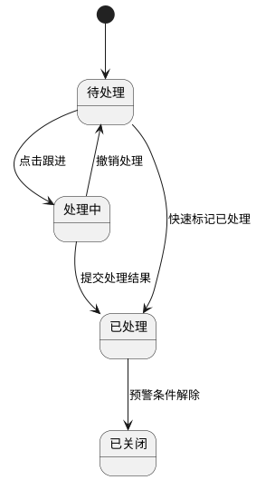

**4.3 状态流转图（预测与采购计划生成）**

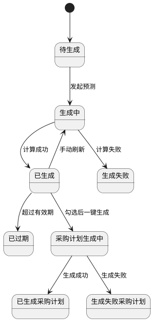

**4.4 状态联动规则**

1. 预警处理状态为已处理或已关闭时，处理按钮置灰。
2. 预测状态非“已生成”时，不允许一键生成采购计划。
3. 采购计划生成状态为已生成时，展示计划单号并禁用重复生成。
4. 预测结果刷新后，旧结果状态转为已过期，新结果进入已生成。

**5）完整正向业务流程**

1. 用户进入库存报表与智能分析页面，选择分析周期与筛选条件。
2. 用户查看损耗看板、图表与损耗明细，识别高损耗物料、时段、原因。
3. 用户查看AI输出的损耗优化建议，导出损耗报表用于复盘。
4. 用户切换到预警列表，筛选未处理预警并执行标记处理、填写备注与跟进。
5. 用户发起AI需求预测，系统校验数据源后生成预测任务。
6. 用户查看预测依据、预测值、建议采购量，按需刷新AI结果。
7. 用户在预测结果中勾选物料，点击一键生成采购计划。
8. 系统生成采购计划单并回写生成状态、计划单号，用户可跳转采购计划详情。
9. 用户按当前筛选条件导出预警、预测、损耗报表，完成业务闭环。

**6）完整异常业务流程**

1. 无历史消耗数据导致AI无法预测时，系统提示“历史数据不足，无法生成预测”，并列出缺失来源。
2. 无损耗数据时，损耗图表与列表展示空态，不触发错误弹窗。
3. 预测结果勾选为空时，一键生成采购计划按钮执行拦截并提示“请先勾选物料”。
4. 同一预测批次重复生成采购计划时，系统按幂等规则拦截并提示已生成记录。
5. 用户权限不足时，相关按钮隐藏；接口直接调用返回403并记录审计日志。
6. 数据异常（负库存、单位缺失、物料停用）时，异常明细标红并阻断生成采购计划。
7. AI任务执行失败时，预测状态置为生成失败并返回失败原因，允许重试。
8. 报表导出失败时保留失败任务记录，可重试且不生成损坏文件。
9. 图表渲染失败时自动降级为列表展示，并提示“图表加载失败，请稍后重试”。

**7）报表导出、图表渲染、AI结果刷新逻辑**

**7.1 报表导出规则**

1. 导出格式统一为 `xlsx`。
2. 文件命名规范：`库存损耗分析_YYYYMMDD_HHmmss.xlsx`、`库存预警列表_YYYYMMDD_HHmmss.xlsx`、`AI需求预测_YYYYMMDD_HHmmss.xlsx`、`采购计划生成结果_YYYYMMDD_HHmmss.xlsx`。
3. 导出范围为“当前筛选结果 + 当前数据权限范围”。
4. 导出字段顺序与页面列表一致，时间格式统一 `YYYY-MM-DD HH:mm:ss`。
5. 单次导出数据量>100000行自动转异步导出任务。

**7.2 图表渲染逻辑**

1. 图表数据请求成功后2秒内完成渲染；超时显示加载失败占位。
2. 图表与列表共享同一数据版本号，避免口径不一致。
3. 图表组件异常时自动降级列表，不影响核心业务操作。

**7.3 AI结果刷新逻辑**

1. 支持手动刷新与定时刷新（每日固定时段自动刷新）。
2. 刷新采用任务队列，任务状态可追踪（生成中/成功/失败）。
3. 刷新成功后写入新版本号与时间戳，旧版本保留历史查询能力。
4. 刷新失败不覆盖旧结果，页面提示失败原因并支持重试。

**8）权限控制与数据范围**

| 角色    | 功能权限                         | 数据范围     |
| ----- | ---------------------------- | -------- |
| 仓库管理员 | 查看损耗分析、查看/处理预警、查看预测、导出报表     | 本组织及授权组织 |
| 食堂负责人 | 查看损耗分析、查看/处理预警、查看预测、导出报表     | 本组织及授权组织 |
| 采购经理  | 查看损耗分析、查看预警、发起预测、导出预测、生成采购计划 | 本组织及授权组织 |
| 系统管理员 | 全量查看、全量导出、全量处理、全量生成采购计划      | 全组织范围    |

**权限实现规则**

1. 前端按角色控制菜单、按钮、操作入口显隐。
2. 后端接口执行“功能权限+数据权限”双校验，越权统一返回403。
3. 查询、处理、导出、预测、生成采购计划全部操作写入审计日志。

#### 2.7 盘点管理

**页面路径：** `菜单 → 仓储管理 → 盘点管理`  
**访问权限：** `仓库管理员、食堂负责人、系统管理员（审核/查看）`  
**页面类型：** `列表页 + 表单页 + 详情页 + 审核页`

**1）模块概述与业务目标**

1. 本模块用于完成盘点任务新增、历史列表查询、盘点数据填报、差异计算、附件上传、审核生效与差异闭环处理。
2. 盘点任务创建时需基于所选仓库、仓位生成系统库存快照，后续盘点、审核均以该快照为基准，避免盘点过程中口径漂移。
3. 审核通过后才允许回写库存调整结果，并同步生成盘盈/盘亏库存流水，确保账实调整可追溯。
4. 本模块需兼容WEB端手工盘点与移动端AI盘点辅助回传结果，统一形成同一张盘点单与同一条审计链路。

**1.1）盘点管理顶部数据概览统计卡片补充规则**

1. 在不改动本章节原有字段定义、页面结构正文、单据状态流转、审核回写逻辑、附件规则、权限与审计规则的前提下，盘点管理列表页顶部新增4项数据概览统计卡片：
   `本月盘点次数`、`待处理盘点单`、`盘盈总金额`、`盘亏总金额`
2. 统计卡片默认展示于盘点管理列表页顶部筛选区域下方、盘点历史列表上方。
3. 用户进入页面时系统实时自动计算卡片数据；当用户切换顶部通用筛选条件并重新查询后，卡片数据按最新筛选结果同步重算。
4. 卡片统计口径受当前用户数据权限、组织范围、盘点日期、盘点仓库、盘点仓位、盘点人等顶部通用筛选条件影响，不受分页影响。
5. 数量类卡片使用整数展示，金额类卡片单位统一为`元`，结果保留2位小数；当无数据时分别展示`0`或`0.00`，不隐藏卡片。
6. 本补充仅新增顶部统计展示与统计口径说明，不新增任何业务状态，不改变本章节原有`待完成/待审核/已完成/已驳回/已作废`状态定义。

**1.2）统计指标定义、状态映射与计算口径**

1. 为保持本章节原有盘点状态流转逻辑完全不变，统计卡片口径中涉及的业务描述与本PRD既有状态映射关系统一如下：
   `盘点中`对应本章节既有状态`待完成`；
   `待确认/已确认`对应本章节既有状态`待审核`；
   `已完成`对应本章节既有状态`已完成`。
2. 上述映射仅用于顶部统计卡片的展示口径解释，不新增、不修改任何单据状态值。

| 卡片名称   | 指标含义                                  | 统计时间范围                | 状态筛选口径                                | 计算规则                                        | 展示格式                       |
| ------ | ------------------------------------- | --------------------- | ------------------------------------- | ------------------------------------------- | -------------------------- |
| 本月盘点次数 | 统计当前自然月内已进入盘点流程的有效盘点次数                | 当前自然月                 | 统计状态为`待完成`、`待审核`、`已完成`；不统计`已驳回`、`已作废` | 按盘点单主单计数，1张盘点单计1次                           | 整数，单位`次`，默认显示`0`           |
| 待处理盘点单 | 统计当前仍需仓管员/管理员确认盈亏差异、尚未完结的盘点单数量        | 实时口径；默认在当前自然月筛选上下文内展示 | 统计状态为`待完成`、`待审核`                      | 按盘点单主单计数，1张盘点单计1张                           | 整数，单位`张`，默认显示`0`           |
| 盘盈总金额  | 统计当前自然月内所有已完成盘点单中，实际库存大于账面库存形成的盘盈金额总和 | 当前自然月                 | 仅统计`已完成`盘点单；仅累加盘盈明细，不计入盘亏数据           | 单个物料盘盈金额=`盘盈数量 × 物料库存成本单价`；将所有盘盈明细按正数金额累加汇总 | 金额，单位`元`，保留2位小数，默认显示`0.00` |
| 盘亏总金额  | 统计当前自然月内所有已完成盘点单中，实际库存小于账面库存形成的盘亏金额总和 | 当前自然月                 | 仅统计`已完成`盘点单；仅累加盘亏明细，不计入盘盈数据           | 单个物料盘亏金额=`盘亏数量 × 物料库存成本单价`；将所有盘亏明细按正数金额累加汇总 | 金额，单位`元`，保留2位小数，默认显示`0.00` |

**1.3）库存成本单价取值规则**

1. `盘盈总金额`与`盘亏总金额`所使用的物料库存成本单价，统一沿用平台既定的`移动加权平均成本价`规则，不新增新的成本算法。
2. 成本金额统计优先采用盘点单审核完成并生成盘盈/盘亏调整时已固化的差异金额口径；若展示层需按公式重算，则应取盘点单完成时对应物料的有效库存成本单价进行计算。
3. 盘盈金额与盘亏金额分别独立汇总，禁止正负相抵后再展示；盘盈卡片仅展示盘盈正数金额，盘亏卡片仅展示盘亏正数金额。
4. 若同一张已完成盘点单中同时存在盘盈与盘亏明细，则盘盈明细计入`盘盈总金额`，盘亏明细计入`盘亏总金额`，互不冲抵。

**1.4）卡片刷新、边界与一致性规则**

1. 页面首次进入、手动点击查询、切换筛选条件、权限范围变化后，系统均需实时重算4项卡片指标。
2. `本月盘点次数`与`待处理盘点单`按主单维度统计，不因单据包含多条盘点明细而重复累加。
3. `盘盈总金额`、`盘亏总金额`按盘点明细维度汇总；当明细差异数量为0时，不计入任一金额卡片。
4. `已驳回`、`已作废`盘点单不参与本次新增顶部统计卡片的任何指标计算。
5. 当顶部筛选条件限定仓库、仓位、盘点人或日期范围时，4项卡片指标均需与当前列表查询口径保持一致。
6. 卡片统计结果仅展示当前用户有权访问的数据，禁止跨组织、跨仓库、跨权限范围汇总越权数据。

**2）完整字段定义**

**2.1 盘点单主信息字段**

| 字段名    | 类型       | 长度    | 是否必填 | 默认值    | 约束规则                       | 示例                                         |
| ------ | -------- | ----- | ---- | ------ | -------------------------- | ------------------------------------------ |
| 盘点单ID  | UUID     | 36    | 是    | 系统生成   | 全局唯一                       | `CHK-8f9ab2f3-19f0-4d8d-8a1f-11c5307f0001` |
| 盘点表编码  | String   | 24    | 是    | 系统生成   | 全局唯一，格式：`PD-YYYYMMDD-XXXX` | `PD-20260403-0008`                         |
| 盘点日期   | Date     | 10    | 是    | 当前业务日  | 不得晚于当前日期+1天                | `2026-04-03`                               |
| 盘点仓库ID | String   | 36    | 是    | 无      | 必须在权限范围内且状态=使用中            | `WH-001`                                   |
| 盘点仓库名称 | String   | 1-100 | 是    | 自动带出   | 与仓库ID一致                    | `冷藏主仓`                                     |
| 盘点仓位ID | String   | 36    | 否    | 空      | 可为空；为空表示盘点整个仓库             | `LOC-A-01-03`                              |
| 盘点仓位名称 | String   | 1-100 | 否    | 空      | 与仓位ID一致                    | `A-01-03`                                  |
| 盘点人ID  | String   | 1-64  | 是    | 当前登录用户 | 自动写入                       | `EMP-00021`                                |
| 盘点人姓名  | String   | 2-50  | 是    | 当前登录用户 | 自动带出                       | `张三`                                       |
| 盘点物料数  | Integer  | 1-8位  | 是    | 0      | 根据生成快照自动回写                 | `36`                                       |
| 盘点状态   | Enum     | -     | 是    | 待完成    | 取值：待完成/待审核/已完成/已驳回/已作废     | `待审核`                                      |
| 差异数量合计 | Decimal  | 18,3  | 否    | 0      | 所有明细差异数量绝对值汇总              | `18.000`                                   |
| 盘盈金额合计 | Decimal  | 18,2  | 否    | 0.00   | 自动汇总                       | `560.00`                                   |
| 盘亏金额合计 | Decimal  | 18,2  | 否    | 0.00   | 自动汇总                       | `820.00`                                   |
| 差异率(%) | Decimal  | 7,2   | 否    | 0.00   | `差异数量合计/系统库存数量合计*100%`     | `2.35`                                     |
| 备注     | String   | 0-500 | 否    | 空      | 长度限制                       | `月度例行盘点`                                   |
| 创建时间   | DateTime | 19    | 是    | 系统时间   | 自动记录                       | `2026-04-03 08:30:00`                      |
| 更新时间   | DateTime | 19    | 是    | 系统时间   | 状态或内容更新时回写                 | `2026-04-03 10:15:00`                      |

**2.2 盘点明细字段**

| 字段名     | 类型      | 长度    | 是否必填 | 默认值  | 约束规则                    | 示例                                         |
| ------- | ------- | ----- | ---- | ---- | ----------------------- | ------------------------------------------ |
| 盘点明细ID  | UUID    | 36    | 是    | 系统生成 | 全局唯一                    | `CHK-ITEM-0001`                            |
| 盘点单ID   | UUID    | 36    | 是    | 无    | 关联盘点单                   | `CHK-8f9ab2f3-19f0-4d8d-8a1f-11c5307f0001` |
| 物料ID    | String  | 36    | 是    | 无    | 必须存在于库存快照中              | `MAT-000321`                               |
| 物料名称    | String  | 1-100 | 是    | 快照带出 | 只读                      | `鸡腿肉`                                      |
| 物料规格    | String  | 1-100 | 是    | 快照带出 | 只读                      | `10kg/箱`                                   |
| 批次号     | String  | 0-50  | 否    | 快照带出 | 批次管理开启时展示               | `BATCH-20260401-01`                        |
| 所在仓库    | String  | 1-100 | 是    | 快照带出 | 只读                      | `冷藏主仓`                                     |
| 所在仓位    | String  | 1-100 | 否    | 快照带出 | 只读                      | `A-01-03`                                  |
| 系统库存数   | Decimal | 18,3  | 是    | 快照带出 | 只读，不可编辑                 | `80.000`                                   |
| 实际库存数   | Decimal | 18,3  | 否    | 空    | `>=0`，支持3位小数            | `78.000`                                   |
| 差异数量    | Decimal | 18,3  | 否    | 系统计算 | `实际库存数-系统库存数`           | `-2.000`                                   |
| 差异方向    | Enum    | -     | 否    | 自动计算 | 取值：盘盈/盘亏/无差异            | `盘亏`                                       |
| 差异金额    | Decimal | 18,2  | 否    | 自动计算 | `差异数量*移动平均成本`           | `-171.20`                                  |
| 差异原因    | String  | 0-500 | 否    | 空    | 差异率超阈值或存在差异时建议填写        | `领用未及时登记`                                  |
| 识别来源    | Enum    | -     | 否    | 手工录入 | 取值：手工录入/扫码识别/拍照识别/移动端回传 | `移动端回传`                                    |
| AI识别置信度 | Decimal | 4,2   | 否    | 空    | `0.00-1.00`，低于0.80需人工确认 | `0.96`                                     |
| 行备注     | String  | 0-200 | 否    | 空    | 长度限制                    | `已现场复核`                                    |

**2.3 附件与审核字段**

| 字段名   | 类型       | 长度    | 是否必填 | 默认值  | 约束规则                 | 示例                                                 |
| ----- | -------- | ----- | ---- | ---- | -------------------- | -------------------------------------------------- |
| 附件ID  | UUID     | 36    | 否    | 系统生成 | 全局唯一                 | `FILE-CHK-001`                                     |
| 附件类型  | Enum     | -     | 否    | 图片   | 取值：图片/视频/文件          | `图片`                                               |
| 附件名称  | String   | 1-200 | 否    | 原文件名 | 保留后缀                 | `count_photo_01.jpg`                               |
| 附件URL | String   | 1-500 | 否    | 空    | 上传成功后返回              | `https://oss.example.com/check/count_photo_01.jpg` |
| 上传状态  | Enum     | -     | 是    | 待上传  | 取值：待上传/上传中/上传成功/上传失败 | `上传成功`                                             |
| 审核人ID | String   | 1-64  | 否    | 空    | 提交审核后由审核人处理          | `EMP-00008`                                        |
| 审核人姓名 | String   | 2-50  | 否    | 空    | 自动带出                 | `李主管`                                              |
| 审核意见  | String   | 0-500 | 否    | 空    | 驳回时必填                | `差异原因说明不足，请补充`                                     |
| 审核时间  | DateTime | 19    | 否    | 空    | 审核完成后回写              | `2026-04-03 11:10:00`                              |
| 作废原因  | String   | 0-500 | 否    | 空    | 作废时必填                | `盘点范围选错，重新建单`                                      |

**3）页面结构与交互规则**

**页面结构**

1. 顶部筛选区：盘点表编码、盘点日期、盘点仓库、盘点仓位、盘点状态、盘点人、查询、重置、新增盘点表。
2. 中部列表区：盘点历史列表，展示编码、日期、盘点人、仓库、仓位、物料数、状态、差异率、操作。
3. 详情区：基础信息、盘点明细、差异汇总、附件、审核记录、操作日志。
4. 编辑区：盘点范围选择、快照生成、实际库存录入、附件上传、提交审核。

**关键交互规则**

1. 新增盘点表时必须先选择盘点仓库，盘点仓位可选；选择完成后系统生成系统库存快照明细。
2. 盘点明细支持按物料名称、批次号定位，并支持逐行录入实际库存。
3. 若明细通过移动端AI盘点回传，系统需自动带入识别来源、识别结果和置信度，用户确认后方可提交。
4. 存在差异的明细自动标红，高于配置差异阈值的明细强制要求填写差异原因。
5. 提交审核前可保存盘点进度，保存后状态仍为`待完成`，不回写库存。
6. 审核通过前盘点单不调整库存；审核通过后一次性回写全部差异并生成盘盈/盘亏流水。

**4）状态定义与状态流转**

| 状态  | 含义              | 可执行操作         | 下一状态    |
| --- | --------------- | ------------- | ------- |
| 待完成 | 已生成盘点快照，待录入实际库存 | 编辑、保存、提交审核、作废 | 待审核/已作废 |
| 待审核 | 已录入完成并提交审核      | 审核通过、审核驳回     | 已完成/已驳回 |
| 已完成 | 审核通过，库存调整已生效    | 查看详情、导出       | 终态      |
| 已驳回 | 审核不通过，待补充修正     | 编辑、重新提交、作废    | 待审核/已作废 |
| 已作废 | 盘点单作废，不参与统计     | 查看详情          | 终态      |

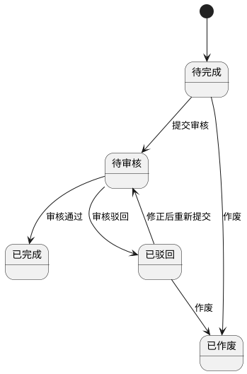

**5）状态联动规则**

1. 盘点单状态为`待审核`或`已完成`时，盘点明细默认只读。
2. 审核通过后，系统按差异方向自动生成盘盈入库或盘亏出库调整流水，并回写物料库存。
3. 已作废盘点单不参与盘点完成率、差异率、库存准确率等统计口径。
4. 审核驳回后，盘点人仅可修改被驳回单据，系统保留上一次提交版本与审核意见。
5. 同一仓库仓位存在`待完成`或`待审核`盘点单时，不允许重复新建同范围盘点单。

**6）完整正向业务流程**

1. 仓库管理员点击新增盘点表，选择盘点仓库和盘点仓位。
2. 系统生成当前库存快照，形成盘点单与盘点明细。
3. 盘点人按实物录入实际库存，可上传照片、视频或证明文件。
4. 系统自动计算差异数量、差异金额与差异率，并提示异常差异行。
5. 盘点人保存或直接提交审核。
6. 食堂负责人查看盘点单详情与差异说明，执行审核通过或驳回。
7. 审核通过后系统回写库存调整，更新盘点状态为`已完成`。

**7）完整异常业务流程**

1. 未选择盘点仓库时阻断生成盘点表。
2. 盘点范围内无库存快照数据时，提示“当前范围暂无可盘点物料”，不生成空明细。
3. 实际库存数为空、负数、格式非法时阻断提交审核。
4. 差异率超过阈值但未填写差异原因时，阻断提交审核。
5. 审核时发现盘点范围重复、快照过期或关联库存已被他人调整时，提示刷新盘点快照后重新提交。
6. 审核通过但库存回写失败时，整单回滚为`待审核`并记录失败原因，不得出现部分明细已调整的脏数据。
7. 附件上传失败时保留本地填写数据，支持重传，不影响其他明细录入。
8. 越权查看、编辑、审核时前端隐藏入口，后端统一返回403并记录日志。

**8）权限、导出与审计规则**

| 角色    | 功能权限                   | 数据范围       |
| ----- | ---------------------- | ---------- |
| 仓库管理员 | 新增、编辑、保存、提交审核、查看、导出、作废 | 本组织及授权仓库范围 |
| 食堂负责人 | 查看、审核通过、审核驳回、导出        | 本组织及授权仓库范围 |
| 系统管理员 | 全量查看、全量导出、异常纠偏         | 全组织范围      |

1. 盘点列表、详情、审核、导出均受组织、仓库、仓位数据权限控制。
2. 导出文件命名规则为`盘点历史_YYYYMMDD_HHmmss.xlsx`。
3. 新增、编辑、提交审核、审核、作废、附件上传、库存回写等关键动作必须记录审计日志。

---

### 模块3：菜谱营养管理

#### 3.1 菜谱可视化看板

**页面路径：** `菜单 → 菜谱营养管理 → 菜谱可视化看板`  
**访问权限：** `后厨主管、营养师、食堂负责人、运营管理人员`  
**页面类型：** `看板页 + 图表页 + 下钻明细页`

**1）模块概述与业务目标**

1. 本页面用于从菜谱总量、食材覆盖、营养达标、营养素结构、本周热门菜谱等维度展示菜谱库整体运行情况，支撑菜谱维护、配餐优化与经营分析。
2. 看板数据需统一来源于菜谱库主数据、菜谱计划执行数据、营养成分计算结果与评价反馈数据，保证统计口径一致。
3. 页面支持按组织、食堂、日期维度切换统计范围，并支持指标卡、图表点击下钻到菜谱列表、营养详情或排行明细。
4. 本页面仅提供查看、筛选、导出与穿透分析能力，不直接修改菜谱主数据。

**2）完整字段定义**

| 字段名      | 类型       | 长度    | 是否必填 | 默认值   | 约束规则                             | 示例                                         |
| -------- | -------- | ----- | ---- | ----- | -------------------------------- | ------------------------------------------ |
| 统计日期     | Date     | 10    | 是    | 当前业务日 | 支持按日/周/月维度切换，不支持未来日期             | `2026-04-03`                               |
| 统计维度     | Enum     | -     | 是    | 周     | 取值：日/周/月                         | `周`                                        |
| 组织ID     | String   | 1-64  | 是    | 当前组织  | 必须在数据权限范围内                       | `ORG-001`                                  |
| 食堂ID     | String   | 1-64  | 否    | 全部    | 在组织范围内可选                         | `CAN-001`                                  |
| 菜谱总数     | Integer  | 1-8位  | 是    | 0     | 当前权限范围内状态≠归档的菜谱总量                | `386`                                      |
| 食材覆盖率(%) | Decimal  | 5,2   | 是    | 0.00  | `已被菜谱引用的启用物料数/启用物料总数*100%`       | `78.45`                                    |
| 营养达标率(%) | Decimal  | 5,2   | 是    | 0.00  | `营养均衡度等级∈{良好,达标}菜谱数/有效菜谱总数*100%` | `82.30`                                    |
| 蛋白质占比(%) | Decimal  | 5,2   | 是    | 0.00  | `0-100`，营养素分布图使用                 | `28.40`                                    |
| 碳水占比(%)  | Decimal  | 5,2   | 是    | 0.00  | `0-100`，营养素分布图使用                 | `46.20`                                    |
| 脂肪占比(%)  | Decimal  | 5,2   | 是    | 0.00  | `0-100`，营养素分布图使用                 | `25.40`                                    |
| 热门菜谱排名   | Integer  | 1-2位  | 否    | 空     | 仅TOP5展示；按执行次数倒序，同次数按最近更新时间倒序     | `1`                                        |
| 热门菜谱ID   | UUID     | 36    | 否    | 空     | 关联菜谱主表                           | `REC-65f24c0d-1f21-4f7f-a4f4-8a3c9be10001` |
| 热门菜谱名称   | String   | 1-100 | 否    | 空     | 当前统计维度内执行频次前5                    | `红烧鸡块`                                     |
| 热门菜谱执行次数 | Integer  | 1-8位  | 否    | 0     | 当前维度执行总次数                        | `28`                                       |
| 热门菜谱平均评分 | Decimal  | 3,2   | 否    | 空     | 取评价模块综合评分均值                      | `4.60`                                     |
| 数据刷新时间   | DateTime | 19    | 是    | 系统时间  | 每次成功加载或刷新后更新                     | `2026-04-03 11:20:00`                      |
| 加载状态     | Enum     | -     | 是    | 加载中   | 取值：加载中/展示完成/无数据/加载失败             | `展示完成`                                     |

**3）页面结构与交互规则**

**页面结构**

1. 顶部筛选区：组织、食堂、统计维度、统计日期、查询、重置、导出。
2. 第一层指标卡：菜谱总数、食材覆盖率、营养达标率。
3. 第二层图表区：营养素分布圆环图，展示蛋白质、碳水、脂肪三类占比。
4. 第三层排行区：本周热门菜谱TOP5，展示排名、菜谱名称、执行次数、平均评分。
5. 底部明细区：支持按当前点击维度展示菜谱列表或营养不达标菜谱清单。

**关键交互规则**

1. 默认进入页面时按当前业务周加载数据；用户可切换为按日或按月查看。
2. 点击`菜谱总数`指标卡，进入菜谱库列表并自动继承当前组织、食堂、时间范围筛选。
3. 点击`食材覆盖率`指标卡，进入“被引用食材明细”页面，显示覆盖食材与未覆盖食材。
4. 点击`营养达标率`指标卡，进入营养不达标菜谱清单，仅展示当前统计范围内不达标菜谱。
5. 点击营养素圆环图任一分区，底部明细区展示对应营养素占比偏高或偏低的菜谱列表。
6. 点击热门菜谱排行行，打开菜谱详情抽屉，展示菜谱做法、食材清单、营养成分和近30天执行趋势。
7. 导出时按当前筛选范围导出看板汇总与TOP5排行，导出格式统一为`xlsx`。

**4）状态定义与状态流转**

| 状态   | 含义                 | 可执行操作       | 下一状态          |
| ---- | ------------------ | ----------- | ------------- |
| 加载中  | 首次进入或切换筛选后正在加载看板数据 | 等待          | 展示完成/无数据/加载失败 |
| 展示完成 | 数据加载完成并成功渲染        | 筛选、下钻、导出、刷新 | 加载中           |
| 无数据  | 当前筛选范围内无有效菜谱数据     | 调整筛选、重置     | 加载中           |
| 加载失败 | 查询接口或图表渲染失败        | 重试、调整筛选     | 加载中           |

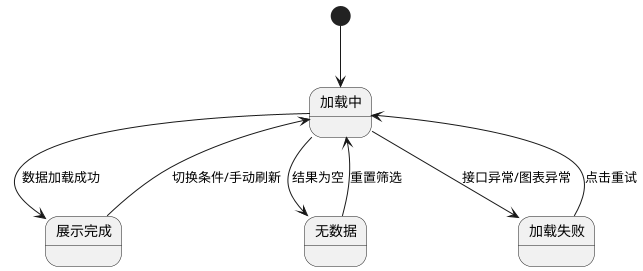

**5）状态联动规则**

1. 菜谱新增、启用、禁用、归档后，看板相关统计在下一次刷新或消息推送后自动更新。
2. 菜谱保存后若营养计算状态变更为`已完成`，则营养达标率与营养素分布数据同步刷新。
3. 评价模块中热门菜谱评分更新后，TOP5排行的平均评分需在5秒内同步更新。
4. 当前筛选维度无有效菜谱时，指标卡展示0并显示空态提示，不得延用旧缓存数据。

**6）完整正向业务流程**

1. 用户进入菜谱可视化看板，系统按默认组织、食堂和当前统计周加载看板数据。
2. 用户查看菜谱总数、食材覆盖率、营养达标率及营养素分布情况。
3. 用户通过点击指标卡或图表分区下钻查看对应菜谱明细。
4. 用户查看本周热门菜谱TOP5，并可进一步进入菜谱详情了解具体营养与执行情况。
5. 用户按当前筛选条件导出看板汇总，用于运营分析或汇报。

**7）完整异常业务流程**

1. 当前组织或食堂无菜谱数据时，页面显示“暂无菜谱数据”，并保留重置筛选入口。
2. 营养计算结果缺失时，营养达标率与营养素分布以已完成计算的数据为准，并提示“部分菜谱营养结果待计算”。
3. 图表渲染失败时，页面降级显示数值列表，不影响其他指标卡展示。
4. 数据权限不足时，越权组织或食堂数据不得返回，页面提示“无权限查看当前范围数据”。
5. 导出失败时，提示失败原因并支持重新发起导出。

**8）统计口径、导出与权限规则**

1. 菜谱总数统计口径为当前权限范围内状态不等于归档的菜谱数量。
2. 食材覆盖率统计口径为“被至少1个启用或草稿以外菜谱引用的启用物料数量/当前启用物料总数”。
3. 营养达标率统计口径以最新一次营养计算完成结果为准。
4. 热门菜谱TOP5按当前统计维度内菜谱计划执行次数排序，若无执行数据则按菜谱被计划引用次数排序。
5. 导出文件命名规则为`菜谱可视化看板_YYYYMMDD_HHmmss.xlsx`。
6. 看板查看、下钻、导出均受组织、食堂与角色数据权限控制，越权访问统一返回403并记录日志。

#### 3.2 菜谱库管理

**页面路径：** `菜单 → 菜谱营养管理 → 菜谱库管理`  
**访问权限：** `后厨主管、营养师、食堂负责人`  
**页面类型：** `列表页 + 详情抽屉 + 表单页 + 导入弹窗`

**1）模块概述与业务目标**

1. 本模块用于统一管理菜谱全生命周期，覆盖新增、编辑、删除、查询、筛选、分页、导入、导出等基础能力。
2. 本模块要求新增/编辑时完整维护菜谱名称、类别、做法、目标烹饪时长、目标温度与食材清单，确保菜谱可执行。
3. 本模块提供目标烹饪时长与目标温度的 AI 建议能力，基于菜谱与食材信息输出符合食品安全约束的参考参数。
4. 本模块在菜谱保存后自动触发营养成分计算，并在详情页展示营养结果，支撑营养评估与配餐决策。
5. 本模块与菜谱计划、烹饪计划联动，支持在删除菜谱时对未执行计划进行同步清理，保障业务数据一致。

**2）完整字段定义**

**2.1 菜谱主表字段**

| 字段名        | 类型          | 长度     | 是否必填 | 约束规则                                                                                               | 默认值   | 示例                                         |
| ---------- | ----------- | ------ | ---- | -------------------------------------------------------------------------------------------------- | ----- | ------------------------------------------ |
| 菜谱ID       | UUID        | 36     | 是    | 全局唯一，不可编辑                                                                                          | 系统生成  | `REC-65f24c0d-1f21-4f7f-a4f4-8a3c9be10001` |
| 菜谱编码       | String      | 12-32  | 是    | 全组织唯一；格式：`CP-YYYYMMDD-XXXX`                                                                        | 系统生成  | `CP-20260330-0012`                         |
| 菜谱名称       | String      | 1-100  | 是    | 同组织唯一；去首尾空格后校验                                                                                     | 无     | `红烧鸡块`                                     |
| 菜谱类别       | Enum/String | -      | 是    | 从“菜谱类别字典”选择；系统内置：主食类、热菜荤菜类、热素菜类、汤羹类、凉菜卤味类、煎炸小吃类、蒸菜类、煲仔砂锅类、半成品预制菜类、营养配餐套餐类；支持管理员新增自定义类别；仅允许选择启用状态类别 | 无     | `热菜荤菜类`                                    |
| 菜谱做法       | Text        | 1-5000 | 是    | 不得为空白文本                                                                                            | 无     | `鸡块焯水后煸炒，加调味料焖煮20分钟`                       |
| 目标烹饪时长(分钟) | Integer     | 1-4位   | 是    | `1-480`；整数                                                                                         | 无     | `35`                                       |
| 目标温度(℃)    | Decimal     | 5,1    | 是    | `30.0-300.0`；一位小数                                                                                  | 无     | `85.0`                                     |
| 食品安全约束标签   | String      | 0-200  | 否    | 系统根据食材类型自动生成                                                                                       | 空     | `含肉类，中心温度下限70℃`                            |
| AI建议批次ID   | String      | 1-64   | 否    | 最近一次 AI 建议批次标识                                                                                     | 空     | `AIMENU-20260330-0003`                     |
| AI建议状态     | Enum        | -      | 是    | 未生成/已生成未应用/部分已应用/已全部应用                                                                             | `未生成` | `已生成未应用`                                   |
| 营养计算状态     | Enum        | -      | 是    | 待计算/计算中/已完成/计算失败                                                                                   | `待计算` | `已完成`                                      |
| 营养计算时间     | DateTime    | 19     | 否    | 计算完成后自动写入                                                                                          | 空     | `2026-03-30 15:22:11`                      |
| 状态         | Enum        | -      | 是    | 草稿/启用/禁用/归档                                                                                        | `草稿`  | `启用`                                       |
| 备注         | String      | 0-500  | 否    | 长度限制                                                                                               | 空     | `适合午餐餐次`                                   |
| 版本号        | Integer     | 10     | 是    | 乐观锁版本；更新+1                                                                                         | `1`   | `4`                                        |
| 创建人        | String      | 2-50   | 是    | 只读                                                                                                 | 当前用户  | `zhangsan`                                 |
| 创建时间       | DateTime    | 19     | 是    | 只读                                                                                                 | 系统时间  | `2026-03-30 14:58:03`                      |
| 更新人        | String      | 2-50   | 是    | 只读                                                                                                 | 当前用户  | `lisi`                                     |
| 更新时间       | DateTime    | 19     | 是    | 只读                                                                                                 | 系统时间  | `2026-03-30 15:20:27`                      |

**2.2 食材清单（物料清单）字段**

| 字段名    | 类型      | 长度    | 是否必填 | 约束规则              | 默认值  | 示例                                         |
| ------ | ------- | ----- | ---- | ----------------- | ---- | ------------------------------------------ |
| 明细ID   | UUID    | 36    | 是    | 全局唯一              | 系统生成 | `RDI-13d7cfa2-0b7e-46ac-aec1-1ea48c700001` |
| 菜谱ID   | UUID    | 36    | 是    | 必须关联有效菜谱          | 无    | `REC-65f24c0d-1f21-4f7f-a4f4-8a3c9be10001` |
| 排序号    | Integer | 1-5位  | 是    | 从1开始递增，可调整        | `1`  | `2`                                        |
| 物料ID   | String  | 36    | 是    | 必须来自物料主数据且状态=启用   | 无    | `MAT-000321`                               |
| 物料名称   | String  | 1-100 | 是    | 由物料ID带出           | 自动带出 | `鸡腿肉`                                      |
| 规格ID   | String  | 36    | 是    | 必须属于所选物料          | 无    | `SPEC-500G`                                |
| 规格名称   | String  | 1-100 | 是    | 由规格ID带出           | 自动带出 | `500g/份`                                   |
| 物料单位   | String  | 1-20  | 是    | 选择规格后自动带出，不允许手工修改 | 自动带出 | `份`                                        |
| 食材类型   | String  | 1-50  | 否    | 由物料类别映射，供 AI 建议使用 | 自动带出 | `肉类`                                       |
| 所需食材数量 | Decimal | 18,3  | 是    | `>0` 且精度≤3位小数     | 无    | `2.500`                                    |
| 行备注    | String  | 0-200 | 否    | 长度限制              | 空    | `切块备用`                                     |

**2.3 营养成分结果字段（自动计算）**

| 字段名       | 类型       | 长度    | 是否必填 | 约束规则     | 默认值    | 示例                                         |
| --------- | -------- | ----- | ---- | -------- | ------ | ------------------------------------------ |
| 结果ID      | UUID     | 36    | 是    | 全局唯一     | 系统生成   | `NUT-90fd52dc-44f7-4fca-9b2f-4ce5fcf70001` |
| 菜谱ID      | UUID     | 36    | 是    | 关联菜谱主表   | 无      | `REC-65f24c0d-1f21-4f7f-a4f4-8a3c9be10001` |
| 总热量(kcal) | Decimal  | 18,2  | 是    | `>=0`    | `0.00` | `1260.50`                                  |
| 总蛋白质(g)   | Decimal  | 18,2  | 是    | `>=0`    | `0.00` | `82.40`                                    |
| 总脂肪(g)    | Decimal  | 18,2  | 是    | `>=0`    | `0.00` | `46.20`                                    |
| 总碳水(g)    | Decimal  | 18,2  | 是    | `>=0`    | `0.00` | `58.70`                                    |
| 维生素含量摘要   | String   | 0-500 | 否    | 由营养库汇总生成 | 空      | `维生素A:0.42mg; 维生素C:22.1mg`                 |
| 计算版本      | String   | 1-32  | 是    | 营养模型版本号  | 当前版本   | `NUT-V3`                                   |
| 计算时间      | DateTime | 19    | 是    | 自动写入     | 系统时间   | `2026-03-30 15:22:11`                      |
| 计算状态      | Enum     | -     | 是    | 成功/失败    | `成功`   | `成功`                                       |
| 失败原因      | String   | 0-500 | 否    | 失败时必填    | 空      | `缺少规格营养基准数据`                               |

**2.4 AI 烹饪参数建议字段**

| 字段名          | 类型       | 长度    | 是否必填 | 约束规则                     | 默认值  | 示例                                         |
| ------------ | -------- | ----- | ---- | ------------------------ | ---- | ------------------------------------------ |
| 建议ID         | UUID     | 36    | 是    | 全局唯一                     | 系统生成 | `AIS-3f4fa8f8-5a52-45ea-b1e8-9cf1bd880001` |
| 建议批次ID       | String   | 1-64  | 是    | 同一次点击生成同一批次              | 无    | `AIMENU-20260330-0003`                     |
| 菜谱ID         | UUID     | 36    | 是    | 关联菜谱主表                   | 无    | `REC-65f24c0d-1f21-4f7f-a4f4-8a3c9be10001` |
| 建议目标烹饪时长(分钟) | Integer  | 1-4位  | 是    | `1-480`                  | 无    | `38`                                       |
| 建议目标温度(℃)    | Decimal  | 5,1   | 是    | `30.0-300.0`，且满足食品安全下限约束 | 无    | `82.0`                                     |
| 安全下限温度(℃)    | Decimal  | 5,1   | 否    | 按食材类型规则自动判定              | 空    | `70.0`                                     |
| 建议依据摘要       | String   | 1-500 | 是    | 含菜谱名称、做法、食材类型、规则命中说明     | 无    | `含肉类食材，按中心温度≥70℃约束推荐`                      |
| 建议置信度        | Decimal  | 5,2   | 否    | `0-100`                  | 空    | `87.60`                                    |
| 生成时间         | DateTime | 19    | 是    | 自动写入                     | 系统时间 | `2026-03-30 15:05:18`                      |

**3）页面结构与交互规则**

**页面结构**

1. 顶部区域：菜谱名称关键字、菜谱类别、状态、更新时间筛选；新增、导入、导出按钮。
2. 中部区域：菜谱列表，展示菜谱名称、类别、目标烹饪时长、目标温度、营养摘要、状态、更新时间、操作。
3. 右侧详情抽屉：基础信息、食材清单、营养成分、AI建议记录、关联计划信息、操作日志。
4. 表单区域：基础信息表单 + 食材清单可编辑表格 + AI建议区 + 保存/提交操作区。

**按钮显隐与操作前置条件**

| 按钮       | 可见角色           | 显示条件          | 操作前置条件          | 执行结果      |
| -------- | -------------- | ------------- | --------------- | --------- |
| 新增菜谱     | 后厨主管、营养师       | 有新增权限         | 无               | 新建草稿      |
| 编辑       | 后厨主管、营养师       | 状态∈{草稿,启用,禁用} | 非归档且在权限范围内      | 进入编辑页     |
| 删除       | 后厨主管           | 非归档           | 无执行中/已执行烹饪任务关联  | 删除并执行联动规则 |
| 启用       | 后厨主管、食堂负责人     | 状态∈{草稿,禁用}    | 字段校验通过          | 状态变更为启用   |
| 禁用       | 后厨主管、食堂负责人     | 状态=启用         | 无执行中烹饪任务关联      | 状态变更为禁用   |
| 归档       | 后厨主管、食堂负责人     | 状态∈{草稿,禁用,启用} | 无执行中烹饪任务关联      | 状态变更为归档   |
| AI建议（时长） | 后厨主管、营养师       | 表单编辑态         | 已填写菜谱名称、做法、食材清单 | 返回时长建议    |
| AI建议（温度） | 后厨主管、营养师       | 表单编辑态         | 已填写菜谱名称、做法、食材清单 | 返回温度建议    |
| 应用AI建议   | 后厨主管、营养师       | 已生成AI建议       | 建议结果有效且版本一致     | 回填时长/温度   |
| 导入       | 后厨主管、营养师       | 有导入权限         | 模板校验通过          | 批量导入      |
| 导出       | 后厨主管、营养师、食堂负责人 | 有导出权限         | 无               | 导出当前筛选结果  |

**AI 建议交互规则**

1. `AI建议`按钮分别展示在“目标烹饪时长”“目标温度”字段右侧。
2. 点击后进入加载态：按钮禁用并显示`生成中...`，超时30秒提示“建议生成超时，请重试”。
3. 返回结果展示建议时长、建议温度、安全下限温度、建议依据摘要、置信度。
4. 建议仅作参考，不自动覆盖输入值；仅在点击“应用AI建议”后回填字段。
5. 回填后用户可继续手工修改，不影响后续保存。

**食材清单交互规则**

1. 食材行支持新增、删除、修改、拖拽排序。
2. 物料从基础资料选择；选择物料后联动规格下拉；选择规格后自动带出单位。
3. 用户只需输入所需食材数量；数量变更实时触发行校验。
4. 同一菜谱内“物料+规格”禁止重复。
5. 删除食材行后自动重排排序号并刷新汇总。

**自动带出与校验规则**

1. 物料单位由规格主数据带出，禁止手改。
2. 含肉类食材时，AI建议温度不得低于70℃（食品安全下限）。
3. 目标烹饪时长、目标温度必须为正值，且在可配置区间内。
4. 食材清单至少保留1行，且每行数量必须大于0。

**4）状态定义与状态流转**

**状态定义**

| 状态  | 含义           | 可编辑性       | 可被计划选择 |
| --- | ------------ | ---------- | ------ |
| 草稿  | 新建或未启用菜谱     | 可编辑        | 否      |
| 启用  | 可正常用于菜谱计划    | 可编辑（受联动限制） | 是      |
| 禁用  | 临时停用，不可用于新计划 | 可编辑（受联动限制） | 否      |
| 归档  | 历史归档，不参与业务   | 不可编辑       | 否      |

**状态流转图**

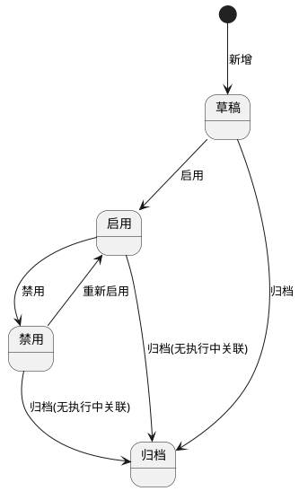

**5）状态联动与执行中计划控制逻辑**

1. 启用状态菜谱可被“菜谱计划管理”选择；禁用/归档状态不可被新计划选择。
2. 菜谱已关联执行中烹饪任务时，不允许删除、禁用、归档。
3. 菜谱已关联未执行烹饪任务（待烹饪）时，允许删除；删除后系统同步删除该任务中的对应菜谱项并重算任务汇总。
4. 菜谱已关联暂存/待审核菜谱计划时，删除后同步删除计划中的对应菜谱项并重算计划营养与人数汇总。
5. 菜谱计划审核通过后自动生成烹饪计划任务，任务带入菜谱目标时长、目标温度和食材清单快照。

**6）完整正向业务流程**

1. 用户进入菜谱库管理列表，按条件查询目标菜谱。
2. 点击“新增菜谱”，填写菜谱名称、类别、做法、目标时长、目标温度。
3. 在食材清单中新增明细行，选择物料与规格，系统自动带出单位，用户填写数量并完成排序。
4. 用户点击时长/温度旁“AI建议”，系统按菜谱名称、做法、食材类型和食品安全标准生成建议。
5. 用户查看建议结果并可点击“应用AI建议”回填目标时长与温度，必要时手工微调。
6. 用户保存菜谱后，系统自动触发营养成分计算任务。
7. 计算成功后在菜谱详情展示热量、蛋白质、脂肪、碳水及维生素摘要。
8. 用户将启用状态菜谱用于菜谱计划选择。
9. 菜谱计划审核通过后，系统自动生成烹饪计划任务供厨师执行。
10. 用户删除菜谱时，系统按关联状态执行同步删除或拦截，并记录审计日志。

**7）完整异常业务流程**

1. 必填项为空（名称、类别、做法、目标时长、目标温度、食材清单）时，阻断保存并高亮字段。
2. 食材重复（同物料+规格）时，阻断保存并提示冲突行号。
3. 食材数量非法（<=0、超精度、非数字）时，阻断保存。
4. 物料已禁用、规格不合法、单位带出失败时，阻断提交。
5. AI建议输入信息不足时，提示缺失项并不发起计算。
6. AI无数据可推荐或服务异常时，提示“无法生成建议”，允许手工录入并继续保存。
7. AI返回温度不满足食品安全下限时，结果标记不可应用并提示原因。
8. 营养计算失败时，菜谱保存成功但`营养计算状态=计算失败`，展示失败原因并支持重试。
9. 删除菜谱时，如存在执行中/已执行烹饪任务引用，阻断删除并返回关联任务编号。
10. 删除菜谱联动清理未执行任务失败时，整单事务回滚，菜谱不删除并返回失败原因。
11. 导入过程中模板不合法、字段缺失、引用物料不存在时，逐行失败并返回错误清单。
12. 权限不足用户执行新增、编辑、删除、启禁用、导入导出、AI建议时，统一返回403并留痕。
13. 并发编辑导致版本冲突时，阻断保存并提示刷新后重试。
14. 重复提交导致重复创建时，系统按幂等键拦截。

**8）唯一性校验、关联关系、导入导出规则、权限控制**

**唯一性校验**

1. 菜谱编码全组织唯一。
2. 菜谱名称同组织唯一（去首尾空格后比较）。
3. 同一菜谱内`物料ID + 规格ID`唯一。
4. 同一`AI建议批次ID + 菜谱ID`唯一，避免重复应用。

**关联关系规则**

1. 菜谱主表与食材清单为一对多关系。
2. 菜谱与营养成分结果为一对一关系（按版本保留历史结果）。
3. 菜谱与菜谱计划明细为一对多关系。
4. 菜谱计划审核通过后，菜谱与烹饪计划任务建立引用快照关系。
5. 删除菜谱时，对未执行烹饪任务执行同步删除；对执行中/已执行任务执行拦截。

**导入规则**

1. 支持 `xlsx` 模板导入，模板包含菜谱主信息与食材明细。
2. 单文件≤10MB，单次导入≤3000行明细。
3. 通过“菜谱编码/名称”聚合主从数据；导入后默认状态为草稿。
4. 支持部分成功，失败行返回“行号+字段+错误原因”。

**导出规则**

1. 支持按当前筛选条件导出列表与详情。
2. 导出格式支持 `xlsx/csv`。
3. 导出字段包含菜谱基础信息、烹饪参数、食材明细、营养成分、状态。
4. 导出受数据权限控制，越权数据不导出。

**权限控制与数据范围**

| 角色    | 功能权限                                 | 数据范围     |
| ----- | ------------------------------------ | -------- |
| 后厨主管  | 新增、编辑、删除、启用/禁用/归档、查询、导入、导出、AI建议、应用建议 | 本组织及授权组织 |
| 营养师   | 新增、编辑、查询、导入、导出、AI建议、应用建议、营养重算        | 本组织及授权组织 |
| 食堂负责人 | 查询、启用/禁用/归档、导出、查看营养与联动记录             | 本组织及授权组织 |

**权限实现规则**

1. 前端按角色与状态控制菜单、按钮、字段可编辑性。
2. 后端执行“功能权限+数据权限+状态权限”三重校验，越权统一返回403。
3. 新增、编辑、删除、状态切换、导入导出、AI建议应用、联动删除、营养重算全量审计留痕。

**9）菜谱类别字典管理规则**

**系统内置菜谱类别**

1. 主食类、热菜荤菜类、热素菜类、汤羹类、凉菜卤味类、煎炸小吃类、蒸菜类、煲仔砂锅类、半成品预制菜类、营养配餐套餐类。
2. 系统支持管理员新增自定义菜谱类别，用于补充地方特色菜、节庆套餐、定制功能餐等场景。
3. 系统内置菜谱类别不允许删除；自定义菜谱类别仅在禁用且无菜谱、计划、AI推荐引用时允许删除。

**字典字段定义**

| 字段名  | 类型      | 长度    | 是否必填 | 约束规则               | 默认值   | 示例             |
| ---- | ------- | ----- | ---- | ------------------ | ----- | -------------- |
| 类别ID | UUID    | 36    | 是    | 全局唯一，不可编辑          | 系统生成  | `RECCAT-0001`  |
| 类别名称 | String  | 2-50  | 是    | 唯一；系统内置名称不可修改      | 无     | `热菜荤菜类`        |
| 类别编码 | String  | 2-50  | 是    | 唯一；系统内置编码不可修改      | 无     | `REC_MEAT_HOT` |
| 类别来源 | Enum    | -     | 是    | 系统内置/自定义           | `自定义` | `系统内置`         |
| 状态   | Enum    | -     | 是    | 启用/禁用              | `启用`  | `启用`           |
| 排序号  | Integer | 1-5位  | 是    | 0-99999            | `0`   | `15`           |
| 引用数量 | Integer | 1-8位  | 是    | 自动统计菜谱、计划、推荐方案引用总数 | `0`   | `56`           |
| 备注   | String  | 0-200 | 否    | 可为空                | 空     | `适用于中式热荤菜`     |

**交互规则**

1. 菜谱库管理列表筛选区、菜谱新增/编辑表单、导入模板统一使用“菜谱类别字典”。
2. 系统管理员可进入“菜谱类别管理”弹窗，新增自定义类别、编辑自定义类别、调整排序、启用/禁用。
3. 系统内置类别仅允许修改排序号、状态、备注；名称与编码只读，不显示删除按钮。
4. 禁用类别不再允许新建菜谱、编辑菜谱变更为该类别，也不参与新的 AI 推荐方案生成；历史菜谱、历史计划与报表保留原类别展示。
5. 类别排序变更后，菜谱列表、下拉框、推荐结果分组、看板统计的展示顺序同步刷新。

**状态定义与状态流转**

| 状态  | 定义                       | 业务联动     | 可删除性         |
| --- | ------------------------ | -------- | ------------ |
| 启用  | 可被菜谱新增/编辑/导入、计划筛选、AI推荐使用 | 正常参与业务   | 不允许删除        |
| 禁用  | 不可被新建与新推荐使用，历史数据保留       | 仅历史展示与统计 | 仅自定义且无引用允许删除 |

```plantuml
@startuml
[*] --> 启用
启用 --> 禁用 : 管理员禁用
禁用 --> 启用 : 管理员启用
禁用 --> 已删除 : 自定义且引用数量=0
已删除 --> [*]
@enduml
```

**正向业务流程**

1. 系统初始化加载全部内置菜谱类别并默认启用。
2. 系统管理员按业务需要新增自定义类别并设置排序。
3. 后厨主管、营养师新增或编辑菜谱时选择启用状态类别。
4. 类别状态调整后，菜谱表单、筛选器、AI推荐范围实时刷新。
5. 自定义类别停用且无引用后，管理员可删除该类别并保留审计日志。

**异常业务流程**

1. 类别名称或编码重复时，阻断保存。
2. 删除系统内置菜谱类别时，前端隐藏删除按钮，后端统一拦截。
3. 自定义类别仍被菜谱、菜谱计划或推荐方案引用时，删除被阻断并返回关联数量。
4. 已禁用类别被旧表单、导入文件或复制菜谱带入时，后端校验失败并提示刷新后重试。
5. 无字典维护权限用户执行新增、编辑、禁用、删除类别时，返回403并记录审计日志。

**10）菜谱删除、禁用与启用补充规则**

**10.1 适用范围与补充说明**

1. 本补充规则仅新增菜谱删除前置校验、删除失败统一提示、删除后业务约束、菜谱禁用前置校验、禁用后业务约束及菜谱重新启用规则，不改动本章节原有字段、页面结构、状态流转图、AI建议、营养计算、类别字典、导入导出及原有基础交互正文。
2. 原章节中关于菜谱删除后同步清理未执行任务、未生效计划明细的描述，仅在本补充规则全部校验通过且确认当前菜谱从未被任何菜谱计划、食材出库、食材消耗及后续业务数据引用时，方可进入原有删除执行链路；若命中任一新增删除拦截条件，则本补充规则优先阻断删除，不再执行原有联动清理动作。
3. 本补充规则中的“重新启用”场景，仅适用于当前状态为`禁用`的菜谱重新恢复使用；草稿状态首次启用仍按本章节原有启用流程执行，不属于本补充规则的“重新启用”范围。
4. 本补充规则所有前置校验均要求前后端口径一致；前端用于交互提示，后端用于最终强校验，禁止仅依赖前端缓存结果放行。

**10.2 菜谱删除补充规则**

1. 用户在菜谱列表或详情抽屉中触发删除操作时，系统沿用本章节原有删除入口与页面交互，不新增新的业务字段和页面流程节点。
2. 删除请求提交前，系统必须自动执行菜谱删除前置校验；仅当全部删除校验条件同时满足时，方可继续执行删除。
3. 删除校验条件如下，任一条件不满足均禁止删除：
   该菜谱从未被菜谱计划单据引用；
   无基于该菜谱产生的食材出库记录、食材消耗流水；
   无任何后续业务流转及关联数据。
4. 删除动作成功后，系统按既有删除链路完成数据移除与界面刷新；删除动作失败时，不得出现列表已删除但详情仍可见、选择器未刷新、审计未留痕等中间态。

**10.3 菜谱删除前置校验明细**

| 校验项           | 校验规则                            | 校验范围说明                                                                      | 不通过时提示文案                              | 处理方式 |
| ------------- | ------------------------------- | --------------------------------------------------------------------------- | ------------------------------------- | ---- |
| 菜谱计划引用校验      | 删除前系统自动校验该菜谱从未被任何菜谱计划单据引用       | 必须覆盖菜谱计划主单、餐次菜谱明细、调整申请单、调整前后版本快照、已驳回/已调整/历史归档快照等全部历史与当前引用记录；只要存在任一引用即视为已被引用 | 该菜谱已被菜谱计划、食材出库或台账数据引用，为保证数据可追溯，不允许删除。 | 阻断删除 |
| 食材出库与食材消耗校验   | 删除前系统自动校验无基于该菜谱产生的食材出库记录、食材消耗流水 | 必须覆盖领用出库、备料出库、烹饪物料消耗快照、食材消耗流水、库存扣减回写、成本分摊快照等与该菜谱直接或间接关联的消耗数据                | 该菜谱已被菜谱计划、食材出库或台账数据引用，为保证数据可追溯，不允许删除。 | 阻断删除 |
| 后续业务流转与关联数据校验 | 删除前系统自动校验该菜谱无任何后续业务流转及关联数据      | 必须覆盖烹饪任务、留样/销样关联、食安台账、食材溯源链、监管看板引用、评价/投诉关联快照、证据链编号关联等全部后续数据；命中任一记录即禁止删除     | 该菜谱已被菜谱计划、食材出库或台账数据引用，为保证数据可追溯，不允许删除。 | 阻断删除 |

**10.4 菜谱删除失败提示规则**

1. 删除校验任一条件不满足时，系统统一弹出删除失败提示弹窗。
2. 弹窗标题：`菜谱删除失败`
3. 弹窗正文统一为：`该菜谱已被菜谱计划、食材出库或台账数据引用，为保证数据可追溯，不允许删除。`
4. 弹窗按钮仅展示`我知道了`，不允许继续提交删除。
5. 删除失败后，当前筛选条件、分页位置、详情抽屉状态保持不变；详细命中原因用于接口返回和审计日志记录，不要求在页面弹窗逐条展开。

**10.5 菜谱删除后业务约束**

1. 菜谱删除成功后，菜谱信息从系统中移除，后续所有业务单据、下拉选择器、引用弹窗中不再展示该菜谱。
2. 删除前已校验无任何业务数据关联，不会造成溯源断链、统计异常、脏数据问题。
3. 菜谱删除后数据不可恢复；后续如需复用，必须重新新建菜谱。
4. 菜谱删除不影响系统食材消耗核算、成本统计、食安台账相关数据。
5. 删除成功与删除失败均必须记录审计日志，日志需包含操作者、操作时间、命中校验项、来源终端与结果。

**10.6 菜谱禁用补充规则**

1. 用户在菜谱列表或详情抽屉中对状态为`启用`的菜谱执行禁用操作时，系统沿用本章节原有禁用入口与状态流转逻辑，不新增新的字段和流程节点。
2. 禁用前系统自动校验当前菜谱不存在进行中、未完成、待执行的菜谱计划单据，且不存在待消耗未闭环业务。
3. 若存在未完结菜谱计划或待消耗未闭环业务，系统必须禁止禁用，并弹出统一提示弹窗：`该菜谱存在未完成的菜谱计划业务，不允许禁用，请先处理完相关业务后再操作。`
4. 菜谱禁用成功后，状态更新为`禁用`，并立即联动影响后续业务选择范围与编辑权限。

**10.7 菜谱禁用前置校验明细**

| 校验项        | 校验规则                              | 校验范围说明                                                                                                   | 不通过时提示文案                             | 处理方式 |
| ---------- | --------------------------------- | -------------------------------------------------------------------------------------------------------- | ------------------------------------ | ---- |
| 未完结菜谱计划校验  | 禁用前系统自动校验该菜谱不存在进行中、未完成、待执行的菜谱计划单据 | 必须覆盖状态为`草稿`、`待审核`、`已审核`、`已生效`、`调整中`的计划引用，以及状态为`已调整`但仍存在未来待执行餐次、未完成执行链路的计划；只要菜谱计划明细仍引用当前菜谱且业务未闭环，即视为未完结计划 | 该菜谱存在未完成的菜谱计划业务，不允许禁用，请先处理完相关业务后再操作。 | 阻断禁用 |
| 待消耗未闭环业务校验 | 禁用前系统自动校验无待消耗未闭环业务                | 必须覆盖基于该菜谱生成的待烹饪/烹饪中任务、待领用出库、领用未回写、食材消耗快照未闭环、留样/销样前置消耗链未闭环等业务；命中任一记录均禁止禁用                                 | 该菜谱存在未完成的菜谱计划业务，不允许禁用，请先处理完相关业务后再操作。 | 阻断禁用 |

**10.8 菜谱禁用后业务约束**

1. 菜谱禁用后，菜谱状态更新为【禁用】。
2. 后续新增菜谱计划时，系统不再展示该菜谱，无法选用该菜谱新建业务。
3. 历史已生成的菜谱计划、食材出库消耗、食安台账、溯源记录全部保留，正常查看、展示，不受任何影响。
4. 菜谱禁用后，禁止编辑菜谱基础信息和食材配比信息；若页面仍保留原有编辑入口，则进入页面后仅允许查看，不允许修改、保存、提交、应用AI建议或变更食材明细。
5. 已禁用菜谱支持后续重新启用；重新启用成功后按本补充规则恢复可用能力。
6. 禁用成功与禁用失败均必须记录审计日志，日志需包含操作者、状态变化前后值、命中校验项与来源终端。

**10.9 菜谱重新启用规则**

1. 仅当前状态为【禁用】的菜谱可执行重新启用操作。
2. 重新启用时不校验任何历史业务数据、单据数据，仅校验状态合法性、操作权限与当前记录是否真实存在。
3. 若菜谱当前状态不为`禁用`，系统必须阻断重新启用请求，并提示当前状态不允许执行重新启用。
4. 重新启用成功后，菜谱状态恢复为【启用】，恢复原有编辑权限与业务选用权限，可正常用于新建菜谱计划。
5. 所有历史业务数据、食材出库消耗、食安台账及溯源信息保持不变，不因重新启用发生回写、重算或清理。

**10.10 边界场景与并发控制规则**

1. 删除前前端校验通过后至服务端提交期间，若系统新增了菜谱计划引用、食材出库记录、食材消耗流水或其他后续关联数据，后端必须按最新数据重新校验并阻断删除。
2. 禁用前前端校验通过后至服务端提交期间，若系统新增了未完结计划、待执行任务、待消耗未闭环业务，后端必须按最新数据重新校验并阻断禁用。
3. 重新启用前若当前记录状态已被其他用户更新为`启用`、`归档`或已删除，后端必须按最新状态阻断本次启用。
4. 删除、禁用、重新启用操作均需具备幂等性；重复提交不得导致重复删除、重复状态变更或重复审计成功记录。
5. 所有前置校验失败均不得产生部分成功的中间态；列表、详情、选择器、统计与日志结果必须保持一致。

#### 3.3 菜谱计划管理

**页面路径：** `菜单 → 菜谱营养管理 → 菜谱计划管理`  
**访问权限：** `后厨主管、营养师、食堂负责人`  
**页面类型：** `列表页 + 详情抽屉 + 表单页 + 审核页 + 调整申请页`

**1）模块概述与业务目标**

1. 本模块用于管理菜谱计划全流程，覆盖新增、编辑、删除、查询、筛选、分页、导出及审核生效。
2. 本模块支持按日/周/月维度制定计划，并按餐次维护菜谱组合与人数，自动完成食材总用量计算。
3. 本模块支持 AI 营养分析与 AI 菜谱推荐，输出营养评估报告并支持一键应用推荐方案。
4. 本模块在计划审核通过后自动生成烹饪任务，保障后厨执行链路闭环。
5. 本模块支持已生效计划发起调整申请并重新审核，审核通过后自动同步更新未执行烹饪任务与版本记录。

**2）完整字段定义**

**2.1 菜谱计划主表字段**

| 字段名      | 类型       | 长度    | 是否必填 | 约束规则                                  | 默认值   | 示例                                        |
| -------- | -------- | ----- | ---- | ------------------------------------- | ----- | ----------------------------------------- |
| 计划ID     | UUID     | 36    | 是    | 全局唯一                                  | 系统生成  | `MP-5f1a6f9d-2c60-41ab-a9ea-c2d4f4700001` |
| 计划编号     | String   | 16-32 | 是    | 全组织唯一，格式：`CPJH-YYYYMMDD-XXXX`         | 系统生成  | `CPJH-20260330-0008`                      |
| 计划名称     | String   | 1-100 | 是    | 同组织内可重复但建议唯一命名                        | 无     | `4月第1周菜谱计划`                               |
| 计划维度     | Enum     | -     | 是    | 日/周/月                                 | `日`   | `周`                                       |
| 计划开始日期   | Date     | 10    | 是    | `<=计划结束日期`；周维度跨度7天；月维度不可跨月            | 无     | `2026-04-01`                              |
| 计划结束日期   | Date     | 10    | 是    | 日维度必须等于开始日期                           | 无     | `2026-04-07`                              |
| 计划组织ID   | String   | 36    | 是    | 必须在数据权限范围内                            | 当前组织  | `ORG-10001`                               |
| 计划状态     | Enum     | -     | 是    | 草稿/待审核/已审核/已生效/已调整/已驳回/调整中            | `草稿`  | `待审核`                                     |
| 调整状态     | Enum     | -     | 是    | 未发起/待审核/已通过/已驳回                       | `未发起` | `待审核`                                     |
| 菜品数量     | Integer  | 1-6位  | 是    | 自动汇总，`>=0`                            | `0`   | `18`                                      |
| 计划总用餐人数  | Integer  | 1-6位  | 是    | 自动汇总各餐次人数，`>=0`                       | `0`   | `1260`                                    |
| 审核人      | String   | 2-50  | 否    | 审核通过/驳回时写入                            | 空     | `wangwu`                                  |
| 审核时间     | DateTime | 19    | 否    | 审核动作发生时写入                             | 空     | `2026-03-30 17:12:05`                     |
| 审核意见     | String   | 0-500 | 否    | 驳回时必填                                 | 空     | `营养达标，同意生效`                               |
| 生效时间     | DateTime | 19    | 否    | 生成烹饪任务成功后写入                           | 空     | `2026-03-30 17:12:21`                     |
| 烹饪任务批次号  | String   | 1-64  | 否    | 生效后生成                                 | 空     | `COOK-BATCH-20260330-0012`                |
| 计划追溯链编号  | String   | 1-64  | 是    | 计划审核通过后生成；用于串联领用出库、烹饪、留样、销样、评价申诉与监管追溯 | 系统生成  | `TPL-20260330-0008`                       |
| AI营养分析状态 | Enum     | -     | 是    | 未分析/分析中/已完成/分析失败                      | `未分析` | `已完成`                                     |
| AI推荐状态   | Enum     | -     | 是    | 未推荐/推荐中/已完成/推荐失败                      | `未推荐` | `已完成`                                     |
| 当前版本号    | Integer  | 1-10位 | 是    | 初始1，调整审核通过后+1                         | `1`   | `3`                                       |
| 来源版本号    | Integer  | 1-10位 | 否    | 调整单记录源版本                              | 空     | `2`                                       |
| 备注       | String   | 0-500 | 否    | 长度限制                                  | 空     | `周末增加清淡菜品`                                |
| 创建人      | String   | 2-50  | 是    | 只读                                    | 当前用户  | `zhangsan`                                |
| 创建时间     | DateTime | 19    | 是    | 只读                                    | 系统时间  | `2026-03-30 16:22:13`                     |
| 更新人      | String   | 2-50  | 是    | 只读                                    | 当前用户  | `lisi`                                    |
| 更新时间     | DateTime | 19    | 是    | 只读                                    | 系统时间  | `2026-03-30 16:58:41`                     |

**2.2 餐次表字段**

| 字段名    | 类型      | 长度    | 是否必填 | 约束规则            | 默认值    | 示例                                          |
| ------ | ------- | ----- | ---- | --------------- | ------ | ------------------------------------------- |
| 餐次ID   | UUID    | 36    | 是    | 全局唯一            | 系统生成   | `MEAL-4a2f820a-2ce4-4d8f-b76d-f91d5f800001` |
| 计划ID   | UUID    | 36    | 是    | 必须关联有效计划        | 无      | `MP-5f1a6f9d-2c60-41ab-a9ea-c2d4f4700001`   |
| 餐次类型   | Enum    | -     | 是    | 早餐/午餐/晚餐/自定义    | 无      | `早餐`                                        |
| 餐次名称   | String  | 1-30  | 是    | 同计划内唯一          | 无      | `加餐`                                        |
| 是否基础餐次 | Boolean | -     | 是    | 早餐/午餐/晚餐为`true` | `true` | `false`                                     |
| 排序号    | Integer | 1-5位  | 是    | 从1开始，支持调整       | `1`    | `4`                                         |
| 用餐人数   | Integer | 1-6位  | 是    | `>0` 且为整数       | 无      | `320`                                       |
| 餐次备注   | String  | 0-200 | 否    | 长度限制            | 空      | `低糖人群优先`                                    |

**2.3 餐次菜谱明细字段**

| 字段名     | 类型      | 长度     | 是否必填 | 约束规则           | 默认值     | 示例                                          |
| ------- | ------- | ------ | ---- | -------------- | ------- | ------------------------------------------- |
| 餐次菜谱行ID | UUID    | 36     | 是    | 全局唯一           | 系统生成    | `MR-2f218dc8-a0b8-4661-b2d5-a03b2e9f0001`   |
| 餐次ID    | UUID    | 36     | 是    | 关联餐次表          | 无       | `MEAL-4a2f820a-2ce4-4d8f-b76d-f91d5f800001` |
| 菜谱ID    | UUID    | 36     | 是    | 必须来自菜谱库且状态=启用  | 无       | `REC-65f24c0d-1f21-4f7f-a4f4-8a3c9be10001`  |
| 菜谱名称快照  | String  | 1-100  | 是    | 选中菜谱后自动回填      | 自动带出    | `红烧鸡块`                                      |
| 菜谱做法快照  | Text    | 1-5000 | 是    | 选中菜谱后自动回填      | 自动带出    | `焯水后焖煮`                                     |
| 是否AI推荐  | Boolean | -      | 是    | AI推荐应用写入`true` | `false` | `true`                                      |
| 预估成本(元) | Decimal | 18,2   | 否    | 自动汇总食材成本       | `0.00`  | `560.80`                                    |
| 行备注     | String  | 0-200  | 否    | 长度限制           | 空       | `儿童人群减盐`                                    |

**2.4 食材快照明细字段（自动带出）**

| 字段名     | 类型      | 长度    | 是否必填 | 约束规则               | 默认值  | 示例                                         |
| ------- | ------- | ----- | ---- | ------------------ | ---- | ------------------------------------------ |
| 食材快照ID  | UUID    | 36    | 是    | 全局唯一               | 系统生成 | `ING-1652ef7f-ae4f-4e95-8398-2f729a5f0001` |
| 餐次菜谱行ID | UUID    | 36    | 是    | 关联餐次菜谱明细           | 无    | `MR-2f218dc8-a0b8-4661-b2d5-a03b2e9f0001`  |
| 物料ID    | String  | 36    | 是    | 从菜谱库自动带出           | 自动带出 | `MAT-000321`                               |
| 物料名称    | String  | 1-100 | 是    | 自动带出               | 自动带出 | `鸡腿肉`                                      |
| 规格ID    | String  | 36    | 是    | 自动带出               | 自动带出 | `SPEC-500G`                                |
| 规格名称    | String  | 1-100 | 是    | 自动带出               | 自动带出 | `500g/份`                                   |
| 单位      | String  | 1-20  | 是    | 自动带出，不可编辑          | 自动带出 | `份`                                        |
| 单人用量    | Decimal | 18,3  | 是    | `>0`，来自菜谱库         | 自动带出 | `0.080`                                    |
| 餐次用餐人数  | Integer | 1-6位  | 是    | 来自餐次人数             | 自动带出 | `320`                                      |
| 总用量     | Decimal | 18,3  | 是    | 自动计算=`单人用量×餐次用餐人数` | 自动计算 | `25.600`                                   |
| 库存状态    | Enum    | -     | 否    | 库存不足/库存充足          | 自动计算 | `库存不足`                                     |

**2.5 AI营养分析报告字段**

| 字段名       | 类型       | 长度     | 是否必填 | 约束规则            | 默认值    | 示例                                         |
| --------- | -------- | ------ | ---- | --------------- | ------ | ------------------------------------------ |
| 报告ID      | UUID     | 36     | 是    | 全局唯一            | 系统生成   | `NAR-9db46d35-8a88-4ef9-bf8f-a0f47d210001` |
| 计划ID      | UUID     | 36     | 是    | 关联菜谱计划          | 无      | `MP-5f1a6f9d-2c60-41ab-a9ea-c2d4f4700001`  |
| 人群画像      | Enum     | -      | 是    | 老人/儿童/病人/通用     | `通用`   | `老人`                                       |
| 健康状况标签    | String   | 0-200  | 否    | 多值：糖尿病/高血压/高血脂等 | 空      | `高血压,糖尿病`                                  |
| 总蛋白质(g)   | Decimal  | 18,2   | 是    | `>=0`           | `0.00` | `1820.30`                                  |
| 总碳水(g)    | Decimal  | 18,2   | 是    | `>=0`           | `0.00` | `3560.80`                                  |
| 总脂肪(g)    | Decimal  | 18,2   | 是    | `>=0`           | `0.00` | `940.50`                                   |
| 总热量(kcal) | Decimal  | 18,2   | 是    | `>=0`           | `0.00` | `28560.00`                                 |
| 营养均衡度评分   | Decimal  | 5,2    | 是    | `0-100`         | `0.00` | `86.40`                                    |
| AI优化建议    | String   | 0-2000 | 否    | 文本建议            | 空      | `减少高脂肪菜占比，增加粗粮`                            |
| 报告状态      | Enum     | -      | 是    | 生成中/已完成/生成失败    | `生成中`  | `已完成`                                      |
| 生成时间      | DateTime | 19     | 否    | 完成后写入           | 空      | `2026-03-30 17:01:02`                      |

**2.6 食材相克风险明细字段**

| 字段名  | 类型     | 长度    | 是否必填 | 约束规则       | 默认值  | 示例                                          |
| ---- | ------ | ----- | ---- | ---------- | ---- | ------------------------------------------- |
| 风险ID | UUID   | 36    | 是    | 全局唯一       | 系统生成 | `RISK-a08ab84f-84e1-4c74-a757-442d2b7d0001` |
| 报告ID | UUID   | 36    | 是    | 关联AI营养分析报告 | 无    | `NAR-9db46d35-8a88-4ef9-bf8f-a0f47d210001`  |
| 食材A  | String | 1-100 | 是    | 必填         | 无    | `菠菜`                                        |
| 食材B  | String | 1-100 | 是    | 必填         | 无    | `豆腐`                                        |
| 风险等级 | Enum   | -     | 是    | 低/中/高      | `中`  | `高`                                         |
| 风险提示 | String | 1-500 | 是    | 必填         | 无    | `组合影响矿物质吸收，建议错峰搭配`                          |
| 处置建议 | String | 0-500 | 否    | 可选         | 空    | `替换为西兰花搭配`                                  |

**2.7 调整申请字段**

| 字段名    | 类型       | 长度     | 是否必填 | 约束规则                | 默认值  | 示例                                         |
| ------ | -------- | ------ | ---- | ------------------- | ---- | ------------------------------------------ |
| 调整申请ID | UUID     | 36     | 是    | 全局唯一                | 系统生成 | `ADJ-7d1fce80-5d21-49f9-a99f-2bf4ef0f0001` |
| 计划ID   | UUID     | 36     | 是    | 关联菜谱计划              | 无    | `MP-5f1a6f9d-2c60-41ab-a9ea-c2d4f4700001`  |
| 调整前版本号 | Integer  | 1-10位  | 是    | 必须存在                | 无    | `2`                                        |
| 调整后版本号 | Integer  | 1-10位  | 是    | 审核通过后=前版本+1         | 无    | `3`                                        |
| 调整类型   | Enum     | -      | 是    | 菜谱调整/人数调整/餐次调整/综合调整 | 无    | `综合调整`                                     |
| 调整原因   | String   | 1-500  | 是    | 必填                  | 无    | `临时就餐人数上升`                                 |
| 调整详情   | Text     | 1-5000 | 是    | 自动记录差异，支持人工补充       | 无    | `午餐增加2道菜，人数+80`                            |
| 调整状态   | Enum     | -      | 是    | 草稿/待审核/已通过/已驳回      | `草稿` | `待审核`                                      |
| 申请人    | String   | 2-50   | 是    | 只读                  | 当前用户 | `lisi`                                     |
| 申请时间   | DateTime | 19     | 是    | 自动写入                | 系统时间 | `2026-03-31 09:05:32`                      |
| 审核人    | String   | 2-50   | 否    | 审核后写入               | 空    | `wangwu`                                   |
| 审核时间   | DateTime | 19     | 否    | 审核后写入               | 空    | `2026-03-31 09:21:10`                      |
| 审核意见   | String   | 0-500  | 否    | 驳回时必填               | 空    | `同意调整并生效`                                  |

**3）页面结构与交互规则**

**页面结构**

1. 顶部区域：计划编号、计划维度、日期区间、状态、创建人筛选；新建、导出按钮。
2. 中部区域：计划列表（含状态、维度、用餐人数、菜品数量、审核信息、版本号）。
3. 详情抽屉：基础信息、餐次信息、菜谱明细、食材总用量、AI营养分析结果、相克风险、操作日志。
4. 表单区域：计划基础表单 + 餐次配置区 + 菜谱选择区 + 食材总量展示区 + AI分析/推荐区。
5. 调整区：调整申请列表、差异对比、调整审核记录。

**按钮显隐与操作前置条件**

| 按钮     | 可见角色           | 显示条件            | 操作前置条件          | 执行结果           |
| ------ | -------------- | --------------- | --------------- | -------------- |
| 新建计划   | 后厨主管、营养师       | 有新增权限           | 无               | 创建草稿计划         |
| 编辑计划   | 后厨主管、营养师       | 状态∈{草稿,待审核,已驳回} | 在权限范围内          | 进入编辑           |
| 删除计划   | 后厨主管           | 状态∈{草稿,待审核,已驳回} | 无执行中/已执行任务关联    | 删除计划并联动删除未执行任务 |
| 提交审核   | 后厨主管、营养师       | 状态=草稿或已驳回       | 字段校验通过          | 状态变更为待审核       |
| 审核通过   | 食堂负责人          | 状态=待审核          | 审核权限通过          | 状态=已审核并触发生效流程  |
| 审核驳回   | 食堂负责人          | 状态=待审核          | 驳回原因必填          | 状态=已驳回         |
| 发起调整申请 | 后厨主管、营养师       | 状态=已生效或已调整      | 无调整中冲突          | 状态=调整中，生成调整单   |
| 提交调整审核 | 后厨主管、营养师       | 调整状态=草稿         | 调整内容合法          | 调整状态=待审核       |
| 调整审核通过 | 食堂负责人          | 调整状态=待审核        | 权限通过            | 主计划状态=已调整并同步任务 |
| 调整审核驳回 | 食堂负责人          | 调整状态=待审核        | 驳回原因必填          | 主计划回到已生效       |
| AI营养分析 | 后厨主管、营养师       | 编辑态/详情态         | 至少存在1个餐次且有菜谱    | 生成营养分析报告       |
| AI菜谱推荐 | 后厨主管、营养师       | 编辑态/详情态         | 维度、人数、偏好/健康条件合法 | 生成推荐方案         |
| 一键应用推荐 | 后厨主管、营养师       | 推荐结果已生成         | 勾选推荐菜谱          | 写回计划并重算食材总量    |
| 导出     | 后厨主管、营养师、食堂负责人 | 有导出权限           | 无               | 导出当前筛选数据       |

**关键交互规则**

1. 新建计划时默认生成早餐、午餐、晚餐3个餐次，支持新增自定义餐次并支持删除任意餐次（至少保留1个）。
2. 餐次选择菜谱后，系统自动带出菜谱做法、食材清单、单人用量快照。
3. 餐次用餐人数修改后，系统实时重算食材总用量：`总用量=单人用量×用餐人数`。
4. 日/周/月维度切换时自动校验日期规则并刷新计划明细范围。
5. AI营养分析按钮触发后显示任务进度与加载状态，完成后展示报告卡片与相克风险列表。
6. AI菜谱推荐按钮触发后展示推荐方案列表，支持多选后一键应用。
7. 应用推荐后自动替换/新增餐次菜谱行，并重算总用量与营养结果。
8. 已审核、已生效状态禁止直接编辑，必须通过“发起调整申请”进入变更流程。
9. 调整中状态锁定主计划，禁止删除、再次发起调整或直接修改原计划。

**4）状态定义与状态流转**

**状态定义**

| 状态  | 含义            | 可编辑性           |
| --- | ------------- | -------------- |
| 草稿  | 计划新建/未提交      | 可编辑            |
| 待审核 | 已提交待审核        | 不可编辑，可审核       |
| 已审核 | 审核通过，待自动生效    | 不可编辑           |
| 已生效 | 已生成烹饪任务并生效    | 不可直接编辑，仅可发起调整  |
| 已调整 | 调整审核通过并生效后的状态 | 不可直接编辑，可再次发起调整 |
| 已驳回 | 审核驳回          | 可编辑            |
| 调整中 | 已发起调整申请待处理    | 主计划锁定          |

**状态流转图**

```plantuml
@startuml
[*] --> 草稿 : 新建
草稿 --> 待审核 : 提交审核
待审核 --> 已驳回 : 审核驳回
已驳回 --> 草稿 : 修改后保存
待审核 --> 已审核 : 审核通过
已审核 --> 已生效 : 生成烹饪任务成功
已生效 --> 调整中 : 发起调整申请
调整中 --> 已调整 : 调整审核通过并同步任务
调整中 --> 已生效 : 调整审核驳回
已调整 --> 调整中 : 再次发起调整
@enduml
```

**5）状态联动规则**

1. 已审核、已生效、已调整状态禁止直接编辑计划正文。
2. 调整中状态下，主计划字段只读，仅允许维护调整申请单。
3. 已生效后自动同步生成烹饪任务；调整通过后自动同步更新未执行烹饪任务。
4. 若存在执行中或已执行烹饪任务，禁止删除计划及禁止影响已执行任务的数据调整。
5. 审核驳回后计划回到可编辑态，允许修改后重新提交。
6. 计划生效时必须同步生成计划追溯链编号，并下发到烹饪任务、领用备料建议、监管看板穿透链路；缺失时不得进入已生效状态。

**6）审核、生效与关联逻辑**

1. 计划提交后进入待审核，由食堂负责人执行审核通过/驳回。
2. 审核通过后状态先置已审核，系统异步生成烹饪任务，成功后转已生效。
3. 删除草稿/待审核/已驳回计划时，同步删除关联未执行烹饪任务。
4. 已生效计划发起调整申请后进入调整中，调整通过后状态置已调整并同步更新未执行烹饪任务。
5. 调整内容需记录差异明细与版本号，支持全链路追溯。

**7）完整正向业务流程**

1. 用户创建菜谱计划并选择维度（日/周/月）。
2. 系统加载默认餐次，用户按需新增/删除自定义餐次并设置餐次人数。
3. 用户为每个餐次选择菜谱，系统自动带出食材清单、单人用量、菜谱做法。
4. 系统根据人数实时计算食材总用量并展示库存状态。
5. 用户触发 AI 营养分析，系统生成营养报告与食材相克风险提示。
6. 用户触发 AI 菜谱推荐，勾选推荐菜谱并一键应用到计划。
7. 用户保存草稿并提交审核。
8. 审核通过后系统生成烹饪任务并将计划置为已生效。
9. 计划生效后如需变更，用户发起调整申请并提交审核。
10. 调整审核通过后，系统更新计划版本并同步更新未执行烹饪任务，状态置为已调整。

**8）完整异常业务流程**

1. 用餐人数为空、<=0、非整数或超上限时阻断保存与提交。
2. 餐次下无可选启用菜谱时，阻断提交并提示先维护菜谱库。
3. 菜谱选择失败或菜谱已禁用时，阻断保存并提示刷新可选项。
4. AI分析输入不足（无餐次/无菜谱/无人数）时，阻断触发并提示缺失项。
5. AI分析无数据时，返回“无可分析数据”，不影响手工编制与提交。
6. AI推荐无可用方案（库存/预算/健康约束冲突）时，返回空方案及原因。
7. 一键应用推荐时勾选为空，阻断应用并提示“请先勾选推荐菜谱”。
8. 调整申请与他人并发修改冲突时，阻断提交并提示版本冲突。
9. 已执行任务关联计划不允许删除；若存在执行中任务，仅允许不影响执行数据的调整项。
10. 烹饪任务生成失败时，状态不进入已生效，返回失败原因并支持重试。
11. 营养计算失败时，报告状态置失败并保留重算入口。
12. 权限不足时前端入口隐藏，后端统一返回403并记录审计日志。

**9）唯一性校验、关联关系、导出规则、权限控制与日志**

**唯一性校验**

1. 计划编号全组织唯一。
2. 同一计划内餐次名称唯一。
3. 同一餐次内同一菜谱不可重复选择。
4. 调整后版本号必须唯一且严格递增。

**关联关系规则**

1. 菜谱计划与餐次为一对多关系。
2. 餐次与菜谱明细为一对多关系，菜谱明细与食材快照为一对多关系。
3. 菜谱计划与烹饪任务为一对多关系（生效后生成）。
4. 菜谱计划与调整申请为一对多关系。
5. 菜谱计划与AI营养报告、推荐方案为一对多关系（按任务版本保留）。
6. 菜谱计划通过 `计划追溯链编号` 与领用出库、烹饪任务、留样销样、评价申诉、整改工单建立跨模块主链，支持按计划编号或追溯链编号一键回溯。

**导出规则**

1. 支持导出计划列表、餐次明细、食材总用量、营养分析摘要。
2. 导出格式：`xlsx/csv`。
3. 文件命名：`菜谱计划_YYYYMMDD_HHmmss.xlsx`。
4. 导出范围受数据权限控制，越权数据不得导出。

**权限控制与数据范围**

| 角色    | 功能权限                                 | 数据范围     |
| ----- | ------------------------------------ | -------- |
| 后厨主管  | 新增、编辑、删除、提交审核、发起调整、AI分析、AI推荐、应用推荐、导出 | 本组织及授权组织 |
| 营养师   | 新增、编辑、提交审核、发起调整、AI分析、AI推荐、应用推荐、导出    | 本组织及授权组织 |
| 食堂负责人 | 查询、审核通过/驳回、调整审核、导出、查看AI报告            | 本组织及授权组织 |

**日志记录规则**

1. 新增、编辑、删除、提交审核、审核、生效、调整、AI分析、推荐应用全量审计留痕。
2. 日志必须记录操作者、时间、变更前后值、来源终端、关联计划ID与版本号。

**10）菜谱计划删除补充规则**

**10.1 适用范围与补充说明**

1. 本补充规则仅针对菜谱计划删除场景新增前置校验、失败提示、删除后约束与并发控制要求，不修改本章节原有字段定义、按钮显隐、状态流转、审核逻辑及历史正文内容。
2. 用户触发原有“删除计划”操作时，系统需先执行本补充规则中的删除前置校验；仅当全部校验通过后，方可继续执行原有删除流程及其后续联动处理。
3. 若本补充规则任一校验不通过，系统必须在删除动作落库前整体阻断，不得进入原有删除联动、任务清理或任何局部删除处理。

**10.2 删除触发与执行流程**

1. 删除入口沿用现有列表操作区、详情页操作区中的“删除计划”按钮，不新增新的入口、不调整现有页面布局与交互位置。
2. 用户点击“删除计划”后，前端先弹出二次确认弹窗；用户确认删除后，系统按以下顺序执行校验：
   （1）校验单据当前状态是否为草稿；
   （2）校验单据是否从未提交审批且无任何审批流转记录；
   （3）校验是否未执行食材出库、未扣减库存、未产生食材消耗数据；
   （4）校验是否无已执行完成的烹饪任务记录。
3. 以上全部校验通过后，系统方可正式执行删除；任一校验失败，立即终止删除并返回统一失败提示，不得继续后续步骤。
4. 删除成功后，列表数据、详情抽屉、统计数据缓存及相关业务选择器需同步刷新，确保用户当前会话中不再看到该菜谱计划。

**10.3 删除前置校验明细**

| 校验项              | 校验规则                                     | 校验范围                                          | 不通过处理                                   |
| ---------------- | ---------------------------------------- | --------------------------------------------- | --------------------------------------- |
| 草稿状态校验           | 菜谱计划当前仅为【草稿】状态方可删除                       | 校验计划主单当前最新状态                                  | 非草稿状态立即阻断删除，并返回统一提示文案                   |
| 审批流转记录校验         | 单据未提交审批，且从创建至当前无任何审批流转记录、审批动作日志、审批节点流转痕迹 | 校验审批流主表、审批节点记录、审批操作日志、状态变更日志                  | 只要存在任一审批流转痕迹，立即阻断删除，并返回统一提示文案           |
| 食材出库、库存扣减与食材消耗校验 | 单据未执行食材出库操作，未扣减库存，未产生任何食材消耗数据            | 校验领用出库申请、出库单、库存扣减结果、库存流水、食材消耗流水、成本快照、食安台账回写记录 | 命中任一已出库、已扣减、已消耗场景，立即阻断删除，并返回统一提示文案      |
| 烹饪任务执行记录校验       | 无已执行完成的烹饪任务记录                            | 校验烹饪任务主表、任务执行日志、后厨端执行回执、设备采集完成记录、归档记录         | 只要存在任一已执行完成或已归档的烹饪任务记录，立即阻断删除，并返回统一提示文案 |

**10.4 删除失败提示弹窗规则**

1. 删除前任一校验不通过时，系统统一弹出失败提示弹窗。
2. 弹窗标题：`菜谱计划删除失败`
3. 弹窗提示文案：`该菜谱计划已提交审批、已执行食材出库或已生成烹饪任务，为保证库存准确与溯源完整，不允许删除。`
4. 弹窗按钮：仅保留`我知道了`，点击后关闭弹窗，当前页面数据保持不变。
5. 前端提示文案、接口返回错误信息、操作日志失败原因需保持一致，避免出现多套文案。

**10.5 删除成功后业务约束**

1. 草稿菜谱计划删除后，单据信息直接从系统中清除，系统默认列表、详情抽屉、快捷搜索结果中不再展示该单据。
2. 删除前已完成“无审批记录、无库存变动、无业务关联、无台账数据”校验，因此删除后不会影响库存核算、食材成本统计、食安台账及溯源链路完整性。
3. 菜谱计划删除后数据不可恢复，系统不提供回收站、撤销删除、恢复单据等能力；后续如需继续使用，必须重新新建菜谱计划。
4. 删除成功后，原单据编号不回收、不复用，系统需保留删除操作审计日志，确保关键操作可追溯。

**10.6 边界场景与并发控制规则**

1. 若菜谱计划处于草稿状态，但历史上存在提交审批后又撤回、驳回回退、人工回写状态等情况，只要审批流转记录仍存在，系统一律禁止删除。
2. 若用户点击删除后，在服务端正式删除前并发产生审批提交、食材出库、库存扣减、食材消耗或烹饪任务执行数据，后端必须以最新数据重新校验并整体阻断删除。
3. 删除接口必须具备幂等控制；同一张草稿菜谱计划重复提交删除请求时，只允许成功一次，后续请求需返回“数据不存在或已删除”。
4. 删除过程必须保证事务一致性；不得出现计划主单已删除但日志未记录、缓存未清理、关联校验未完成等部分成功状态。

#### 3.4 AI营养评估与AI智能推荐菜谱

**页面路径：** `菜单 → 菜谱营养管理 → AI营养评估/AI智能推荐菜谱`  
**访问权限：** `营养师、后厨主管、食堂负责人`  
**页面类型：** `分析页 + 推荐页 + 报告页`

**1）模块概述与业务目标**

1. 本模块用于对菜谱计划进行 AI 营养评估，形成可执行的营养报告与风险提示。
2. 本模块支持按人群画像（老人、儿童、病人）及健康约束生成目标营养区间并进行对比分析。
3. 本模块基于菜谱库、就餐偏好、人数、健康状况与营养需求生成日/周/月推荐方案。
4. 本模块支持用户勾选推荐菜谱一键应用到菜谱计划，并自动重算营养与食材用量。
5. 本模块保障分析、推荐、应用全过程可追溯、可回滚、可审计。

**2）完整字段定义**

**2.1 AI分析任务输入字段**

| 字段名             | 类型       | 长度    | 是否必填 | 约束规则              | 默认值   | 示例                                        |
| --------------- | -------- | ----- | ---- | ----------------- | ----- | ----------------------------------------- |
| 分析任务ID          | UUID     | 36    | 是    | 全局唯一              | 系统生成  | `AT-43a4ea07-3f32-42a0-9b0d-1391f52d0001` |
| 计划ID            | UUID     | 36    | 是    | 必须关联有效菜谱计划        | 无     | `MP-5f1a6f9d-2c60-41ab-a9ea-c2d4f4700001` |
| 分析维度            | Enum     | -     | 是    | 日/周/月             | `日`   | `周`                                       |
| 人群画像            | Enum     | -     | 是    | 老人/儿童/病人/通用       | `通用`  | `病人`                                      |
| 健康状况            | String   | 0-200 | 否    | 多值标签：糖尿病/高血压/高血脂等 | 空     | `糖尿病,高血压`                                 |
| 就餐偏好            | String   | 0-200 | 否    | 多值标签：清淡/低盐/高蛋白等   | 空     | `清淡,高蛋白`                                  |
| 用餐人数            | Integer  | 1-6位  | 是    | `>0` 且为整数         | 无     | `960`                                     |
| 预算上限(元)         | Decimal  | 18,2  | 否    | `>=0`             | 空     | `18000.00`                                |
| 营养目标-蛋白质(g/人)   | Decimal  | 18,2  | 是    | `>=0`             | 无     | `65.00`                                   |
| 营养目标-碳水(g/人)    | Decimal  | 18,2  | 是    | `>=0`             | 无     | `280.00`                                  |
| 营养目标-脂肪(g/人)    | Decimal  | 18,2  | 是    | `>=0`             | 无     | `60.00`                                   |
| 营养目标-热量(kcal/人) | Decimal  | 18,2  | 是    | `>=0`             | 无     | `2200.00`                                 |
| 任务状态            | Enum     | -     | 是    | 待分析/分析中/分析完成/分析失败 | `待分析` | `分析中`                                     |
| 失败原因            | String   | 0-500 | 否    | 任务失败时必填           | 空     | `缺少关键食材营养基线`                              |
| 发起人             | String   | 2-50  | 是    | 只读                | 当前用户  | `lisi`                                    |
| 发起时间            | DateTime | 19    | 是    | 自动写入              | 系统时间  | `2026-03-30 18:08:21`                     |

**2.2 AI营养评估结果字段**

| 字段名        | 类型       | 长度     | 是否必填 | 约束规则         | 默认值    | 示例                                        |
| ---------- | -------- | ------ | ---- | ------------ | ------ | ----------------------------------------- |
| 评估结果ID     | UUID     | 36     | 是    | 全局唯一         | 系统生成   | `AE-589f22f6-b634-49dc-ab43-5bcb1e3f0001` |
| 分析任务ID     | UUID     | 36     | 是    | 关联分析任务       | 无      | `AT-43a4ea07-3f32-42a0-9b0d-1391f52d0001` |
| 总蛋白质(g)    | Decimal  | 18,2   | 是    | `>=0`        | `0.00` | `5420.30`                                 |
| 总碳水(g)     | Decimal  | 18,2   | 是    | `>=0`        | `0.00` | `12880.50`                                |
| 总脂肪(g)     | Decimal  | 18,2   | 是    | `>=0`        | `0.00` | `2980.40`                                 |
| 总热量(kcal)  | Decimal  | 18,2   | 是    | `>=0`        | `0.00` | `88560.00`                                |
| 人均蛋白质(g)   | Decimal  | 18,2   | 是    | 自动计算         | `0.00` | `56.46`                                   |
| 人均碳水(g)    | Decimal  | 18,2   | 是    | 自动计算         | `0.00` | `134.17`                                  |
| 人均脂肪(g)    | Decimal  | 18,2   | 是    | 自动计算         | `0.00` | `31.05`                                   |
| 人均热量(kcal) | Decimal  | 18,2   | 是    | 自动计算         | `0.00` | `922.50`                                  |
| 营养均衡度评分    | Decimal  | 5,2    | 是    | `0-100`      | `0.00` | `83.70`                                   |
| 均衡度等级      | Enum     | -      | 是    | 需改进/良好/达标/过量 | `需改进`  | `良好`                                      |
| AI优化建议     | String   | 0-3000 | 否    | 可多条建议        | 空      | `增加豆制品，降低高脂菜占比`                           |
| 结果版本号      | String   | 1-32   | 是    | 版本递增         | `v1`   | `v3`                                      |
| 生成时间       | DateTime | 19     | 是    | 自动写入         | 系统时间   | `2026-03-30 18:09:04`                     |

**2.3 营养目标对比字段**

| 字段名     | 类型      | 长度   | 是否必填 | 约束规则         | 默认值  | 示例                                         |
| ------- | ------- | ---- | ---- | ------------ | ---- | ------------------------------------------ |
| 对比明细ID  | UUID    | 36   | 是    | 全局唯一         | 系统生成 | `CMP-b0d194a8-59f5-4597-a3db-719d3c860001` |
| 评估结果ID  | UUID    | 36   | 是    | 关联评估结果       | 无    | `AE-589f22f6-b634-49dc-ab43-5bcb1e3f0001`  |
| 营养项     | Enum    | -    | 是    | 蛋白质/碳水/脂肪/热量 | 无    | `蛋白质`                                      |
| 目标值(人均) | Decimal | 18,2 | 是    | `>=0`        | 无    | `65.00`                                    |
| 实际值(人均) | Decimal | 18,2 | 是    | `>=0`        | 无    | `56.46`                                    |
| 偏差率(%)  | Decimal | 7,2  | 是    | 自动计算         | 自动计算 | `-13.14`                                   |
| 对比状态    | Enum    | -    | 是    | 不足/达标/过量     | 无    | `不足`                                       |

**2.4 食材相克风险字段**

| 字段名    | 类型     | 长度    | 是否必填 | 约束规则   | 默认值  | 示例                                        |
| ------ | ------ | ----- | ---- | ------ | ---- | ----------------------------------------- |
| 风险记录ID | UUID   | 36    | 是    | 全局唯一   | 系统生成 | `FR-231f4c18-37cc-44d3-95bc-8e6095a70001` |
| 分析任务ID | UUID   | 36    | 是    | 关联分析任务 | 无    | `AT-43a4ea07-3f32-42a0-9b0d-1391f52d0001` |
| 食材A    | String | 1-100 | 是    | 必填     | 无    | `菠菜`                                      |
| 食材B    | String | 1-100 | 是    | 必填     | 无    | `虾`                                       |
| 风险等级   | Enum   | -     | 是    | 低/中/高  | `中`  | `高`                                       |
| 风险说明   | String | 1-500 | 是    | 必填     | 无    | `组合可能影响部分人群消化`                            |
| 风险提示   | String | 1-500 | 是    | 必填     | 无    | `建议同餐次避免同时配置`                             |
| 替代建议   | String | 0-500 | 否    | 可选     | 空    | `虾替换为鸡胸肉`                                 |

**2.5 AI推荐方案字段**

| 字段名      | 类型       | 长度     | 是否必填 | 约束规则              | 默认值    | 示例                                        |
| -------- | -------- | ------ | ---- | ----------------- | ------ | ----------------------------------------- |
| 推荐任务ID   | UUID     | 36     | 是    | 全局唯一              | 系统生成   | `RT-7b5ea40c-58bb-48a8-8acd-85a05f8e0001` |
| 来源分析任务ID | UUID     | 36     | 否    | 关联分析任务            | 空      | `AT-43a4ea07-3f32-42a0-9b0d-1391f52d0001` |
| 计划ID     | UUID     | 36     | 是    | 关联菜谱计划            | 无      | `MP-5f1a6f9d-2c60-41ab-a9ea-c2d4f4700001` |
| 推荐维度     | Enum     | -      | 是    | 日/周/月             | `日`    | `周`                                       |
| 推荐状态     | Enum     | -      | 是    | 待推荐/推荐中/推荐完成/推荐失败 | `待推荐`  | `推荐完成`                                    |
| 推荐菜品数    | Integer  | 1-6位   | 是    | `>=0`             | `0`    | `21`                                      |
| 预估总成本(元) | Decimal  | 18,2   | 是    | `>=0`             | `0.00` | `15320.50`                                |
| 人均成本(元)  | Decimal  | 18,2   | 是    | 自动计算              | `0.00` | `15.96`                                   |
| 预算结余(元)  | Decimal  | 18,2   | 否    | `预算上限-预估总成本`      | 空      | `2679.50`                                 |
| 营养达标率(%) | Decimal  | 5,2    | 否    | `0-100`           | `0.00` | `88.40`                                   |
| 口味多样性评分  | Decimal  | 5,2    | 否    | `0-100`           | `0.00` | `82.10`                                   |
| 推荐说明     | String   | 0-1000 | 否    | 说明约束与权重           | 空      | `在低盐约束下优先高蛋白菜谱`                           |
| 生成时间     | DateTime | 19     | 否    | 推荐完成后写入           | 空      | `2026-03-30 18:10:12`                     |

**2.6 推荐菜谱明细与应用字段**

| 字段名     | 类型      | 长度    | 是否必填 | 约束规则              | 默认值     | 示例                                         |
| ------- | ------- | ----- | ---- | ----------------- | ------- | ------------------------------------------ |
| 推荐明细ID  | UUID    | 36    | 是    | 全局唯一              | 系统生成    | `RTD-5630db2c-7b65-4a17-945b-7079870d0001` |
| 推荐任务ID  | UUID    | 36    | 是    | 关联推荐任务            | 无       | `RT-7b5ea40c-58bb-48a8-8acd-85a05f8e0001`  |
| 日期      | Date    | 10    | 是    | 必填                | 无       | `2026-04-01`                               |
| 餐次名称    | String  | 1-30  | 是    | 必填                | 无       | `午餐`                                       |
| 推荐菜谱ID  | UUID    | 36    | 是    | 必须为启用菜谱           | 无       | `REC-65f24c0d-1f21-4f7f-a4f4-8a3c9be10001` |
| 推荐菜谱名称  | String  | 1-100 | 是    | 自动带出              | 自动带出    | `红烧鸡块`                                     |
| 推荐理由    | String  | 0-500 | 否    | 可选                | 空       | `满足高蛋白与低脂目标`                               |
| 人均营养摘要  | String  | 0-300 | 否    | 自动计算              | 空       | `蛋白质+8.2g`                                 |
| 预算金额(元) | Decimal | 18,2  | 否    | `>=0`             | `0.00`  | `580.60`                                   |
| 是否勾选应用  | Boolean | -     | 是    | 用户勾选后为`true`      | `false` | `true`                                     |
| 应用状态    | Enum    | -     | 是    | 未应用/部分应用/已应用/应用失败 | `未应用`   | `已应用`                                      |
| 应用失败原因  | String  | 0-500 | 否    | 应用失败时必填           | 空       | `计划版本冲突`                                   |

**3）页面结构与交互规则**

**页面结构**

1. 顶部筛选区：计划编号、分析维度、人群画像、健康状况、偏好、预算、日期区间。
2. 中部评估区：营养总览卡片、目标对比表、营养均衡度评分、AI优化建议。
3. 风险区：食材相克风险列表（食材组合、风险等级、风险提示、替代建议）。
4. 推荐区：推荐统计、推荐方案明细（支持勾选）、应用结果面板。
5. 底部操作区：生成评估报告、生成推荐方案、一键应用、导出报告。

**按钮显隐与操作前置条件**

| 按钮        | 可见角色      | 显示条件    | 操作前置条件           | 执行结果        |
| --------- | --------- | ------- | ---------------- | ----------- |
| 生成营养评估报告  | 营养师、后厨主管  | 有分析权限   | 已选择计划且计划含有效餐次菜谱  | 创建分析任务并返回报告 |
| 刷新评估报告    | 营养师、后厨主管  | 已存在历史报告 | 报告状态可重算          | 生成新版本报告     |
| 生成推荐方案    | 营养师、后厨主管  | 有推荐权限   | 已完成营养分析或具备推荐输入条件 | 生成推荐方案      |
| 一键应用推荐到计划 | 营养师、后厨主管  | 推荐方案已生成 | 至少勾选1条且计划版本一致    | 回写菜谱计划并重算   |
| 导出评估报告    | 营养师、食堂负责人 | 有导出权限   | 报告状态=已完成         | 导出报告文件      |

**AI触发与结果展示规则**

1. 点击“生成营养评估报告”后进入加载态，状态流转为`待分析→分析中→分析完成/分析失败`。
2. 报告展示固定包含：总蛋白质、总碳水、总脂肪、总热量、营养均衡度、AI优化建议。
3. 食材相克识别结果必须展示具体食材组合、风险等级、风险提示与替代建议。
4. 点击“生成推荐方案”后进入`待推荐→推荐中→推荐完成/推荐失败`。
5. 推荐结果支持按日/周/月查看，并支持多条勾选后一键应用。
6. 应用后自动刷新计划明细、食材总量和营养报告版本。

**4）状态定义与状态流转**

**状态定义**

| 状态类别   | 状态值               | 含义           |
| ------ | ----------------- | ------------ |
| 分析任务状态 | 待分析/分析中/分析完成/分析失败 | AI营养评估任务生命周期 |
| 推荐任务状态 | 待推荐/推荐中/推荐完成/推荐失败 | AI推荐任务生命周期   |
| 应用状态   | 未应用/部分应用/已应用/应用失败 | 推荐写回计划生命周期   |

**状态流转图**

```plantuml
@startuml
[*] --> 待分析
待分析 --> 分析中 : 点击生成评估
分析中 --> 分析完成 : 评估成功
分析中 --> 分析失败 : 评估失败
分析完成 --> 待推荐 : 点击生成推荐
待推荐 --> 推荐中 : 启动推荐
推荐中 --> 推荐完成 : 推荐成功
推荐中 --> 推荐失败 : 推荐失败
推荐完成 --> 未应用 : 生成方案
未应用 --> 部分应用 : 勾选部分应用成功
未应用 --> 已应用 : 全部应用成功
部分应用 --> 已应用 : 补齐应用
未应用 --> 应用失败 : 写回失败
@enduml
```

**5）正向业务流程**

1. 用户选择计划与分析条件（人群画像、健康状况、营养目标、预算）。
2. 触发 AI 营养评估，系统完成营养计算并输出评估报告。
3. 系统自动识别食材相克组合并展示风险清单。
4. 用户触发 AI 菜谱推荐，系统按维度（日/周/月）生成推荐方案。
5. 用户勾选推荐菜谱，点击一键应用到菜谱计划。
6. 系统写回计划后自动重算食材总量和营养结果，并生成新版本报告。

**6）异常业务流程**

1. 计划无菜谱/无人数数据时，阻断分析并提示“分析数据不足”。
2. 无可用菜谱或约束冲突时，推荐结果为空并给出原因。
3. AI服务超时/失败时，任务状态置失败并保留重试入口。
4. 食材相克规则库缺失时，风险识别返回“无法判定”并记录告警。
5. 应用推荐时计划版本冲突，阻断写回并提示刷新后重试。
6. 已执行任务关联导致推荐无法覆盖时，按行标记失败并返回明细。
7. 权限不足时前端隐藏入口，后端返回403并记录审计日志。

**7）唯一性校验、关联关系、导出规则、权限控制与日志**

**唯一性校验**

1. 分析任务ID、推荐任务ID、推荐明细ID全局唯一。
2. 同一计划同一版本同一推荐维度仅允许一个“推荐中”任务。
3. 同一应用批次对同一推荐明细只允许成功一次（幂等控制）。

**关联关系规则**

1. AI分析任务与菜谱计划为多对一关系。
2. AI评估结果、目标对比、相克风险与分析任务为一对多关系。
3. AI推荐任务与推荐明细为一对多关系。
4. 推荐应用记录与菜谱计划版本强关联，支持版本回溯。

**导出规则**

1. 支持导出营养评估报告、相克风险清单、推荐方案明细。
2. 导出格式为 `xlsx`。
3. 文件命名：`AI营养评估_YYYYMMDD_HHmmss.xlsx`、`AI菜谱推荐_YYYYMMDD_HHmmss.xlsx`。
4. 导出范围受数据权限控制，越权数据不得导出。

**权限控制与日志**

| 角色    | 功能权限                 | 数据范围     |
| ----- | -------------------- | -------- |
| 营养师   | 发起分析、发起推荐、应用推荐、导出    | 本组织及授权组织 |
| 后厨主管  | 发起分析、发起推荐、应用推荐、查看与导出 | 本组织及授权组织 |
| 食堂负责人 | 查看评估/推荐结果、导出报告       | 本组织及授权组织 |

1. 前端按角色与状态控制按钮显隐与可操作性。
2. 后端执行“功能权限+数据权限+状态权限”三重校验。
3. AI分析、推荐、应用、导出、重试操作全量记录审计日志。

#### 3.5 AI智能菜谱优化

**页面路径：** `菜单 → 菜谱营养管理 → AI智能菜谱优化`  
**访问权限：** `营养师、后厨主管、食堂负责人`  
**页面类型：** `分析页 + 建议页 + 报告页`

**1）模块概述与业务目标**

1. 本模块用于结合采购订单成本、用餐评价、申诉反馈与菜谱营养结果，对指定菜谱生成可执行的优化建议。
2. 本模块重点识别高成本食材、投诉高发菜谱、口味与份量问题、营养配比偏差等风险，输出成本优化、营养优化、工艺优化与体验优化建议。
3. AI优化结果仅作为参考建议，不直接覆盖原菜谱主数据；用户可查看、导出、对比并按业务需要转入人工调整。
4. 所有分析结果必须可追溯至具体菜谱、采购记录、评价记录和投诉记录，避免黑盒结论。

**2）完整字段定义**

**2.1 优化任务与菜谱基础字段**

| 字段名    | 类型       | 长度    | 是否必填 | 默认值  | 约束规则                 | 示例                                         |
| ------ | -------- | ----- | ---- | ---- | -------------------- | ------------------------------------------ |
| 优化任务ID | UUID     | 36    | 是    | 系统生成 | 全局唯一                 | `OPT-0b91f2c6-2e83-4e01-b981-c87a629a0001` |
| 菜谱ID   | UUID     | 36    | 是    | 无    | 必须关联有效菜谱             | `REC-65f24c0d-1f21-4f7f-a4f4-8a3c9be10001` |
| 菜谱名称   | String   | 1-100 | 是    | 菜谱带出 | 只读                   | `红烧鸡块`                                     |
| 菜谱类别   | String   | 1-50  | 是    | 菜谱带出 | 只读                   | `荤菜`                                       |
| 分析周期   | Enum     | -     | 是    | 近30天 | 取值：近7天/近30天/近90天     | `近30天`                                     |
| 任务状态   | Enum     | -     | 是    | 待分析  | 取值：待分析/分析中/分析完成/分析失败 | `分析完成`                                     |
| 数据版本号  | String   | 1-32  | 是    | v1   | 刷新后递增                | `v3`                                       |
| 生成时间   | DateTime | 19    | 否    | 空    | 分析完成后写入              | `2026-04-03 14:10:00`                      |
| 失败原因   | String   | 0-500 | 否    | 空    | 任务失败时必填              | `近30天无足够采购成本数据`                            |

**2.2 综合看板与成本分析字段**

| 字段名        | 类型      | 长度   | 是否必填 | 默认值  | 约束规则              | 示例      |
| ---------- | ------- | ---- | ---- | ---- | ----------------- | ------- |
| 预估食材成本(元)  | Decimal | 18,2 | 是    | 0.00 | `>=0`             | `58.60` |
| 成本较均价偏差(%) | Decimal | 7,2  | 是    | 0.00 | 可正可负              | `12.40` |
| 营养评分       | Decimal | 5,2  | 是    | 0.00 | `0-100`           | `82.60` |
| 评价评分       | Decimal | 3,2  | 是    | 0.00 | `0-5`             | `4.30`  |
| 投诉反馈条数     | Integer | 1-8位 | 是    | 0    | 当前分析周期内统计         | `6`     |
| 最近采购记录数    | Integer | 1-8位 | 否    | 0    | 当前分析周期内有效采购记录数    | `12`    |
| 高成本食材预警数   | Integer | 1-8位 | 否    | 0    | 当前菜谱食材中高于均价阈值的食材数 | `2`     |
| 口味问题数      | Integer | 1-8位 | 否    | 0    | 来自评价/投诉标签统计       | `3`     |
| 质量问题数      | Integer | 1-8位 | 否    | 0    | 来自评价/投诉标签统计       | `1`     |
| 份量问题数      | Integer | 1-8位 | 否    | 0    | 来自评价/投诉标签统计       | `2`     |
| 其他问题数      | Integer | 1-8位 | 否    | 0    | 其他负向标签统计          | `0`     |

**2.3 成本明细与投诉反馈分析字段**

| 字段名       | 类型       | 长度    | 是否必填 | 默认值    | 约束规则        | 示例                    |
| --------- | -------- | ----- | ---- | ------ | ----------- | --------------------- |
| 成本明细ID    | UUID     | 36    | 是    | 系统生成   | 全局唯一        | `OPT-COST-001`        |
| 食材名称      | String   | 1-100 | 是    | 无      | 必填          | `鸡腿肉`                 |
| 最近采购单价(元) | Decimal  | 18,4  | 否    | 0.0000 | `>=0`       | `18.6000`             |
| 均价(元)     | Decimal  | 18,4  | 否    | 0.0000 | `>=0`       | `16.2000`             |
| 成本偏差(%)   | Decimal  | 7,2   | 否    | 0.00   | 可正可负        | `14.81`               |
| 预警原因      | String   | 0-300 | 否    | 空      | 偏差超过阈值时必填   | `采购单价持续高于近30天均价`      |
| AI建议      | String   | 0-500 | 否    | 空      | 成本优化建议      | `建议替换为鸡胸肉或调整采购批次`     |
| 反馈记录ID    | UUID     | 36    | 否    | 空      | 关联评价或投诉记录   | `FB-20260403-001`     |
| 反馈类型      | Enum     | -     | 否    | 空      | 评价/投诉       | `投诉`                  |
| 反馈标签      | String   | 0-100 | 否    | 空      | 口味/质量/份量/其他 | `口味偏咸`                |
| 反馈内容摘要    | String   | 0-500 | 否    | 空      | 最近3条重点反馈摘要  | `口味偏重，儿童不适宜`          |
| 反馈时间      | DateTime | 19    | 否    | 空      | 只读          | `2026-04-02 12:30:00` |

**2.4 AI优化建议字段**

| 字段名     | 类型     | 长度     | 是否必填 | 默认值    | 约束规则                        | 示例                           |
| ------- | ------ | ------ | ---- | ------ | --------------------------- | ---------------------------- |
| 建议ID    | UUID   | 36     | 是    | 系统生成   | 全局唯一                        | `OPT-SUG-0001`               |
| 建议方案名称  | String | 1-100  | 是    | 无      | 必填                          | `低成本高蛋白优化方案`                 |
| 建议来源    | Enum   | -      | 是    | AI综合分析 | 取值：成本分析/营养分析/评价反馈/投诉反馈/综合分析 | `综合分析`                       |
| 优先级     | Enum   | -      | 是    | 中      | 取值：高/中/低                    | `高`                          |
| 建议描述    | String | 1-1000 | 是    | 无      | 必填                          | `将鸡腿肉替换20%为鸡胸肉，降低成本并提升蛋白质占比` |
| 改善后趋势描述 | String | 0-500  | 否    | 空      | 预测优化后的趋势                    | `预计成本下降8%，评价评分提升0.3分`        |
| 风险提示    | String | 0-500  | 否    | 空      | 优化实施注意事项                    | `替换比例不宜过高，避免口感差异`            |

**3）页面结构与交互规则**

**页面结构**

1. 顶部筛选区：菜谱名称、分析周期、组织、食堂、查询、重置、导出。
2. 第一层综合看板区：预估食材成本、成本较均价偏差、营养评分、评价评分、投诉反馈条数。
3. 第二层成本分析区：最近采购记录列表、高成本食材预警表。
4. 第三层投诉反馈分析区：口味/质量/份量问题统计、最近3条评价或投诉摘要。
5. 第四层AI优化建议区：建议方案列表、优先级标签、改善趋势说明、风险提示。

**关键交互规则**

1. 用户进入页面后必须先选择具体菜谱，未选择菜谱时不触发AI分析。
2. 点击“开始分析”后进入加载态，分析完成后展示综合看板、成本分析、投诉反馈分析与AI建议。
3. 点击高成本食材预警行，可查看近30天该食材采购价格趋势与来源订单。
4. 点击最近评价或投诉记录，可下钻查看原始评价/投诉详情。
5. AI建议按优先级排序展示，支持单条展开查看建议来源与改善趋势说明。
6. 导出时按当前菜谱与筛选范围导出完整优化报告。

**4）状态定义与状态流转**

| 状态   | 含义                     | 可执行操作          | 下一状态      |
| ---- | ---------------------- | -------------- | --------- |
| 待分析  | 已选择菜谱，尚未发起分析           | 开始分析           | 分析中       |
| 分析中  | 正在拉取采购、评价、投诉、营养数据并生成建议 | 等待             | 分析完成/分析失败 |
| 分析完成 | 已生成优化报告                | 刷新分析、导出报告、查看详情 | 分析中       |
| 分析失败 | 分析过程失败                 | 重试分析           | 分析中       |

```plantuml
@startuml
[*] --> 待分析
待分析 --> 分析中 : 开始分析
分析中 --> 分析完成 : 生成成功
分析中 --> 分析失败 : 生成失败
分析完成 --> 分析中 : 刷新分析
分析失败 --> 分析中 : 重试
@enduml
```

**5）状态联动规则**

1. 菜谱评价、投诉、采购价格、营养评分任一来源数据变化后，历史优化结果不自动覆盖，需由用户主动刷新分析生成新版本。
2. 分析失败时保留上一次成功结果，只更新失败原因与最新尝试时间。
3. 当前分析周期内无采购或反馈数据时，相关区域展示空态，并在AI建议中明确说明数据不足。

**6）完整正向业务流程**

1. 用户选择需要优化的菜谱与分析周期。
2. 系统汇总该菜谱近阶段采购成本、营养评分、评价数据、投诉反馈数据。
3. 页面展示综合看板、成本分析、高成本食材预警与反馈问题分类。
4. AI综合上述数据生成菜谱优化建议，并按优先级展示。
5. 用户查看或导出优化报告，用于后续人工调整菜谱。

**7）完整异常业务流程**

1. 未选择菜谱时点击开始分析，阻断并提示“请先选择菜谱”。
2. 分析周期内无采购成本数据时，成本分析区显示空态，AI建议需明确说明“成本数据不足”。
3. 分析周期内无评价或投诉数据时，反馈分析区显示空态，不影响其他分析结果生成。
4. AI服务超时或异常时，任务状态变更为`分析失败`，页面提示可重试。
5. 菜谱已禁用或不存在时，阻断分析并提示刷新菜谱列表。
6. 权限不足时，前端隐藏入口，后端返回403并记录审计日志。

**8）导出、权限与审计规则**

1. 导出文件命名规则为`AI智能菜谱优化_YYYYMMDD_HHmmss.xlsx`。
2. 导出内容至少包含综合看板、成本分析、高成本食材预警、投诉反馈分析与AI优化建议。
3. 页面查看、刷新分析、导出报告、下钻原始采购/评价/投诉记录均需记录审计日志。
4. 数据展示受组织、食堂、角色数据权限控制，越权数据不得下发。

---

### 模块4：烹饪记录管理

#### 4.1 烹饪记录首页

**页面路径：** `菜单 → 烹饪记录管理 → 烹饪记录首页`  
**访问权限：** `WEB端：后厨主管、食堂负责人；厨师端：一线厨师`  
**页面类型：** `WEB看板页 + WEB列表页 + 厨师端任务页 + 详情抽屉`

**1）模块概述与业务目标**

1. 本模块用于承接菜谱计划生效后的烹饪任务执行与留痕，支持查看烹饪记录与执行烹饪操作。
2. 本模块支持 WEB 端统一查看烹饪任务、温度曲线、异常标记与食品安全判定结果。
3. 本模块支持厨师端执行“开始烹饪/烹饪完成”，并与灶台、蒸箱、烤箱等设备温度传感器深度联动。
4. 本模块通过每30秒温度采集、全程曲线记录、最高/最低温统计，保障烹饪过程可追溯。
5. 本模块通过状态联动、权限控制、异常处理与审计日志，保证数据一致性与食品安全风险可控。

**2）完整字段定义**

**2.1 烹饪任务主表字段**

| 字段名                   | 类型       | 长度    | 是否必填 | 约束规则                          | 默认值     | 示例                                         |
| --------------------- | -------- | ----- | ---- | ----------------------------- | ------- | ------------------------------------------ |
| 烹饪任务ID                | UUID     | 36    | 是    | 全局唯一，不可编辑                     | 系统生成    | `CKT-4fd3e2b1-7cb9-4b2d-a2fd-97d17db10001` |
| 烹饪任务编号                | String   | 16-32 | 是    | 全组织唯一，格式：`PRW-YYYYMMDD-XXXX`  | 系统生成    | `PRW-20260330-0012`                        |
| 来源计划ID                | UUID     | 36    | 是    | 关联已生效菜谱计划                     | 无       | `MP-5f1a6f9d-2c60-41ab-a9ea-c2d4f4700001`  |
| 来源计划编号                | String   | 16-32 | 是    | 自动带出                          | 自动带出    | `CPJH-20260330-0008`                       |
| 关联领用出库单ID             | UUID     | 36    | 否    | 领用出库执行成功后自动回写；未备料可为空          | 空       | `OUT-8e6f4ef3-5f2d-4dc5-a357-0b9a91cd1001` |
| 追溯批次号(trace_batch_id) | String   | 1-64  | 是    | 由来源菜谱计划链路与领用出库批次回写生成；缺失不得开始烹饪 | 系统回写    | `TB-20260328-00008`                        |
| 食安台账编号                | String   | 1-64  | 是    | 烹饪任务首次生成时预分配，完成后进入正式台账链       | 系统生成    | `FSL-20260330-0012`                        |
| 备料状态                  | Enum     | -     | 是    | 待备料/已备料/备料异常                  | `待备料`   | `已备料`                                      |
| 餐次日期                  | Date     | 10    | 是    | 必填                            | 无       | `2026-03-30`                               |
| 餐次                    | Enum     | -     | 是    | 早餐/午餐/晚餐/自定义                  | 无       | `午餐`                                       |
| 菜品ID                  | UUID     | 36    | 是    | 关联菜谱库启用菜品快照                   | 无       | `REC-65f24c0d-1f21-4f7f-a4f4-8a3c9be10001` |
| 菜品名称                  | String   | 1-100 | 是    | 自动带出                          | 自动带出    | `红烧鸡块`                                     |
| 菜品类别                  | String   | 1-50  | 否    | 自动带出                          | 空       | `荤菜`                                       |
| 是否肉类菜品                | Boolean  | -     | 是    | 食品安全规则判定字段                    | `false` | `true`                                     |
| 要求温度(℃)               | Decimal  | 5,1   | 是    | 来源于菜谱库目标温度，`>0`               | 自动带出    | `80.0`                                     |
| 标准时长(分钟)              | Integer  | 1-4位  | 是    | 来源于菜谱库目标烹饪时长，`>0`             | 自动带出    | `35`                                       |
| 食品安全规则                | String   | 0-200 | 否    | 自动带出规则描述                      | 空       | `肉类中心温度≥70℃`                               |
| 烹饪设备ID                | String   | 36    | 是    | 必须为已绑定温度传感器的设备                | 无       | `DEV-STOVE-0008`                           |
| 烹饪设备名称                | String   | 1-100 | 是    | 自动带出                          | 自动带出    | `一号灶台`                                     |
| 设备类型                  | Enum     | -     | 是    | 灶台/蒸箱/烤箱/其他                   | 无       | `灶台`                                       |
| 烹饪点位UUID              | String   | 36    | 是    | 设备点位唯一标识                      | 无       | `POS-3a8df6b9-8d3a-4d61-8a34-6bc1d5a80001` |
| 传感器编号                 | String   | 1-64  | 是    | 必须存在且状态在线才可开始烹饪               | 无       | `SEN-TEMP-00021`                           |
| 采集频率(秒)               | Integer  | 1-4位  | 是    | 固定30秒                         | `30`    | `30`                                       |
| 开始时间                  | DateTime | 19    | 否    | 点击开始烹饪时自动写入                   | 空       | `2026-03-30 11:05:10`                      |
| 结束时间                  | DateTime | 19    | 否    | 点击烹饪完成时自动写入                   | 空       | `2026-03-30 11:42:40`                      |
| 总烹饪时长(秒)              | Integer  | 1-8位  | 否    | 自动计算=`结束时间-开始时间`              | `0`     | `2250`                                     |
| 当前温度(℃)               | Decimal  | 5,1   | 否    | 实时刷新                          | 空       | `76.3`                                     |
| 最高温度(℃)               | Decimal  | 5,1   | 否    | 自动统计                          | 空       | `92.4`                                     |
| 最高温时间                 | DateTime | 19    | 否    | 自动统计                          | 空       | `2026-03-30 11:31:30`                      |
| 最低温度(℃)               | Decimal  | 5,1   | 否    | 自动统计                          | 空       | `38.2`                                     |
| 最低温时间                 | DateTime | 19    | 否    | 自动统计                          | 空       | `2026-03-30 11:06:00`                      |
| 温度曲线数据标识              | String   | 1-128 | 否    | 曲线聚合数据索引键                     | 空       | `CURVE-PRW-20260330-0012`                  |
| 温度异常标记                | Boolean  | -     | 是    | 发现异常时置`true`                  | `false` | `true`                                     |
| 温度异常类型                | String   | 0-200 | 否    | 过高/过低/未达标/采集中断等               | 空       | `未达标`                                      |
| 食品安全判定结果              | Enum     | -     | 是    | 待判定/达标/不达标                    | `待判定`   | `达标`                                       |
| 监管锁定状态                | Enum     | -     | 是    | 未锁定/调查锁定/事故锁定                 | `未锁定`   | `调查锁定`                                     |
| 烹饪状态                  | Enum     | -     | 是    | 待烹饪/烹饪中/已完成/已归档               | `待烹饪`   | `烹饪中`                                      |
| 开始操作人ID               | String   | 36    | 否    | 开始后写入                         | 空       | `USR-00123`                                |
| 开始操作人姓名               | String   | 2-50  | 否    | 开始后写入                         | 空       | `李师傅`                                      |
| 完成操作人ID               | String   | 36    | 否    | 完成后写入                         | 空       | `USR-00123`                                |
| 完成操作人姓名               | String   | 2-50  | 否    | 完成后写入                         | 空       | `李师傅`                                      |
| 数据版本号                 | Integer  | 1-10位 | 是    | 乐观锁版本，更新+1                    | `1`     | `4`                                        |
| 创建时间                  | DateTime | 19    | 是    | 自动写入                          | 系统时间    | `2026-03-30 10:50:02`                      |
| 更新时间                  | DateTime | 19    | 是    | 自动写入                          | 系统时间    | `2026-03-30 11:42:40`                      |
| 归档时间                  | DateTime | 19    | 否    | 归档后写入                         | 空       | `2026-04-30 02:00:00`                      |

**2.2 温度采集点明细字段**

| 字段名                  | 类型       | 长度    | 是否必填 | 约束规则                       | 默认值      | 示例                                         |
| -------------------- | -------- | ----- | ---- | -------------------------- | -------- | ------------------------------------------ |
| 采集点ID                | UUID     | 36    | 是    | 全局唯一                       | 系统生成     | `TP-0b2e67d8-a899-4d39-b53b-2c2d790d0001`  |
| 业务事件ID(biz_event_id) | String   | 1-64  | 是    | 对应单次采样、补偿、重放事件唯一标识         | 系统生成     | `EVT-COOK-20260330-00018`                  |
| 烹饪任务ID               | UUID     | 36    | 是    | 关联烹饪任务主表                   | 无        | `CKT-4fd3e2b1-7cb9-4b2d-a2fd-97d17db10001` |
| 采集序号                 | Integer  | 1-10位 | 是    | 任务内递增唯一                    | 无        | `18`                                       |
| 采集时间                 | DateTime | 19    | 是    | 自动写入                       | 系统时间     | `2026-03-30 11:14:30`                      |
| 温度值(℃)               | Decimal  | 5,1   | 是    | 合法范围`-30.0~300.0`          | 无        | `74.6`                                     |
| 设备在线状态               | Enum     | -     | 是    | 在线/离线                      | `在线`     | `在线`                                       |
| 采集状态                 | Enum     | -     | 是    | 成功/失败                      | `成功`     | `成功`                                       |
| 失败原因                 | String   | 0-200 | 否    | 采集失败时必填                    | 空        | `网关无响应`                                    |
| 上报延迟(ms)             | Integer  | 1-8位  | 否    | `>=0`                      | `0`      | `380`                                      |
| 数据来源                 | Enum     | -     | 是    | 传感器实时/补偿重试                 | `传感器实时`  | `补偿重试`                                     |
| 来源终端                 | Enum     | -     | 是    | Web/KDS/Device/OfflineSync | `Device` | `KDS`                                      |

**2.3 设备与传感器绑定字段**

| 字段名     | 类型       | 长度    | 是否必填 | 约束规则          | 默认值    | 示例                                          |
| ------- | -------- | ----- | ---- | ------------- | ------ | ------------------------------------------- |
| 绑定ID    | UUID     | 36    | 是    | 全局唯一          | 系统生成   | `BIND-6d24e1cc-6b26-4efe-9f9f-5b765b6d0001` |
| 设备ID    | String   | 36    | 是    | 必须存在于设备台账     | 无      | `DEV-STOVE-0008`                            |
| 设备UUID  | String   | 36    | 是    | 唯一            | 无      | `DEVU-2c189f3d-0d88-41de-a236-a3cf451d0001` |
| 设备类型    | Enum     | -     | 是    | 灶台/蒸箱/烤箱/其他   | 无      | `蒸箱`                                        |
| 安装位置    | String   | 1-100 | 是    | 必填            | 无      | `后厨A区-蒸箱1`                                  |
| 传感器编号   | String   | 1-64  | 是    | 全组织唯一         | 无      | `SEN-TEMP-00021`                            |
| 连接状态    | Enum     | -     | 是    | 在线/离线/异常      | `在线`   | `在线`                                        |
| 最近心跳时间  | DateTime | 19    | 否    | 在线时自动刷新       | 空      | `2026-03-30 11:14:25`                       |
| 校准状态    | Enum     | -     | 是    | 已校准/待校准/校准过期  | `已校准`  | `已校准`                                       |
| 启停联动开关  | Boolean  | -     | 是    | 关闭后不允许开始烹饪    | `true` | `true`                                      |
| 采集频率(秒) | Integer  | 1-4位  | 是    | 默认30，当前模块固定30 | `30`   | `30`                                        |

**2.4 首页看板与餐次进度字段**

| 字段名          | 类型       | 长度   | 是否必填 | 约束规则                                         | 默认值    | 示例                    |
| ------------ | -------- | ---- | ---- | -------------------------------------------- | ------ | --------------------- |
| 当前餐次任务总数     | Integer  | 1-6位 | 是    | 按当前业务日+当前餐次统计；`>=0`                          | `0`    | `36`                  |
| 当前餐次已完成数     | Integer  | 1-6位 | 是    | 按当前业务日+当前餐次且状态=`已完成/已归档`统计；`>=0`             | `0`    | `18`                  |
| 今日该餐次完成进度(%) | Decimal  | 5,2  | 是    | 计算规则=`当前餐次已完成数/当前餐次任务总数*100`；总数=0时显示`0.00`   | `0.00` | `50.00`               |
| 进度条颜色状态      | Enum     | -    | 是    | 灰色/蓝色/绿色/红色；无任务=灰色、执行中=蓝色、全部完成=绿色、存在未解除异常=红色 | `灰色`   | `蓝色`                  |
| 进度更新时间       | DateTime | 19   | 是    | 任务状态变化后自动刷新                                  | 系统时间   | `2026-03-30 11:42:40` |

**3）页面结构与交互规则**

**页面结构**

1. WEB端顶部看板：菜品总数、待烹饪、烹饪中、已完成、温度异常数量、时长异常数量、今日该餐次完成进度条。
2. WEB端列表区：菜谱名称、餐次、烹饪位置、要求温度、当前温度、标准时长、当前时长、烹饪人、状态、操作。
3. WEB端详情抽屉：基本信息、温度曲线、采集点明细、最高/最低温、食品安全判定、操作日志。
4. 厨师端任务区：当日任务卡片列表、开始/完成按钮、当前温度、计时器、异常提示。
5. 厨师端详情区：菜品信息、食材、做法、温度曲线、时长进度、预警信息。

**按钮显隐与操作前置条件**

| 按钮     | 可见角色            | 显示条件     | 操作前置条件                                  | 执行结果                      |
| ------ | --------------- | -------- | --------------------------------------- | ------------------------- |
| 开始烹饪   | 一线厨师（厨师端）       | 状态=待烹饪   | 对应餐次时段内；任务归属匹配；备料状态=已备料；设备与传感器在线；联动开关开启 | 状态变更为烹饪中，启动采集与计时          |
| 烹饪完成   | 一线厨师（厨师端）       | 状态=烹饪中   | 仅开始操作人可见可点                              | 停止采集、停止计时、写入结束信息，状态变更为已完成 |
| 查看温度曲线 | 后厨主管、一线厨师、食堂负责人 | 任务存在采集数据 | 有查看权限                                   | 展示实时/历史温度曲线               |
| 查看记录   | 后厨主管、食堂负责人      | 任务存在     | 有查看权限                                   | 展示任务全量执行记录                |
| 手动归档   | 后厨主管            | 状态=已完成   | 满足归档规则                                  | 状态变更为已归档                  |

**交互与实时刷新规则**

1. WEB端实时刷新任务状态与当前温度，默认刷新周期5秒，支持手动刷新。
2. 厨师点击开始后，开始按钮立即置灰并显示“烹饪中”，防止重复点击。
3. 厨师点击完成后，完成按钮立即置灰并显示“已完成”，禁止再次启停。
4. 温度曲线按采集点实时追加，异常温度区间高亮显示。
5. 温度异常时在WEB端与厨师端同时弹出提示，并记录异常事件。
6. 今日该餐次完成进度按“已完成任务数/当前餐次任务总数”实时计算，默认保留2位小数并以进度条形式展示；总任务数为0时展示`0.00%`及空态提示。
7. 任一任务状态在待烹饪、烹饪中、已完成、已归档之间切换后，进度条需在5秒内完成联动刷新；存在未解除温度/时长异常时，进度条颜色切换为红色。

**4）状态定义与状态流转**

**状态定义**

| 状态  | 含义           | 可操作性          |
| --- | ------------ | ------------- |
| 待烹饪 | 任务已生成，待厨师开始  | 可开始，不可完成      |
| 烹饪中 | 已开始采集与计时     | 不可重复开始，可完成    |
| 已完成 | 烹饪结束，数据已绑定存档 | 不可开始，不可完成，可查看 |
| 已归档 | 历史归档，长期留存    | 只读            |

**状态流转图**

```plantuml
@startuml
[*] --> 待烹饪 : 计划生效生成任务
待烹饪 --> 烹饪中 : 点击开始烹饪
烹饪中 --> 已完成 : 点击烹饪完成
已完成 --> 已归档 : 归档任务
@enduml
```

**5）状态联动规则**

1. 待烹饪仅显示“开始烹饪”，隐藏“烹饪完成”。
2. 烹饪中隐藏“开始烹饪”，仅启动任务的厨师账号显示“烹饪完成”。
3. 已完成后所有启停按钮禁用，任务进入只读查看态。
4. 已归档后不允许任何业务修改，仅允许查询与审计导出。
5. 温度异常时不改变主状态，但增加异常标记并触发风险提示。
6. 备料状态≠已备料时，开始烹饪按钮禁用并提示“请先完成领用出库/备料”。
7. 当前餐次任务完成数量变化后，WEB端首页进度条、后厨操作端首页完成率、监管看板烹饪完成指标按同一口径同步刷新，刷新时延≤5秒。

**6）烹饪过程与传感器绑定逻辑**

1. 灶台、蒸箱、烤箱设备必须预先绑定温度传感器并通过在线检测。
2. 系统每日按餐次自动向厨师端推送当日烹饪计划任务。
3. 厨师点击【开始烹饪】后，系统自动下发设备指令启动对应点位传感器采集。
4. 启动后系统自动记录开始时间并开启计时器。
5. 烹饪过程中系统每30秒采集一次温度，实时生成温度变化曲线。
6. 系统自动统计并持续更新最高温度、最低温度及对应时间。
7. 全部温度数据按“任务ID+菜品ID+设备ID+传感器编号”绑定存储。
8. 厨师点击【烹饪完成】后，系统下发停止采集指令并停止计时。
9. 系统自动计算总烹饪时长，写入结束时间并将状态置为“已完成”。
10. 管理人员可在WEB端查看温度记录并按食品安全规则校验（如肉类中心温度≥70℃）。

**7）实时通信、采集频率与数据存储规则**

1. 设备启停指令与状态回执采用实时通信机制传输，指令回执超时需自动重试。
2. 温度采集频率固定30秒/次，不允许前端手工修改。
3. 状态与温度增量数据实时推送到WEB端与厨师端，通信中断时自动重连并补拉缺失数据。
4. 温度原始点数据按时间序列存储，不得覆盖修改；失败点需保留失败状态。
5. 温度曲线数据由采集点聚合生成，支持按任务全量回放。
6. 已完成任务数据长期留存并可归档，归档后仍可按权限查询追溯。

**8）完整正向业务流程**

1. 菜谱计划审核并生效后，系统自动生成烹饪任务，初始状态为待烹饪。
2. 系统向厨师端推送当日任务，并同步回写关联领用出库单与备料状态。
3. 厨师查看任务列表并进入待执行菜品，系统先校验备料状态。
4. 厨师点击开始烹饪，系统启动传感器采集并记录开始时间。
5. 系统每30秒采集温度，实时展示当前温度、曲线、最高/最低温与计时进度。
6. 厨师完成烹饪后点击烹饪完成，系统停止采集并记录结束时间与总时长。
7. 系统将任务状态更新为已完成，完成温度数据归档绑定，同步固化 `trace_batch_id`、食安台账编号与证据链索引，并解锁对应待留样任务。
8. 后厨主管/食堂负责人在WEB端查看温度记录并执行食品安全校验。
9. 达到归档条件后，任务状态更新为已归档。

**9）完整异常业务流程**

1. 未完成领用出库/备料状态异常：阻断开始烹饪并提示先完成备料。
2. 传感器离线/连接失败：阻断开始烹饪，提示“设备离线”，记录异常日志。
3. 烹饪中传感器中断：任务保持烹饪中并标记采集中断，触发告警并自动重试连接。
4. 温度异常过高/过低：实时告警并标记异常类型，写入风险记录。
5. 温度长期未达食品安全阈值：任务完成后判定“不达标”，提示复核。
6. 重复点击开始：按幂等拦截，状态不重复变更，不重复启动采集。
7. 重复点击完成：按幂等拦截，结束时间与时长不重复写入。
8. 无权限操作：前端隐藏按钮，后端接口返回403并审计留痕。
9. 数据采集失败：单点记录失败原因并重试，不影响其他点持续采集。
10. 温度数据存档失败：任务状态暂挂“存档异常”，触发补偿任务并告警。
11. 实时通信中断：前端提示“实时连接中断”，重连成功后补齐缺失数据。
12. 任务已被客诉调查、事故核查或监管抽检锁定时，禁止归档回退、禁止上游领用出库反审核，并提示监管锁定原因。

**10）唯一性校验、关联关系、权限控制与日志**

**唯一性校验**

1. 烹饪任务编号全组织唯一。
2. 同一任务下采集序号唯一。
3. 同一设备点位同一时刻仅允许一个烹饪任务处于烹饪中状态。

**关联关系规则**

1. 烹饪任务与菜谱计划、菜品快照、设备传感器绑定为多对一关系。
2. 烹饪任务与温度采集点为一对多关系。
3. 烹饪任务与食品安全判定记录、异常记录为一对多关系。
4. 已完成任务与留样任务可建立后续追溯关联。
5. 烹饪任务必须通过 `trace_batch_id + 食安台账编号` 与领用出库、留样销样、AI告警、评价申诉形成可回溯主链。

**权限控制与数据范围**

| 角色    | 功能权限                      | 数据范围      |
| ----- | ------------------------- | --------- |
| 一线厨师  | 查看本人任务、开始烹饪、烹饪完成、查看本人任务曲线 | 本人及授权点位任务 |
| 后厨主管  | 查看全部任务、查看曲线、异常复核、归档操作     | 本组织及授权组织  |
| 食堂负责人 | 查看全部任务与食品安全判定、审计导出        | 本组织及授权组织  |

**日志记录规则**

1. 开始/完成、设备指令下发、采集异常、状态流转、食品安全判定全量审计留痕。
2. 日志字段至少包含：任务编号、设备ID、传感器编号、操作者、操作时间、操作结果、失败原因、来源终端、`trace_batch_id`、`biz_event_id`。

---

### 模块5：留样管理

#### 5.1 留样管理首页

**页面路径：** `菜单 → 留样管理 → 留样管理首页`  
**访问权限：** `食品安全员、后厨主管、食堂负责人（查询）；系统管理员（全权限）`  
**页面类型：** `看板页 + 列表页 + 详情抽屉 + 日志抽屉`

**1）模块概述与业务目标**

1. 本页面用于集中管理留样任务全流程，覆盖待留样、留样执行、AI评估、销样、归档、作废。
2. 本页面与烹饪任务、销样任务强关联，默认由系统自动生成留样任务，支持补录。
3. 本页面提供附件、AI结果、异常提示、操作留痕一体化展示，满足食品安全监管与追溯要求。
4. 留样记录提交后不允许物理删除，仅允许作废、归档并全量记录审计日志。

**2）完整字段定义**

**2.1 留样任务主档字段**

| 字段名                   | 类型       | 长度    | 是否必填 | 约束规则                           | 默认值   | 示例                     |
| --------------------- | -------- | ----- | ---- | ------------------------------ | ----- | ---------------------- |
| 留样任务ID                | UUID     | 36    | 是    | 全局唯一，不可编辑                      | 系统生成  | `SMP-20260331-0001`    |
| 任务来源                  | Enum     | -     | 是    | 自动生成/人工补录                      | 自动生成  | `自动生成`                 |
| 关联烹饪任务ID              | UUID     | 36    | 是    | 必须存在有效烹饪任务                     | 无     | `CK-20260331-0123`     |
| 关联菜谱计划ID              | UUID     | 36    | 是    | 自动带出                           | 无     | `MP-20260331-01`       |
| 追溯批次号(trace_batch_id) | String   | 1-64  | 是    | 必须继承关联烹饪任务追溯批次，不允许手工改写         | 自动带出  | `TB-20260328-00008`    |
| 食安台账编号                | String   | 1-64  | 是    | 与烹饪任务一致；用于留样/销样/监管抽检一体化追溯      | 自动带出  | `FSL-20260330-0012`    |
| 证据链编号                 | String   | 1-64  | 是    | 留样附件、AI评估结果、销样附件、客诉关联证据共用同一证据链 | 系统生成  | `EVC-FS-20260331-0001` |
| 菜品ID                  | UUID     | 36    | 是    | 必须存在菜品主档                       | 无     | `DISH-0001`            |
| 菜品名称                  | String   | 1-100 | 是    | 自动带出，可检索                       | 自动带出  | `红烧鸡腿`                 |
| 留样重量(g)               | Decimal  | 8,2   | 是    | >0                             | 无     | `125.00`               |
| 存储位置                  | String   | 1-100 | 是    | 必填                             | 无     | `留样柜A-03`              |
| 留样时间                  | DateTime | 19    | 否    | 提交留样时自动写入                      | 系统时间  | `2026-03-31 12:05:00`  |
| 留样人ID                 | UUID     | 36    | 否    | 提交留样时自动带入当前账号                  | 当前用户  | `EMP-000128`           |
| 留样人姓名                 | String   | 1-50  | 否    | 自动带出                           | 自动带出  | `张三`                   |
| 智能设备编号                | String   | 1-50  | 否    | 设备识别成功后回填                      | 空     | `DEV-SAMPLE-01`        |
| 设备识别状态                | Enum     | -     | 是    | 待识别/识别成功/识别失败/设备离线             | `待识别` | `识别成功`                 |
| AI评估任务ID              | UUID     | 36    | 否    | 触发AI后生成                        | 空     | `AI-SMP-001`           |
| AI最终得分                | Decimal  | 5,2   | 否    | 0-100                          | 空     | `86.50`                |
| AI最终星级                | Decimal  | 2,1   | 否    | 0-5                            | 空     | `4.5`                  |
| AI评估结论                | String   | 0-500 | 否    | 自动生成                           | 空     | `质量良好，可出品`             |
| AI风险等级                | Enum     | -     | 否    | 低/中/高                          | 空     | `中`                    |
| 留样状态                  | Enum     | -     | 是    | 待留样/已留样/已评估/已销样/已归档/已作废/已过期    | `待留样` | `已评估`                  |
| 监管锁定状态                | Enum     | -     | 是    | 未锁定/调查锁定/事故锁定                  | `未锁定` | `事故锁定`                 |
| 销样任务ID                | UUID     | 36    | 否    | 已留样后可关联销样任务                    | 空     | `DISP-20260402-0001`   |
| 销样时间                  | DateTime | 19    | 否    | 销样提交时写入                        | 空     | `2026-04-02 12:30:00`  |
| 作废原因                  | String   | 0-500 | 否    | 作废时必填                          | 空     | `留样容器破损`               |
| 归档时间                  | DateTime | 19    | 否    | 归档时写入                          | 空     | `2026-04-03 10:00:00`  |
| 创建人                   | String   | 1-50  | 是    | 自动记录                           | 当前用户  | `system`               |
| 创建时间                  | DateTime | 19    | 是    | 自动记录                           | 系统时间  | `2026-03-31 06:00:00`  |
| 更新时间                  | DateTime | 19    | 是    | 自动记录                           | 系统时间  | `2026-03-31 12:10:00`  |

**2.2 附件字段**

| 字段名      | 类型       | 长度    | 是否必填 | 约束规则                   | 默认值  | 示例                             |
| -------- | -------- | ----- | ---- | ---------------------- | ---- | ------------------------------ |
| 附件ID     | UUID     | 36    | 是    | 全局唯一                   | 系统生成 | `ATT-SMP-001`                  |
| 留样任务ID   | UUID     | 36    | 是    | 必须关联留样任务               | 无    | `SMP-20260331-0001`            |
| 附件类型     | Enum     | -     | 是    | 照片/视频/证明文件             | 照片   | `视频`                           |
| 文件名      | String   | 1-200 | 是    | 必填                     | 无    | `留样过程.mp4`                     |
| 文件格式     | Enum     | -     | 是    | `jpg/jpeg/png/mp4/pdf` | 无    | `mp4`                          |
| 文件大小(MB) | Decimal  | 6,2   | 是    | 单文件≤50MB               | 无    | `12.30`                        |
| 文件路径     | String   | 1-500 | 是    | 对象存储路径                 | 系统生成 | `sample/2026/03/31/att001.mp4` |
| 上传人      | String   | 1-50  | 是    | 自动记录                   | 当前用户 | `chef01`                       |
| 上传时间     | DateTime | 19    | 是    | 自动记录                   | 系统时间 | `2026-03-31 12:06:00`          |

**2.3 操作留痕字段**

| 字段名    | 类型       | 长度     | 是否必填 | 约束规则                               | 默认值   | 示例                    |
| ------ | -------- | ------ | ---- | ---------------------------------- | ----- | --------------------- |
| 日志ID   | UUID     | 36     | 是    | 全局唯一                               | 系统生成  | `LOG-SMP-0001`        |
| 留样任务ID | UUID     | 36     | 是    | 必须关联留样任务                           | 无     | `SMP-20260331-0001`   |
| 操作类型   | Enum     | -      | 是    | 新增/编辑/提交留样/作废/归档/附件上传/附件替换/附件删除/导出 | 无     | `提交留样`                |
| 操作内容   | String   | 1-2000 | 是    | 记录前后值差异                            | 无     | `状态:待留样->已留样`         |
| 操作人ID  | UUID     | 36     | 是    | 自动记录                               | 当前用户  | `EMP-000128`          |
| 操作人姓名  | String   | 1-50   | 是    | 自动记录                               | 当前用户  | `张三`                  |
| 操作时间   | DateTime | 19     | 是    | 自动记录                               | 系统时间  | `2026-03-31 12:05:30` |
| 操作终端   | Enum     | -      | 是    | Web/Pad/Mobile/Device              | `Web` | `Pad`                 |

**3）页面结构与交互规则**

**3.1 页面结构**

1. 顶部看板：总留样数、待销样数、已销样数、已过期数。
2. 顶部筛选区：任务ID、菜品名称、留样状态、留样时间区间、留样人、组织、设备识别状态。
3. 中部列表区：任务基础信息、AI结果、附件数、状态、操作列。
4. 右侧抽屉：任务详情、附件列表、AI评估详情、销样信息、操作日志。

**3.2 按钮显隐与前置条件**

| 按钮/操作      | 可见角色             | 显示条件    | 操作前置条件      | 执行结果     |
| ---------- | ---------------- | ------- | ----------- | -------- |
| 新增留样任务（补录） | 系统管理员/食品安全员      | 有新增权限   | 必须关联烹饪任务    | 新增成功     |
| 编辑         | 系统管理员/食品安全员/后厨主管 | 状态=待留样  | 记录存在且可访问    | 编辑保存     |
| 执行留样       | 系统管理员/食品安全员/后厨主管 | 状态=待留样  | 填写必填字段并上传附件 | 状态变更为已留样 |
| 查看日志       | 有查询权限角色          | 记录存在    | 无           | 打开留痕日志   |
| 作废         | 系统管理员/食品安全员      | 已提交且未归档 | 必填作废原因      | 状态变更为已作废 |
| 归档         | 系统管理员/食品安全员      | 状态=已销样  | 无           | 状态变更为已归档 |
| 导出         | 有导出权限角色          | 有查询结果   | 筛选条件合法      | 导出台账     |

**3.3 核心交互规则**

1. 默认不手工建任务，系统按烹饪任务自动生成留样任务；补录仅用于异常兜底。
2. 提交留样后禁止物理删除，删除操作统一返回“仅支持作废或归档”。
3. AI评估异常（中/高风险）在列表和详情自动标红。
4. 设备识别成功后自动回填智能设备编号、识别时间并刷新状态。
5. 48小时未销样自动标记已过期并进入销样提醒列表。

**4）状态定义与状态流转**

| 状态  | 含义           | 可操作性             |
| --- | ------------ | ---------------- |
| 待留样 | 已生成任务，未提交留样  | 可编辑、可执行留样        |
| 已留样 | 已提交留样记录      | 不可物理删除，可AI评估、可作废 |
| 已评估 | AI评估完成       | 可销样、可作废          |
| 已销样 | 销样完成         | 可归档              |
| 已归档 | 业务闭环归档       | 只读               |
| 已作废 | 非物理删除状态      | 只读               |
| 已过期 | 超48小时未销样风险状态 | 需销样处理，红色提示       |

```plantuml
@startuml
[*] --> 待留样
待留样 --> 已留样 : 提交留样
已留样 --> 已评估 : AI评估完成
已留样 --> 已过期 : 超48小时未销样
已评估 --> 已过期 : 超48小时未销样
已留样 --> 已销样 : 提交销样
已评估 --> 已销样 : 提交销样
已过期 --> 已销样 : 提交销样
已销样 --> 已归档 : 归档
待留样 --> 已作废 : 作废
已留样 --> 已作废 : 作废
已评估 --> 已作废 : 作废
@enduml
```

**5）状态联动规则**

1. 已提交（已留样/已评估/已销样/已过期）记录不可物理删除。
2. 智能设备识别成功后，状态从已留样可自动推进至待评估队列。
3. AI评估异常自动标红并触发风险提示。
4. 已归档、已作废状态禁止编辑，仅允许查看与导出。

**6）完整正向业务流程**

1. 菜谱计划审核通过后生成烹饪任务。
2. 系统按当日烹饪任务自动生成留样任务，初始状态为待留样。
3. 厨师完成烹饪后执行留样，填写记录并上传附件，提交后状态变更为已留样。
4. 样品放入智能留样设备，识别成功后触发AI评估，状态更新为已评估。
5. 满足销样条件后执行销样，状态更新为已销样，后续归档闭环。

**7）完整异常业务流程**

1. 无对应烹饪任务时禁止生成留样任务并记录异常。
2. 设备离线/识别失败时提示人工复核并允许人工补录识别信息。
3. AI服务异常时保留已留样状态并允许重试。
4. 附件上传失败、格式错误、大小超标时阻断提交并提示原因。
5. 已提交记录尝试删除时统一拦截并提示“仅支持作废/归档”。
6. 权限不足时返回403并写入审计日志。
7. 操作留痕写入失败时阻断关键提交并触发系统告警。

**8）关联关系校验、自动生成规则、附件存储、审计留痕**

1. 留样任务与烹饪任务一对一关联校验键：`烹饪任务ID+菜品ID+业务日期`。
2. 自动生成规则采用幂等策略，重复触发不重复建单。
3. 附件统一存储到对象存储，路径按`sample/{yyyy}/{MM}/{dd}/`归档。
4. 所有关键操作全量留痕，留痕字段包含操作人、时间、内容、终端、前后值。

#### 5.2 新增留样与AI智能评估

**页面路径：** `菜单 → 留样管理 → 新增留样与AI智能评估`  
**访问权限：** `食品安全员、后厨主管、系统管理员`  
**页面类型：** `表单页 + AI评估结果页 + 设备识别结果弹层`

**1）模块概述与业务目标**

1. 本页面用于执行留样任务、提交留样记录、触发智能设备识别与AI质量评估。
2. 本页面要求留样提交时必须支持附件上传（照片、视频、证明文件）。
3. 本页面输出AI评估结论与风险提示，辅助把控出品质量与食品安全。

**2）完整字段定义**

**2.1 留样录入字段**

| 字段名      | 类型       | 长度    | 是否必填 | 约束规则             | 默认值  | 示例                    |
| -------- | -------- | ----- | ---- | ---------------- | ---- | --------------------- |
| 留样任务ID   | UUID     | 36    | 是    | 由待留样任务带入，不可手改    | 自动带入 | `SMP-20260331-0001`   |
| 关联烹饪任务ID | UUID     | 36    | 是    | 必须存在且状态=已完成烹饪    | 自动带入 | `CK-20260331-0123`    |
| 菜品名称     | String   | 1-100 | 是    | 自动带出只读           | 自动带出 | `红烧鸡腿`                |
| 留样重量(g)  | Decimal  | 8,2   | 是    | >0 且≤5000        | 无    | `125.00`              |
| 存储位置     | String   | 1-100 | 是    | 必填               | 无    | `留样柜A-03`             |
| 留样人员     | String   | 1-50  | 是    | 自动带入当前用户，可切换授权人员 | 当前用户 | `张三`                  |
| 留样时间     | DateTime | 19    | 是    | 默认当前时间，可微调       | 当前时间 | `2026-03-31 12:05:00` |
| 备注       | String   | 0-500 | 否    | 可为空              | 空    | `按标准执行`               |

**2.2 附件上传字段**

| 字段名      | 类型      | 长度  | 是否必填 | 约束规则                   | 默认值  | 示例           |
| -------- | ------- | --- | ---- | ---------------------- | ---- | ------------ |
| 附件列表     | Array   | -   | 是    | 至少1个附件                 | `[]` | `[照片1, 视频1]` |
| 附件类型     | Enum    | -   | 是    | 照片/视频/证明文件             | 照片   | `证明文件`       |
| 文件格式     | Enum    | -   | 是    | `jpg/jpeg/png/mp4/pdf` | 无    | `pdf`        |
| 文件大小(MB) | Decimal | 6,2 | 是    | 单文件≤50MB               | 无    | `2.50`       |
| 上传状态     | Enum    | -   | 是    | 上传中/成功/失败              | 上传中  | 成功           |

**2.3 智能设备识别与AI评估字段**

| 字段名    | 类型       | 长度     | 是否必填 | 约束规则          | 默认值 | 示例                    |
| ------ | -------- | ------ | ---- | ------------- | --- | --------------------- |
| 智能设备编号 | String   | 1-50   | 否    | 识别成功后必填       | 空   | `DEV-SAMPLE-01`       |
| 设备在线状态 | Enum     | -      | 是    | 在线/离线         | 在线  | 在线                    |
| 识别结果   | Enum     | -      | 是    | 成功/失败/待识别     | 待识别 | 成功                    |
| 识别时间   | DateTime | 19     | 否    | 成功后回填         | 空   | `2026-03-31 12:06:10` |
| AI最终得分 | Decimal  | 5,2    | 否    | 0-100         | 空   | `86.50`               |
| AI最终星级 | Decimal  | 2,1    | 否    | 0-5           | 空   | `4.5`                 |
| 色泽评分   | Decimal  | 5,2    | 否    | 0-100         | 空   | `88`                  |
| 形态评分   | Decimal  | 5,2    | 否    | 0-100         | 空   | `85`                  |
| 熟度评分   | Decimal  | 5,2    | 否    | 0-100         | 空   | `90`                  |
| 异物识别结果 | Enum     | -      | 否    | 未发现/疑似异物/确认异物 | 空   | `未发现`                 |
| AI评估结论 | String   | 0-1000 | 否    | 自动生成          | 空   | `整体质量良好`              |
| 风险提示   | String   | 0-1000 | 否    | 自动生成，异常标红     | 空   | `熟度偏低，建议复核`           |
| 评估完成时间 | DateTime | 19     | 否    | AI完成后回填       | 空   | `2026-03-31 12:06:25` |

**3）清晰交互规则**

**3.1 留样执行与附件交互**

1. 进入页面默认加载任务基础信息。
2. 上传附件支持拖拽、批量上传、失败重传。
3. 支持附件预览、替换、删除；提交后不允许删除原始留痕附件，仅可追加补充附件。
4. 点击“提交留样”前执行必填、格式、大小、关联任务状态校验。

**3.2 智能设备与AI评估交互**

1. 提交留样后自动发起设备识别。
2. 设备识别成功后自动触发AI评估；识别失败可手动重试。
3. AI结果按“得分/星级/维度评分/结论/风险提示”卡片化展示。
4. AI风险等级中高风险时结果区域红色高亮并提示复核。

**3.3 作废/归档/留痕交互**

1. 本页面不提供物理删除操作。
2. 作废需二次确认并填写原因。
3. 所有操作完成后可在日志抽屉查看操作留痕详情。

**4）状态定义与状态流转**

| 状态  | 触发条件      | 页面行为         |
| --- | --------- | ------------ |
| 待留样 | 自动生成后初始状态 | 可录入、可上传、可提交  |
| 已留样 | 提交留样成功    | 显示设备识别与AI评估区 |
| 已评估 | AI评估成功    | 展示结论与风险提示    |
| 已销样 | 销样完成      | 只读，可归档       |
| 已归档 | 归档完成      | 全只读          |
| 已作废 | 作废完成      | 全只读          |

```plantuml
@startuml
[*] --> 待留样
待留样 --> 已留样 : 提交留样
已留样 --> 已评估 : AI评估完成
已留样 --> 已销样 : 提交销样
已评估 --> 已销样 : 提交销样
已销样 --> 已归档 : 归档
待留样 --> 已作废 : 作废
已留样 --> 已作废 : 作废
已评估 --> 已作废 : 作废
@enduml
```

**5）状态联动规则**

1. 已提交留样后不可删除。
2. 智能设备识别成功自动更新识别状态与设备编号。
3. AI评估异常自动标红并写入风险提示。
4. 已作废、已归档记录不可编辑。

**6）完整正向业务流程**

1. 选择待留样任务并确认关联烹饪记录。
2. 填写留样信息并上传附件。
3. 提交留样后状态更新为已留样并写入留痕。
4. 智能设备自动识别样品并回传识别结果。
5. AI自动评估并返回结论、评分、风险提示。
6. 后续执行销样并归档闭环。

**7）完整异常业务流程**

1. 附件上传失败、格式错误、大小超标时阻断提交并提示原因。
2. 智能留样设备离线时提示设备异常并允许人工重试。
3. 设备识别失败时记录失败原因，支持重新识别。
4. AI评估服务异常时提示服务不可用，允许重试或人工复核。
5. 已提交留样尝试删除时拦截并提示仅支持作废/归档。
6. 无对应烹饪任务却尝试提交留样时拦截。
7. 权限不足时返回403并记录越权日志。
8. 留痕写入失败时阻断关键提交并触发系统告警。

**8）关联校验、存储规则、预警触发、数据同步**

1. 关联校验：留样提交前必须校验关联烹饪任务存在且状态可留样。
2. 附件存储：上传成功后写对象存储路径与元数据，失败不落库。
3. AI预警触发：异物识别为疑似/确认异物或综合评分低于阈值时生成风险提示事件。
4. 数据同步：留样状态、设备识别、AI结果、销样结果在5秒内同步到列表、详情、看板。
5. 审计规则：提交、识别、评估、作废、归档、附件操作均强制写审计日志。
6. 留样任务必须通过 `trace_batch_id + 食安台账编号 + 证据链编号` 与采购来源、入库批次、领用出库、烹饪记录、销样任务、评价申诉建立一键追溯关系。
7. 当 `监管锁定状态!=未锁定` 时，禁止执行作废、销样、归档，仅允许查看、补充附件、补充说明并记录留痕。

#### 5.3 销样提醒、执行与详情

**页面路径：** `菜单 → 留样管理 → 销样提醒列表/销样执行/销样详情（留样详情内嵌）`  
**访问权限：** `食品安全员、后厨主管（执行与作废）；食堂负责人（查看）；系统管理员（全权限）`  
**页面类型：** `列表页 + 执行弹窗 + 详情抽屉（含留样详情内销样板块）`

**1）模块概述与业务目标**

1. 本页面用于管理销样任务全流程，覆盖销样提醒、销样执行、销样详情、作废与审计追溯。
2. 销样任务与烹饪任务、留样任务强关联，优先由系统自动生成，支持异常补录。
3. 销样记录提交后禁止物理删除，仅允许作废；作废数据永久保留且不参与业务统计。
4. 支持上传销样过程附件（照片、视频、证明文件），形成完整证据链。
5. 在留样详情页内置销样执行入口与销样信息板块，实现单条留样全流程闭环查看。
6. 系统按预设时间自动推送销样提醒，逾期任务自动高亮提示，满足食品安全监管要求。

**2）完整字段定义**

**2.1 销样任务主档字段**

| 字段名                   | 类型       | 长度    | 是否必填 | 约束规则                    | 默认值     | 示例                     |
| --------------------- | -------- | ----- | ---- | ----------------------- | ------- | ---------------------- |
| 销样任务ID                | UUID     | 36    | 是    | 全局唯一，不可编辑               | 系统生成    | `DSP-20260331-0001`    |
| 任务来源                  | Enum     | -     | 是    | 自动生成/手工补录               | 自动生成    | `自动生成`                 |
| 关联留样任务ID              | UUID     | 36    | 是    | 必须存在有效留样任务              | 无       | `SMP-20260331-0001`    |
| 关联烹饪任务ID              | UUID     | 36    | 是    | 与留样任务关联一致，不可手改          | 自动带出    | `CK-20260331-0123`     |
| 追溯批次号(trace_batch_id) | String   | 1-64  | 是    | 必须与关联留样任务、烹饪任务保持一致      | 自动带出    | `TB-20260328-00008`    |
| 食安台账编号                | String   | 1-64  | 是    | 与留样台账一致；用于销样、投诉、抽检闭环追溯  | 自动带出    | `FSL-20260330-0012`    |
| 证据链编号                 | String   | 1-64  | 是    | 销样附件、提醒记录、日志、客诉取证统一归集编号 | 自动带出    | `EVC-FS-20260331-0001` |
| 关联菜品ID                | UUID     | 36    | 是    | 必须存在菜品主档                | 自动带出    | `DISH-0001`            |
| 关联菜品名称                | String   | 1-100 | 是    | 自动带出，可检索                | 自动带出    | `红烧鸡腿`                 |
| 留样时间                  | DateTime | 19    | 是    | 来源留样任务，不可手改             | 自动带出    | `2026-03-31 12:05:00`  |
| 计划销样时间                | DateTime | 19    | 是    | `留样时间+48小时`自动计算         | 自动计算    | `2026-04-02 12:05:00`  |
| 首次提醒时间                | DateTime | 19    | 是    | 与计划销样时间一致               | 自动计算    | `2026-04-02 12:05:00`  |
| 最近提醒时间                | DateTime | 19    | 否    | 每次推送后更新                 | 空       | `2026-04-02 12:10:00`  |
| 提醒次数                  | Integer  | 1-4位  | 是    | `>=0`                   | `0`     | `2`                    |
| 销样状态                  | Enum     | -     | 是    | 待销样/销样中/已销样/已作废         | `待销样`   | `已销样`                  |
| 监管锁定状态                | Enum     | -     | 是    | 未锁定/调查锁定/事故锁定           | `未锁定`   | `调查锁定`                 |
| 销样开始时间                | DateTime | 19    | 否    | 点击执行销样时写入               | 空       | `2026-04-02 12:15:00`  |
| 销样完成时间                | DateTime | 19    | 否    | 提交销样时写入                 | 空       | `2026-04-02 12:18:30`  |
| 销样人ID                 | UUID     | 36    | 否    | 执行提交时自动带入               | 空       | `EMP-000128`           |
| 销样人姓名                 | String   | 1-50  | 否    | 自动带出                    | 空       | `张三`                   |
| 销样备注                  | String   | 0-500 | 否    | 可为空；作废时不可替代作废原因         | 空       | `按规范完成销样`              |
| 作废标记                  | Boolean  | -     | 是    | `true/false`            | `false` | `true`                 |
| 作废原因                  | String   | 0-500 | 否    | 作废时必填                   | 空       | `记录重复，按规范作废`           |
| 作废时间                  | DateTime | 19    | 否    | 作废时自动写入                 | 空       | `2026-04-02 13:00:00`  |
| 是否纳入统计                | Boolean  | -     | 是    | 已作废必须为`false`           | `true`  | `false`                |
| 组织ID                  | UUID     | 36    | 是    | 数据权限隔离字段                | 当前组织    | `ORG-100001`           |
| 创建人                   | String   | 1-50  | 是    | 自动记录                    | 当前用户/系统 | `system`               |
| 创建时间                  | DateTime | 19    | 是    | 自动记录                    | 系统时间    | `2026-03-31 12:05:10`  |
| 更新时间                  | DateTime | 19    | 是    | 自动记录                    | 系统时间    | `2026-04-02 12:18:30`  |

**2.2 销样附件字段**

| 字段名      | 类型       | 长度    | 是否必填 | 约束规则                   | 默认值  | 示例                              |
| -------- | -------- | ----- | ---- | ---------------------- | ---- | ------------------------------- |
| 附件ID     | UUID     | 36    | 是    | 全局唯一                   | 系统生成 | `ATT-DSP-0001`                  |
| 销样任务ID   | UUID     | 36    | 是    | 必须关联销样任务               | 无    | `DSP-20260331-0001`             |
| 附件类型     | Enum     | -     | 是    | 图片/视频/证明文件             | 图片   | `视频`                            |
| 文件名      | String   | 1-200 | 是    | 必填                     | 无    | `销样过程.mp4`                      |
| 文件格式     | Enum     | -     | 是    | `jpg/jpeg/png/mp4/pdf` | 无    | `mp4`                           |
| 文件大小(MB) | Decimal  | 6,2   | 是    | 单文件≤50MB               | 无    | `15.60`                         |
| 文件路径     | String   | 1-500 | 是    | 对象存储路径                 | 系统生成 | `dispose/2026/04/02/att001.mp4` |
| 上传人      | String   | 1-50  | 是    | 自动记录                   | 当前用户 | `chef01`                        |
| 上传时间     | DateTime | 19    | 是    | 自动记录                   | 系统时间 | `2026-04-02 12:16:00`           |

**2.3 提醒记录字段**

| 字段名    | 类型       | 长度    | 是否必填 | 约束规则           | 默认值  | 示例                    |
| ------ | -------- | ----- | ---- | -------------- | ---- | --------------------- |
| 提醒记录ID | UUID     | 36    | 是    | 全局唯一           | 系统生成 | `REM-DSP-0001`        |
| 销样任务ID | UUID     | 36    | 是    | 必须关联销样任务       | 无    | `DSP-20260331-0001`   |
| 提醒类型   | Enum     | -     | 是    | 到期提醒/超期提醒/升级提醒 | 到期提醒 | `超期提醒`                |
| 推送渠道   | Enum     | -     | 是    | 站内消息/移动端推送/短信  | 站内消息 | `移动端推送`               |
| 触发时间   | DateTime | 19    | 是    | 自动记录           | 系统时间 | `2026-04-02 12:05:00` |
| 推送状态   | Enum     | -     | 是    | 待推送/成功/失败      | 待推送  | `成功`                  |
| 重试次数   | Integer  | 1位    | 是    | `0-3`          | `0`  | `1`                   |
| 失败原因   | String   | 0-500 | 否    | 推送失败时必填        | 空    | `消息网关超时`              |
| 处理状态   | Enum     | -     | 是    | 未处理/已查看/已处理    | 未处理  | `已查看`                 |

**2.4 操作日志字段**

| 字段名    | 类型       | 长度     | 是否必填 | 约束规则                                 | 默认值   | 示例                    |
| ------ | -------- | ------ | ---- | ------------------------------------ | ----- | --------------------- |
| 日志ID   | UUID     | 36     | 是    | 全局唯一                                 | 系统生成  | `LOG-DSP-0001`        |
| 销样任务ID | UUID     | 36     | 是    | 必须关联销样任务                             | 无     | `DSP-20260331-0001`   |
| 操作类型   | Enum     | -      | 是    | 新增/编辑/删除/执行销样/提交销样/作废/附件上传/附件删除/提醒推送 | 无     | `提交销样`                |
| 操作前状态  | Enum     | -      | 否    | 自动记录                                 | 空     | `销样中`                 |
| 操作后状态  | Enum     | -      | 否    | 自动记录                                 | 空     | `已销样`                 |
| 操作内容   | String   | 1-2000 | 是    | 记录前后差异                               | 无     | `状态:销样中->已销样`         |
| 操作人ID  | UUID     | 36     | 是    | 自动记录                                 | 当前用户  | `EMP-000128`          |
| 操作人姓名  | String   | 1-50   | 是    | 自动记录                                 | 当前用户  | `张三`                  |
| 操作时间   | DateTime | 19     | 是    | 自动记录                                 | 系统时间  | `2026-04-02 12:18:30` |
| 操作终端   | Enum     | -      | 是    | Web/Pad/Mobile                       | `Web` | `Pad`                 |
| 操作结果   | Enum     | -      | 是    | 成功/失败                                | 成功    | `成功`                  |
| 失败原因   | String   | 0-500  | 否    | 失败时必填                                | 空     | `权限不足`                |

**3）页面结构与交互规则**

**3.1 页面结构**

1. 顶部看板：待销样数、销样中数、已销样数、超期未销样数。
2. 顶部筛选区：任务ID、菜品名称、留样时间区间、计划销样时间区间、销样状态、提醒处理状态、组织。
3. 中部列表区：销样任务核心字段、提醒状态、附件数、状态标签、操作列。
4. 右侧详情抽屉：留样基础信息、销样信息板块、附件板块、提醒记录、操作日志。
5. 执行销样弹窗：销样备注、附件上传、提交按钮。
6. 留样详情页内嵌销样板块：显示销样状态、提醒信息、执行入口、销样历史。

**3.2 按钮显隐、操作前置条件与行为**

| 按钮/操作       | 可见角色             | 显示条件               | 操作前置条件        | 执行结果            |
| ----------- | ---------------- | ------------------ | ------------- | --------------- |
| 新增销样任务（补录）  | 食品安全员/系统管理员      | 有新增权限              | 必须选择有效留样任务    | 新建待销样任务         |
| 编辑          | 食品安全员/后厨主管/系统管理员 | 状态=待销样或销样中         | 有编辑权限且任务未作废   | 保存修改            |
| 删除          | 食品安全员/系统管理员      | 状态=待销样 且 任务来源=手工补录 | 任务未提交销样记录     | 物理删除成功并留痕       |
| 执行销样        | 食品安全员/后厨主管/系统管理员 | 状态=待销样             | 有执行权限         | 状态变更为销样中并打开执行弹窗 |
| 提交销样        | 食品安全员/后厨主管/系统管理员 | 状态=销样中             | 表单校验通过，附件校验通过 | 状态变更为已销样        |
| 作废          | 食品安全员/系统管理员      | 状态≠已作废             | 必填作废原因        | 状态变更为已作废，统计剔除   |
| 查看日志        | 有查看权限角色          | 记录存在               | 无             | 打开日志抽屉          |
| 留样详情-执行销样入口 | 食品安全员/后厨主管/系统管理员 | 关联销样任务状态=待销样       | 有执行权限         | 跳转/唤起执行销样弹窗     |

**3.3 核心交互规则**

1. 到达计划销样时间后，任务行自动红点标识并触发站内消息提醒。
2. 销样执行弹窗支持批量附件上传、失败重传、预览与删除（提交前）。
3. 已销样记录页面隐藏“执行销样、编辑、删除”按钮，仅保留查看与作废。
4. 已作废记录全只读，且在看板与统计中自动剔除。
5. 留样详情页中的销样板块与销样列表数据实时同步，状态变更后5秒内刷新。

**4）状态定义与状态流转**

| 状态  | 状态说明        | 可操作性                |
| --- | ----------- | ------------------- |
| 待销样 | 任务已生成，未开始执行 | 可编辑、可删除（手工补录）、可执行销样 |
| 销样中 | 已开始执行，待提交结果 | 可编辑备注与附件、可提交、可作废    |
| 已销样 | 销样已完成并提交    | 不可重复执行，不可物理删除，可作废   |
| 已作废 | 作废完成，保留追溯   | 全只读，不参与统计           |

```plantuml
@startuml
[*] --> 待销样
待销样 --> 销样中 : 点击执行销样
销样中 --> 已销样 : 提交销样记录
待销样 --> 已作废 : 作废
销样中 --> 已作废 : 作废
已销样 --> 已作废 : 作废
@enduml
```

**5）状态联动规则**

1. 状态为已销样后，执行销样按钮禁用，后端接口二次拦截重复提交。
2. 状态为已作废后，任务不参与任何业务统计与完成率计算。
3. 到达提醒时间且状态为待销样/销样中时，自动触发红点与消息提醒。
4. 状态变更为已销样后，自动停止后续提醒推送。
5. 状态变更为已销样/已作废后，禁止物理删除。
6. 销样状态变更时，同步回写留样详情中的销样信息板块。

**6）完整正向业务流程**

1. 菜谱计划审核通过后，系统生成烹饪任务。
2. 系统按烹饪任务自动生成留样任务。
3. 留样任务生成后，系统自动同步生成对应销样任务（状态：待销样）。
4. 系统按`留样时间+48小时`计算计划销样时间，并在到时触发销样提醒。
5. 操作人可在销样列表或留样详情页进入执行销样，状态变更为销样中。
6. 操作人填写销样备注、上传销样附件并提交，状态变更为已销样。
7. 系统自动记录销样时间、销样人、附件清单并写入操作日志。
8. 若发现记录错误或需撤销，授权人员可执行作废并填写原因，记录永久保留且不参与统计。

**7）完整异常业务流程**

1. 附件上传失败：提示失败原因并支持重试，提交动作被阻断。
2. 附件格式错误/大小超限：前后端双重拦截，返回明确字段级错误提示。
3. 已销样重复提交：返回幂等提示“该任务已完成销样，不可重复提交”。
4. 尝试物理删除已提交记录：接口强制拦截，提示“提交后仅允许作废”。
5. 销样与留样关联异常：阻断执行并提示“关联留样数据异常，请联系管理员修复”。
6. 提醒推送失败：记录失败原因并自动重试，超过重试上限触发系统告警。
7. 作废后仍参与统计：定时校验发现口径异常时自动修正并记录校正日志。
8. 权限不足：前端隐藏操作按钮，后端返回403并写入越权日志。
9. 日志写入失败：阻断关键状态变更并触发告警，防止无审计数据落库。
10. 48小时临界值异常：对边界时刻按秒级判定，防止提前或延后提醒。
11. 留样/销样链路被客诉调查、事故核查、监管抽检锁定时，阻断执行销样、作废与反向回退，并提示锁定来源业务编号。

**8）关联关系校验、自动任务生成规则、附件存储、操作留痕、统计口径**

**8.1 关联关系校验**

1. 销样任务必须关联有效留样任务，留样任务必须关联有效烹饪任务。
2. 组织隔离校验：销样、留样、烹饪三者组织ID必须一致。
3. 唯一性校验：同一留样任务在同一组织下仅允许存在1条有效销样任务（已作废除外）。
4. 销样任务必须继承关联留样任务的 `trace_batch_id`、食安台账编号、证据链编号，并与采购批次、入库批次、出库去向、烹饪记录形成完整闭环主链。

**8.2 自动任务生成规则**

1. 触发时机：留样任务创建成功后立即触发销样任务生成。
2. 幂等键：`组织ID + 留样任务ID`，重复触发不重复建单。
3. 任务生成失败时进入补偿队列重试，重试失败触发系统告警。
4. 自动任务默认状态为待销样，默认纳入统计。

**8.3 附件存储规则**

1. 存储路径：`dispose/{yyyy}/{MM}/{dd}/{销样任务ID}/`。
2. 附件落库前先完成格式、大小、病毒扫描校验。
3. 上传成功后写入附件元数据；上传失败不写主业务提交结果。
4. 已提交记录附件不允许覆盖原文件，仅允许追加并留痕。

**8.4 操作留痕规则**

1. 新增、编辑、删除、执行、提交、作废、附件操作、提醒推送均强制写日志。
2. 日志至少包含：任务ID、操作类型、操作人、时间、前后状态、前后值、终端、结果。
3. 关键动作（提交销样、作废）日志写入失败必须阻断主业务提交。

**8.5 统计口径规则**

1. 应销样数 = 待销样 + 销样中 + 已销样（不含已作废）。
2. 已销样数 = 状态为已销样的任务数（不含已作废）。
3. 销样完成率 = 已销样数 / 应销样数 × 100%。
4. 已作废记录仅用于审计追溯，不参与看板、报表、完成率统计。
5. 留样详情中的销样状态与销样列表统计口径必须一致，差异自动告警。

---

### 模块6：智能人脸晨检

#### 6.1 智能人脸晨检首页

**页面路径：** `菜单 → 智能人脸晨检 → 智能人脸晨检首页`  
**访问权限：** `人事管理员、后厨主管、食堂负责人、系统管理员`  
**页面类型：** `看板页 + 双列表页（未晨检/已晨检） + 详情抽屉`

**1）模块概述与业务目标**

1. 本页面用于管理人员集中查看当日晨检执行情况与异常风险分布。
2. 系统每日00:00自动生成晨检任务后，本页面实时展示任务执行进度。
3. 支持未晨检人员列表、已晨检人员列表、单人员晨检详情明细联动查看。
4. 支持按日期、组织、状态筛选，满足日常监管与复盘追溯。
5. 台账生成后仅可查看，不可在首页直接修改晨检结果。

**2）完整字段定义**

**2.1 首页看板字段**

| 字段名   | 类型      | 长度   | 是否必填 | 约束规则          | 默认值 | 示例           |
| ----- | ------- | ---- | ---- | ------------- | --- | ------------ |
| 统计日期  | Date    | 10   | 是    | 默认当天，可切换历史日期  | 当天  | `2026-03-31` |
| 应晨检人数 | Integer | 1-6位 | 是    | 当日自动任务总数      | 0   | `86`         |
| 已晨检人数 | Integer | 1-6位 | 是    | 状态=已完成人数      | 0   | `79`         |
| 未晨检人数 | Integer | 1-6位 | 是    | 状态=未晨检/晨检中人数  | 0   | `7`          |
| 异常人数  | Integer | 1-6位 | 是    | 已完成且结果=异常人数   | 0   | `5`          |
| 晨检完成率 | Decimal | 5,2  | 是    | 已晨检/应晨检*100%  | 0   | `91.86`      |
| 预警总数  | Integer | 1-6位 | 是    | 体温/健康证/手部异常总和 | 0   | `8`          |

**2.2 晨检任务列表字段**

| 字段名    | 类型       | 长度    | 是否必填 | 约束规则                        | 默认值  | 示例                     |
| ------ | -------- | ----- | ---- | --------------------------- | ---- | ---------------------- |
| 晨检任务ID | UUID     | 36    | 是    | 全局唯一                        | 系统生成 | `MC-20260331-0001`     |
| 员工ID   | UUID     | 36    | 是    | 关联员工主档                      | 无    | `EMP-000128`           |
| 员工姓名   | String   | 1-50  | 是    | 必填                          | 无    | `张三`                   |
| 工号     | String   | 1-30  | 是    | 组织内唯一                       | 无    | `GH-000128`            |
| 所属组织   | String   | 1-100 | 是    | 必填                          | 无    | `第一食堂`                 |
| 岗位     | String   | 1-50  | 否    | 可为空                         | 空    | `热厨师`                  |
| 人脸核验结果 | Enum     | -     | 是    | 通过/失败/未核验                   | 未核验  | `通过`                   |
| 体温值(℃) | Decimal  | 4,1   | 否    | 0-45，空表示未检测                 | 空    | `36.7`                 |
| 健康证状态  | Enum     | -     | 是    | 正常/7日内到期/已过期/未绑定            | 正常   | `正常`                   |
| 手部检查结果 | Enum     | -     | 是    | 正常/有伤口/有污渍/AI未通过            | 正常   | `有污渍`                  |
| 晨检结果   | Enum     | -     | 是    | 未晨检/晨检中/已完成-正常/已完成-异常/已台账归档 | 未晨检  | `已完成-异常`               |
| 台账编号   | String   | 1-40  | 否    | 已提交后必有                      | 空    | `MC-LDG-20260331-0001` |
| 晨检时间   | DateTime | 19    | 否    | 提交成功后写入                     | 空    | `2026-03-31 06:22:10`  |
| 最后更新时间 | DateTime | 19    | 是    | 自动记录                        | 系统时间 | `2026-03-31 06:22:10`  |

**2.3 筛选字段**

| 字段名 | 类型     | 长度   | 是否必填 | 约束规则                        | 默认值 | 示例           |
| --- | ------ | ---- | ---- | --------------------------- | --- | ------------ |
| 日期  | Date   | 10   | 否    | 支持单日筛选                      | 当天  | `2026-03-31` |
| 组织  | UUID   | 36   | 否    | 仅可选授权组织                     | 空   | `ORG-100001` |
| 状态  | Enum   | -    | 否    | 未晨检/晨检中/已完成-正常/已完成-异常/已台账归档 | 空   | `已完成-异常`     |
| 关键词 | String | 0-50 | 否    | 支持姓名/工号模糊匹配                 | 空   | `张`          |

**3）页面结构与交互规则**

**3.1 页面结构**

1. 顶部筛选区：日期、组织、状态、关键词。
2. 中部看板区：应晨检、已晨检、未晨检、异常、完成率、预警数。
3. 下部双列表区：左侧未晨检列表，右侧已晨检列表。
4. 详情抽屉：展示单人晨检详情与台账信息。

**3.2 按钮显隐与前置条件**

| 按钮/操作    | 可见角色        | 显示条件       | 操作前置条件     | 执行结果      |
| -------- | ----------- | ---------- | ---------- | --------- |
| 查看详情     | 有查看权限角色     | 列表有数据      | 任务存在且有数据权限 | 打开详情抽屉    |
| 刷新列表     | 有查看权限角色     | 页面加载成功     | 无          | 重新拉取数据    |
| 导出台账（只读） | 食堂负责人、系统管理员 | 当日或筛选结果有数据 | 有导出权限      | 导出只读台账    |
| 强制重试任务生成 | 系统管理员       | 定时任务异常时    | 仅系统级权限     | 重跑生成任务并留痕 |

**3.3 交互规则**

1. 默认展示当日数据，进入页面后自动加载未晨检与已晨检列表。
2. 列表行状态为异常时自动标红，显示异常标签。
3. 点击单人记录进入详情，展示完整晨检链路与台账编号。
4. 首页仅支持查看与筛选，不提供编辑晨检结果入口。
5. 数据每30秒自动刷新一次，可手动刷新。

**4）状态定义与状态流转**

| 状态     | 含义               | 可操作性    |
| ------ | ---------------- | ------- |
| 未晨检    | 当日任务已生成，尚未开始     | 可发起晨检   |
| 晨检中    | 已通过人脸核验，正在执行检查流程 | 可继续提交   |
| 已完成-正常 | 三项检查均通过并提交成功     | 只读      |
| 已完成-异常 | 存在异常项但已提交成功      | 只读，异常标红 |
| 已台账归档  | 台账已归档存证          | 全只读     |

```plantuml
@startuml
[*] --> 未晨检
未晨检 --> 晨检中 : 人脸核验通过
晨检中 --> 已完成-正常 : 三项检查通过并提交
晨检中 --> 已完成-异常 : 存在异常并提交
已完成-正常 --> 已台账归档 : 自动归档
已完成-异常 --> 已台账归档 : 自动归档
@enduml
```

**5）状态联动规则**

1. 未录入人脸员工状态保持未晨检，晨检入口禁用。
2. 晨检中超时未提交，状态保持晨检中并在首页提示待处理。
3. 已完成后自动生成台账编号并进入只读。
4. 已台账归档状态不可修改、不可删除。
5. 体温异常、健康证异常、手部异常记录在首页统一标红。

**6）完整正向业务流程**

1. 系统00:00生成当日晨检任务。
2. 管理人员进入首页查看任务总量与执行进度。
3. 员工通过6.2流程提交晨检后，首页实时刷新为已完成。
4. 管理人员按日期/组织/状态筛选异常人员。
5. 点击异常人员查看详情与台账，完成监管复核。
6. 台账归档后仅保留只读追溯能力。

**7）完整异常业务流程**

1. 当日任务生成失败：首页显示“任务生成异常”，仅管理员可重试。
2. 列表查询超时：显示错误提示并支持重试。
3. 跨组织越权查询：接口返回403并记录日志。
4. 详情数据缺失：提示“台账数据不完整”，触发补偿校验。
5. 自动刷新失败：不影响已展示数据，提示手动刷新。

**8）自动任务生成、不可篡改与权限规则**

1. 任务生成时机固定为每日00:00，按在岗后厨员工名单生成。
2. 任务生成采用幂等规则：`日期+员工ID`唯一。
3. 已提交晨检自动生成台账，台账只读不可编辑删除。
4. 首页仅展示授权组织范围数据，敏感字段按角色脱敏。
5. 首页查询、导出、重试任务生成均写入审计日志。

#### 6.2 AI人脸晨检与身份核验

**页面路径：** `菜单 → 智能人脸晨检 → AI人脸晨检与身份核验`（晨检执行端）  
**访问权限：** `员工本人（执行晨检）；人事管理员、后厨主管（查看执行过程）；系统管理员（策略配置）`  
**页面类型：** `流程执行页 + 预警弹窗 + 提交结果页`

**1）模块概述与业务目标**

1. 本页面用于员工通过人脸识别完成身份核验并执行当日晨检三项检查。
2. 晨检流程固定为：身份核验 → 体温检测 → 健康证校验 → 手部健康检查 → 提交。
3. 支持体温设备采集与手动录入双模式，支持手部AI识别与人工判定双模式。
4. 异常项触发实时预警，提交后自动生成不可篡改台账，实现全流程留痕追溯。

**2）完整字段定义**

**2.1 晨检执行主字段**

| 字段名    | 类型       | 长度    | 是否必填 | 约束规则                        | 默认值 | 示例                     |
| ------ | -------- | ----- | ---- | --------------------------- | --- | ---------------------- |
| 晨检任务ID | UUID     | 36    | 是    | 当日任务唯一                      | 无   | `MC-20260331-0001`     |
| 台账编号   | String   | 1-40  | 否    | 提交成功后生成                     | 空   | `MC-LDG-20260331-0001` |
| 员工ID   | UUID     | 36    | 是    | 必须为当前登录员工本人                 | 无   | `EMP-000128`           |
| 员工姓名   | String   | 1-50  | 是    | 自动带出                        | 无   | `张三`                   |
| 工号     | String   | 1-30  | 是    | 自动带出                        | 无   | `GH-000128`            |
| 所属组织   | String   | 1-100 | 是    | 自动带出                        | 无   | `第一食堂`                 |
| 晨检状态   | Enum     | -     | 是    | 未晨检/晨检中/已完成-正常/已完成-异常/已台账归档 | 未晨检 | `晨检中`                  |
| 提交时间   | DateTime | 19    | 否    | 提交成功写入                      | 空   | `2026-03-31 06:22:10`  |

**2.2 人脸核验字段**

| 字段名    | 类型       | 长度    | 是否必填 | 约束规则        | 默认值 | 示例                    |
| ------ | -------- | ----- | ---- | ----------- | --- | --------------------- |
| 人脸录入状态 | Enum     | -     | 是    | 已录入/未录入     | 未录入 | `已录入`                 |
| 核验结果   | Enum     | -     | 是    | 通过/失败       | 失败  | `通过`                  |
| 核验置信度  | Decimal  | 4,3   | 否    | 0.000-1.000 | 空   | `0.986`               |
| 核验时间   | DateTime | 19    | 否    | 核验成功写入      | 空   | `2026-03-31 06:19:40` |
| 核验结果码  | String   | 1-20  | 是    | 必填          | 无   | `FR0000`              |
| 核验结果描述 | String   | 1-200 | 是    | 必填          | 无   | `身份核验通过`              |

**2.3 体温检测字段**

| 字段名    | 类型       | 长度   | 是否必填 | 约束规则      | 默认值  | 示例                    |
| ------ | -------- | ---- | ---- | --------- | ---- | --------------------- |
| 体温采集方式 | Enum     | -    | 是    | 设备自动/手动录入 | 设备自动 | `手动录入`                |
| 体温值(℃) | Decimal  | 4,1  | 是    | 0-45      | 无    | `37.6`                |
| 体温状态   | Enum     | -    | 是    | 正常/超标     | 正常   | `超标`                  |
| 超标阈值   | Decimal  | 4,1  | 是    | 固定37.3    | 37.3 | `37.3`                |
| 采集设备ID | String   | 0-50 | 否    | 设备自动时必填   | 空    | `DEV-MORNING-01`      |
| 采集时间   | DateTime | 19   | 是    | 自动记录      | 系统时间 | `2026-03-31 06:20:10` |

**2.4 健康证校验字段**

| 字段名     | 类型       | 长度   | 是否必填 | 约束规则             | 默认值   | 示例                    |
| ------- | -------- | ---- | ---- | ---------------- | ----- | --------------------- |
| 健康证编号   | String   | 1-50 | 否    | 自动带出             | 空     | `HC-2025-00098`       |
| 有效期结束日期 | Date     | 10   | 否    | 自动带出             | 空     | `2026-04-05`          |
| 健康证状态   | Enum     | -    | 是    | 正常/7日内到期/已过期/未绑定 | 正常    | `7日内到期`               |
| 校验时间    | DateTime | 19   | 是    | 自动记录             | 系统时间  | `2026-03-31 06:20:20` |
| 预警标记    | Boolean  | -    | 是    | 到期7日内或已过期=true   | false | `true`                |

**2.5 手部健康检查字段**

| 字段名     | 类型       | 长度    | 是否必填 | 约束规则        | 默认值    | 示例                                      |
| ------- | -------- | ----- | ---- | ----------- | ------ | --------------------------------------- |
| 检查方式    | Enum     | -     | 是    | AI拍照识别/人工判定 | AI拍照识别 | `人工判定`                                  |
| 手部照片URL | String   | 0-500 | 否    | AI方式必填      | 空      | `https://oss.xxx/hand/20260331/001.jpg` |
| AI判定结果  | Enum     | -     | 否    | 通过/不通过/识别异常 | 空      | `不通过`                                   |
| 人工判定结果  | Enum     | -     | 否    | 正常/有伤口/有污渍  | 空      | `有伤口`                                   |
| 手部最终结果  | Enum     | -     | 是    | 正常/异常       | 正常     | `异常`                                    |
| 异常备注    | String   | 0-500 | 否    | 异常时必填       | 空      | `右手食指伤口已包扎`                             |
| 检查时间    | DateTime | 19    | 是    | 自动记录        | 系统时间   | `2026-03-31 06:20:50`                   |

**2.6 预警与台账字段**

| 字段名    | 类型     | 长度     | 是否必填 | 约束规则                  | 默认值 | 示例          |
| ------ | ------ | ------ | ---- | --------------------- | --- | ----------- |
| 预警类型   | Enum   | -      | 否    | 体温超标/健康证临期/健康证过期/手部异常 | 空   | `体温超标`      |
| 预警等级   | Enum   | -      | 否    | 提示/警告/紧急              | 空   | `警告`        |
| 预警弹窗状态 | Enum   | -      | 否    | 未触发/已触发/已确认           | 未触发 | `已触发`       |
| 台账摘要哈希 | String | 32-128 | 否    | 台账生成后写入               | 空   | `a3f6...9c` |
| 台账归档状态 | Enum   | -      | 否    | 未归档/已归档               | 未归档 | `已归档`       |

**3）清晰交互规则**

**3.1 人脸识别流程**

1. 员工登录执行端后必须先进行人脸身份核验。
2. 核验通过自动加载本人当日晨检任务；核验失败显示原因并允许重试。
3. 未录入人脸时直接拦截并提示先前往移动端完成人脸录入。

**3.2 体温检测交互**

1. 默认优先设备自动采集体温；设备离线时可切手动录入。
2. 手动录入必须记录采集方式与操作人。
3. 体温>37.3℃时立即弹窗预警，页面结果区域标红。

**3.3 健康证校验交互**

1. 健康证状态自动校验，不允许手工修改。
2. 已过期或7日内即将过期自动触发预警标签与提示弹窗。
3. 健康证状态参与晨检异常判定。

**3.4 手部检查交互**

1. 方式1：上传手部照片，系统AI自动识别通过/不通过。
2. 方式2：人工选择正常/有伤口/有污渍。
3. 任一异常（AI不通过或人工异常）必须填写备注后方可提交。

**3.5 提交与台账交互**

1. 三项检查完成后可提交晨检。
2. 提交成功自动生成台账编号与不可篡改台账记录。
3. 台账生成后页面转只读，仅允许查看，不允许编辑删除。

**4）状态定义与状态流转**

| 状态     | 触发条件       | 页面行为       |
| ------ | ---------- | ---------- |
| 未晨检    | 任务已生成未执行   | 可开始核验      |
| 晨检中    | 人脸核验通过进入流程 | 可录入检测项并提交  |
| 已完成-正常 | 三项检查均正常并提交 | 结果绿色标识     |
| 已完成-异常 | 任一检查异常并提交  | 结果红色标识，需备注 |
| 已台账归档  | 台账写入并归档完成  | 全只读        |

```plantuml
@startuml
[*] --> 未晨检
未晨检 --> 晨检中 : 人脸核验通过
晨检中 --> 已完成-正常 : 无异常提交
晨检中 --> 已完成-异常 : 存在异常提交
已完成-正常 --> 已台账归档 : 台账生成归档
已完成-异常 --> 已台账归档 : 台账生成归档
@enduml
```

**5）状态联动规则**

1. 未录入人脸时，晨检入口禁用，状态停留未晨检。
2. 人脸核验通过后，状态自动切换晨检中并打开当日任务。
3. 体温超标、健康证预警、手部异常任一触发即标记异常流程。
4. 异常流程必须填写备注才能提交。
5. 提交成功后立即锁定数据，台账生成后不可编辑不可删除。

**6）完整正向业务流程**

1. 每日00:00系统自动生成当日晨检任务。
2. 员工到岗后在人脸晨检端完成人脸核验。
3. 系统自动打开当日任务，进入晨检中状态。
4. 执行体温检测（设备自动或手动录入）。
5. 系统自动执行健康证有效期校验。
6. 执行手部健康检查（AI识别或人工判定）。
7. 若存在异常，填写异常备注后提交。
8. 提交成功后系统生成不可篡改晨检台账并归档。
9. 首页实时更新未晨检/已晨检列表与异常统计。

**7）完整异常业务流程**

1. 人脸识别失败：提示失败原因，允许重试，超过阈值触发人工复核提示。
2. 无当日晨检任务：提示“无当日任务”，并写入异常日志。
3. 设备采集异常/离线：自动切换手动录入并标记采集来源。
4. 体温超标预警：弹窗警示并强制异常备注。
5. 健康证过期/临期预警：自动标红，提交后归为异常台账。
6. 手部照片上传失败：提示失败并支持重传，不可直接跳过AI方式结果。
7. 手部AI识别异常：允许切换人工判定并记录“AI异常降级”。
8. 台账生成失败：阻断完成状态，重试生成并告警。
9. 重复晨检提交：幂等拦截，返回已提交结果。
10. 权限不足：前端隐藏入口，后端返回403并记录越权日志。

**8）自动任务生成规则、不可篡改机制、预警规则、台账存储与权限控制**

**8.1 自动任务生成规则**

1. 触发时间：每日00:00。
2. 生成对象：在岗后厨员工。
3. 幂等键：`日期+员工ID`，重复触发不重复建单。
4. 生成失败进入补偿队列并告警。

**8.2 数据不可篡改机制**

1. 晨检提交后立即写入台账并生成台账摘要哈希。
2. 台账记录仅允许查询，不允许编辑、删除、覆盖。
3. 任何篡改请求必须被拦截并记录安全日志。

**8.3 预警规则**

1. 体温>37.3℃触发即时弹窗预警。
2. 健康证已过期或7日内到期触发自动预警。
3. 手部异常（AI不通过或人工异常）触发异常预警。
4. 多异常并发时按“紧急>警告>提示”显示最高等级。

**8.4 台账存储规则**

1. 台账字段必须包含：人员信息、晨检时间、体温、健康证状态、手部结果、异常备注、台账编号。
2. 台账与晨检任务一一关联，支持按员工+日期追溯。
3. 台账归档后长期保留，满足监管审计要求。

**8.5 权限控制**

1. 员工仅可提交本人晨检任务。
2. 管理人员仅可查看授权组织内晨检结果与台账，不可修改。
3. 系统管理员可查看全量审计日志与异常补偿记录。

**8.6 离线执行与同步规则**

1. 晨检端断网时，仅允许对已在联网状态下同步到本地的“本人当日晨检任务”执行离线晨检；不允许离线生成新任务或替他人执行晨检。
2. 离线人脸核验仅在设备已预加载本地加密核验资源且活体检测服务可离线运行时允许执行；本地核验资源不存在、已过期或活体能力不可用时，必须提示联网后再执行。
3. 离线体温数据、手部照片、人工判定结果、异常备注、提交动作必须写入本地加密队列，健康证状态以最近一次成功同步的健康证快照先行展示，并在联网后由服务端再次复核。
4. 联网恢复后，系统按“身份核验记录→体温数据→手部检查附件/结果→晨检提交主记录”的顺序补传，台账仅允许由服务端生成，不允许本地伪造台账编号。
5. 若补传时发现服务端任务已完成、已归档、健康证状态已变化或任务版本已更新，则以服务端结果为准，本地记录进入“冲突待处理”，展示冲突原因并支持人工查看、重提或放弃本地记录。
6. 补传失败自动重试3次，3次仍失败则标记为“同步异常”；异常记录保留本地，不得自动丢失、不允许静默覆盖。
7. 补传成功后，晨检首页、晨检详情、WEB端台账列表需在5秒内完成状态同步，并清理本地临时缓存，仅保留可追溯操作摘要与同步日志。

#### 6.3 人脸录入与更新

**页面路径：** `移动端 → 个人中心 → 人脸信息`（员工侧） / `WEB端 → 组织与员工管理 → 员工管理（状态查看）`（管理侧）  
**访问权限：** `员工本人（移动端录入/更新）；人事管理员、后厨主管、食堂负责人（WEB端仅查看状态）；系统管理员（审计与策略配置）`  
**页面类型：** `移动端采集页 + WEB端状态展示列 + 日志抽屉`

**1）模块概述与业务目标**

1. 本模块用于员工在移动端完成人脸首次录入与后续更新，作为智能人脸晨检身份核验基础数据。
2. 人脸信息仅允许更新，不允许删除，确保身份链路可追溯与安全审计完整。
3. 人脸采集/更新成功后即时生效，用于晨检识别；未完成人脸录入员工不得发起人脸识别晨检。
4. WEB端管理人员仅可查看人脸采集状态与统计，不可查看人脸原图、特征数据，不可下载/导出/复制。
5. 管理人员禁止代录、代更新人脸，采集动作必须由员工本人在移动端登录后完成。

**2）完整字段定义**

**2.1 人脸档案主字段（移动端采集与晨检联动）**

| 字段名      | 类型       | 长度    | 是否必填 | 约束规则                   | 默认值   | 示例                    |
| -------- | -------- | ----- | ---- | ---------------------- | ----- | --------------------- |
| 人脸档案ID   | UUID     | 36    | 是    | 全局唯一，不可编辑              | 系统生成  | `FACE-20260331-0001`  |
| 员工ID     | UUID     | 36    | 是    | 必须关联有效员工               | 无     | `EMP-000128`          |
| 人脸采集状态   | Enum     | -     | 是    | 未采集/采集中/已采集/已更新/失效     | 未采集   | `已更新`                 |
| 首次录入时间   | DateTime | 19    | 否    | 首次采集成功后写入              | 空     | `2026-03-31 08:30:00` |
| 最后更新时间   | DateTime | 19    | 否    | 每次更新成功后刷新              | 空     | `2026-04-10 09:12:20` |
| 有效性状态    | Enum     | -     | 是    | 有效/失效                  | 有效    | `有效`                  |
| 失效原因     | String   | 0-500 | 否    | 状态=失效时必填               | 空     | `质量校验连续失败`            |
| 晨检可用标记   | Boolean  | -     | 是    | 有效且状态为已采集/已更新时为true    | false | `true`                |
| 人脸版本号    | Integer  | 1-6位  | 是    | 首录=1，每次更新+1            | 0     | `3`                   |
| 活体检测分数   | Decimal  | 4,3   | 是    | `0.000-1.000`，低于阈值禁止提交 | 0     | `0.986`               |
| 图像质量分数   | Decimal  | 5,2   | 是    | `0-100`，低于阈值禁止提交       | 0     | `92.50`               |
| 采集结果码    | String   | 1-20  | 是    | 必填，记录成功或失败原因           | 无     | `FR0000`              |
| 采集结果描述   | String   | 1-200 | 是    | 必填                     | 无     | `采集成功`                |
| 采集终端类型   | Enum     | -     | 是    | iOS/Android            | 无     | `Android`             |
| 采集设备标识   | String   | 1-100 | 是    | 必填，终端唯一标识脱敏存储          | 无     | `dvc_a8f3****12`      |
| APP版本号   | String   | 1-20  | 是    | 必填                     | 无     | `v2.3.1`              |
| 是否本人操作   | Boolean  | -     | 是    | 仅本人登录可为true            | true  | `true`                |
| 特征模板索引ID | String   | 1-100 | 是    | 存储索引，不向WEB业务侧透出        | 无     | `FTX-9832AB`          |
| 创建时间     | DateTime | 19    | 是    | 自动记录                   | 系统时间  | `2026-03-31 08:29:50` |
| 更新时间     | DateTime | 19    | 是    | 自动记录                   | 系统时间  | `2026-04-10 09:12:20` |

**2.2 WEB端状态展示字段（员工管理）**

| 字段名    | 类型       | 长度  | 是否必填 | 约束规则               | 默认值   | 示例                    |
| ------ | -------- | --- | ---- | ------------------ | ----- | --------------------- |
| 员工ID   | UUID     | 36  | 是    | 与员工主档一致            | 无     | `EMP-000128`          |
| 人脸采集状态 | Enum     | -   | 是    | 未采集/采集中/已采集/已更新/失效 | 未采集   | `已采集`                 |
| 首次录入时间 | DateTime | 19  | 否    | 可为空                | 空     | `2026-03-31 08:30:00` |
| 最后更新时间 | DateTime | 19  | 否    | 可为空                | 空     | `2026-04-10 09:12:20` |
| 有效性状态  | Enum     | -   | 是    | 有效/失效              | 有效    | `有效`                  |
| 状态统计标记 | Boolean  | -   | 是    | 用于看板聚合统计           | true  | `true`                |
| 原图可见标记 | Boolean  | -   | 是    | 固定为false           | false | `false`               |
| 特征可见标记 | Boolean  | -   | 是    | 固定为false           | false | `false`               |
| 导出许可标记 | Boolean  | -   | 是    | 固定为false           | false | `false`               |

**2.3 操作审计字段**

| 字段名   | 类型       | 长度    | 是否必填 | 约束规则                 | 默认值    | 示例                    |
| ----- | -------- | ----- | ---- | -------------------- | ------ | --------------------- |
| 日志ID  | UUID     | 36    | 是    | 全局唯一                 | 系统生成   | `LOG-FACE-0001`       |
| 员工ID  | UUID     | 36    | 是    | 必须关联员工               | 无      | `EMP-000128`          |
| 操作类型  | Enum     | -     | 是    | 首次录入/更新/失效/重试上传/越权拦截 | 无      | `更新`                  |
| 操作结果  | Enum     | -     | 是    | 成功/失败/拦截             | 成功     | `拦截`                  |
| 结果码   | String   | 1-20  | 是    | 必填                   | 无      | `FR0403`              |
| 结果描述  | String   | 1-500 | 是    | 必填                   | 无      | `管理端越权访问原图被拦截`        |
| 操作人ID | UUID     | 36    | 是    | 自动记录                 | 无      | `EMP-000128`          |
| 操作终端  | Enum     | -     | 是    | Mobile/Web/API       | Mobile | `Mobile`              |
| 操作时间  | DateTime | 19    | 是    | 自动记录                 | 系统时间   | `2026-04-10 09:12:21` |

**3）页面结构与交互规则**

**3.1 移动端采集交互**

1. 页面顶部展示当前状态卡片：采集状态、有效性状态、最后更新时间。
2. 中部采集区展示摄像头预览、活体提示、质量提示、采集结果码提示。
3. 底部操作区：`开始采集`、`重新采集/更新人脸`、`重试上传`。
4. 采集流程：登录校验 → 相机权限校验 → 活体检测 → 质量检测 → 本地临时预览 → 上传 → 状态回写。
5. 上传过程中展示加载状态（进度条+文案），成功后立即提示“已生效，可用于晨检”。
6. 页面不提供`删除人脸`按钮；任何删除请求均由后端拦截。

**3.2 WEB端状态展示交互（员工管理模块）**

1. WEB端员工列表仅展示人脸采集状态、录入时间、最后更新时间、有效性状态。
2. WEB端仅支持状态筛选与统计查看，不提供原图查看、特征查看、下载、导出、复制入口。
3. WEB端不提供代录、代更新按钮；出现伪造请求由后端拦截并记录越权日志。
4. 状态变更后5秒内同步到员工列表及统计看板。

**3.3 按钮显隐与操作前置条件**

| 按钮/操作   | 可见角色 | 显示条件       | 操作前置条件          | 执行结果       |
| ------- | ---- | ---------- | --------------- | ---------- |
| 开始采集    | 员工本人 | 状态=未采集或失效  | 已登录、相机权限允许、活体通过 | 状态进入采集中    |
| 更新人脸    | 员工本人 | 状态=已采集/已更新 | 已登录、活体通过、质量达标   | 状态更新为已更新   |
| 重试上传    | 员工本人 | 上传失败       | 保留本次采集上下文       | 重新上传并回写结果  |
| WEB状态查看 | 管理人员 | 有员工管理查看权限  | 仅查看权限           | 展示状态与统计    |
| 原图/特征查看 | 管理人员 | 永不显示       | 无               | 前端无入口+后端拦截 |
| 代录/代更新  | 管理人员 | 永不显示       | 无               | 前端无入口+后端拦截 |

**4）状态定义与状态流转**

| 状态  | 状态说明               | 可操作性          |
| --- | ------------------ | ------------- |
| 未采集 | 员工尚未完成人脸录入         | 可开始采集；晨检入口禁用  |
| 采集中 | 正在进行活体检测与上传        | 可取消/重试；晨检入口禁用 |
| 已采集 | 首次录入成功并生效          | 可更新人脸；晨检入口启用  |
| 已更新 | 在已采集基础上完成更新并生效     | 可继续更新；晨检入口启用  |
| 失效  | 人脸状态不可用（质量异常/规则失效） | 需重新采集；晨检入口禁用  |

```plantuml
@startuml
[*] --> 未采集
未采集 --> 采集中 : 点击开始采集
采集中 --> 已采集 : 首次采集成功
已采集 --> 采集中 : 点击更新人脸
采集中 --> 已更新 : 更新采集成功
已采集 --> 失效 : 有效性判定失败
已更新 --> 失效 : 有效性判定失败
失效 --> 采集中 : 重新采集
采集中 --> 未采集 : 取消采集/超时失败
@enduml
```

**5）状态联动规则**

1. 状态为未采集/采集中/失效时，晨检人脸识别入口禁用并提示“请先完成人脸录入”。
2. 状态为已采集/已更新且有效性=有效时，晨检入口自动解锁。
3. 更新成功后必须刷新最后更新时间与版本号，并即时覆盖晨检识别使用版本。
4. 状态变更为失效后，晨检识别强制拦截，需重新采集后方可恢复。
5. WEB端状态列、统计看板、晨检服务状态保持同口径同步。

**6）完整正向业务流程**

1. 员工在移动端登录系统，进入个人中心的人脸信息页面。
2. 系统校验登录态与员工身份，加载当前人脸状态。
3. 员工点击开始采集，系统进行活体检测与图像质量检测。
4. 检测通过后上传采集结果，返回采集结果码`FR0000`并写入人脸档案。
5. 系统将状态更新为已采集（或已更新），刷新时间戳与版本号。
6. 晨检服务立即加载最新有效人脸模板，自动解锁员工晨检入口。
7. WEB端员工管理列表实时同步显示采集状态与时间字段。
8. 全流程写入审计日志，完成可追溯闭环。

**7）完整异常业务流程**

1. 光线不足/图像模糊/遮挡：质量检测不通过，提示具体原因并禁止上传。
2. 活体检测失败：返回失败结果码，阻断采集提交。
3. 网络异常上传失败：提示失败并提供重试入口，保留失败日志。
4. 员工未登录尝试采集：直接拦截并跳转登录。
5. 管理人员尝试查看原图/特征值：前端无入口，后端返回403并留痕。
6. 管理人员尝试代录/代更新：接口拦截并记录越权事件。
7. 数据同步失败：进入补偿队列重试，重试失败告警。
8. 有效性判定异常：状态置为失效并阻断晨检，提示重新采集。
9. 并发更新冲突：采用幂等控制，仅保留最后一次成功版本。
10. 日志写入失败：阻断关键提交并触发系统告警，避免无审计数据落库。

**8）数据安全规则、权限边界、人脸数据存储规范、不可删除机制、日志留痕**

**8.1 数据安全规则**

1. 人脸数据按敏感数据等级管理，业务侧仅返回状态级信息，禁止返回原图与特征值。
2. 人脸相关访问接口必须进行身份认证、角色授权与组织数据范围校验。
3. 非授权访问与异常访问均触发安全告警与审计日志。

**8.2 权限边界**

1. 员工本人仅可在移动端录入与更新本人数据。
2. 管理人员在WEB端仅有状态查看与统计权限，不具备采集、更新、导出、复制能力。
3. 系统管理员仅用于策略配置与审计查看，不参与代录流程。

**8.3 人脸数据存储规范**

1. 人脸模板与业务主数据分域存储，使用索引ID关联，不直接在业务表暴露模板内容。
2. 采集记录必须保存设备信息、结果码、时间戳、版本号、操作人，保证追溯完整。
3. 历史版本保留审计链路，不覆盖历史记录。

**8.4 不可删除机制**

1. 人脸信息不提供物理删除能力。
2. 仅允许状态置失效并保留历史版本与审计记录。
3. 离职员工数据按合规策略归档，不触发业务侧物理删除。

**8.5 日志留痕规则**

1. 首次录入、更新、失效、失败重试、越权拦截、状态同步均全量留痕。
2. 日志字段至少包含：员工ID、操作类型、结果码、结果描述、操作者、终端、时间。
3. 日志不可篡改、可检索、可按员工与时间区间追溯。

---

### 模块7：烹饪监管管理

#### 7.1 实时监控首页

**页面路径：** `菜单 → 烹饪监管管理 → 实时监控首页`  
**访问权限：** `食品安全员、后厨主管、食堂负责人、系统管理员`  
**页面类型：** `实时监控看板页（WEB） + 实时监控页（移动端）`

**1）模块概述与业务目标**

1. 本页面用于厨房全域实时监管，统一查看各区域摄像头画面与告警信息。
2. 本页面对接第三方监控系统API与视觉算法服务，实现视频流上云与安全合规检测。
3. 本页面支持单画面、4画面、9画面切换，满足不同场景巡检需求。
4. 本页面支持云台控制，便于管理人员远程查看关键操作细节。
5. 本页面支持WEB端、手机端、平板端远程值守，保证跨端一致监管能力。
6. 本页面与AI违规识别、AI人员分析模块联动，为后续处理与复盘提供证据基础。

**2）完整字段定义**

**2.1 摄像头与监控点位字段**

| 字段名    | 类型       | 长度    | 是否必填 | 约束规则                           | 默认值       | 示例                                     |
| ------ | -------- | ----- | ---- | ------------------------------ | --------- | -------------------------------------- |
| 摄像头ID  | UUID     | 36    | 是    | 全局唯一，不可编辑                      | 系统生成      | `CAM-91e3f7b1-7dd1-4d6c-a8be-0001`     |
| 摄像头编号  | String   | 1-50  | 是    | 组织内唯一，支持字母数字中划线                | 无         | `CAM-A01-001`                          |
| 摄像头名称  | String   | 1-100 | 是    | 必填，组织内可读唯一                     | 无         | `后厨A区主操作台`                             |
| 组织ID   | UUID     | 36    | 是    | 关联组织主数据                        | 无         | `ORG-100001`                           |
| 区域ID   | UUID     | 36    | 是    | 关联厨房区域                         | 无         | `AREA-A01`                             |
| 区域名称   | String   | 1-50  | 是    | 自动带出                           | 自动带出      | `热厨区`                                  |
| 工位编码   | String   | 1-50  | 否    | 可为空，存在时需合法                     | 空         | `GW-RECHU-01`                          |
| 工位名称   | String   | 0-100 | 否    | 与工位编码联动                        | 空         | `炒锅位1`                                 |
| 安装位置   | String   | 1-200 | 是    | 必填                             | 无         | `热厨区北侧吊顶`                              |
| 协议类型   | Enum     | -     | 是    | `GB28181/RTSP/RTMP/HLS/WebRTC` | `GB28181` | `RTSP`                                 |
| 实时流地址  | String   | 1-500 | 是    | 必须为合法流地址                       | 无         | `webrtc://stream.xxx/live/cam-a01-001` |
| 回放流地址  | String   | 0-500 | 否    | 可为空，回放时必填                      | 空         | `https://vod.xxx/cam-a01-001`          |
| 分辨率    | Enum     | -     | 是    | `720P/1080P/2K/4K`             | `1080P`   | `1080P`                                |
| 帧率FPS  | Integer  | 1-2位  | 是    | `1~60`                         | `25`      | `25`                                   |
| 云台能力   | Boolean  | -     | 是    | 摄像头是否支持云台控制                    | `false`   | `true`                                 |
| 摄像头状态  | Enum     | -     | 是    | `在线/离线/故障`                     | `在线`      | `在线`                                   |
| AI检测开关 | Boolean  | -     | 是    | 关闭后不参与AI检测                     | `true`    | `true`                                 |
| 最后心跳时间 | DateTime | 19    | 否    | 在线时自动更新                        | 空         | `2026-03-30 15:21:30`                  |
| 最后更新时间 | DateTime | 19    | 是    | 系统自动写入                         | 系统时间      | `2026-03-30 15:21:30`                  |

**2.2 实时监控会话字段**

| 字段名        | 类型       | 长度     | 是否必填 | 约束规则            | 默认值     | 示例                                  |
| ---------- | -------- | ------ | ---- | --------------- | ------- | ----------------------------------- |
| 会话ID       | UUID     | 36     | 是    | 全局唯一            | 系统生成    | `MS-44aa91fd-9930-4b4f-9e9f-0001`   |
| 用户ID       | String   | 36     | 是    | 关联登录用户          | 无       | `USR-20018`                         |
| 客户端类型      | Enum     | -      | 是    | `WEB/PHONE/PAD` | `WEB`   | `PAD`                               |
| 当前画面模式     | Enum     | -      | 是    | `单画面/4画面/9画面`   | `4画面`   | `9画面`                               |
| 主画面摄像头ID   | UUID     | 36     | 否    | 单画面时必填          | 空       | `CAM-91e3f7b1-7dd1-4d6c-a8be-0001`  |
| 多画面摄像头ID列表 | JSON     | 1-2000 | 否    | 4画面最多4个，9画面最多9个 | `[]`    | `["CAM-1","CAM-2","CAM-3","CAM-4"]` |
| 是否自动切换预警画面 | Boolean  | -      | 是    | 开启后预警自动切主屏      | `true`  | `true`                              |
| 画面锁定状态     | Boolean  | -      | 是    | 预警触发后自动锁定       | `false` | `true`                              |
| 锁定到期时间     | DateTime | 19     | 否    | 锁定状态时必填         | 空       | `2026-03-30 15:22:00`               |
| 告警声音开关     | Boolean  | -      | 是    | 用户级配置           | `true`  | `false`                             |
| 会话状态       | Enum     | -      | 是    | `活跃/断开`         | `活跃`    | `活跃`                                |
| 最近刷新时间     | DateTime | 19     | 是    | 自动更新            | 系统时间    | `2026-03-30 15:21:35`               |

**2.3 预警事件快照字段（实时监控首页）**

| 字段名       | 类型       | 长度    | 是否必填 | 约束规则                    | 默认值    | 示例                                            |
| --------- | -------- | ----- | ---- | ----------------------- | ------ | --------------------------------------------- |
| 事件ID      | UUID     | 36    | 是    | 全局唯一                    | 系统生成   | `ALM-6cf0c7f8-6402-45e1-9fc2-0001`            |
| 事件类型      | Enum     | -     | 是    | `违规行为/鼠患迹象/设备异常/其他`     | 无      | `违规行为`                                        |
| 违规类型      | Enum     | -     | 否    | 违规事件时必填                 | 空      | `未戴口罩`                                        |
| 预警等级      | Enum     | -     | 是    | `提示/警告/紧急/危险`           | `提示`   | `紧急`                                          |
| 置信度       | Decimal  | 5,2   | 是    | `0.00~1.00`             | 无      | `0.93`                                        |
| 发生时间戳     | DateTime | 19    | 是    | 算法回传时间                  | 无      | `2026-03-30 15:21:08`                         |
| 持续时长(秒)   | Integer  | 1-6位  | 否    | `>=0`                   | `0`    | `18`                                          |
| 关联摄像头ID   | UUID     | 36    | 是    | 必须存在                    | 无      | `CAM-91e3f7b1-7dd1-4d6c-a8be-0001`            |
| 关联区域名称    | String   | 1-50  | 是    | 自动带出                    | 自动带出   | `热厨区`                                         |
| 关联工位名称    | String   | 0-100 | 否    | 自动带出                    | 空      | `炒锅位1`                                        |
| 事件截图URL   | String   | 1-500 | 是    | 必须可访问                   | 无      | `https://oss.xxx/alarm/20260330/shot_001.jpg` |
| 事件视频片段URL | String   | 1-500 | 是    | 必须可回放                   | 无      | `https://oss.xxx/alarm/20260330/clip_001.mp4` |
| 事件状态      | Enum     | -     | 是    | `正常监控/识别预警/已查看/已处理/已归档` | `识别预警` | `已查看`                                         |
| 重复触发次数    | Integer  | 1-6位  | 是    | `>=1`                   | `1`    | `3`                                           |
| 创建时间      | DateTime | 19    | 是    | 自动写入                    | 系统时间   | `2026-03-30 15:21:09`                         |

**3）页面结构与交互规则**

**3.1 页面结构**

1. 顶部筛选区：组织、区域、工位、摄像头状态、预警等级、关键词、时间范围。
2. 中部画面区：监控画面墙，支持单画面、4画面、9画面切换。
3. 右侧列表区：摄像头列表与告警摘要，支持点击切换主画面。
4. 底部事件区：实时预警滚动列表，支持查看详情、回放取证、标记已查看。

**3.2 按钮显隐与操作前置条件**

| 按钮/操作  | 可见角色             | 显示条件      | 操作前置条件           | 执行结果          |
| ------ | ---------------- | --------- | ---------------- | ------------- |
| 单画面切换  | 全部有查看权限角色        | 页面加载成功    | 至少有1路可用摄像头       | 切换为单画面        |
| 4画面切换  | 全部有查看权限角色        | 页面加载成功    | 至少有1路可用摄像头       | 切换为4画面，空位显示占位 |
| 9画面切换  | 全部有查看权限角色        | 页面加载成功    | 至少有1路可用摄像头       | 切换为9画面，空位显示占位 |
| 云台控制   | 食品安全员、后厨主管、系统管理员 | 摄像头支持云台   | 用户具备云台控制权限且摄像头在线 | 执行角度、焦距、变倍控制  |
| 告警声音开关 | 全部有查看权限角色        | 页面加载成功    | 无                | 开启或关闭本会话告警声音  |
| 查看事件详情 | 全部有查看权限角色        | 有事件记录     | 事件存在且有查看权限       | 打开事件详情抽屉      |
| 标记已查看  | 食品安全员、后厨主管       | 事件状态=识别预警 | 有处理权限            | 事件状态变更为已查看    |

**3.3 交互与联动规则**

1. 预警触发后2秒内自动切换至对应摄像头主画面，并对主画面加红框高亮。
2. 预警触发后自动锁定主画面30秒，锁定期间禁止自动轮播切换。
3. 预警触发后自动启动事件录像，生成可回放视频片段和截图。
4. 预警触发时同步弹窗提示并播放声音告警，声音受会话开关控制。
5. 画面刷新采用流式实时更新，断流后自动重连并展示重连状态。
6. 移动端默认单画面，支持切换至4画面，平板支持9画面。

**4）状态定义与状态流转逻辑**

| 状态   | 含义             | 可操作性                |
| ---- | -------------- | ------------------- |
| 正常监控 | 监控画面正常，无预警事件   | 可查看、可切画面、可云台        |
| 识别预警 | AI识别到疑似违规或风险事件 | 触发弹窗、声音、自动切屏、可标记已查看 |
| 已查看  | 值守人员已确认查看事件    | 可继续处理、可回放、可指派       |
| 已处理  | 事件完成处理并记录结果    | 可查看、可归档，不可重复处理      |
| 已归档  | 事件闭环归档，仅保留查询取证 | 只读                  |

```plantuml
@startuml
[*] --> 正常监控
正常监控 --> 识别预警 : AI识别触发
识别预警 --> 已查看 : 人工确认查看
已查看 --> 已处理 : 提交处理结果
已处理 --> 已归档 : 归档完成
@enduml
```

**5）状态联动规则**

1. 状态进入“识别预警”时，系统自动切主画面到对应摄像头并锁定30秒。
2. 状态进入“识别预警”时，系统自动开始录像并生成截图。
3. 状态进入“已查看”后，弹窗从强提醒降级为普通提示。
4. 状态进入“已处理”后，事件不再触发重复声音告警。
5. 状态进入“已归档”后，处理按钮禁用，仅保留查看与取证。

**6）接口对接规则（第三方监控系统API与视觉算法）**

| 接口名称      | 用途           | 请求规则             | 返回要求                | 异常处理            |
| --------- | ------------ | ---------------- | ------------------- | --------------- |
| 获取摄像头列表接口 | 拉取摄像头基础信息与状态 | 按组织、区域分页拉取       | 返回摄像头ID、状态、流地址等必要字段 | 超时重试3次，失败告警     |
| 获取实时流接口   | 获取实时播放地址     | 传摄像头ID与鉴权信息      | 返回可播放流地址与有效期        | 失效自动续签并重拉       |
| 云台控制接口    | 执行角度/焦距/放大控制 | 传摄像头ID、控制指令、速度参数 | 返回执行结果和回执时间         | 无权限或设备离线返回明确错误码 |
| AI事件回调接口  | 接收算法识别事件     | 算法按约定字段回调        | 返回受理结果与事件ID         | 字段缺失拒收并记录       |
| 回放检索接口    | 按时间查询回放片段    | 传摄像头ID、起止时间      | 返回可回放片段列表           | 无片段返回空数组并提示     |
| 事件媒体下载接口  | 获取截图与视频取证链接  | 传事件ID            | 返回可访问媒体URL          | URL失效自动刷新签名     |

**7）图片/视频存储规则**

1. 事件截图格式为JPG或PNG，单文件不超过5MB。
2. 事件视频片段格式为MP4，单片段建议不超过120秒。
3. 存储路径规则：`/{orgId}/{cameraId}/{yyyyMMdd}/{eventId}/`。
4. 媒体文件须保存哈希值用于防篡改校验。
5. 已归档事件媒体保留周期不低于365天，超期按归档策略清理。
6. 媒体清理必须保留审计记录，包含清理人、时间、数量、策略。

**8）WEB端与移动端适配规则**

1. WEB端提供完整功能：多画面、云台控制、检索回放、处理操作。
2. 手机端提供核心功能：单画面实时查看、预警查看、事件详情与回放。
3. 平板端支持扩展功能：4画面与9画面、基础云台控制。
4. 移动端弱网时自动降码率；连续失败时提示切换网络并支持手动重连。
5. 移动端操作与WEB端保持同一鉴权模型与数据范围。

**9）完整正向业务流程**

1. 用户进入实时监控首页，系统拉取授权摄像头列表与在线状态。
2. 用户选择画面模式，系统加载对应流并开始实时播放。
3. 视觉算法实时分析视频流，识别到风险后回调事件。
4. 系统弹窗和声音告警，自动切换并锁定对应摄像头画面。
5. 系统自动录制事件片段并生成截图，写入事件记录。
6. 值守人员查看事件详情，确认后标记已查看并进行处理。
7. 处理完成后更新状态为已处理，满足条件后归档为已归档。

**10）完整异常业务流程**

1. 摄像头离线：画面显示离线占位，禁止云台控制，触发设备异常告警。
2. 取流失败：自动重试3次，仍失败则提示错误码并记录日志。
3. 算法服务异常：切换为“仅监控无识别”降级模式并告警。
4. 预警重复触发：按去重窗口合并事件，累计重复次数。
5. 无权限云台控制：前端不显示按钮，后端请求返回403。
6. 视频回放失败：提示回放失败原因，支持刷新签名后重试。
7. 移动端加载异常：提示网络或播放器异常，并提供一键重连。
8. 存储写入失败：事件状态标记“存储异常”，触发补偿任务。

**11）权限控制与审计日志**

| 角色    | 功能权限              | 数据范围     |
| ----- | ----------------- | -------- |
| 食品安全员 | 监控查看、云台控制、事件查看与处理 | 本组织及授权组织 |
| 后厨主管  | 监控查看、事件查看与处理、回放取证 | 本组织及授权组织 |
| 食堂负责人 | 监控查看、事件查看、报表查看与导出 | 本组织及授权组织 |
| 系统管理员 | 全量配置、全量查看、全量操作    | 平台全量     |

1. 前端按角色控制按钮显隐，后端执行功能权限、数据权限双重校验。
2. 所有监控相关操作记录审计日志，至少包含用户、时间、设备、动作、结果、来源终端。
3. 关键操作包括画面切换、云台控制、事件处理、回放下载必须留痕。

#### 7.2 视频回放（录像列表）

**页面路径：** `菜单 → 烹饪监管管理 → 视频回放（录像列表）`  
**访问权限：** `食品安全员、后厨主管、食堂负责人（只读导出）、系统管理员`  
**页面类型：** `查询列表页 + 回放页 + 证据处理抽屉`

**1）模块概述与业务目标**

1. 本模块用于查看厨房历史监控录像并执行回放、截取、截图、导出等取证操作。
2. 本模块对接第三方监控系统API，自动拉取并存储录像元数据与回放地址，监控视频存储时长不低于30天。
3. 本模块支持按监控区域、摄像头点位、起止时间（精确到分钟）精确筛选录像。
4. 本模块支持筛选包含违规事件的录像，并支持从违规事件一键跳转至对应录像时间点。
5. 本模块产出的片段与截图用于违规追溯、食品安全事故核查、后厨操作流程复盘，形成可审计证据链。

**2）完整字段定义**

**2.1 录像索引主表字段**

| 字段名      | 类型       | 长度     | 是否必填 | 约束规则                       | 默认值     | 示例                                          |
| -------- | -------- | ------ | ---- | -------------------------- | ------- | ------------------------------------------- |
| 录像ID     | UUID     | 36     | 是    | 全局唯一，不可编辑                  | 系统生成    | `REC-c84d31d8-09ff-4f0f-8bfb-0001`          |
| 录像编号     | String   | 16-32  | 是    | 组织内唯一，格式`VR-YYYYMMDD-XXXX` | 系统生成    | `VR-20260330-0088`                          |
| 组织ID     | UUID     | 36     | 是    | 关联组织主数据                    | 无       | `ORG-100001`                                |
| 区域ID     | UUID     | 36     | 是    | 必须存在于区域主数据                 | 无       | `AREA-A01`                                  |
| 区域名称     | String   | 1-50   | 是    | 自动带出                       | 自动带出    | `热厨区`                                       |
| 摄像头ID    | UUID     | 36     | 是    | 必须存在于摄像头主数据                | 无       | `CAM-91e3f7b1-7dd1-4d6c-a8be-0001`          |
| 摄像头编号    | String   | 1-50   | 是    | 组织内唯一                      | 无       | `CAM-A01-001`                               |
| 摄像头名称    | String   | 1-100  | 是    | 自动带出                       | 自动带出    | `热厨区主摄像头`                                   |
| 录像开始时间   | DateTime | 19     | 是    | 必填，精确到秒；查询时按分钟匹配           | 无       | `2026-03-30 10:00:00`                       |
| 录像结束时间   | DateTime | 19     | 是    | 必须大于开始时间                   | 无       | `2026-03-30 10:30:00`                       |
| 录像时长(秒)  | Integer  | 1-8位   | 是    | 自动计算=结束-开始                 | 自动计算    | `1800`                                      |
| 文件格式     | Enum     | -      | 是    | `MP4/HLS/FLV`              | `MP4`   | `MP4`                                       |
| 文件大小(MB) | Decimal  | 10,2   | 是    | `>0`                       | 无       | `512.30`                                    |
| 文件哈希     | String   | 32-128 | 是    | 必填，用于完整性校验                 | 无       | `e3b0c44298fc...`                           |
| 存储路径     | String   | 1-500  | 是    | 必填，可追溯                     | 无       | `/video/org-100001/cam-a01/20260330/10/`    |
| 回放地址     | String   | 1-500  | 是    | 有效期内可播放                    | 无       | `https://vod.xxx/rec/vr-20260330-0088.m3u8` |
| 缓存标识     | Boolean  | -      | 是    | 是否命中缓存                     | `false` | `true`                                      |
| 是否含违规事件  | Boolean  | -      | 是    | 违规关联后自动置`true`             | `false` | `true`                                      |
| 关联违规事件数量 | Integer  | 1-6位   | 是    | `>=0`                      | `0`     | `3`                                         |
| 截取标记     | Boolean  | -      | 是    | 产生有效片段后置`true`             | `false` | `true`                                      |
| 截图标记     | Boolean  | -      | 是    | 产生有效截图后置`true`             | `false` | `true`                                      |
| 数据保留截止时间 | DateTime | 19     | 是    | 生成时间+保留策略，且不得少于30天         | 自动计算    | `2026-04-30 10:00:00`                       |
| 创建时间     | DateTime | 19     | 是    | 自动写入                       | 系统时间    | `2026-03-30 10:30:05`                       |
| 更新时间     | DateTime | 19     | 是    | 自动写入                       | 系统时间    | `2026-03-30 11:05:10`                       |

**2.2 回放会话字段**

| 字段名        | 类型       | 长度   | 是否必填 | 约束规则                      | 默认值   | 示例                                 |
| ---------- | -------- | ---- | ---- | ------------------------- | ----- | ---------------------------------- |
| 会话ID       | UUID     | 36   | 是    | 全局唯一                      | 系统生成  | `RPS-6a2f5a09-b8e8-4df2-a3f2-0001` |
| 用户ID       | String   | 36   | 是    | 必须为登录用户                   | 无     | `USR-90012`                        |
| 录像ID       | UUID     | 36   | 是    | 关联录像索引主表                  | 无     | `REC-c84d31d8-09ff-4f0f-8bfb-0001` |
| 当前播放时间点(秒) | Integer  | 1-8位 | 是    | `>=0`且`<=录像时长`            | `0`   | `635`                              |
| 播放倍率       | Enum     | -    | 是    | `0.5x/1x/2x/4x/8x`        | `1x`  | `2x`                               |
| 回放状态       | Enum     | -    | 是    | `可播放/播放中/已截取/已截图/已导出`     | `可播放` | `播放中`                              |
| 最近操作类型     | Enum     | -    | 否    | `播放/暂停/快进/快退/拖动/截取/截图/导出` | 空     | `截取`                               |
| 最近操作时间     | DateTime | 19   | 否    | 自动写入                      | 空     | `2026-03-30 11:06:30`              |
| 会话开始时间     | DateTime | 19   | 是    | 自动写入                      | 系统时间  | `2026-03-30 11:00:00`              |
| 会话结束时间     | DateTime | 19   | 否    | 关闭播放器时写入                  | 空     | `2026-03-30 11:10:10`              |

**2.3 录像片段截取字段**

| 字段名        | 类型       | 长度    | 是否必填 | 约束规则             | 默认值    | 示例                                     |
| ---------- | -------- | ----- | ---- | ---------------- | ------ | -------------------------------------- |
| 片段ID       | UUID     | 36    | 是    | 全局唯一             | 系统生成   | `CLP-4cf0da7f-4b6a-44fc-b572-0001`     |
| 来源录像ID     | UUID     | 36    | 是    | 必须关联录像           | 无      | `REC-c84d31d8-09ff-4f0f-8bfb-0001`     |
| 截取开始时间点(秒) | Integer  | 1-8位  | 是    | `>=0`且`<结束时间点`   | 无      | `600`                                  |
| 截取结束时间点(秒) | Integer  | 1-8位  | 是    | `<=录像时长`         | 无      | `780`                                  |
| 片段时长(秒)    | Integer  | 1-8位  | 是    | 自动计算             | 自动计算   | `180`                                  |
| 片段文件大小(MB) | Decimal  | 10,2  | 否    | 截取成功后写入          | 空      | `36.20`                                |
| 片段存储路径     | String   | 1-500 | 否    | 截取成功后必填          | 空      | `/evidence/clip/20260330/CLP-xxxx.mp4` |
| 导出状态       | Enum     | -     | 是    | `未导出/已导出/导出失败`   | `未导出`  | `已导出`                                  |
| 用途标签       | Enum     | -     | 是    | `违规追溯/事故核查/流程复盘` | `违规追溯` | `事故核查`                                 |
| 创建人        | String   | 2-50  | 是    | 自动带出             | 自动带出   | `王主管`                                  |
| 创建时间       | DateTime | 19    | 是    | 自动写入             | 系统时间   | `2026-03-30 11:06:35`                  |

**2.4 回放截图字段**

| 字段名        | 类型       | 长度    | 是否必填 | 约束规则             | 默认值    | 示例                                         |
| ---------- | -------- | ----- | ---- | ---------------- | ------ | ------------------------------------------ |
| 截图ID       | UUID     | 36    | 是    | 全局唯一             | 系统生成   | `SNP-9a33d6ab-f458-4b45-b625-0001`         |
| 来源录像ID     | UUID     | 36    | 是    | 必须关联录像           | 无      | `REC-c84d31d8-09ff-4f0f-8bfb-0001`         |
| 抓拍时间点(秒)   | Integer  | 1-8位  | 是    | `>=0`且`<=录像时长`   | 无      | `642`                                      |
| 截图路径       | String   | 1-500 | 否    | 抓拍成功后必填          | 空      | `/evidence/snapshot/20260330/SNP-xxxx.jpg` |
| 截图文件大小(KB) | Integer  | 1-8位  | 否    | 抓拍成功后写入          | 空      | `428`                                      |
| 截图分辨率      | String   | 1-20  | 否    | 抓拍成功后写入          | 空      | `1920x1080`                                |
| 导出状态       | Enum     | -     | 是    | `未导出/已导出/导出失败`   | `未导出`  | `已导出`                                      |
| 用途标签       | Enum     | -     | 是    | `违规追溯/事故核查/流程复盘` | `违规追溯` | `流程复盘`                                     |
| 创建人        | String   | 2-50  | 是    | 自动带出             | 自动带出   | `李安全员`                                     |
| 创建时间       | DateTime | 19    | 是    | 自动写入             | 系统时间   | `2026-03-30 11:06:42`                      |

**2.5 录像与违规事件关联字段**

| 字段名        | 类型       | 长度   | 是否必填 | 约束规则           | 默认值  | 示例                                 |
| ---------- | -------- | ---- | ---- | -------------- | ---- | ---------------------------------- |
| 关联ID       | UUID     | 36   | 是    | 全局唯一           | 系统生成 | `REL-2fd74667-1f0a-4edc-8a4e-0001` |
| 录像ID       | UUID     | 36   | 是    | 必须关联录像         | 无    | `REC-c84d31d8-09ff-4f0f-8bfb-0001` |
| 违规事件ID     | UUID     | 36   | 是    | 必须关联违规事件主表     | 无    | `VIO-20260330-0012`                |
| 违规类型       | String   | 1-50 | 是    | 自动带出           | 自动带出 | `未戴手套`                             |
| 事件发生时间戳    | DateTime | 19   | 是    | 必须落在录像时间段内     | 无    | `2026-03-30 10:12:30`              |
| 对应时间点偏移(秒) | Integer  | 1-8位 | 是    | 自动计算           | 自动计算 | `750`                              |
| 跳转锚点时间点(秒) | Integer  | 1-8位 | 是    | 默认=偏移-10秒，最小为0 | 自动计算 | `740`                              |
| 创建时间       | DateTime | 19   | 是    | 自动写入           | 系统时间 | `2026-03-30 10:30:08`              |

**3）页面结构与交互规则**

**3.1 页面结构**

1. 顶部查询区：区域、摄像头点位、起止时间（分钟级）、是否含违规事件、违规类型、关键词。
2. 中部列表区：录像编号、摄像头编号、区域、开始时间、结束时间、时长、文件大小、是否含违规、操作列。
3. 右侧回放区：播放器、播放控制条、时间轴、片段截取组件、截图按钮。
4. 底部证据区：片段列表、截图列表、导出记录、用途标签。

**3.2 按钮显隐与操作前置条件**

| 按钮/操作   | 可见角色             | 显示条件     | 操作前置条件        | 执行结果         |
| ------- | ---------------- | -------- | ------------- | ------------ |
| 查询      | 有查看权限角色          | 页面加载成功   | 起止时间合法，起始≤结束  | 刷新录像列表       |
| 重置      | 有查看权限角色          | 页面加载成功   | 无             | 清空查询条件       |
| 回放      | 有查看权限角色          | 列表有可播放录像 | 录像回放地址有效      | 打开播放器并进入可播放  |
| 播放/暂停   | 有查看权限角色          | 已打开播放器   | 录像状态可播放       | 状态切换为播放中/可播放 |
| 快进/快退   | 有查看权限角色          | 播放器已打开   | 当前时间点合法       | 时间点按步长变化     |
| 拖动进度条   | 有查看权限角色          | 播放器已打开   | 目标时间点在时长范围内   | 跳转到目标时间点播放   |
| 截取片段    | 食品安全员、后厨主管、系统管理员 | 播放器已打开   | 已设置有效开始/结束时间点 | 生成片段并标记已截取   |
| 回放抓拍    | 食品安全员、后厨主管、系统管理员 | 播放器已打开   | 当前帧可用         | 生成截图并标记已截图   |
| 下载片段/截图 | 有导出权限角色          | 存在可下载证据  | 文件存在且权限通过     | 下载成功并标记已导出   |
| 导出证据包   | 有导出权限角色          | 已选择证据    | 证据数量>0        | 生成导出任务并输出文件  |

**3.3 交互规则**

1. 查询条件变更后点击查询，系统按条件刷新列表，时间筛选精确到分钟。
2. 选择时间范围后自动加载对应录像索引；条件无结果展示空态。
3. 勾选“仅含违规事件”时仅展示存在违规关联ID的录像。
4. 点击违规事件记录时，自动跳转对应录像并定位到事件锚点时间。
5. 播放器支持播放、暂停、快进、快退、进度拖动与倍速切换。
6. 截取片段后自动写入片段台账并刷新“截取标记”。
7. 抓拍成功后自动写入截图台账并刷新“截图标记”与“截图路径”。
8. 片段与截图支持单条下载和批量导出，导出结果可在导出记录查看。

**4）状态定义与状态流转**

| 状态  | 含义           | 可操作性                   |
| --- | ------------ | ---------------------- |
| 可播放 | 录像可正常打开并待播放  | 可播放、可截取、可截图、可导出        |
| 播放中 | 播放器正在回放录像    | 可暂停、可快进/快退、可拖动、可截取、可截图 |
| 已截取 | 当前会话已成功生成片段  | 可继续播放、可导出片段            |
| 已截图 | 当前会话已成功生成截图  | 可继续播放、可导出截图            |
| 已导出 | 当前会话已执行导出并成功 | 可继续回放，导出记录可追溯          |

```plantuml
@startuml
[*] --> 可播放
可播放 --> 播放中 : 点击播放
播放中 --> 可播放 : 点击暂停/播放结束
播放中 --> 已截取 : 截取成功
播放中 --> 已截图 : 抓拍成功
已截取 --> 已导出 : 导出片段成功
已截图 --> 已导出 : 导出截图成功
已导出 --> 可播放 : 返回回放
@enduml
```

**5）状态联动规则**

1. 选择起止时间后自动加载对应录像列表，若无数据则进入空态提示。
2. 列表点击回放时会话状态从“可播放”切换到“播放中”。
3. 点击违规事件时自动定位“关联录像ID+跳转锚点时间点”，并自动开始播放。
4. 截取成功后会话状态更新为“已截取”，并回写录像“截取标记=true”。
5. 抓拍成功后会话状态更新为“已截图”，并回写录像“截图标记=true，截图路径可查”。
6. 导出成功后会话状态更新为“已导出”，并写入导出记录与审计日志。

**6）完整正向业务流程**

1. 用户进入视频回放页，系统拉取用户权限范围内的摄像头与区域数据。
2. 用户按区域、点位、起止时间（分钟级）发起查询，系统返回录像列表。
3. 用户选择一条录像点击回放，系统获取回放地址并加载播放器。
4. 用户通过播放控制完成定位、快进快退、进度拖动。
5. 用户可在目标时间段执行片段截取并保存证据片段。
6. 用户可在关键帧执行抓拍并保存截图证据。
7. 用户可对片段和截图进行下载/导出并选择用途标签。
8. 系统记录操作日志并维护关联关系，用于后续追溯与核查。

**7）完整异常业务流程**

1. 第三方API调用失败：返回错误码并提示“接口异常，请重试”，系统按策略重试。
2. 视频流获取失败：播放失败并提示“流地址不可用”，支持刷新地址后重试。
3. 无对应时间段录像：返回空列表并提示“该时段无录像数据”。
4. 视频解码异常：播放器进入异常态，支持切换码率或重新加载。
5. 截取失败：提示失败原因并保留原回放状态，支持重新截取。
6. 截图失败：提示失败原因并保留当前时间点，支持重新抓拍。
7. 存储超时：文件写入失败并进入补偿任务队列，前端显示“处理中”。
8. 权限不足：前端隐藏按钮，后端返回403并记录审计日志。
9. 导出失败：导出状态置“导出失败”，可查看失败原因并重试。
10. 关联断链：违规事件无可用录像时提示“证据缺失”，自动创建异常工单。

**8）接口规范（第三方对接与内部服务）**

| 接口名称     | 业务用途        | 关键入参                       | 关键出参                   | 规则要求             |
| -------- | ----------- | -------------------------- | ---------------------- | ---------------- |
| 录像索引查询接口 | 获取录像列表      | 组织ID、区域ID、摄像头ID、起止时间、是否含违规 | 录像ID、开始/结束时间、大小、回放地址标识 | 支持分钟级时间查询；超时重试3次 |
| 回放地址获取接口 | 获取可播放URL    | 录像ID、用户Token               | 回放URL、有效期、码率信息         | URL失效需自动续签       |
| 违规关联查询接口 | 获取录像关联违规事件  | 录像ID或事件ID                  | 违规事件ID、锚点时间点           | 事件跳转误差≤5秒        |
| 片段截取接口   | 生成证据片段      | 录像ID、开始/结束时间点、用途           | 片段ID、存储路径、状态           | 截取任务异步可追踪        |
| 抓拍接口     | 生成截图证据      | 录像ID、抓拍时间点、用途              | 截图ID、截图路径、状态           | 抓拍失败返回明确错误码      |
| 导出接口     | 导出片段/截图/证据包 | 证据ID列表、导出类型                | 导出任务ID、下载地址            | 支持批量导出与失败重试      |

**9）视频缓存策略**

1. 最近72小时高频回放录像进入热缓存，优先本地缓存播放。
2. 命中回放前后5分钟片段预加载，降低拖动与快进延迟。
3. 缓存失效后自动回源第三方存储，回源失败触发降级提示。
4. 缓存键包含组织ID、摄像头ID、录像时间段，避免跨组织污染。
5. 缓存清理按LRU+过期时间策略执行，不影响30天原始存储策略。
6. 关键证据片段与截图不参与普通缓存淘汰，按证据保留策略管理。

**10）截图与片段存储规则**

1. 原始监控录像保留时长不低于30天。
2. 截图格式为JPG/PNG，片段格式为MP4。
3. 存储路径统一：`/{orgId}/{cameraId}/{yyyyMMdd}/{type}/{id}`。
4. 文件入库必须写入哈希值、创建人、创建时间、用途标签。
5. 证据文件默认不可覆盖，重复生成新版本并记录版本号。
6. 证据文件必须支持按违规事件ID、录像ID双向追溯。
7. 导出后的证据包保留下载有效期，超期需重新导出。
8. 存储写入失败必须进入补偿队列并告警，不得静默丢失。

**11）权限控制与审计要求**

| 角色    | 查询回放 | 截取片段 | 抓拍截图 | 下载/导出   | 数据范围     |
| ----- | ---- | ---- | ---- | ------- | -------- |
| 食品安全员 | 是    | 是    | 是    | 是       | 本组织及授权组织 |
| 后厨主管  | 是    | 是    | 是    | 是       | 本组织及授权组织 |
| 食堂负责人 | 是    | 否    | 否    | 是（只读导出） | 本组织及授权组织 |
| 系统管理员 | 是    | 是    | 是    | 是       | 平台全量     |

1. 前端执行按钮显隐控制，后端执行功能权限与数据权限双重校验。
2. 查询、回放、拖动、截取、截图、导出、下载均需审计留痕。
3. 审计字段至少包含：操作者、组织、摄像头、录像ID、动作、时间、结果、失败原因、来源终端。

#### 7.3 AI违规行为识别页与详情

**页面路径：** `菜单 → 烹饪监管管理 → AI违规行为识别页/详情`  
**访问权限：** `食品安全员、后厨主管、食堂负责人（只读）、系统管理员`  
**页面类型：** `数据看板页 + 列表页 + 详情抽屉/详情页`

**1）模块概述与业务目标**

1. 本模块用于对后厨违规行为进行实时识别、分级预警、事件处理与取证闭环。
2. 本模块支持识别未戴口罩、未戴手套、动火离人、生熟混放、交叉污染及其他后厨违规行为。
3. 本模块支持弹窗提示与声音告警，保障值守人员第一时间响应。
4. 本模块自动沉淀违规证据数据，支持按时间、工位、区域快速检索与回放。
5. 本模块通过标准化处理流程实现“识别-确认-处理-归档”全链路可追溯。

**2）完整字段定义**

**2.1 违规事件主表字段**

| 字段名      | 类型       | 长度     | 是否必填 | 约束规则                          | 默认值    | 示例                                       |
| -------- | -------- | ------ | ---- | ----------------------------- | ------ | ---------------------------------------- |
| 违规事件ID   | UUID     | 36     | 是    | 全局唯一                          | 系统生成   | `VIO-9c6fcb8a-2f7a-4b9a-8f55-0001`       |
| 事件编号     | String   | 16-32  | 是    | 组织内唯一，格式`VIO-YYYYMMDD-XXXX`   | 系统生成   | `VIO-20260330-0012`                      |
| 违规类型     | Enum     | -      | 是    | `未戴口罩/未戴手套/动火离人/生熟混放/交叉污染/其他` | 无      | `未戴手套`                                   |
| 违规描述     | String   | 1-300  | 是    | 必填                            | 无      | `切配工位发现未佩戴一次性手套`                         |
| 预警等级     | Enum     | -      | 是    | `提示/警告/紧急/危险`                 | `提示`   | `警告`                                     |
| 检测置信度    | Decimal  | 5,2    | 是    | `0.00~1.00`                   | 无      | `0.91`                                   |
| 发生时间戳    | DateTime | 19     | 是    | 算法回传时间                        | 无      | `2026-03-30 15:35:08`                    |
| 持续时长(秒)  | Integer  | 1-6位   | 否    | `>=0`                         | `0`    | `22`                                     |
| 发生位置     | String   | 1-100  | 是    | 区域+工位组合可读名                    | 无      | `热厨区-炒锅位1`                               |
| 关联摄像头ID  | UUID     | 36     | 是    | 必须存在                          | 无      | `CAM-91e3f7b1-7dd1-4d6c-a8be-0001`       |
| 关联摄像头名称  | String   | 1-100  | 是    | 自动带出                          | 自动带出   | `后厨A区主操作台`                               |
| 关联区域ID   | UUID     | 36     | 是    | 必须存在                          | 无      | `AREA-A01`                               |
| 关联工位编码   | String   | 0-50   | 否    | 可为空                           | 空      | `GW-RECHU-01`                            |
| 涉及人员数量   | Integer  | 1-3位   | 是    | `>=1`                         | `1`    | `2`                                      |
| 关联员工ID列表 | JSON     | 1-1000 | 否    | 人员可识别时回填                      | 空      | `["EMP-1001","EMP-1028"]`                |
| 视频片段URL  | String   | 1-500  | 是    | 必须可访问                         | 无      | `https://oss.xxx/violation/clip_001.mp4` |
| 截图URL    | String   | 1-500  | 是    | 必须可访问                         | 无      | `https://oss.xxx/violation/shot_001.jpg` |
| 当前状态     | Enum     | -      | 是    | `正常监控/识别预警/已查看/已处理/已归档`       | `识别预警` | `已处理`                                    |
| 重复触发次数   | Integer  | 1-6位   | 是    | `>=1`                         | `1`    | `4`                                      |
| 来源算法版本   | String   | 1-50   | 否    | 便于追溯模型版本                      | 空      | `algo-v2.3.1`                            |
| 创建时间     | DateTime | 19     | 是    | 自动写入                          | 系统时间   | `2026-03-30 15:35:09`                    |
| 更新时间     | DateTime | 19     | 是    | 自动写入                          | 系统时间   | `2026-03-30 15:40:12`                    |

**2.2 违规处理记录字段**

| 字段名       | 类型       | 长度     | 是否必填 | 约束规则                  | 默认值     | 示例                                   |
| --------- | -------- | ------ | ---- | --------------------- | ------- | ------------------------------------ |
| 处理记录ID    | UUID     | 36     | 是    | 全局唯一                  | 系统生成    | `VPR-4e3bd1c8-f2a2-4f35-a902-0001`   |
| 违规事件ID    | UUID     | 36     | 是    | 必须关联违规事件主表            | 无       | `VIO-9c6fcb8a-2f7a-4b9a-8f55-0001`   |
| 处理动作      | Enum     | -      | 是    | `标记已查看/指派处理/标记已处理/归档` | 无       | `标记已处理`                              |
| 处理状态      | Enum     | -      | 是    | `已查看/已处理/已归档`         | 无       | `已处理`                                |
| 处理人ID     | String   | 36     | 是    | 必须为有权限用户              | 无       | `USR-90012`                          |
| 处理人姓名     | String   | 2-50   | 是    | 自动带出                  | 自动带出    | `王主管`                                |
| 处理时间      | DateTime | 19     | 是    | 自动写入                  | 系统时间    | `2026-03-30 15:40:12`                |
| 处理备注      | String   | 0-500  | 否    | 标记已处理时建议必填            | 空       | `已现场纠正并复训`                           |
| 跟进附件URL列表 | JSON     | 1-2000 | 否    | 支持图片、视频、文档            | `[]`    | `["https://oss.xxx/fix/photo1.jpg"]` |
| 是否复发      | Boolean  | -      | 是    | 默认否                   | `false` | `true`                               |
| 复发关联事件ID  | UUID     | 36     | 否    | 复发时必填                 | 空       | `VIO-20260330-0018`                  |
| 创建时间      | DateTime | 19     | 是    | 自动写入                  | 系统时间    | `2026-03-30 15:40:12`                |

**2.3 违规检索条件字段**

| 字段名   | 类型       | 长度   | 是否必填 | 约束规则        | 默认值    | 示例                    |
| ----- | -------- | ---- | ---- | ----------- | ------ | --------------------- |
| 起始时间  | DateTime | 19   | 否    | 起始≤结束       | 空      | `2026-03-30 00:00:00` |
| 结束时间  | DateTime | 19   | 否    | 结束≥起始       | 空      | `2026-03-30 23:59:59` |
| 区域ID  | UUID     | 36   | 否    | 必须在用户权限范围   | 空      | `AREA-A01`            |
| 工位编码  | String   | 0-50 | 否    | 存在时需合法      | 空      | `GW-RECHU-01`         |
| 违规类型  | Enum     | -    | 否    | 多选          | 空      | `动火离人`                |
| 预警等级  | Enum     | -    | 否    | 多选          | 空      | `紧急`                  |
| 处理状态  | Enum     | -    | 否    | 多选          | 空      | `已处理`                 |
| 置信度下限 | Decimal  | 5,2  | 否    | `0.00~1.00` | `0.00` | `0.80`                |

**3）页面结构与交互规则**

**3.1 页面结构**

1. 顶部数据看板：待处理违规数、紧急危险违规数、已处理违规数、今日违规总数。
2. 中部违规列表：违规类型、预警等级、涉及人数、位置、摄像头、置信度、发生时间、状态、操作。
3. 右侧详情抽屉：基本信息、事件截图、视频片段、处理记录、操作日志。

**3.2 按钮显隐与前置条件**

| 按钮/操作 | 可见角色             | 显示条件        | 操作前置条件   | 执行结果     |
| ----- | ---------------- | ----------- | -------- | -------- |
| 查看详情  | 全部有查看权限角色        | 列表有数据       | 事件存在且有权限 | 打开详情抽屉   |
| 回放取证  | 全部有查看权限角色        | 事件有视频片段     | 媒体可访问    | 打开回放窗口   |
| 标记已查看 | 食品安全员、后厨主管       | 状态=识别预警     | 有处理权限    | 状态变更为已查看 |
| 指派处理  | 食品安全员、后厨主管       | 状态=已查看或识别预警 | 有处理权限    | 生成处理任务   |
| 标记已处理 | 食品安全员、后厨主管       | 状态=已查看      | 处理备注符合规则 | 状态变更为已处理 |
| 归档    | 食品安全员、系统管理员      | 状态=已处理      | 归档条件满足   | 状态变更为已归档 |
| 导出列表  | 食品安全员、后厨主管、食堂负责人 | 有导出权限       | 当前筛选合法   | 导出Excel  |

**3.3 交互规则**

1. 识别到事件后实时进入列表顶部并高亮。
2. 预警等级为紧急或危险时，列表行与详情页以红色高亮并触发声音。
3. 列表筛选条件变化后自动刷新结果并重置分页。
4. 点击事件可直接定位回放时间点，默认从发生前10秒开始播放。
5. 处理后列表状态实时更新，处理记录同步写入详情页。

**4）状态定义与状态流转逻辑**

| 状态   | 含义         | 可操作性    |
| ---- | ---------- | ------- |
| 正常监控 | 仅监控无违规事件   | 只读      |
| 识别预警 | 已识别违规并触发预警 | 可查看、可处理 |
| 已查看  | 已确认查看待处理   | 可处理、可指派 |
| 已处理  | 已完成处置并记录   | 可归档     |
| 已归档  | 事件闭环完成     | 只读      |

```plantuml
@startuml
[*] --> 正常监控
正常监控 --> 识别预警 : 违规识别
识别预警 --> 已查看 : 人工查看确认
已查看 --> 已处理 : 提交处理结果
已处理 --> 已归档 : 归档
@enduml
```

**5）状态联动规则**

1. 识别预警状态触发监控首页联动切屏、锁屏、自动录像。
2. 已查看状态自动关闭强提醒弹窗，保留待办提醒。
3. 已处理状态禁止再次“标记已处理”，仅允许补充备注。
4. 已归档状态下所有编辑类按钮隐藏，仅可查看与导出。
5. 事件复发时自动新建事件并关联历史事件ID。

**6）完整正向业务流程**

1. 视频流进入算法服务，识别到违规行为并回调事件数据。
2. 系统按等级触发弹窗和声音告警，并自动记录事件证据。
3. 事件进入违规列表，值守人员查看详情并回放取证。
4. 值守人员标记已查看，必要时指派责任人处理。
5. 处理完成后提交处理结果和备注，状态更新为已处理。
6. 复核通过后归档，事件进入历史台账。

**7）完整异常业务流程**

1. 事件字段缺失：回调验签通过但字段不完整时拒收并记录错误日志。
2. 置信度异常：置信度超范围时按无效事件处理并告警。
3. 预警重复触发：命中去重窗口时合并事件并增加重复次数。
4. 无视频片段：媒体生成失败时事件仍入库，状态标记“证据缺失”并触发补偿。
5. 回放失败：回放地址失效时自动刷新签名并重试。
6. 无权限处理：前端隐藏处理按钮，后端返回403并审计。
7. 状态冲突：并发处理导致版本冲突时返回409并提示刷新。
8. 归档失败：归档写库失败时回滚状态并记录重试任务。

**8）接口对接规则、存储规则与权限控制**

1. 违规事件回调接口需校验签名、时间戳、防重放。
2. 回调字段必须包含事件类型、置信度、时间戳、摄像头、区域、截图、视频片段。
3. 事件媒体存储遵循统一路径与保留周期策略，支持哈希校验防篡改。
4. 列表、详情、导出均按组织与角色数据范围过滤。
5. 关键动作全量审计：查看、处理、归档、导出、回放。

#### 7.4 AI人员行为分析页与详情

**页面路径：** `菜单 → 烹饪监管管理 → AI人员行为分析页/详情`  
**访问权限：** `后厨主管、食堂负责人、食品安全员（查看）、系统管理员`  
**页面类型：** `分析看板页 + 人员列表页 + 详情页 + 报告页`

**1）模块概述与业务目标**

1. 本模块基于视频智能分析后厨人员行为表现，输出效率与规范性评估结果。
2. 本模块重点识别操作效率低下、操作不规范、动线不合理等问题并分级提示。
3. 本模块自动生成行为分析报告，提供操作优化建议与培训建议。
4. 本模块支持查看问题证据片段、问题分布、趋势变化，支撑持续改进。
5. 本模块支持结果导出与整改闭环跟踪，确保分析结果可执行、可复盘。

**2）完整字段定义**

**2.1 分析任务字段**

| 字段名        | 类型       | 长度     | 是否必填 | 约束规则                       | 默认值   | 示例                                 |
| ---------- | -------- | ------ | ---- | -------------------------- | ----- | ---------------------------------- |
| 分析任务ID     | UUID     | 36     | 是    | 全局唯一                       | 系统生成  | `BAT-7d9f5c5b-10b0-4a7c-8f17-0001` |
| 任务编号       | String   | 16-32  | 是    | 组织内唯一，格式`BA-YYYYMMDD-XXXX` | 系统生成  | `BA-20260330-0006`                 |
| 分析周期类型     | Enum     | -      | 是    | `日/周/月`                    | `日`   | `周`                                |
| 周期开始时间     | DateTime | 19     | 是    | 必须早于结束时间                   | 无     | `2026-03-24 00:00:00`              |
| 周期结束时间     | DateTime | 19     | 是    | 必须晚于开始时间                   | 无     | `2026-03-30 23:59:59`              |
| 分析区域ID列表   | JSON     | 1-1000 | 是    | 至少1个区域                     | 无     | `["AREA-A01","AREA-A02"]`          |
| 分析人群范围     | JSON     | 1-1000 | 否    | 可按角色过滤                     | `[]`  | `["厨师","帮厨"]`                      |
| 样本视频总时长(秒) | Integer  | 1-10位  | 是    | `>=0`                      | `0`   | `48600`                            |
| 分析状态       | Enum     | -      | 是    | `待分析/分析中/分析完成/分析失败`        | `待分析` | `分析完成`                             |
| 失败原因       | String   | 0-300  | 否    | 失败时必填                      | 空     | `样本不足`                             |
| 报告生成状态     | Enum     | -      | 是    | `未生成/生成中/已生成/失败`           | `未生成` | `已生成`                              |
| 创建人ID      | String   | 36     | 是    | 必须为有权限用户                   | 无     | `USR-90012`                        |
| 创建时间       | DateTime | 19     | 是    | 自动写入                       | 系统时间  | `2026-03-30 18:10:00`              |
| 更新时间       | DateTime | 19     | 是    | 自动写入                       | 系统时间  | `2026-03-30 18:11:20`              |

**2.2 人员行为分析结果字段**

| 字段名       | 类型       | 长度     | 是否必填 | 约束规则                    | 默认值    | 示例                                        |
| --------- | -------- | ------ | ---- | ----------------------- | ------ | ----------------------------------------- |
| 结果ID      | UUID     | 36     | 是    | 全局唯一                    | 系统生成   | `BAR-16f449d8-32cc-4c30-bf7a-0001`        |
| 分析任务ID    | UUID     | 36     | 是    | 关联分析任务                  | 无      | `BAT-7d9f5c5b-10b0-4a7c-8f17-0001`        |
| 员工ID      | String   | 36     | 是    | 关联员工主数据                 | 无      | `EMP-1028`                                |
| 员工姓名      | String   | 2-50   | 是    | 自动带出                    | 自动带出   | `张师傅`                                     |
| 员工角色      | String   | 1-50   | 是    | 自动带出                    | 自动带出   | `主厨`                                      |
| 分析区域      | String   | 1-100  | 是    | 自动聚合                    | 无      | `热厨区`                                     |
| 工作时长(分钟)  | Integer  | 1-6位   | 是    | `>=0`                   | `0`    | `420`                                     |
| 操作次数      | Integer  | 1-6位   | 是    | `>=0`                   | `0`    | `158`                                     |
| 违规次数      | Integer  | 1-6位   | 是    | `>=0`                   | `0`    | `3`                                       |
| 效率得分      | Decimal  | 5,2    | 是    | `0~100`                 | `0`    | `82.50`                                   |
| 规范性评分     | Decimal  | 5,2    | 是    | `0~100`                 | `0`    | `90.00`                                   |
| 卫生评分      | Decimal  | 5,2    | 是    | `0~100`                 | `0`    | `88.00`                                   |
| 动线合理性评分   | Decimal  | 5,2    | 是    | `0~100`                 | `0`    | `76.00`                                   |
| 综合评分      | Decimal  | 5,2    | 是    | `0~100`                 | 自动计算   | `84.13`                                   |
| 风险等级      | Enum     | -      | 是    | `低/中/高`                 | `低`    | `中`                                       |
| 行为标签      | JSON     | 1-1000 | 是    | 至少1个标签                  | `[]`   | `["效率低下","动线不合理"]`                        |
| 主要问题摘要    | String   | 1-500  | 是    | 必填                      | 无      | `高峰期取料路径过长，导致等待`                          |
| AI优化建议    | String   | 1-1000 | 是    | 必填                      | 无      | `调整取料点位并缩短转身路径`                           |
| AI培训建议    | String   | 1-1000 | 是    | 必填                      | 无      | `建议开展动线规范与工序节拍培训`                         |
| 证据视频URL列表 | JSON     | 1-2000 | 否    | 可为空                     | `[]`   | `["https://oss.xxx/behavior/clip01.mp4"]` |
| 证据截图URL列表 | JSON     | 1-2000 | 否    | 可为空                     | `[]`   | `["https://oss.xxx/behavior/shot01.jpg"]` |
| 处理状态      | Enum     | -      | 是    | `正常监控/识别预警/已查看/已处理/已归档` | `识别预警` | `已处理`                                     |
| 创建时间      | DateTime | 19     | 是    | 自动写入                    | 系统时间   | `2026-03-30 18:11:21`                     |

**2.3 问题明细与整改跟踪字段**

| 字段名     | 类型       | 长度     | 是否必填 | 约束规则                  | 默认值   | 示例                                 |
| ------- | -------- | ------ | ---- | --------------------- | ----- | ---------------------------------- |
| 问题ID    | UUID     | 36     | 是    | 全局唯一                  | 系统生成  | `BPI-1a22d807-c6b1-4ad7-93f1-0001` |
| 结果ID    | UUID     | 36     | 是    | 关联人员分析结果              | 无     | `BAR-16f449d8-32cc-4c30-bf7a-0001` |
| 问题类型    | Enum     | -      | 是    | `效率低下/操作不规范/动线不合理/其他` | 无     | `动线不合理`                            |
| 问题说明    | String   | 1-500  | 是    | 必填                    | 无     | `频繁跨区取料`                           |
| 发生次数    | Integer  | 1-6位   | 是    | `>=1`                 | `1`   | `9`                                |
| 典型发生时段  | String   | 1-50   | 否    | 可为空                   | 空     | `11:30-12:30`                      |
| 整改建议    | String   | 1-1000 | 是    | 必填                    | 无     | `调整工位摆放，减少跨区移动`                    |
| 培训建议    | String   | 1-1000 | 是    | 必填                    | 无     | `开展高峰期流程协同训练`                      |
| 跟进状态    | Enum     | -      | 是    | `待跟进/跟进中/已完成`         | `待跟进` | `跟进中`                              |
| 跟进责任人ID | String   | 36     | 否    | 跟进中/已完成时必填            | 空     | `USR-90012`                        |
| 跟进完成时间  | DateTime | 19     | 否    | 状态=已完成时必填             | 空     | `2026-04-05 16:20:00`              |

**3）页面结构与交互规则**

**3.1 页面结构**

1. 顶部数据看板：分析人员数、平均效率、待改进人员数、标杆人员数。
2. 中部人员列表：员工姓名、角色、效率得分、规范性评分、卫生评分、工作时长、操作次数、违规次数、标签。
3. 右侧详情页：综合评分、问题明细、证据片段、趋势图、AI优化建议、AI培训建议。
4. 底部操作区：生成报告、导出报告、标记已查看、标记已处理、归档。

**3.2 按钮显隐与前置条件**

| 按钮/操作 | 可见角色             | 显示条件      | 操作前置条件        | 执行结果        |
| ----- | ---------------- | --------- | ------------- | ----------- |
| 启动分析  | 后厨主管、系统管理员       | 有分析权限     | 时间范围合法且样本条件满足 | 创建分析任务      |
| 查看详情  | 有查看权限角色          | 列表有数据     | 结果存在          | 打开详情页       |
| 生成报告  | 后厨主管、食堂负责人、系统管理员 | 分析状态=分析完成 | 具备报告权限        | 生成报告并可预览    |
| 导出报告  | 后厨主管、食堂负责人       | 报告已生成     | 有导出权限         | 下载PDF或Excel |
| 标记已查看 | 后厨主管、食品安全员       | 状态=识别预警   | 有处理权限         | 状态更新为已查看    |
| 标记已处理 | 后厨主管             | 状态=已查看    | 已填写整改说明       | 状态更新为已处理    |
| 归档    | 后厨主管、系统管理员       | 状态=已处理    | 归档条件满足        | 状态更新为已归档    |

**3.3 交互规则**

1. 支持按时间、区域、工位、角色、员工姓名、风险等级筛选。
2. 列表支持按效率得分、规范性评分、违规次数排序。
3. 点击人员行进入详情，默认展示最近周期问题分布与证据片段。
4. 支持一键生成行为分析报告，报告包含评分、问题项、优化建议、培训建议。
5. 移动端展示精简看板与人员详情，支持查看建议与问题证据。

**4）状态定义与状态流转逻辑**

**4.1 行为问题处理状态**

| 状态   | 含义         | 可操作性    |
| ---- | ---------- | ------- |
| 正常监控 | 监控中未识别异常行为 | 只读      |
| 识别预警 | 已识别行为问题待确认 | 可查看、可处理 |
| 已查看  | 管理人员已确认查看  | 可处理     |
| 已处理  | 已形成整改结果并执行 | 可归档     |
| 已归档  | 周期闭环完成     | 只读      |

```plantuml
@startuml
[*] --> 正常监控
正常监控 --> 识别预警 : 识别到行为问题
识别预警 --> 已查看 : 管理人员查看
已查看 --> 已处理 : 提交整改与培训方案
已处理 --> 已归档 : 闭环归档
@enduml
```

**4.2 分析任务状态**

| 状态   | 含义        |
| ---- | --------- |
| 待分析  | 任务已创建，待执行 |
| 分析中  | 算法正在分析    |
| 分析完成 | 分析与结果入库完成 |
| 分析失败 | 分析异常未完成   |

**5）状态联动规则**

1. 行为问题进入“识别预警”时自动进入待办并高亮人员行。
2. 行为问题进入“已查看”后，系统记录查看人和查看时间。
3. 行为问题进入“已处理”后，自动写入整改建议和培训建议执行记录。
4. 行为问题进入“已归档”后，结果仅可查看和导出，不可再编辑。
5. 高风险人员连续多周期异常时自动提高预警等级并推送主管。

**6）完整正向业务流程**

1. 管理人员选择分析周期并发起分析任务。
2. 系统拉取周期内视频样本并进行行为识别与评分计算。
3. 系统生成人员分析结果、问题清单、优化建议、培训建议。
4. 管理人员查看看板与人员详情，确认问题并标记已查看。
5. 管理人员提交整改与培训安排，状态更新为已处理。
6. 改进完成后归档，形成可追溯行为分析闭环与报告。

**7）完整异常业务流程**

1. 无有效历史视频：任务进入分析失败，提示“样本不足”，支持补样后重试。
2. 人员身份未匹配：结果标记“匿名样本”，不写入员工画像并提示修复映射。
3. 算法服务异常：任务失败并记录失败原因，支持手动重试。
4. 分析结果为空：展示空态并给出“扩大时间范围”建议。
5. 重复生成报告：命中幂等规则后复用已生成报告，不重复计算。
6. 导出失败：返回错误码并保留重试入口。
7. 无权限查看或处理：前端不显示按钮，后端返回403并审计。
8. 移动端图表渲染失败：自动降级为表格模式并提示。

**8）接口对接规则、存储规则与权限控制**

1. 分析服务接口输入包含时间范围、区域范围、人员范围、算法策略版本。
2. 输出字段必须包含评分、问题标签、证据片段、优化建议、培训建议。
3. 报告文件存储规则：`/{orgId}/behavior-report/{yyyyMMdd}/{reportNo}.pdf`。
4. 证据媒体与报告文件需保留哈希值与生成时间，满足追溯要求。
5. 角色与数据范围控制：  
   后厨主管：查看、处理、归档、导出本组织数据。  
   食堂负责人：查看、导出本组织数据。  
   食品安全员：查看与协同处理本组织数据。  
   系统管理员：全量权限。
6. 全链路操作日志必须包含用户、动作、对象、时间、结果、来源终端。

---

### 模块8：设备管理

#### 8.1 设备管理首页

**页面路径：** `菜单 → 设备管理 → 设备管理首页`  
**访问权限：** `设备管理员、食堂负责人、系统管理员`  
**页面类型：** `看板页 + 分组列表页 + 查询筛选区`

**1）模块概述与业务目标**

1. 统一展示全组织设备资产、接入状态与运行健康度，支持快速筛选和分组管理。
2. 支持设备新增、编辑、删除、查询、筛选、分页、导出，保障设备台账可维护。
3. 按6类设备分组展示差异化核心字段，提升运维定位效率。
4. 通过状态颜色标签、故障提示、绑定校验禁删，降低误操作与业务中断风险。

**2）完整字段定义**

**2.1 查询与筛选字段**

| 字段名   | 类型          | 长度     | 是否必填 | 约束规则                                                                                                              | 默认值  | 示例                    | 展示权限              |
| ----- | ----------- | ------ | ---- | ----------------------------------------------------------------------------------------------------------------- | ---- | --------------------- | ----------------- |
| 所属组织  | UUID/String | 36/100 | 否    | 仅可选权限范围内组织                                                                                                        | 当前组织 | `ORG-100001`          | 设备管理员/食堂负责人/系统管理员 |
| 设备分类  | Enum/String | -      | 否    | 从“设备分类字典”选择；系统内置：烹饪加热设备、冷藏冷冻设备、清洗消毒设备、食材加工设备、排烟通风设备、留样专用设备、智慧物联设备、供水供电设备、餐厨辅助设备、消杀环保设备、计量检测设备、其他厨房设备；支持管理员新增自定义分类 | 全部   | `智慧物联设备`              | 全部有查看权限角色         |
| 设备类型  | Enum        | -      | 否    | 监控/食材检测/温度传感器/气体监测/智能留样/智能晨检                                                                                      | 全部   | `温度传感器`               | 全部有查看权限角色         |
| 设备状态  | Enum        | -      | 否    | 未接入/在线/离线/故障/维保中/已报废                                                                                              | 全部   | `在线`                  | 全部有查看权限角色         |
| 区域    | String      | 1-100  | 否    | 必须为组织内有效区域                                                                                                        | 空    | `热厨区`                 | 全部有查看权限角色         |
| 负责人   | String      | 1-50   | 否    | 模糊匹配                                                                                                              | 空    | `王强`                  | 全部有查看权限角色         |
| 关键字   | String      | 1-100  | 否    | 匹配设备名称/编号/UUID                                                                                                    | 空    | `CAM-A01`             | 全部有查看权限角色         |
| 安装时间起 | DateTime    | 19     | 否    | 起始<=结束                                                                                                            | 空    | `2026-03-01 00:00:00` | 全部有查看权限角色         |
| 安装时间止 | DateTime    | 19     | 否    | 结束>=起始                                                                                                            | 空    | `2026-03-30 23:59:59` | 全部有查看权限角色         |

**2.2 列表通用字段（所有设备）**

| 字段名     | 类型          | 长度    | 是否必填 | 约束规则                  | 默认值   | 示例                    | 展示权限        |
| ------- | ----------- | ----- | ---- | --------------------- | ----- | --------------------- | ----------- |
| 设备ID    | UUID        | 36    | 是    | 全局唯一，不可编辑             | 系统生成  | `DEV-34aa...`         | 设备管理员/系统管理员 |
| 设备编号    | String      | 1-50  | 是    | 组织内唯一                 | 无     | `DEV-A01-0001`        | 全部有查看权限角色   |
| 设备名称    | String      | 1-100 | 是    | 必填                    | 无     | `后厨A区摄像头1`            | 全部有查看权限角色   |
| 设备分类    | Enum/String | -     | 是    | 从“设备分类字典”选择；仅允许启用状态分类 | 无     | `智慧物联设备`              | 全部有查看权限角色   |
| 设备类型    | Enum        | -     | 是    | 六类固定类型                | 无     | `监控设备`                | 全部有查看权限角色   |
| UUID    | String      | 36    | 是    | 全局唯一                  | 无     | `a3f6f29a-...`        | 设备管理员/系统管理员 |
| 所属组织名称  | String      | 1-100 | 是    | 自动带出                  | 自动带出  | `第一食堂`                | 全部有查看权限角色   |
| 区域名称    | String      | 1-100 | 否    | 区域合法                  | 空     | `热厨区`                 | 全部有查看权限角色   |
| 设备状态    | Enum        | -     | 是    | 状态颜色标签联动              | `未接入` | `在线`                  | 全部有查看权限角色   |
| 负责人     | String      | 1-50  | 是    | 必填                    | 无     | `李工`                  | 全部有查看权限角色   |
| 负责人联系方式 | String      | 11-20 | 是    | 手机/座机合法               | 无     | `13800001111`         | 设备管理员/系统管理员 |
| 安装时间    | DateTime    | 19    | 是    | 必填                    | 无     | `2026-03-10 09:00:00` | 全部有查看权限角色   |
| 最后更新时间  | DateTime    | 19    | 是    | 系统自动更新                | 系统时间  | `2026-03-30 12:10:00` | 全部有查看权限角色   |

**2.3 六类设备差异化列表字段**

| 字段名             | 类型            | 长度    | 是否必填 | 约束规则           | 默认值     | 示例                    | 展示权限        |
| --------------- | ------------- | ----- | ---- | -------------- | ------- | --------------------- | ----------- |
| 安装区域（监控）        | String        | 1-100 | 是    | 监控设备必填         | 无       | `热厨区-北侧`              | 全部有查看权限角色   |
| AI算法类型（监控）      | Enum          | -     | 是    | 违规识别/鼠患监测/双算法  | `违规识别`  | `双算法`                 | 全部有查看权限角色   |
| 在线状态（监控）        | Enum          | -     | 是    | 在线/离线          | `离线`    | `在线`                  | 全部有查看权限角色   |
| 最后检测时间（监控）      | DateTime      | 19    | 否    | 算法检测后更新        | 空       | `2026-03-30 12:00:10` | 全部有查看权限角色   |
| 检测品类（食材检测）      | String        | 1-100 | 是    | 食材检测设备必填       | 无       | `农残+兽残`               | 全部有查看权限角色   |
| 校准时间（食材检测）      | DateTime      | 19    | 是    | 必填             | 无       | `2026-03-20 10:00:00` | 设备管理员/系统管理员 |
| 台账生成规则（食材检测）    | String        | 1-200 | 是    | 必填             | 无       | `每次检测自动生成`            | 全部有查看权限角色   |
| 最近检测结果（食材检测）    | String        | 1-100 | 否    | 自动更新           | 空       | `合格`                  | 全部有查看权限角色   |
| 绑定灶台/蒸箱（温度）     | String        | 1-100 | 是    | 必须绑定有效设备       | 无       | `蒸箱-01`               | 全部有查看权限角色   |
| 采集频率(秒)（温度）     | Integer       | 1-5位  | 是    | 1-3600         | `30`    | `30`                  | 全部有查看权限角色   |
| 校准状态（温度）        | Enum          | -     | 是    | 已校准/待校准/校准过期   | `待校准`   | `已校准`                 | 全部有查看权限角色   |
| 最近采集温度(℃)（温度）   | Decimal       | 5,2   | 否    | 自动更新           | 空       | `72.5`                | 全部有查看权限角色   |
| 安装位置（气体）        | String        | 1-100 | 是    | 必填             | 无       | `热厨区东南角`              | 全部有查看权限角色   |
| 监测气体类型（气体）      | Enum          | -     | 是    | 天然气/液化气/CO/多合一 | 无       | `天然气`                 | 全部有查看权限角色   |
| 报警阈值（气体）        | Decimal       | 8,3   | 是    | >0             | 无       | `0.050`               | 设备管理员/系统管理员 |
| 最近监测值（气体）       | Decimal       | 8,3   | 否    | 自动更新           | 空       | `0.012`               | 全部有查看权限角色   |
| 是否报警（气体）        | Boolean       | -     | 是    | 最近值>=阈值置true   | `false` | `false`               | 全部有查看权限角色   |
| 绑定烹饪区（留样）       | String        | 1-100 | 是    | 必填             | 无       | `留样区A`                | 全部有查看权限角色   |
| 自动识别精度(%)（留样）   | Decimal       | 5,2   | 是    | 0-100          | `90.00` | `96.50`               | 全部有查看权限角色   |
| 留样台账保存时长(天)（留样） | Integer       | 1-5位  | 是    | >=1            | `180`   | `365`                 | 全部有查看权限角色   |
| 销样提醒时间（留样）      | Time/DateTime | 5/19  | 是    | 合法时间           | `09:00` | `2026-03-30 09:00:00` | 全部有查看权限角色   |
| 安装位置（晨检）        | String        | 1-100 | 是    | 必填             | 无       | `后厨入口`                | 全部有查看权限角色   |
| 人脸识别精度(%)（晨检）   | Decimal       | 5,2   | 是    | 0-100          | `95.00` | `98.00`               | 全部有查看权限角色   |
| 体温检测阈值(℃)（晨检）   | Decimal       | 4,1   | 是    | 34.0-42.0      | `37.3`  | `37.5`                | 全部有查看权限角色   |
| 晨检台账生成规则（晨检）    | String        | 1-200 | 是    | 必填             | 无       | `每次识别自动生成`            | 全部有查看权限角色   |

**2.4 首页看板统计字段**

| 字段名      | 类型       | 长度   | 是否必填 | 约束规则                  | 默认值  | 示例                    | 展示权限      |
| -------- | -------- | ---- | ---- | --------------------- | ---- | --------------------- | --------- |
| 设备总数     | Integer  | 1-8位 | 是    | 当前权限范围内设备总量           | `0`  | `268`                 | 全部有查看权限角色 |
| 在线数量     | Integer  | 1-8位 | 是    | 当前权限范围内状态=在线设备数       | `0`  | `223`                 | 全部有查看权限角色 |
| 离线数量     | Integer  | 1-8位 | 是    | 当前权限范围内状态=离线设备数       | `0`  | `21`                  | 全部有查看权限角色 |
| 报警数量     | Integer  | 1-8位 | 是    | 当前权限范围内存在未解除设备告警的设备数量 | `0`  | `7`                   | 全部有查看权限角色 |
| 维护中数量    | Integer  | 1-8位 | 是    | 当前权限范围内状态=维保中设备数      | `0`  | `5`                   | 全部有查看权限角色 |
| 故障数量     | Integer  | 1-8位 | 是    | 当前权限范围内状态=故障设备数       | `0`  | `9`                   | 全部有查看权限角色 |
| 已报废数量    | Integer  | 1-8位 | 是    | 当前权限范围内状态=已报废设备数      | `0`  | `3`                   | 全部有查看权限角色 |
| 看板统计更新时间 | DateTime | 19   | 是    | 随心跳、告警、维保状态变化刷新       | 系统时间 | `2026-03-30 12:10:00` | 全部有查看权限角色 |

**3）页面交互规则**

1. 顶部看板展示：设备总数、在线数量、离线数量、报警数量、维护中数量，并扩展展示故障数量、已报废数量。
2. 列表按设备类型分组显示，默认展开“在线设备”分组。
3. 支持组合筛选与一键重置；筛选条件变更后刷新列表并重置到第一页。
4. 状态标签颜色规则：未接入灰、在线绿、离线黄、故障红、维保中蓝、已报废深灰。
5. 删除按钮在命中业务绑定时禁用，鼠标悬停显示禁用原因。
6. 设备类型切换后仅显示对应差异化字段列。
7. 导出基于当前筛选条件；导出文件名：`设备管理_YYYYMMDDHHmmss.xlsx`。
8. 导出量≤50000条同步导出，超过50000条异步导出并生成下载任务。

**4）状态定义与状态流转**

| 状态  | 定义            | 触发条件      |
| --- | ------------- | --------- |
| 未接入 | 设备已建档但无有效接入   | 新增设备后默认   |
| 在线  | 最近心跳正常且可通信    | 心跳正常/联通成功 |
| 离线  | 心跳超时或网络断开     | 连续超时达到阈值  |
| 故障  | 设备上报故障或平台检测异常 | 告警事件触发    |
| 维保中 | 人工置为维护处理状态    | 提交维保工单    |
| 已报废 | 设备停用并退出业务运行   | 报废审批通过    |

```plantuml
@startuml
[*] --> 未接入
未接入 --> 在线 : 首次接入成功
在线 --> 离线 : 心跳超时
离线 --> 在线 : 心跳恢复
在线 --> 故障 : 故障告警
离线 --> 故障 : 异常诊断
故障 --> 维保中 : 提交维保
维保中 --> 在线 : 维保完成并联通
维保中 --> 离线 : 维保完成未联通
在线 --> 已报废 : 报废审批通过
离线 --> 已报废 : 报废审批通过
故障 --> 已报废 : 报废审批通过
维保中 --> 已报废 : 报废审批通过
@enduml
```

**5）状态联动规则**

1. 在线/离线状态由设备心跳自动刷新，刷新周期60秒。
2. 心跳连续3个周期未收到则自动置为离线。
3. 故障状态触发首页红色高亮与告警提示。
4. 维保中设备默认不参与实时业务联动。
5. 已报废设备在列表只读展示，不允许编辑业务参数。
6. 存在业务绑定关系时，删除按钮禁用且接口强校验。

**6）正向业务流程**

1. 用户进入设备管理首页，系统加载看板和分组列表。
2. 用户按类型、状态、区域筛选设备并分页查看。
3. 用户可跳转设备详情或新增设备页面进行维护。
4. 用户在满足权限条件下执行导出，系统生成导出文件。
5. 系统持续接收心跳和告警，自动更新设备状态与颜色标签。

**7）异常业务流程**

1. 查询接口失败：提示“查询失败，请重试”，保留当前筛选条件。
2. 导出接口失败：提示失败原因并保留重试入口。
3. 设备状态更新异常：状态保持原值并记录异常日志。
4. 权限不足：仅展示可访问设备与允许操作按钮。
5. 类型筛选与字段映射异常：回退为通用字段视图并告警。

**8）组织权限与唯一性规则**

1. 数据按组织隔离，用户仅可访问授权组织设备。
2. UUID全局唯一，设备编号组织内唯一。
3. 列表查询、导出、跳转详情均需执行组织权限校验。

#### 8.2 设备详情/新增修改/删除

**页面路径：** `菜单 → 设备管理 → 设备详情/新增修改/删除`  
**访问权限：** `设备管理员、系统管理员（新增/编辑/删除）；食堂负责人（详情只读）`  
**页面类型：** `详情页 + 表单页 + 删除确认弹窗`

**1）模块概述与业务目标**

1. 维护设备完整档案，支持新增、编辑、删除与状态管理。
2. 管理设备通用基础信息、SIP接入信息、类型差异化字段。
3. 删除前执行业务绑定校验，避免已关联业务数据被误删。
4. 建立设备与监控、烹饪、检测、留样、晨检等业务链路的一致性。

**2）完整字段定义**

**2.1 通用基础信息字段**

| 字段名     | 类型          | 长度     | 是否必填 | 约束规则                                                                                                                          | 默认值   | 示例                       | 展示权限        |
| ------- | ----------- | ------ | ---- | ----------------------------------------------------------------------------------------------------------------------------- | ----- | ------------------------ | ----------- |
| 设备ID    | UUID        | 36     | 是    | 全局唯一，系统生成                                                                                                                     | 系统生成  | `DEV-7f3b...`            | 设备管理员/系统管理员 |
| 设备分类    | Enum/String | -      | 是    | 从“设备分类字典”选择；系统内置：烹饪加热设备、冷藏冷冻设备、清洗消毒设备、食材加工设备、排烟通风设备、留样专用设备、智慧物联设备、供水供电设备、餐厨辅助设备、消杀环保设备、计量检测设备、其他厨房设备；支持管理员新增自定义分类；仅允许选择启用状态分类 | 无     | `智慧物联设备`                 | 全部有查看权限角色   |
| 设备类型    | Enum        | -      | 是    | 六类固定类型                                                                                                                        | 无     | `监控设备`                   | 全部有查看权限角色   |
| 设备编号    | String      | 1-50   | 是    | 组织内唯一                                                                                                                         | 无     | `DEV-CAM-0001`           | 全部有查看权限角色   |
| 设备名称    | String      | 1-100  | 是    | 必填，同组织同类型名称不可重复                                                                                                               | 无     | `A区主监控`                  | 全部有查看权限角色   |
| UUID    | String      | 36     | 是    | 全局唯一                                                                                                                          | 无     | `a3f6f29a-7b8e-...`      | 设备管理员/系统管理员 |
| 型号      | String      | 1-50   | 是    | 必填                                                                                                                            | 无     | `IPC-9000`               | 全部有查看权限角色   |
| 厂商      | String      | 1-100  | 是    | 必填                                                                                                                            | 无     | `XX科技`                   | 全部有查看权限角色   |
| 品牌      | String      | 1-100  | 是    | 必填                                                                                                                            | 无     | `XX品牌`                   | 全部有查看权限角色   |
| 生产日期    | Date        | 10     | 是    | 不得晚于当前日期                                                                                                                      | 无     | `2025-11-01`             | 全部有查看权限角色   |
| 保质期(天)  | Integer     | 1-5位   | 是    | >=1                                                                                                                           | `365` | `730`                    | 设备管理员/系统管理员 |
| 到期日期    | Date        | 10     | 是    | >=生产日期，可由生产日期+保质期计算                                                                                                           | 自动计算  | `2027-11-01`             | 全部有查看权限角色   |
| 国标编码    | String      | 1-64   | 是    | 格式合法且组织内唯一                                                                                                                    | 无     | `GB34020000001320000001` | 设备管理员/系统管理员 |
| 区域编码    | String      | 1-64   | 是    | 必须存在于区域主数据                                                                                                                    | 无     | `AREA-A01`               | 全部有查看权限角色   |
| 所属组织ID  | UUID        | 36     | 是    | 必须在当前用户授权范围内                                                                                                                  | 当前组织  | `ORG-100001`             | 设备管理员/系统管理员 |
| 所属组织名称  | String      | 1-100  | 是    | 自动带出                                                                                                                          | 自动带出  | `第一食堂`                   | 全部有查看权限角色   |
| 安装时间    | DateTime    | 19     | 是    | 不得早于生产日期                                                                                                                      | 无     | `2026-03-10 10:00:00`    | 全部有查看权限角色   |
| 维保记录    | Text/JSON   | 0-4000 | 否    | 支持多条记录，含时间、内容、结果                                                                                                              | 空     | `2026-03-20 更换电源模块`      | 设备管理员/系统管理员 |
| 负责人     | String      | 1-50   | 是    | 必填                                                                                                                            | 无     | `李工`                     | 全部有查看权限角色   |
| 负责人联系方式 | String      | 11-20  | 是    | 手机/座机格式合法                                                                                                                     | 无     | `13800001111`            | 设备管理员/系统管理员 |
| 设备状态    | Enum        | -      | 是    | 未接入/在线/离线/故障/维保中/已报废                                                                                                          | `未接入` | `在线`                     | 全部有查看权限角色   |

**2.2 SIP接入字段**

| 字段名      | 类型      | 长度   | 是否必填 | 约束规则             | 默认值    | 示例                     | 展示权限             |
| -------- | ------- | ---- | ---- | ---------------- | ------ | ---------------------- | ---------------- |
| SIP国标编码  | String  | 1-64 | 是    | 格式合法，组织内唯一       | 无      | `34020000001320000001` | 设备管理员/系统管理员      |
| SIP国标域   | String  | 1-64 | 是    | 合法域标识            | 无      | `3402000000`           | 设备管理员/系统管理员      |
| SIP服务器IP | String  | 7-64 | 是    | IPv4/IPv6/域名格式合法 | 无      | `192.168.10.10`        | 设备管理员/系统管理员      |
| SIP服务器端口 | Integer | 1-5位 | 是    | 1-65535          | `5060` | `5060`                 | 设备管理员/系统管理员      |
| SIP认证用户  | String  | 1-64 | 是    | 必填               | 无      | `sip_user_01`          | 设备管理员/系统管理员      |
| SIP认证密码  | String  | 8-64 | 是    | 必填，保存加密，展示脱敏     | 无      | `******`               | 系统管理员明文可见；其他角色脱敏 |
| 连接协议     | Enum    | -    | 是    | 仅TCP/UDP         | `UDP`  | `TCP`                  | 设备管理员/系统管理员      |

**2.3 六类设备差异化字段**

| 字段名             | 类型            | 长度    | 是否必填 | 约束规则           | 默认值     | 示例                    | 展示权限        |
| --------------- | ------------- | ----- | ---- | -------------- | ------- | --------------------- | ----------- |
| 安装区域（监控）        | String        | 1-100 | 是    | 监控设备必填         | 无       | `热厨区北侧`               | 全部有查看权限角色   |
| AI算法类型（监控）      | Enum          | -     | 是    | 违规识别/鼠患监测/双算法  | `违规识别`  | `双算法`                 | 全部有查看权限角色   |
| 在线状态（监控）        | Enum          | -     | 是    | 在线/离线          | `离线`    | `在线`                  | 全部有查看权限角色   |
| 最后检测时间（监控）      | DateTime      | 19    | 否    | 自动更新           | 空       | `2026-03-30 12:12:00` | 全部有查看权限角色   |
| 检测品类（食材检测）      | String        | 1-100 | 是    | 必填             | 无       | `农残`                  | 全部有查看权限角色   |
| 校准时间（食材检测）      | DateTime      | 19    | 是    | 必填             | 无       | `2026-03-15 09:00:00` | 设备管理员/系统管理员 |
| 检测台账生成规则（食材检测）  | String        | 1-200 | 是    | 必填             | 无       | `每次检测自动生成`            | 全部有查看权限角色   |
| 最近检测结果（食材检测）    | String        | 1-100 | 否    | 自动更新           | 空       | `合格`                  | 全部有查看权限角色   |
| 绑定灶台/蒸箱（温度）     | String        | 1-100 | 是    | 必须绑定有效烹饪设备     | 无       | `蒸箱-01`               | 全部有查看权限角色   |
| 采集频率(秒)（温度）     | Integer       | 1-5位  | 是    | 1-3600         | `30`    | `30`                  | 全部有查看权限角色   |
| 校准状态（温度）        | Enum          | -     | 是    | 已校准/待校准/校准过期   | `待校准`   | `已校准`                 | 全部有查看权限角色   |
| 最近采集温度(℃)（温度）   | Decimal       | 5,2   | 否    | 自动更新           | 空       | `73.20`               | 全部有查看权限角色   |
| 安装位置（气体）        | String        | 1-100 | 是    | 必填             | 无       | `热厨区东南角`              | 全部有查看权限角色   |
| 监测气体类型（气体）      | Enum          | -     | 是    | 天然气/液化气/CO/多合一 | 无       | `天然气`                 | 全部有查看权限角色   |
| 报警阈值（气体）        | Decimal       | 8,3   | 是    | >0             | 无       | `0.050`               | 设备管理员/系统管理员 |
| 最近监测值（气体）       | Decimal       | 8,3   | 否    | 自动更新           | 空       | `0.010`               | 全部有查看权限角色   |
| 是否报警（气体）        | Boolean       | -     | 是    | 最近值>=阈值自动true  | `false` | `false`               | 全部有查看权限角色   |
| 绑定烹饪区（留样）       | String        | 1-100 | 是    | 必填             | 无       | `留样区A`                | 全部有查看权限角色   |
| 自动识别精度(%)（留样）   | Decimal       | 5,2   | 是    | 0-100          | `90.00` | `97.00`               | 全部有查看权限角色   |
| 留样台账保存时长(天)（留样） | Integer       | 1-5位  | 是    | >=1            | `180`   | `365`                 | 全部有查看权限角色   |
| 销样提醒时间（留样）      | Time/DateTime | 5/19  | 是    | 合法时间           | `09:00` | `09:30`               | 全部有查看权限角色   |
| 安装位置（晨检）        | String        | 1-100 | 是    | 必填             | 无       | `后厨入口`                | 全部有查看权限角色   |
| 人脸识别精度(%)（晨检）   | Decimal       | 5,2   | 是    | 0-100          | `95.00` | `98.50`               | 全部有查看权限角色   |
| 体温检测阈值(℃)（晨检）   | Decimal       | 4,1   | 是    | 34.0-42.0      | `37.3`  | `37.5`                | 全部有查看权限角色   |
| 晨检台账生成规则（晨检）    | String        | 1-200 | 是    | 必填             | 无       | `每次核验自动生成`            | 全部有查看权限角色   |

**3）页面交互规则**

1. 表单分区展示：通用基础信息、SIP配置、类型差异化信息、运维信息。
2. 设备类型切换时，动态显示对应差异化字段并清理无关字段。
3. 类型切换存在已填字段时弹出确认提示，确认后执行字段重置。
4. 提交前统一校验：必填、唯一性、格式、日期逻辑、协议合法性。
5. SIP认证密码默认脱敏显示；仅系统管理员可切换明文查看。
6. 删除操作必须弹窗二次确认，并先执行“业务绑定校验”接口。
7. 校验命中绑定关系时返回绑定明细，删除终止并提示具体业务来源。
8. 保存成功后返回详情页并刷新列表状态。

**4）状态定义与状态流转**

| 状态  | 含义     | 可编辑性          | 可删除性        |
| --- | ------ | ------------- | ----------- |
| 未接入 | 已建档未连通 | 可编辑           | 可删（无绑定）     |
| 在线  | 正常在线   | 可编辑（限制关键接入字段） | 不可删（需先解绑）   |
| 离线  | 心跳超时   | 可编辑           | 不可删（有绑定则禁删） |
| 故障  | 异常状态   | 可编辑（允许维护字段）   | 不可删         |
| 维保中 | 正在维护   | 部分可编辑         | 不可删         |
| 已报废 | 已停用退出  | 只读            | 不可删（保留审计）   |

```plantuml
@startuml
[*] --> 未接入
未接入 --> 在线 : 接入成功
在线 --> 离线 : 心跳超时
离线 --> 在线 : 心跳恢复
在线 --> 故障 : 告警事件
离线 --> 故障 : 异常诊断
故障 --> 维保中 : 发起维保
维保中 --> 在线 : 维保完成并联通
维保中 --> 离线 : 维保完成未联通
在线 --> 已报废 : 报废审批
离线 --> 已报废 : 报废审批
故障 --> 已报废 : 报废审批
@enduml
```

**5）状态联动规则**

1. 在线与离线状态由心跳自动更新，前端不可手工修改。
2. 故障状态触发顶部告警提示与红色标签。
3. 维保中状态自动禁用业务联动开关与删除按钮。
4. 已报废状态禁用保存、删除、绑定修改，仅允许查看与导出。
5. 命中业务绑定关系时，删除按钮禁用并显示绑定数量与类型。

**6）完整正向业务流程**

1. 新增流程：选择组织与设备类型，填写通用字段、SIP字段、类型字段，提交保存。
2. 编辑流程：进入设备详情，修改允许字段，提交后更新设备档案与审计日志。
3. 删除流程：点击删除，二次确认，执行绑定校验，无绑定则删除成功。
4. 状态维护流程：系统接收心跳/告警自动更新状态，必要时人工发起维保或报废。
5. 导出流程：在首页筛选后执行导出，生成设备台账文件。

**7）完整异常业务流程**

1. 删除时存在业务关联：拦截删除并提示关联类型与数量。
2. 设备重复添加：UUID或设备编号重复时拦截保存。
3. SIP信息格式错误：IP、端口、编码、认证字段不合法时拦截。
4. 协议选择不合法：非TCP/UDP值拦截并提示。
5. 必填项为空：阻断提交并定位到首个错误字段。
6. 类型切换后字段异常：无关字段清理失败时回滚并提示重试。
7. 权限不足：前端按钮隐藏，后端返回403并记录审计。
8. 接口异常：保存/删除/校验失败时提示错误码并支持重试。
9. 心跳异常：状态更新失败时保留原状态并触发运维告警。

**8）唯一性校验、组织权限与状态更新规则**

1. UUID全局唯一。
2. 设备编号组织内唯一。
3. 国标编码与SIP国标编码组织内唯一。
4. 同组织同类型同名称重复提交拦截。
5. 所有新增、编辑、删除、查看、导出均执行组织权限校验。
6. 心跳状态规则：60秒周期采集，连续3次无心跳置离线。
7. 故障状态规则：设备主动上报或平台诊断命中即置故障。
8. 报废后规则：设备退出业务接入，不再参与实时任务分配。

**9）接口规范与存储规则**

| 接口名称    | 用途       | 关键入参            | 关键出参          | 规则要求       |
| ------- | -------- | --------------- | ------------- | ---------- |
| 设备列表查询  | 获取首页数据   | 组织、类型、状态、分页、关键字 | 列表、总数、分页信息    | 支持组合筛选     |
| 设备详情查询  | 获取设备完整档案 | 设备ID            | 通用字段+SIP+类型字段 | 按角色脱敏返回    |
| 新增设备    | 创建设备档案   | 通用字段、SIP字段、类型字段 | 设备ID、创建结果     | 执行唯一性校验    |
| 编辑设备    | 更新设备档案   | 设备ID、更新字段       | 更新结果、版本号      | 乐观锁防并发冲突   |
| 删除前绑定校验 | 校验可删除性   | 设备ID            | 是否可删、绑定明细     | 命中绑定必须禁止删除 |
| 删除设备    | 删除设备档案   | 设备ID、确认标记       | 删除结果          | 仅无绑定允许删除   |
| 心跳上报    | 自动更新在线状态 | 设备ID、心跳时间、状态    | 更新结果          | 超时自动离线     |
| 故障上报    | 自动更新故障状态 | 设备ID、故障码、时间     | 更新结果          | 触发告警联动     |

1. 设备档案变更与状态变化均写入审计日志。
2. 删除被拦截时必须记录拦截原因和绑定明细。
3. 维保记录支持长期留存，不可物理删除。

**10）设备分类字典管理规则**

**系统内置设备分类**

1. 烹饪加热设备、冷藏冷冻设备、清洗消毒设备、食材加工设备、排烟通风设备、留样专用设备、智慧物联设备、供水供电设备、餐厨辅助设备、消杀环保设备、计量检测设备、其他厨房设备。
2. 系统支持管理员新增自定义设备分类，用于补充特殊资产分类场景。
3. 系统内置设备分类不允许删除；自定义设备分类仅在禁用且无设备引用时允许删除。

**分类与设备类型关系定义**

1. `设备分类`用于设备资产归档、筛选、统计、台账展示，支持系统内置+自定义扩展。
2. `设备类型`用于智能接入与业务联动，固定为监控设备、食材检测设备、温度传感器、气体监测设备、智能留样设备、智能晨检设备六类。
3. 新增/编辑设备时，设备分类与设备类型均为必填字段，二者独立存储、共同参与查询与统计。
4. 设备分类调整不改变设备类型对应的差异化字段、接入协议和业务联动规则。

**字典字段定义**

| 字段名  | 类型      | 长度    | 是否必填 | 约束规则          | 默认值   | 示例               |
| ---- | ------- | ----- | ---- | ------------- | ----- | ---------------- |
| 分类ID | UUID    | 36    | 是    | 全局唯一，不可编辑     | 系统生成  | `DEVCAT-0001`    |
| 分类名称 | String  | 2-50  | 是    | 唯一；系统内置名称不可修改 | 无     | `智慧物联设备`         |
| 分类编码 | String  | 2-50  | 是    | 唯一；系统内置编码不可修改 | 无     | `DEV_IOT`        |
| 分类来源 | Enum    | -     | 是    | 系统内置/自定义      | `自定义` | `系统内置`           |
| 状态   | Enum    | -     | 是    | 启用/禁用         | `启用`  | `启用`             |
| 排序号  | Integer | 1-5位  | 是    | 0-99999       | `0`   | `5`              |
| 引用数量 | Integer | 1-8位  | 是    | 自动统计设备档案引用数量  | `0`   | `42`             |
| 备注   | String  | 0-200 | 否    | 可为空           | 空     | `用于各类联网监控与传感类设备` |

**交互规则**

1. 设备管理首页筛选区、设备详情/新增编辑表单统一使用“设备分类字典”。
2. 系统管理员可进入“设备分类管理”弹窗，新增自定义分类、编辑自定义分类、启用/禁用、调整排序。
3. 系统内置设备分类仅允许修改排序号、状态、备注；名称与编码只读，不显示删除按钮。
4. 禁用分类不再出现在设备新增、设备编辑、批量导入模板的可选范围中；历史设备详情保留原分类展示。
5. 设备类型选择后，系统可根据默认映射推荐设备分类，但用户仅能在启用状态分类中选择最终值。

**状态定义与状态流转**

| 状态  | 定义                     | 业务联动        | 可删除性         |
| --- | ---------------------- | ----------- | ------------ |
| 启用  | 可被设备新增、编辑、导入、筛选使用      | 正常参与资产分类与统计 | 不允许删除        |
| 禁用  | 不可被新建、编辑、导入选择，历史设备保留展示 | 仅历史查询和报表展示  | 仅自定义且无引用允许删除 |

```plantuml
@startuml
[*] --> 启用
启用 --> 禁用 : 管理员禁用
禁用 --> 启用 : 管理员启用
禁用 --> 已删除 : 自定义且引用数量=0
已删除 --> [*]
@enduml
```

**正向业务流程**

1. 系统初始化写入全部内置设备分类并默认启用。
2. 系统管理员根据资产台账需要新增自定义设备分类。
3. 设备管理员在新增、编辑设备时同时选择设备分类和设备类型，系统保存后用于列表筛选与看板统计。
4. 分类排序或状态调整后，设备首页筛选器、分组展示、导入校验规则同步刷新。
5. 自定义分类停用且无引用后，可执行删除并保留审计日志。

**异常业务流程**

1. 分类名称或编码重复时，阻断保存。
2. 尝试删除系统内置设备分类时，前后端统一拦截。
3. 自定义分类已被设备引用时，删除操作被阻断并返回关联设备数量。
4. 旧表单、导入文件携带禁用分类提交时，后端校验失败并提示刷新后重试。
5. 无字典维护权限用户新增、编辑、禁用、删除设备分类时，返回403并记录审计日志。

**11）设备删除、禁用与启用补充规则**

**11.1 适用范围与补充说明**

1. 本补充规则仅针对设备档案删除、禁用、启用场景新增前置校验、失败提示、操作约束与业务联动要求，不修改本章节原有字段定义、页面结构、删除入口、运行状态流转、导出规则及历史正文内容。
2. 本章节原有`未接入/在线/离线/故障/维保中/已报废`状态定义与状态流转逻辑保持不变；本补充规则中的`启用/禁用`用于设备档案管理控制态，作用于设备是否允许被新增业务选用、是否允许编辑及是否允许执行启用/禁用操作，不替代原有运行状态。
3. 用户触发原有“删除设备”操作时，系统需先执行本补充规则中的删除前置校验；仅当全部校验通过后，方可继续执行原有删除流程。
4. 用户触发“禁用设备/启用设备”操作时，系统需先执行本补充规则中的状态合法性与业务校验；若任一条件不满足，系统必须在状态更新前整体阻断。

**11.2 设备删除补充规则**

1. 删除入口沿用现有列表操作区、详情页中的“删除设备”按钮，不新增新的页面入口与交互路径。
2. 用户点击“删除设备”并确认后，系统必须按顺序执行以下校验：
   （1）校验该设备无任何巡检记录；
   （2）校验该设备无任何维保、维修保养记录；
   （3）校验无设备使用台账、食安安全检查相关记录；
   （4）校验无任何业务关联数据与历史流水数据。
3. 以上任一条件不满足，系统立即终止删除，不得继续执行原有删除动作。
4. 仅当全部校验通过后，系统方可执行设备删除，并同步刷新列表、详情页及相关业务选择器。

**11.3 设备删除前置校验明细**

| 校验项             | 校验规则                  | 校验范围                                         | 不通过处理                         |
| --------------- | --------------------- | -------------------------------------------- | ----------------------------- |
| 巡检记录校验          | 该设备从未生成任何巡检记录         | 校验巡检任务、巡检主单、巡检明细、巡检日志、移动巡检补录记录               | 命中任一巡检记录立即阻断删除，并返回统一提示文案      |
| 维保/维修保养记录校验     | 该设备从未生成任何维保、维修保养记录    | 校验维保工单、维修记录、保养计划、保养执行明细、维保日志                 | 命中任一维保或维修保养记录立即阻断删除，并返回统一提示文案 |
| 设备使用台账与食安检查记录校验 | 该设备无设备使用台账、食安安全检查相关记录 | 校验设备使用台账、食安检查台账、监管巡检记录、检查留痕附件、检查结果日志         | 命中任一台账或检查记录立即阻断删除，并返回统一提示文案   |
| 业务关联与历史流水校验     | 无任何业务关联数据与历史流水数据      | 校验设备告警、状态变更历史、联动控制指令、设备回执、引用绑定关系、导出留痕、业务流水快照 | 命中任一关联或历史流水立即阻断删除，并返回统一提示文案   |

**11.4 设备删除失败提示弹窗规则**

1. 删除前任一校验不通过时，系统统一弹出失败提示弹窗。
2. 弹窗标题：`设备删除失败`
3. 弹窗提示文案：`该设备已存在巡检、维保或相关业务台账数据，为保证食安追溯完整，不允许删除。`
4. 弹窗按钮：仅保留`我知道了`，点击后关闭弹窗，当前页面数据保持不变。
5. 前端提示文案、接口返回错误信息、操作日志失败原因需保持一致。

**11.5 设备删除后业务约束**

1. 设备删除后，设备信息从系统列表中移除，详情页不可再访问，后续所有业务单据、任务表单及下拉选择器中不再展示该设备。
2. 删除前已完成“无巡检、无维保、无台账、无关联流水”校验，因此不会造成食安追溯断链、统计异常、脏数据问题。
3. 设备删除后数据不可恢复，系统不提供撤销删除、回收站或恢复入口；如需复用，必须重新新建设备。
4. 删除前无任何业务关联，因此不影响系统食安巡检统计、维保管理及台账相关数据。

**11.6 设备禁用补充规则**

1. 设备禁用仅适用于当前未处于“已禁用”管理控制态的设备。
2. 用户执行禁用前，系统必须校验该设备不存在进行中、待完成、待巡检、待维保的在途任务。
3. 若存在未完结的巡检、维保业务，系统禁止禁用，并弹出统一失败提示。
4. 禁用成功后，设备管理控制态更新为`禁用`，但原有运行状态字段与其流转逻辑保持不变。

**11.7 设备禁用前置校验明细**

| 校验项      | 校验规则                  | 校验范围                     | 不通过处理                       |
| -------- | --------------------- | ------------------------ | --------------------------- |
| 巡检任务在途校验 | 设备不存在待巡检、巡检中、待完成的巡检任务 | 校验巡检计划、巡检任务、巡检执行记录、移动端待办 | 命中任一未完结巡检任务立即阻断禁用，并返回统一提示文案 |
| 维保任务在途校验 | 设备不存在待维保、维保中、待完成的维保任务 | 校验维保计划、维保工单、维修保养执行单、维保待办 | 命中任一未完结维保任务立即阻断禁用，并返回统一提示文案 |
| 混合在途业务校验 | 不存在同时跨巡检与维保模块占用的在途业务  | 校验全部与设备相关的未闭环任务占用关系      | 命中任一在途占用立即阻断禁用，并返回统一提示文案    |

**11.8 设备禁用失败提示弹窗规则**

1. 禁用前任一校验不通过时，系统统一弹出失败提示弹窗。
2. 弹窗标题：`设备禁用失败`
3. 弹窗提示文案：`该设备存在未完成巡检、维保任务，不允许禁用，请先处理完毕相关业务后再操作。`
4. 弹窗按钮：仅保留`我知道了`，点击后关闭弹窗。
5. 前端提示、接口错误与审计日志失败原因需保持同一口径。

**11.9 设备禁用后业务约束**

1. 设备管理控制态更新为【禁用】后，后续新增巡检任务、维保任务、设备使用记录时，系统不再展示该设备，无法选用该设备新建业务。
2. 历史已生成的巡检记录、维保记录、设备档案、食安台账全部保留，支持正常查看、展示、导出，不受任何影响。
3. 设备禁用后，禁止编辑设备基础信息；若仍可进入详情编辑页，则页面必须为只读态，不允许保存修改。
4. 已禁用设备支持后续重新启用；重新启用前，不允许通过复制表单、旧缓存、批量导入等方式绕过禁用限制继续引用该设备。

**11.10 设备启用规则**

1. 仅管理控制态为【已禁用】的设备可执行启用操作。
2. 启用时不校验任何历史业务数据、任务数据，仅校验状态合法性与当前操作者权限。
3. 启用成功后，设备管理控制态恢复为【启用】，恢复所有编辑权限与业务选用权限。
4. 所有历史设备档案、巡检维保数据、台账信息保持不变，不发生清理、改写、重算或覆盖。

**11.11 边界场景与并发控制规则**

1. 若设备在用户点击删除或禁用后、服务端正式处理前并发生成新的巡检记录、维保记录、台账数据或在途任务，后端必须基于最新数据重新校验并整体阻断本次操作。
2. 已报废设备不适用本补充规则中的禁用、启用操作；如用户尝试操作，系统应按状态非法处理并阻断。
3. 删除、禁用、启用接口均需具备幂等控制；同一设备重复提交相同操作请求时，只允许成功一次，后续请求返回当前实际状态结果。
4. 删除、禁用、启用全过程必须保证事务一致性，不得出现设备列表状态已刷新但后台审计日志、权限控制或选择器可用范围未同步的部分成功状态。

**12）设备Excel导入导出补充规则**

**12.1 适用范围与补充说明**

1. 本补充规则仅针对设备管理模块新增Excel导入、导出能力及其模板约束、批量新增、批量修改、结果反馈、风控日志要求，不修改本章节原有设备新增、编辑、删除、状态流转、禁用启用、字段定义及历史正文内容。
2. 本补充规则中的导入仅用于设备档案的批量新增与批量修改，不支持设备删除、不支持清理历史业务数据、不支持绕过现有删除与禁用规则。
3. 本补充规则中的导出仅导出设备基础档案信息，不导出巡检、维保、食安台账等业务流水记录。

**12.2 功能概述**

1. 设备管理模块新增Excel导入、导出功能，支持设备基础档案批量导出，以及按标准模板执行批量导入新增、批量导入修改。
2. 系统提供固定标准模板，模板内置字段口径、顺序及校验规则；用户仅允许填写模板内容，不允许变更模板结构。
3. 所有导入过程均执行字段级校验与风控拦截，保障设备档案数据规范统一、业务链路稳定。

**12.3 设备Excel导出规则**

1. 支持将系统内全部设备基础信息一键导出为Excel文件。
2. 导出范围包含正常、禁用全部设备档案；已报废设备的基础档案若仍在设备档案列表可见范围内，也应按现有权限口径参与导出。
3. 导出字段包含但不限于：设备编码、设备名称、设备类型、规格型号、存放位置、设备状态、备注、创建时间等设备基础档案信息；其他现有设备基础字段按平台既有导出配置同步输出。
4. 导出文件不包含设备巡检、维保、维修保养、设备使用台账、食安台账、告警流水等业务流水数据。
5. 导出文件生成后支持用户本地保存，无时效限制；已下载文件由用户自行留存，不受系统在线有效期影响。
6. 导出字段展示与敏感字段脱敏规则继续沿用本章节现有权限控制，不因新增Excel导出能力改变原有字段可见范围。

**12.4 Excel导入模板规则**

1. 系统提供统一固定的Excel导入模板，用户可通过设备管理页面下载标准模板。
2. 用户仅可填写模板内容，不可新增模板列、不可删除模板列、不可修改模板字段顺序、不可调整字段含义。
3. 模板仅支持`.xlsx`格式文件导入，不支持`.xls`、`.csv`及其他文件格式。
4. 模板中的字段列、字段顺序、示例值、填写说明属于系统校验的一部分；若模板结构被改动，系统必须整体阻断导入。
5. 导入模式分为`批量新增`与`批量修改`两种，用户需在导入前明确选择模式；不同模式执行不同校验口径。

**12.5 批量导入新增规则**

1. 设备编码作为批量新增的唯一识别字段，执行全局唯一校验；库内已存在相同设备编码时，该条数据导入失败，系统自动跳过并返回重复提示。
2. 系统自动执行必填字段非空校验、字段格式校验、文本长度校验、内容合法性校验。
3. 设备类型仅允许选择系统已存在的内置类型与用户自建类型，不允许在Excel内自由新增或填写未注册类型值。
4. 导入新增的设备默认状态为【正常启用】；不允许通过模板直接指定禁用、启用、删除等管理控制状态。
5. 系统按行逐条校验并处理：成功数据直接入库，失败数据自动跳过，不因单行失败回滚整批成功数据。
6. 若同一导入文件内存在重复设备编码，重复行按失败处理，并在导入报告中明确标识重复来源。

**12.6 批量导入修改规则**

1. 批量修改模式以【设备编码】作为唯一匹配主键，系统自动匹配库内对应设备档案。
2. 表格内设备编码在系统中不存在时，该条数据导入失败，不自动新增设备。
3. Excel内空白单元格不覆盖系统原有数据，仅更新表格中已填写的字段内容；未填写字段保持原值不变。
4. 设备【禁用/启用】状态不支持导入修改，仅允许通过前端手动操作现有禁用/启用流程。
5. 已存在巡检、维保、台账记录的设备，禁止通过导入修改设备编码，仅允许修改名称、型号、备注等基础信息。
6. 系统对修改数据同样执行全量字段合法性校验，任一异常数据均标记为失败，并返回详细报错原因。
7. 若同一导入文件内同一设备编码出现多次修改记录，系统按重复数据处理并阻断后续重复行，避免多次覆盖造成结果不确定。

**12.7 导入字段校验与匹配规则**

1. 设备编码：
   （1）批量新增时必须全局唯一；
   （2）批量修改时必须在系统中存在；
   （3）已产生巡检、维保、台账历史的设备禁止通过导入修改编码。
2. 设备类型：
   （1）仅允许匹配系统已存在的内置类型与用户自建类型；
   （2）不允许导入时新增设备类型字典值；
   （3）禁用中的类型值若按现有平台规则不可用于新增/编辑，则导入时同样禁止使用。
3. 文本字段统一执行长度与非法字符校验；日期时间字段执行格式与逻辑校验；数值字段执行范围校验；枚举字段执行合法值校验。
4. 设备状态、禁用启用控制态、删除相关标记字段不作为可导入变更字段，不允许通过模板绕过前端业务控制。

**12.8 导入结果反馈规则**

1. 每次导入结束后，系统自动生成导入结果报告。
2. 结果报告需展示：导入总条数、成功条数、失败条数。
3. 失败明细需至少包含：Excel行号、设备编码、失败字段、失败原因说明。
4. 对于部分成功的导入任务，系统必须明确区分已入库成功数据与失败跳过数据，避免用户误判整批结果。
5. 导入结果报告支持当前页面查看；如平台已有结果文件下载机制，则按现有机制提供下载，不改变现有页面结构。

**12.9 全局风控与审计规则**

1. 导入功能不支持删除设备、不清理历史业务数据，不影响巡检、维保、食安台账溯源链路。
2. 不可通过导入新增系统分类字典，不可绕过平台原有删除、禁用业务规则。
3. 不可通过导入修改现有删除校验口径、禁用校验口径、启用状态合法性规则。
4. 所有导入操作自动留存后台操作日志，记录操作人、操作时间、导入模式、成功失败条数、数据变动摘要信息。
5. 对导入导致的设备档案变更，仍需遵循现有设备档案审计日志留痕规则，确保变更前后值可追溯。

**12.10 边界场景与并发控制规则**

1. 若用户在导入修改执行期间，目标设备被其他用户同时手工编辑，后端必须以最新版本进行并发校验；命中版本冲突时，该条数据导入失败，不得覆盖他人最新修改。
2. 已禁用、已报废或已存在历史业务限制的设备，在导入修改时仍需遵循现有业务限制，不因批量导入而获得额外修改权限。
3. 导入接口需具备幂等控制；同一文件重复提交时，不得因网络抖动造成重复新增或重复覆盖。
4. 导入过程中任一失败条目不得影响已成功条目的保存结果，但必须保证单条记录更新过程的事务完整性，不得出现部分字段更新成功、部分字段更新失败的半成品状态。

---

### 模块9：AI告警管理

#### 9.1 AI告警管理首页

**页面路径：** `菜单 → AI告警管理 → AI告警管理首页`  
**访问权限：** `食品安全员、设备管理员、值班主管、食堂负责人（按数据权限）`  
**页面类型：** `看板页 + 列表页 + 图表页`

**1）模块概述与业务目标**

1. 本页面用于统一汇总来自摄像头AI、传感器、检测设备、评价差评食安风险、投诉申诉触发事件等多源异常告警，实现告警统一接收、统一分级、统一派单、统一处置跟踪。
2. 页面目标为提供实时告警态势视图、快速处置入口和闭环进度追踪能力，支撑食安风险快速响应。
3. 页面支持告警统计可视化展示，提供按类型/等级/区域/时间维度的分析能力。

**2）完整字段定义**

| 字段名                   | 类型       | 长度     | 是否必填 | 默认值                               | 约束规则                                    | 示例                                     |
| --------------------- | -------- | ------ | ---- | --------------------------------- | --------------------------------------- | -------------------------------------- |
| 告警ID                  | UUID     | 36     | 是    | 系统生成                              | 全局唯一，不可编辑                               | `b4a2f8e4-8f3d-4d33-90c5-7fd4a8ac1201` |
| 告警编号                  | String   | 12-32  | 是    | 系统生成                              | 全局唯一，支持检索                               | `ALM20260331-000128`                   |
| 告警来源                  | Enum     | -      | 是    | 无                                 | 取值：摄像头AI/温度传感器/气体传感器/食材检测/晨检/留样/设备离线/其他 | `温度传感器`                                |
| 来源模块                  | Enum     | -      | 是    | 无                                 | 取值：烹饪监管/仓储/晨检/留样/设备管理等                  | `烹饪监管`                                 |
| 设备编号                  | String   | 1-64   | 否    | 空                                 | 来源为设备类时必填                               | `TEMP-SEN-0099`                        |
| 区域ID                  | String   | 1-64   | 是    | 无                                 | 必须为有效区域                                 | `AREA-HC-A-02`                         |
| 区域名称                  | String   | 1-100  | 是    | 无                                 | 与区域ID一致                                 | `热厨A区`                                 |
| 告警类型                  | Enum     | -      | 是    | 无                                 | 如未戴口罩/温度超阈/气体异常/检测不合格/健康异常/留样异常/设备离线    | `温度超阈`                                 |
| 告警等级                  | Enum     | -      | 是    | 系统计算                              | 取值：一般/严重/紧急                             | `严重`                                   |
| 触发时间                  | DateTime | 19     | 是    | 系统时间                              | 告警首次触发时间                                | `2026-03-31 10:15:10`                  |
| 最近触发时间                | DateTime | 19     | 是    | 系统时间                              | 重复上报更新该时间                               | `2026-03-31 10:16:20`                  |
| 重复次数                  | Integer  | 1-6    | 是    | 1                                 | 同窗口期内重复累计                               | `3`                                    |
| 告警内容描述                | String   | 1-1000 | 是    | 无                                 | 结构化内容+文本摘要                              | `中心温度连续90秒低于目标值`                       |
| 追溯批次号(trace_batch_id) | String   | 1-64   | 否    | 来源业务存在追溯链时必填；用于采购-烹饪-留样-整改一键追溯    | 空                                       | `TB-20260328-00008`                    |
| 证据链编号                 | String   | 1-64   | 是    | 告警截图、录像、整改照片、复核附件统一归集编号           | 系统生成                                    | `EVC-ALM-20260331-0102`                |
| 来源终端                  | Enum     | -      | 是    | Device/Web/Mobile/API/OfflineSync | `Device`                                | `Web`                                  |
| 证据快照URL               | String   | 0-500  | 否    | 空                                 | 图片/视频证据地址                               | `https://oss/.../snap_001.jpg`         |
| 关联工单ID                | String   | 1-64   | 是    | 自动生成                              | 每条告警自动关联处置工单                            | `WO-ALM-20260331-0102`                 |
| 派单方式                  | Enum     | -      | 是    | 自动                                | 自动/手动                                   | `自动`                                   |
| 派单人ID                 | String   | 1-64   | 否    | SYSTEM                            | 手动派单时为操作人                               | `SYSTEM`                               |
| 处理人ID                 | String   | 1-64   | 否    | 空                                 | 派单后必填                                   | `EMP-00086`                            |
| 处理状态                  | Enum     | -      | 是    | 未处理                               | 未处理/已派单/处理中/待复核/已闭环/已挂起                 | `已派单`                                  |
| 确认人ID                 | String   | 1-64   | 否    | 空                                 | 告警确认后写入                                 | `EMP-00086`                            |
| 确认时间                  | DateTime | 19     | 否    | 空                                 | 确认后写入                                   | `2026-03-31 10:18:00`                  |
| 超时标记                  | Boolean  | -      | 是    | false                             | 超过SLA自动置true                            | `false`                                |
| 创建时间                  | DateTime | 19     | 是    | 系统时间                              | 只读                                      | `2026-03-31 10:15:10`                  |
| 更新时间                  | DateTime | 19     | 是    | 系统时间                              | 状态变化自动更新                                | `2026-03-31 10:18:00`                  |

**3）页面结构与交互规则**

**页面结构**

1. 顶部统计看板：告警总数、待处理、处理中、紧急告警数、处理率、闭环率、平均处理时长。
2. 中部筛选区：时间范围、来源、类型、等级、区域、状态、处理人、是否超时。
3. 中下列表区：告警列表（支持分页、排序、分级颜色标识、行内快捷操作）。
4. 底部图表区：类型分布柱状图、等级分布饼图、趋势折线图、区域热力分布。

**操作按钮与前置条件**

1. `查看详情`：有查看权限时可用。
2. `派单`：状态=未处理时可用；支持自动推荐处理人或手动选择。
3. `确认告警`：状态∈{已派单,处理中}时可用，记录确认人/时间。
4. `发起处理`：状态=已派单时可用，进入处理表单。
5. `发起复核`：状态=待复核时可用，仅复核角色可见。
6. `挂起/恢复`：有管理权限时可用，需填写挂起原因。
7. `导出统计`：有导出权限可用，按当前筛选导出。

**4）状态定义与状态流转**

| 状态  | 说明        | 可执行操作        | 下一状态    |
| --- | --------- | ------------ | ------- |
| 未处理 | 告警已入库未派单  | 自动派单/手动派单/挂起 | 已派单/已挂起 |
| 已派单 | 已分配处理人待执行 | 确认告警/开始处理/挂起 | 处理中/已挂起 |
| 处理中 | 处置进行中     | 提交处置结果/挂起    | 待复核/已挂起 |
| 待复核 | 处置完成待复核   | 复核通过/复核驳回    | 已闭环/处理中 |
| 已闭环 | 复核通过完成闭环  | 查看           | 终态      |
| 已挂起 | 暂缓处理      | 恢复处理         | 已派单/处理中 |

```plantuml
@startuml
[*] --> 未处理
未处理 --> 已派单 : 自动/手动派单
已派单 --> 处理中 : 开始处理
处理中 --> 待复核 : 提交处置
待复核 --> 已闭环 : 复核通过
待复核 --> 处理中 : 复核驳回
未处理 --> 已挂起 : 挂起
已派单 --> 已挂起 : 挂起
处理中 --> 已挂起 : 挂起
已挂起 --> 已派单 : 恢复
已挂起 --> 处理中 : 恢复
@enduml
```

**5）状态联动规则**

1. 紧急告警自动置顶、标红闪烁，并触发声音/消息提醒。
2. 未处理、处理中超时自动标记超时并持续提醒。
3. 处理完成后才允许进入待复核。
4. 复核通过后才允许标记已闭环并纳入闭环率统计。
5. 已闭环告警只读，不允许再次派单或处理。
6. 已挂起告警不计入“处理中”数量，但计入总告警数量。

**6）完整正向业务流程**

1. 系统接收多源告警、食安差评风险事件、投诉升级事件并执行去重、分级。
2. 告警入库后自动生成处置工单并按策略自动派单。
3. 值班人员在首页筛选并确认告警，处理人开始处置。
4. 处理人提交处置记录与现场照片，状态进入待复核。
5. 复核人完成复核，复核通过进入已闭环。
6. 已闭环告警同步回写整改工单、投诉工单与监管看板风险事件状态，首页统计看板与图表实时刷新，支持管理追踪。

**7）完整异常业务流程**

1. 告警重复上报：命中去重规则后合并并累计重复次数。
2. 派单对象不存在：拦截派单并提示“处理人无效”。
3. 权限不足：前端隐藏按钮，后端返回403。
4. 筛选无结果：展示空态并支持一键清空筛选。
5. 图表统计异常：图表区提示异常，不影响列表查询与处理。
6. 设备离线来源缺关键字段：告警标记“数据不完整”并进入人工确认队列。

**8）统计口径与数据权限**

1. 告警总数：统计周期内有效告警主记录数量（去重后主记录）。
2. 处理率：`(待复核+已闭环)/告警总数`。
3. 闭环率：`已闭环/告警总数`。
4. 平均处理时长：`Σ(提交处置时间-触发时间)/已提交处置告警数`。
5. 数据权限按组织/区域隔离，用户仅可查看授权范围告警与统计。

#### 9.2 AI策略配置/告警详情/告警处理

**页面路径：** `菜单 → AI告警管理 → AI策略配置/告警详情/告警处理`  
**访问权限：** `系统管理员（策略配置）、食品安全员（处理/复核）、设备管理员（处理协同）`  
**页面类型：** `配置页 + 详情页 + 处理页 + 复核页`

**1）模块概述与业务目标**

1. 本页面用于配置告警规则策略、查看告警全量详情、执行派单处置和复核闭环。
2. 模块目标是实现“规则可配、处理可追踪、复核可闭环、审计可追溯”。
3. 支持自动派单与手动派单并行，确保告警能快速到达责任人。

**2）完整字段定义**

**2.1 AI策略配置字段**

| 字段名       | 类型              | 长度    | 是否必填 | 默认值         | 约束规则           | 示例                                           |
| --------- | --------------- | ----- | ---- | ----------- | -------------- | -------------------------------------------- |
| 策略ID      | UUID            | 36    | 是    | 系统生成        | 全局唯一           | `stg-8f57f2f1-3e91-4bf8-a391-2ec58f2d4f2f`   |
| 策略名称      | String          | 1-100 | 是    | 无           | 同组织唯一          | `后厨温度异常分级策略`                                 |
| 适用来源      | Array<Enum>     | 1-20项 | 是    | 无           | 来源枚举集合         | `["温度传感器","气体传感器"]`                          |
| 适用告警类型    | Array<Enum>     | 1-50项 | 是    | 无           | 告警类型必须有效       | `["温度超阈","气体超阈"]`                            |
| 分级阈值规则    | JSON            | -     | 是    | 无           | 一般/严重/紧急阈值必须完整 | `{"一般":"温度偏差>=5","严重":">=10","紧急":">=15"}`   |
| 去重时间窗(秒)  | Integer         | 1-5   | 是    | 120         | 30-3600        | `120`                                        |
| 去重键规则     | Array<String>   | 1-10项 | 是    | 来源+设备+类型+区域 | 固定字段白名单        | `["source","deviceId","alarmType","areaId"]` |
| 自动派单开关    | Boolean         | -     | 是    | true        | false时仅手动派单    | `true`                                       |
| 派单责任角色    | Array<Enum>     | 1-10项 | 是    | 无           | 至少一个角色         | `["食品安全员","设备管理员"]`                          |
| 派单优先级规则   | JSON            | -     | 否    | 空           | 区域优先/班次优先/技能优先 | `{"区域优先":true}`                              |
| SLA时限(分钟) | Integer         | 1-4   | 是    | 30          | 1-1440         | `30`                                         |
| 超时升级等级    | Enum            | -     | 是    | 严重          | 一般/严重/紧急       | `紧急`                                         |
| 复核必填开关    | Boolean         | -     | 是    | true        | 为true时必须复核后闭环  | `true`                                       |
| 状态        | Enum            | -     | 是    | 启用          | 启用/禁用          | `启用`                                         |
| 生效时间      | DateTime        | 19    | 是    | 系统时间        | 保存后立即生效或定时生效   | `2026-03-31 09:00:00`                        |
| 创建人/时间    | String+DateTime | -     | 是    | 系统写入        | 只读             | `admin/2026-03-31 09:00:00`                  |
| 更新人/时间    | String+DateTime | -     | 是    | 系统写入        | 只读             | `admin/2026-03-31 10:00:00`                  |

**2.2 告警详情与处置字段**

| 字段名                     | 类型          | 长度     | 是否必填 | 默认值                               | 约束规则                      | 示例                                     |
| ----------------------- | ----------- | ------ | ---- | --------------------------------- | ------------------------- | -------------------------------------- |
| 告警ID                    | UUID        | 36     | 是    | 无                                 | 关联告警主记录                   | `b4a2f8e4-8f3d-4d33-90c5-7fd4a8ac1201` |
| 关联追溯批次号(trace_batch_id) | String      | 1-64   | 否    | 命中来源业务追溯链时回填                      | 空                         | `TB-20260328-00008`                    |
| 证据链编号                   | String      | 1-64   | 是    | 告警处置、整改、复核、客诉补证统一编号               | 系统带入                      | `EVC-ALM-20260331-0102`                |
| 来源终端                    | Enum        | -      | 是    | Device/Web/Mobile/API/OfflineSync | `Device`                  | `Mobile`                               |
| 告警标题                    | String      | 1-200  | 是    | 系统生成                              | 可读性描述                     | `热厨A区温度超阈告警`                           |
| 告警内容                    | String      | 1-2000 | 是    | 无                                 | 支持结构化+文本                  | `连续90秒低于阈值`                            |
| 证据附件列表                  | Array<File> | 0-20个  | 否    | []                                | 图片/视频/检测报告                | `["snap_001.jpg","clip_001.mp4"]`      |
| 派单人ID                   | String      | 1-64   | 否    | SYSTEM                            | 手动派单写入当前用户                | `EMP-00012`                            |
| 处理人ID                   | String      | 1-64   | 否    | 空                                 | 已派单后必填                    | `EMP-00086`                            |
| 确认人ID                   | String      | 1-64   | 否    | 空                                 | 确认后写入                     | `EMP-00086`                            |
| 确认时间                    | DateTime    | 19     | 否    | 空                                 | 确认后写入                     | `2026-03-31 10:18:00`                  |
| 处理过程描述                  | String      | 1-2000 | 条件必填 | 空                                 | 提交处置时必填                   | `已调整火力并复测`                             |
| 处理结果                    | Enum        | -      | 条件必填 | 空                                 | 已消除/部分消除/未消除              | `已消除`                                  |
| 现场照片列表                  | Array<File> | 0-9个   | 否    | []                                | jpg/jpeg/png/webp，单张≤20MB | `["fix_001.jpg"]`                      |
| 处理完成时间                  | DateTime    | 19     | 否    | 空                                 | 提交处置后写入                   | `2026-03-31 10:28:00`                  |
| 复核人ID                   | String      | 1-64   | 否    | 空                                 | 发起复核后必填                   | `EMP-00021`                            |
| 复核结果                    | Enum        | -      | 否    | 空                                 | 通过/驳回                     | `通过`                                   |
| 复核意见                    | String      | 0-1000 | 否    | 空                                 | 驳回时必填                     | `证据不足请补充现场图`                           |
| 复核时间                    | DateTime    | 19     | 否    | 空                                 | 复核后写入                     | `2026-03-31 10:35:00`                  |
| 挂起原因                    | String      | 0-500  | 否    | 空                                 | 状态设为已挂起时必填                | `等待第三方检测结果`                            |
| 闭环时间                    | DateTime    | 19     | 否    | 空                                 | 复核通过后写入                   | `2026-03-31 10:35:00`                  |

**3）页面结构与交互规则**

**页面结构**

1. 策略配置页：策略列表、策略编辑表单、规则预览区、生效记录区。
2. 告警详情页：基础信息、来源信息、证据附件、派单信息、处置时间线。
3. 告警处理页：确认区、处理记录表单、照片上传区、提交区。
4. 告警复核页：处置复核信息、复核结论操作区、历史复核记录区。

**交互规则**

1. 策略保存后即时生效于新告警，不回溯改写历史告警等级。
2. 告警详情支持按时间线查看“触发→派单→确认→处理→复核→闭环”全链路。
3. 处理页提交前必须完成必填项校验，照片上传失败不允许提交“已消除”结果。
4. 复核页仅在状态=待复核时开放，复核通过后自动闭环。
5. 紧急告警详情默认展开证据区与处置区，减少操作路径。

**4）告警分级规则、派单策略与去重机制**

1. 分级规则：按策略阈值判断一般/严重/紧急，规则可按来源和类型区分。
2. 派单策略：优先自动派单，按“区域→班次→角色→负载”顺序匹配处理人。
3. 手动派单：管理人员可覆盖自动结果，系统记录派单变更原因。
4. 去重机制：去重键命中且处于窗口期内的告警合并为同一主告警并累加重复次数。
5. 去重窗口默认120秒，可按策略配置30-3600秒。

**5）状态定义与状态流转**

| 状态  | 说明      | 可执行操作        | 下一状态    |
| --- | ------- | ------------ | ------- |
| 未处理 | 新告警，未派单 | 自动/手动派单、挂起   | 已派单/已挂起 |
| 已派单 | 已分配处理人  | 确认告警、开始处理、挂起 | 处理中/已挂起 |
| 处理中 | 正在处置    | 提交处置、挂起      | 待复核/已挂起 |
| 待复核 | 处置完成待复核 | 复核通过、复核驳回    | 已闭环/处理中 |
| 已闭环 | 闭环完成    | 查看           | 终态      |
| 已挂起 | 暂缓处理    | 恢复           | 已派单/处理中 |

```plantuml
@startuml
[*] --> 未处理
未处理 --> 已派单 : 自动/手动派单
已派单 --> 处理中 : 确认并开始处理
处理中 --> 待复核 : 提交处置记录
待复核 --> 已闭环 : 复核通过
待复核 --> 处理中 : 复核驳回
未处理 --> 已挂起 : 挂起
已派单 --> 已挂起 : 挂起
处理中 --> 已挂起 : 挂起
已挂起 --> 已派单 : 恢复
已挂起 --> 处理中 : 恢复
@enduml
```

**6）状态联动规则**

1. 紧急告警进入详情页时自动高亮并触发优先处理标识。
2. 未处理超时自动提醒并可触发升级等级。
3. 仅`处理中`提交处置后才可进入`待复核`。
4. 仅复核通过后才可进入`已闭环`并计入闭环率。
5. 已闭环状态禁止重复处理、重复派单、重复复核。
6. 挂起状态需填写原因，恢复时保留挂起历史。

**7）完整正向业务流程**

1. 设备/算法上报异常，系统接收告警并去重、分级。
2. 系统自动生成工单并按策略派单；必要时管理员手动改派。
3. 处理人确认告警并进入处理，填写处置过程、结果并上传现场照片。
4. 提交后状态进入待复核，复核人执行复核并给出结论。
5. 复核通过后系统闭环归档，并同步回写关联投诉/评价/整改工单、监管看板风险事件、证据链归档状态，统计报表实时更新。
6. 管理人员通过统计图表查看告警趋势、处理效率、闭环质量。

**8）完整异常业务流程**

1. 告警重复上报：命中去重规则后合并并保留重复明细。
2. 派单对象不存在：阻断派单并提示“人员不存在或不可用”。
3. 照片上传失败：提示失败原因并支持重试，未成功上传不得提交“已消除”。
4. 已闭环告警重复处理：后端拦截并返回状态冲突错误。
5. 统计计算异常：仅统计区域报错，处理链路继续可用。
6. 权限不足：无权限角色操作派单/处理/复核时返回403。
7. 设备离线导致证据缺失：告警标记证据不完整并要求人工补证。
8. 网络异常重复提交：幂等控制避免重复写入处置记录。

**9）统计口径、数据权限与审计规则**

1. 统计口径：
2. 告警总数=周期内有效主告警数（去重后）。
3. 平均处理时长=`Σ(处理完成时间-触发时间)/处理完成告警数`。
4. 处理率=`(待复核+已闭环)/告警总数`。
5. 闭环率=`已闭环/告警总数`。
6. 趋势图按小时/日/周/月聚合，支持按类型、等级、区域下钻。
7. 数据权限：按组织、区域、角色进行访问控制，禁止跨权限查看与导出。
8. 审计留痕：策略变更、派单变更、处理提交、复核结论、挂起恢复全量记录操作者、时间、变更前后值。

**10）AI告警策略配置补充规则**

**10.1 适用范围与补充说明**

1. 本补充规则仅针对AI告警管理模块中的“AI告警策略配置”能力新增策略列表查看、新增、编辑、删除、详情查看、权限控制与风控要求，不修改本章节原有告警接收、派单、处理、复核、闭环流程及既有字段正文内容。
2. 本补充规则中的策略配置，用于依据AI策略阈值、触发条件对设备运行、后厨环境、食材库存、临期过期、维保超时、巡检异常等数据进行智能监控并自动触发告警。
3. 本补充规则对AI策略配置页的操作权限、删除校验和内置策略约束进行补充定义；原有告警详情、告警处理、复核闭环逻辑继续沿用现有规则。

**10.2 策略列表规则**

1. AI告警策略配置页支持分页展示全部AI告警策略数据。
2. 支持按策略名称、告警类型、状态进行检索筛选。
3. 列表需展示：策略编号、策略名称、告警类型、触发维度、阈值范围、告警等级、启用状态、创建信息。
4. 列表支持快捷启用、禁用策略；快捷状态变更仅改变后续监控是否触发告警，不改写历史告警数据。
5. 列表中需以只读标识区分`系统内置`与`自定义`策略，作为后续编辑、删除权限判断依据。

**10.3 新增AI告警策略规则**

1. 策略名称全局唯一，不允许重复；若平台内已存在同名策略，则阻断保存。
2. 新增时必须完整配置：告警分类、触发条件、阈值上下限、告警等级、推送方式、触发频次、生效范围等核心参数。
3. 新增策略默认状态为【启用】，保存后立即生效，AI后台开始按最新策略执行智能监控。
4. 系统自动执行字段合法性校验、阈值逻辑校验`下限<上限`、数值非负校验。
5. 新增成功后仅影响后续新产生的监控判断结果，不回溯改写已生成的历史告警记录。

**10.4 编辑策略规则**

1. 仅管理员自定义创建的策略支持编辑；系统内置默认告警策略禁止编辑。
2. 支持修改策略名称、阈值参数、告警等级、推送配置、生效范围等信息。
3. 策略唯一编码固定不可修改。
4. 编辑保存后实时更新，后续AI监控按照最新配置运行。
5. 编辑操作不得改写历史已触发告警的等级、内容、处置状态与审计记录。

**10.5 策略详情查看规则**

1. 策略详情页支持查看完整配置信息，包括基础信息、触发条件、全部阈值参数、告警配置、关联范围。
2. 详情页需展示该策略对应的历史触发告警记录，用于告警溯源复盘。
3. 详情页面仅支持查看，不支持在线修改；若用户需变更，必须返回列表页通过编辑能力操作。
4. 对于系统内置策略，详情页需明确展示“系统内置，仅支持查看与启用/禁用”的权限说明。

**10.6 AI告警策略删除补充规则**

1. 删除入口仅对自定义策略显示；系统内置默认告警策略不展示删除入口。
2. 用户点击删除并确认后，系统必须先执行删除前置校验；仅当全部校验通过时，方可继续删除。
3. 删除前系统需同时满足以下全部条件：
   （1）该策略从未触发过任何告警事件，无历史告警流水记录；
   （2）无待处理、未闭环的在途告警任务；
   （3）不属于系统内置默认告警策略。
4. 任意条件不满足，系统必须整体阻断删除，不得进入删除执行阶段。

**10.7 删除前置校验明细**

| 校验项        | 校验规则                           | 校验范围                      | 不通过处理                       |
| ---------- | ------------------------------ | ------------------------- | --------------------------- |
| 历史告警触发记录校验 | 该策略从未触发任何告警事件，无历史告警流水记录        | 校验告警主表、告警流水、策略命中日志、历史统计快照 | 命中任一历史触发记录立即阻断删除，并返回统一提示文案  |
| 在途告警任务校验   | 不存在待处理、已派单、处理中、待复核、已挂起等未闭环告警任务 | 校验告警工单、处置任务、复核任务、挂起任务     | 命中任一未闭环在途告警立即阻断删除，并返回统一提示文案 |
| 内置策略校验     | 删除对象必须为管理员自定义策略，系统内置默认告警策略禁止删除 | 校验策略来源标识、系统默认策略清单         | 命中内置策略立即阻断删除，并返回统一提示文案      |

**10.8 删除失败提示弹窗规则**

1. 删除前任一校验不通过时，系统统一弹出失败提示弹窗。
2. 弹窗标题：`AI告警策略删除失败`
3. 弹窗提示文案：`该AI告警策略已触发过告警事件或存在未处理告警，为保障食安监控不中断，不允许删除。`
4. 弹窗按钮：仅保留`我知道了`，点击后关闭弹窗，当前页面数据保持不变。
5. 前端提示文案、接口错误信息与操作日志失败原因需保持一致。

**10.9 删除后业务约束**

1. 策略删除后，策略配置从系统中移除，后台AI不再基于该策略进行监控告警。
2. 由于删除前已完成“无历史告警、无未闭环任务、非内置策略”校验，因此删除后不影响系统告警台账及其他策略运行。
3. 策略删除后数据不可恢复，如需继续使用，必须重新新增策略配置。
4. 策略删除不破坏整体食安监控链路，不影响其他已生效策略与既有历史告警数据。

**10.10 内置策略、自定义策略与全局统一风控规则**

1. 系统内置告警策略：仅支持查看、启用/禁用，禁止编辑、禁止删除。
2. 自定义策略：支持启用、禁用、编辑、删除；删除仍需满足本补充规则中的删除前置校验。
3. 禁用策略暂停触发新的告警事件，但历史告警数据、处置记录、复核记录永久保留。
4. 告警等级为系统固定分级，不支持用户自定义新增等级。
5. 所有策略相关操作均自动记录后台日志，留存操作人、操作时间、变更内容。
6. 所有AI智能告警均同步生成食安监控台账，保证数据可追溯、不可篡改。

**10.11 边界场景与并发控制规则**

1. 若用户在删除策略确认后、服务端正式执行删除前，该策略并发触发了新的告警事件或产生新的未闭环告警任务，后端必须基于最新数据重新校验并整体阻断删除。
2. 策略启用/禁用切换仅影响切换生效后的新监控判断，不回溯改写历史已产生告警。
3. 编辑与删除接口需具备幂等控制；同一策略重复提交相同请求时，只允许成功一次，后续请求返回当前实际状态结果。
4. 策略相关变更必须保证事务一致性，不得出现列表状态已更新但后台生效规则、审计日志或监控台账未同步的部分成功状态。

---

### 模块10：组织、员工、健康证、角色权限管理

#### 10.1 组织管理

**页面路径：** `菜单 → 组织管理 → 组织列表`  
**访问权限：** `系统管理员、组织管理员（新增/编辑/删除/导入导出/成员管理）；食堂负责人（只读）`  
**页面类型：** `树形列表页 + 详情抽屉 + 新增编辑弹窗 + 成员管理弹窗 + 导入导出弹窗`

**1）模块概述与业务目标**

1. 本模块用于管理组织层级、组织基础信息与组织成员关系，作为员工、角色权限、数据权限隔离的基础主数据。
2. 本模块支持组织新增、编辑、删除、查询、筛选、分页与导入导出，满足组织台账维护需求。
3. 本模块支持“新增下级组织”快速建树，保证组织层级关系可追溯。
4. 本模块支持组织成员新增与移除，成员数量自动统计实时更新。
5. 本模块通过状态联动与权限控制，确保禁用组织不可参与关键业务选择。

**2）完整字段定义**

**2.1 组织主表字段**

| 字段名     | 类型          | 长度    | 是否必填 | 约束规则                                                                               | 默认值     | 示例                                 |
| ------- | ----------- | ----- | ---- | ---------------------------------------------------------------------------------- | ------- | ---------------------------------- |
| 组织ID    | UUID        | 36    | 是    | 全局唯一，不可编辑                                                                          | 系统生成    | `ORG-9f3e4e5a-1c2d-4d77-a8af-0001` |
| 组织名称    | String      | 1-100 | 是    | 必填；去首尾空格；同父级下名称唯一                                                                  | 无       | `第一食堂后厨部`                          |
| 组织编码    | String      | 1-50  | 是    | 系统自动生成；支持手动修改；全租户唯一；仅允许字母数字`-`和`_`                                                 | 系统生成    | `ORG-FD-001`                       |
| 组织类型    | Enum/String | -     | 是    | 从“组织类型字典”选择；系统内置：集团总部、区域公司/分公司、配送中心/中央厨房、食堂/餐厅、部门/班组、监管单位；支持管理员新增自定义类型；仅允许选择启用状态类型 | `部门/班组` | `食堂/餐厅`                            |
| 父级组织ID  | UUID        | 36    | 否    | 可为空；必须为已存在且非禁用组织；不得形成闭环                                                            | 空       | `ORG-100001`                       |
| 父级组织名称  | String      | 1-100 | 否    | 自动带出                                                                               | 空       | `集团总部`                             |
| 组织层级路径  | String      | 1-500 | 是    | 系统自动维护，格式`/root/parent/current`                                                    | 自动生成    | `/集团总部/第一食堂/后厨部`                   |
| 组织层级深度  | Integer     | 1-3位  | 是    | 根节点深度=1；最大深度按系统参数                                                                  | `1`     | `3`                                |
| 成员数量    | Integer     | 1-8位  | 是    | 系统自动统计；不可编辑；>=0                                                                    | `0`     | `12`                               |
| 下级组织数量  | Integer     | 1-8位  | 是    | 系统自动统计直属下级组织数量；不可编辑；>=0                                                            | `0`     | `3`                                |
| 组织负责人ID | UUID        | 36    | 否    | 关联员工；员工必须存在且有效                                                                     | 空       | `EMP-100086`                       |
| 组织负责人姓名 | String      | 1-50  | 否    | 自动带出                                                                               | 空       | `张三`                               |
| 组织状态    | Enum        | -     | 是    | 启用/禁用                                                                              | `启用`    | `禁用`                               |
| 编码继承前缀  | String      | 1-50  | 否    | 新增下级组织时自动继承父级编码前缀                                                                  | 空       | `ORG-FD`                           |
| 备注      | String      | 0-500 | 否    | 可为空                                                                                | 空       | `负责后厨生产组织管理`                       |
| 创建人     | String      | 1-50  | 是    | 自动记录                                                                               | 系统用户    | `admin`                            |
| 创建时间    | DateTime    | 19    | 是    | 自动记录                                                                               | 系统时间    | `2026-03-30 10:00:00`              |
| 更新时间    | DateTime    | 19    | 是    | 自动记录                                                                               | 系统时间    | `2026-03-30 10:30:00`              |

**2.2 组织成员关系字段**

| 字段名  | 类型       | 长度   | 是否必填 | 约束规则      | 默认值   | 示例                    |
| ---- | -------- | ---- | ---- | --------- | ----- | --------------------- |
| 关系ID | UUID     | 36   | 是    | 全局唯一      | 系统生成  | `ORM-73d8...`         |
| 组织ID | UUID     | 36   | 是    | 必须存在于组织主表 | 无     | `ORG-9f3e...`         |
| 员工ID | UUID     | 36   | 是    | 必须存在于员工主表 | 无     | `EMP-100086`          |
| 员工编码 | String   | 1-50 | 是    | 自动带出      | 自动带出  | `EMP-00086`           |
| 员工姓名 | String   | 1-50 | 是    | 自动带出      | 自动带出  | `张三`                  |
| 关联状态 | Enum     | -    | 是    | 已关联/已移除   | `已关联` | `已关联`                 |
| 关联时间 | DateTime | 19   | 是    | 自动记录      | 系统时间  | `2026-03-30 10:20:00` |
| 移除时间 | DateTime | 19   | 否    | 移除时写入     | 空     | `2026-03-30 11:00:00` |

**2.3 导入导出字段口径**

| 字段名    | 类型     | 长度     | 是否必填 | 约束规则                        | 默认值     | 示例                                       |
| ------ | ------ | ------ | ---- | --------------------------- | ------- | ---------------------------------------- |
| 导入文件类型 | Enum   | -      | 是    | 仅`.xlsx`                    | `.xlsx` | `.xlsx`                                  |
| 导入模板版本 | String | 1-20   | 是    | 与当前系统版本匹配                   | 当前版本    | `v1.0`                                   |
| 导入组织编码 | String | 1-50   | 是    | 唯一性校验                       | 无       | `ORG-FD-001`                             |
| 导出文件名  | String | 1-100  | 是    | 命名规则：`组织列表_导出日期.xlsx`       | 自动生成    | `组织列表_20260330.xlsx`                     |
| 导出字段范围 | JSON   | 1-2000 | 是    | 包含组织基础字段+负责人+成员数量+下级组织数量+状态 | 系统默认    | `["组织名称","组织编码","组织类型","成员数量","下级组织数量"]` |

**3）页面结构与交互规则**

**3.1 页面结构**

1. 顶部：筛选区（组织名称、编码、类型、状态、父级组织）+ 操作区（新增组织、导入、导出、下载模板）。
2. 左侧：组织树，支持展开/收起、节点搜索、节点选中联动列表。
3. 中部：组织列表（支持分页），展示组织名称、类型、编码、父级、成员数量、下级组织数量、负责人、状态。
4. 右侧：详情抽屉，展示组织完整信息与成员摘要。
5. 弹窗层：新增/编辑组织弹窗、成员管理弹窗、删除确认弹窗、导入结果弹窗。

**3.2 按钮显隐与前置条件**

| 按钮/操作  | 可见角色        | 显示条件    | 操作前置条件            | 执行结果               |
| ------ | ----------- | ------- | ----------------- | ------------------ |
| 新增组织   | 系统管理员/组织管理员 | 有新增权限   | 无                 | 打开新增弹窗             |
| 新增下级组织 | 系统管理员/组织管理员 | 行操作可见   | 当前组织状态=启用         | 自动带入父级组织与编码前缀      |
| 编辑组织   | 系统管理员/组织管理员 | 有编辑权限   | 当前组织可访问           | 打开编辑弹窗             |
| 删除组织   | 系统管理员/组织管理员 | 有删除权限   | 成员数量=0 且 下级组织数量=0 | 执行删除或拦截提示          |
| 新增员工   | 系统管理员/组织管理员 | 成员管理弹窗内 | 组织状态=启用           | 勾选员工后建立关联          |
| 移除员工   | 系统管理员/组织管理员 | 成员管理弹窗内 | 员工已关联             | 解除关联并更新计数          |
| 下载导入模板 | 有导入权限角色     | 页面加载成功  | 无                 | 下载模板文件             |
| 批量导入   | 系统管理员/组织管理员 | 有导入权限   | 文件格式与模板正确         | 执行导入并返回结果          |
| 导出列表   | 有导出权限角色     | 有查询结果   | 当前筛选合法            | 导出`组织列表_导出日期.xlsx` |

**3.3 关键交互规则**

1. 点击“新增下级组织”时，父级组织自动锁定为当前组织；组织编码默认继承父级编码前缀并生成子级序号。
2. 成员管理支持双列表穿梭选择：左侧可选员工，右侧已关联员工。
3. 成员新增/移除成功后，成员数量实时更新（页面与数据库一致）。
4. 组织状态为禁用时，成员新增按钮禁用，负责人选择器禁用，且该组织不出现在父级组织可选列表。
5. 导入前先下载模板；导入后返回成功/失败数量、失败行号和失败原因。
6. 导出基于当前筛选结果，不导出权限范围外数据。
7. 当成员数量>0或下级组织数量>0时，删除按钮置灰或隐藏；鼠标悬停提示具体拦截原因。

**4）状态定义与状态流转**

| 状态  | 含义      | 可操作性                         |
| --- | ------- | ---------------------------- |
| 启用  | 组织可正常使用 | 可新增下级、可新增成员、可选负责人、可作为父级      |
| 禁用  | 组织被停用   | 不可新增成员、不可选负责人、不可作为父级，保留查询与编辑 |

```plantuml
@startuml
[*] --> 启用
启用 --> 禁用 : 手动禁用
禁用 --> 启用 : 手动启用
@enduml
```

**5）状态联动规则**

1. 组织禁用后，不可新增员工到该组织。
2. 组织禁用后，不可选为负责人所属组织。
3. 组织禁用后，不可作为父级组织候选项。
4. 组织启用后，上述限制自动解除。
5. 状态切换后组织树、列表、选择器同步刷新。

**6）完整正向业务流程**

1. 查询流程：输入筛选条件，系统返回符合权限范围的数据并分页展示。
2. 新增组织流程：点击新增，填写字段，保存成功后进入列表并可检索。
3. 新增下级流程：在目标组织点击“新增下级组织”，系统自动带入父级并继承编码前缀，保存后建立层级关系。
4. 编辑流程：打开编辑弹窗，修改后保存，列表与组织树同步更新。
5. 成员新增流程：进入成员管理，勾选员工加入组织，保存后成员数量自动更新。
6. 成员移除流程：在已关联列表移除员工，保存后成员数量自动更新。
7. 删除流程：点击删除前系统同时校验成员数量与下级组织数量，校验通过后执行删除并同步刷新组织树与列表。
8. 导入流程：下载模板并填写，上传Excel，系统校验并入库，返回导入结果明细。
9. 导出流程：按筛选条件导出组织列表，生成文件名`组织列表_导出日期.xlsx`。

**7）完整异常业务流程**

1. 组织编码重复：保存或导入时命中唯一性冲突，返回明确错误并阻断提交。
2. 删除有成员组织：删除前校验成员数量>0，弹窗提示“该组织下仍有员工，无法删除”。
3. 删除有子组织：删除前校验下级组织数量>0，弹窗提示“该组织下仍有下级组织，无法删除”。
4. 导入格式错误：文件非`.xlsx`、模板列缺失、字段类型错误时导入失败并返回行级错误。
5. 父级选择闭环：父级设置形成环路时拦截并提示“父级组织选择非法，存在闭环”。
6. 负责人不存在：负责人ID不存在或已失效时拦截保存。
7. 禁用组织联动异常：禁用后仍可新增成员/可选负责人/可作为父级时判定失败。
8. 导出失败：导出接口异常或超时时返回失败原因并支持重试。
9. 权限不足：无权限访问、编辑、删除、导入导出时返回403并记录审计。
10. 并发冲突：并发编辑同一组织时触发版本冲突并提示刷新重试。

**8）唯一性校验、级联关系、数据权限、自动计数规则**

1. 组织编码全租户唯一。
2. 同父级下组织名称去空格后唯一。
3. 父级组织必须存在且不得形成自关联或循环级联。
4. 数据按组织权限范围隔离；仅可操作授权组织。
5. 成员数量由组织成员关系实时统计，不允许手工录入。
6. 下级组织数量由组织树层级关系实时统计，不允许手工录入。
7. 删除组织前必须同时满足成员数量=0、下级组织数量=0，任一条件不满足均禁止删除。
8. 员工加入/移除组织后，成员数量实时更新并写入审计日志。
9. 员工离职、转组织、新增下级组织、删除下级组织等事件触发成员数量与下级组织数量自动重算。
10. 导入写入前执行唯一性、闭环、状态联动、权限范围四重校验。

**9）组织类型字典管理规则**

**系统内置组织类型**

1. 集团总部、区域公司/分公司、配送中心/中央厨房、食堂/餐厅、部门/班组、监管单位。
2. 系统支持管理员新增自定义组织类型，用于兼容事业部、项目组、片区中心等特殊组织场景。
3. 系统内置组织类型不允许删除；自定义组织类型仅在禁用且无组织引用时允许删除。

**字典字段定义**

| 字段名  | 类型      | 长度    | 是否必填 | 约束规则          | 默认值   | 示例             |
| ---- | ------- | ----- | ---- | ------------- | ----- | -------------- |
| 类型ID | UUID    | 36    | 是    | 全局唯一，不可编辑     | 系统生成  | `ORGTYPE-0001` |
| 类型名称 | String  | 2-50  | 是    | 唯一；系统内置名称不可修改 | 无     | `食堂/餐厅`        |
| 类型编码 | String  | 2-50  | 是    | 唯一；系统内置编码不可修改 | 无     | `ORG_CANTEEN`  |
| 类型来源 | Enum    | -     | 是    | 系统内置/自定义      | `自定义` | `系统内置`         |
| 状态   | Enum    | -     | 是    | 启用/禁用         | `启用`  | `启用`           |
| 排序号  | Integer | 1-5位  | 是    | 0-99999       | `0`   | `10`           |
| 引用数量 | Integer | 1-8位  | 是    | 自动统计组织档案引用数量  | `0`   | `21`           |
| 备注   | String  | 0-200 | 否    | 可为空           | 空     | `适用于直营网点食堂`    |

**交互规则**

1. 组织新增/编辑弹窗、筛选区、导入模板统一使用“组织类型字典”。
2. 系统管理员可进入“组织类型管理”弹窗，新增自定义类型、编辑自定义类型、启用/禁用、调整排序。
3. 系统内置类型仅允许修改排序号、状态、备注；名称与编码只读，不显示删除按钮。
4. 禁用类型不再允许新建组织、编辑组织切换为该类型，也不允许导入模板继续使用；历史组织详情保留原类型展示。
5. 组织树、组织筛选器、统计报表统一按组织类型编码聚合，名称变更不影响历史统计口径。

**状态定义与状态流转**

| 状态  | 定义                | 业务联动     | 可删除性         |
| --- | ----------------- | -------- | ------------ |
| 启用  | 可被组织新增、编辑、导入、筛选使用 | 正常参与组织建档 | 不允许删除        |
| 禁用  | 不可被新建、编辑、导入选择     | 仅历史组织展示  | 仅自定义且无引用允许删除 |

```plantuml
@startuml
[*] --> 启用
启用 --> 禁用 : 管理员禁用
禁用 --> 启用 : 管理员启用
禁用 --> 已删除 : 自定义且引用数量=0
已删除 --> [*]
@enduml
```

**正向业务流程**

1. 系统初始化写入全部内置组织类型并默认启用。
2. 系统管理员根据组织架构需要新增自定义组织类型。
3. 组织管理员在新增、编辑、导入组织时选择启用状态类型。
4. 类型排序或状态更新后，组织表单、筛选器、树形列表和统计口径同步刷新。
5. 自定义组织类型停用且无引用后，可执行删除并保留审计日志。

**异常业务流程**

1. 类型名称或编码重复时，阻断保存。
2. 系统内置组织类型删除请求统一拦截并返回固定提示。
3. 自定义组织类型已被组织档案引用时，删除操作被阻断并返回关联组织数量。
4. 导入文件或旧表单提交禁用类型时，后端返回“组织类型不可用”并提示刷新后重试。
5. 无字典维护权限用户执行新增、编辑、禁用、删除类型时，返回403并记录审计日志。

#### 10.2 员工管理

**页面路径：** `菜单 → 员工管理 → 员工列表`  
**访问权限：** `系统管理员、人事管理员、组织管理员（本组织范围）`  
**页面类型：** `列表页 + 详情抽屉 + 新增编辑弹窗 + 角色权限配置区 + 导入导出弹窗`

**1）模块概述与业务目标**

1. 本模块用于管理员工主档、组织归属、岗位与角色权限关系，是组织管理、角色权限管理、健康证管理的基础人员台账模块。
2. 本模块支持员工新增、编辑、查询、筛选、分页、导出，不提供物理删除能力。
3. 本模块支持员工状态管理（启用、停用、离职），满足人员在岗、停岗、离岗的生命周期管理要求。
4. 本模块在员工编辑页提供角色权限配置，支持多角色继承菜单权限与数据权限，取消角色后即时回收对应权限。
5. 本模块支持员工批量导入与导出，导入时强制校验组织编码合法性与数据唯一性。

**2）完整字段定义**

**2.1 员工主档字段**

| 字段名    | 类型       | 长度    | 是否必填 | 约束规则                  | 默认值    | 示例                                |
| ------ | -------- | ----- | ---- | --------------------- | ------ | --------------------------------- |
| 员工ID   | UUID     | 36    | 是    | 全局唯一，不可编辑             | 系统生成   | `EMP-2d8a7c9e-0f31-4d5a-a120-001` |
| 员工编号   | String   | 1-50  | 是    | 全局唯一；仅允许字母、数字、`-`、`_` | 系统生成可改 | `EMP-000128`                      |
| 员工姓名   | String   | 1-50  | 是    | 必填；去首尾空格；不允许纯符号       | 无      | `张三`                              |
| 性别     | Enum     | -     | 否    | 男/女/未知                | `未知`   | `男`                               |
| 出生日期   | Date     | 10    | 否    | 不得晚于当前日期；年龄需在系统配置范围内  | 空      | `1990-05-18`                      |
| 手机号    | String   | 11    | 是    | 必填；手机号格式合法；全局唯一       | 无      | `13800001111`                     |
| 邮箱     | String   | 1-100 | 否    | 邮箱格式合法                | 空      | `zhangsan@demo.com`               |
| 登录账号   | String   | 4-50  | 是    | 必填；全局唯一；仅允许字母数字及`._-` | 无      | `zhangsan01`                      |
| 所属组织ID | UUID     | 36    | 是    | 必须存在且在当前用户数据权限范围内     | 无      | `ORG-100001`                      |
| 所属组织编码 | String   | 1-50  | 是    | 自动带出；导入时按该字段做合法性校验    | 自动带出   | `ORG-FD-001`                      |
| 所属组织名称 | String   | 1-100 | 是    | 自动带出，不可手工编辑           | 自动带出   | `第一食堂后厨部`                         |
| 岗位     | String   | 1-50  | 否    | 可选；岗位名称在组织内可复用        | 空      | `后厨主管`                            |
| 员工状态   | Enum     | -     | 是    | 启用/停用/离职              | `启用`   | `停用`                              |
| 登录状态   | Enum     | -     | 是    | 允许登录/禁止登录，随员工状态自动联动   | `允许登录` | `禁止登录`                            |
| 离职时间   | DateTime | 19    | 否    | 员工状态为离职时自动记录          | 空      | `2026-03-30 16:20:00`             |
| 创建人    | String   | 1-50  | 是    | 自动记录                  | 当前用户   | `admin`                           |
| 创建时间   | DateTime | 19    | 是    | 自动记录                  | 系统时间   | `2026-03-30 10:00:00`             |
| 更新时间   | DateTime | 19    | 是    | 自动记录                  | 系统时间   | `2026-03-30 10:30:00`             |

**2.2 员工角色权限关系字段**

| 字段名      | 类型        | 长度     | 是否必填 | 约束规则           | 默认值   | 示例                            |
| -------- | --------- | ------ | ---- | -------------- | ----- | ----------------------------- |
| 关系ID     | UUID      | 36     | 是    | 全局唯一           | 系统生成  | `ERP-92a1...`                 |
| 员工ID     | UUID      | 36     | 是    | 必须存在于员工主档      | 无     | `EMP-000128`                  |
| 角色ID     | UUID      | 36     | 是    | 必须为系统可用角色      | 无     | `ROLE-FOOD-SAFE-01`           |
| 角色编码     | String    | 1-50   | 是    | 自动带出；角色编码唯一    | 自动带出  | `R_KITCHEN_ADMIN`             |
| 角色名称     | String    | 1-100  | 是    | 自动带出           | 自动带出  | `后厨管理员`                       |
| 角色分组     | String    | 1-100  | 否    | 自动带出           | 空     | `后厨运营组`                       |
| 继承功能权限数  | Integer   | 1-6位   | 是    | 系统自动统计         | `0`   | `38`                          |
| 继承数据权限范围 | JSON/Text | 1-2000 | 是    | 系统自动计算角色数据范围并集 | `[]`  | `["ORG-100001","ORG-100002"]` |
| 分配状态     | Enum      | -      | 是    | 已分配/已回收        | `已分配` | `已回收`                         |
| 生效时间     | DateTime  | 19     | 是    | 保存后即时生效        | 系统时间  | `2026-03-30 11:00:00`         |
| 回收时间     | DateTime  | 19     | 否    | 取消角色时自动写入      | 空     | `2026-03-30 11:30:00`         |

**2.3 导入导出字段口径**

| 字段名      | 类型     | 长度     | 是否必填 | 约束规则                  | 默认值     | 示例                                     |
| -------- | ------ | ------ | ---- | --------------------- | ------- | -------------------------------------- |
| 导入文件类型   | Enum   | -      | 是    | 仅支持`.xlsx`            | `.xlsx` | `.xlsx`                                |
| 导入模板版本   | String | 1-20   | 是    | 与当前系统版本匹配             | 当前版本    | `v1.0`                                 |
| 导入组织编码   | String | 1-50   | 是    | 必须存在于组织主档且在权限范围内      | 无       | `ORG-FD-001`                           |
| 导入角色编码集合 | String | 1-500  | 否    | 多个角色编码以`,`分隔；必须全部存在   | 空       | `R_KITCHEN_ADMIN,R_FOOD_SAFETY`        |
| 导出字段范围   | JSON   | 1-2000 | 是    | 包含员工基本信息+角色权限信息+状态信息  | 系统默认    | `["员工编号","姓名","手机号","所属组织","角色","状态"]` |
| 导出文件名    | String | 1-100  | 是    | 命名规则：`员工列表_导出日期.xlsx` | 自动生成    | `员工列表_20260330.xlsx`                   |

**3）页面结构与交互规则**

**3.1 页面结构**

1. 顶部：筛选区（姓名、员工编号、手机号、账号、所属组织、岗位、角色、状态、创建时间）+ 操作区（新增员工、导入、导出、下载模板）。
2. 中部：员工列表，展示员工编号、姓名、手机号、账号、组织、岗位、角色、人脸录入状态、健康证状态、员工状态、创建时间。
3. 右侧：员工详情抽屉，展示基础信息、组织信息、角色权限预览、状态变更记录。
4. 弹窗层：新增/编辑员工弹窗、导入结果弹窗、状态变更确认弹窗。
5. 表单内置区域：角色权限配置区（角色多选、权限预览、数据权限预览）。

**3.2 按钮显隐与操作前置条件**

| 按钮/操作  | 可见角色              | 显示条件    | 操作前置条件             | 执行结果           |
| ------ | ----------------- | ------- | ------------------ | -------------- |
| 新增员工   | 系统管理员/人事管理员/组织管理员 | 有新增权限   | 所属组织在权限范围内         | 打开新增弹窗         |
| 编辑员工   | 系统管理员/人事管理员/组织管理员 | 有编辑权限   | 员工不为离职或仅允许基础信息只读编辑 | 打开编辑弹窗         |
| 启用     | 系统管理员/人事管理员       | 员工状态=停用 | 员工未离职              | 状态切换为启用        |
| 停用     | 系统管理员/人事管理员       | 员工状态=启用 | 无                  | 状态切换为停用并禁用登录   |
| 离职标记   | 系统管理员/人事管理员       | 员工状态=停用 | 必须先停用；填写离职原因（可选）   | 状态切换为离职并锁定权限配置 |
| 角色权限配置 | 系统管理员/人事管理员       | 有角色分配权限 | 员工状态≠离职            | 保存角色并即时生效      |
| 下载模板   | 有导入权限角色           | 页面加载成功  | 无                  | 下载员工导入模板       |
| 批量导入   | 系统管理员/人事管理员       | 有导入权限   | 模板正确且校验通过          | 执行导入并返回结果      |
| 导出列表   | 有导出权限角色           | 有查询结果   | 当前筛选合法             | 导出员工列表文件       |

**3.3 关键交互规则**

1. 角色权限配置区采用多选勾选方式，展示所有可用角色，支持按角色分组检索。
2. 勾选角色后，系统实时预览“功能权限点数量”和“数据权限范围”；取消勾选后同步移除预览项。
3. 点击保存后，角色权限即时生效；员工重新登录后按最新权限展示菜单与数据范围。
4. 离职员工的角色权限配置区置灰禁用，不允许新增或取消角色。
5. 本模块不提供物理删除按钮；对员工仅允许状态管理（启用、停用、离职）。
6. 导入前必须下载标准模板；导入后返回总数、成功数、失败数及逐行失败原因。
7. 导出文件固定命名规则：`员工列表_导出日期.xlsx`，并包含角色权限信息列。

**4）状态定义与状态流转**

| 状态  | 含义            | 可操作性               |
| --- | ------------- | ------------------ |
| 启用  | 员工在岗且账号可登录    | 可编辑；可分配角色；可切换停用    |
| 停用  | 员工临时停岗且账号不可登录 | 可编辑；可恢复启用；可标记离职    |
| 离职  | 员工离岗，仅保留档案    | 不可登录；不可分配角色；不可物理删除 |

```plantuml
@startuml
[*] --> 启用
启用 --> 停用 : 手动停用
停用 --> 启用 : 手动启用
停用 --> 离职 : 离职标记
离职 --> [*]
@enduml
```

**5）状态联动规则**

1. 员工状态为停用时，登录状态自动置为“禁止登录”。
2. 员工状态为离职时，自动禁用登录并清理在线会话。
3. 员工状态为离职时，角色权限配置区禁用，接口层禁止角色分配与回收。
4. 员工离职后保留历史角色、操作日志、业务记录，仅允许查询。
5. 员工从停用恢复启用后，恢复登录能力并按当前角色权限生效。

**6）完整正向业务流程**

1. 查询流程：输入筛选条件，系统返回权限范围内员工数据并分页展示。
2. 新增流程：点击新增，填写基础信息、选择所属组织、配置角色权限，保存后生成员工档案。
3. 编辑流程：打开员工编辑页，修改基础字段与角色权限，保存后即时生效并记录变更日志。
4. 状态切换流程：在列表执行启用/停用操作，系统更新员工状态与登录状态。
5. 离职流程：将停用员工标记离职，系统写入离职时间并锁定权限配置。
6. 导入流程：下载模板并填写，上传Excel，系统校验组织编码与唯一性后批量入库。
7. 导出流程：按筛选条件导出员工列表，文件包含基础字段与角色权限信息。

**7）完整异常业务流程**

1. 手机号重复：新增/编辑/导入时命中唯一性冲突，返回“手机号已存在”并阻断提交。
2. 账号重复：登录账号重复时阻断保存并定位到账号字段。
3. 员工编号重复：员工编号冲突时阻断提交并提示修正。
4. 组织编码不存在：导入或保存时组织编码无效，返回“组织编码不存在或无权限”。
5. 导入格式错误：文件非`.xlsx`、模板列缺失、字段类型错误时导入失败并返回行级错误。
6. 权限分配异常：角色不存在、角色已禁用、权限服务异常时回滚本次权限变更并提示重试。
7. 离职员工编辑权限：离职员工尝试配置角色时前后端双重拦截并提示“离职员工不可分配权限”。
8. 状态流转非法：启用直接离职、离职改回启用等非法流转请求被拦截。
9. 导出失败：导出接口异常或超时时返回失败原因并支持重试。
10. 权限不足：无权限用户执行新增、编辑、导入、导出、状态切换时返回403并记录审计日志。
11. 并发冲突：多人同时编辑同一员工时触发版本冲突并提示刷新后重试。

**8）唯一性校验、组织关联校验、权限继承规则、数据权限范围**

1. 手机号全租户唯一。
2. 登录账号全租户唯一。
3. 员工编号全租户唯一。
4. 所属组织编码必须存在，且必须在当前操作者数据权限范围内。
5. 员工权限=所勾选角色功能权限并集；数据权限=所勾选角色数据范围并集。
6. 取消角色后即刻回收该角色带来的功能权限与数据权限。
7. 员工数据查询、编辑、导出均受组织数据权限范围控制，不可跨组织越权。
8. 员工离职后不清理档案数据，不可物理删除，保证审计与追溯完整。

**9）导入导出规则**

1. 导入模板必须使用系统提供的标准模板，模板字段顺序不可变更。
2. 导入采用“全量校验、分行反馈”机制：合法行入库，非法行返回失败原因。
3. 导入必校验：组织编码存在性、手机号唯一、账号唯一、员工编号唯一、角色编码合法性。
4. 导出基于当前筛选条件与权限范围，包含员工基本信息及关联角色权限信息。
5. 导出文件命名固定：`员工列表_导出日期.xlsx`。
6. 导入导出操作写入审计日志，记录操作者、时间、文件名、成功失败统计。

#### 10.3 健康证管理

**页面路径：** `菜单 → 健康证管理 → 健康证管理首页`  
**访问权限：** `人事管理员、食品安全员、食堂负责人（查询/导出）；系统管理员（全权限）`  
**页面类型：** `看板页 + 列表页 + 详情抽屉 + 新增编辑弹窗 + 导出弹窗`

**1）模块概述与业务目标**

1. 本模块用于维护员工健康证全生命周期信息，支持新增、编辑、查询、筛选、导出。
2. 本模块通过“证件状态自动计算 + 晨检联动校验”实现健康证风险前置识别和预警闭环。
3. 本模块支持电子版证件上传、预览、替换、删除，并保证文件与业务数据一致。
4. 本模块支持针对“即将过期/已过期”员工快速更新证件信息，更新后自动同步晨检校验策略并解除过期预警。

**2）完整字段定义**

**2.1 健康证主档字段**

| 字段名     | 类型       | 长度    | 是否必填 | 约束规则                  | 默认值  | 示例                            |
| ------- | -------- | ----- | ---- | --------------------- | ---- | ----------------------------- |
| 健康证ID   | UUID     | 36    | 是    | 全局唯一，不可编辑             | 系统生成 | `HC-8d12...`                  |
| 员工ID    | UUID     | 36    | 是    | 必须关联员工主档；不可手动修改       | 关联带入 | `EMP-000128`                  |
| 员工编号    | String   | 1-50  | 是    | 自动带出，只读               | 自动带出 | `EMP-000128`                  |
| 员工姓名    | String   | 1-50  | 是    | 自动带出，只读               | 自动带出 | `张三`                          |
| 所属组织ID  | UUID     | 36    | 是    | 自动带出，受数据权限限制          | 自动带出 | `ORG-100001`                  |
| 证件编号    | String   | 1-50  | 是    | 必填；全租户唯一；仅允许字母数字及`-_` | 无    | `JKZ-2026-0001`               |
| 发证机构    | String   | 1-100 | 是    | 必填                    | 无    | `XX市疾病预防控制中心`                 |
| 发证日期    | Date     | 10    | 是    | 必填；不得晚于当前日期           | 无    | `2026-01-15`                  |
| 有效期开始日期 | Date     | 10    | 是    | 必填；不得晚于有效期结束日期        | 无    | `2026-01-15`                  |
| 有效期结束日期 | Date     | 10    | 是    | 必填；不得早于有效期开始日期        | 无    | `2027-01-14`                  |
| 剩余天数    | Integer  | 1-6位  | 是    | 系统自动计算，不可编辑           | 自动计算 | `289`                         |
| 健康证状态   | Enum     | -     | 是    | 正常有效/即将过期/已过期（系统自动判定） | 自动判定 | `即将过期`                        |
| 电子版文件ID | UUID     | 36    | 是    | 必须存在于文件服务             | 无    | `FILE-21ab...`                |
| 电子版文件名称 | String   | 1-200 | 是    | 上传后自动带出               | 自动带出 | `张三_健康证.pdf`                  |
| 电子版文件格式 | Enum     | -     | 是    | 仅`pdf/jpg/jpeg/png`   | 上传识别 | `pdf`                         |
| 电子版文件大小 | Integer  | 1-8位  | 是    | 单文件≤20MB              | 上传识别 | `3560KB`                      |
| 文件存储路径  | String   | 1-500 | 是    | 对象存储路径                | 系统生成 | `health-cert/2026/03/xxx.pdf` |
| 上传人     | String   | 1-50  | 是    | 自动记录                  | 当前用户 | `hr_admin`                    |
| 上传时间    | DateTime | 19    | 是    | 自动记录                  | 系统时间 | `2026-03-30 10:30:00`         |
| 最后校验时间  | DateTime | 19    | 否    | 晨检联动后更新               | 空    | `2026-03-30 07:10:05`         |
| 备注      | String   | 0-500 | 否    | 可为空                   | 空    | `补办后更新`                       |
| 创建人     | String   | 1-50  | 是    | 自动记录                  | 当前用户 | `hr_admin`                    |
| 创建时间    | DateTime | 19    | 是    | 自动记录                  | 系统时间 | `2026-03-30 10:00:00`         |
| 更新时间    | DateTime | 19    | 是    | 自动记录                  | 系统时间 | `2026-03-30 10:30:00`         |

**2.2 晨检联动预警事件字段**

| 字段名      | 类型       | 长度   | 是否必填 | 约束规则               | 默认值      | 示例                    |
| -------- | -------- | ---- | ---- | ------------------ | -------- | --------------------- |
| 预警事件ID   | UUID     | 36   | 是    | 全局唯一               | 系统生成     | `ALERT-HC-001`        |
| 员工ID     | UUID     | 36   | 是    | 必须存在员工主档           | 无        | `EMP-000128`          |
| 员工姓名     | String   | 1-50 | 是    | 自动带出               | 自动带出     | `张三`                  |
| 证件编号     | String   | 1-50 | 否    | 无健康证场景可为空          | 自动带出     | `JKZ-2026-0001`       |
| 预警类型     | Enum     | -    | 是    | 健康证过期/健康证缺失/即将过期提醒 | 自动判定     | `健康证过期`               |
| 过期天数     | Integer  | 1-6位 | 否    | 过期时必填，>=1          | 自动计算     | `12`                  |
| 触发时间     | DateTime | 19   | 是    | 自动记录               | 系统时间     | `2026-03-30 07:00:12` |
| 触发来源     | Enum     | -    | 是    | 智能人脸晨检             | `智能人脸晨检` | `智能人脸晨检`              |
| 告警方式     | Enum     | -    | 是    | 弹窗+声音              | `弹窗+声音`  | `弹窗+声音`               |
| 处理状态     | Enum     | -    | 是    | 待处理/已处理            | `待处理`    | `已处理`                 |
| 处理人      | String   | 1-50 | 否    | 处理后必填              | 空        | `safety_admin`        |
| 处理时间     | DateTime | 19   | 否    | 处理后自动记录            | 空        | `2026-03-30 09:30:00` |
| 关联晨检记录ID | UUID     | 36   | 否    | 关联晨检记录             | 空        | `AMCHK-0021`          |

**2.3 导出与文件规则字段口径**

| 字段名    | 类型      | 长度     | 是否必填 | 约束规则                         | 默认值  | 示例                                         |
| ------ | ------- | ------ | ---- | ---------------------------- | ---- | ------------------------------------------ |
| 导出文件名  | String  | 1-120  | 是    | 命名规则：`健康证即将过期员工名单_导出日期.xlsx` | 自动生成 | `健康证即将过期员工名单_20260330.xlsx`                |
| 导出状态范围 | Enum    | -      | 是    | 即将过期（7天/30天）/已过期/正常有效        | 当前筛选 | `即将过期30天`                                  |
| 导出字段集合 | JSON    | 1-2000 | 是    | 员工基本信息+证件编号+有效期+剩余天数         | 系统默认 | `["员工姓名","员工编号","组织","证件编号","有效期","剩余天数"]` |
| 文件上传格式 | Enum    | -      | 是    | `pdf/jpg/jpeg/png`           | 无    | `pdf`                                      |
| 文件大小上限 | Integer | 1-3位   | 是    | 单文件最大20MB                    | `20` | `20`                                       |

**3）页面结构与交互规则**

**3.1 页面结构**

1. 顶部：统计看板（总证件数、正常有效、即将过期7天、即将过期30天、已过期）与筛选区。
2. 中部：健康证列表，支持按状态、有效期区间、组织、员工、证件编号筛选。
3. 右侧：详情抽屉，展示员工信息、证件信息、电子版文件、晨检联动预警记录。
4. 弹窗层：新增/编辑弹窗、文件预览弹窗、替换确认弹窗、删除确认弹窗、导出弹窗。

**3.2 按钮显隐与前置条件**

| 按钮/操作    | 可见角色        | 显示条件  | 操作前置条件     | 执行结果       |
| -------- | ----------- | ----- | ---------- | ---------- |
| 新增健康证    | 系统管理员/人事管理员 | 有新增权限 | 已选择有效员工    | 打开新增弹窗     |
| 编辑健康证    | 系统管理员/人事管理员 | 有编辑权限 | 健康证记录存在    | 打开编辑弹窗     |
| 上传电子版    | 系统管理员/人事管理员 | 编辑态可见 | 格式/大小合法    | 上传并写入文件元数据 |
| 预览电子版    | 有查询权限角色     | 文件存在  | 文件可访问      | 打开预览弹窗     |
| 替换电子版    | 系统管理员/人事管理员 | 文件存在  | 新文件格式/大小合法 | 替换当前文件并留痕  |
| 删除电子版    | 系统管理员/人事管理员 | 文件存在  | 二次确认通过     | 删除文件并更新状态  |
| 导出即将过期名单 | 有导出权限角色     | 有筛选结果 | 筛选条件合法     | 导出Excel    |
| 晨检联动校验   | 系统自动        | 晨检触发时 | 员工ID有效     | 返回校验结果并告警  |

**3.3 关键交互规则**

1. 员工ID仅通过员工选择器带入，带出员工姓名/编号/组织，字段只读不可修改。
2. 上传后即显示文件名、格式、大小，支持预览；替换时覆盖当前版本并保留操作日志。
3. 状态筛选支持：已过期、即将过期（7天）、即将过期（30天）、正常有效。
4. 导出遵循当前筛选条件，导出后返回文件下载链接或异步任务结果。
5. 晨检联动时，已过期触发“弹窗+声音”告警并落库事件；即将过期触发提醒事件；正常有效自动通过校验。
6. 更新有效期后系统实时重算状态，若由过期恢复为有效则自动解除过期预警。

**4）状态定义与状态流转**

| 状态   | 判定规则             | 联动结果        |
| ---- | ---------------- | ----------- |
| 正常有效 | `剩余天数 > 30`      | 晨检通过健康证校验   |
| 即将过期 | `0 < 剩余天数 <= 30` | 晨检提醒提示，允许通过 |
| 已过期  | `当前日期 > 有效期结束日期` | 晨检不通过并触发预警  |

```plantuml
@startuml
[*] --> 正常有效
正常有效 --> 即将过期 : 剩余天数<=30
即将过期 --> 已过期 : 当前日期>有效期结束日期
已过期 --> 正常有效 : 更新有效期并生效
即将过期 --> 正常有效 : 更新有效期并生效
@enduml
```

**5）状态联动规则**

1. 已过期员工晨检不通过，实时弹窗提示并声音告警，同时生成预警事件。
2. 即将过期员工晨检提示风险信息并记录提醒事件，管理端可跟进处理。
3. 正常有效员工晨检自动通过健康证校验，不触发告警。
4. 健康证更新后状态与晨检校验规则实时同步，过期告警自动解除。
5. 状态变化后列表、看板、导出口径同步刷新。

**6）完整正向业务流程**

1. 新增流程：选择员工→填写证件信息→上传电子版→保存→状态自动计算。
2. 编辑流程：在列表进入编辑→更新证件编号/有效期/发证机构→可替换电子版→保存。
3. 查询筛选流程：按状态/有效期/员工/组织筛选→列表展示结果→支持分页排序。
4. 导出流程：筛选即将过期员工→点击导出→生成`健康证即将过期员工名单_导出日期.xlsx`。
5. 晨检联动流程：晨检识别员工→调用健康证校验→返回通过/提醒/拦截→记录事件。
6. 更新解警流程：对已过期员工更新有效期→状态回滚为正常有效→解除过期预警。

**7）完整异常业务流程**

1. 上传格式错误：非`pdf/jpg/jpeg/png`文件上传被拦截并提示支持格式。
2. 上传大小超标：超过20MB拦截上传并提示文件大小限制。
3. 证件编号重复：新增/编辑时命中唯一性冲突，阻断保存并提示重复编号。
4. 有效期异常：开始日期晚于结束日期时阻断保存并提示修正。
5. 员工不存在：新增/编辑时员工ID无效，阻断提交并提示重新选择员工。
6. 员工未关联健康证晨检：晨检联动返回“未绑定健康证”，触发缺失预警事件。
7. 晨检联动失败：调用健康证服务超时/失败时提示联动异常并记录错误日志。
8. 预警落库失败：告警触发成功但事件写库失败时触发重试与异常告警。
9. 导出失败：导出接口异常、超时或权限不足时返回明确错误并支持重试。
10. 权限不足：无新增/编辑/导出权限用户操作返回403并留痕。
11. 并发更新冲突：多人同时修改同一证件时触发版本冲突并提示刷新重试。

**8）唯一性校验、员工关联校验、文件存储规则、预警触发机制、数据同步规则**

1. 健康证证件编号全租户唯一。
2. 每条健康证必须关联有效员工ID，员工ID不可手工修改。
3. 文件存储采用对象存储，路径按`health-cert/{year}/{month}/`规则生成，文件元数据与业务主档强一致。
4. 预警触发机制：晨检触发后实时校验，过期即触发阻断与告警，缺失证件触发缺失预警。
5. 预警事件至少包含：员工姓名、证件编号（缺失场景可空）、过期天数、触发时间、来源、处理状态。
6. 数据同步规则：健康证更新后5秒内完成状态重算并同步晨检校验缓存；失败触发补偿重试。
7. 审计日志覆盖新增、编辑、上传、替换、删除、导出、晨检联动、告警处理全链路操作。

#### 10.4 角色权限管理

**页面路径：** `菜单 → 角色权限管理 → 角色列表`  
**访问权限：** `系统管理员、组织管理员（授权范围内）`  
**页面类型：** `列表页 + 详情配置页 + 分组管理弹窗 + 角色编辑弹窗 + 员工关联弹窗`

**1）模块概述与业务目标**

1. 本模块用于管理角色分组、角色档案、功能权限、数据权限及角色成员关系，是系统权限控制的核心模块。
2. 本模块支持角色分组新增、修改、删除、排序，保证角色分类清晰且可维护。
3. 本模块支持角色新增、修改、删除、启用/禁用，满足角色全生命周期管理。
4. 本模块将权限分为“功能权限”和“数据权限”两类独立配置并统一生效，实现“能做什么 + 能看哪些数据”的双重控制。
5. 本模块支持在角色详情页添加/移除员工，并与员工管理页角色分配双向实时同步，确保权限数据一致。

**2）完整字段定义**

**2.1 角色分组字段**

| 字段名  | 类型       | 长度    | 是否必填 | 约束规则             | 默认值  | 示例                    |
| ---- | -------- | ----- | ---- | ---------------- | ---- | --------------------- |
| 分组ID | UUID     | 36    | 是    | 全局唯一，不可编辑        | 系统生成 | `RGP-7f1a...`         |
| 分组名称 | String   | 1-50  | 是    | 必填；同组织内唯一；去首尾空格  | 无    | `后厨运营组`               |
| 分组编码 | String   | 1-50  | 否    | 同组织内唯一；仅字母数字`-_` | 自动生成 | `RGP_OPS`             |
| 分组描述 | String   | 0-200 | 否    | 说明用途             | 空    | `后厨日常运营角色分组`          |
| 排序号  | Integer  | 1-6位  | 是    | >=1；唯一序号按组织维度排序  | 自动递增 | `10`                  |
| 角色数量 | Integer  | 1-6位  | 是    | 自动统计，不可编辑        | `0`  | `6`                   |
| 创建人  | String   | 1-50  | 是    | 自动记录             | 当前用户 | `admin`               |
| 创建时间 | DateTime | 19    | 是    | 自动记录             | 系统时间 | `2026-03-30 10:00:00` |
| 更新时间 | DateTime | 19    | 是    | 自动记录             | 系统时间 | `2026-03-30 10:30:00` |

**2.2 角色主档字段**

| 字段名        | 类型       | 长度      | 是否必填 | 约束规则                   | 默认值    | 示例                                      |
| ---------- | -------- | ------- | ---- | ---------------------- | ------ | --------------------------------------- |
| 角色ID       | UUID     | 36      | 是    | 全局唯一，不可编辑              | 系统生成   | `ROLE-1a2b...`                          |
| 角色名称       | String   | 1-50    | 是    | 必填；同组织内唯一；去首尾空格        | 无      | `仓储审核员`                                 |
| 角色编码       | String   | 1-50    | 是    | 必填；全租户唯一；仅字母数字`-_`     | 无      | `R_WMS_APPROVER`                        |
| 所属分组ID     | UUID     | 36      | 是    | 必须存在且可访问               | 无      | `RGP-7f1a...`                           |
| 所属分组名称     | String   | 1-50    | 是    | 自动带出，不可手工编辑            | 自动带出   | `仓储管理组`                                 |
| 角色描述       | String   | 0-300   | 否    | 角色用途说明                 | 空      | `负责出入库单据审核`                             |
| 角色状态       | Enum     | -       | 是    | 启用/禁用                  | `启用`   | `禁用`                                    |
| 功能权限集合     | JSON     | 1-20000 | 是    | 至少1个权限点；按树节点编码存储       | `[]`   | `["INV.OUT.REVIEW","MENU.PLAN.CREATE"]` |
| 数据权限类型     | Enum     | -       | 是    | 全部数据/本组织及下级/仅本组织/仅本人数据 | `仅本组织` | `本组织及下级`                                |
| 数据权限范围ID集合 | JSON     | 0-20000 | 否    | 按数据权限类型控制可选范围          | `[]`   | `["ORG-1001","WH-2002"]`                |
| 成员数量       | Integer  | 1-6位    | 是    | 自动统计，不可编辑              | `0`    | `18`                                    |
| 创建人        | String   | 1-50    | 是    | 自动记录                   | 当前用户   | `admin`                                 |
| 创建时间       | DateTime | 19      | 是    | 自动记录                   | 系统时间   | `2026-03-30 10:00:00`                   |
| 更新时间       | DateTime | 19      | 是    | 自动记录                   | 系统时间   | `2026-03-30 11:00:00`                   |

**2.3 功能权限节点字段**

| 字段名    | 类型      | 长度    | 是否必填 | 约束规则        | 默认值     | 示例               |
| ------ | ------- | ----- | ---- | ----------- | ------- | ---------------- |
| 权限节点ID | String  | 1-100 | 是    | 全局唯一        | 系统定义    | `INV.OUT.REVIEW` |
| 节点名称   | String  | 1-100 | 是    | 必填          | 系统定义    | `出库单审核`          |
| 模块名称   | String  | 1-50  | 是    | 固定模块树       | 系统定义    | `仓储管理`           |
| 节点类型   | Enum    | -     | 是    | 模块/页面/按钮/操作 | 系统定义    | `操作`             |
| 父节点ID  | String  | 1-100 | 否    | 根节点为空       | 空       | `INV.OUT.PAGE`   |
| 排序号    | Integer | 1-6位  | 是    | 同级唯一        | 系统定义    | `30`             |
| 是否默认选中 | Boolean | -     | 否    | 新建角色默认不选    | `false` | `false`          |

**2.4 数据权限配置字段**

| 字段名      | 类型   | 长度      | 是否必填 | 约束规则                   | 默认值       | 示例                  |
| -------- | ---- | ------- | ---- | ---------------------- | --------- | ------------------- |
| 数据权限类型   | Enum | -       | 是    | 全部数据/本组织及下级/仅本组织/仅本人数据 | `仅本组织`    | `仅本人数据`             |
| 组织范围ID集合 | JSON | 0-20000 | 否    | “全部数据”可为空；其余类型按规则自动或手选 | `[]`      | `["ORG-1001"]`      |
| 仓库范围ID集合 | JSON | 0-20000 | 否    | 受组织范围约束                | `[]`      | `["WH-01","WH-02"]` |
| 设备范围ID集合 | JSON | 0-20000 | 否    | 受组织范围约束                | `[]`      | `["DEV-001"]`       |
| 订单范围规则   | Enum | -       | 否    | 全部订单/组织订单/本人订单         | 按数据权限类型映射 | `组织订单`              |

**2.5 角色-员工关联字段**

| 字段名  | 类型       | 长度  | 是否必填 | 约束规则     | 默认值   | 示例                    |
| ---- | -------- | --- | ---- | -------- | ----- | --------------------- |
| 关联ID | UUID     | 36  | 是    | 全局唯一     | 系统生成  | `REM-912a...`         |
| 角色ID | UUID     | 36  | 是    | 必须存在角色主档 | 无     | `ROLE-1a2b...`        |
| 员工ID | UUID     | 36  | 是    | 必须存在员工主档 | 无     | `EMP-000128`          |
| 关联状态 | Enum     | -   | 是    | 已关联/已移除  | `已关联` | `已移除`                 |
| 关联来源 | Enum     | -   | 是    | 角色页/员工页  | `角色页` | `员工页`                 |
| 生效时间 | DateTime | 19  | 是    | 自动记录     | 系统时间  | `2026-03-30 11:20:00` |
| 失效时间 | DateTime | 19  | 否    | 移除时记录    | 空     | `2026-03-30 12:10:00` |

**3）页面结构与交互规则**

**3.1 页面结构**

1. 左侧分组区：角色分组列表，支持新增、编辑、删除、拖拽排序。
2. 中部角色区：角色列表，支持查询、筛选、分页、状态切换、删除。
3. 右侧详情区：角色基础信息、功能权限树、数据权限配置、成员管理（添加/移除员工）。
4. 弹窗层：分组弹窗、角色弹窗、员工选择器弹窗、删除确认弹窗、冲突提示弹窗。

**3.2 按钮显隐与前置条件**

| 按钮/操作   | 可见角色        | 显示条件    | 操作前置条件             | 执行结果      |
| ------- | ----------- | ------- | ------------------ | --------- |
| 新增分组    | 系统管理员/组织管理员 | 有分组管理权限 | 无                  | 打开分组新增弹窗  |
| 编辑分组    | 系统管理员/组织管理员 | 选中分组    | 分组可访问              | 打开分组编辑弹窗  |
| 删除分组    | 系统管理员/组织管理员 | 选中分组    | 分组下角色数=0；且不是最后一个分组 | 删除成功或拦截   |
| 分组排序    | 系统管理员/组织管理员 | 列表可见    | 有排序权限              | 保存新排序     |
| 新增角色    | 系统管理员/组织管理员 | 有角色新增权限 | 必填字段完整             | 打开角色新增弹窗  |
| 编辑角色    | 系统管理员/组织管理员 | 选中角色    | 角色可访问              | 打开角色编辑弹窗  |
| 删除角色    | 系统管理员/组织管理员 | 选中角色    | 角色成员数=0            | 删除成功或拦截   |
| 启用/禁用角色 | 系统管理员/组织管理员 | 选中角色    | 角色存在               | 状态切换并联动权限 |
| 保存权限    | 系统管理员/组织管理员 | 角色编辑态   | 功能权限至少1项且数据权限合法    | 保存并生效     |
| 添加员工    | 系统管理员/组织管理员 | 角色详情页   | 员工可访问且未关联          | 建立关联并继承权限 |
| 移除员工    | 系统管理员/组织管理员 | 角色详情页   | 员工已关联              | 解除关联并回收权限 |

**3.3 关键交互规则**

1. 功能权限按模块树展示，支持“全选/反选/半选”；父子节点联动。
2. 勾选父节点默认勾选全部子节点；取消子节点后父节点自动转半选。
3. “反选”仅作用于当前可见层级节点，不影响未展开节点的既有选择。
4. 功能权限支持到页面/按钮/操作级权限点，保存时执行依赖校验。
5. 数据权限提供四种模式：全部数据、本组织及下级、仅本组织、仅本人数据。
6. 数据权限范围受当前操作者权限范围约束，超范围选择即时拦截。
7. 角色详情“添加员工/移除员工”与员工管理页角色分配双向实时同步。
8. 角色保存后即时生效，关联员工重新登录后按最新权限展示菜单和数据。
9. 禁用角色后，关联员工自动失去该角色带来的功能权限与数据权限。

**4）状态定义与状态流转**

| 状态  | 含义            | 可操作性                   |
| --- | ------------- | ---------------------- |
| 启用  | 角色可被分配且权限生效   | 可编辑、可分配员工、可禁用          |
| 禁用  | 角色不可继续分配且权限失效 | 可编辑基础信息、可启用、不可作为有效权限来源 |

```plantuml
@startuml
[*] --> 启用
启用 --> 禁用 : 手动禁用
禁用 --> 启用 : 手动启用
@enduml
```

**5）状态联动规则**

1. 角色禁用后，关联员工自动失去该角色对应菜单与数据权限。
2. 角色禁用后，“添加员工”入口禁用；“移除员工”仍可执行。
3. 角色启用后，重新参与员工权限并集计算并即时生效。
4. 禁用/启用后，角色页、员工页、菜单缓存三处同步刷新。

**6）完整正向业务流程**

1. 新增角色分组流程：创建分组并设置排序，分组列表实时刷新。
2. 角色分组排序流程：拖拽调整顺序，保存后全局顺序一致。
3. 新增角色流程：填写角色信息，配置功能权限与数据权限，保存后角色生效。
4. 修改角色流程：更新权限配置并保存，系统重新计算关联员工有效权限。
5. 角色关联员工流程：在角色详情勾选员工，保存后员工继承角色权限。
6. 角色移除员工流程：在角色详情移除员工，系统回收角色权限并同步员工页。
7. 角色禁用流程：角色状态切换为禁用，系统自动回收该角色对员工的权限影响。
8. 双向同步流程：员工页角色勾选变化后，角色详情成员列表实时更新，反之亦然。

**7）完整异常业务流程**

1. 删除非空角色分组：分组下存在角色时拦截删除并提示先迁移或删除角色。
2. 删除最后一个角色分组：拦截删除并提示“至少保留一个角色分组”。
3. 删除有关联员工角色：成员数>0时拦截删除并提示先移除成员。
4. 员工重复添加：同一员工重复加入同一角色时拦截并提示“员工已在该角色中”。
5. 权限保存异常：保存接口异常时事务回滚，角色与权限明细保持一致。
6. 权限冲突：多角色并集后出现冲突策略异常时阻断发布并提示冲突点。
7. 数据范围越权：选择超出操作者授权组织/仓库/设备范围时拦截保存。
8. 权限同步失败：角色页与员工页写入不一致时触发重试和告警，保持最终一致。
9. 并发编辑冲突：多人同时修改同一角色时触发版本冲突并提示刷新重试。
10. 权限不足：无权限用户访问或操作时返回403并记录审计日志。

**8）唯一性校验、权限继承规则、数据隔离规则、双向一致性保障**

1. 分组名称同组织内唯一；分组编码同组织内唯一。
2. 角色名称同组织内唯一；角色编码全租户唯一。
3. 角色权限继承规则：员工最终功能权限=所有启用角色功能权限并集；数据权限=所有启用角色数据范围并集。
4. 角色禁用或员工移除角色后，该角色对应权限立即从员工并集中剔除。
5. 数据隔离规则：角色仅可配置并访问操作者授权范围内的组织、仓库、设备、订单数据。
6. 双向一致性保障：角色页和员工页通过同一关联关系表写入；任一侧变更均触发另一侧实时刷新。
7. 保存一致性策略：角色主档、权限明细、角色员工关系采用同事务或可靠补偿机制，避免部分成功。
8. 全量审计：分组、角色、权限、成员关联、状态变更均记录操作人、时间、前后值与来源页面。

#### 10.5 系统管理-字典分类维护

**页面路径：** `菜单 → 系统管理 → 字典分类维护`  
**访问权限：** `系统管理员`  
**页面类型：** `标签列表页 + 详情抽屉 + 新增编辑弹窗 + 删除确认弹窗`

**1）模块概述与业务目标**

1. 本章节新增系统管理统一维护入口，用于集中维护7类业务分类项：菜谱类别、仓库类型、物料类别、供应商类型、设备类型、组织类型、员工职位。
2. 系统初始化时为每一类分类项预置默认基础选项，对应业务模块可直接正常选用内置分类项，无需人工补录。
3. 本统一维护入口中，所有系统内置分类项仅支持查看，禁止编辑修改、禁止删除，永久不可操作改动。
4. 系统支持管理员自主新增用户自建分类项，满足不同客户在业务扩展中的个性化分类需求。
5. 用户自建分类项在系统管理统一入口中支持新增、编辑名称、排序调整、删除；删除前必须通过“从未被任何业务数据引用绑定”的统一校验。
6. 本章节仅新增系统管理统一维护入口及其规则，不修改原PRD中各业务模块的原有正文、流程、状态逻辑与字段说明。

**2）适用分类范围**

| 分类大类  | 对应业务模块 | 主要使用场景             | 初始化与维护规则                             |
| ----- | ------ | ------------------ | ------------------------------------ |
| 菜谱类别  | 菜谱库管理  | 菜谱新增、编辑、筛选、详情展示    | 系统初始化写入内置菜谱类别；系统管理统一入口支持查看内置项、维护自建项  |
| 仓库类型  | 仓库信息管理 | 仓库新增、编辑、筛选、详情展示    | 系统初始化写入内置仓库类型；系统管理统一入口支持查看内置项、维护自建项  |
| 物料类别  | 物料信息管理 | 物料新增、编辑、筛选、详情展示    | 系统初始化写入内置物料类别；系统管理统一入口支持查看内置项、维护自建项  |
| 供应商类型 | 供应商管理  | 供应商新增、编辑、筛选、详情展示   | 系统初始化写入内置供应商类型；系统管理统一入口支持查看内置项、维护自建项 |
| 设备类型  | 设备管理   | 设备相关类型选用、筛选与分类展示场景 | 系统初始化写入内置设备类型；系统管理统一入口支持查看内置项、维护自建项  |
| 组织类型  | 组织管理   | 组织新增、编辑、筛选、详情展示    | 系统初始化写入内置组织类型；系统管理统一入口支持查看内置项、维护自建项  |
| 员工职位  | 员工管理   | 员工岗位/职位选择、筛选、详情展示  | 系统初始化写入内置员工职位；系统管理统一入口支持查看内置项、维护自建项  |

**3）统一字段定义**

| 字段名   | 类型       | 长度   | 是否必填 | 约束规则                                      | 默认值    | 示例                    |
| ----- | -------- | ---- | ---- | ----------------------------------------- | ------ | --------------------- |
| 分类项ID | UUID     | 36   | 是    | 全局唯一，不可编辑                                 | 系统生成   | `DICT-7f1a2d3c-1001`  |
| 分类大类  | Enum     | -    | 是    | 取值固定为：菜谱类别/仓库类型/物料类别/供应商类型/设备类型/组织类型/员工职位 | 无      | `菜谱类别`                |
| 分类项名称 | String   | 1-50 | 是    | 必填；去首尾空格；同一分类大类下名称唯一                      | 无      | `特色风味菜`               |
| 来源类型  | Enum     | -    | 是    | 系统内置/用户自建                                 | `用户自建` | `系统内置`                |
| 排序号   | Integer  | 1-5位 | 是    | `0-99999`；数值越小排序越靠前                       | `0`    | `20`                  |
| 引用数量  | Integer  | 1-8位 | 是    | 系统自动统计当前及历史业务引用次数；不可手工编辑                  | `0`    | `12`                  |
| 可操作范围 | Enum     | -    | 是    | 查看/新增/编辑名称/排序调整/删除                        | 系统自动计算 | `查看`                  |
| 创建人   | String   | 1-50 | 否    | 用户自建项新增后自动记录；内置项为空或记录系统初始化人               | 空      | `admin`               |
| 创建时间  | DateTime | 19   | 否    | 自动记录                                      | 空      | `2026-04-20 10:10:00` |
| 更新时间  | DateTime | 19   | 是    | 自动记录；名称或排序调整后刷新                           | 系统时间   | `2026-04-20 10:35:00` |

**4）页面结构与交互规则**

**4.1 页面结构**

1. 顶部：分类大类标签区，固定展示7个分类页签：菜谱类别、仓库类型、物料类别、供应商类型、设备类型、组织类型、员工职位。
2. 筛选区：分类项名称关键字、来源类型、查询、重置；当前页签自动作为分类范围条件。
3. 列表区：展示分类项名称、来源类型、排序号、引用数量、更新时间、操作。
4. 详情抽屉：展示分类大类、分类项名称、来源类型、排序号、引用数量、创建信息、更新时间及最近引用摘要。
5. 弹窗层：新增分类项弹窗、编辑分类项弹窗、删除确认弹窗。

**4.2 按钮显隐与前置条件**

| 按钮/操作 | 可见角色  | 显示条件        | 操作前置条件     | 执行结果               |
| ----- | ----- | ----------- | ---------- | ------------------ |
| 新增分类项 | 系统管理员 | 当前分类页签已选中   | 无          | 打开新增弹窗；默认带入当前分类大类  |
| 查看    | 系统管理员 | 列表存在记录      | 无          | 打开详情抽屉             |
| 编辑名称  | 系统管理员 | 来源类型=`用户自建` | 当前记录存在且未删除 | 打开编辑弹窗，仅允许修改名称与排序号 |
| 排序调整  | 系统管理员 | 来源类型=`用户自建` | 当前记录存在且未删除 | 保存最新排序并刷新列表顺序      |
| 删除    | 系统管理员 | 来源类型=`用户自建` | 删除前置校验通过   | 删除成功并刷新列表          |

**4.3 关键交互规则**

1. 系统内置分类项在列表中仅展示`查看`操作，不展示`编辑名称`、`排序调整`、`删除`操作。
2. 用户自建分类项支持修改名称与排序号，但不允许跨分类大类迁移。
3. 新增或编辑成功后，当前列表、相关业务模块选择器和筛选器需在5秒内同步刷新。
4. 排序调整后，同一分类大类下按`排序号升序 + 更新时间降序`展示；业务模块中的同类选择器同步沿用相同排序口径。
5. 本模块不提供分类项启用/禁用功能；内置项固定仅查看，自建项固定支持新增、编辑名称、排序调整、删除。

**5）系统内置分类项统一约束规则**

1. 系统初始化时必须为7类分类全部写入默认基础选项，并保证对应业务模块可正常选用。
2. 所有系统内置分类项统一规则：仅支持查看，禁止编辑修改、禁止删除，永久不可操作改动。
3. 内置分类项在系统管理统一入口中不得显示编辑、删除入口；若通过异常请求直接调用编辑或删除接口，后端必须统一拦截。
4. 内置分类项可正常被业务模块选用，且不受用户自建分类的新增、编辑、删除操作影响。
5. 内置分类项的历史业务引用关系永久保留，不允许通过任何维护操作改变历史业务口径。

**6）用户自建分类项统一维护规则**

1. 仅系统管理员可新增用户自建分类项。
2. 用户自建分类项支持完整维护：新增、编辑名称、排序调整、删除。
3. 新增时必须明确当前所属分类大类，保存后分类大类不可修改。
4. 同一分类大类下，分类项名称去首尾空格后必须唯一；命名冲突时阻断保存并提示修正。
5. 用户自建分类项保存成功后，可立即在对应业务模块的新建、编辑、筛选等场景中正常选用。
6. 用户自建分类项的编辑仅允许修改分类项名称和排序号，不允许将其变更为系统内置项，也不允许转换为其他分类大类。

**7）用户自建分类项删除校验规则**

1. 删除用户自建分类项前，系统必须自动执行统一删除校验。
2. 删除校验规则：该分类从未被任何业务数据引用绑定，方可删除。
3. 只要已有任何历史或当前业务数据绑定选用过该分类，一律禁止删除，并弹出统一提示弹窗：
   `该分类已被业务数据引用绑定，为保证数据完整可追溯，不允许删除。`
4. 删除前置校验的引用边界统一按“当前业务数据 + 历史业务快照 + 已归档/已完成业务数据”口径执行，禁止只校验当前可见记录。

**7.1 7类分类引用边界说明**

| 分类大类  | 删除校验引用边界                            |
| ----- | ----------------------------------- |
| 菜谱类别  | 需校验菜谱库档案、菜谱计划、相关历史快照及其他绑定该菜谱类别的业务数据 |
| 仓库类型  | 需校验仓库档案、仓库历史记录及其他绑定该仓库类型的业务数据       |
| 物料类别  | 需校验物料档案、相关商品映射及其他绑定该物料类别的业务数据       |
| 供应商类型 | 需校验供应商档案、采购历史记录及其他绑定该供应商类型的业务数据     |
| 设备类型  | 需校验设备档案、设备历史记录及其他绑定该设备类型的业务数据       |
| 组织类型  | 需校验组织档案、组织历史记录及其他绑定该组织类型的业务数据       |
| 员工职位  | 需校验员工档案、员工历史快照及其他绑定该员工职位的业务数据       |

**8）用户自建分类项删除后业务约束**

1. 分类信息从系统管理列表中移除，后续新增业务不再可选。
2. 删除前已校验无任何业务绑定引用，不会造成溯源断链、统计异常。
3. 删除后数据不可恢复，如需复用需重新新增。
4. 删除操作不影响系统原有内置分类及所有历史业务数据。
5. 删除成功与删除失败均必须记录审计日志，日志需包含分类大类、分类项名称、来源类型、命中校验结果、操作者与来源终端。

**9）7类分类与业务模块联动规则**

1. 菜谱类别：系统管理中新增或删除后的自建菜谱类别，联动菜谱库管理中的新增、编辑、筛选、详情展示场景。
2. 仓库类型：系统管理中新增或删除后的自建仓库类型，联动仓库信息管理中的新增、编辑、筛选、详情展示场景。
3. 物料类别：系统管理中新增或删除后的自建物料类别，联动物料信息管理中的新增、编辑、筛选、详情展示场景。
4. 供应商类型：系统管理中新增或删除后的自建供应商类型，联动供应商管理中的新增、编辑、筛选、详情展示场景。
5. 设备类型：系统管理中新增或删除后的自建设备类型，联动设备管理中的新增、编辑、筛选、详情展示场景。
6. 组织类型：系统管理中新增或删除后的自建组织类型，联动组织管理中的新增、编辑、筛选、详情展示场景。
7. 员工职位：系统管理中新增或删除后的自建员工职位，联动员工管理中的岗位/职位选择、筛选和详情展示场景。

**10）完整正向业务流程**

1. 系统管理员进入`系统管理 → 字典分类维护`页面。
2. 选择目标分类页签，系统加载当前分类下全部内置项与用户自建项。
3. 管理员查看内置分类项，仅可查看详情，不可修改或删除。
4. 管理员点击“新增分类项”，填写名称与排序号，保存后生成新的用户自建分类项。
5. 管理员可对用户自建分类项执行名称编辑与排序调整，保存后当前列表与业务选择器同步刷新。
6. 管理员对不再需要的用户自建分类项发起删除，系统先执行引用校验；校验通过后删除并刷新列表。

**11）完整异常业务流程**

1. 新增或编辑时名称为空、纯空格、超长或重名，系统阻断保存并提示修正。
2. 尝试编辑或删除系统内置分类项时，前端不展示操作入口，后端请求一律拦截。
3. 用户自建分类项已被任何业务数据引用时，系统阻断删除并弹出统一提示文案。
4. 删除确认后至服务端真正删除前，若该分类被新增业务绑定，后端必须基于最新数据重新校验并阻断删除。
5. 并发调整排序导致顺序冲突时，以服务端最新结果为准并提示用户刷新列表。
6. 无权限用户访问、新增、编辑、删除时，系统统一返回403并记录审计日志。
7. 重复提交新增、编辑、删除请求时，系统必须具备幂等控制，不得产生重复数据或重复删除。

**12）物料类别统一面积系数补充规则**

**12.1 补充说明**

1. 本补充规则仅在现有`物料类别`分类维护能力基础上，新增统一面积系数配置与AI建议能力，不改动本章节既有7类分类范围、内置项只读保护、自建项名称/排序维护规则、删除校验规则与业务联动规则。
2. 本补充规则仅对`物料类别`页签生效；其他6类分类维持原有规则不变。
3. 统一面积系数用于仓储场景下仓位面积占用测算与容量校验，单位统一为`㎡/单件`。

**12.2 补充字段定义**

| 字段名              | 类型      | 长度    | 是否必填 | 约束规则                     | 默认值               | 示例              |
| ---------------- | ------- | ----- | ---- | ------------------------ | ----------------- | --------------- |
| 物料类别统一面积系数（㎡/单件） | Decimal | 18,4  | 是    | `>0`；最多4位小数；仅在`物料类别`页签维护 | 内置类别系统预设/自建类别手工录入 | `0.2500`        |
| AI建议面积系数（㎡/单件）   | Decimal | 18,4  | 否    | 仅作建议展示；不点击应用不写入正式字段      | 空                 | `0.3000`        |
| AI建议依据摘要         | String  | 0-300 | 否    | 展示行业通用仓储占用标准、类别特征、推荐理由摘要 | 空                 | `参考干货类常见堆码占用标准` |

**12.3 页面展示与交互补充**

1. 在不改动本章节既有页面主体结构前提下，`物料类别`页签列表补充展示`物料类别统一面积系数（㎡/单件）`字段。
2. `物料类别`详情抽屉补充展示统一面积系数、来源方式（系统预设/人工录入/AI建议应用）与最近更新时间。
3. 系统管理员新增`物料类别`时，新增弹窗补充`物料类别统一面积系数（㎡/单件）`输入项，并在字段右侧展示`AI建议`入口。
4. 本次新增统一面积系数字段仅作为`物料类别`固定属性维护，不改变本章节原有“用户自建分类项编辑仅允许修改名称与排序号”的既有规则。

**12.4 内置与自建维护规则**

1. 系统内置`物料类别`初始化时，必须为每个内置大类预设统一面积系数。
2. 同一物料大类下所有物料统一复用所属类别的固定面积系数，不支持在单个物料档案、单张入库单或单个仓位维度重复单独配置面积系数。
3. 系统管理员手动新增`物料类别`时，`物料类别统一面积系数（㎡/单件）`为必填项；未填写、填写0、负数或非法格式时，系统阻断保存并提示修正。
4. 用户自建`物料类别`保存成功后，该类别统一面积系数立即作为后续入库面积换算、仓位容量校验、出库面积扣减与历史回溯核算的唯一取值来源。
5. 物料类别被业务模块选用后，入库、出库、盘点、报废等仓储业务统一按类别固定面积系数执行，不得在业务单据环节手工改写。

**12.5 AI智能建议系数规则**

1. `AI建议`入口仅在`物料类别`新增弹窗中展示，点击后系统结合分类名称、行业通用仓储占用标准、常见堆码/周转占用经验值，自动推荐合理面积系数供用户参考。
2. AI返回结果至少包含：建议面积系数、建议依据摘要、建议生成时间。
3. AI建议仅供参考，系统不得自动覆盖用户已输入值；仅在用户明确点击`应用建议`后，建议系数才写入正式输入框。
4. AI建议生成失败、超时或无可用建议时，不阻断人工录入和正常保存流程，用户仍可手工填写统一面积系数。
5. AI建议被应用并保存后，系统需记录审计日志，日志至少包含分类名称、建议值、最终保存值、操作者与操作时间。

**12.6 业务联动补充规则**

1. `物料类别`统一面积系数保存成功后，物料信息管理中的该类别选择关系保持不变；后续仓储业务按“物料 -> 物料类别 -> 统一面积系数”链路自动取值。
2. 入库管理、出库管理、盘点管理、报废等仓储相关模块不得单独维护第二套面积系数口径，必须统一复用`字典分类维护 -> 物料类别`中维护的唯一面积系数。
3. 若后续为历史物料补齐了所属物料类别及其统一面积系数，系统需支持按最新匹配关系参与历史存量面积回溯核算，保证仓位容量数据闭环一致。

**12.7 异常与边界补充规则**

1. 非系统管理员无权查看或操作`物料类别`统一面积系数维护入口时，系统统一返回403并记录审计日志。
2. 系统内置物料类别的统一面积系数不允许通过非常规请求直接删除或改空；命中异常请求时后端必须拦截。
3. 新增物料类别时若AI建议值已生成但用户未应用，最终保存结果以用户手工填写值为准。
4. 物料类别删除仍严格沿用本章节既有“引用后不可删除”规则；新增统一面积系数字段不改变原有删除校验边界。

---

### 模块11：数据监管

#### 11.1 数据监管看板首页

**页面路径：** `菜单 → 数据监管 → 数据监管看板首页`  
**访问权限：** `监管人员、食堂负责人、运营管理人员、系统管理员（按数据权限）`  
**页面类型：** `WEB驾驶舱看板页 + 图表页 + 明细下钻页`

**1）模块概述与业务目标**

1. 数据监管看板为WEB端管理驾驶舱，集中展示智慧厨房全业务域核心监管数据，实现一站式可视化监管、风险预警、数据追溯。
2. 数据来源覆盖采购、仓储、菜谱、烹饪、留样、晨检、AI违规识别、设备状态、告警、评价、申诉整改等模块。
3. 支持按组织、食堂、区域、日期维度筛选与穿透查询，满足集团级与食堂级分层监管需求。
4. 支持实时预警与历史趋势并行展示，实现“发现风险-定位问题-追踪闭环”的监管链路。

**2）完整字段定义**

**2.1 看板统计字段**

| 字段名    | 类型       | 长度    | 是否必填 | 默认值    | 约束规则            | 示例                        |
| ------ | -------- | ----- | ---- | ------ | --------------- | ------------------------- |
| 指标ID   | String   | 1-64  | 是    | 系统生成   | 全局唯一            | `KPI-ALARM-TOTAL`         |
| 统计项名称  | String   | 1-100 | 是    | 无      | 必须为预置指标名或已配置指标名 | `今日告警总数`                  |
| 统计项数值  | Decimal  | 1-18位 | 是    | 0      | 非负；按指标定义精度      | `128`                     |
| 统计单位   | Enum     | -     | 是    | 无      | 人/次/单/%/分钟/小时等  | `次`                       |
| 同比值    | Decimal  | 1-8位  | 否    | 空      | 支持正负百分比         | `+12.5%`                  |
| 环比值    | Decimal  | 1-8位  | 否    | 空      | 支持正负百分比         | `-3.2%`                   |
| 状态标识   | Enum     | -     | 是    | 正常     | 正常/预警/异常/紧急     | `预警`                      |
| 阈值类型   | Enum     | -     | 是    | 上限阈值   | 上限阈值/下限阈值/区间阈值  | `上限阈值`                    |
| 阈值上限   | Decimal  | 1-18位 | 否    | 空      | 阈值类型为上限或区间时必填   | `100`                     |
| 阈值下限   | Decimal  | 1-18位 | 否    | 空      | 阈值类型为下限或区间时必填   | `80`                      |
| 数据时间   | DateTime | 19    | 是    | 系统时间   | 指标统计快照时间        | `2026-03-31 12:00:00`     |
| 组织范围   | String   | 1-500 | 是    | 当前权限范围 | 组织树路径或组织ID集合    | `集团A/区域华东/食堂一`            |
| 食堂范围   | String   | 1-500 | 否    | 空      | 食堂ID集合          | `CANTEEN-001,CANTEEN-002` |
| 区域范围   | String   | 1-500 | 否    | 空      | 区域ID集合          | `AREA-HC-A,AREA-WH-B`     |
| 数据来源模块 | String   | 1-200 | 是    | 无      | 逗号分隔模块集合        | `晨检,留样,告警`                |
| 更新时间   | DateTime | 19    | 是    | 系统时间   | 指标最后刷新时间        | `2026-03-31 12:00:05`     |
| 刷新模式   | Enum     | -     | 是    | 定时刷新   | 实时刷新/定时刷新       | `实时刷新`                    |
| 穿透目标   | String   | 1-100 | 否    | 空      | 明细页面或接口标识       | `ALARM_DETAIL_LIST`       |

**2.2 风险事件与明细字段**

| 字段名                   | 类型       | 长度    | 是否必填 | 默认值                 | 约束规则                 | 示例                      |
| --------------------- | -------- | ----- | ---- | ------------------- | -------------------- | ----------------------- |
| 事件ID                  | UUID     | 36    | 是    | 系统生成                | 全局唯一                 | `evt-89f2...`           |
| 事件类型                  | Enum     | -     | 是    | 无                   | 告警异常/违规行为/库存风险/食安风险等 | `告警异常`                  |
| 事件标题                  | String   | 1-200 | 是    | 无                   | 简明可读                 | `热厨A区温度持续不达标`           |
| 追溯批次号(trace_batch_id) | String   | 1-64  | 否    | 风险事件存在上游追溯链时必填      | 空                    | `TB-20260328-00008`     |
| 证据链编号                 | String   | 1-64  | 否    | 支持关联附件、录像、台账、整改材料   | 空                    | `EVC-ALM-20260331-0102` |
| 风险等级                  | Enum     | -     | 是    | 一般                  | 一般/严重/紧急             | `紧急`                    |
| 发生位置                  | String   | 1-100 | 是    | 无                   | 食堂+区域+点位             | `第一食堂-热厨A-灶台2`          |
| 发生时间                  | DateTime | 19    | 是    | 系统时间                | 事件首次触发时间             | `2026-03-31 11:58:10`   |
| 当前状态                  | Enum     | -     | 是    | 待处理                 | 待处理/处理中/已闭环/已挂起      | `处理中`                   |
| 关联工单ID                | String   | 1-64  | 否    | 空                   | 关联整改/告警工单            | `WO-ALM-20260331-0021`  |
| 责任人                   | String   | 1-50  | 否    | 空                   | 人员脱敏展示按权限控制          | `张*`                    |
| 超时标记                  | Boolean  | -     | 是    | false               | 超SLA自动置true          | `true`                  |
| 来源模块                  | String   | 1-100 | 是    | 无                   | 告警/晨检/留样/设备等         | `AI告警管理`                |
| 来源终端集合                | String   | 1-500 | 否    | 多终端以`,`分隔；由事件聚合自动生成 | 空                    | `Web,KDS,Device`        |
| 跨端一致性状态               | Enum     | -     | 是    | 一致                  | 一致/待校验/异常            | `一致`                    |
| 更新时间                  | DateTime | 19    | 是    | 系统时间                | 状态变化时间               | `2026-03-31 12:00:03`   |

**2.3 图表配置字段**

| 字段名  | 类型       | 长度    | 是否必填 | 默认值  | 约束规则                | 示例                         |
| ---- | -------- | ----- | ---- | ---- | ------------------- | -------------------------- |
| 图表ID | String   | 1-64  | 是    | 系统生成 | 全局唯一                | `CHART-ALARM-LEVEL-PIE`    |
| 图表类型 | Enum     | -     | 是    | 无    | 饼图/柱状图/折线图/热力图/状态卡片 | `饼图`                       |
| 图表名称 | String   | 1-100 | 是    | 无    | 业务可读名称              | `告警等级分布`                   |
| 统计维度 | String   | 1-100 | 是    | 无    | 等级/类型/区域/日期/餐次等     | `等级`                       |
| 时间粒度 | Enum     | -     | 否    | 日    | 分钟/小时/日/周/月         | `日`                        |
| 数据集键 | String   | 1-100 | 是    | 无    | 对应聚合数据集标识           | `alarm_level_distribution` |
| 渲染状态 | Enum     | -     | 是    | 正常   | 正常/降级               | `正常`                       |
| 更新时间 | DateTime | 19    | 是    | 系统时间 | 图表数据更新时间            | `2026-03-31 12:00:04`      |

**2.4 自定义报表、对外分享与开放接口字段**

| 字段名    | 类型        | 长度     | 是否必填 | 默认值    | 约束规则                           | 示例                                                            |
| ------ | --------- | ------ | ---- | ------ | ------------------------------ | ------------------------------------------------------------- |
| 分享任务ID | UUID      | 36     | 是    | 系统生成   | 全局唯一；用于报表分享、对外访问与接口订阅追踪        | `SHARE-20260331-0001`                                         |
| 分享类型   | Enum      | -      | 是    | 内部分享   | 取值：内部分享/外部分享/OpenAPI订阅         | `外部分享`                                                        |
| 分享对象类型 | Enum      | -      | 是    | 监管部门   | 取值：监管部门/集团管理/合作单位/外部专家/其他      | `监管部门`                                                        |
| 分享内容范围 | JSON/Text | 1-4000 | 是    | 当前筛选结果 | 至少包含组织、食堂、区域、日期、指标集合、图表集合、明细范围 | `{"orgIds":["ORG-001"],"date":"近7日","metrics":["违规率","满意度"]}` |
| 访问方式   | Enum      | -      | 是    | 分享链接   | 取值：分享链接/二维码/OpenAPI            | `OpenAPI`                                                     |
| 访问凭证   | String    | 1-256  | 是    | 系统生成   | 分享令牌、签名Key或访问Token；禁止明文展示完整密钥  | `sk_live_xxx...`                                              |
| 脱敏策略   | Enum      | -      | 是    | 监管脱敏   | 取值：不脱敏/基础脱敏/监管脱敏               | `监管脱敏`                                                        |
| 水印标记   | Boolean   | -      | 是    | true   | 外部分享默认开启水印                     | `true`                                                        |
| 导出权限   | Boolean   | -      | 是    | false  | 外部分享默认禁止导出；经授权后可开启             | `false`                                                       |
| IP白名单  | String    | 0-1000 | 否    | 空      | 多个IP或网段以`,`分隔；OpenAPI场景可选必填    | `10.10.1.0/24,10.20.8.15`                                     |
| 调用频率上限 | Integer   | 1-8位   | 是    | 60     | OpenAPI每分钟最大调用次数，超限后触发限流       | `120`                                                         |
| 生效开始时间 | DateTime  | 19     | 是    | 系统时间   | 不得晚于失效时间                       | `2026-03-31 12:00:00`                                         |
| 失效时间   | DateTime  | 19     | 是    | 无      | 外部分享与OpenAPI订阅必须配置失效时间         | `2026-04-07 23:59:59`                                         |
| 最近访问时间 | DateTime  | 19     | 否    | 空      | 成功访问后自动刷新                      | `2026-04-01 09:16:03`                                         |
| 分享状态   | Enum      | -      | 是    | 待生效    | 取值：待生效/生效中/已过期/已禁用             | `生效中`                                                         |

**3）页面结构与交互规则**

**3.1 页面结构**

1. 顶部筛选栏：组织、食堂、区域、日期范围、快捷时间（今日/近7日/近30日）。
2. 第一层看板区：综合概览指标卡。
3. 第二层看板区：食品安全专项监管、物资与库存监管、告警与整改监管。
4. 第三层图表区：饼图、柱状图、折线图、热力/状态卡片。
5. 底部明细区：风险事件滚动列表与可钻取明细表。

**3.2 交互规则**

1. 支持多维筛选联动，任一筛选变更后自动刷新全页数据。
2. 指标卡点击支持穿透至对应明细列表，并自动带入筛选条件。
3. 图表点击分区支持联动筛选并展示对应明细。
4. 支持手动实时刷新与定时自动刷新。
5. 异常指标、异常事件自动标红并展示提示信息。
6. 支持自定义报表导出，导出遵循当前筛选条件与权限范围。
7. 支持将当前筛选结果保存为自定义报表模板，模板需记录指标、图表、明细列与筛选条件，供后续一键复用。
8. 支持将当前报表以外部分享链接或二维码方式分享给监管部门等外部对象；默认只读、带水印、禁止导出，并需配置失效时间。
9. 支持为监管单位、集团平台、第三方系统配置标准化 OpenAPI 订阅，接口返回口径必须与页面卡片、图表、明细保持一致。
10. 外部分享访问与 OpenAPI 调用均需遵循组织范围、脱敏策略、白名单、时效、限流与审计规则，任何一项不满足均阻断访问。
11. 风险事件详情必须支持按 `trace_batch_id` 一键穿透采购订单、入库批次、库存批次台账、领用出库、烹饪记录、留样销样、评价申诉、整改工单。
12. 同一风险事件若来自多终端或离线补传，明细页需展示来源终端集合、最近同步时间与跨端一致性状态；一致性异常时标红并提供人工处理入口。
13. 被监管锁定的事件链路在看板明细中需明确展示锁定状态与锁定来源，禁止从看板下钻页发起任何破坏链路完整性的上游回退。

**4）看板核心展示内容**

**4.1 综合概览**

1. 今日就餐人数、菜谱执行数、烹饪任务数、留样数、销样数、晨检人数。
2. 设备在线率、异常设备数。
3. 今日告警总数、紧急/严重/一般告警分布。
4. 评价总数、好评率、投诉闭环率。

**4.2 食品安全专项监管**

1. 晨检完成率、体温超标人数、健康证过期人数、手部异常人数。
2. 留样合规率、销样及时率。
3. 烹饪温度达标率、超时烹饪统计。
4. AI违规行为识别趋势（未戴口罩、未戴手套、动火离人、生熟混放等）。

**4.3 物资与库存监管**

1. 库存预警物料数量、过期物料统计。
2. 出入库台账完整性。
3. 食材采购溯源覆盖率。

**4.4 告警与整改监管**

1. 未处理告警、超时未处理工单。
2. 整改完成率、复查通过率。
3. 典型风险事件实时滚动展示。

**4.5 可视化图表**

1. 饼图：告警等级分布、异常类型分布、设备状态占比。
2. 柱状图：按日/餐次晨检完成情况、烹饪达标情况。
3. 折线图：近7日告警趋势、评价趋势。
4. 热力/状态卡片：区域风险等级、设备在线状态。

**4.6 经营与服务质量成效指标**

1. 违规率：按“违规事件数/监控识别总事件数”统计，支持同比、环比、目标值展示。
2. 溯源响应时长：按溯源工单从发起到完成的平均响应时长统计，支持超时标记、同比、环比展示。
3. 食材浪费率：按“损耗量/领用量”或“损耗金额/食材总成本”配置口径统计，支持目标值、趋势对比展示。
4. 就餐满意度：按用餐评价综合评分换算百分制展示；如客户启用家长评价场景，则同步展示家长满意度指标。
5. 上述四类指标均支持点击下钻至对应违规记录、溯源记录、损耗分析明细和评价明细页面。

**4.7 自定义报表、外部分享与开放接口**

1. 支持监管人员将当前组织、食堂、区域、日期条件下的指标卡、图表、明细组合保存为自定义报表模板。
2. 自定义报表支持导出、内部分享、外部分享三种方式；外部分享默认只读、带水印、禁止导出、禁止编辑。
3. 外部分享对象包括政府监管部门、集团管理方及经授权的第三方合作单位；分享前必须选择脱敏策略、有效期、内容范围。
4. 外部分享链接和二维码到期自动失效；被手动禁用后立即失效，不允许继续访问缓存副本。
5. 系统提供标准化 OpenAPI 能力，用于输出监管看板指标、趋势数据、风险事件明细、报表下载任务状态等只读数据。
6. OpenAPI 必须采用应用级鉴权、签名校验、访问频控、IP 白名单、版本管理与调用审计；接口权限范围不得超出创建订阅时的授权范围。
7. 对外分享与 OpenAPI 返回的数据口径必须与页面展示一致，并遵循同一脱敏规则、同一统计口径、同一时间维度。

**5）状态定义与联动规则**

| 状态  | 颜色   | 判定规则         | 联动动作       |
| --- | ---- | ------------ | ---------- |
| 正常  | 绿色   | 指标在阈值正常范围内   | 正常展示       |
| 预警  | 黄色   | 指标接近阈值或轻度超限  | 显示预警标签与提示  |
| 异常  | 红色   | 指标超阈值或异常事件触发 | 标红高亮并提醒    |
| 紧急  | 红色闪烁 | 命中紧急风险规则     | 置顶展示并触发强提醒 |

```plantuml
@startuml
[*] --> 正常
正常 --> 预警 : 接近阈值
预警 --> 异常 : 超过阈值
异常 --> 紧急 : 命中紧急规则
预警 --> 正常 : 指标恢复
异常 --> 预警 : 风险下降
紧急 --> 异常 : 处置后降级
@enduml
```

**6）数据更新机制**

1. 支持手动实时刷新与定时刷新并存。
2. 关键风险数据采用秒级更新机制，建议刷新周期≤5秒。
3. 常规统计指标采用分钟级定时刷新，建议刷新周期1-5分钟。
4. 下钻明细按当前筛选实时查询，支持增量加载。
5. 数据更新时间需在页面显式展示，便于监管核对。

**7）完整正向业务流程**

1. 监管人员进入看板首页，系统按默认权限范围加载综合数据。
2. 用户选择组织、食堂、区域、日期后，系统重算并刷新指标卡与图表。
3. 用户点击某指标卡或图表分区，系统下钻展示对应明细记录。
4. 用户在风险事件列表查看事件详情并跳转至对应业务模块追溯。
5. 用户执行导出，系统按当前筛选生成监管报表。
6. 系统持续刷新关键风险指标，异常自动变色提示。

**8）完整异常业务流程**

1. 数据接口异常：对应模块显示错误提示与重试按钮，其他模块继续展示。
2. 统计计算失败：失败模块降级为空态，记录错误日志并触发告警。
3. 无权限查看：超出权限范围的数据不返回并提示“无权限访问”。
4. 筛选条件无数据：展示空态并支持“一键清空筛选”。
5. 图表渲染异常：图表区降级为数据表或占位卡片，支持重试渲染。
6. 大数据量加载卡顿：启用分段加载与缓存，超时提示并允许缩小筛选范围。
7. 分享链接过期或禁用：访问时返回“分享已失效”并记录访问日志，不允许继续查看缓存数据。
8. 外部访问越权：访问范围超出授权组织、命中IP白名单限制或导出权限关闭时，系统阻断并返回明确提示。
9. OpenAPI签名或令牌异常：返回鉴权失败错误码并记录安全审计，不返回任何业务数据。
10. OpenAPI调用超限或分享报表生成失败：返回限流/生成失败提示，支持稍后重试，不影响页面主看板继续使用。

**9）数据权限、统计口径、阈值规则、脱敏规则、性能与分页策略**

1. 数据权限：按组织、食堂、区域进行行级权限控制，严格隔离跨组织数据。
2. 统计口径：卡片、图表、明细使用同一统计口径定义，确保口径一致。
3. 阈值规则：支持按指标配置上限/下限/区间阈值，支持按组织差异化配置。
4. 脱敏规则：人员姓名、联系方式等敏感字段按角色脱敏显示。
5. 性能要求：首屏加载≤3秒，筛选响应≤2秒，关键风险刷新≤5秒。
6. 分页策略：明细默认每页20条，可切换50/100条；支持服务端分页与排序。
7. 缓存策略：看板聚合结果支持短时缓存，关键风险指标禁用长缓存。
8. 导出策略：导出按当前筛选与权限范围执行，超大数据采用异步导出任务。

**10）自定义报表、外部分享与开放接口规则**

1. 仅具备`监管报表导出`、`外部分享`或`接口订阅管理`权限的角色可创建对应能力；无权限用户前端不展示入口，后端接口返回403。
2. 自定义报表模板需记录模板名称、模板说明、可见范围、指标配置、图表配置、明细字段、默认筛选条件、创建人与更新时间。
3. 外部分享默认采用短时效只读令牌，不允许匿名编辑；当导出权限关闭时，分享页不得展示下载、复制数据、批量导出入口。
4. 外部分享页面必须展示访问水印，水印内容至少包含访问对象名称、访问时间、组织范围与“仅供监管使用”等标识。
5. OpenAPI 返回字段、排序、分页、时间范围、脱敏方式需形成固定接口契约；任何口径变更均需通过接口版本升级发布，不得静默变更旧版本。
6. OpenAPI 默认限流按应用维度执行；当命中频控、签名失败、白名单不匹配或订阅过期时，立即阻断访问并进入安全审计。
7. 分享链接访问、二维码访问、报表生成、模板更新、OpenAPI创建/停用/调用均需写入审计日志，日志至少保留访问主体、来源IP、范围、结果、失败原因。

---

### 模块12：评价管理

#### 12.1 用餐评价页

**页面路径：** `菜单 → 评价管理 → 用餐评价页`  
**访问权限：** `就餐用户（提交评价）、运营人员、食堂负责人、监管人员、系统管理员（按数据范围）`  
**页面类型：** `多渠道评价提交端 + WEB管理列表页 + 统计分析页 + 详情抽屉`

**1）模块概述与业务目标**

1. 本模块用于统一承接多渠道用餐评价，实现评价数据集中归集、集中分析、集中处置。
2. 支持就餐人员围绕餐次、菜品体验、食材溯源体验进行评分与文字反馈，补充图片佐证。
3. 支持管理人员在WEB端进行筛选查询、统计分析、状态处理，并将差评联动至整改闭环流程。

**2）完整字段定义**

| 字段名                     | 类型            | 长度     | 是否必填 | 默认值                   | 约束规则                                 | 示例                                     |
| ----------------------- | ------------- | ------ | ---- | --------------------- | ------------------------------------ | -------------------------------------- |
| 评价ID                    | UUID          | 36     | 是    | 系统生成                  | 全局唯一，不可编辑                            | `ea8b0b1a-36b9-4b97-8d64-3f233a8e0d12` |
| 用户标识                    | String        | 1-64   | 是    | 无                     | 关联员工/就餐用户主键，存在性校验                    | `USER-000128`                          |
| 用户昵称                    | String        | 1-50   | 否    | 匿名用户                  | 非匿名时去首尾空格后保存                         | `张三`                                   |
| 所属组织ID                  | String        | 1-64   | 是    | 当前组织                  | 组织存在性校验，数据权限隔离字段                     | `ORG-10021`                            |
| 被评价对象类型                 | Enum          | -      | 否    | 空                     | 取值：食堂/档口/菜品/服务人员                     | `菜品`                                   |
| 被评价对象ID                 | String        | 1-64   | 否    | 空                     | 关联具体评价对象主键                           | `MENU-1001`                            |
| 被评价对象名称                 | String        | 1-100  | 否    | 空                     | 与评价对象ID一致                            | `红烧鸡腿`                                 |
| 被评价对象所属组织               | String        | 1-100  | 否    | 当前组织名称                | 只读展示                                 | `第一食堂`                                 |
| 评价渠道                    | Enum          | -      | 是    | `小程序`                 | 取值：小程序/公众号/APP/AI智能客服/意见箱/现场服务台/其他   | `公众号`                                  |
| 渠道编码                    | String        | 2-20   | 是    | 系统映射                  | 固定映射：`MP/WOA/APP/AI/BOX/SVC/OTH`     | `APP`                                  |
| 渠道评价单号                  | String        | 1-64   | 否    | 空                     | 线上渠道建议必填，用于追溯去重                      | `APP-REV-20260331-0091`                |
| 就餐日期                    | Date          | 10     | 是    | 当日                    | 不得晚于当前日期                             | `2026-03-31`                           |
| 餐次                      | Enum          | -      | 是    | 无                     | 取值：早餐/午餐/晚餐/加餐（可配置扩展）                | `午餐`                                   |
| 菜品ID列表                  | Array<String> | 0-50项  | 否    | []                    | 每项需在菜谱库存在                            | `["MENU-1001","MENU-1032"]`            |
| 菜品名称列表                  | Array<String> | 0-50项  | 否    | []                    | 与菜品ID列表一一对应                          | `["红烧鸡腿","清炒西兰花"]`                     |
| 口味评分                    | Decimal       | 1-3    | 是    | 无                     | 1.0-5.0，步长0.5                        | `4.5`                                  |
| 分量评分                    | Decimal       | 1-3    | 是    | 无                     | 1.0-5.0，步长0.5                        | `4.0`                                  |
| 溯源体验评分                  | Decimal       | 1-3    | 是    | 无                     | 1.0-5.0，步长0.5                        | `5.0`                                  |
| 综合评分                    | Decimal       | 1-3    | 是    | 系统计算                  | `综合评分=(口味+分量+溯源体验)/3`，保留1位小数         | `4.5`                                  |
| 评价类型                    | Enum          | -      | 是    | 系统计算                  | 规则：`综合评分>=4.0=好评；2.5-3.9=中评；<2.5=差评` | `好评`                                   |
| 评价标签                    | Array<String> | 0-20项  | 否    | []                    | 标签来自系统标签库，可多选                        | `["口味佳","分量足"]`                        |
| 评价内容                    | String        | 0-1000 | 否    | 空                     | 允许中文/英文/数字/常用标点；过滤敏感词                | `整体不错，溯源信息清晰`                          |
| 图片附件列表                  | Array<File>   | 0-9个   | 否    | []                    | `jpg/jpeg/png/webp`；单张≤10MB          | `meal_20260331_01.jpg`                 |
| 评价时间                    | DateTime      | 19     | 是    | 系统时间                  | 提交成功自动写入                             | `2026-03-31 13:12:20`                  |
| 评价状态                    | Enum          | -      | 是    | `有效`                  | 取值：有效/屏蔽；屏蔽不纳入统计                     | `有效`                                   |
| 处理状态                    | Enum          | -      | 是    | `未读`                  | 取值：未读/已读/已回复/已归档                     | `未读`                                   |
| 是否差评                    | Boolean       | -      | 是    | 系统计算                  | `评价类型=差评`时为true                      | `false`                                |
| 奖励积分数                   | Integer       | 1-6位   | 否    | `0`                   | 按系统积分策略自动计算或人工回填，不得为负                | `10`                                   |
| 关联整改工单ID                | String        | 1-64   | 否    | 空                     | 差评时可关联；仅允许1个有效工单                     | `FB20260331000125`                     |
| 关联追溯批次号(trace_batch_id) | String        | 1-64   | 否    | 命中食材、烹饪、留样、销样追溯链时自动回填 | 空                                    | `TB-20260328-00008`                    |
| 风险事件触发标记                | Boolean       | -      | 是    | 食安差评命中风险规则时自动置`true`  | `false`                              | `true`                                 |
| 关联AI告警ID                | String        | 1-64   | 否    | 自动触发风险事件或告警时回填        | 空                                    | `ALM20260331-000128`                   |
| 回复内容                    | String        | 0-1000 | 否    | 空                     | 状态更新为已回复时建议填写                        | `已安排后厨复盘改进`                            |
| 回复人ID                   | String        | 1-64   | 否    | 空                     | 回复时自动写入当前处理人                         | `EMP-000329`                           |
| 回复时间                    | DateTime      | 19     | 否    | 空                     | 回复时自动写入                              | `2026-03-31 15:20:01`                  |
| 归档时间                    | DateTime      | 19     | 否    | 空                     | 归档时自动写入                              | `2026-04-02 09:00:00`                  |
| 创建时间                    | DateTime      | 19     | 是    | 系统时间                  | 只读                                   | `2026-03-31 13:12:20`                  |
| 更新时间                    | DateTime      | 19     | 是    | 系统时间                  | 任意处理动作后更新                            | `2026-03-31 15:20:01`                  |

**3）页面结构与交互规则**

**页面结构**

1. 多渠道评价入口：小程序、公众号、APP、AI智能客服、意见箱、现场服务台均采用统一评价表单字段与提交规则。
2. WEB管理页顶部：统计卡片（总评价数、评价评分、五星好评数、四星好评数、三星及以下评价数、未读数）。
3. WEB管理页筛选区：评价时间范围、评价类型、餐次、评分区间、评价渠道、处理状态。
4. WEB管理页列表区：展示评价等级、被评价对象、被评价对象所属组织、评价时间、评价内容摘要、奖励积分数、评价标签、处理状态，支持分页、排序、快速查看。
5. WEB管理页统计区：按时间、类型、渠道的图表统计，并补充评分分布、热门标签、积分排行；支持点击图表联动列表筛选。
6. 详情抽屉：展示完整评分明细、评价内容、图片、处理记录、整改工单关联信息。

**按钮显隐与操作前置条件**

1. `查看详情`：有查看权限即显示；首次查看自动触发“未读→已读”。
2. `回复评价`：处理状态=已读时显示；提交后变更为已回复。
3. `关联整改工单`：仅`评价类型=差评`且`未关联工单`时显示。
4. `归档`：处理状态=已回复时显示；归档后记录只读。
5. `导出`：有导出权限时显示；按当前筛选条件导出。

**交互规则**

1. 提交评价时，评分项未完成不可提交，并实时提示缺失字段。
2. 图片上传显示进度与结果，失败时支持单图重试，不影响其他已成功文件。
3. 筛选条件变化后自动刷新列表与统计图；筛选无结果时展示空状态与“清空筛选”。
4. 新评价在列表中以红色标签突出，且未读统计卡片实时+1。
5. 统计图点击后自动写入筛选条件并刷新列表，形成“图表-列表”联动。
6. 评分统计卡片中，`五星好评数`口径为综合评分=`5.0`的有效评价数量，`四星好评数`口径为综合评分`[4.0,5.0)`的有效评价数量，`三星及以下评价数`口径为综合评分`<4.0`的有效评价数量。
7. 积分排行默认展示当前筛选范围内前20名被评价对象或被评价服务单元，支持按积分数倒序查看。

**4）状态定义与状态流转**

| 状态  | 说明         | 可执行操作 | 下一状态 |
| --- | ---------- | ----- | ---- |
| 未读  | 新提交评价，尚未查看 | 查看详情  | 已读   |
| 已读  | 已查看未回复     | 回复评价  | 已回复  |
| 已回复 | 已完成运营回复    | 归档    | 已归档  |
| 已归档 | 归档封存       | 查看    | 终态   |

```plantuml
@startuml
[*] --> 未读
未读 --> 已读 : 查看详情
已读 --> 已回复 : 提交回复
已回复 --> 已归档 : 归档
@enduml
```

**5）状态联动规则**

1. 新评价入库后自动标记未读并标红显示。
2. 详情首次打开自动更新为已读，同时记录处理人和处理时间。
3. 差评记录支持创建并关联整改工单；已关联后“关联整改工单”按钮隐藏。
4. 已归档记录不可编辑、不可回复、不可重复关联工单，仅可查看与导出。
5. 评价状态为屏蔽时，不参与统计图计算但保留审计留痕。
6. 差评满足“综合评分<2.5”或命中食安关键词（如未熟、异物、变质、腹泻、异味、交叉污染）时，系统自动生成风险事件，关联整改工单与 AI 告警，并回填 `trace_batch_id`。

**6）完整正向业务流程**

1. 就餐人员通过任一渠道进入评价入口，填写餐次、评分、内容，按需上传图片并提交。
2. 系统完成字段校验、重复校验、图片校验后落库，处理状态置为未读。
3. WEB端管理人员查看评价列表，按时间/类型/餐次/评分区间/渠道筛选定位评价。
4. 管理人员打开详情后状态更新为已读，并可进行回复处理。
5. 对于差评，管理人员可一键关联整改工单并进入问题闭环处理；命中食安风险规则时同步进入 AI 告警与监管看板风险事件链路。
6. 回复完成后可执行归档，归档记录用于统计分析与审计追溯；若存在关联 AI 告警或投诉工单未闭环，则禁止归档。

**7）完整异常业务流程**

1. 重复提交评价：命中重复规则时阻断提交并提示“请勿重复提交评价”。
2. 图片上传失败：单图失败提示失败原因并允许重试，不影响已上传成功图片。
3. 图片格式/大小超标：立即拦截并提示允许格式与大小上限。
4. 评分未填写：提交按钮不可用，并对缺失评分项高亮提示。
5. 筛选条件无结果：返回空列表与空态文案，不报系统错误。
6. 统计服务异常：图表区域提示“统计数据暂不可用，请稍后重试”，列表可继续使用。
7. 权限不足：无权限用户访问页面/详情/导出时返回403并提示无权访问。
8. 差评重复关联工单：已存在关联工单时阻断并提示当前工单编号。
9. 数据越权：跨组织请求被拦截并记录安全审计日志。
10. 食安差评触发风险事件但 AI 告警或整改工单创建失败：评价保留有效状态并标记“风险联动失败”，提示人工补建。

**8）数据唯一性、渠道标识、统计口径与数据权限**

1. 唯一性规则：`评价ID`全局唯一；`渠道编码+渠道评价单号`在同组织内唯一（非空时）。
2. 重复校验规则：同用户、同组织、同就餐日期、同餐次、同内容哈希在10分钟内视为重复。
3. 渠道标识规则：渠道编码采用固定字典，不允许自由文本写入。
4. 统计口径规则：总评价数、均分、好中差统计仅基于`评价状态=有效`数据。
5. 时间统计默认按`评价时间`口径，支持日/周/月聚合。
6. 好中差判定严格按综合评分阈值执行，阈值变更需全量重算历史统计。
7. 数据权限隔离：管理端仅可查看所属组织及授权范围内评价；普通就餐用户仅可查看本人提交记录。
8. 五星/四星/三星及以下统计与评分分布图必须使用同一评分区间口径。
9. 奖励积分数默认按评价积分规则计算，可为0，不得出现负积分；积分排行仅统计有效评价。
10. 热门标签统计基于评价标签出现次数倒序汇总，同频次按最近评价时间倒序。
11. 命中食安风险的差评应优先回填 `trace_batch_id`，以支持从评价记录反查采购、入库、出库、烹饪、留样、销样与整改闭环。

#### 12.2 申诉与反馈页/详情/统计分析页

**页面路径：** `菜单 → 评价管理 → 申诉与反馈页/申诉与反馈详情/统计分析页`  
**访问权限：** `投诉处理员、监管人员、运营人员、食堂负责人、系统管理员（按权限范围）`  
**页面类型：** `列表页 + 详情页 + 统计分析页`

**1）模块概述与业务目标**

1. 本模块用于承接多渠道投诉与申诉信息，实现“统一归集、统一派单、统一处理、统一闭环、统一追溯”。
2. 系统在投诉创建时自动关联视频、溯源、晨检、留样、设备等证据数据，形成可审计的处置工单。
3. 模块沉淀整改闭环数据，输出监管统计分析，支撑食品安全风险治理与持续改进。

**2）完整字段定义**

| 字段名                     | 类型          | 长度      | 是否必填 | 默认值                     | 约束规则                                         | 示例                                     |
| ----------------------- | ----------- | ------- | ---- | ----------------------- | -------------------------------------------- | -------------------------------------- |
| 工单ID                    | UUID        | 36      | 是    | 系统生成                    | 全局唯一，不可编辑                                    | `5f6e2abf-0a4f-4c1d-a8db-7e5d62bb20f1` |
| 工单编号                    | String      | 12-32   | 是    | 系统生成                    | 全局唯一；格式：`FB+yyyyMMdd+6位流水`                   | `FB20260331000125`                     |
| 投诉渠道                    | Enum        | -       | 是    | `小程序`                   | 取值：小程序/公众号/APP/AI智能客服/意见箱/现场服务台/投诉热线/其他      | `投诉热线`                                 |
| 来源单号/会话ID               | String      | 1-64    | 否    | 空                       | 渠道为线上时建议必填；用于追溯                              | `WX-CHAT-20260331-8891`                |
| 投诉人姓名                   | String      | 1-50    | 否    | 匿名                      | 非匿名时不得含非法字符                                  | `李女士`                                  |
| 联系方式                    | String      | 5-20    | 否    | 空                       | 手机/座机格式合法                                    | `13800138000`                          |
| 申诉类型                    | Enum        | -       | 是    | `投诉`                    | 取值：投诉/建议                                     | `投诉`                                   |
| 问题类型                    | Enum        | -       | 是    | 无                       | 取值：食品安全/服务质量/环境卫生/设备异常/其他                    | `食品安全`                                 |
| 问题来源                    | Enum        | -       | 是    | `用户投诉`                  | 取值：系统预警/用户投诉/晨检异常/留样异常/设备告警/其他               | `用户投诉`                                 |
| 问题标题                    | String      | 1-100   | 是    | 无                       | 去首尾空格后校验，不可重复空标题                             | `午餐菜品疑似未熟透`                            |
| 问题描述                    | String      | 10-2000 | 是    | 无                       | 至少10字；支持文本与标签                                | `鸡腿中心温度不足，口感发红`                        |
| 发生时间                    | DateTime    | 19      | 是    | 当前时间                    | 不得晚于当前系统时间                                   | `2026-03-31 12:18:00`                  |
| 发生区域                    | String      | 1-100   | 是    | 无                       | 必须为组织可管理区域                                   | `后厨热加工区A`                              |
| 关联视频ID                  | String      | 1-64    | 否    | 空                       | 引用模块7录像主键，存在性校验                              | `VID-20260331-001188`                  |
| 关联溯源ID                  | String      | 1-64    | 否    | 空                       | 引用溯源记录，存在性校验                                 | `TRACE-PO-20260330-0021`               |
| 关联晨检ID                  | String      | 1-64    | 否    | 空                       | 引用晨检台账，存在性校验                                 | `MC-20260331-090012`                   |
| 关联留样ID                  | String      | 1-64    | 否    | 空                       | 引用留样记录，存在性校验                                 | `LS-20260331-0019`                     |
| 关联设备ID                  | String      | 1-64    | 否    | 空                       | 引用设备档案，存在性校验                                 | `DEV-CAM-00078`                        |
| 关联AI告警ID                | String      | 1-64    | 否    | 空                       | 由告警升级或评价差评触发时回填，存在性校验                        | `ALM20260331-000128`                   |
| 关联追溯批次号(trace_batch_id) | String      | 1-64    | 否    | 存在食安追溯链时自动回填            | 空                                            | `TB-20260328-00008`                    |
| 证据链编号                   | String      | 1-64    | 是    | 关联视频、台账、整改附件、复查记录统一归集编号 | 系统生成                                         | `EVC-FB-20260331-00125`                |
| 派单方式                    | Enum        | -       | 是    | `自动派单`                  | 取值：自动派单/手动派单                                 | `手动派单`                                 |
| 派单人ID                   | String      | 1-64    | 否    | 系统/当前用户                 | 自动派单时记录`SYSTEM`                              | `SYSTEM`                               |
| 处理人ID                   | String      | 1-64    | 是    | 无                       | 必须为在职启用人员且有处理权限                              | `EMP-000327`                           |
| 处理时限（小时）                | Integer     | 1-72    | 是    | 24                      | 取值范围1-72                                     | `24`                                   |
| 超时标记                    | Boolean     | -       | 是    | false                   | 到期未完成自动置为true                                | `true`                                 |
| 当前状态                    | Enum        | -       | 是    | `待派单`                   | 取值：待派单/处理中/整改中/待复查/已完成/已归档                   | `整改中`                                  |
| 整改内容                    | String      | 0-2000  | 条件必填 | 空                       | 状态为整改中或待复查时必填                                | `已更换批次并完成复热中心温度复测`                     |
| 复查结果                    | Enum        | -       | 条件必填 | 空                       | 取值：通过/不通过；待复查时必填                             | `通过`                                   |
| 复查意见                    | String      | 0-1000  | 否    | 空                       | 复查不通过时必填                                     | `复热记录不完整，需补充台账`                        |
| 满意度评价                   | Enum        | -       | 否    | `未评价`                   | 取值：未评价/满意/一般/不满意                             | `满意`                                   |
| 满意度评价时间                 | DateTime    | 19      | 否    | 空                       | 用户提交满意度后写入                                   | `2026-04-01 11:20:00`                  |
| 满意度备注                   | String      | 0-500   | 否    | 空                       | 评价为一般/不满意时建议填写                               | `处理时效可再提升`                             |
| 归档状态                    | Enum        | -       | 是    | `未归档`                   | 取值：未归档/已归档                                   | `已归档`                                  |
| 附件列表                    | Array<File> | 0-20    | 否    | []                      | 支持`jpg/jpeg/png/mp4/pdf/docx/xlsx`；单文件≤200MB | `整改照片_20260331.jpg`                    |
| 创建时间                    | DateTime    | 19      | 是    | 系统时间                    | 只读                                           | `2026-03-31 12:20:11`                  |
| 解决时间                    | DateTime    | 19      | 否    | 空                       | 工单状态首次进入已完成时写入                               | `2026-03-31 18:05:00`                  |
| 最后处理时间                  | DateTime    | 19      | 否    | 空                       | 每次状态变更自动更新                                   | `2026-03-31 15:46:09`                  |
| 归档时间                    | DateTime    | 19      | 否    | 空                       | 已归档时写入                                       | `2026-04-01 10:05:33`                  |

**3）页面结构与交互规则**

**页面结构**

1. 列表页：顶部筛选区（日期范围、渠道、申诉类型、问题类型、来源、状态、处理人、是否超时）+ 中部工单表格 + 右侧快捷统计卡片（总申诉数、待处理数、处理中数、已解决数、满意度）。
2. 详情页：基础信息、关联证据、处理流转时间线、整改与复查、附件与日志五个分区。
3. 统计分析页：投诉趋势图、来源渠道分布、问题类型占比、处理时长分布、超时率、整改通过率、满意度分布，并支持下钻到工单明细。

**按钮显隐与前置条件**

1. `派单`：状态=待派单且当前用户有派单权限时显示。
2. `接单/开始处理`：状态=处理中且处理人为当前用户时显示。
3. `提交整改`：状态=整改中且处理人为当前用户时显示，整改内容必填。
4. `提交复查`：状态=整改中时显示，提交后流转至待复查。
5. `复查通过/复查驳回`：状态=待复查且当前用户具备复查权限时显示。
6. `归档`：状态=已完成且当前用户具备归档权限时显示；归档后所有编辑按钮隐藏。
7. `导出`：具备导出权限时显示，按当前筛选条件导出。

**交互规则**

1. 新增投诉后系统立即生成工单并默认进入待派单，自动触发证据关联任务。
2. 选择工单后右侧详情实时刷新；点击关联视频/溯源ID可跳转对应模块详情。
3. 超时工单在列表、详情、统计图中统一标红显示，并推送消息提醒。
4. 统计图表点击某区块可联动过滤列表并展示对应工单。
5. 列表状态展示采用前端映射规则：`待派单=待处理`、`处理中/整改中/待复查=处理中`、`已完成/已归档=已解决`，详情页保留完整内部状态。
6. 工单闭环后支持投诉人或就餐人员提交满意度评价，满意度变更后统计卡片与图表在5秒内刷新。
7. 工单归档前必须校验关联 AI 告警、整改工单、复查结果、`trace_batch_id` 链路状态一致；存在未闭环来源链时禁止归档。

**4）完整正向业务流程**

1. 用户/系统生成问题事件，系统创建投诉工单并写入来源信息。
2. 系统自动关联视频、溯源、晨检、留样、设备、AI 告警等证据并回填到工单详情；命中食安追溯链时同步写入 `trace_batch_id` 与证据链编号。
3. 系统按规则自动派单；监管人员可改为手动派单指定处理人。
4. 处理人接单后进入处理中，执行现场核查并录入处理意见。
5. 处理人提交整改材料，工单流转至整改中，再提交复查进入待复查。
6. 复查通过后工单转已完成；复查不通过则退回整改中并记录原因。
7. 已完成工单执行归档，进入已归档并纳入统计分析与监管审计，同时回写 AI 告警、评价差评、监管看板风险事件的闭环状态。

**5）完整异常业务流程**

1. 重复投诉：同来源、同时间窗、同标题相似度达到阈值时触发重复提醒，支持合并并保留原始记录。
2. 派单人员不存在或无权限：阻断派单并提示“处理人无效或权限不足”。
3. 关联证据不存在：阻断保存并提示具体缺失对象（视频/溯源/晨检/留样/设备）。
4. 整改提交失败：保留草稿并返回错误码，支持重试提交。
5. 复查未通过：必须填写复查意见，系统回退整改中并重新计时。
6. 工单超时：系统自动标记超时并通知责任人及监管人员。
7. 导出失败：提示失败原因（权限不足/数据量超限/服务异常），允许重试。
8. 已归档修改：前后端双重拦截，提示“已归档工单不可编辑”。
9. 关联 AI 告警、追溯链编号或证据链编号缺失/失效：阻断归档并提示修复来源链路。

**6）状态定义与状态流转**

| 状态  | 说明         | 可执行操作       | 下一状态    |
| --- | ---------- | ----------- | ------- |
| 待派单 | 已受理，未分配处理人 | 自动派单/手动派单   | 处理中     |
| 处理中 | 已分配处理人，处理中 | 提交处理结论、提交整改 | 整改中     |
| 整改中 | 正在执行整改     | 提交复查        | 待复查     |
| 待复查 | 等待监管复查     | 复查通过/复查驳回   | 已完成/整改中 |
| 已完成 | 闭环完成，待归档   | 归档          | 已归档     |
| 已归档 | 已归档封存      | 查看/导出       | 终态      |

**状态流转图（含超时并行标记）**

```plantuml
@startuml
[*] --> 待派单
待派单 --> 处理中 : 派单成功
处理中 --> 整改中 : 提交整改
整改中 --> 待复查 : 提交复查
待复查 --> 已完成 : 复查通过
待复查 --> 整改中 : 复查驳回
已完成 --> 已归档 : 归档

待派单 --> 待派单 : 超时标记=true
处理中 --> 处理中 : 超时标记=true
整改中 --> 整改中 : 超时标记=true
待复查 --> 待复查 : 超时标记=true
@enduml
```

**7）状态联动规则**

1. `超时标记=true` 时，列表和详情显示红色预警标签，并进入超时统计口径。
2. 仅整改完成后可提交复查；未提交整改内容禁止进入待复查。
3. 仅复查通过的工单允许归档；复查驳回自动回退整改中并重置复查人字段。
4. 已归档工单只读，禁止编辑、派单、整改、复查操作。

**8）数据关联、派单与闭环规则**

1. 自动关联优先级：同组织 + 同时间窗 + 同区域 + 同事件类型，命中多条时按置信度排序展示。
2. 自动派单规则：按问题类型映射责任岗位，若无人可派则回退待派单并通知监管人员手动派单。
3. 闭环唯一性：同一工单仅允许一个最终闭环结果，禁止并发多终态写入。
4. 事件全链路需保留操作日志，包含操作者、时间、动作、变更前后值。

**9）统计分析与导出规则**

1. 统计口径按创建时间与归档时间双口径输出，默认按创建时间统计。
2. 支持按日/周/月聚合趋势，支持按组织、渠道、类型、状态、超时标记筛选。
3. 统计卡片口径规则：总申诉数=当前筛选范围工单总数；待处理数=状态展示映射为待处理的工单数；处理中数=状态展示映射为处理中的工单数；已解决数=状态展示映射为已解决的工单数；满意度=已评价工单中“满意”数量/已评价工单数量。
4. 导出范围为当前筛选结果，导出字段至少包含工单基础信息、处理流转、整改复查、附件清单、超时标记、满意度评价。
5. 导出文件命名：`申诉反馈闭环记录_YYYYMMDD.xlsx`，单次导出上限50,000条，超限提示分批导出。

**10）权限控制与数据范围**

1. 投诉处理员：可查看本人处理及授权范围工单，可执行整改处理。
2. 监管人员：可查看组织范围工单，具备派单、复查、归档权限。
3. 运营人员/负责人：可查看统计分析并导出授权范围数据。
4. 系统管理员：可配置派单规则与超时阈值，不直接参与业务处置。
5. 所有查询、导出、详情访问均按组织与角色数据权限隔离，越权返回`403`并记录审计日志。

---

### 模块13：移动端

#### 13.1 移动端首页

**页面路径：** `移动端 → 首页`  
**访问权限：** `移动端已登录用户（业务人员、管理人员、用餐人员，按角色与数据权限动态展示）`  
**页面类型：** `看板页 + 导航页 + 待办聚合页`

**1）模块概述与业务目标**

1. 本页面为移动端统一工作台，支持微信小程序、公众号、APP三端适配，承载首页看板、待办事项、实时告警、快捷入口、消息中心、同步中心等核心能力。
2. 系统登录后根据当前用户角色自动下发首页卡片、底部导航、快捷操作与数据权限，移动端与WEB端使用同一业务数据源、同一权限体系、同一状态口径。
3. 业务人员首页重点展示业务处理入口、库存预警、采购与后厨待办；管理人员首页重点展示数据监管看板、待审批事项、实时告警与风险统计；用餐人员首页重点展示评价入口、投诉反馈入口、处理进度与个人相关信息。
4. 首页所有关键数据需与WEB端实时双向同步，其中审批结果、告警状态、待办数量、投诉进度等关键状态变更同步时延不超过3秒，普通统计卡片默认30秒自动刷新一次，并支持手动下拉刷新。

**2）完整字段定义**

| 字段名       | 类型         | 长度     | 是否必填 | 默认值   | 约束规则                                      | 示例                                                       |
| --------- | ---------- | ------ | ---- | ----- | ----------------------------------------- | -------------------------------------------------------- |
| 渠道类型      | Enum       | -      | 是    | 自动识别  | 取值：微信小程序/公众号/APP                          | `微信小程序`                                                  |
| 当前登录角色    | Enum       | -      | 是    | 登录态带出 | 取值：业务人员/管理人员/用餐人员/多角色                     | `管理人员`                                                   |
| 当前角色上下文   | String     | 1-50   | 是    | 主角色   | 多角色账号允许切换，切换后重新加载菜单与数据                    | `食堂负责人`                                                  |
| 权限菜单集合    | JSON Array | 1-20项  | 是    | 系统下发  | 仅返回当前角色有权访问菜单                             | `["首页","采购","仓储","后厨","我的"]`                             |
| 底部导航栏配置   | JSON Array | 2-5项   | 是    | 系统下发  | 业务/管理默认：首页、采购、仓储、后厨、我的；用餐人员默认：首页、评价、投诉、我的 | `["首页","采购","仓储","后厨","我的"]`                             |
| 按钮权限集合    | JSON Array | 1-200项 | 是    | 系统下发  | 控制页面按钮显隐，不允许前端自行拼装                        | `["purchase:add","inbound:edit","approval:view"]`        |
| 数据权限范围    | JSON       | -      | 是    | 系统下发  | 与WEB端一致，按组织/食堂/区域/本人范围控制                  | `{"orgIds":["ORG-001"],"scope":"本组织及下级"}`                |
| 今日采购订单数   | Integer    | 1-8位   | 否    | 0     | >=0，按当前权限范围统计                             | `18`                                                     |
| 待处理数      | Integer    | 1-8位   | 否    | 0     | >=0，含与昨日对比值                               | `12`                                                     |
| 库存预警数     | Integer    | 1-8位   | 否    | 0     | >=0，点击可跳转预警明细                             | `6`                                                      |
| 今日菜谱数     | Integer    | 1-8位   | 否    | 0     | >=0，展示已完成数                                | `24`                                                     |
| 本月采购订单累计数 | Integer    | 1-8位   | 否    | 0     | >=0，按自然月统计                                | `326`                                                    |
| 库存物料种类数   | Integer    | 1-8位   | 否    | 0     | >=0                                       | `482`                                                    |
| 今日烹饪任务数   | Integer    | 1-8位   | 否    | 0     | >=0，按当日统计                                 | `63`                                                     |
| 今日营收销售额   | Decimal    | 12,2   | 否    | 0.00  | >=0，仅具备权限时展示                              | `12580.50`                                               |
| 今日告警总数    | Integer    | 1-8位   | 否    | 0     | >=0，管理人员默认展示                              | `9`                                                      |
| 待审批数      | Integer    | 1-8位   | 否    | 0     | >=0，点击进入审批待办                              | `7`                                                      |
| 投诉待处理数    | Integer    | 1-8位   | 否    | 0     | >=0，点击进入整改列表                              | `3`                                                      |
| 快捷操作集合    | JSON Array | 1-10项  | 是    | 系统下发  | 按角色动态展示，如采购/入库/出库/盘点/审批/评价/投诉             | `["采购","入库","出库","盘点"]`                                  |
| 待办事项列表    | JSON Array | 0-50项  | 否    | []    | 元素包含待办ID、类型、紧急程度、状态、超时标记                  | `[{"todoId":"TD-001","type":"入库待审批","level":"紧急"}]`      |
| 实时活动列表    | JSON Array | 0-50项  | 否    | []    | 倒序展示，元素包含活动名称、对象、时间节点                     | `[{"name":"出库单已审批","target":"出库单CK-001","time":"5分钟前"}]` |
| 红点未读数量    | Integer    | 1-4位   | 否    | 0     | >=0；超过999显示`999+`                         | `15`                                                     |
| 首页卡片状态    | Enum       | -      | 是    | 正常    | 取值：正常/预警/异常                               | `预警`                                                     |
| 最近刷新时间    | DateTime   | 19     | 否    | 系统时间  | 首次加载与每次刷新后更新                              | `2026-04-03 09:15:00`                                    |
| 消息推送开关    | Boolean    | -      | 是    | true  | 关闭后仅保留站内红点，不发送外部推送                        | `true`                                                   |

**3）页面结构与交互规则**

**3.1 页面结构**

1. 顶部区域：组织切换、角色标识、日期、消息中心入口、同步中心入口、未读红点、刷新入口。
2. 中部第一屏：今日实时数据卡片区，按角色展示不同指标组合。
3. 中部第二屏：数据看板区，管理人员支持统计图表，业务人员展示核心业务指标，用餐人员展示评价/投诉进度摘要。
4. 中部第三屏：快捷操作宫格，按权限显示入口，点击直接进入对应业务页面或新建页。
5. 中部第四屏：待办事项列表，按紧急程度排序，超时项置顶并红色标识。
6. 中部第五屏：实时活动流，展示最新审批、告警、整改、投诉回复、晨检提醒等动态。
7. 底部导航：按角色动态下发。
8. 业务人员、管理人员默认底部导航为`首页/采购/仓储/后厨/我的`；用餐人员默认底部导航为`首页/评价/投诉/我的`。

**3.2 交互规则**

1. 登录成功后，系统先加载角色权限，再加载首页数据；权限未返回前不得渲染业务入口。
2. 多角色账号进入首页时默认按主角色展示，点击角色切换后，菜单、卡片、待办、统计图表需整体重载。
3. 首页支持下拉刷新，支持切后台后返回前台自动静默刷新；刷新过程中显示骨架屏或局部加载态。
4. 快捷操作仅展示有按钮权限且状态允许的入口，无权限入口前端不展示，后端同时执行鉴权拦截。
5. 待办事项支持点击进入详情页或处理页；若待办已被WEB端处理，移动端打开时需实时校验最新状态，状态已变更则提示并跳转详情只读页。
6. 实时告警、超时待办、紧急投诉三类信息需在首页以顶部横幅或红色标签突出展示。
7. 管理人员首页支持按组织、食堂、日期筛选数据；用餐人员首页不展示组织级经营数据。
8. 所有卡片、列表、图表均支持点击穿透到明细页，穿透后的查询条件自动继承首页筛选条件。

**4）状态定义与状态流转**

| 状态    | 说明                | 可执行操作         | 下一状态        |
| ----- | ----------------- | ------------- | ----------- |
| 未登录   | 用户未完成身份认证         | 登录            | 权限加载中       |
| 权限加载中 | 正在获取角色、菜单、数据权限    | 等待            | 数据加载中/加载失败  |
| 数据加载中 | 正在获取首页卡片、待办、活动数据  | 等待            | 展示完成/加载失败   |
| 展示完成  | 首页已成功渲染           | 刷新、切换角色、跳转业务页 | 刷新中/数据加载中   |
| 刷新中   | 正在执行手动或自动刷新       | 等待            | 展示完成/加载失败   |
| 加载失败  | 权限、网络或接口异常导致首页不可用 | 重试、重新登录       | 权限加载中/数据加载中 |

```plantuml
@startuml
[*] --> 未登录
未登录 --> 权限加载中 : 登录成功
权限加载中 --> 数据加载中 : 权限获取成功
权限加载中 --> 加载失败 : 权限获取失败
数据加载中 --> 展示完成 : 数据加载成功
数据加载中 --> 加载失败 : 数据加载失败
展示完成 --> 刷新中 : 下拉刷新/自动刷新
展示完成 --> 数据加载中 : 切换角色/切换组织
刷新中 --> 展示完成 : 刷新成功
刷新中 --> 加载失败 : 刷新失败
加载失败 --> 权限加载中 : 重新登录
加载失败 --> 数据加载中 : 点击重试
@enduml
```

**5）状态联动规则**

1. 紧急告警数>0时，首页卡片状态自动切换为`异常`，顶部展示红色横幅并同步声音提醒。
2. 待审批数、待处理数、投诉待处理数任一大于0时，对应菜单与消息入口展示红点。
3. 首页中展示的审批状态、整改状态、投诉进度、告警状态若被WEB端处理，移动端需在3秒内同步更新并刷新红点数量。
4. 权限发生变更后，用户下次进入首页或切回前台时重新拉取权限集，已失效入口立即隐藏。
5. 若当前角色无任何首页看板数据，保留快捷操作与空态提示，不允许显示无权限组织数据。
6. 频道切换、角色切换、组织切换后，原有列表缓存立即失效，以最新权限重新取数。

**6）完整正向业务流程**

1. 用户登录移动端，系统完成身份认证并下发角色、菜单、按钮、数据权限。
2. 首页根据角色渲染对应看板、快捷入口、待办事项与实时活动。
3. 用户通过快捷操作或待办事项进入采购、仓储、后厨、审批、评价、投诉等具体业务页面。
4. 业务操作完成后，首页待办数量、活动记录、红点数量实时更新。
5. 管理人员在首页查看实时告警与待审批事项，点击后进入对应模块执行审批、派单、复核等操作。
6. 用餐人员在首页进入评价与投诉入口，提交后可在首页持续查看处理进度与回复结果。

**7）完整异常业务流程**

1. 无权限访问：首页不展示无权限菜单，若通过链接强行访问，后端返回`403`并提示“无权限访问当前页面”。
2. 首页无数据：展示空态页与刷新按钮，不得显示旧缓存的越权数据。
3. 网络异常：页面展示失败提示，允许手动重试；骨架屏超时后进入失败态。
4. 数据接口异常：仅异常卡片显示占位提示，不影响其他卡片正常渲染。
5. 推送失败：站内红点和首页待办仍需正常显示，系统记录消息下发失败日志。
6. 角色切换失败：保持原角色页面并提示“角色切换失败，请稍后重试”。
7. 数据同步失败：若移动端与WEB端状态不一致，以服务端最新数据为准，强制刷新详情与首页摘要。
8. 登录态失效：自动跳转登录页，清空本地敏感缓存，不保留越权数据。

**8）权限、同步、推送与安全规则**

1. 首页权限控制采用“菜单权限+按钮权限+数据权限”三层控制，必须与WEB端一致。
2. 关键业务状态同步要求：审批结果、告警状态、投诉进度、整改结果、晨检状态同步时延不超过3秒。
3. 普通统计卡片默认30秒自动刷新一次，用户手动刷新时立即触发实时取数。
4. 推送范围包括待审批提醒、驳回提醒、紧急告警、超时整改提醒、投诉回复、投诉闭环通知、晨检/人脸相关提醒。
5. 首页缓存仅允许缓存非敏感展示数据，不得缓存人脸特征值、密码、健康证图片原件等敏感数据。
6. 所有首页访问、切换角色、切换组织、点击待办、点击快捷操作等行为均需记录操作日志。
7. 管理人员仅可查看与自身数据权限匹配的首页统计数据，禁止跨组织、跨食堂、跨区域查看。

#### 13.2 移动端采购/仓储/后厨/我的

**页面路径：** `移动端 → 采购/仓储/后厨/评价/投诉/我的`  
**访问权限：** `业务人员、管理人员、用餐人员（按角色、菜单权限、按钮权限、数据权限控制）`  
**页面类型：** `功能入口页 + 列表页 + 表单页 + 详情页 + 审批页 + 评价页 + 投诉页 + 个人中心页`

**1）模块概述与业务目标**

1. 本模块为移动端业务执行主入口，覆盖业务人员、管理人员、用餐人员三类用户的完整移动业务闭环。
2. 业务人员支持供应商、采购计划、采购订单、入库、出库、盘点、菜谱计划、移动巡检任务的新增、修改、查看、删除、提交、撤回等操作；盘点场景支持AI智能盘点辅助，通过扫码、拍照识别物料与数量后回填盘点数据；现场收货、盘点、巡检、整改等场景支持定位打卡与语音快捷填报；同时支持投诉整改处理、附件上传、人脸信息录入与更新、消息中心、同步中心、个人信息维护、系统设置。
3. 管理人员支持供应商、采购计划、采购订单、入库、出库、盘点、菜谱计划的查看与审批，支持投诉整改派单、催办、处理进度查看、整改复核、数据统计查看、人脸信息维护、消息中心、同步中心、个人中心与系统设置；后厨场景支持实时监控管理查看，与WEB端实时监控权限口径一致，并支持移动端查看巡检记录与现场打卡结果。
4. 用餐人员支持用餐评价、投诉反馈、图片上传、处理进度查看、个人信息维护与系统设置。
5. 供应商、采购计划、采购订单、入库、出库、盘点、菜谱计划、投诉整改、评价反馈等业务对象的主业务字段、审批规则、唯一性规则、状态规则与WEB端对应章节完全一致，移动端不得新增独立业务口径；本章节仅补充移动端必须实现的通用字段、权限字段、状态字段、附件字段、操作日志字段及移动场景交互规则。
6. 所有移动端业务操作与WEB端共用同一服务端数据，操作成功后需同步刷新两端状态，避免出现双端口径不一致。

**2）完整字段定义**

**2.1 通用业务单据、审批与权限字段**

| 字段名      | 类型         | 长度     | 是否必填 | 默认值    | 约束规则                                         | 示例                                          |
| -------- | ---------- | ------ | ---- | ------ | -------------------------------------------- | ------------------------------------------- |
| 业务对象类型   | Enum       | -      | 是    | 无      | 取值：供应商/采购计划/采购订单/入库单/出库单/盘点单/菜谱计划/整改工单/评价/投诉 | `入库单`                                       |
| 业务ID     | UUID       | 36     | 是    | 系统生成   | 全局唯一，不可编辑                                    | `d7d6b30f-9e6f-4b9f-a3d2-0001`              |
| 业务编号     | String     | 12-32  | 是    | 系统生成   | 唯一，支持搜索                                      | `RK20260403-00012`                          |
| 所属组织ID   | String     | 1-64   | 是    | 当前组织   | 必须在当前数据权限范围内                                 | `ORG-001`                                   |
| 所属组织名称   | String     | 1-100  | 是    | 自动带出   | 与组织ID一致                                      | `第一食堂`                                      |
| 发起人ID    | String     | 1-64   | 是    | 当前登录用户 | 自动写入，不可手动修改                                  | `EMP-00021`                                 |
| 发起人姓名    | String     | 1-50   | 是    | 当前登录用户 | 自动带出                                         | `张三`                                        |
| 当前处理人ID  | String     | 1-64   | 否    | 空      | 审批、整改、投诉处理中时必填                               | `EMP-00008`                                 |
| 业务状态     | Enum       | -      | 是    | 草稿     | 取值：草稿/待提交/待审批/已通过/已驳回/处理中/已闭环                | `待审批`                                       |
| 审批状态     | Enum       | -      | 是    | 未提交    | 取值：未提交/待审批/已通过/已驳回                           | `待审批`                                       |
| 提交时间     | DateTime   | 19     | 否    | 空      | 提交后写入                                        | `2026-04-03 10:05:00`                       |
| 审批时间     | DateTime   | 19     | 否    | 空      | 审批后写入                                        | `2026-04-03 10:30:00`                       |
| 审批意见     | String     | 0-1000 | 否    | 空      | 驳回时必填；通过时可选                                  | `请补充附件后重新提交`                                |
| 撤回标记     | Boolean    | -      | 是    | false  | 仅待审批且未被处理前允许置为true                           | `false`                                     |
| 超时标记     | Boolean    | -      | 是    | false  | 超过配置时限自动置true并红色显示                           | `true`                                      |
| 功能权限编码集合 | JSON Array | 1-200项 | 是    | 系统下发   | 仅后端返回的权限编码有效                                 | `["purchasePlan:add","stockOut:approve"]`   |
| 数据权限范围   | JSON       | -      | 是    | 系统下发   | 与WEB端一致，不得本地扩权                               | `{"scope":"仅本组织","warehouseIds":["WH-01"]}` |
| 数据版本号    | Integer    | 1-10位  | 是    | 1      | 每次修改+1，用于并发校验                                | `3`                                         |
| 最近同步时间   | DateTime   | 19     | 是    | 系统时间   | 每次保存、审批、处理成功后更新                              | `2026-04-03 10:30:01`                       |
| 来源端      | Enum       | -      | 是    | 移动端    | 取值：移动端/WEB端/系统自动                             | `移动端`                                       |

**2.2 AI盘点、附件上传与拍照识别字段**

| 字段名     | 类型         | 长度     | 是否必填 | 默认值  | 约束规则                        | 示例                                               |
| ------- | ---------- | ------ | ---- | ---- | --------------------------- | ------------------------------------------------ |
| 盘点任务ID  | UUID       | 36     | 是    | 系统生成 | 关联盘点单                       | `INV-8a5c...`                                    |
| 识别方式    | Enum       | -      | 否    | 扫码   | 取值：扫码/拍照/OCR识别              | `拍照`                                             |
| 识别图片URL | String     | 0-500  | 否    | 空    | jpg/jpeg/png/webp，单张≤10MB   | `https://oss/.../count_001.jpg`                  |
| 识别结果明细  | JSON Array | 0-200项 | 否    | []   | 明细包含物料、规格、单位、识别数量、置信度       | `[{"material":"大米","qty":20,"confidence":0.96}]` |
| 识别置信度   | Decimal    | 4,2    | 否    | 空    | 0.00-1.00，低于0.80需人工确认       | `0.96`                                           |
| 人工修正数量  | Decimal    | 10,2   | 否    | 0    | >=0，修正后写入                   | `18.00`                                          |
| 差异数量    | Decimal    | 10,2   | 否    | 0    | 系统计算=账面数量-盘点数量              | `-2.00`                                          |
| 附件ID    | UUID       | 36     | 否    | 系统生成 | 附件唯一标识                      | `FILE-001`                                       |
| 附件类型    | Enum       | -      | 否    | 图片   | 取值：图片/视频/文件                 | `视频`                                             |
| 附件名称    | String     | 1-200  | 否    | 原文件名 | 名称保留后缀                      | `现场照片1.jpg`                                      |
| 附件URL   | String     | 1-500  | 否    | 空    | 上传成功后返回                     | `https://oss/.../photo1.jpg`                     |
| 附件大小KB  | Integer    | 1-10位  | 否    | 0    | 图片≤10240，视频≤204800，文件≤20480 | `512`                                            |
| 上传状态    | Enum       | -      | 是    | 待上传  | 取值：待上传/上传中/上传成功/上传失败        | `上传成功`                                           |
| 上传失败原因  | String     | 0-500  | 否    | 空    | 上传失败时返回                     | `文件大小超限`                                         |

**2.3 投诉整改、审批处理与用餐评价字段**

| 字段名       | 类型      | 长度     | 是否必填 | 默认值    | 约束规则                                  | 示例                   |
| --------- | ------- | ------ | ---- | ------ | ------------------------------------- | -------------------- |
| 整改工单ID    | UUID    | 36     | 否    | 系统生成   | 投诉、告警、异常问题闭环工单唯一标识                    | `WO-20260403-001`    |
| 问题来源渠道    | Enum    | -      | 否    | 移动端    | 取值：小程序/公众号/APP/AI客服/意见箱/热线/系统预警/晨检异常等 | `APP`                |
| 问题类型      | Enum    | -      | 否    | 空      | 取值：服务投诉/食安投诉/设备异常/晨检异常/留样异常/其他        | `食安投诉`               |
| 问题描述      | String  | 1-2000 | 否    | 空      | 投诉与整改时必填                              | `菜品温度偏低`             |
| 关联视频/溯源ID | String  | 0-100  | 否    | 空      | 支持自动关联或人工补录                           | `TRACE-20260403-009` |
| 派单人ID     | String  | 1-64   | 否    | SYSTEM | 自动派单或手动派单写入                           | `EMP-00005`          |
| 处理人ID     | String  | 1-64   | 否    | 空      | 派单后必填                                 | `EMP-00018`          |
| 处理状态      | Enum    | -      | 否    | 待派单    | 取值：待派单/处理中/待复核/已闭环/已超时                | `处理中`                |
| 整改结果      | String  | 0-2000 | 否    | 空      | 提交整改结果时必填                             | `已重新出餐并完成现场复核`       |
| 复核结果      | Enum    | -      | 否    | 空      | 取值：通过/驳回                              | `通过`                 |
| 催办标记      | Boolean | -      | 否    | false  | 管理人员催办后置true                          | `true`               |
| 评价ID      | UUID    | 36     | 否    | 系统生成   | 用餐评价唯一标识                              | `EV-20260403-001`    |
| 餐次        | Enum    | -      | 否    | 空      | 取值：早餐/午餐/晚餐/加餐                        | `午餐`                 |
| 综合评分      | Integer | 1位     | 否    | 空      | 1-5分，提交评价必填                           | `4`                  |
| 溯源体验评分    | Integer | 1位     | 否    | 空      | 1-5分，可选                               | `5`                  |
| 评价内容      | String  | 0-1000 | 否    | 空      | 支持文字评价                                | `菜品口味较好`             |
| 评价状态      | Enum    | -      | 否    | 未读     | 取值：未读/已读/已回复/已归档                      | `已回复`                |
| 处理进度说明    | String  | 0-500  | 否    | 空      | 用餐人员查看投诉进度时展示                         | `已派单给食堂负责人处理`        |

**2.4 个人信息、人脸信息与系统设置字段**

| 字段名      | 类型       | 长度    | 是否必填 | 默认值   | 约束规则                  | 示例                                     |
| -------- | -------- | ----- | ---- | ----- | --------------------- | -------------------------------------- |
| 用户ID     | String   | 1-64  | 是    | 登录态带出 | 全局唯一                  | `USR-00021`                            |
| 员工ID     | String   | 1-64  | 否    | 空     | 员工身份用户必填；用餐人员可为空      | `EMP-00021`                            |
| 姓名/昵称    | String   | 1-50  | 是    | 当前资料  | 必填，去首尾空格              | `李四`                                   |
| 手机号      | String   | 11    | 是    | 当前资料  | 手机号格式校验，组织内唯一         | `13800138000`                          |
| 所属组织     | String   | 0-100 | 否    | 空     | 业务/管理用户自动带出，不允许越权修改   | `第一食堂`                                 |
| 岗位       | String   | 0-50  | 否    | 空     | 自动带出或允许按规则修改          | `仓管员`                                  |
| 头像URL    | String   | 0-500 | 否    | 空     | jpg/jpeg/png，单张≤5MB   | `https://oss/.../avatar.jpg`           |
| 人脸采集状态   | Enum     | -     | 否    | 未采集   | 取值：未采集/采集中/已采集/已更新/失效 | `已更新`                                  |
| 人脸录入时间   | DateTime | 19    | 否    | 空     | 首次录入成功后写入             | `2026-04-03 08:10:00`                  |
| 人脸最后更新时间 | DateTime | 19    | 否    | 空     | 每次更新后写入               | `2026-04-03 08:20:00`                  |
| 人脸有效性状态  | Enum     | -     | 否    | 有效    | 取值：有效/待校验/失效          | `有效`                                   |
| 采集设备信息   | String   | 0-200 | 否    | 空     | 自动记录终端型号与系统版本         | `iPhone15,iOS18.2`                     |
| 活体检测结果码  | String   | 0-20  | 否    | 空     | 采集服务返回                | `LIVENESS_OK`                          |
| 消息推送开关   | Boolean  | -     | 是    | true  | 控制消息通知接收              | `true`                                 |
| 声音提醒开关   | Boolean  | -     | 是    | true  | 告警与待办提醒音效开关           | `false`                                |
| 生物识别登录开关 | Boolean  | -     | 是    | false | 仅APP端生效，需设备支持         | `true`                                 |
| 密码修改时间   | DateTime | 19    | 否    | 空     | 修改密码成功后更新             | `2026-04-02 20:00:00`                  |
| 权限查看摘要   | JSON     | -     | 是    | 系统生成  | 只读，展示当前菜单与数据范围摘要      | `{"menus":["采购","仓储"],"scope":"仅本组织"}` |
| 关于我们版本号  | String   | 1-20  | 是    | 当前版本  | 只读                    | `v1.0.0`                               |

**2.5 操作日志、同步与安全审计字段**

| 字段名    | 类型       | 长度    | 是否必填 | 默认值  | 约束规则                                                            | 示例                    |
| ------ | -------- | ----- | ---- | ---- | --------------------------------------------------------------- | --------------------- |
| 操作日志ID | UUID     | 36    | 是    | 系统生成 | 全局唯一                                                            | `LOG-001`             |
| 操作动作   | Enum     | -     | 是    | 无    | 取值：新增/编辑/删除/提交/撤回/审批通过/审批驳回/派单/催办/整改提交/评价提交/投诉提交/人脸录入/人脸更新/设置修改 | `审批通过`                |
| 操作对象ID | String   | 1-64  | 是    | 无    | 关联业务ID或用户ID                                                     | `RK20260403-00012`    |
| 操作对象类型 | Enum     | -     | 是    | 无    | 与业务对象类型一致                                                       | `入库单`                 |
| 操作时间   | DateTime | 19    | 是    | 系统时间 | 自动记录                                                            | `2026-04-03 10:30:00` |
| 操作结果   | Enum     | -     | 是    | 成功   | 取值：成功/失败                                                        | `成功`                  |
| 失败原因   | String   | 0-500 | 否    | 空    | 失败时必填                                                           | `数据版本冲突`              |
| 终端设备标识 | String   | 1-128 | 是    | 自动获取 | 记录设备指纹/客户端ID                                                    | `DEVICE-IOS-0001`     |
| 客户端IP  | String   | 0-64  | 否    | 空    | 自动记录                                                            | `10.20.1.18`          |
| 同步状态   | Enum     | -     | 是    | 已同步  | 取值：待同步/同步中/已同步/同步失败                                             | `已同步`                 |

**2.6 消息中心、同步中心、定位打卡与语音快捷填报字段**

| 字段名       | 类型      | 长度     | 是否必填 | 默认值   | 约束规则                                    | 示例                              |
| --------- | ------- | ------ | ---- | ----- | --------------------------------------- | ------------------------------- |
| 消息ID      | UUID    | 36     | 是    | 系统生成  | 全局唯一                                    | `MSG-20260403-0001`             |
| 消息类型      | Enum    | -      | 是    | 系统通知  | 取值：待审批/审批结果/催办/紧急告警/投诉回复/同步异常/晨检提醒/巡检提醒 | `同步异常`                          |
| 消息状态      | Enum    | -      | 是    | 未读    | 取值：未读/已读/已处理                            | `未读`                            |
| 同步任务ID    | UUID    | 36     | 否    | 空     | 同步中心任务唯一标识                              | `SYNC-20260403-0012`            |
| 同步中心状态    | Enum    | -      | 是    | 待同步   | 取值：待同步/同步中/同步异常/冲突待处理/已完成               | `冲突待处理`                         |
| 定位打卡ID    | UUID    | 36     | 否    | 系统生成  | 现场业务定位记录唯一标识                            | `LOC-20260403-0008`             |
| 打卡经度      | Decimal | 10,6   | 否    | 空     | 定位成功时必填                                 | `121.473701`                    |
| 打卡纬度      | Decimal | 10,6   | 否    | 空     | 定位成功时必填                                 | `31.230416`                     |
| 定位地址      | String  | 0-300  | 否    | 空     | 由地图服务解析                                 | `上海市黄浦区中山东一路1号`                 |
| 定位精度(米)   | Decimal | 6,2    | 否    | 空     | `>0`，用于判断打卡可信度                          | `12.50`                         |
| 允许打卡半径(米) | Integer | 1-6位   | 否    | 200   | 按任务类型和组织规则配置                            | `100`                           |
| 打卡结果      | Enum    | -      | 否    | 未打卡   | 取值：未打卡/成功/超范围/定位失败/权限拒绝                 | `成功`                            |
| 语音任务ID    | UUID    | 36     | 否    | 系统生成  | 语音快捷填报记录唯一标识                            | `VOICE-20260403-0003`           |
| 原始语音文件URL | String  | 0-500  | 否    | 空     | 支持临时存储与审计追溯                             | `https://oss/.../voice_003.m4a` |
| 语音时长(秒)   | Integer | 1-4位   | 否    | 0     | 单次录音时长`<=60`秒                           | `38`                            |
| 语音转写文本    | String  | 0-2000 | 否    | 空     | 支持人工编辑修正后提交                             | `已完成仓库A区盘点，发现青菜差异2公斤`           |
| 转写状态      | Enum    | -      | 否    | 待转写   | 取值：待转写/转写中/转写成功/转写失败                    | `转写成功`                          |
| 人工修订标记    | Boolean | -      | 否    | false | 用户修改转写文本后自动置true                        | `true`                          |

**3）页面结构与交互规则**

**3.1 角色菜单与核心能力矩阵**

| 用户角色 | 一级入口           | 可访问页面                                                                                              | 核心可执行操作                                                       | 数据范围                     |
| ---- | -------------- | -------------------------------------------------------------------------------------------------- | ------------------------------------------------------------- | ------------------------ |
| 业务人员 | 首页/采购/仓储/后厨/我的 | 供应商、采购计划、采购订单、入库、出库、盘点、菜谱计划、烹饪记录、智能人脸晨检、实时监控管理、巡检任务、投诉整改处理、消息中心、同步中心、个人信息、人脸信息、系统设置                | 新增、编辑、查看、删除、保存草稿、提交、撤回、附件上传、AI盘点辅助、定位打卡、语音快捷填报、整改结果提交、人脸录入与更新 | 与WEB端一致，按组织、仓库、食堂、本人权限控制 |
| 管理人员 | 首页/采购/仓储/后厨/我的 | 审批待办、供应商审批、采购计划审批、采购订单审批、入库审批、出库审批、盘点审批、菜谱计划审批、实时监控管理、巡检记录、投诉整改派单与复核、统计图表、消息中心、同步中心、个人信息、人脸信息、系统设置 | 查看、审批通过、审批驳回、人工派单、催办、查看处理进度、复核整改结果、筛选统计、附件查看、监控查看、定位打卡核验      | 与WEB端一致，按组织、食堂、区域、监管范围控制 |
| 用餐人员 | 首页/评价/投诉/我的    | 用餐评价、投诉反馈、投诉进度、个人信息、系统设置                                                                           | 评分、文字评价、图片上传、提交投诉、查看回复与处理结果、修改个人资料                            | 仅本人评价与投诉数据               |

**3.2 列表页与分页规则**

1. 所有业务列表支持条件筛选、关键字搜索、状态筛选、时间范围筛选。
2. 移动端列表默认每页20条，支持下拉刷新、上拉加载下一页，并记忆上次筛选条件。
3. 业务状态、审批状态、超时状态、异常状态需采用统一颜色标签展示：正常为绿色、待处理为蓝色、预警为黄色、异常/超时为红色。
4. 列表项点击进入详情页；若当前用户具备编辑或审批权限，则在详情页底部显示对应操作按钮。
5. 已删除或已被他端处理的记录，进入详情页时以服务端最新状态为准，按钮按最新状态重新计算显隐。

**3.3 新增/编辑表单规则**

1. 供应商、采购计划、采购订单、入库、出库、盘点、菜谱计划等表单字段、必填规则、业务校验与WEB端完全一致。
2. 移动端表单需支持保存草稿、提交、撤回、删除、附件上传、扫码、拍照、图片预览、失败重传。
3. 删除规则遵循对应WEB模块约束，默认仅允许删除草稿或未提交记录；已进入审批或已执行记录前后端双重禁止删除。
4. 用户离开编辑页且存在未保存内容时，系统弹窗提示“是否保存草稿”；选择保存后立即写入草稿状态。
5. 对于需要审批的业务，提交后进入`待提交`再流转至`待审批`；审批人处理前，发起人可撤回，撤回后恢复为`草稿`。
6. 表单提交采用幂等控制，重复点击只生效一次。

**3.4 审批、投诉整改与进度查看规则**

1. 管理人员在采购、仓储、后厨相关模块中可切换“我发起的/待我审批/全部可见”视图。
2. 审批页必须展示业务基础信息、明细信息、附件信息、历史审批记录、当前审批意见输入区。
3. 审批驳回时审批意见必填；审批通过时可填写备注。
4. 投诉整改支持系统自动派单与管理人员手动派单，手动派单必须选择有效处理人。
5. 管理人员可在移动端执行催办，催办后立即向处理人发送消息提醒并记录催办时间。
6. 整改处理页支持文字说明、图片/视频/文件上传、处理结果提交；提交后流转至待复核或直接闭环，具体规则与WEB端一致。
7. 用餐人员在投诉进度页仅可查看本人投诉，不可查看其他用户投诉信息；进度页需展示提交时间、当前状态、处理人回复、附件、闭环结果。

**3.5 人脸信息、个人信息与系统设置规则**

1. 人脸录入与更新仅允许员工本人在移动端完成，管理人员不可代录、代更新，不可查看人脸原图与特征值。
2. 人脸采集必须经过活体检测，采集成功后立即生效，并与智能人脸晨检联动；未录入人脸的员工不可进行人脸晨检。
3. 个人信息页支持查看和修改头像、昵称/姓名、手机号、密码等允许修改字段；涉及组织、岗位等主数据字段时，仅展示不允许越权修改。
4. 系统设置支持消息推送开关、声音提醒开关、生物识别登录开关、权限查看、关于我们、退出登录等功能。
5. 退出登录时必须清除本地敏感缓存、消息令牌、草稿中除允许离线保存内容外的敏感数据。

**3.6 消息中心、同步中心、定位打卡与语音快捷填报规则**

1. 消息中心统一聚合待审批、审批结果、催办、紧急告警、投诉回复、同步异常、晨检提醒、巡检提醒，支持按未读/已读/已处理筛选。
2. 同步中心统一展示离线队列、同步中记录、同步异常记录、冲突待处理记录，并提供查看失败原因、手动重试、复制本地内容重提、放弃本地草稿入口。
3. 现场收货、库存盘点、移动巡检、整改处置、告警现场核查等任务可配置为“强制定位打卡”；配置开启后，用户完成有效定位打卡前仅允许保存草稿，不允许最终提交。
4. 定位打卡有效性判定规则为：定位权限已授权、定位成功、定位精度满足系统阈值、当前位置在允许打卡半径内；任一条件不满足均视为打卡失败。
5. 语音快捷填报支持用于备注、整改说明、巡检记录、投诉补充说明等长文本录入场景；单次录音时长不超过60秒，转写成功后需允许用户人工编辑修正。
6. 语音转写失败时，系统保留原始语音文件并提示用户改为手工输入或重新录音，不得导致已录入内容丢失。
7. 消息中心未读数、同步异常数、催办标记需与首页红点联动；用户查看或处理后，红点数量在3秒内同步刷新。

**4）状态定义与状态流转**

| 对象范围     | 状态                 | 说明                 | 下一状态    |
| -------- | ------------------ | ------------------ | ------- |
| 单据类业务    | 草稿                 | 已创建未提交，可编辑、删除      | 待提交     |
| 单据类业务    | 待提交                | 用户已点击提交，系统待受理      | 待审批     |
| 单据类业务    | 待审批                | 等待审批人处理            | 已通过/已驳回 |
| 单据类业务    | 已通过                | 审批通过，可进入执行或后续处理    | 处理中/终态  |
| 单据类业务    | 已驳回                | 审批驳回，允许修改后再次提交     | 草稿/待提交  |
| 整改/投诉类业务 | 处理中                | 已派单或已受理，正在整改、办理或回复 | 已闭环     |
| 整改/投诉类业务 | 已闭环                | 已完成整改、回复、复核或归档     | 终态      |
| 评价类业务    | 未读/已读/已回复/已归档      | 评价处理流转             | 终态      |
| 人脸信息类    | 未采集/采集中/已采集/已更新/失效 | 员工人脸录入与更新状态        | 对应下一状态  |
| 附件上传类    | 待上传/上传中/上传成功/上传失败  | 附件上传过程状态           | 对应下一状态  |

```plantuml
@startuml
[*] --> 草稿
草稿 --> 待提交 : 点击提交
待提交 --> 待审批 : 系统受理
待审批 --> 已通过 : 审批通过
待审批 --> 已驳回 : 审批驳回
已驳回 --> 草稿 : 修改后保存
已驳回 --> 待提交 : 直接重新提交
已通过 --> 处理中 : 执行/整改/办理
处理中 --> 已闭环 : 完成并确认
@enduml
```

**5）状态联动规则**

1. 待审批、待处理、已驳回、超时、异常类记录必须在对应菜单展示红点与颜色标签。
2. 业务记录在WEB端完成审批或处理后，移动端需在3秒内更新详情页与列表状态；若用户停留在编辑页，提交前必须校验最新版本号。
3. 已驳回记录允许修改后重新提交；已通过、处理中、已闭环记录默认只读，不允许继续编辑或删除。
4. 撤回仅适用于待审批且审批人尚未处理的记录；一旦有审批动作，撤回按钮立即隐藏。
5. 人脸采集状态为`未采集`或`失效`时，移动端晨检入口显示禁用提示；状态为`已采集`或`已更新`时自动解锁晨检。
6. 附件上传状态为`上传失败`时，不允许提交要求必传附件的表单；失败附件支持单独重传。
7. 用餐评价中若为差评且系统配置需整改，则可自动生成关联整改工单并同步状态至投诉整改模块。
8. 管理人员催办后，处理人移动端首页、消息中心、待办列表同时增加红点与催办标记。

**6）完整正向业务流程**

1. 业务人员处理流程：进入采购、仓储或后厨模块，新增或编辑业务单据，填写表单并上传附件，保存草稿或直接提交；提交成功后进入审批流。
2. 管理人员审批流程：在待审批列表查看详情，填写审批意见并执行通过或驳回；处理结果同步回写业务发起人首页待办、业务列表与详情状态。
3. 业务人员整改流程：收到投诉整改待办后进入处理页，填写整改说明、上传现场附件、提交处理结果；如需复核则等待管理人员复核通过后闭环。
4. 管理人员整改闭环流程：查看整改进度，必要时手动派单、催办、复核整改结果，复核通过后状态更新为`已闭环`。
5. AI盘点流程：业务人员进入盘点页面，选择扫码或拍照识别，系统返回识别结果，用户人工校正后生成盘点数据并提交审批。
6. 用餐人员评价流程：进入评价页，选择餐次、填写评分、输入文字评价、上传图片后提交；提交后评价记录进入后台处理流。
7. 用餐人员投诉流程：进入投诉页，填写问题描述、上传图片，提交后生成投诉记录与处置工单，后续在进度页查看处理过程与回复结果。
8. 人脸录入流程：员工进入个人中心的人脸信息页，完成人脸采集与活体检测，采集成功后即时生效，并同步智能晨检模块。
9. 个人信息与设置流程：用户进入我的页面，修改个人资料、密码、消息推送设置等，保存成功后即时生效并记录日志。
10. 现场定位打卡与语音填报流程：用户进入现场任务页后先完成定位打卡，再通过语音或手工录入说明，确认文本后提交业务结果；提交成功后消息中心、同步中心与WEB端同步刷新。

**7）完整异常业务流程**

1. 无权限访问：前端隐藏无权限入口；若通过深链访问，后端返回`403`并记录审计日志。
2. 表单校验不通过：必填项缺失、格式错误、明细非法、附件必传未上传时阻断提交并定位到首个错误字段。
3. 网络异常提交失败：显示失败提示，可保存本地草稿或重试；不得产生重复单据。
4. 图片/视频/文件上传失败：返回明确失败原因，支持重传；必传附件失败时禁止提交。
5. 重复提交：通过幂等键和按钮加载态拦截，仅第一笔请求生效。
6. 数据同步失败：若移动端提交成功但同步状态未回写，页面展示“同步中”并轮询重试；超过阈值仍失败时提示联系客服并记录异常日志。
7. 数据版本冲突：若WEB端已更新同一记录，移动端提交时返回版本冲突提示，要求刷新最新数据后重新操作。
8. 人脸录入失败：光线不足、模糊、活体检测失败、网络中断时提示失败原因并允许重新采集。
9. 人脸越权查看：管理人员或其他用户尝试查看人脸原图、人脸特征数据时，系统必须拦截并记录安全审计日志。
10. 删除受限：已提交、已审批、处理中、已闭环记录尝试删除时前后端双重拦截并提示具体原因。
11. 投诉或整改派单失败：处理人不存在、离职、权限失效或不在当前组织范围时阻断派单并提示重新选择。
12. 筛选无结果：展示空态页，不得显示旧数据或错误统计。
13. 推送失败：站内信、红点仍需更新，外部推送失败写入日志并进入补偿队列。
14. 定位权限拒绝/定位失败/超范围：如任务配置为强制定位打卡，则阻断最终提交并提示开启定位权限或进入指定区域；如未强制，则允许保存草稿并记录异常原因。
15. 语音转写失败：提示“语音转写失败，请手动输入或重新录音”，原语音文件保留并可重试转写。
16. 消息中心或同步中心加载失败：对应页面展示错误提示与重试按钮，不影响其他业务页面继续使用。

**8）权限控制、数据隔离、推送规则、操作留痕、安全性要求**

1. 移动端与WEB端使用同一RBAC权限模型与数据权限模型，菜单、按钮、字段、列表数据、导出范围均不得超出WEB端授权范围。
2. 业务人员仅可处理本人有权范围内的供应商、采购计划、采购订单、入库、出库、盘点、菜谱计划及整改任务；管理人员仅可审批、查看、派单、复核其授权组织范围内的数据；用餐人员仅可访问本人评价与投诉数据。
3. 移动端所有新增、编辑、删除、提交、撤回、审批、驳回、派单、催办、整改提交、评价提交、投诉提交、人脸录入、人脸更新、设置修改操作必须记录操作日志。
4. 消息推送规则包括待审批提醒、审批通过/驳回提醒、超时提醒、整改催办、投诉回复、投诉闭环、紧急告警、人脸采集结果等；关键告警消息3秒内送达，普通消息支持批量异步送达。
5. 红点规则：未读消息、待办事项、超时事项、紧急告警、投诉回复均纳入红点统计；用户查看后红点即时消减。
6. 敏感数据安全要求：密码采用不可逆加密；人脸图片、特征值、健康证附件等敏感数据加密存储；移动端本地不得明文缓存敏感数据。
7. 人脸信息仅允许本人在移动端采集和更新，管理人员仅可查看状态、录入时间、最后更新时间、有效性状态，不可查看原图、不可下载、不可复制。
8. 本地缓存规则：仅允许缓存草稿类非敏感业务内容；退出登录、账号切换、权限失效时必须清除本地敏感缓存。
9. 所有移动端接口必须进行登录态校验、角色校验、按钮权限校验、数据权限校验、版本冲突校验。
10. 若移动端与WEB端存在并发编辑，以服务端最新版本为准，移动端必须提示用户刷新数据后重试，严禁静默覆盖。
11. 定位数据、语音文件、转写文本均属于审计辅助数据，必须按组织权限隔离并记录采集人、采集时间、终端设备、是否人工修订等审计字段。

**9）前后端边界与双端一致性规则**

1. 移动端不单独维护业务主数据，仅作为WEB端业务能力的移动化入口，所有业务计算口径、审批规则、状态流转、唯一性校验均以服务端统一规则为准。
2. 供应商、采购计划、采购订单、入库、出库、盘点、菜谱计划、投诉整改、评价反馈、人脸信息等业务对象必须与WEB端共享同一主记录、同一审批链、同一日志链。
3. 移动端允许执行的操作范围仅限本章节定义内容，任何仅WEB端允许的操作不得在移动端开放。
4. WEB端对业务数据的新增、审批、处理、闭环结果必须即时反映到移动端；移动端对业务数据的操作结果也必须即时反映到WEB端，保证双端状态一致、待办一致、日志一致。

**10）移动端离线执行与同步规则**

1. 支持离线的移动端场景包括：入库录入、出库录入、盘点录入、后厨任务执行、晨检执行、整改结果提交、评价/投诉草稿暂存、个人中心非敏感资料草稿；不支持离线最终审批、组织角色权限管理、实时监控、导出、统计看板实时取数等强一致性场景。
2. 离线场景下优先读取本地缓存的列表摘要、详情快照与草稿内容，并在页面顶部、提交按钮区、同步中心显式展示“离线/待同步/同步中/同步异常/冲突待处理”状态。
3. 离线新增、编辑、提交动作必须写入本地加密任务队列；附件仅保存本地加密引用与必要元数据，敏感图片、视频、人脸数据不得明文落盘。
4. 联网恢复后，系统按业务依赖顺序补传：基础单据主记录→明细→附件→状态变更→操作日志；同一业务对象按创建时间与本地顺序号串行回放，服务端按幂等键去重。
5. 若补传时发现服务端记录已被WEB端或其他终端修改，则以服务端最新版本为准，本地记录进入“冲突待处理”，系统展示冲突字段、服务端值、本地值与处理入口，不得静默覆盖。
6. 自动同步失败后重试3次，仍失败则标记“同步异常”，在首页消息中心、我的-同步中心、对应业务列表页同步展示红点；用户可手动重试、复制本地内容重提或放弃本地草稿。
7. 补传成功后，WEB端与移动端对应列表、详情、待办、红点数量需在5秒内完成一致性刷新；同步成功的本地临时缓存自动清理，但必须保留可追溯的操作日志摘要。

---

### 模块14：后厨操作端

#### 14.1 后厨操作端首页

**页面路径：** `后厨操作端 → 首页`  
**访问权限：** `一线厨师、后厨主管（后厨操作端）`  
**页面类型：** `看板页 + 实时任务概览页`

**1）模块概述与业务目标**

1. 本页面为后厨操作端默认首页，面向一线厨师与后厨主管展示当前业务日、当前餐次下的烹饪执行总览数据。
2. 页面核心目标是让操作人员在进入系统后第一时间掌握当餐次任务规模、执行进度与异常情况，并快速进入任务列表开展后续操作。
3. 首页仅提供看板查看、筛选联动与快捷跳转能力，不直接承载烹饪启停；具体启停控制在`14.2 烹饪任务列表`与`14.3 烹饪详情/启停控制/温度实时采集/AI烹饪智能监控`中执行。
4. 看板数据与WEB端监管数据、后厨端任务状态、设备传感器采集结果保持实时同步，确保厨师端与管理端对同一任务口径一致。

**2）完整字段定义**

| 字段名         | 类型       | 长度    | 是否必填 | 默认值        | 约束规则                                                 | 示例                    |
| ----------- | -------- | ----- | ---- | ---------- | ---------------------------------------------------- | --------------------- |
| 看板日期        | Date     | 10    | 是    | 当前业务日期     | 默认取系统业务日，支持切换当日查看，不支持跨未来日期                           | `2026-03-31`          |
| 当前餐次        | Enum     | -     | 是    | 系统自动匹配当前餐次 | 取值：早餐/午餐/晚餐/加餐；由餐次时段配置自动识别，支持手动切换当前业务日已配置餐次          | `午餐`                  |
| 组织ID        | String   | 1-64  | 是    | 当前登录用户所属组织 | 必须在用户数据权限范围内                                         | `ORG-0012`            |
| 组织名称        | String   | 1-100 | 是    | 登录组织       | 与组织ID一致，不可手动修改                                       | `第一食堂后厨部`             |
| 后厨区域ID      | String   | 1-64  | 否    | 登录账号默认区域   | 后厨主管可查看权限范围内全部区域，一线厨师默认查看本人所属区域                      | `AREA-HC-03`          |
| 后厨区域名称      | String   | 1-100 | 否    | 登录账号默认区域   | 与区域ID联动展示                                            | `热厨加工区`               |
| 今日该餐次烹饪任务总数 | Integer  | 1-6   | 是    | 0          | 统计口径为当前业务日+当前餐次下已生成且未作废的烹饪任务数量，取值>=0                 | `36`                  |
| 正在烹饪数量      | Integer  | 1-6   | 是    | 0          | 统计口径为烹饪状态=烹饪中的任务数量，取值>=0                             | `8`                   |
| 待烹饪数量       | Integer  | 1-6   | 是    | 0          | 统计口径为烹饪状态=待烹饪的任务数量，取值>=0                             | `20`                  |
| 已完成烹饪数量     | Integer  | 1-6   | 是    | 0          | 统计口径为烹饪状态=已完成的任务数量，取值>=0                             | `8`                   |
| 温度异常数量      | Integer  | 1-6   | 是    | 0          | 统计口径为当前餐次任务中存在温度异常预警且未解除的任务数量，取值>=0                  | `2`                   |
| 时长异常数量      | Integer  | 1-6   | 是    | 0          | 统计口径为当前餐次任务中存在超时/时长异常预警且未解除的任务数量，取值>=0               | `1`                   |
| 烹饪完成率       | Decimal  | 5,2   | 是    | 0.00       | 计算规则=`已完成烹饪数量/今日该餐次烹饪任务总数*100%`，总数为0时显示0.00%         | `22.22%`              |
| 异常任务总数      | Integer  | 1-6   | 是    | 0          | 计算规则=`温度异常数量+时长异常数量`，同一任务同时存在两类异常时按异常维度分别计数，用于异常概览提示 | `3`                   |
| 最新异常摘要      | String   | 0-200 | 否    | 空          | 展示最近1条未解除异常摘要；无异常时显示“暂无异常”                           | `红烧鸡腿当前温度连续60秒低于食安阈值` |
| 数据刷新时间      | DateTime | 19    | 是    | 系统时间       | 每次成功加载或刷新后更新                                         | `2026-03-31 10:45:30` |
| 数据加载状态      | Enum     | -     | 是    | 加载中        | 取值：加载中/展示完成/刷新中/加载失败/无数据                             | `展示完成`                |
| 快捷入口标识      | Enum     | -     | 是    | 任务列表       | 取值：任务列表/异常任务/全部任务                                    | `异常任务`                |
| 是否存在未处理异常   | Boolean  | 1     | 是    | false      | `温度异常数量>0`或`时长异常数量>0`时为true                          | `true`                |
| 提示文案        | String   | 0-200 | 否    | 空          | 根据数据状态自动生成提示内容                                       | `当前餐次存在3项异常，请优先处理`    |

**3）页面结构与交互规则**

**页面结构**

1. 顶部信息区：展示当前业务日期、当前餐次、组织名称、后厨区域、数据刷新时间、在线状态提示。
2. 中部核心看板区：展示6个核心指标卡，包含`今日该餐次烹饪任务总数`、`正在烹饪数量`、`待烹饪数量`、`已完成烹饪数量`、`温度异常数量`、`时长异常数量`。
3. 中下方辅助信息区：展示烹饪完成率、异常任务总数、最新异常摘要与操作提醒文案。
4. 底部快捷操作区：提供`进入任务列表`、`查看异常任务`、`手动刷新`三个操作入口。

**筛选与切换规则**

1. 默认进入页面时自动加载当前业务日、当前餐次数据。
2. 若当前时间不在任何已配置餐次时段内，默认展示最近一个未结束餐次；若当日所有餐次已结束，则默认展示最后一个餐次数据。
3. 一线厨师默认查看本人所属组织、所属后厨区域的数据，不允许手动切换超出权限范围的组织与区域。
4. 后厨主管可在权限范围内切换组织、后厨区域与餐次；切换后页面重新拉取数据并刷新全部指标卡。
5. 页面不支持查看未来业务日期；如选择历史业务日期，仅展示历史只读看板数据，不显示实时刷新动画。

**指标卡交互规则**

1. 点击`今日该餐次烹饪任务总数`，跳转至`14.2 烹饪任务列表`并默认筛选当前业务日、当前餐次的全部任务。
2. 点击`正在烹饪数量`，跳转任务列表并自动带入状态=烹饪中筛选条件。
3. 点击`待烹饪数量`，跳转任务列表并自动带入状态=待烹饪筛选条件。
4. 点击`已完成烹饪数量`，跳转任务列表并自动带入状态=已完成筛选条件。
5. 点击`温度异常数量`，跳转任务列表并自动带入AI预警类型=温度异常筛选条件。
6. 点击`时长异常数量`，跳转任务列表并自动带入AI预警类型=时长异常筛选条件。
7. 当异常数量大于0时，对应指标卡使用红色高亮样式并展示脉冲提醒效果；数量为0时使用默认状态样式。

**按钮与操作规则**

1. `进入任务列表`：所有具备后厨操作端访问权限的账号可见，点击后进入`14.2 烹饪任务列表`。
2. `查看异常任务`：仅当存在温度异常或时长异常时可点击；点击后跳转任务列表并自动带入异常筛选。
3. `手动刷新`：所有具备查看权限的账号可见，点击后页面进入刷新中状态，成功后更新时间戳。
4. 页面不提供`开始烹饪`、`烹饪完成`等操作按钮，避免首页越权操作。

**刷新与展示规则**

1. 当前业务日且当前餐次的实时看板默认30秒自动刷新一次。
2. 用户切换到后台再返回页面时，若距离上次刷新超过30秒，系统自动触发一次数据刷新。
3. 指标数值更新采用局部刷新，不整页重载；刷新期间保留上一版成功数据，避免页面闪烁。
4. 当存在未处理异常时，首页顶部展示红色提醒条，文案为“当前餐次存在异常任务，请尽快处理”。

**4）状态定义与状态流转**

| 状态   | 说明                 | 可执行操作                   | 下一状态          |
| ---- | ------------------ | ----------------------- | ------------- |
| 加载中  | 首次进入页面，正在拉取看板数据    | 等待加载                    | 展示完成/加载失败/无数据 |
| 展示完成 | 数据已成功展示            | 手动刷新、切换餐次、进入任务列表、查看异常任务 | 刷新中/加载中       |
| 刷新中  | 正在执行自动或手动刷新        | 等待刷新完成                  | 展示完成/加载失败     |
| 无数据  | 当前筛选条件下无看板数据       | 切换餐次、切换日期、进入任务列表        | 加载中           |
| 加载失败 | 接口异常或网络异常导致数据未成功获取 | 手动刷新、返回重试               | 刷新中/加载中       |

```plantuml
@startuml
[*] --> 加载中
加载中 --> 展示完成 : 数据加载成功
加载中 --> 无数据 : 当前条件无任务
加载中 --> 加载失败 : 接口异常/网络异常
展示完成 --> 刷新中 : 自动刷新/手动刷新
刷新中 --> 展示完成 : 刷新成功
刷新中 --> 加载失败 : 刷新失败
无数据 --> 加载中 : 切换筛选条件
加载失败 --> 刷新中 : 点击手动刷新
@enduml
```

**5）状态联动规则**

1. 当任务状态从`待烹饪`变更为`烹饪中`时，`待烹饪数量`自动减1，`正在烹饪数量`自动加1。
2. 当任务状态从`烹饪中`变更为`已完成`时，`正在烹饪数量`自动减1，`已完成烹饪数量`自动加1，并实时重算`烹饪完成率`。
3. 当某任务触发温度异常或时长异常预警时，对应异常数量实时加1，同时刷新`异常任务总数`、`是否存在未处理异常`与`最新异常摘要`。
4. 当异常预警解除或任务归档后，如该异常不再属于“未解除异常”，对应异常指标自动扣减并更新展示颜色。
5. 当`今日该餐次烹饪任务总数=0`时，`烹饪完成率`固定展示为`0.00%`，不允许出现除零或空白。
6. 当用户切换餐次、组织或区域时，页面先进入`加载中`状态，待新维度数据返回后再统一刷新全部卡片，避免部分数据维度不一致。
7. 当账号权限变更导致当前所选组织或区域超出可见范围时，系统自动重置为账号默认权限范围并提示“当前筛选范围已变更，已切换至默认可见范围”。

**6）完整正向业务流程**

1. 用户登录后进入后厨操作端首页，系统自动识别当前业务日期与当前餐次。
2. 系统根据登录账号的组织权限、区域权限与餐次维度，拉取该范围内的首页看板数据。
3. 页面展示核心指标卡、异常摘要、刷新时间与快捷操作入口。
4. 若用户需要查看任务执行详情，可点击任一指标卡或`进入任务列表`，系统自动携带对应筛选条件跳转至`14.2 烹饪任务列表`。
5. 若当前餐次执行过程中产生新的温度异常或时长异常，首页在下一次自动刷新或实时推送后更新异常数量并高亮提示。
6. 厨师完成任务操作后返回首页，页面自动刷新最新指标，确保执行进度与看板数据一致。

**7）完整异常业务流程**

1. 当前餐次无任务：页面进入`无数据`状态，指标卡统一展示0，并提示“当前餐次暂无烹饪任务”。
2. 网络异常或接口超时：页面进入`加载失败`状态，保留最近一次成功加载的数据快照；若无快照则展示失败占位页并提供`手动刷新`。
3. 数据刷新失败：本次刷新结果不覆盖上一版成功数据，顶部提示“数据刷新失败，请稍后重试”。
4. 任务数据延迟：若任务主数据与看板聚合数据时间戳不一致，页面展示“数据同步中”提示，聚合数据完成后自动消除提示。
5. 传感器状态未及时回传：温度异常数量区域展示灰色辅助说明“部分设备数据更新延迟”，不直接将缺失数据判定为异常。
6. 权限不足：若用户尝试切换到无权限组织、区域或餐次，前端禁止提交请求并提示“无权查看该范围数据”；后端接口同样校验并返回403。
7. 重复点击手动刷新：刷新中的`手动刷新`按钮禁用，避免并发请求重复提交。
8. 跳转参数失效：点击指标卡跳转任务列表时，如目标筛选参数已失效或餐次数据变更，任务列表按可用参数兜底展示并提示“部分筛选条件已自动调整”。

**8）数据口径、刷新与权限规则**

1. 数据口径统一按“当前业务日期 + 当前餐次 + 当前登录账号可见组织/区域范围 + 未作废烹饪任务”统计。
2. `今日该餐次烹饪任务总数`、`正在烹饪数量`、`待烹饪数量`、`已完成烹饪数量`四项统计必须与`14.2 烹饪任务列表`在相同筛选条件下的数据总数完全一致。
3. `温度异常数量`来源于温度采集与AI食安判定结果，`时长异常数量`来源于任务目标时长对比与超时规则判定，两者均以未解除异常事件为准。
4. 自动刷新频率默认30秒/次；当系统检测到任务状态发生变化或异常新增时，可通过实时推送触发增量刷新。
5. 历史日期看板仅支持手动刷新，不执行实时轮询，降低无效请求。
6. 一线厨师仅可查看本人所属组织、所属后厨区域数据；后厨主管可查看其权限范围内全部后厨区域数据，但不可查看超出组织数据权限的数据。
7. 首页仅作为实时概览与任务入口，不存储独立业务数据；所有展示数据均来源于任务主表、温度采样表、异常事件表的聚合结果。
8. 页面所有查询、刷新、跳转操作均记录访问日志，日志内容至少包含账号ID、组织ID、餐次、访问时间、操作类型与结果状态。

#### 14.2 烹饪任务列表

**页面路径：** `后厨操作端 → 烹饪任务列表`  
**访问权限：** `一线厨师、后厨主管（后厨操作端）`  
**页面类型：** `列表页 + 实时状态页`

**1）模块概述与业务目标**

1. 本页面承接当日/当餐次烹饪任务执行入口，支持厨师快速查看任务并执行开始烹饪、烹饪完成。
2. 页面核心目标是保障烹饪执行与传感器采集实时联动，确保温度、时长全程可记录、可追溯。
3. 页面严格实施时段控制、指定厨师控制、发起人互斥控制，避免越权与误操作。

**2）完整字段定义**

| 字段名       | 类型       | 长度    | 是否必填 | 默认值             | 约束规则               | 示例                                         |
| --------- | -------- | ----- | ---- | --------------- | ------------------ | ------------------------------------------ |
| 任务ID      | UUID     | 36    | 是    | 系统生成            | 全局唯一，不可编辑          | `c6f3b531-8eb0-4bf8-9d2a-c2be9f70d2a1`     |
| 任务编号      | String   | 12-32 | 是    | 系统生成            | 全局唯一，支持检索          | `CK20260331-00081`                         |
| 来源菜谱计划ID  | String   | 1-64  | 是    | 无               | 必须关联已审核生效菜谱计划      | `PLAN-20260331-0012`                       |
| 关联领用出库单ID | String   | 1-64  | 否    | 领用出库执行成功后自动回写   | 空                  | `OUT-8e6f4ef3-5f2d-4dc5-a357-0b9a91cd1001` |
| 备料状态      | Enum     | -     | 是    | 取值：待备料/已备料/备料异常 | `待备料`              | `已备料`                                      |
| 菜谱ID      | String   | 1-64  | 是    | 无               | 必须存在于菜谱库           | `MENU-10021`                               |
| 菜谱名称      | String   | 1-100 | 是    | 无               | 与菜谱ID一致            | `红烧鸡腿`                                     |
| 食材摘要      | String   | 1-500 | 是    | 无               | 自动带出主要食材           | `鸡腿、土豆、胡萝卜`                                |
| 餐次        | Enum     | -     | 是    | 无               | 取值：早餐/午餐/晚餐/加餐     | `午餐`                                       |
| 就餐日期      | Date     | 10    | 是    | 当日              | 不得晚于系统当前业务日        | `2026-03-31`                               |
| 烹饪位置      | String   | 1-100 | 是    | 无               | 必须绑定有效工位           | `热厨A-灶台2`                                  |
| 设备类型      | Enum     | -     | 是    | 无               | 取值：灶台/蒸箱/烤箱/其他     | `灶台`                                       |
| 设备UUID    | String   | 1-64  | 是    | 无               | 必须存在且可用            | `STOVE-UUID-0002`                          |
| 传感器编号     | String   | 1-64  | 是    | 无               | 必须绑定当前设备           | `TEMP-SEN-0099`                            |
| 目标温度(℃)   | Decimal  | 5,2   | 是    | 菜谱带出            | 0-300，支持1位小数       | `85.0`                                     |
| 目标时长(分钟)  | Integer  | 1-4   | 是    | 菜谱带出            | 1-600              | `25`                                       |
| 食安阈值(℃)   | Decimal  | 5,2   | 是    | 70.0            | 按菜品类型或规则配置         | `70.0`                                     |
| 当前温度(℃)   | Decimal  | 5,2   | 否    | 空               | 采集中实时更新            | `74.5`                                     |
| 最高温(℃)    | Decimal  | 5,2   | 否    | 空               | 自动计算               | `91.2`                                     |
| 最低温(℃)    | Decimal  | 5,2   | 否    | 空               | 自动计算               | `29.0`                                     |
| 当前时长(秒)   | Integer  | 1-6   | 否    | 0               | 开始后实时累加            | `1260`                                     |
| 烹饪状态      | Enum     | -     | 是    | 待烹饪             | 取值：待烹饪/烹饪中/已完成/已归档 | `烹饪中`                                      |
| AI预警级别    | Enum     | -     | 否    | 无               | 取值：无/一般/严重         | `一般`                                       |
| AI预警信息    | String   | 0-500 | 否    | 空               | 异常时写入              | `当前温度连续60秒低于目标温度`                          |
| 指定厨师ID    | String   | 1-64  | 否    | 空               | 非空时仅该账号可开始         | `EMP-00086`                                |
| 启动人ID     | String   | 1-64  | 否    | 空               | 点击开始后写入            | `EMP-00086`                                |
| 完成人ID     | String   | 1-64  | 否    | 空               | 点击完成后写入            | `EMP-00086`                                |
| 允许开始时间    | Time     | 8     | 是    | 无               | 餐次时段配置起始           | `10:30:00`                                 |
| 允许结束时间    | Time     | 8     | 是    | 无               | 餐次时段配置结束           | `12:30:00`                                 |
| 开始时间      | DateTime | 19    | 否    | 空               | 开始烹饪后写入            | `2026-03-31 10:45:12`                      |
| 结束时间      | DateTime | 19    | 否    | 空               | 烹饪完成后写入            | `2026-03-31 11:09:34`                      |
| 总时长(秒)    | Integer  | 1-6   | 否    | 空               | `结束时间-开始时间`        | `1462`                                     |
| 数据来源端     | Enum     | -     | 是    | 后厨操作端           | 仅后厨操作端允许启停写入       | `后厨操作端`                                    |
| 更新时间      | DateTime | 19    | 是    | 系统时间            | 任意状态变更更新           | `2026-03-31 11:09:34`                      |

**3）页面结构与交互规则**

**页面结构**

1. 顶部筛选区：日期、餐次、状态、烹饪位置、预警级别、指定厨师。
2. 中部列表区：任务核心字段展示，支持实时刷新、排序、分页。
3. 右侧详情抽屉入口：查看任务详情、温度曲线、预警记录。
4. 底部操作区：开始烹饪、烹饪完成、查看详情按钮。

**按钮显隐与操作前置条件**

1. `开始烹饪`：仅状态=待烹饪显示。
2. `开始烹饪`前置校验：当前时间在允许时段内；备料状态=已备料；传感器在线；若配置指定厨师则当前账号必须一致。
3. `烹饪完成`：仅状态=烹饪中且当前账号=启动人ID时显示可用。
4. 非启动人账号：隐藏`烹饪完成`按钮，不允许通过前端触发。
5. `查看详情`：有查看权限即显示，所有状态可查看。
6. WEB端相同任务仅可查看，不显示任何启停按钮。

**4）状态定义与状态流转**

| 状态  | 说明        | 可执行操作 | 下一状态 |
| --- | --------- | ----- | ---- |
| 待烹饪 | 任务已生成未启动  | 开始烹饪  | 烹饪中  |
| 烹饪中 | 已启动采集与计时  | 烹饪完成  | 已完成  |
| 已完成 | 已结束采集，待归档 | 自动归档  | 已归档  |
| 已归档 | 已归档封存     | 查看详情  | 终态   |

```plantuml
@startuml
[*] --> 待烹饪
待烹饪 --> 烹饪中 : 开始烹饪
烹饪中 --> 已完成 : 烹饪完成
已完成 --> 已归档 : 归档任务
@enduml
```

**5）状态联动规则**

1. 时段外`开始烹饪`按钮禁用并提示“当前不在允许烹饪时段”。
2. 非指定厨师触发开始操作时，前后端双重拦截并提示“仅指定厨师可操作”。
3. 非启动人账号不展示`烹饪完成`按钮，接口调用同样拦截。
4. 任务出现温度/时长异常时，行状态红色高亮并展示AI预警信息。
5. 已完成任务所有启停按钮禁用，进入只读态；归档后仅保留查看能力。
6. 备料状态≠已备料时，开始按钮禁用并提示“请先完成领用出库/备料”。

**6）完整正向业务流程**

1. 系统按已审核菜谱计划自动生成当日任务并推送到后厨操作端。
2. 仓储模块执行领用出库后，系统自动回写关联出库单与备料状态。
3. 厨师在任务列表定位待烹饪任务，系统先校验备料状态、时段、权限与设备在线状态。
4. 厨师点击开始烹饪后，系统启动传感器采集与计时，状态变更为烹饪中。
5. 烹饪过程中列表实时刷新当前温度、当前时长、最高温、最低温与AI预警状态。
6. 启动任务的厨师点击烹饪完成，系统停止采集、计算总时长并标记已完成，同时解锁对应待留样任务。
7. 完成任务进入归档流程，归档后状态为已归档，可供WEB端追溯查看。

**7）完整异常业务流程**

1. 未完成领用出库/备料异常：阻断操作并提示先完成备料。
2. 非烹饪时段点击开始：阻断操作并提示允许时段。
3. 非指定厨师尝试启动：阻断并提示无权限。
4. 非发起人尝试完成：按钮不显示，接口调用返回403。
5. 传感器离线：开始操作失败并提示“传感器离线，请联系管理员”。
6. 重复点击开始/完成：幂等拦截，返回“任务状态已变更，请刷新”。
7. 网络异常：操作失败时提示重试，不允许写入半状态。
8. 温度持续不达标：列表持续红色预警并记录异常事件。
9. 存档失败：保持已完成状态并进入自动重试队列，记录失败日志。

**8）权限、时段、采集与存档规则**

1. 权限校验：启停接口必须校验角色权限、组织权限、任务所属范围。
2. 时段校验：仅在`允许开始时间<=当前时间<=允许结束时间`允许开始。
3. 采集频率：标准30秒/次，采集失败连续3次触发严重预警。
4. 数据存档：完成后写入任务主记录、采样明细、温度曲线、预警日志四类数据。
5. 食安阈值：按菜谱/品类阈值判定，默认肉类中心温度不低于70℃。

**9）离线执行与同步规则**

1. 后厨操作端断网时，仅允许对已缓存到本地且状态=待烹饪/烹饪中的任务执行离线开始、离线完成与温度采样缓存。
2. 离线开始成功后，系统按本地时间启动计时并缓存“开始事件”；离线采样数据按30秒频率写入本地加密队列。
3. 联网恢复后，按“开始事件→温度采样→完成事件”的顺序补传，服务端按幂等键去重，不得重复生成状态流转。
4. 若补传时发现服务端任务已被取消、已归档或版本冲突，则本地记录进入“冲突待处理”，以服务端状态为准，并保留本地执行内容供人工核对。
5. 离线补传成功后，任务列表、WEB端烹饪记录页、留样待办与监管看板需在5秒内完成状态同步。

#### 14.3 烹饪详情/启停控制/温度实时采集/AI烹饪智能监控

**页面路径：** `后厨操作端 → 烹饪详情/任务操作/监控面板`  
**访问权限：** `一线厨师、后厨主管（后厨操作端）；WEB端同类页面仅查看`  
**页面类型：** `详情页 + 控制页 + 实时监控页`

**1）模块概述与业务目标**

1. 本页面用于单任务深度执行与监控，承载启停控制、实时温度采集、AI食安判定与异常处置。
2. 页面目标是在烹饪执行时形成完整过程数据链路，满足食品安全合规审计与监管追溯。
3. 页面严格落实“后厨端可操作、WEB端只查看”的前后端边界。

**2）完整字段定义**

| 字段名       | 类型       | 长度    | 是否必填 | 默认值           | 约束规则                      | 示例                                         |
| --------- | -------- | ----- | ---- | ------------- | ------------------------- | ------------------------------------------ |
| 任务ID      | UUID     | 36    | 是    | 无             | 关联14.2任务主键                | `c6f3b531-8eb0-4bf8-9d2a-c2be9f70d2a1`     |
| 来源菜谱计划ID  | String   | 1-64  | 是    | 无             | 必须关联已审核生效菜谱计划             | `PLAN-20260331-0012`                       |
| 关联领用出库单ID | String   | 1-64  | 否    | 领用出库执行成功后自动回写 | 仅领用备料成功后展示                | `OUT-8e6f4ef3-5f2d-4dc5-a357-0b9a91cd1001` |
| 菜谱编号      | String   | 1-64  | 是    | 无             | 菜谱库存在性校验                  | `MENU-10021`                               |
| 菜谱名称      | String   | 1-100 | 是    | 无             | 与菜谱编号一致                   | `红烧鸡腿`                                     |
| 备料状态      | Enum     | -     | 是    | 待备料           | 取值：待备料/已备料/备料异常           | `已备料`                                      |
| 烹饪状态      | Enum     | -     | 是    | 待烹饪           | 待烹饪/烹饪中/已完成/已归档           | `烹饪中`                                      |
| 烹饪位置      | String   | 1-100 | 是    | 无             | 设备位置信息                    | `热厨A-灶台2`                                  |
| 设备UUID    | String   | 1-64  | 是    | 无             | 必须绑定传感器                   | `STOVE-UUID-0002`                          |
| 传感器编号     | String   | 1-64  | 是    | 无             | 采集前在线校验                   | `TEMP-SEN-0099`                            |
| 采集频率(秒)   | Integer  | 1-3   | 是    | 30            | 固定30，允许配置读写分离             | `30`                                       |
| 目标温度(℃)   | Decimal  | 5,2   | 是    | 菜谱带出          | 0-300                     | `85.0`                                     |
| 目标时长(分钟)  | Integer  | 1-4   | 是    | 菜谱带出          | 1-600                     | `25`                                       |
| 食安阈值(℃)   | Decimal  | 5,2   | 是    | 70.0          | 规则中心下发                    | `70.0`                                     |
| 实时温度(℃)   | Decimal  | 5,2   | 否    | 空             | 每30秒刷新                    | `74.5`                                     |
| 温度偏差(℃)   | Decimal  | 6,2   | 否    | 空             | `实时温度-目标温度`               | `-10.5`                                    |
| 温度曲线数据    | JSON     | -     | 否    | []            | 由采样序列生成，含时间戳与温度值          | `[{"t":"10:45:30","v":62.1}]`              |
| 最高温(℃)    | Decimal  | 5,2   | 否    | 空             | 自动计算                      | `91.2`                                     |
| 最低温(℃)    | Decimal  | 5,2   | 否    | 空             | 自动计算                      | `29.0`                                     |
| 开始时间      | DateTime | 19    | 否    | 空             | 开始操作后写入                   | `2026-03-31 10:45:12`                      |
| 结束时间      | DateTime | 19    | 否    | 空             | 完成操作后写入                   | `2026-03-31 11:09:34`                      |
| 当前时长(秒)   | Integer  | 1-6   | 否    | 0             | 烹饪中实时更新                   | `1260`                                     |
| 总时长(秒)    | Integer  | 1-6   | 否    | 空             | 完成后计算                     | `1462`                                     |
| 启动人ID     | String   | 1-64  | 否    | 空             | 开始烹饪账号                    | `EMP-00086`                                |
| 完成人ID     | String   | 1-64  | 否    | 空             | 烹饪完成账号                    | `EMP-00086`                                |
| 指定厨师ID    | String   | 1-64  | 否    | 空             | 非空时限制启动权限                 | `EMP-00086`                                |
| 允许开始时间    | Time     | 8     | 是    | 无             | 餐次时段配置起始，含边界              | `10:30:00`                                 |
| 允许结束时间    | Time     | 8     | 是    | 无             | 餐次时段配置结束，含边界              | `12:30:00`                                 |
| AI判定结果    | Enum     | -     | 否    | 正常            | 正常/预警/不合规                 | `预警`                                       |
| AI预警级别    | Enum     | -     | 否    | 无             | 无/一般/严重                   | `严重`                                       |
| AI预警类型    | Enum     | -     | 否    | 无             | 温度偏低/温度偏高/时长异常/食安不达标/采集异常 | `食安不达标`                                    |
| AI预警内容    | String   | 0-500 | 否    | 空             | 异常说明                      | `肉类中心温度未达到70℃`                             |
| 预警触发时间    | DateTime | 19    | 否    | 空             | 首次触发写入                    | `2026-03-31 10:58:00`                      |
| 预警处理状态    | Enum     | -     | 是    | 未处理           | 未处理/已确认/已处理               | `已确认`                                      |
| 归档状态      | Enum     | -     | 是    | 待归档           | 待归档/归档中/已归档/归档失败          | `已归档`                                      |
| 数据存档时间    | DateTime | 19    | 否    | 空             | 归档成功写入                    | `2026-03-31 11:10:03`                      |

**3）页面结构与交互规则**

**页面结构**

1. 顶部基础信息区：菜谱、来源菜谱计划、关联领用出库单、备料状态、位置、设备、传感器、目标参数、状态标签。
2. 中部实时监控区：当前温度、目标温度、温度偏差、当前时长、标准时长、温度曲线。
3. 下部操作区：开始烹饪、烹饪完成、异常确认、预警日志。
4. 侧边日志区：采样日志、预警事件、操作日志按时间线展示。

**启停与展示交互规则**

1. `开始烹饪`仅在任务状态=待烹饪时显示；点击前必须校验当前时间在允许时段内、备料状态=已备料、关联领用出库单未被撤销或反审核、传感器在线、若配置指定厨师则当前账号必须一致。
2. `烹饪完成`仅在任务状态=烹饪中且当前账号=启动人ID时显示可用；其他账号仅可查看详情与监控数据，不显示完成按钮。
3. 点击`开始烹饪`后立即触发：状态切换、传感器启动、开始计时、曲线开始绘制，并同步写入启动人ID、开始时间、操作日志。
4. 点击`烹饪完成`后立即触发：传感器停止、结束计时、总时长计算、完成人ID写入、任务状态更新，并自动解锁对应待留样任务。
5. 实时数据每30秒刷新一次；曲线、最高/最低温、当前时长、AI判定结果必须同源更新。
6. AI预警触发后弹窗提示并声音告警，页面对应指标标红；确认处理仅记录处置动作，不改变原始采样数据。
7. WEB端查看同任务详情仅展示监控与日志，不展示启停按钮，也不允许通过接口执行启停控制。

**4）AI烹饪智能监控判定逻辑**

1. 实时对比逻辑：当前温度与目标温度偏差、当前时长与目标时长偏差实时计算。
2. 食安判定逻辑：按菜谱品类规则校验食安阈值，默认肉类中心温度阈值为70℃。
3. 预警触发逻辑：温度或时长偏差连续达到设定阈值触发一般/严重预警。
4. 完成前校验逻辑：若关键食安阈值未达标，弹窗提示风险并记录不合规事件。
5. 结果输出逻辑：AI判定结果写入任务记录，供管理端追溯与统计分析。

**5）状态定义与状态流转**

| 状态  | 说明         | 可执行操作 | 下一状态 |
| --- | ---------- | ----- | ---- |
| 待烹饪 | 未开始，未采集    | 开始烹饪  | 烹饪中  |
| 烹饪中 | 采集与计时进行中   | 烹饪完成  | 已完成  |
| 已完成 | 已停止采集，等待归档 | 自动归档  | 已归档  |
| 已归档 | 全量数据归档完成   | 查看追溯  | 终态   |

```plantuml
@startuml
[*] --> 待烹饪
待烹饪 --> 烹饪中 : 开始烹饪
烹饪中 --> 烹饪中 : 30秒采样/AI判定
烹饪中 --> 已完成 : 烹饪完成
已完成 --> 已归档 : 数据归档成功
@enduml
```

**6）状态联动规则**

1. 备料状态≠已备料时，`开始烹饪`按钮禁用并提示“请先完成领用出库/备料”。
2. 时段外开始：按钮禁用并展示允许操作时段。
3. 非指定厨师：开始按钮禁用并提示仅指定人员可操作。
4. 非发起人账号：完成按钮隐藏，接口不可完成。
5. 温度异常/时长异常：实时标红并记录AI预警，异常状态同步至任务列表、WEB端烹饪记录页与监管看板。
6. 若关联领用出库单被撤销、反审核或来源业务被关闭，且任务尚未开始，则任务自动回写为`备料异常`并禁止启动；已开始或已完成任务不允许上游再做破坏链路的回退操作。
7. 已完成后页面进入只读控制态，仅允许查看与归档结果展示。

**7）完整正向业务流程**

1. 厨师从任务列表进入详情，确认来源菜谱计划、关联领用出库单、备料状态、目标温度、目标时长与设备绑定信息。
2. 仓储模块完成领用出库后，系统自动回写关联出库单ID与备料状态=已备料，并同步到详情页与任务列表。
3. 在允许时段内点击开始烹饪，系统完成权限、时段、备料状态、设备在线状态校验后启动采集。
4. 系统每30秒采集温度并刷新曲线，同时AI持续判断温度/时长/食安阈值。
5. 出现异常时弹窗提醒，厨师根据提示调整烹饪过程；异常记录同步写入AI告警与操作日志链路。
6. 烹饪结束由启动人点击烹饪完成，系统停止采集、计算总时长、写入完成人ID，并自动解锁对应待留样任务。
7. 系统将温度序列、极值、预警、操作日志与菜品任务绑定归档，供WEB端查看，并同步回写留样待办、监管看板与统计分析。

**8）完整异常业务流程**

1. 备料未完成或备料异常：拦截开始操作并提示先完成领用出库/检查备料异常原因。
2. 非烹饪时段点击开始：拦截并提示允许操作时段。
3. 非指定厨师尝试启动：拦截并提示无权限。
4. 非发起人尝试完成：前端隐藏按钮，后端返回403。
5. 关联领用出库单已被撤销、反审核或来源业务关闭：阻断开始操作并提示“来源备料单状态异常，请重新确认”。
6. 传感器离线/连接失败：开始失败并提示设备异常，记录异常日志。
7. 采集失败：连续失败触发严重预警，自动重试并提示人工检查。
8. 温度长期不达标：持续弹窗并记录多次预警事件，完成前保留不合规风险提示。
9. 重复启停：幂等拦截，状态不重复变更。
10. 网络异常：操作失败可重试，不允许写入不一致状态；若已进入离线模式则写入本地加密队列。
11. 存档失败：标记归档失败并自动补偿重试，保留已完成状态与失败日志。

**9）权限校验、时段校验、采集频率、数据存档与食安阈值规则**

1. 权限校验规则：仅后厨操作端授权角色可发起启停，且需通过组织与任务归属校验。
2. 时段校验规则：开始操作必须满足餐次时段配置，边界按“含起止时刻”处理。
3. 操作互斥规则：完成操作仅启动人可执行，其他账号不可见不可调。
4. 采集频率规则：固定30秒采样，采样时间戳按服务器时间统一落库。
5. 数据存档规则：归档数据包含任务主数据、温度明细、曲线快照、AI预警、操作审计。
6. 食安阈值规则：按菜谱配置优先，未配置则按品类默认阈值执行（肉类中心温度≥70℃）。

**10）离线执行与同步规则**

1. 断网时，仅允许对已同步到本地且状态为待烹饪/烹饪中的任务执行离线开始、离线完成与温度采样缓存；未同步到本地的任务不得离线操作。
2. 离线开始前仍必须校验本地缓存中的允许操作时段、指定厨师、备料状态、关联领用出库单状态；本地条件不满足时不得进入离线执行。
3. 离线开始成功后，系统按本地安全时间源启动计时并缓存“开始事件”；离线采样数据按30秒频率写入本地加密队列；离线完成时缓存“完成事件”和完成人信息。
4. 联网恢复后，按“开始事件→温度采样→完成事件→留样解锁回写”的顺序补传，服务端按任务ID+事件类型+事件时间生成幂等键去重，不得重复生成状态流转。
5. 若补传时发现服务端任务已取消、已归档、已完成或版本已变化，则以服务端状态为准，本地记录进入“冲突待处理”，展示冲突原因与人工处理入口，不得静默覆盖。
6. 补传成功后，任务详情、任务列表、WEB端烹饪记录页、留样待办与监管看板需在5秒内完成一致性同步；本地临时缓存清理，仅保留可追溯同步日志与异常摘要。

---

### 模块15：注册登录与认证

#### 15.1 登录

**页面路径：** `统一认证中心 → 登录页/移动端登录页/触屏登录页`  
**访问权限：** `匿名用户、未登录用户、已绑定人脸用户、企业SSO用户`  
**页面类型：** `认证页 + 表单页 + 人脸核验页`

**1）模块概述与业务目标**

1. 本页面为统一认证入口，支持账号密码登录、短信验证码登录、人脸认证登录，并兼容企业SSO、扫码登录等扩展认证方式。
2. 登录成功后，系统需完成账号状态校验、组织与角色匹配、权限加载、菜单渲染、会话创建、登录日志写入，并跳转至用户有权访问的默认首页。
3. 人脸登录仅对已绑定且状态有效的人脸账号开放；人脸登录必须完成活体检测与账号绑定校验，不允许未绑定账号直接通过人脸登录。
4. 登录页需适配Web、移动端、触屏端三类终端，支持弱网重试、错误提示、加载态、防暴力破解及多端登录策略联动。

**2）完整字段定义**

**2.1 登录请求字段**

| 字段名     | 类型      | 长度    | 是否必填 | 默认值    | 约束规则                                  | 示例                       |
| ------- | ------- | ----- | ---- | ------ | ------------------------------------- | ------------------------ |
| 登录方式    | Enum    | -     | 是    | 账号密码登录 | 取值：账号密码登录/短信验证码登录/人脸认证登录/企业SSO登录/扫码登录 | `短信验证码登录`                |
| 登录账号    | String  | 1-100 | 条件必填 | 空      | 账号密码登录时必填；支持手机号/登录账号/邮箱               | `zhangsan01`             |
| 手机号     | String  | 11    | 条件必填 | 空      | 短信验证码登录、人脸登录预校验、忘记密码场景必填；手机号格式合法      | `13800138000`            |
| 登录密码    | String  | 8-20  | 条件必填 | 空      | 账号密码登录时必填；输入时密文展示                     | `******`                 |
| 短信验证码   | String  | 4-8   | 条件必填 | 空      | 验证码登录时必填；5分钟有效                        | `482931`                 |
| 图形验证码   | String  | 4-6   | 条件必填 | 空      | 命中高风险策略时必填                            | `A8K3`                   |
| 验证码场景   | Enum    | -     | 否    | 登录     | 取值：登录/注册/忘记密码/修改密码验证                  | `登录`                     |
| 活体检测结果码 | String  | 0-20  | 条件必填 | 空      | 人脸登录时必须为通过状态                          | `LIVENESS_OK`            |
| 人脸比对结果码 | String  | 0-20  | 条件必填 | 空      | 人脸登录时比对成功返回                           | `FACE_MATCH_OK`          |
| 企业SSO来源 | Enum    | -     | 否    | 空      | 取值：企业微信/钉钉/飞书/AD/LDAP/OAuth2.0/SAML   | `企业微信`                   |
| 扫码票据    | String  | 1-128 | 否    | 空      | 扫码登录时必填；单次有效                          | `QR-TICKET-20260403-001` |
| 客户端类型   | Enum    | -     | 是    | Web    | 取值：Web/移动端/触屏端/小程序/公众号                | `移动端`                    |
| 设备标识    | String  | 1-128 | 是    | 自动获取   | 终端唯一标识，不可为空                           | `DEVICE-APP-001`         |
| 登录IP    | String  | 0-64  | 否    | 自动获取   | 登录成功后写入会话日志                           | `10.20.1.18`             |
| 记住登录    | Boolean | -     | 否    | false  | 勾选后按安全策略延长免登时长                        | `true`                   |

**2.2 登录结果与会话字段**

| 字段名       | 类型         | 长度    | 是否必填 | 默认值  | 约束规则               | 示例                            |
| --------- | ---------- | ----- | ---- | ---- | ------------------ | ----------------------------- |
| 用户ID      | String     | 1-64  | 是    | 系统返回 | 全局唯一               | `USR-00021`                   |
| 员工ID      | String     | 1-64  | 否    | 空    | 员工账号返回；个人用户可为空     | `EMP-00021`                   |
| 组织ID      | String     | 1-64  | 是    | 系统匹配 | 登录成功后至少命中一个组织权限    | `ORG-001`                     |
| 角色ID集合    | JSON Array | 1-20项 | 是    | 系统匹配 | 至少命中一个有效角色         | `["ROLE-ADMIN","ROLE-STORE"]` |
| 账号状态      | Enum       | -     | 是    | 正常   | 取值：正常/禁用/离职/锁定/待激活 | `正常`                          |
| 会话ID      | String     | 1-64  | 是    | 系统生成 | 每次登录唯一             | `SESS-20260403-001`           |
| 访问Token   | String     | 1-512 | 是    | 系统生成 | 用于接口访问，过期后失效       | `eyJhbGci...`                 |
| 刷新Token   | String     | 1-512 | 否    | 系统生成 | 用于延长会话             | `rt_3f...`                    |
| Token签发时间 | DateTime   | 19    | 是    | 系统时间 | 登录成功后写入            | `2026-04-03 10:10:00`         |
| Token过期时间 | DateTime   | 19    | 是    | 系统计算 | 访问Token默认2小时有效，可配置 | `2026-04-03 12:10:00`         |
| 会话空闲超时时间  | DateTime   | 19    | 是    | 系统计算 | 默认空闲30分钟超时，可配置     | `2026-04-03 10:40:00`         |
| 上次登录时间    | DateTime   | 19    | 否    | 空    | 成功登录后更新            | `2026-04-02 09:00:00`         |
| 上次登录IP    | String     | 0-64  | 否    | 空    | 成功登录后更新            | `10.20.1.17`                  |
| 登录设备名称    | String     | 0-100 | 否    | 自动识别 | 展示给用户查看            | `iPhone 15`                   |
| 登录结果      | Enum       | -     | 是    | 成功   | 取值：成功/失败/锁定/拒绝     | `成功`                          |

**3）页面结构与交互规则**

**3.1 页面结构**

1. 顶部区域：系统Logo、系统名称、语言切换、隐私协议入口。
2. 中部区域：登录方式切换区、账号输入区、验证码区、人脸采集区、SSO入口区。
3. 底部区域：登录按钮、忘记密码入口、注册入口、隐私协议与用户协议勾选说明。

**3.2 交互规则**

1. 登录方式支持页签切换，切换后仅显示当前方式需要的字段，其余字段清空并隐藏。
2. 手机号、账号、邮箱、验证码、密码输入框均需失焦校验并即时展示错误提示。
3. 发送短信验证码后按钮进入60秒倒计时并禁用；倒计时结束后恢复可点击。
4. 点击登录后按钮进入加载态，避免重复点击；服务端返回前不得允许再次提交。
5. 登录成功后先创建会话，再加载权限与菜单，权限加载成功后再跳转首页。
6. 若登录成功但权限加载失败，停留在“登录成功，权限加载中/失败”状态页，并支持重试加载权限。
7. 人脸登录需先完成活体检测，再进行1:1账号绑定人脸比对，不支持无账号上下文的开放式1:N登录。
8. 触屏端登录页按钮尺寸需≥44x44px，移动端需支持软键盘适配与弱网重试。

**4）状态定义与状态流转**

| 状态  | 说明               | 可执行操作          | 下一状态        |
| --- | ---------------- | -------------- | ----------- |
| 未登录 | 未创建有效会话          | 输入信息、切换登录方式、登录 | 登录中/已锁定     |
| 登录中 | 正在进行认证、会话创建、权限加载 | 等待             | 已登录/未登录/已锁定 |
| 已登录 | 会话创建成功且权限加载完成    | 访问系统、退出登录      | 已过期/已登出     |
| 已过期 | Token过期或会话超时     | 重新登录           | 登录中/已登出     |
| 已登出 | 用户主动退出或被强制下线     | 重新登录           | 登录中         |
| 已锁定 | 因输错密码超限触发临时锁定    | 等待解锁、找回密码      | 未登录         |

```plantuml
@startuml
[*] --> 未登录
未登录 --> 登录中 : 点击登录
未登录 --> 已锁定 : 连续输错超限
登录中 --> 已登录 : 认证成功+权限加载成功
登录中 --> 未登录 : 认证失败
已登录 --> 已过期 : Token过期/会话超时
已登录 --> 已登出 : 主动退出/强制下线
已过期 --> 未登录 : 跳转登录页
已登出 --> 未登录 : 返回登录页
已锁定 --> 未登录 : 自动解锁/找回密码成功
@enduml
```

**5）状态联动规则**

1. 本地账号5分钟内连续输错密码5次时，账号进入`已锁定`状态15分钟。
2. 账号状态为禁用、离职、待激活、无组织权限时，禁止进入`已登录`状态。
3. Token过期或会话超时时，当前页面展示过期提示，并自动跳转登录页。
4. 命中多端互踢策略时，被踢出的会话状态直接变更为`已登出`，并显示“账号已在其他设备登录”提示。
5. 登录成功后如无菜单权限，必须进入无权限提示页，不得进入空白首页。
6. 人脸登录失败3次后，当前终端10分钟内禁止继续使用人脸登录，并提示改用密码或验证码方式登录。

**6）完整正向业务流程**

1. 用户进入登录页，选择登录方式并填写必要字段。
2. 系统执行格式校验、风险校验、账号状态校验、验证码或密码或人脸核验。
3. 认证通过后，系统创建会话，写入Token、设备、IP、组织、角色等信息。
4. 系统加载菜单权限、按钮权限、数据权限与默认首页路由。
5. 菜单加载成功后跳转首页，并记录登录成功日志。
6. 若用户开启记住登录，在安全策略允许范围内保留免登录态。

**7）完整异常业务流程**

1. 手机号格式错误：阻断发送验证码与登录提交，并提示“请输入正确的手机号”。
2. 验证码错误或过期：阻断登录并提示“验证码错误或已过期”。
3. 密码错误次数超限：锁定账号15分钟，并提示剩余等待时间。
4. 账号禁用或离职：阻断登录并提示联系管理员。
5. 无组织权限：阻断进入系统，提示“当前账号无可访问组织权限”。
6. 网络异常：登录失败，提示可重试，不写入半成功会话。
7. Token无效、伪造、过期：阻断所有受保护接口访问，自动跳转登录页。
8. 人脸核验失败：给出失败原因并允许重试或切换其他登录方式。
9. 权限加载失败：登录成功但停留在权限加载失败页，支持重试和退出登录。

**8）业务规则与安全要求**

1. 登录失败、成功、锁定、解锁、互踢、Token过期、权限加载失败均需审计留痕。
2. 登录成功后必须按组织、角色、数据权限三层结果创建会话，不允许仅凭账号进入业务页面。
3. 高敏角色默认启用更严格的多端互斥策略。
4. 密码、人脸结果码、Token等敏感字段不得明文展示和缓存。

#### 15.2 注册

**页面路径：** `统一认证中心 → 注册页 → 企业注册/个人注册`  
**访问权限：** `匿名用户、未登录用户`  
**页面类型：** `表单页 + 协议确认页`

**1）模块概述与业务目标**

1. 本页面支持企业管理员开户注册与个人用户注册两类场景。
2. 企业注册用于SaaS场景下首个企业管理员开户，注册成功后生成企业管理员账号和默认顶级组织基础档案。
3. 个人注册用于就餐人员、外部评价/投诉用户开户注册。
4. 员工账号不支持员工自助注册，企业内部员工仅可由管理员创建、导入或邀请开通。

**2）完整字段定义**

| 字段名        | 类型       | 长度    | 是否必填 | 默认值   | 约束规则                   | 示例                    |
| ---------- | -------- | ----- | ---- | ----- | ---------------------- | --------------------- |
| 注册类型       | Enum     | -     | 是    | 个人注册  | 取值：企业注册/个人注册           | `企业注册`                |
| 企业名称       | String   | 2-100 | 条件必填 | 空     | 企业注册必填；不得重复            | `北京智慧食安科技有限公司`        |
| 企业统一社会信用代码 | String   | 18    | 条件必填 | 空     | 企业注册时校验格式合法            | `91110108MA0000000X`  |
| 企业管理员姓名    | String   | 2-50  | 条件必填 | 空     | 企业注册时必填                | `李四`                  |
| 个人昵称/姓名    | String   | 2-50  | 条件必填 | 空     | 个人注册时必填                | `王同学`                 |
| 手机号        | String   | 11    | 是    | 空     | 全租户唯一；格式合法             | `13800138000`         |
| 短信验证码      | String   | 4-8   | 是    | 空     | 5分钟有效                  | `582941`              |
| 登录密码       | String   | 8-20  | 是    | 空     | 满足复杂度规则                | `******`              |
| 确认密码       | String   | 8-20  | 是    | 空     | 必须与登录密码一致              | `******`              |
| 邀请码        | String   | 0-50  | 否    | 空     | 企业邀请注册场景可选             | `INVITE-001`          |
| 协议勾选标记     | Boolean  | -     | 是    | false | 必须勾选用户协议与隐私政策          | `true`                |
| 用户协议版本     | String   | 1-20  | 是    | 当前版本  | 记录用户勾选版本               | `v1.0`                |
| 注册来源       | Enum     | -     | 是    | Web   | 取值：Web/移动端/小程序/公众号/APP | `APP`                 |
| 账号状态       | Enum     | -     | 是    | 待激活   | 取值：待激活/正常/禁用           | `正常`                  |
| 注册时间       | DateTime | 19    | 是    | 系统时间  | 自动记录                   | `2026-04-03 09:00:00` |

**3）页面结构与交互规则**

1. 注册页顶部支持企业注册与个人注册切换；切换后动态显示对应字段。
2. 手机号输入后可发送验证码，验证码倒计时规则与登录页一致。
3. 用户协议与隐私政策必须可查看全文，未勾选时注册按钮保持禁用。
4. 注册提交后按钮进入加载态，避免重复提交。
5. 企业注册成功后自动跳转至注册成功页，并提示后续完善企业信息；个人注册成功后自动跳转登录页或直接进入个人首页。
6. 员工尝试通过注册页创建员工账号时，系统必须明确提示“员工账号需由管理员创建或邀请开通”。

**4）业务规则**

1. 企业注册成功后生成企业管理员账号、顶级组织初始档案、默认管理员角色绑定关系。
2. 个人注册成功后生成个人账号，仅开放个人中心、评价、投诉等个人端能力。
3. 手机号全局唯一，已存在的手机号不可再次注册为同类账号。
4. 企业管理员账号与个人账号可共用统一认证中心，但权限与菜单完全隔离。
5. 员工账号自助注册入口不对外开放。

**5）完整正向业务流程**

1. 用户进入注册页，选择企业注册或个人注册。
2. 输入手机号并获取验证码，完成验证码校验。
3. 填写注册信息、设置密码、确认密码，并勾选协议。
4. 提交后系统校验手机号唯一性、验证码有效性、密码合法性。
5. 校验通过后创建账号并返回注册成功结果。
6. 企业注册进入企业管理员初始引导；个人注册进入登录或个人首页。

**6）完整异常业务流程**

1. 手机号重复：阻断注册并提示“手机号已注册”。
2. 验证码错误或过期：阻断注册并提示重新获取。
3. 协议未勾选：阻断注册并定位到协议区域。
4. 密码与确认密码不一致：阻断提交并提示修正。
5. 企业信息格式非法：阻断注册并提示具体字段原因。
6. 网络异常：注册失败，不得生成半成品账号。
7. 员工自助注册：直接拦截并提示管理员开通。

#### 15.3 忘记密码/重置密码/修改密码

**页面路径：** `统一认证中心 → 忘记密码页` / `个人中心 → 修改密码`  
**访问权限：** `匿名用户（忘记密码）`、`已登录用户（修改密码）`  
**页面类型：** `表单页`

**1）模块概述与业务目标**

1. 本模块用于支持用户在忘记密码时通过手机号验证码重置密码，并支持已登录用户在个人中心主动修改密码。
2. 修改密码、重置密码成功后，系统需立即刷新安全状态，按策略使旧密码关联会话失效。
3. 修改密码与重置密码必须纳入审计范围，完整记录操作者、时间、设备、IP与结果。

**2）完整字段定义**

| 字段名    | 类型       | 长度    | 是否必填 | 默认值  | 约束规则                          | 示例                    |
| ------ | -------- | ----- | ---- | ---- | ----------------------------- | --------------------- |
| 找回手机号  | String   | 11    | 条件必填 | 空    | 忘记密码时必填；格式合法                  | `13800138000`         |
| 找回验证码  | String   | 4-8   | 条件必填 | 空    | 忘记密码时必填；5分钟有效                 | `583921`              |
| 原密码    | String   | 8-20  | 条件必填 | 空    | 修改密码时必填                       | `******`              |
| 新密码    | String   | 8-20  | 是    | 空    | 满足复杂度；不得与原密码相同                | `******`              |
| 确认新密码  | String   | 8-20  | 是    | 空    | 与新密码一致                        | `******`              |
| 密码修改原因 | Enum     | -     | 否    | 主动修改 | 取值：主动修改/忘记密码重置/首次登录强改/管理员强制更新 | `主动修改`                |
| 操作设备标识 | String   | 1-128 | 是    | 自动获取 | 自动记录                          | `DEVICE-WEB-001`      |
| 操作时间   | DateTime | 19    | 是    | 系统时间 | 自动记录                          | `2026-04-03 10:20:00` |

**3）交互规则**

1. 忘记密码页仅允许通过已绑定手机号找回，不支持无手机号账号直接重置。
2. 修改密码页需先校验原密码，再校验新密码复杂度和确认密码一致性。
3. 新密码不可与当前密码相同，不可与最近一次历史密码相同。
4. 验证码发送规则、倒计时规则与登录、注册一致。
5. 提交成功后，页面给出明确成功提示，并提示重新登录或自动跳转登录页。

**4）完整正向业务流程**

1. 用户点击忘记密码，输入手机号并获取验证码。
2. 验证通过后设置新密码并提交。
3. 系统更新密码并使旧密码相关的长期登录态失效。
4. 已登录用户在个人中心输入原密码、新密码、确认新密码后提交。
5. 修改成功后系统按策略保留当前会话或要求重新登录，并记录日志。

**5）完整异常业务流程**

1. 手机号不存在或未绑定：阻断找回流程。
2. 验证码错误或过期：阻断重置并提示重新获取。
3. 原密码错误：阻断修改并提示。
4. 新密码不符合复杂度：阻断保存并定位提示。
5. 新旧密码相同：阻断提交。
6. 网络异常或服务异常：返回可读错误，不得出现密码已修改但页面失败的错态。
7. 未登录用户访问修改密码页：直接跳转登录页。

#### 15.4 登出、Token校验、会话超时与多端登录策略

**页面路径：** `全局会话管理`  
**访问权限：** `已登录用户、系统管理员（会话策略查看）`  
**页面类型：** `全局能力模块`

**1）模块概述与业务目标**

1. 本模块用于统一定义登出、Token生命周期、会话超时、会话续期、多端登录互斥、多端强制下线等安全控制规则。
2. 平台需同时支持Web、移动端、触屏端等多终端访问，并依据角色敏感度与终端类型执行差异化会话策略。
3. 所有会话状态变更必须可追溯，确保账号安全、权限即时生效与越权风险可控。

**2）完整字段定义**

| 字段名        | 类型         | 长度    | 是否必填 | 默认值   | 约束规则                          | 示例                    |
| ---------- | ---------- | ----- | ---- | ----- | ----------------------------- | --------------------- |
| 会话ID       | String     | 1-64  | 是    | 系统生成  | 每次登录唯一                        | `SESS-20260403-001`   |
| 用户ID       | String     | 1-64  | 是    | 无     | 必须对应有效账号                      | `USR-00021`           |
| 组织ID       | String     | 1-64  | 是    | 登录时确定 | 会话与组织上下文绑定                    | `ORG-001`             |
| 角色ID集合     | JSON Array | 1-20项 | 是    | 登录时确定 | 会话期间用于权限校验                    | `["ROLE-ADMIN"]`      |
| 客户端类型      | Enum       | -     | 是    | 无     | 取值：Web/移动端/触屏端/小程序/公众号        | `Web`                 |
| 设备标识       | String     | 1-128 | 是    | 无     | 同账号同设备唯一                      | `DEVICE-WEB-001`      |
| 登录IP       | String     | 0-64  | 否    | 自动获取  | 记录登录来源                        | `10.20.1.18`          |
| 访问Token    | String     | 1-512 | 是    | 系统生成  | 未过期方可访问                       | `eyJhbGci...`         |
| 刷新Token    | String     | 1-512 | 否    | 系统生成  | 用于会话续期                        | `rt_3f...`            |
| Token状态    | Enum       | -     | 是    | 有效    | 取值：有效/已过期/已失效/已撤销             | `有效`                  |
| Token过期时间  | DateTime   | 19    | 是    | 系统计算  | 默认2小时有效，可配置                   | `2026-04-03 12:10:00` |
| 空闲超时时长（分钟） | Integer    | 1-3位  | 是    | 30    | 默认30分钟，可配置5-120               | `30`                  |
| 会话状态       | Enum       | -     | 是    | 已登录   | 取值：已登录/已过期/已登出/已强制下线          | `已登录`                 |
| 互斥策略       | Enum       | -     | 是    | 同端互斥  | 取值：允许多端/同端互斥/全端互斥/按角色策略       | `全端互斥`                |
| 强制下线原因     | Enum       | -     | 否    | 空     | 取值：新会话登录/密码修改/权限变更/管理员下线/账号禁用 | `新会话登录`               |
| 最后活跃时间     | DateTime   | 19    | 是    | 系统时间  | 每次有效操作后刷新                     | `2026-04-03 10:35:00` |

**3）会话状态与多端策略规则**

**3.1 会话状态定义与状态流转**

| 会话状态  | 触发条件                            | 状态说明             | 下一状态          |
| ----- | ------------------------------- | ---------------- | ------------- |
| 已登录   | 登录认证成功，Token有效，权限加载完成           | 当前会话可正常访问受保护资源   | 已过期/已登出/已强制下线 |
| 已过期   | 访问Token过期、刷新Token失效或空闲超时        | 当前会话失效，需重新登录     | 已登出/已登录       |
| 已登出   | 用户主动退出、本地清理完成或服务端显式撤销当前会话       | 当前会话已主动结束        | 已登录           |
| 已强制下线 | 命中多端互斥、密码修改、权限变更、账号禁用、管理员踢下线等策略 | 当前会话被系统强制失效并必须退出 | 已登录           |

```plantuml
@startuml
[*] --> 已登录 : 登录成功
已登录 --> 已过期 : Token过期/空闲超时/刷新失败
已登录 --> 已登出 : 主动退出
已登录 --> 已强制下线 : 新会话登录/密码修改/权限变更/管理员下线/账号禁用
已过期 --> 已登出 : 清理本地会话
已过期 --> 已登录 : 重新登录成功
已登出 --> 已登录 : 重新登录成功
已强制下线 --> 已登录 : 重新登录成功
@enduml
```

**3.2 会话与多端策略规则**

1. 默认策略按角色敏感度与客户端类型区分执行，不允许所有账号共用同一套宽松会话规则。
2. 系统管理员、食堂负责人、食品安全员等高敏角色默认采用`全端互斥`。
3. 业务人员默认采用`同端互斥`，即Web、移动端、触屏端各保留1个有效会话。
4. 用餐人员默认采用`移动生态同端互斥`，小程序、公众号、APP最新登录生效。
5. 用户主动登出后，当前会话Token立即失效，并清理本地敏感缓存。
6. 密码修改成功、账号禁用、员工离职、角色权限回收等场景，可按策略立即强制旧会话下线，旧会话状态必须更新为`已强制下线`。
7. 会话空闲超时前5分钟需给出提醒；超时后自动退出并跳转登录页。
8. Token过期、签名无效、伪造、撤销状态均视为不可访问。

**4）状态联动规则**

1. 连续输错密码锁定时，所有新登录请求被拦截，不影响已有有效会话的安全告警写入。
2. Token过期后接口必须返回统一过期标识，前端收到后自动跳转登录页。
3. 新会话命中互斥策略时，旧会话立即变更为`已强制下线`并收到提示。
4. 权限版本变化后，已有会话须在下次请求或刷新时重新加载权限；如角色被移除或账号禁用，则会话立即失效。
5. 登出后不得继续访问受保护接口，不得继续读取敏感本地缓存。

**5）完整正向业务流程**

1. 用户登录成功后创建会话并写入Token、设备、IP、组织、角色等信息。
2. 系统按互斥策略检查是否需要下线其他会话；若命中互斥策略，被替换的旧会话立即写入`已强制下线`状态与强制下线原因。
3. 会话期间每次有效请求刷新最后活跃时间。
4. 用户主动点击退出登录时，系统撤销当前Token并清除本地缓存。
5. 用户空闲超时或Token过期后，系统自动跳转登录页并提示重新登录。
6. 被强制下线的旧会话收到统一下线事件后，立即清理本地缓存、关闭受保护页面操作能力，并跳转登录页。

**6）完整异常业务流程**

1. Token无效或伪造：受保护接口立即拦截并记录安全日志。
2. 会话超时：弹窗提示后自动退出，不得继续操作。
3. 强制下线：当前页面展示明确原因并跳转登录页。
4. 权限变更导致无菜单：会话保留但进入无权限提示页，支持退出登录。
5. 网络异常时登出失败：前端仍需本地清理会话并提示服务端状态待确认。
6. 刷新Token续期失败：当前会话状态更新为`已过期`，前端提示重新登录，不得继续使用旧Token访问受保护接口。

#### 15.5 权限加载与菜单渲染

**页面路径：** `登录成功后全局初始化流程`  
**访问权限：** `已登录用户`  
**页面类型：** `全局能力模块`

**1）模块概述与业务目标**

1. 本模块负责在登录成功后加载组织上下文、角色集合、菜单树、按钮权限、数据权限，并据此渲染首页与各模块导航。
2. 权限加载必须与账号状态、组织权限、角色权限、数据权限实时联动，确保登录后看到的菜单与可操作功能准确、最小化、可追溯。
3. 权限数据以服务端为准，前端仅负责按返回结果展示，不允许本地组合扩权。

**2）完整字段定义**

| 字段名      | 类型         | 长度     | 是否必填 | 默认值   | 约束规则                     | 示例                                   |
| -------- | ---------- | ------ | ---- | ----- | ------------------------ | ------------------------------------ |
| 当前组织ID   | String     | 1-64   | 是    | 服务端匹配 | 必须在用户可访问范围内              | `ORG-001`                            |
| 当前组织名称   | String     | 1-100  | 是    | 服务端返回 | 与组织ID一致                  | `第一食堂`                               |
| 角色ID集合   | JSON Array | 1-20项  | 是    | 服务端返回 | 至少一个有效角色                 | `["ROLE-STORE","ROLE-WAREHOUSE"]`    |
| 角色名称集合   | JSON Array | 1-20项  | 是    | 服务端返回 | 与角色ID一一对应                | `["食堂负责人","仓库管理员"]`                  |
| 菜单树      | JSON       | -      | 是    | 服务端返回 | 仅返回有权访问菜单                | `{"home":{},"stock":{}}`             |
| 默认首页路由   | String     | 1-100  | 是    | 服务端计算 | 必须为当前有权访问路由              | `/dashboard`                         |
| 按钮权限编码集合 | JSON Array | 0-500项 | 是    | 服务端返回 | 控制按钮显隐与操作权限              | `["stockin:add","stockout:approve"]` |
| 数据权限范围   | JSON       | -      | 是    | 服务端返回 | 控制组织、仓库、设备、订单等数据可见范围     | `{"scope":"本组织及下级"}`                 |
| 权限版本号    | Integer    | 1-10位  | 是    | 服务端返回 | 权限变更后递增                  | `12`                                 |
| 加载状态     | Enum       | -      | 是    | 待加载   | 取值：待加载/加载中/加载成功/加载失败/无权限 | `加载成功`                               |

**3）交互与业务规则**

1. 登录成功后必须先拉取组织与角色上下文，再拉取菜单与按钮权限。
2. 多角色用户支持按配置选择默认角色或自动按优先级选择主角色。
3. 若用户具备多个组织权限，需先进入组织选择或默认组织加载流程。
4. 菜单、按钮、数据权限加载成功后，前端方可渲染业务页面。
5. 权限版本号变化时，前端需自动刷新菜单与按钮显隐，不得继续沿用旧权限缓存。
6. 若用户无任何菜单权限，则进入无权限提示页，并提供退出登录按钮。
7. 若用户仅具备个人端权限，则仅渲染个人评价、投诉、个人中心相关菜单。

**4）完整正向业务流程**

1. 登录成功后获取用户基础信息。
2. 拉取组织、角色、权限版本信息。
3. 加载菜单树、按钮权限、数据权限。
4. 计算默认首页并渲染导航。
5. 用户进入首页开始业务操作。

**5）完整异常业务流程**

1. 无组织权限：进入无权限页并提示联系管理员。
2. 菜单加载失败：提示“权限加载失败，请重试”，并提供重试按钮。
3. 数据权限为空：允许进入系统，但只显示个人可用页面或空态首页。
4. 权限缓存过期：强制刷新权限数据。
5. 权限接口异常：不得渲染默认全部菜单，只能渲染空态并提示重试。

#### 15.6 人脸核验与账号绑定

**页面路径：** `个人中心 → 人脸信息` / `登录页 → 人脸登录`  
**访问权限：** `已登录员工本人（绑定/更新）`、`已绑定有效人脸用户（人脸登录）`  
**页面类型：** `采集页 + 核验页 + 状态页`

**1）模块概述与业务目标**

1. 本模块用于实现员工本人在移动端进行人脸绑定、更新及登录核验，并与智能人脸晨检身份核验能力共用同一绑定关系。
2. 人脸绑定必须由员工本人在已登录状态下完成，并经过二次校验（密码或短信验证码）与活体检测，防止冒名绑定。
3. 一张有效人脸仅可绑定一个启用账号；一个账号同一时刻仅允许存在一个有效人脸模板版本。
4. 人脸模板更新成功后立即生效，旧版本转为归档不可用，仅保留审计追溯。

**2）完整字段定义**

| 字段名      | 类型       | 长度    | 是否必填 | 默认值   | 约束规则                  | 示例                    |
| -------- | -------- | ----- | ---- | ----- | --------------------- | --------------------- |
| 账号ID     | String   | 1-64  | 是    | 当前账号  | 必须为当前登录用户本人           | `USR-00021`           |
| 员工ID     | String   | 1-64  | 是    | 当前员工  | 仅员工账号可绑定人脸            | `EMP-00021`           |
| 人脸绑定状态   | Enum     | -     | 是    | 未绑定   | 取值：未绑定/绑定中/已绑定/已更新/失效 | `已绑定`                 |
| 人脸模板版本   | Integer  | 1-6位  | 否    | 1     | 每次更新+1                | `2`                   |
| 人脸模板状态   | Enum     | -     | 否    | 有效    | 取值：有效/归档/失效           | `有效`                  |
| 活体检测结果码  | String   | 0-20  | 是    | 无     | 绑定、更新、登录时必须返回         | `LIVENESS_OK`         |
| 质量检测结果码  | String   | 0-20  | 是    | 无     | 清晰度、角度、光线需达标          | `QUALITY_OK`          |
| 绑定校验方式   | Enum     | -     | 是    | 短信验证码 | 取值：短信验证码/登录密码         | `短信验证码`               |
| 绑定终端类型   | Enum     | -     | 是    | 移动端   | 仅移动端支持绑定与更新           | `移动端`                 |
| 绑定设备标识   | String   | 1-128 | 是    | 自动获取  | 记录终端设备                | `DEVICE-APP-001`      |
| 绑定时间     | DateTime | 19    | 否    | 空     | 首次绑定成功后写入             | `2026-04-03 08:20:00` |
| 最后核验时间   | DateTime | 19    | 否    | 空     | 最近一次人脸登录或晨检核验时间       | `2026-04-03 09:00:00` |
| 人脸失败次数   | Integer  | 1位    | 是    | 0     | 10分钟内累计失败次数           | `2`                   |
| 失败冻结截止时间 | DateTime | 19    | 否    | 空     | 人脸失败次数超限后写入           | `2026-04-03 09:10:00` |

**3）交互与业务规则**

1. 绑定/更新入口仅在移动端个人中心展示，WEB端管理人员仅可查看状态，不可代录、不可更新。
2. 绑定前必须先完成当前登录态校验，再进行短信验证码或密码二次确认。
3. 活体检测、质量检测均通过后，系统方可保存新模板版本。
4. 人脸登录需先输入手机号或账号，再进行活体检测和1:1绑定比对。
5. 若比对失败，必须提示失败原因并允许重试或切换密码/验证码登录。
6. 人脸模板更新成功后立即替换旧模板，旧模板仅作审计保留，不参与登录与晨检核验。
7. 人脸失败连续3次后，当前终端10分钟内禁用人脸登录入口。

**4）完整正向业务流程**

1. 员工本人登录移动端，进入人脸信息页面。
2. 系统校验当前登录态、员工身份和绑定权限。
3. 用户完成二次确认、活体检测和质量检测。
4. 系统保存人脸绑定结果并更新状态为已绑定或已更新。
5. 后续用户可在登录页通过人脸登录，在晨检场景中通过同一绑定关系进行身份核验。

**5）完整异常业务流程**

1. 非本人尝试绑定：直接拦截并记录越权日志。
2. 活体检测失败：阻断绑定或登录，并提示重新采集。
3. 质量检测失败：提示光线不足、角度不合规或图像模糊。
4. 人脸已绑定其他启用账号：阻断绑定并提示联系管理员核验。
5. 人脸登录失败：允许切换至验证码或密码登录。
6. 网络异常上传失败：本次绑定不生效，不得形成半绑定状态。
7. 人脸模板状态失效：阻断人脸登录并提示重新绑定。

---

# 附录：P0问题确认结果（已确认）

## **P0 优先级问题确认结论（阻塞项已解除）**

1. **【部署模式确认】** 平台采用 **SaaS 云端 + 本地化私有化** 双模式部署。
   
   - 确认结论：一套系统兼容两种交付方式，可按客户规模、网络环境、安全等级灵活选择，并支持后续平滑切换。

2. **【企业SSO支持】** 需要支持企业微信/钉钉/飞书/AD等统一身份认证。
   
   - 确认结论：支持企业微信、钉钉、飞书平台集成，支持 AD/LDAP/OAuth2.0/SAML 协议，实现组织同步、SSO 登录、消息推送、待办通知。

3. **【用户自助注册】** 员工不可自助注册，仅支持管理员统一创建账号。
   
   - 确认结论：管理员创建并分配账号；员工可自助改密、完善个人信息、查看个人相关数据。

4. **【数据备份策略】** 需要支持自动备份和灾难恢复。
   
   - 确认结论：支持定时自动备份、手动备份、全量备份、增量备份、异地备份，支持故障快速恢复与业务连续性保障。

5. **【AI能力实现】** 平台AI能力采用自研+第三方服务双模式。
   
   - 确认结论：支持自研模型与第三方AI服务并行接入，架构开放、可扩展、可替换。

6. **【IoT设备链接】** 需要支持主流协议并保持设备品牌中立。
   
   - 确认结论：支持 MQTT、Modbus RTU/TCP、HTTP/HTTPS、TCP/UDP、RS485、WebSocket、ONVIF 等协议，不绑定特定品牌型号，支持主流设备快速接入。

7. **【外部系统对接】** 明确存在必须对接的外部系统。
   
   - 确认结论：通过标准开放API支持与一卡通、ERP、财务、企微/钉钉/飞书、AD身份认证、明厨亮灶监管、视频监控、支付系统等对接。

8. **【用户规模与性能】** 需支持单食堂高并发与多食堂集团化管理。
   
   - 确认结论：支持单食堂日活 10000+、最大并发 500+；支持集团总部-区域公司-食堂门店三级统一管理。

---

## **P1 优先级问题确认结论（已确认）**

9. **【国际化需求】** 是否需要支持多语言界面（英文、日文等）？
   
   - 确认结论：平台采用多语言架构设计，默认支持简体中文，并预留标准化语言配置能力，可快速扩展英文、日文等语言。
   - 业务约束：需支持语言包独立配置与一键切换，界面文本、提示信息、报表模板、操作日志均需具备多语言适配能力。

10. **【离线功能】** 网络不稳定场景下是否需要支持离线操作和数据同步？
    
    - 确认结论：核心业务模块需支持离线运行与自动同步。
    - 业务约束：晨检打卡、留样记录、设备操作、整改填报、日志记录需支持离线；网络恢复后自动加密同步并执行冲突校验；大文件上传需支持断点续传。

11. **【媒体存储】** 平台中产生的照片/视频文件（晨检、留样、巡检、销样等）如何存储？
    
    - 确认结论：采用分布式文件存储与对象存储结合的媒体治理方案。
    - 业务约束：需支持多存储模式切换；文件自动压缩/水印/格式转换/缩略图；媒体文件与业务数据绑定且不可单独删除；访问需鉴权；留存与归档需满足食安合规要求。

12. **【报表导出】** 报表是否需要支持更多格式（HTML、Markdown等）？
    
    - 确认结论：报表导出采用多格式能力，核心与扩展格式并行。
    - 业务约束：默认支持 Excel/PDF/CSV；扩展支持 HTML/Markdown/Word；需支持模板化、批量导出、定时导出、水印与校验码。

13. **【高可用部署】** 生产环境是否需要支持多地域部署和自动故障转移？
    
    - 确认结论：生产环境需支持多地域部署与自动故障转移能力。
    - 业务约束：支持同城/异地多节点部署；故障自动检测与秒级切换；按客户规模支持主备或多活模式；跨地域数据需保证一致性与可追溯性。

---

## **P2 优先级问题确认结论（已确认）**

14. **【移动端功能】** 移动端App是否可以与Web端功能完全一致，还是精简版本？
    
    - 确认结论：采用“核心功能对齐 + 场景化适配”的移动端策略。
    - 业务约束：核心高频流程（晨检、采购、仓储、审批、留样、巡检、整改、告警、通知、日志）需与 Web 端一致并实时同步；后台重配置类能力以 Web 端为主；移动端需支持扫码录入、拍照上传、定位打卡、离线操作、语音快捷填报；权限体系与 Web 端统一。

15. **【数据分享】** 是否允许用户将看板/报表分享给外部人员（如政府监管部门）？
    
    - 确认结论：支持安全可控的外部数据分享。
    - 业务约束：需支持加密链接、二维码、截图与导出文件等方式；分享需支持有效期、访问密码、查看权限、禁下载/禁编辑；仅允许分享脱敏且可对外公示数据；所有分享操作需留痕审计。

16. **【API开放】** 是否需要向第三方开放OpenAPI接口？
    
    - 确认结论：支持标准化 OpenAPI 对外开放能力。
    - 业务约束：接口开放需按需授权，不强制全量开放；需具备鉴权、签名校验、白名单、细粒度权限与调用审计；需支持监控、限流、降级等治理能力。

---

## **技术确认项（转技术评审记录）**

以下技术选型项已转入《技术评审记录/技术设计文档》统一维护，PRD 不再维护具体选型。

| 问题项   | 当前状态    | 归属文档   | 优先级 |
| ----- | ------- | ------ | --- |
| 前端框架  | 待技术评审确认 | 技术评审记录 | P1  |
| 后端框架  | 待技术评审确认 | 技术评审记录 | P1  |
| 数据库   | 待技术评审确认 | 技术评审记录 | P1  |
| 缓存方案  | 待技术评审确认 | 技术评审记录 | P1  |
| 消息队列  | 待技术评审确认 | 技术评审记录 | P1  |
| 容器编排  | 待技术评审确认 | 技术评审记录 | P0  |
| 监控方案  | 待技术评审确认 | 技术评审记录 | P1  |
| IoT通信 | 待技术评审确认 | 技术评审记录 | P0  |

---

# 文档签字确认

| 角色    | 姓名   | 签字    | 日期   |
| ----- | ---- | ----- | ---- |
| 产品经理  | 【待填】 | _____ | 【待填】 |
| 技术负责人 | 【待填】 | _____ | 【待填】 |
| 项目经理  | 【待填】 | _____ | 【待填】 |
| 客户代表  | 【待填】 | _____ | 【待填】 |

---

## **附录：多端功能说明**

### **A. 移动端App/小程序**

**A.1 首页**

- **页面路径**：移动端 → 首页
- **页面类型**：数据看板 + 待办
- **布局要求**：顶部今日关键指标卡片；中部快捷操作；下部待办与活动流
- **核心字段**：今日采购订单数、待处理数、库存预警数、今日菜谱数、今日烹饪任务数
- **交互规则**：点击指标跳转到对应模块列表；待办支持一键处理

**A.2 采购**

- **页面路径**：移动端 → 采购 → 供应商/计划/订单
- **页面类型**：列表 + 详情
- **交互规则**：字段与Web端一致；支持扫码、拍照上传凭证

**A.3 仓储**

- **页面路径**：移动端 → 仓储 → 入库/出库/盘点
- **交互规则**：入库/出库/盘点与Web端一致；支持扫码与拍照识别

**A.4 后厨**

- **页面路径**：移动端 → 后厨 → 菜谱计划/烹饪记录/晨检/监控
- **交互规则**：与Web端一致，简化录入表单

**A.5 我的**

- **页面路径**：移动端 → 我的 → 个人信息/人脸信息/系统设置
- **交互规则**：支持修改密码与人脸录入

### **B. 后厨触屏操作端**

**B.1 首页**

- **页面路径**：后厨触屏一体机 → 首页
- **页面类型**：任务看板
- **核心字段**：今日任务总数、烹饪中数量、已完成数量、温度异常数量
- **交互规则**：大按钮操作；按餐次筛选

**B.2 烹饪任务列表**

- **页面路径**：后厨触屏一体机 → 烹饪任务列表
- **交互规则**：开始烹饪/完成烹饪/查看详情；与设备联动采集温度与时长

**B.3 烹饪详情**

- **页面路径**：后厨触屏一体机 → 烹饪详情
- **交互规则**：展示要求温度/当前温度/标准时长/实际时长；异常提示

**B.4 烹饪启停控制**

- **页面路径**：后厨触屏一体机 → 任务操作
- **交互规则**：开始/结束烹饪联动温度与时长采集；权限与时间段限制

**B.5 温度实时采集与AI监控**

- **页面路径**：后厨触屏一体机 → 监控面板
- **交互规则**：30秒采集一次；异常自动提醒与记录

---

# 版本记录

| 版本   | 日期         | 作者   | 变更说明                                           |
| ---- | ---------- | ---- | ---------------------------------------------- |
| V1.0 | 2026-02-27 | 产品团队 | 初版（原始源文档）                                      |
| V2.0 | 2026-03-05 | 产品经理 | 按标准PRD模板规范化，补充Module 1-5详细设计（30页）              |
| V2.1 | 2026-03-05 | 产品经理 | 补充Module 6-15详细设计（21页），总计51个功能页面，标注24项AI能力完整应用 |
| V2.2 | 2026-03-11 | 产品经理 | 按P1问题清单回填确认结论，统一为业务约束表达并保持与技术文档分层              |
| V2.3 | 2026-03-11 | 产品经理 | 按P2问题清单回填确认结论，补充移动端/数据分享/OpenAPI业务约束并统一审查记录风格  |

---

**文档结束**
