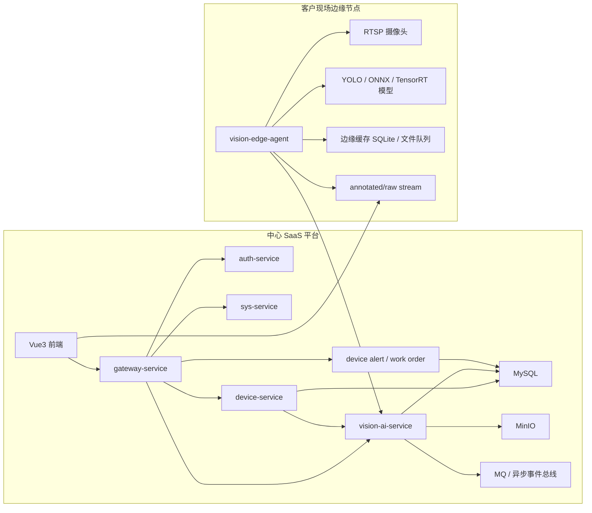

# 智慧厨房管理平台 - 边缘识别 + 中心 SaaS 技术方案文档

## 文档信息

| 项目 | 内容 |
|---|---|
| 文档名称 | 智慧厨房管理平台 - 边缘识别 + 中心 SaaS 技术方案文档 |
| 文档版本 | v1.0 |
| 创建日期 | 2026-06-17 |
| 核心聚焦 | 摄像头识别能力 SaaS 化架构设计 |
| 适用范围 | 架构设计、产品能力规划、后端实施、运维部署 |

---

## 1. 文档概述

### 1.1 设计目标

本方案用于把当前项目中的视频监控识别能力，从“本机外接 YOLO 联调服务”升级为“边缘识别 + 中心 SaaS”标准产品架构，支撑以下目标：

1. 按租户决定是否开通摄像头识别能力。
2. 支持不同客户现场网络条件，不要求所有 RTSP 流回传中心机房。
3. 支持基础版、专业版、企业版套餐能力差异化销售。
4. 支持统一事件上报、工单闭环、审计追踪与证据留存。
5. 支持后续私有化部署与 SaaS 多租户双模式共存。

### 1.2 当前项目现状

结合当前仓库与运行情况，现状如下：

1. 中心平台已具备 `gateway-service`、`auth-service`、`sys-service`、`device-service`、`cook-service` 等标准微服务。
2. 视频监控页面位于前端 `video-monitor` 模块，当前通过 `device-service` 返回 `analysisStreamUrl` 播放识别流。
3. YOLO 识别服务当前位于项目外部目录 `/Users/guanyiru/Desktop/yingzicode/摄像头识别`，通过 `review_app.py` 提供 `annotated.mjpg/raw.mjpg`。
4. 当前识别能力尚未纳入租户能力、套餐、模型管理、边缘节点治理体系。

### 1.3 本次方案边界

本次方案只覆盖“摄像头识别能力”的 SaaS 化，不重构现有采购、仓储、菜谱、晨检等业务服务。

本次方案输出内容包括：

1. 中心 SaaS 与边缘节点总体架构。
2. 识别能力服务拆分与职责边界。
3. 边缘节点接入、流地址分发、事件上报、告警闭环设计。
4. 多租户套餐、能力开关、Nacos 配置规划。
5. 面向当前项目的分阶段实施路线。

---

## 2. 总体架构设计

### 2.1 总体拓扑

### 2.2 分层原则

1. 中心平台负责租户、组织、设备、能力、规则、审计、告警闭环。
2. 边缘节点负责拉流、推理、抽帧、截图、断网缓存、局域网标注流输出。
3. 模型与规则作为“受控配置资产”由中心管理，执行发生在边缘。
4. 摄像头实时播放优先直连边缘节点，避免中心平台承担所有视频转发压力。
5. 告警与整改继续复用现有项目的风险事件、整改工单、派单和统计口径。

---

## 3. 服务职责边界

### 3.1 `device-service`

保留为设备主数据中心，职责如下：

1. 管理摄像头基础档案、组织归属、状态、厂商参数。
2. 管理摄像头与边缘节点的绑定关系。
3. 对前端返回可播放的 `raw` / `annotated` / `playback` 地址。
4. 对接 `vision-ai-service` 查询租户视觉能力与流访问授权。
5. 不负责 YOLO 推理，不负责模型执行，不负责直接处理视频帧。

### 3.2 `vision-ai-service`

新增正式服务，作为中心视觉能力编排服务，职责如下：

1. 维护租户视觉能力开关、套餐限额、模型与规则配置。
2. 维护边缘节点注册、心跳、证书、授权令牌、版本信息。
3. 接收边缘节点上报的检测事件、截图、短视频证据。
4. 进行事件去重、聚合、分级，并桥接到现有告警和整改工单体系。
5. 对 `device-service` 输出可访问的流地址、边缘节点路由信息与播放策略。

### 3.3 `vision-edge-agent`

将当前外部 YOLO 项目升级为标准边缘节点程序，职责如下：

1. 本地连接 RTSP/MJPEG/厂商 SDK 视频源。
2. 执行 YOLO 模型推理、ROI 判断、规则判断。
3. 输出 `annotated.mjpg`、`raw.mjpg`、截图与可选视频片段。
4. 在网络中断时本地缓存待上报事件。
5. 定时向中心上报心跳、事件、截图、节点状态。

### 3.4 前端 `video-monitor`

前端保持现有模块结构，主要改造点如下：

1. 仍通过 `device-service` 拉取监控列表。
2. 不再写死本地 `127.0.0.1` 流地址。
3. 仅根据返回的能力开关和流地址渲染模块。
4. 当租户未开通视觉能力时，页面隐藏识别流、违规识别、行为分析入口。

---

## 4. 核心业务流程

### 4.1 租户开通识别能力流程

1. 平台运营在中心系统为租户开通 `vision` 套餐。
2. `vision-ai-service` 为租户生成默认视觉配置与能力项。
3. 客户现场部署 `vision-edge-agent`，通过节点注册码绑定租户。
4. 设备管理员把摄像头绑定到边缘节点。
5. 前端视频监控页即可读取识别流与事件数据。

### 4.2 实时识别流程

1. 前端访问 `/api/v1/device/monitors/realtime`。
2. `device-service` 查询设备与边缘绑定信息。
3. `device-service` 结合 `vision-ai-service` 的租户能力结果生成 `analysisStreamUrl`。
4. 前端播放器直接请求边缘节点 `annotated` 流。
5. `vision-edge-agent` 持续本地推理并渲染标注结果。

### 4.3 事件上报闭环流程

1. 边缘节点检测到违规事件。
2. 边缘节点本地保存截图，并生成事件批次号 `trace_batch_id`。
3. 边缘节点上报 `vision_detection_event` 到中心。
4. `vision-ai-service` 进行去重、分级、规则补充。
5. 事件桥接进入现有告警中心或整改工单链路。
6. 前端告警页、视频监控页、数据看板统一消费中心事件结果。

### 4.4 模型与规则下发流程

1. 平台在中心维护模型版本、规则模板、阈值。
2. 边缘节点心跳时拉取变更摘要。
3. 边缘节点按版本号下载或切换本地模型。
4. 新规则生效后边缘节点重载执行参数，不影响中心业务服务。

---

## 5. 多租户与安全设计

### 5.1 多租户隔离原则

1. 所有视觉相关表必须带 `tenant_id`。
2. 边缘节点只允许绑定一个租户。
3. 摄像头绑定、事件查询、截图访问全部受 `tenant_id + org_id` 数据权限控制。
4. 公共模型与租户专属模型通过 `tenant_id=0` 与 `tenant_id=实际租户` 区分。

### 5.2 边缘节点认证

1. 每个边缘节点发放独立 `agent_token`。
2. 所有边缘上报接口要求 `node_code + tenant_id + 签名`。
3. 中心可远程吊销节点令牌并标记节点失效。
4. 流播放地址建议采用短时签名 URL 或中心签发访问票据。

### 5.3 证据与审计

1. 截图与视频片段统一存储到 MinIO。
2. 事件、工单、流地址访问、边缘节点操作均保留审计日志。
3. 所有跨服务链路必须带 `traceId` 与 `trace_batch_id`。

---

## 6. 部署设计

### 6.1 中心 SaaS 部署

中心平台维持当前 Spring Cloud 微服务架构：

1. `gateway-service`
2. `auth-service`
3. `sys-service`
4. `device-service`
5. `vision-ai-service`（新增）
6. MySQL
7. MinIO
8. Nacos

### 6.2 边缘节点部署

边缘节点建议单机部署：

1. `vision-edge-agent`
2. 模型文件目录
3. 本地缓存目录
4. 可选 FFmpeg / 视频转码工具

部署方式建议：

1. Linux 边缘工控机或现场小主机。
2. Docker Compose 或 systemd 服务。
3. 独立端口输出 `annotated/raw/health`。

---

## 7. 与当前项目的衔接改造

### 7.1 当前临时模式

当前项目中 `device-service` 使用 `vision-stream.base-url` 生成识别流地址，属于单机联调口径。

### 7.2 目标模式

目标改造为：

1. `device-service` 不再依赖固定 `vision-stream.base-url`。
2. 每个摄像头通过 `device_vision_binding` 找到所属边缘节点。
3. `analysisStreamUrl` 动态拼接为边缘节点实际可访问地址。
4. 事件数据改为中心入库，不再只停留在本地 `review_app.py`。

---

## 8. 分阶段实施建议

### 阶段一：联调标准化

1. 把当前外部 YOLO 项目封装成 `vision-edge-agent`。
2. 新建 `vision-ai-service` 空壳服务。
3. 引入租户能力、边缘节点、设备绑定三类基础表。

### 阶段二：中心编排化

1. 实现边缘节点注册、心跳、事件上报。
2. `device-service` 改为动态流地址分发。
3. 打通告警、整改工单闭环。

### 阶段三：产品化

1. 上线套餐、能力开关、配额控制。
2. 上线模型版本与规则模板管理。
3. 支持企业版专属模型与边缘节点集群。

---

## 9. 风险与约束

1. 客户现场网络与 NAT 环境复杂，流直连策略需要分局域网和中心代理两种模式。
2. 边缘节点硬件性能决定可支持摄像头数量，必须纳入套餐配额与节点健康管理。
3. 若后续支持私有模型训练，需要额外建设模型上传、审核、灰度发布机制。
4. 当前项目仍是共享数据库架构，本方案默认延续该事实，不引入跨库分布式事务。

---

## 10. 结论

基于当前项目实际情况，摄像头识别能力的正确 SaaS 方向不是把 YOLO 推理并入 `device-service`，而是：

1. 中心平台新增 `vision-ai-service` 负责能力编排。
2. 客户现场部署 `vision-edge-agent` 负责推理执行。
3. `device-service` 负责播放地址和设备绑定管理。
4. 租户能力、套餐、模型、规则和告警闭环全部纳入中心治理体系。

这套模式既兼容当前联调结构，也适合后续商业化交付、私有化和多租户 SaaS 统一演进。
