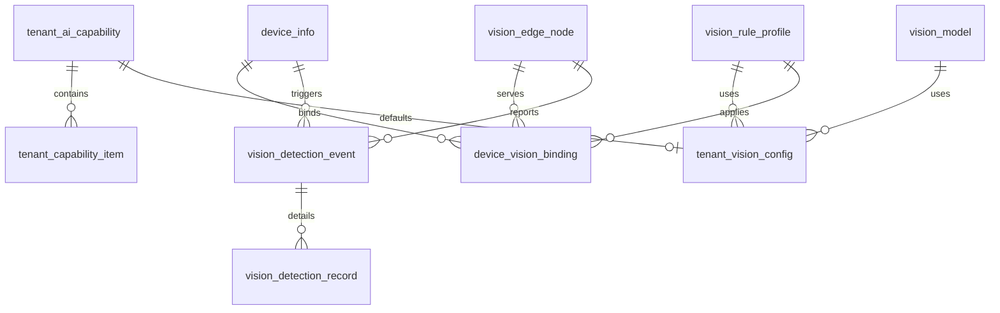

# 智慧厨房管理平台 - 边缘识别 + 中心 SaaS 数据库设计文档

## 文档信息

| 项目 | 内容 |
|---|---|
| 文档名称 | 智慧厨房管理平台 - 边缘识别 + 中心 SaaS 数据库设计文档 |
| 文档版本 | v1.0 |
| 创建日期 | 2026-06-17 |
| 技术栈 | Spring Boot 3.2 + MyBatis Plus + MySQL 8.0 |
| 适用范围 | 视觉能力服务、设备服务、套餐能力、边缘节点治理 |

---

## 1. 设计原则

### 1.1 表设计原则

1. 延续当前项目“共享数据库 + 服务前缀”模式。
2. 视觉能力新增表统一使用 `vision_` 前缀。
3. 所有与租户业务数据相关的表必须带 `tenant_id`。
4. 所有与设备、组织、工单联动的数据必须可通过 `device_id / org_id / trace_batch_id` 追溯。
5. 事件明细与聚合结果分表设计，避免高频帧结果污染主事件表。

### 1.2 与现有表的关系

1. 复用现有 `device_info` 作为摄像头主表。
2. 复用现有 `sys_org`、`auth_user`、工单与告警相关表。
3. 新增视觉能力、边缘节点、绑定关系、模型、规则、事件、证据配置表。

---

## 2. 核心实体关系



---

## 3. 表结构设计

## 3.1 租户视觉能力主表

```sql
CREATE TABLE `tenant_ai_capability` (
  `id` BIGINT NOT NULL AUTO_INCREMENT COMMENT '主键ID',
  `tenant_id` BIGINT NOT NULL COMMENT '租户ID',
  `vision_enabled` TINYINT NOT NULL DEFAULT 0 COMMENT '是否开通视觉识别能力',
  `vision_plan_code` VARCHAR(50) NOT NULL DEFAULT 'BASE' COMMENT '套餐编码',
  `max_camera_count` INT NOT NULL DEFAULT 0 COMMENT '允许接入摄像头数量',
  `max_edge_node_count` INT NOT NULL DEFAULT 0 COMMENT '允许接入边缘节点数量',
  `model_customizable` TINYINT NOT NULL DEFAULT 0 COMMENT '是否支持自定义模型',
  `history_retention_days` INT NOT NULL DEFAULT 30 COMMENT '证据保留天数',
  `billing_status` VARCHAR(20) NOT NULL DEFAULT 'inactive' COMMENT '计费状态',
  `effective_from` DATETIME DEFAULT NULL COMMENT '生效时间',
  `effective_to` DATETIME DEFAULT NULL COMMENT '到期时间',
  `remark` VARCHAR(500) DEFAULT NULL COMMENT '备注',
  `created_by` BIGINT DEFAULT NULL COMMENT '创建人',
  `created_at` DATETIME NOT NULL DEFAULT CURRENT_TIMESTAMP COMMENT '创建时间',
  `updated_by` BIGINT DEFAULT NULL COMMENT '更新人',
  `updated_at` DATETIME NOT NULL DEFAULT CURRENT_TIMESTAMP ON UPDATE CURRENT_TIMESTAMP COMMENT '更新时间',
  `deleted` TINYINT NOT NULL DEFAULT 0 COMMENT '逻辑删除',
  PRIMARY KEY (`id`),
  UNIQUE KEY `uk_tenant_ai_capability_tenant` (`tenant_id`, `deleted`),
  KEY `idx_tenant_ai_capability_plan` (`vision_plan_code`),
  KEY `idx_tenant_ai_capability_status` (`billing_status`)
) ENGINE=InnoDB DEFAULT CHARSET=utf8mb4 COMMENT='租户AI能力主表';
```

## 3.2 租户能力项明细表

```sql
CREATE TABLE `tenant_capability_item` (
  `id` BIGINT NOT NULL AUTO_INCREMENT COMMENT '主键ID',
  `tenant_id` BIGINT NOT NULL COMMENT '租户ID',
  `capability_code` VARCHAR(100) NOT NULL COMMENT '能力编码',
  `enabled` TINYINT NOT NULL DEFAULT 0 COMMENT '是否启用',
  `quota_value` VARCHAR(100) DEFAULT NULL COMMENT '配额值',
  `config_json` JSON DEFAULT NULL COMMENT '能力扩展配置',
  `created_at` DATETIME NOT NULL DEFAULT CURRENT_TIMESTAMP COMMENT '创建时间',
  `updated_at` DATETIME NOT NULL DEFAULT CURRENT_TIMESTAMP ON UPDATE CURRENT_TIMESTAMP COMMENT '更新时间',
  `deleted` TINYINT NOT NULL DEFAULT 0 COMMENT '逻辑删除',
  PRIMARY KEY (`id`),
  UNIQUE KEY `uk_tenant_capability_item` (`tenant_id`, `capability_code`, `deleted`),
  KEY `idx_tenant_capability_item_enabled` (`enabled`)
) ENGINE=InnoDB DEFAULT CHARSET=utf8mb4 COMMENT='租户能力项明细表';
```

建议能力编码：

1. `vision.realtime.detect`
2. `vision.annotated.stream`
3. `vision.snapshot.evidence`
4. `vision.video.clip`
5. `vision.custom.model`
6. `vision.rule.customize`
7. `vision.edge.multi-node`
8. `vision.report.analytics`

## 3.3 租户视觉默认配置表

```sql
CREATE TABLE `tenant_vision_config` (
  `id` BIGINT NOT NULL AUTO_INCREMENT COMMENT '主键ID',
  `tenant_id` BIGINT NOT NULL COMMENT '租户ID',
  `default_model_id` BIGINT DEFAULT NULL COMMENT '默认模型ID',
  `default_rule_profile_id` BIGINT DEFAULT NULL COMMENT '默认规则模板ID',
  `push_mode` VARCHAR(20) NOT NULL DEFAULT 'edge_push' COMMENT '上报模式',
  `snapshot_upload_enabled` TINYINT NOT NULL DEFAULT 1 COMMENT '是否允许上传截图',
  `video_clip_upload_enabled` TINYINT NOT NULL DEFAULT 0 COMMENT '是否允许上传视频片段',
  `annotated_stream_enabled` TINYINT NOT NULL DEFAULT 1 COMMENT '是否允许标注流',
  `confidence_threshold` DECIMAL(5,4) NOT NULL DEFAULT 0.6000 COMMENT '默认置信度阈值',
  `frame_interval_ms` INT NOT NULL DEFAULT 500 COMMENT '默认抽帧间隔',
  `status` VARCHAR(20) NOT NULL DEFAULT 'active' COMMENT '状态',
  `created_at` DATETIME NOT NULL DEFAULT CURRENT_TIMESTAMP COMMENT '创建时间',
  `updated_at` DATETIME NOT NULL DEFAULT CURRENT_TIMESTAMP ON UPDATE CURRENT_TIMESTAMP COMMENT '更新时间',
  `deleted` TINYINT NOT NULL DEFAULT 0 COMMENT '逻辑删除',
  PRIMARY KEY (`id`),
  UNIQUE KEY `uk_tenant_vision_config_tenant` (`tenant_id`, `deleted`),
  KEY `idx_tenant_vision_config_model` (`default_model_id`),
  KEY `idx_tenant_vision_config_rule` (`default_rule_profile_id`)
) ENGINE=InnoDB DEFAULT CHARSET=utf8mb4 COMMENT='租户视觉默认配置表';
```

## 3.4 边缘节点表

```sql
CREATE TABLE `vision_edge_node` (
  `id` BIGINT NOT NULL AUTO_INCREMENT COMMENT '主键ID',
  `tenant_id` BIGINT NOT NULL COMMENT '租户ID',
  `node_code` VARCHAR(64) NOT NULL COMMENT '节点编码',
  `node_name` VARCHAR(100) NOT NULL COMMENT '节点名称',
  `site_name` VARCHAR(100) DEFAULT NULL COMMENT '部署站点名称',
  `lan_base_url` VARCHAR(255) DEFAULT NULL COMMENT '局域网访问基础地址',
  `wan_callback_url` VARCHAR(255) DEFAULT NULL COMMENT '边缘节点回调地址',
  `agent_version` VARCHAR(50) DEFAULT NULL COMMENT 'Agent版本',
  `auth_token` VARCHAR(255) NOT NULL COMMENT '节点认证令牌',
  `last_heartbeat_at` DATETIME DEFAULT NULL COMMENT '最后心跳时间',
  `online_status` VARCHAR(20) NOT NULL DEFAULT 'offline' COMMENT '在线状态',
  `status` VARCHAR(20) NOT NULL DEFAULT 'active' COMMENT '业务状态',
  `capability_json` JSON DEFAULT NULL COMMENT '节点能力描述',
  `remark` VARCHAR(500) DEFAULT NULL COMMENT '备注',
  `created_at` DATETIME NOT NULL DEFAULT CURRENT_TIMESTAMP COMMENT '创建时间',
  `updated_at` DATETIME NOT NULL DEFAULT CURRENT_TIMESTAMP ON UPDATE CURRENT_TIMESTAMP COMMENT '更新时间',
  `deleted` TINYINT NOT NULL DEFAULT 0 COMMENT '逻辑删除',
  PRIMARY KEY (`id`),
  UNIQUE KEY `uk_vision_edge_node_code` (`node_code`, `deleted`),
  KEY `idx_vision_edge_node_tenant` (`tenant_id`),
  KEY `idx_vision_edge_node_online` (`online_status`)
) ENGINE=InnoDB DEFAULT CHARSET=utf8mb4 COMMENT='视觉边缘节点表';
```

## 3.5 摄像头与视觉绑定表

```sql
CREATE TABLE `device_vision_binding` (
  `id` BIGINT NOT NULL AUTO_INCREMENT COMMENT '主键ID',
  `tenant_id` BIGINT NOT NULL COMMENT '租户ID',
  `org_id` BIGINT NOT NULL COMMENT '组织ID',
  `device_id` BIGINT NOT NULL COMMENT '设备ID',
  `edge_node_id` BIGINT NOT NULL COMMENT '边缘节点ID',
  `vision_enabled` TINYINT NOT NULL DEFAULT 1 COMMENT '是否启用视觉识别',
  `stream_source_url` VARCHAR(500) NOT NULL COMMENT '实际视频源地址',
  `stream_protocol` VARCHAR(20) NOT NULL DEFAULT 'rtsp' COMMENT '流协议',
  `annotated_stream_path` VARCHAR(255) DEFAULT '/annotated.mjpg' COMMENT '标注流路径',
  `raw_stream_path` VARCHAR(255) DEFAULT '/raw.mjpg' COMMENT '原始流路径',
  `rule_profile_id` BIGINT DEFAULT NULL COMMENT '规则模板ID',
  `roi_config_json` JSON DEFAULT NULL COMMENT 'ROI区域配置',
  `status` VARCHAR(20) NOT NULL DEFAULT 'active' COMMENT '状态',
  `created_at` DATETIME NOT NULL DEFAULT CURRENT_TIMESTAMP COMMENT '创建时间',
  `updated_at` DATETIME NOT NULL DEFAULT CURRENT_TIMESTAMP ON UPDATE CURRENT_TIMESTAMP COMMENT '更新时间',
  `deleted` TINYINT NOT NULL DEFAULT 0 COMMENT '逻辑删除',
  PRIMARY KEY (`id`),
  UNIQUE KEY `uk_device_vision_binding_device` (`device_id`, `deleted`),
  KEY `idx_device_vision_binding_tenant` (`tenant_id`),
  KEY `idx_device_vision_binding_edge_node` (`edge_node_id`),
  KEY `idx_device_vision_binding_org` (`org_id`)
) ENGINE=InnoDB DEFAULT CHARSET=utf8mb4 COMMENT='摄像头视觉绑定表';
```

## 3.6 模型管理表

```sql
CREATE TABLE `vision_model` (
  `id` BIGINT NOT NULL AUTO_INCREMENT COMMENT '主键ID',
  `tenant_id` BIGINT NOT NULL DEFAULT 0 COMMENT '租户ID，0表示平台公共模型',
  `model_code` VARCHAR(64) NOT NULL COMMENT '模型编码',
  `model_name` VARCHAR(100) NOT NULL COMMENT '模型名称',
  `model_type` VARCHAR(50) NOT NULL COMMENT '模型类别',
  `framework` VARCHAR(50) NOT NULL COMMENT '模型框架',
  `storage_path` VARCHAR(500) NOT NULL COMMENT '模型存储路径',
  `version` VARCHAR(50) NOT NULL COMMENT '模型版本',
  `status` VARCHAR(20) NOT NULL DEFAULT 'draft' COMMENT '状态',
  `checksum` VARCHAR(128) DEFAULT NULL COMMENT '校验值',
  `remark` VARCHAR(500) DEFAULT NULL COMMENT '备注',
  `created_at` DATETIME NOT NULL DEFAULT CURRENT_TIMESTAMP COMMENT '创建时间',
  `updated_at` DATETIME NOT NULL DEFAULT CURRENT_TIMESTAMP ON UPDATE CURRENT_TIMESTAMP COMMENT '更新时间',
  `deleted` TINYINT NOT NULL DEFAULT 0 COMMENT '逻辑删除',
  PRIMARY KEY (`id`),
  UNIQUE KEY `uk_vision_model_code_version` (`tenant_id`, `model_code`, `version`, `deleted`),
  KEY `idx_vision_model_status` (`status`)
) ENGINE=InnoDB DEFAULT CHARSET=utf8mb4 COMMENT='视觉模型管理表';
```

## 3.7 规则模板表

```sql
CREATE TABLE `vision_rule_profile` (
  `id` BIGINT NOT NULL AUTO_INCREMENT COMMENT '主键ID',
  `tenant_id` BIGINT NOT NULL DEFAULT 0 COMMENT '租户ID，0表示平台模板',
  `profile_code` VARCHAR(64) NOT NULL COMMENT '模板编码',
  `profile_name` VARCHAR(100) NOT NULL COMMENT '模板名称',
  `scene_type` VARCHAR(50) NOT NULL COMMENT '场景类型',
  `rule_json` JSON NOT NULL COMMENT '规则配置',
  `status` VARCHAR(20) NOT NULL DEFAULT 'active' COMMENT '状态',
  `remark` VARCHAR(500) DEFAULT NULL COMMENT '备注',
  `created_at` DATETIME NOT NULL DEFAULT CURRENT_TIMESTAMP COMMENT '创建时间',
  `updated_at` DATETIME NOT NULL DEFAULT CURRENT_TIMESTAMP ON UPDATE CURRENT_TIMESTAMP COMMENT '更新时间',
  `deleted` TINYINT NOT NULL DEFAULT 0 COMMENT '逻辑删除',
  PRIMARY KEY (`id`),
  UNIQUE KEY `uk_vision_rule_profile_code` (`tenant_id`, `profile_code`, `deleted`),
  KEY `idx_vision_rule_profile_scene` (`scene_type`)
) ENGINE=InnoDB DEFAULT CHARSET=utf8mb4 COMMENT='视觉规则模板表';
```

## 3.8 视觉事件主表

```sql
CREATE TABLE `vision_detection_event` (
  `id` BIGINT NOT NULL AUTO_INCREMENT COMMENT '主键ID',
  `tenant_id` BIGINT NOT NULL COMMENT '租户ID',
  `org_id` BIGINT NOT NULL COMMENT '组织ID',
  `device_id` BIGINT NOT NULL COMMENT '设备ID',
  `edge_node_id` BIGINT NOT NULL COMMENT '边缘节点ID',
  `event_code` VARCHAR(64) NOT NULL COMMENT '事件编码',
  `event_type` VARCHAR(50) NOT NULL COMMENT '事件类型',
  `risk_level` VARCHAR(20) NOT NULL COMMENT '风险等级',
  `trace_batch_id` VARCHAR(64) NOT NULL COMMENT '批次追踪号',
  `captured_at` DATETIME NOT NULL COMMENT '识别时间',
  `confidence` DECIMAL(5,4) DEFAULT NULL COMMENT '置信度',
  `bbox_json` JSON DEFAULT NULL COMMENT '目标框信息',
  `snapshot_url` VARCHAR(500) DEFAULT NULL COMMENT '截图地址',
  `video_clip_url` VARCHAR(500) DEFAULT NULL COMMENT '片段地址',
  `handle_status` VARCHAR(20) NOT NULL DEFAULT 'pending' COMMENT '处理状态',
  `source_type` VARCHAR(20) NOT NULL DEFAULT 'edge_ai' COMMENT '来源类型',
  `alarm_id` BIGINT DEFAULT NULL COMMENT '关联告警ID',
  `dispatch_id` BIGINT DEFAULT NULL COMMENT '关联派单ID',
  `extra_json` JSON DEFAULT NULL COMMENT '扩展信息',
  `created_at` DATETIME NOT NULL DEFAULT CURRENT_TIMESTAMP COMMENT '创建时间',
  `updated_at` DATETIME NOT NULL DEFAULT CURRENT_TIMESTAMP ON UPDATE CURRENT_TIMESTAMP COMMENT '更新时间',
  `deleted` TINYINT NOT NULL DEFAULT 0 COMMENT '逻辑删除',
  PRIMARY KEY (`id`),
  UNIQUE KEY `uk_vision_detection_event_code` (`event_code`, `deleted`),
  KEY `idx_vision_detection_event_tenant_time` (`tenant_id`, `captured_at`),
  KEY `idx_vision_detection_event_device_time` (`device_id`, `captured_at`),
  KEY `idx_vision_detection_event_trace` (`trace_batch_id`),
  KEY `idx_vision_detection_event_handle_status` (`handle_status`)
) ENGINE=InnoDB DEFAULT CHARSET=utf8mb4 COMMENT='视觉识别事件主表';
```

## 3.9 视觉帧明细表

```sql
CREATE TABLE `vision_detection_record` (
  `id` BIGINT NOT NULL AUTO_INCREMENT COMMENT '主键ID',
  `tenant_id` BIGINT NOT NULL COMMENT '租户ID',
  `event_id` BIGINT NOT NULL COMMENT '主事件ID',
  `device_id` BIGINT NOT NULL COMMENT '设备ID',
  `trace_batch_id` VARCHAR(64) NOT NULL COMMENT '批次追踪号',
  `frame_seq_no` INT NOT NULL COMMENT '帧序号',
  `frame_time` DATETIME NOT NULL COMMENT '帧时间',
  `detections_json` JSON NOT NULL COMMENT '检测结果明细',
  `snapshot_url` VARCHAR(500) DEFAULT NULL COMMENT '帧截图地址',
  `created_at` DATETIME NOT NULL DEFAULT CURRENT_TIMESTAMP COMMENT '创建时间',
  `deleted` TINYINT NOT NULL DEFAULT 0 COMMENT '逻辑删除',
  PRIMARY KEY (`id`),
  KEY `idx_vision_detection_record_event` (`event_id`),
  KEY `idx_vision_detection_record_trace` (`trace_batch_id`),
  KEY `idx_vision_detection_record_device_time` (`device_id`, `frame_time`)
) ENGINE=InnoDB DEFAULT CHARSET=utf8mb4 COMMENT='视觉识别帧明细表';
```

---

## 4. 建议的现有表扩展

### 4.1 `device_info`

建议不把模型、规则、边缘地址直接堆进 `device_info`，只保留设备原始主数据。

如需增强字段，可仅新增：

1. `vision_enabled_snapshot`：便于列表快速筛选。
2. `edge_node_id_snapshot`：便于设备列表快速聚合。

正式配置仍以 `device_vision_binding` 为准。

### 4.2 告警/工单表

现有整改工单链路建议增加以下可选关联字段：

1. `source_type`
2. `source_event_id`
3. `trace_batch_id`

用于从视觉事件精准回跳。

---

## 5. 初始化数据建议

### 5.1 平台公共模型

1. 平台默认模型：厨房行为识别基础模型
2. `tenant_id = 0`
3. `model_code = kitchen-yolo-base`

### 5.2 平台公共规则模板

1. 未戴帽子
2. 未穿工服
3. 鼠患疑似
4. 台面脏污
5. 区域越界

### 5.3 套餐基础能力

在 `tenant_capability_item` 预置以下模板：

1. `BASE`
2. `VISION_BASIC`
3. `VISION_PRO`
4. `VISION_ENTERPRISE`

---

## 6. 索引与性能建议

1. `vision_detection_event` 以 `tenant_id + captured_at` 为核心查询索引。
2. `vision_detection_record` 只保留必要明细，避免无限膨胀。
3. 长期事件建议按月归档。
4. MinIO 中截图与视频片段采用 `tenant_id/date/device_id` 路径分层。

---

## 7. 实施顺序建议

1. 先落 `tenant_ai_capability`、`tenant_vision_config`、`vision_edge_node`、`device_vision_binding`。
2. 再落 `vision_model`、`vision_rule_profile`。
3. 最后落 `vision_detection_event`、`vision_detection_record` 并对接告警闭环。

---

## 8. 结论

本数据库方案延续当前项目共享数据库事实，同时把视觉识别能力拆成：

1. 租户能力层
2. 边缘节点层
3. 摄像头绑定层
4. 模型规则层
5. 事件结果层

这样既能满足 SaaS 套餐和能力控制，又不会破坏现有 `device-service` 与告警工单业务链路。
